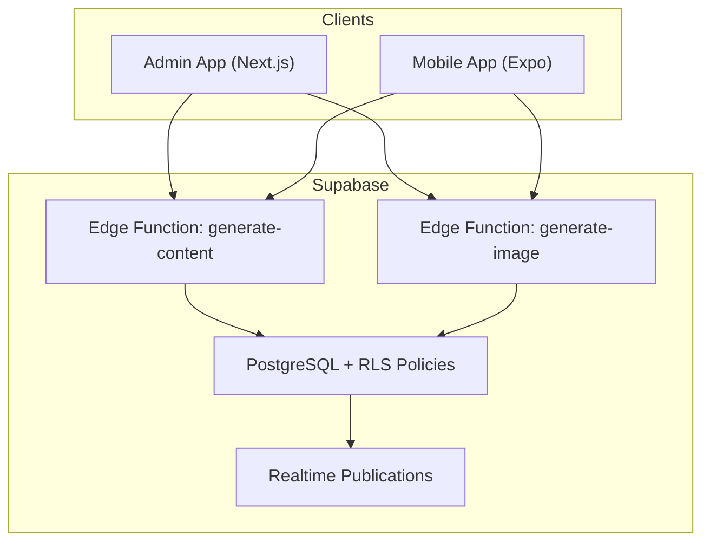
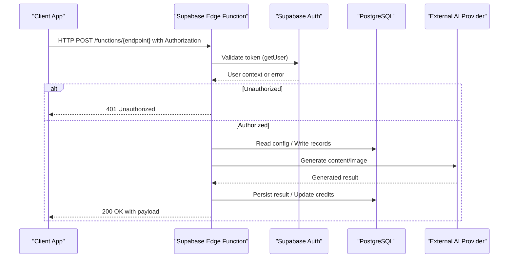
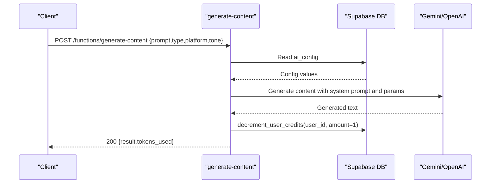
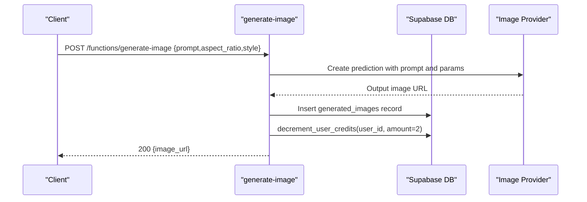
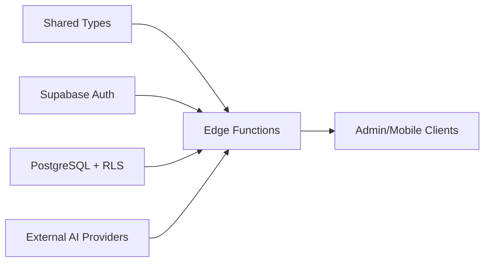

# API Reference

<cite>
**Referenced Files in This Document**
- [generate-content/index.ts](file://supabase/functions/generate-content/index.ts)
- [generate-image/index.ts](file://supabase/functions/generate-image/index.ts)
- [20240001000000_initial_schema.sql](file://supabase/migrations/20240001000000_initial_schema.sql)
- [api.ts](file://packages/types/src/api.ts)
- [auth.ts](file://packages/types/src/auth.ts)
- [database.ts](file://packages/types/src/database.ts)
- [supabase.ts (mobile)](file://apps/mobile/src/services/supabase.ts)
- [supabase.ts (admin)](file://apps/admin/src/lib/supabase.ts)
</cite>

## Table of Contents
1. Introduction
2. Project Structure
3. Core Components
4. Architecture Overview
5. Detailed Component Analysis
6. Dependency Analysis
7. Performance Considerations
8. Troubleshooting Guide
9. Conclusion
10. Appendices

## Introduction
This document provides a comprehensive API reference for SocialPilot AI Pro, focusing on:
- RESTful endpoints exposed via Supabase Edge Functions for content generation and image generation
- Authentication and authorization model using Supabase Auth and Row Level Security
- Data models and schemas used across the system
- Real-time capabilities enabled by Supabase Realtime publications
- Client integration patterns for both mobile and admin applications

Where applicable, this guide includes request/response schemas, authentication requirements, error handling, and best practices.

## Project Structure
SocialPilot AI Pro is a monorepo with:
- apps/admin: Next.js admin dashboard
- apps/mobile: React Native/Expo mobile app
- packages/types: Shared TypeScript types for API and database entities
- supabase: Database schema, migrations, and Edge Functions for serverless APIs

**Diagram sources**
- [generate-content/index.ts:1-99](file://supabase/functions/generate-content/index.ts#L1-L99)
- [generate-image/index.ts:1-87](file://supabase/functions/generate-image/index.ts#L1-L87)
- [20240001000000_initial_schema.sql:157-232](file://supabase/migrations/20240001000000_initial_schema.sql#L157-L232)

**Section sources**
- [generate-content/index.ts:1-99](file://supabase/functions/generate-content/index.ts#L1-L99)
- [generate-image/index.ts:1-87](file://supabase/functions/generate-image/index.ts#L1-L87)
- [20240001000000_initial_schema.sql:157-232](file://supabase/migrations/20240001000000_initial_schema.sql#L157-L232)

## Core Components
- Authentication: All requests to Edge Functions require a valid Authorization header carrying a Supabase JWT. The functions validate the user via Supabase Auth.
- Content Generation: A serverless function that calls an external LLM provider based on configuration and returns generated text.
- Image Generation: A serverless function that calls an image model provider and stores results in the database.
- Data Models: Shared types define request/response shapes and database entities.
- Realtime: Certain tables are published for real-time updates.

**Section sources**
- [generate-content/index.ts:14-27](file://supabase/functions/generate-content/index.ts#L14-L27)
- [generate-image/index.ts:14-27](file://supabase/functions/generate-image/index.ts#L14-L27)
- [api.ts:1-34](file://packages/types/src/api.ts#L1-L34)
- [database.ts:1-73](file://packages/types/src/database.ts#L1-L73)
- [20240001000000_initial_schema.sql:227-232](file://supabase/migrations/20240001000000_initial_schema.sql#L227-L232)

## Architecture Overview
The API surface is implemented as Supabase Edge Functions. Clients authenticate via Supabase Auth and call these functions over HTTPS. The functions enforce authorization, interact with external AI providers, and persist data through Supabase client libraries.

**Diagram sources**
- [generate-content/index.ts:14-91](file://supabase/functions/generate-content/index.ts#L14-L91)
- [generate-image/index.ts:14-79](file://supabase/functions/generate-image/index.ts#L14-L79)

## Detailed Component Analysis

### Authentication and Authorization
- All Edge Functions validate the caller’s identity using Supabase Auth. Requests must include a valid Authorization header containing a JWT issued by Supabase.
- If authentication fails, the function returns a 401 Unauthorized response.
- Row Level Security (RLS) policies restrict access to rows based on user identity and roles.

Key behaviors:
- Unauthenticated requests receive 401 responses from the function layer.
- RLS policies ensure users can only access their own data unless they have admin privileges.

**Section sources**
- [generate-content/index.ts:14-27](file://supabase/functions/generate-content/index.ts#L14-L27)
- [generate-image/index.ts:14-27](file://supabase/functions/generate-image/index.ts#L14-L27)
- [20240001000000_initial_schema.sql:157-202](file://supabase/migrations/20240001000000_initial_schema.sql#L157-L202)

### REST API: Content Generation
Endpoint: Supabase Edge Function for generating text content.

- Method: POST
- URL pattern: /functions/generate-content
- Authentication: Required (Authorization header with JWT)
- Request body fields:
  - prompt: string (required)
  - type: string (AIContentType; required)
  - platform: string (optional; default 'instagram')
  - tone: string (optional; default 'Professional')
- Response fields:
  - result: string
  - tokens_used: number
- Error codes:
  - 400: Missing or invalid prompt
  - 401: Unauthorized (invalid or missing token)
  - 500: Server error (provider or internal failure)

Notes:
- The function reads AI configuration from the database to determine provider settings and parameters.
- It decrements user credits via a database RPC after successful generation.

**Diagram sources**
- [generate-content/index.ts:29-91](file://supabase/functions/generate-content/index.ts#L29-L91)

**Section sources**
- [generate-content/index.ts:1-99](file://supabase/functions/generate-content/index.ts#L1-L99)
- [api.ts:3-16](file://packages/types/src/api.ts#L3-L16)
- [database.ts:3-5](file://packages/types/src/database.ts#L3-L5)

### REST API: Image Generation
Endpoint: Supabase Edge Function for generating images.

- Method: POST
- URL pattern: /functions/generate-image
- Authentication: Required (Authorization header with JWT)
- Request body fields:
  - prompt: string (required)
  - aspect_ratio: string (optional; default '1:1')
  - style: string (optional; default 'Photorealistic')
- Response fields:
  - image_url: string
- Error codes:
  - 400: Missing visual prompt
  - 401: Unauthorized
  - 500: Server error

Notes:
- The function optionally calls an external image provider; if unavailable, it returns a placeholder image URL.
- Results are persisted to a generated_images table and user credits are decremented.

**Diagram sources**
- [generate-image/index.ts:29-79](file://supabase/functions/generate-image/index.ts#L29-L79)

**Section sources**
- [generate-image/index.ts:1-87](file://supabase/functions/generate-image/index.ts#L1-L87)
- [api.ts:18-27](file://packages/types/src/api.ts#L18-L27)

### Data Models and Schemas
Shared types define consistent request/response structures and database entities across clients and services.

- API types:
  - GenerateTextRequest, GenerateTextResponse
  - GenerateImageRequest, GenerateImageResponse
  - ApiResponse<T>
- Database types:
  - PlatformType, PostStatus, AIContentType
  - Post, PostTemplate, AppConfig, AIConfig, AnalyticsMetric
- Auth types:
  - UserRole, SubscriptionTier, UserProfile, AuthSessionState

These types inform the expected shape of payloads and responses for API consumers.

**Section sources**
- [api.ts:1-34](file://packages/types/src/api.ts#L1-L34)
- [database.ts:1-73](file://packages/types/src/database.ts#L1-L73)
- [auth.ts:1-25](file://packages/types/src/auth.ts#L1-L25)

### Realtime Capabilities
Certain tables are published for real-time updates, enabling live features such as notifications and post status changes.

Published tables:
- app_config
- posts
- notifications
- templates

Clients can subscribe to these channels to receive live events when rows change.

**Section sources**
- [20240001000000_initial_schema.sql:227-232](file://supabase/migrations/20240001000000_initial_schema.sql#L227-L232)

### Client Integration Patterns
Both mobile and admin apps integrate with Supabase for authentication and data access.

- Mobile app:
  - Uses Supabase client with secure storage and session persistence.
  - Environment variables configure Supabase URL and anon key.
- Admin app:
  - Uses Supabase client with session persistence and auto-refresh.

These configurations support authenticated calls to Edge Functions and direct database operations governed by RLS.

**Section sources**
- [supabase.ts (mobile):1-40](file://apps/mobile/src/services/supabase.ts#L1-L40)
- [supabase.ts (admin):1-13](file://apps/admin/src/lib/supabase.ts#L1-L13)

## Dependency Analysis
The API surface depends on:
- Supabase Auth for identity verification
- Supabase PostgreSQL for persistence and RLS enforcement
- External AI providers for content and image generation
- Shared TypeScript types for consistent contracts

**Diagram sources**
- [api.ts:1-34](file://packages/types/src/api.ts#L1-L34)
- [generate-content/index.ts:14-91](file://supabase/functions/generate-content/index.ts#L14-L91)
- [generate-image/index.ts:14-79](file://supabase/functions/generate-image/index.ts#L14-L79)

**Section sources**
- [api.ts:1-34](file://packages/types/src/api.ts#L1-L34)
- [generate-content/index.ts:14-91](file://supabase/functions/generate-content/index.ts#L14-L91)
- [generate-image/index.ts:14-79](file://supabase/functions/generate-image/index.ts#L14-L79)

## Performance Considerations
- Token usage and credit accounting: Each generation operation decrements user credits to track usage and enforce limits.
- External provider latency: Calls to AI providers may introduce latency; consider retry logic and timeouts at the client level.
- Database writes: Persisting results and updating analytics should be batched where possible to reduce write contention.
- Caching: Reuse generated content or images when appropriate to minimize redundant calls.

[No sources needed since this section provides general guidance]

## Troubleshooting Guide
Common issues and resolutions:
- 401 Unauthorized: Ensure the Authorization header contains a valid Supabase JWT. Verify client-side auth state and token refresh behavior.
- 400 Bad Request: Check that required fields (e.g., prompt) are present and correctly typed.
- 500 Internal Server Error: Inspect logs for provider errors or database failures. Confirm environment secrets (API keys) are configured.

Error handling patterns:
- Functions return JSON error objects with descriptive messages.
- Clients should handle network errors, retries, and user-facing feedback gracefully.

**Section sources**
- [generate-content/index.ts:21-36](file://supabase/functions/generate-content/index.ts#L21-L36)
- [generate-image/index.ts:21-36](file://supabase/functions/generate-image/index.ts#L21-L36)
- [generate-content/index.ts:92-97](file://supabase/functions/generate-content/index.ts#L92-L97)
- [generate-image/index.ts:80-85](file://supabase/functions/generate-image/index.ts#L80-L85)

## Conclusion
SocialPilot AI Pro exposes a minimal but powerful API surface via Supabase Edge Functions for content and image generation. Authentication and authorization are enforced at the function layer and reinforced by database-level RLS policies. Shared types provide clear contracts for clients, while realtime publications enable live updates. Clients should implement robust error handling, respect rate limits and credit accounting, and follow best practices for secure authentication and resilient integrations.

[No sources needed since this section summarizes without analyzing specific files]

## Appendices

### Endpoint Summary
- POST /functions/generate-content
  - Auth: Required (JWT)
  - Request: prompt, type, platform?, tone?
  - Response: result, tokens_used
  - Errors: 400, 401, 500
- POST /functions/generate-image
  - Auth: Required (JWT)
  - Request: prompt, aspect_ratio?, style?
  - Response: image_url
  - Errors: 400, 401, 500

**Section sources**
- [generate-content/index.ts:29-91](file://supabase/functions/generate-content/index.ts#L29-L91)
- [generate-image/index.ts:29-79](file://supabase/functions/generate-image/index.ts#L29-L79)

### Rate Limiting and Security Notes
- Rate limiting: Not explicitly implemented in the provided code. Consider adding middleware or provider-level throttling to protect against abuse.
- Security:
  - Always validate and sanitize inputs.
  - Use environment variables for secrets (API keys).
  - Enforce RLS policies to restrict data access.
  - Rotate tokens and monitor for anomalies.

[No sources needed since this section provides general guidance]

### Versioning and Backwards Compatibility
- Versioning: Endpoints are currently unversioned. Consider prefixing URLs (e.g., /v1/) to support future changes.
- Backwards compatibility:
  - Avoid breaking changes to request/response schemas.
  - Deprecate fields gradually with migration windows.
  - Communicate changes via changelogs and version headers.

[No sources needed since this section provides general guidance]

### Migration Guides and Deprecated Endpoints
- No deprecated endpoints are present in the current codebase.
- When deprecating endpoints:
  - Provide a sunset policy and timeline.
  - Return deprecation warnings in responses.
  - Offer equivalent new endpoints and migration instructions.

[No sources needed since this section provides general guidance]