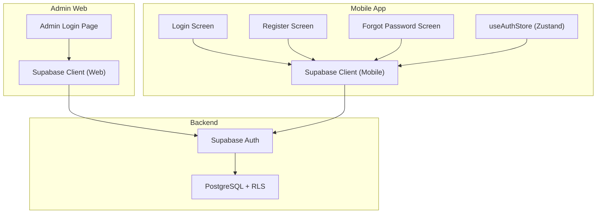
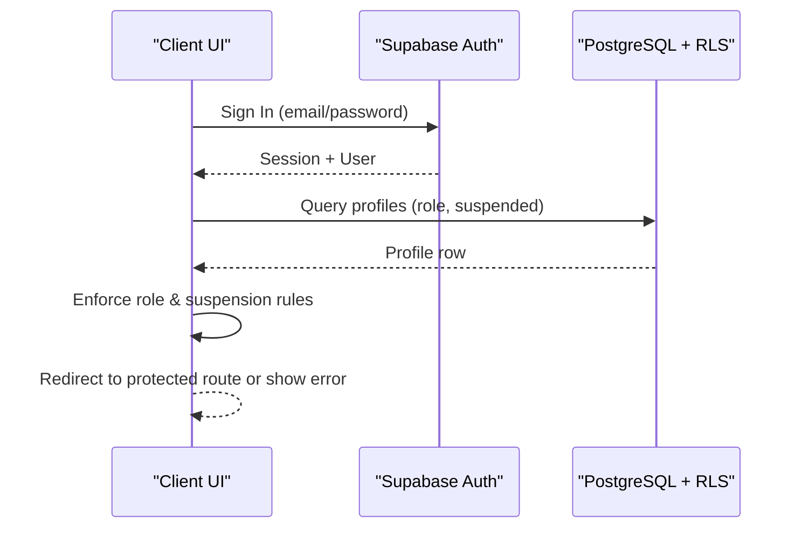
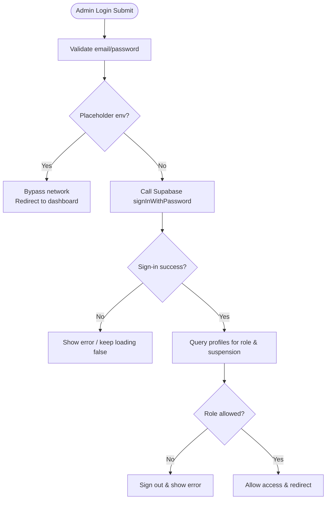
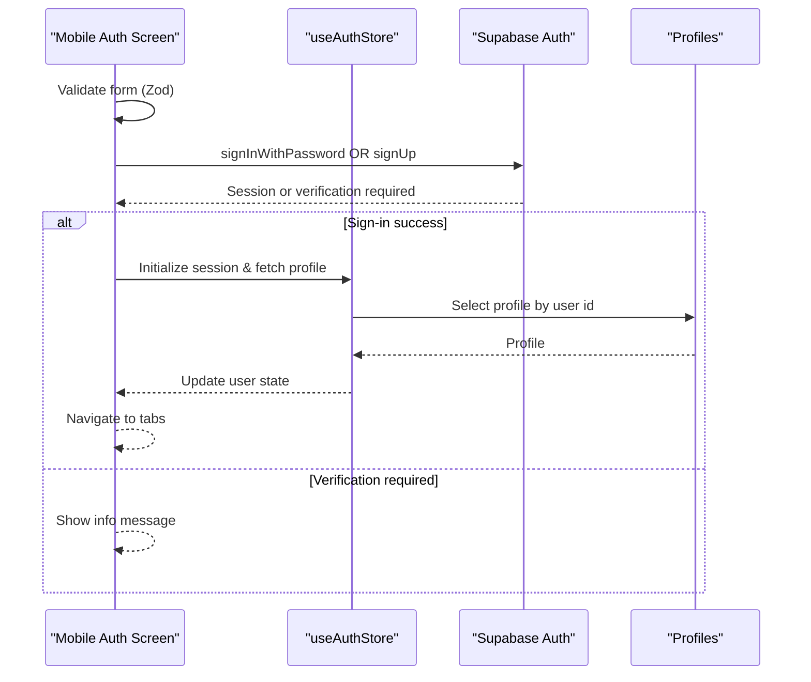
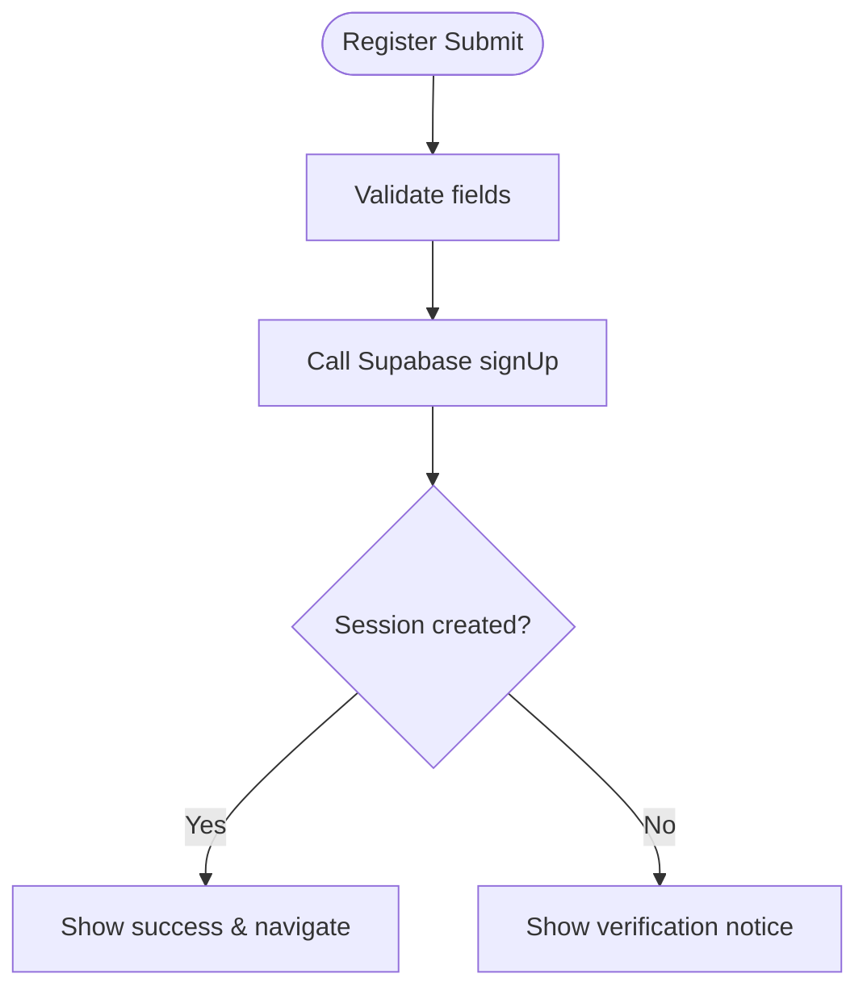
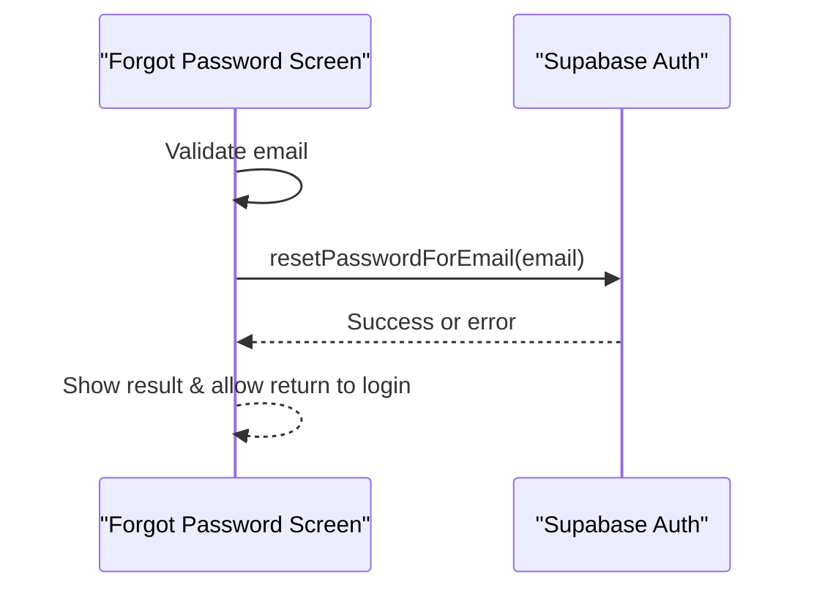
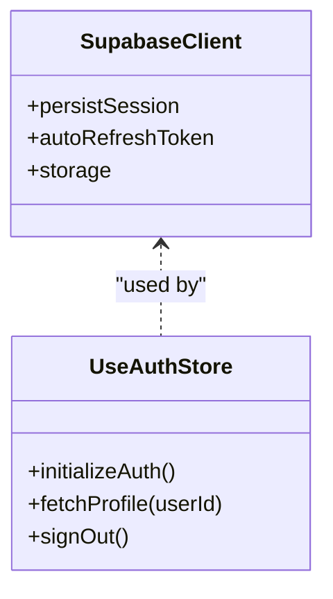
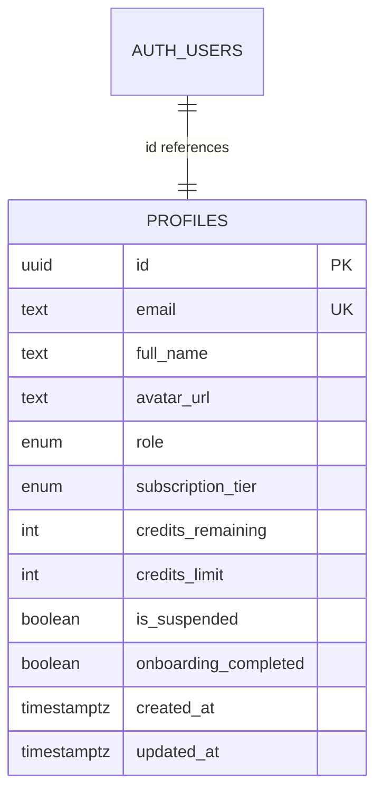
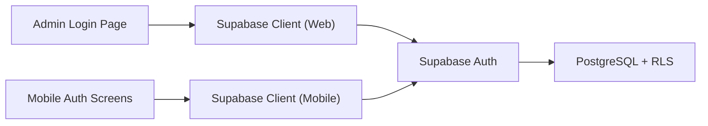

# Authentication API

<cite>
**Referenced Files in This Document**
- [apps/admin/src/lib/supabase.ts](file://apps/admin/src/lib/supabase.ts)
- [apps/mobile/src/services/supabase.ts](file://apps/mobile/src/services/supabase.ts)
- [apps/admin/src/app/(auth)/login/page.tsx](file://apps/admin/src/app/(auth)/login/page.tsx)
- [apps/mobile/src/app/(auth)/login.tsx](file://apps/mobile/src/app/(auth)/login.tsx)
- [apps/mobile/src/app/(auth)/register.tsx](file://apps/mobile/src/app/(auth)/register.tsx)
- [apps/mobile/src/app/(auth)/forgot-password.tsx](file://apps/mobile/src/app/(auth)/forgot-password.tsx)
- [apps/mobile/src/store/useAuthStore.ts](file://apps/mobile/src/store/useAuthStore.ts)
- [supabase/migrations/20240001000000_initial_schema.sql](file://supabase/migrations/20240001000000_initial_schema.sql)
</cite>

## Table of Contents
1. Introduction
2. Project Structure
3. Core Components
4. Architecture Overview
5. Detailed Component Analysis
6. Dependency Analysis
7. Performance Considerations
8. Troubleshooting Guide
9. Conclusion

## Introduction
This document describes the authentication and authorization flows implemented across the admin web app and mobile app, powered by Supabase Auth and PostgreSQL Row-Level Security (RLS). It covers user registration, login, session management, password reset, role-based access control, and security best practices for token storage and safe UI patterns. Where applicable, it also notes how OAuth providers can be enabled via configuration.

## Project Structure
Authentication is implemented on both client apps:
- Admin web app (Next.js): Login page with role checks and profile queries.
- Mobile app (Expo/React Native): Unified sign-in/sign-up screen, dedicated register screen, forgot-password flow, and a global auth store that persists sessions and fetches profiles.

**Diagram sources**
- [apps/admin/src/app/(auth)/login/page.tsx:15-78](file://apps/admin/src/app/(auth)/login/page.tsx#L15-L78)
- [apps/mobile/src/app/(auth)/login.tsx:76-142](file://apps/mobile/src/app/(auth)/login.tsx#L76-L142)
- [apps/mobile/src/app/(auth)/register.tsx:29-92](file://apps/mobile/src/app/(auth)/register.tsx#L29-L92)
- [apps/mobile/src/app/(auth)/forgot-password.tsx:28-61](file://apps/mobile/src/app/(auth)/forgot-password.tsx#L28-L61)
- [apps/mobile/src/store/useAuthStore.ts:24-61](file://apps/mobile/src/store/useAuthStore.ts#L24-L61)
- [apps/admin/src/lib/supabase.ts:1-14](file://apps/admin/src/lib/supabase.ts#L1-L14)
- [apps/mobile/src/services/supabase.ts:1-41](file://apps/mobile/src/services/supabase.ts#L1-L41)

**Section sources**
- [apps/admin/src/app/(auth)/login/page.tsx:15-78](file://apps/admin/src/app/(auth)/login/page.tsx#L15-L78)
- [apps/mobile/src/app/(auth)/login.tsx:76-142](file://apps/mobile/src/app/(auth)/login.tsx#L76-L142)
- [apps/mobile/src/app/(auth)/register.tsx:29-92](file://apps/mobile/src/app/(auth)/register.tsx#L29-L92)
- [apps/mobile/src/app/(auth)/forgot-password.tsx:28-61](file://apps/mobile/src/app/(auth)/forgot-password.tsx#L28-L61)
- [apps/mobile/src/store/useAuthStore.ts:24-61](file://apps/mobile/src/store/useAuthStore.ts#L24-L61)
- [apps/admin/src/lib/supabase.ts:1-14](file://apps/admin/src/lib/supabase.ts#L1-L14)
- [apps/mobile/src/services/supabase.ts:1-41](file://apps/mobile/src/services/supabase.ts#L1-L41)

## Core Components
- Supabase clients configured per platform:
  - Web: Session persistence and auto-refresh enabled.
  - Mobile: Secure storage adapter using Expo Secure Store; session persistence and auto-refresh enabled; URL-based session detection disabled.
- Admin login flow:
  - Validates inputs, calls password sign-in, then verifies user profile role and suspension status before granting access.
- Mobile auth flows:
  - Unified sign-in/sign-up with Zod validation.
  - Registration sets default user role and stores full name.
  - Forgot password triggers email recovery.
  - Global auth store initializes session, listens to auth state changes, and fetches user profile.

**Section sources**
- [apps/admin/src/lib/supabase.ts:1-14](file://apps/admin/src/lib/supabase.ts#L1-L14)
- [apps/mobile/src/services/supabase.ts:1-41](file://apps/mobile/src/services/supabase.ts#L1-L41)
- [apps/admin/src/app/(auth)/login/page.tsx:15-78](file://apps/admin/src/app/(auth)/login/page.tsx#L15-L78)
- [apps/mobile/src/app/(auth)/login.tsx:76-142](file://apps/mobile/src/app/(auth)/login.tsx#L76-L142)
- [apps/mobile/src/app/(auth)/register.tsx:29-92](file://apps/mobile/src/app/(auth)/register.tsx#L29-L92)
- [apps/mobile/src/app/(auth)/forgot-password.tsx:28-61](file://apps/mobile/src/app/(auth)/forgot-password.tsx#L28-L61)
- [apps/mobile/src/store/useAuthStore.ts:24-61](file://apps/mobile/src/store/useAuthStore.ts#L24-L61)

## Architecture Overview
The system uses Supabase Auth for identity and session management, with PostgreSQL RLS enforcing data access at the database level. Role-based checks are enforced both in client-side flows (e.g., admin-only pages) and server-side policies.

**Diagram sources**
- [apps/admin/src/app/(auth)/login/page.tsx:33-73](file://apps/admin/src/app/(auth)/login/page.tsx#L33-L73)
- [supabase/migrations/20240001000000_initial_schema.sql:159-202](file://supabase/migrations/20240001000000_initial_schema.sql#L159-L202)

## Detailed Component Analysis

### Admin Login Flow
- Inputs validated; if placeholder environment is detected, bypasses network calls and redirects.
- Calls password sign-in; on success, queries the user’s profile to check role and suspension.
- Denies access if not authorized or account is suspended; otherwise navigates to dashboard.

**Diagram sources**
- [apps/admin/src/app/(auth)/login/page.tsx:15-78](file://apps/admin/src/app/(auth)/login/page.tsx#L15-L78)

**Section sources**
- [apps/admin/src/app/(auth)/login/page.tsx:15-78](file://apps/admin/src/app/(auth)/login/page.tsx#L15-L78)

### Mobile Unified Login/Signup Flow
- Uses Zod schema to validate email, password, and optional full name.
- If placeholder environment is detected, simulates delay and marks onboarding completed.
- For sign-in: calls password sign-in and navigates to tabs.
- For sign-up: creates user with default role and full name; handles verification-required vs immediate session cases.

**Diagram sources**
- [apps/mobile/src/app/(auth)/login.tsx:76-142](file://apps/mobile/src/app/(auth)/login.tsx#L76-L142)
- [apps/mobile/src/store/useAuthStore.ts:24-61](file://apps/mobile/src/store/useAuthStore.ts#L24-L61)

**Section sources**
- [apps/mobile/src/app/(auth)/login.tsx:76-142](file://apps/mobile/src/app/(auth)/login.tsx#L76-L142)
- [apps/mobile/src/store/useAuthStore.ts:24-61](file://apps/mobile/src/store/useAuthStore.ts#L24-L61)

### Mobile Register Flow
- Validates full name, email, and password.
- Creates user with default role and full name stored in metadata.
- Handles immediate session vs verification-required states.

**Diagram sources**
- [apps/mobile/src/app/(auth)/register.tsx:29-92](file://apps/mobile/src/app/(auth)/register.tsx#L29-L92)

**Section sources**
- [apps/mobile/src/app/(auth)/register.tsx:29-92](file://apps/mobile/src/app/(auth)/register.tsx#L29-L92)

### Password Reset Flow
- Validates email format.
- Sends password reset email via Supabase Auth.
- Displays success state and option to return to login.

**Diagram sources**
- [apps/mobile/src/app/(auth)/forgot-password.tsx:28-61](file://apps/mobile/src/app/(auth)/forgot-password.tsx#L28-L61)

**Section sources**
- [apps/mobile/src/app/(auth)/forgot-password.tsx:28-61](file://apps/mobile/src/app/(auth)/forgot-password.tsx#L28-L61)

### Session Management and State
- Web client: Session persistence and auto-refresh enabled.
- Mobile client: Secure storage adapter ensures tokens are stored securely on native platforms; session persistence and auto-refresh enabled; URL-based session detection disabled.
- Global auth store: Initializes session on app start, listens to auth state changes, and fetches user profile when available.

**Diagram sources**
- [apps/admin/src/lib/supabase.ts:1-14](file://apps/admin/src/lib/supabase.ts#L1-L14)
- [apps/mobile/src/services/supabase.ts:1-41](file://apps/mobile/src/services/supabase.ts#L1-L41)
- [apps/mobile/src/store/useAuthStore.ts:24-61](file://apps/mobile/src/store/useAuthStore.ts#L24-L61)

**Section sources**
- [apps/admin/src/lib/supabase.ts:1-14](file://apps/admin/src/lib/supabase.ts#L1-L14)
- [apps/mobile/src/services/supabase.ts:1-41](file://apps/mobile/src/services/supabase.ts#L1-L41)
- [apps/mobile/src/store/useAuthStore.ts:24-61](file://apps/mobile/src/store/useAuthStore.ts#L24-L61)

### Authorization and Role-Based Access Control
- Roles defined in database enum and stored in profiles table.
- Database-level helper function determines admin privileges.
- RLS policies enforce:
  - Users can read/update their own profile.
  - Admins have elevated access where specified.
  - Data isolation for posts, folders, notifications, analytics, etc.

**Diagram sources**
- [supabase/migrations/20240001000000_initial_schema.sql:44-58](file://supabase/migrations/20240001000000_initial_schema.sql#L44-L58)
- [supabase/migrations/20240001000000_initial_schema.sql:60-69](file://supabase/migrations/20240001000000_initial_schema.sql#L60-L69)
- [supabase/migrations/20240001000000_initial_schema.sql:159-202](file://supabase/migrations/20240001000000_initial_schema.sql#L159-L202)

**Section sources**
- [supabase/migrations/20240001000000_initial_schema.sql:44-69](file://supabase/migrations/20240001000000_initial_schema.sql#L44-L69)
- [supabase/migrations/20240001000000_initial_schema.sql:159-202](file://supabase/migrations/20240001000000_initial_schema.sql#L159-L202)

### OAuth Integrations
- The admin white-label settings include a toggle for enabling social login providers. When enabled, configure corresponding OAuth providers in Supabase Auth console and ensure your domain/callback URLs are set accordingly.
- No direct OAuth code paths are present in the analyzed files; enablement is controlled via configuration flags and Supabase provider setup.

**Section sources**
- [apps/admin/src/app/(dashboard)/white-label/page.tsx:241-266](file://apps/admin/src/app/(dashboard)/white-label/page.tsx#L241-L266)

## Dependency Analysis
- Clients depend on Supabase Auth for authentication and session lifecycle.
- Admin and mobile apps query the profiles table to enforce roles and account status.
- Database policies enforce data isolation based on current user context.

**Diagram sources**
- [apps/admin/src/app/(auth)/login/page.tsx:33-73](file://apps/admin/src/app/(auth)/login/page.tsx#L33-L73)
- [apps/mobile/src/app/(auth)/login.tsx:107-135](file://apps/mobile/src/app/(auth)/login.tsx#L107-L135)
- [apps/admin/src/lib/supabase.ts:1-14](file://apps/admin/src/lib/supabase.ts#L1-L14)
- [apps/mobile/src/services/supabase.ts:1-41](file://apps/mobile/src/services/supabase.ts#L1-L41)
- [supabase/migrations/20240001000000_initial_schema.sql:159-202](file://supabase/migrations/20240001000000_initial_schema.sql#L159-L202)

**Section sources**
- [apps/admin/src/app/(auth)/login/page.tsx:33-73](file://apps/admin/src/app/(auth)/login/page.tsx#L33-L73)
- [apps/mobile/src/app/(auth)/login.tsx:107-135](file://apps/mobile/src/app/(auth)/login.tsx#L107-L135)
- [apps/admin/src/lib/supabase.ts:1-14](file://apps/admin/src/lib/supabase.ts#L1-L14)
- [apps/mobile/src/services/supabase.ts:1-41](file://apps/mobile/src/services/supabase.ts#L1-L41)
- [supabase/migrations/20240001000000_initial_schema.sql:159-202](file://supabase/migrations/20240001000000_initial_schema.sql#L159-L202)

## Performance Considerations
- Token refresh: Both clients enable auto token refresh to minimize manual re-authentication.
- Secure storage: Mobile uses secure storage to protect tokens on device.
- Minimal network calls: Placeholder environments bypass network calls during development to speed up testing.
- Efficient profile fetching: Auth store fetches profile once per session change.

[No sources needed since this section provides general guidance]

## Troubleshooting Guide
Common issues and resolutions:
- Invalid credentials: Ensure correct email/password; verify user exists and is not suspended.
- Role denied: Admin routes require specific roles; confirm profile role and RLS policies.
- Network errors: Check Supabase URL and keys; verify environment variables are set correctly.
- Verification required: After signup, users may need to verify email before accessing protected routes.

**Section sources**
- [apps/admin/src/app/(auth)/login/page.tsx:38-70](file://apps/admin/src/app/(auth)/login/page.tsx#L38-L70)
- [apps/mobile/src/app/(auth)/login.tsx:107-135](file://apps/mobile/src/app/(auth)/login.tsx#L107-L135)
- [apps/mobile/src/app/(auth)/register.tsx:51-82](file://apps/mobile/src/app/(auth)/register.tsx#L51-L82)
- [apps/mobile/src/app/(auth)/forgot-password.tsx:28-61](file://apps/mobile/src/app/(auth)/forgot-password.tsx#L28-L61)

## Conclusion
The application implements a robust authentication and authorization system using Supabase Auth and PostgreSQL RLS. It supports secure session management, role-based access control, and password reset flows. OAuth can be enabled through configuration. Follow the documented flows and security recommendations to implement login forms, manage authentication state, protect routes, and handle user sessions safely.

[No sources needed since this section summarizes without analyzing specific files]