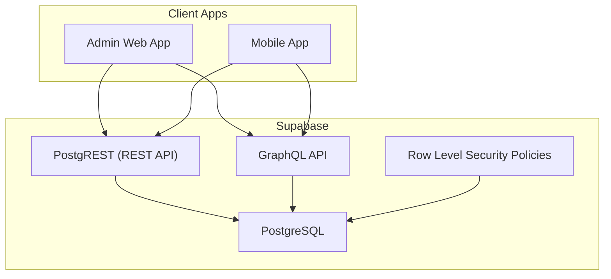
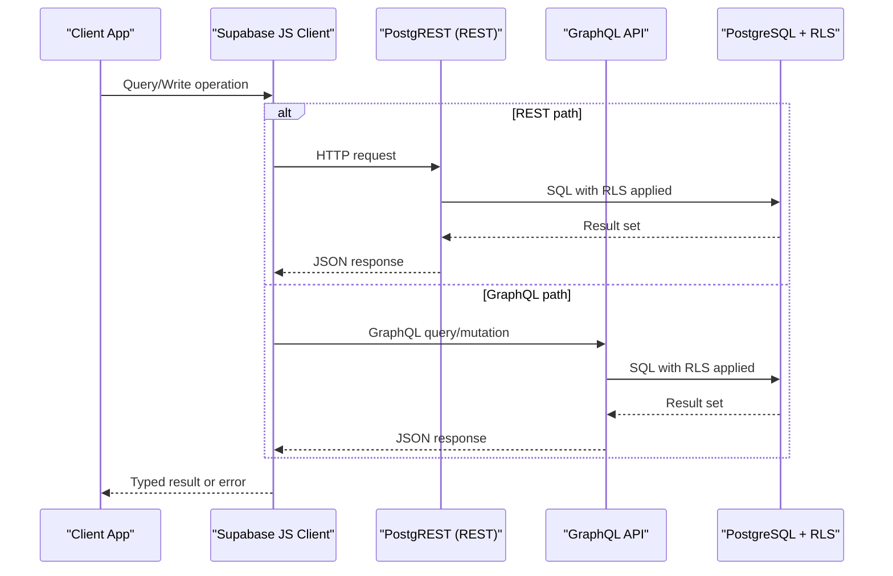
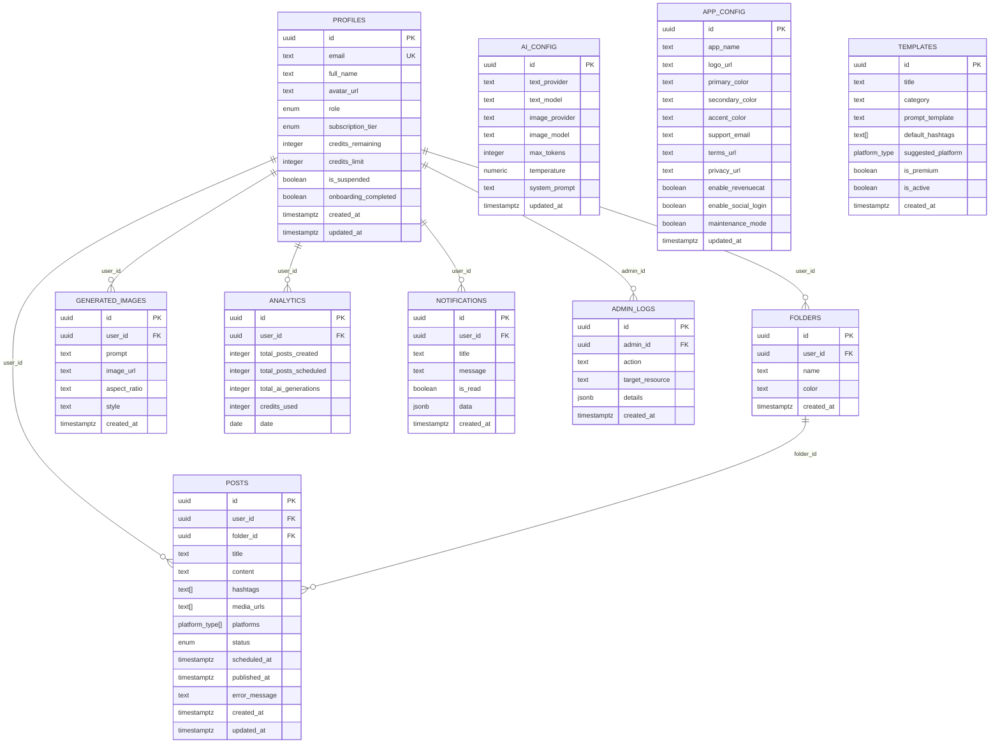
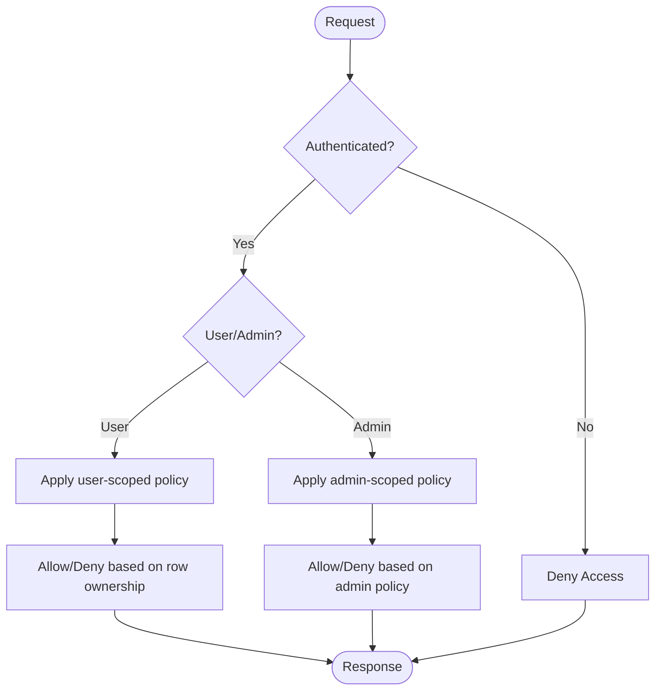
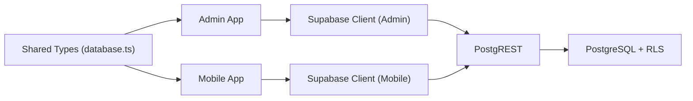

# Database API

<cite>
**Referenced Files in This Document**
- [20240001000000_initial_schema.sql](file://supabase/migrations/20240001000000_initial_schema.sql)
- [seed.sql](file://supabase/seed.sql)
- [supabase.ts (Admin)](file://apps/admin/src/lib/supabase.ts)
- [supabase.ts (Mobile)](file://apps/mobile/src/services/supabase.ts)
- [database.ts (Types)](file://packages/types/src/database.ts)
- [users page (Admin)](file://apps/admin/src/app/(dashboard)/users/page.tsx)
- [posts page (Admin)](file://apps/admin/src/app/(dashboard)/posts/page.tsx)
</cite>

## Table of Contents
1. [Introduction](#introduction)
2. [Project Structure](#project-structure)
3. [Core Components](#core-components)
4. [Architecture Overview](#architecture-overview)
5. [Detailed Component Analysis](#detailed-component-analysis)
6. [Dependency Analysis](#dependency-analysis)
7. [Performance Considerations](#performance-considerations)
8. [Troubleshooting Guide](#troubleshooting-guide)
9. [Conclusion](#conclusion)
10. [Appendices](#appendices)

## Introduction
This document provides comprehensive database API documentation for the Supabase REST and GraphQL interfaces used by this project. It covers all available tables including profiles, posts, ai_config, generated_images, and analytics with field definitions, data types, constraints, and relationships. It also documents query patterns, filtering options, sorting capabilities, pagination support, Row Level Security (RLS) policies, access control rules, permission models, examples of CRUD operations, complex queries, batch operations, transaction handling, data validation, error responses, and performance optimization techniques.

## Project Structure
The database schema and security policies are defined in a single migration file. The application uses Supabase clients configured per environment (admin web app and mobile app). Shared TypeScript types describe database entities to ensure type safety across the codebase.

**Diagram sources**
- [20240001000000_initial_schema.sql:159-202](file://supabase/migrations/20240001000000_initial_schema.sql#L159-L202)
- [supabase.ts (Admin):1-14](file://apps/admin/src/lib/supabase.ts#L1-L14)
- [supabase.ts (Mobile):1-41](file://apps/mobile/src/services/supabase.ts#L1-L41)

**Section sources**
- [20240001000000_initial_schema.sql:1-232](file://supabase/migrations/20240001000000_initial_schema.sql#L1-L232)
- [supabase.ts (Admin):1-14](file://apps/admin/src/lib/supabase.ts#L1-L14)
- [supabase.ts (Mobile):1-41](file://apps/mobile/src/services/supabase.ts#L1-L41)

## Core Components
- Tables: app_config, ai_config, profiles, folders, posts, templates, generated_images, analytics, notifications, admin_logs
- Enums: user_role, subscription_tier, post_status, platform_type
- Functions: is_admin(), handle_new_user()
- Triggers: on_auth_user_created
- Realtime publications: app_config, posts, notifications, templates

Key responsibilities:
- Profiles: User identity and permissions
- Posts: Content creation and scheduling
- AI Config: Centralized AI provider settings
- Generated Images: AI-generated image assets
- Analytics: Daily aggregated metrics per user
- Templates: Reusable content templates
- Folders: Organizational grouping for posts
- Notifications: User-specific messages
- Admin Logs: Audit trail for administrative actions

**Section sources**
- [20240001000000_initial_schema.sql:15-153](file://supabase/migrations/20240001000000_initial_schema.sql#L15-L153)
- [20240001000000_initial_schema.sql:208-231](file://supabase/migrations/20240001000000_initial_schema.sql#L208-L231)

## Architecture Overview
The system exposes both REST and GraphQL endpoints via Supabase. All requests are subject to Row Level Security policies that enforce fine-grained access based on the authenticated user’s identity and role. Client apps use Supabase JS SDK to interact with these APIs.

**Diagram sources**
- [20240001000000_initial_schema.sql:159-202](file://supabase/migrations/20240001000000_initial_schema.sql#L159-L202)
- [supabase.ts (Admin):1-14](file://apps/admin/src/lib/supabase.ts#L1-L14)
- [supabase.ts (Mobile):1-41](file://apps/mobile/src/services/supabase.ts#L1-L41)

## Detailed Component Analysis

### Data Model and Relationships

**Diagram sources**
- [20240001000000_initial_schema.sql:15-153](file://supabase/migrations/20240001000000_initial_schema.sql#L15-L153)

**Section sources**
- [20240001000000_initial_schema.sql:15-153](file://supabase/migrations/20240001000000_initial_schema.sql#L15-L153)

### Table Definitions and Constraints

- profiles
  - Primary key: id (UUID)
  - Unique: email
  - Foreign keys: references auth.users(id)
  - Enum fields: role, subscription_tier
  - Timestamps: created_at, updated_at
  - Notes: Auto-created on signup via trigger

- posts
  - Primary key: id (UUID)
  - Foreign keys: user_id -> profiles(id), folder_id -> folders(id)
  - Arrays: hashtags, media_urls, platforms
  - Enum: status
  - Timestamps: created_at, updated_at

- ai_config
  - Primary key: id (UUID)
  - Text fields for providers/models
  - Numeric: temperature
  - Timestamp: updated_at

- generated_images
  - Primary key: id (UUID)
  - Foreign key: user_id -> profiles(id)
  - Text fields: prompt, image_url, aspect_ratio, style
  - Timestamp: created_at

- analytics
  - Primary key: id (UUID)
  - Foreign key: user_id -> profiles(id)
  - Unique constraint: (user_id, date)
  - Numeric counters and date

Additional tables: app_config, folders, templates, notifications, admin_logs with their respective fields and constraints as defined in the schema.

**Section sources**
- [20240001000000_initial_schema.sql:15-153](file://supabase/migrations/20240001000000_initial_schema.sql#L15-L153)

### Row Level Security (RLS) and Access Control

- RLS enabled for all public tables
- Helper function: is_admin() checks if current user has admin or super_admin role
- Policies:
  - app_config: read allowed for authenticated; write restricted to admins
  - ai_config: read allowed for authenticated; write restricted to admins
  - profiles: users can read/update own profile; admins have full access
  - posts: users manage own posts; admins can view/moderate
  - folders: users manage own folders
  - templates: authenticated can read active templates; admins manage all
  - generated_images: users manage own images
  - notifications: users manage own notifications
  - analytics: users manage own analytics; admins read all
  - admin_logs: admins only

**Diagram sources**
- [20240001000000_initial_schema.sql:60-69](file://supabase/migrations/20240001000000_initial_schema.sql#L60-L69)
- [20240001000000_initial_schema.sql:159-202](file://supabase/migrations/20240001000000_initial_schema.sql#L159-L202)

**Section sources**
- [20240001000000_initial_schema.sql:60-69](file://supabase/migrations/20240001000000_initial_schema.sql#L60-L69)
- [20240001000000_initial_schema.sql:159-202](file://supabase/migrations/20240001000000_initial_schema.sql#L159-L202)

### Query Patterns, Filtering, Sorting, Pagination

- REST (PostgREST)
  - Filtering: Use query parameters like eq, neq, gt, gte, lt, lte, ilike, cs, etc., depending on column types
  - Sorting: order=column_name.asc or .desc
  - Pagination: limit and offset for page-based pagination; range headers for cursor-style pagination when supported
  - Selecting columns: select=field1,field2
  - Relations: join syntax via foreign keys (e.g., posts?folders.id=eq.<id>)

- GraphQL
  - Filtering: Use filter arguments on fields (e.g., where: { user_id: { _eq: "..." } })
  - Sorting: orderBy: [{ created_at: asc }]
  - Pagination: first/after or limit/offset depending on schema exposure
  - Selection sets: specify only needed fields to reduce payload size

Examples (conceptual):
- Fetch user’s posts sorted by newest: GET /rest/v1/posts?select=*&order=created_at.desc&limit=20&offset=0
- Filter posts by status and platform: GET /rest/v1/posts?status=eq.published&platforms=cs.{instagram}
- GraphQL: query { posts(where: { user_id: { _eq: "<uid>" } }, order_by: { created_at: desc }, limit: 20) { id title status } }

Note: Exact parameter names depend on Supabase configuration and schema introspection.

**Section sources**
- [20240001000000_initial_schema.sql:81-96](file://supabase/migrations/20240001000000_initial_schema.sql#L81-L96)
- [20240001000000_initial_schema.sql:123-132](file://supabase/migrations/20240001000000_initial_schema.sql#L123-L132)

### CRUD Operations Examples

- Create
  - Insert a new post for the authenticated user
  - Insert a generated image linked to the user
  - Update ai_config (admin only)

- Read
  - Fetch own profile
  - List active templates
  - Retrieve daily analytics for the current user

- Update
  - Update profile fields (own profile)
  - Change post status or schedule time
  - Adjust credits for a user (admin only)

- Delete
  - Delete own post
  - Remove own notification

Implementation references in the codebase demonstrate typical usage patterns:
- Updating profiles and posts using Supabase client methods
- Error handling via returned error objects

**Section sources**
- [users page (Admin):48-76](file://apps/admin/src/app/(dashboard)/users/page.tsx#L48-L76)
- [posts page (Admin):1228-1258](file://apps/admin/src/app/(dashboard)/posts/page.tsx#L1228-L1258)

### Complex Queries

- Joining related data:
  - Fetch posts with folder info: select posts.*, folders.name from posts left join folders on posts.folder_id = folders.id
- Aggregations:
  - Count posts per user: select user_id, count(*) from posts group by user_id
- Array filters:
  - Find posts containing specific platform: where platforms=cs.{instagram}
- Date ranges:
  - Analytics within last N days: where date=gte.<start>&date=lte.<end>

**Section sources**
- [20240001000000_initial_schema.sql:81-96](file://supabase/migrations/20240001000000_initial_schema.sql#L81-L96)
- [20240001000000_initial_schema.sql:123-132](file://supabase/migrations/20240001000000_initial_schema.sql#L123-L132)

### Batch Operations and Transactions

- Batch writes:
  - Use Supabase client to perform multiple insert/update/delete calls in sequence or concurrently
  - For atomicity, consider wrapping multiple mutations in a database function or edge function that executes a single transaction
- Transactions:
  - Implement server-side transactions using PostgreSQL functions or Supabase Edge Functions to ensure consistency across multiple table updates

Best practices:
- Validate inputs before batching
- Handle partial failures gracefully
- Log errors and provide meaningful feedback

**Section sources**
- [20240001000000_initial_schema.sql:208-231](file://supabase/migrations/20240001000000_initial_schema.sql#L208-L231)

### Data Validation

- Server-side:
  - Enforce NOT NULL, UNIQUE, CHECK constraints at the database level
  - Use ENUM types to restrict values
  - Leverage triggers for computed fields or side effects
- Client-side:
  - Validate payloads before sending requests
  - Display user-friendly error messages based on Supabase error responses

References:
- Schema constraints and enums define strict data shapes
- Application code demonstrates error handling patterns

**Section sources**
- [20240001000000_initial_schema.sql:8-13](file://supabase/migrations/20240001000000_initial_schema.sql#L8-L13)
- [20240001000000_initial_schema.sql:15-153](file://supabase/migrations/20240001000000_initial_schema.sql#L15-L153)
- [users page (Admin):48-76](file://apps/admin/src/app/(dashboard)/users/page.tsx#L48-L76)

### Error Responses

- Supabase returns structured error objects with codes and messages
- Common scenarios:
  - Permission denied due to RLS policy violations
  - Constraint violations (unique, not null)
  - Network or authentication errors
- Handling strategy:
  - Check error object for presence
  - Provide contextual user feedback
  - Retry transient errors with backoff

**Section sources**
- [users page (Admin):48-76](file://apps/admin/src/app/(dashboard)/users/page.tsx#L48-L76)
- [posts page (Admin):1228-1258](file://apps/admin/src/app/(dashboard)/posts/page.tsx#L1228-L1258)

## Dependency Analysis

**Diagram sources**
- [database.ts (Types):1-73](file://packages/types/src/database.ts#L1-L73)
- [supabase.ts (Admin):1-14](file://apps/admin/src/lib/supabase.ts#L1-L14)
- [supabase.ts (Mobile):1-41](file://apps/mobile/src/services/supabase.ts#L1-L41)
- [20240001000000_initial_schema.sql:159-202](file://supabase/migrations/20240001000000_initial_schema.sql#L159-L202)

**Section sources**
- [database.ts (Types):1-73](file://packages/types/src/database.ts#L1-L73)
- [supabase.ts (Admin):1-14](file://apps/admin/src/lib/supabase.ts#L1-L14)
- [supabase.ts (Mobile):1-41](file://apps/mobile/src/services/supabase.ts#L1-L41)

## Performance Considerations

- Indexing:
  - Add indexes on frequently filtered columns (e.g., posts.user_id, posts.status, analytics.date)
  - Composite indexes for common query patterns (e.g., user_id + created_at)
- Query optimization:
  - Select only required fields to reduce payload size
  - Use appropriate filters and avoid SELECT * in production
- Caching:
  - Leverage client-side caching (e.g., React Query) to minimize redundant requests
- Realtime:
  - Subscribe only to necessary channels and tables to reduce overhead
- Connection pooling:
  - Ensure connection limits are adequate for expected load

[No sources needed since this section provides general guidance]

## Troubleshooting Guide

Common issues and resolutions:
- Empty results or permission denied:
  - Verify RLS policies are applied correctly by running the initial schema migration
- Admin access denied:
  - Update user role to admin or super_admin in the profiles table
- Realtime not updating:
  - Ensure Realtime publication includes the relevant tables (app_config, posts, notifications, templates)

**Section sources**
- [TROUBLESHOOTING.md:9-23](file://TROUBLESHOOTING.md#L9-L23)
- [20240001000000_initial_schema.sql:227-231](file://supabase/migrations/20240001000000_initial_schema.sql#L227-L231)

## Conclusion
This database API leverages Supabase’s robust REST and GraphQL layers backed by PostgreSQL with strong Row Level Security policies. The schema defines clear relationships and constraints, while the application integrates securely through typed clients. By following the recommended query patterns, leveraging indexing, and adhering to RLS policies, you can build secure, efficient, and scalable features around profiles, posts, ai_config, generated_images, and analytics.

[No sources needed since this section summarizes without analyzing specific files]

## Appendices

### Seed Data
Initial configurations and templates are seeded to bootstrap the application.

**Section sources**
- [seed.sql:1-17](file://supabase/seed.sql#L1-L17)