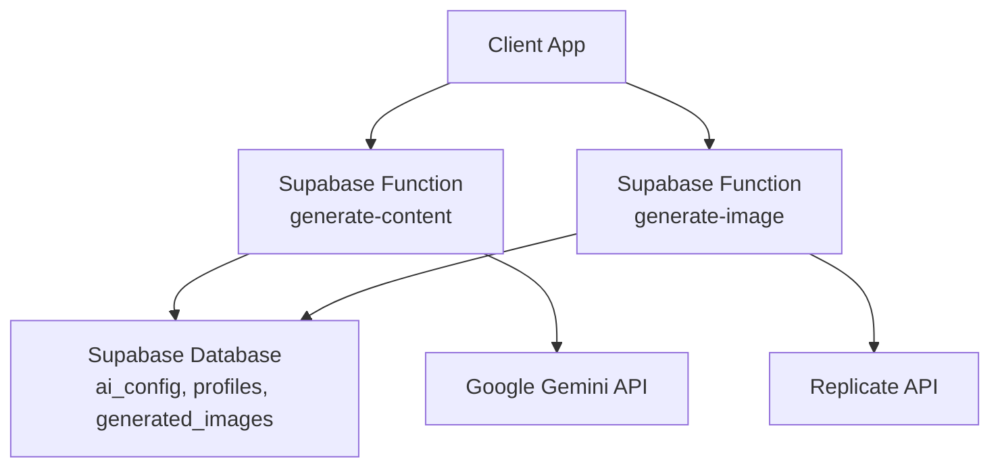
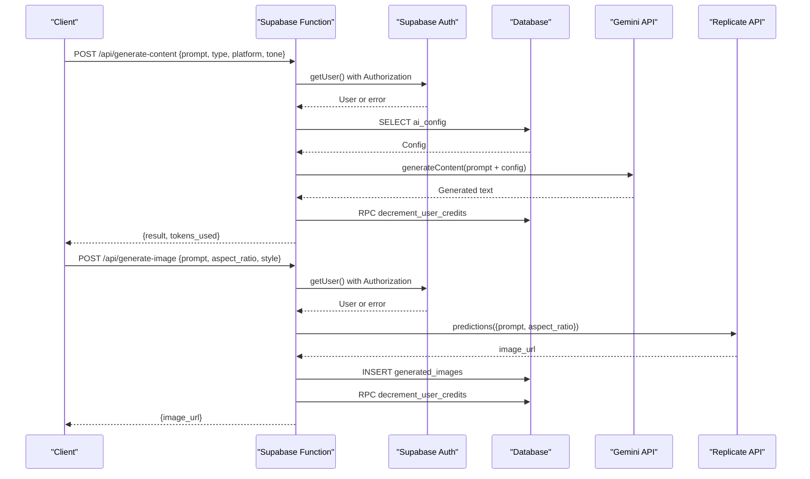
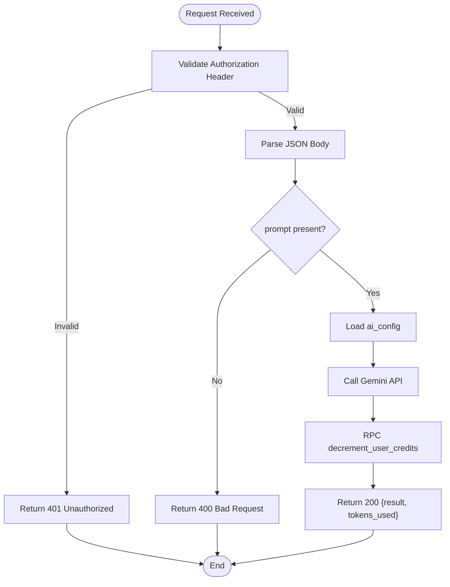
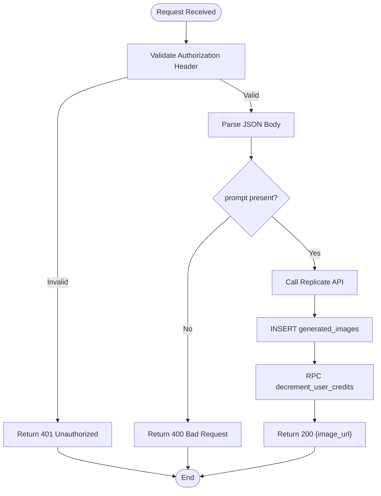
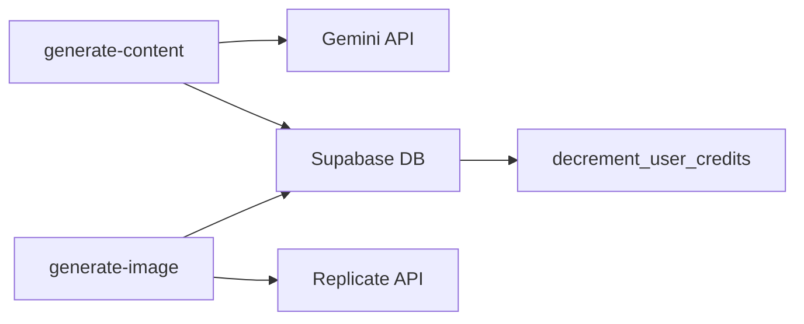
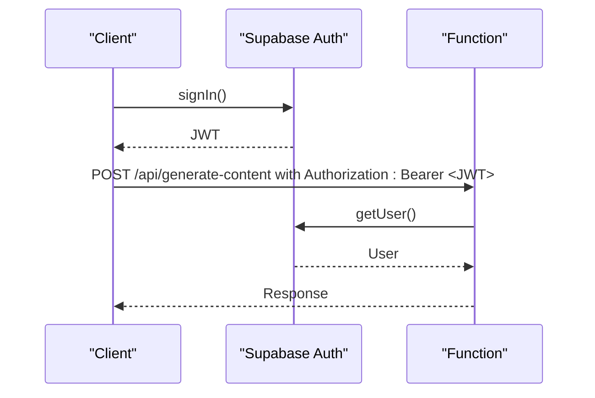

# REST Endpoints

<cite>
**Referenced Files in This Document**
- [generate-content/index.ts](file://supabase/functions/generate-content/index.ts)
- [generate-image/index.ts](file://supabase/functions/generate-image/index.ts)
- [api.ts](file://packages/types/src/api.ts)
- [auth.ts](file://packages/types/src/auth.ts)
- [initial_schema.sql](file://supabase/migrations/20240001000000_initial_schema.sql)
- [supabase.ts (admin)](file://apps/admin/src/lib/supabase.ts)
- [supabase.ts (mobile)](file://apps/mobile/src/services/supabase.ts)
</cite>

## Table of Contents
1. [Introduction](#introduction)
2. [Project Structure](#project-structure)
3. [Core Components](#core-components)
4. [Architecture Overview](#architecture-overview)
5. [Detailed Component Analysis](#detailed-component-analysis)
6. [Dependency Analysis](#dependency-analysis)
7. [Performance Considerations](#performance-considerations)
8. [Troubleshooting Guide](#troubleshooting-guide)
9. [Conclusion](#conclusion)
10. [Appendices](#appendices)

## Introduction
This document provides comprehensive REST API documentation for the content generation endpoints in SocialPilot AI Pro. It focuses on:
- POST /api/generate-content: Generate text using AI with user authentication and credit deduction.
- POST /api/generate-image: Generate images using an external provider with user authentication and credit deduction.

It includes request/response schemas, authentication requirements, error handling, and practical client examples using fetch or axios. It also covers JWT-based authentication via Supabase, session management, and security best practices.

## Project Structure
The endpoints are implemented as serverless functions under Supabase Functions. Each function:
- Validates the authenticated user via Supabase Auth.
- Reads configuration from the database.
- Calls external AI providers (Gemini for text, Replicate for images).
- Deducts credits via a database RPC.
- Returns JSON responses with CORS headers enabled.

**Diagram sources**
- [generate-content/index.ts:1-99](file://supabase/functions/generate-content/index.ts#L1-L99)
- [generate-image/index.ts:1-87](file://supabase/functions/generate-image/index.ts#L1-L87)
- [initial_schema.sql:31-120](file://supabase/migrations/20240001000000_initial_schema.sql#L31-L120)

**Section sources**
- [generate-content/index.ts:1-99](file://supabase/functions/generate-content/index.ts#L1-L99)
- [generate-image/index.ts:1-87](file://supabase/functions/generate-image/index.ts#L1-L87)
- [initial_schema.sql:31-120](file://supabase/migrations/20240001000000_initial_schema.sql#L31-L120)

## Core Components
- Authentication: Both endpoints require a valid Supabase session. The Authorization header must include a Bearer token.
- Request validation: Required fields are validated; missing prompt returns 400.
- External integrations:
  - Text generation uses Google Gemini (or fallback mock if key is not set).
  - Image generation uses Replicate (with a default image when token is not set).
- Credits: Both endpoints decrement user credits via a database RPC after successful processing.

**Section sources**
- [generate-content/index.ts:14-36](file://supabase/functions/generate-content/index.ts#L14-L36)
- [generate-image/index.ts:14-36](file://supabase/functions/generate-image/index.ts#L14-L36)
- [generate-content/index.ts:82-91](file://supabase/functions/generate-content/index.ts#L82-L91)
- [generate-image/index.ts:64-79](file://supabase/functions/generate-image/index.ts#L64-L79)

## Architecture Overview
The endpoints follow a consistent flow:
1. Receive HTTP request with Authorization header.
2. Validate user session via Supabase Auth.
3. Parse and validate request body.
4. Load AI configuration from the database.
5. Call external AI provider.
6. Persist results and deduct credits.
7. Return JSON response.

**Diagram sources**
- [generate-content/index.ts:14-91](file://supabase/functions/generate-content/index.ts#L14-L91)
- [generate-image/index.ts:14-79](file://supabase/functions/generate-image/index.ts#L14-L79)
- [initial_schema.sql:31-120](file://supabase/migrations/20240001000000_initial_schema.sql#L31-L120)

## Detailed Component Analysis

### Endpoint: POST /api/generate-content
- Purpose: Generate high-converting social media content based on a prompt, type, platform, and tone.
- Authentication: Required. Must include Authorization header with a valid Supabase JWT.
- Headers:
  - Content-Type: application/json
  - Authorization: Bearer <JWT>
- Request Body:
  - prompt: string (required)
  - type: string (AIContentType)
  - platform: string (optional, default "instagram")
  - tone: string (optional, default "Professional")
- Response:
  - 200 OK: { result: string, tokens_used: number }
  - 400 Bad Request: { error: string } (e.g., missing prompt)
  - 401 Unauthorized: { error: "Unauthorized" }
  - 500 Internal Server Error: { error: string }
- Behavior:
  - Loads AI configuration (system_prompt, temperature, max_tokens).
  - Calls Google Gemini API to generate content.
  - Deducts 1 credit via RPC.
  - Returns generated text and token usage.

**Diagram sources**
- [generate-content/index.ts:14-91](file://supabase/functions/generate-content/index.ts#L14-L91)

**Section sources**
- [generate-content/index.ts:14-91](file://supabase/functions/generate-content/index.ts#L14-L91)
- [api.ts:3-16](file://packages/types/src/api.ts#L3-L16)

#### Example Requests and Responses
- Request example (fetch):
  - Method: POST
  - URL: https://your-project.supabase.co/functions/v1/generate-content
  - Headers:
    - Authorization: Bearer <JWT>
    - Content-Type: application/json
  - Body:
    - prompt: "Create a post about productivity tips"
    - type: "post"
    - platform: "linkedin"
    - tone: "professional"
- Success response:
  - Status: 200
  - Body: { "result": "...", "tokens_used": 150 }
- Error responses:
  - 400: { "error": "Prompt is required" }
  - 401: { "error": "Unauthorized" }
  - 500: { "error": "<message>" }

**Section sources**
- [generate-content/index.ts:29-36](file://supabase/functions/generate-content/index.ts#L29-L36)
- [generate-content/index.ts:85-91](file://supabase/functions/generate-content/index.ts#L85-L91)

### Endpoint: POST /api/generate-image
- Purpose: Generate images based on a visual prompt, aspect ratio, and style.
- Authentication: Required. Must include Authorization header with a valid Supabase JWT.
- Headers:
  - Content-Type: application/json
  - Authorization: Bearer <JWT>
- Request Body:
  - prompt: string (required)
  - aspect_ratio: string (optional, default "1:1")
  - style: string (optional, default "Photorealistic")
- Response:
  - 200 OK: { image_url: string }
  - 400 Bad Request: { error: string } (e.g., missing prompt)
  - 401 Unauthorized: { error: "Unauthorized" }
  - 500 Internal Server Error: { error: string }
- Behavior:
  - Calls Replicate API to generate image (or uses default image if token not set).
  - Persists image metadata to generated_images table.
  - Deducts 2 credits via RPC.
  - Returns image URL.

**Diagram sources**
- [generate-image/index.ts:14-79](file://supabase/functions/generate-image/index.ts#L14-L79)

**Section sources**
- [generate-image/index.ts:14-79](file://supabase/functions/generate-image/index.ts#L14-L79)
- [api.ts:18-27](file://packages/types/src/api.ts#L18-L27)

#### Example Requests and Responses
- Request example (axios):
  - Method: POST
  - URL: https://your-project.supabase.co/functions/v1/generate-image
  - Headers:
    - Authorization: Bearer <JWT>
    - Content-Type: application/json
  - Body:
    - prompt: "A cinematic landscape with mountains at sunset"
    - aspect_ratio: "16:9"
    - style: "photorealistic"
- Success response:
  - Status: 200
  - Body: { "image_url": "https://..." }
- Error responses:
  - 400: { "error": "Visual prompt is required" }
  - 401: { "error": "Unauthorized" }
  - 500: { "error": "<message>" }

**Section sources**
- [generate-image/index.ts:29-36](file://supabase/functions/generate-image/index.ts#L29-L36)
- [generate-image/index.ts:76-79](file://supabase/functions/generate-image/index.ts#L76-L79)

## Dependency Analysis
- External dependencies:
  - Google Gemini API for text generation.
  - Replicate API for image generation.
- Internal dependencies:
  - Supabase Auth for user verification.
  - Supabase Database for configuration and persistence.
  - RPC function decrement_user_credits for credit management.

**Diagram sources**
- [generate-content/index.ts:48-83](file://supabase/functions/generate-content/index.ts#L48-L83)
- [generate-image/index.ts:38-74](file://supabase/functions/generate-image/index.ts#L38-L74)
- [initial_schema.sql:31-120](file://supabase/migrations/20240001000000_initial_schema.sql#L31-L120)

**Section sources**
- [generate-content/index.ts:48-83](file://supabase/functions/generate-content/index.ts#L48-L83)
- [generate-image/index.ts:38-74](file://supabase/functions/generate-image/index.ts#L38-L74)
- [initial_schema.sql:31-120](file://supabase/migrations/20240001000000_initial_schema.sql#L31-L120)

## Performance Considerations
- Rate Limiting: No explicit rate limiting is implemented in the functions. Consider adding middleware or using Supabase’s built-in rate limiting features to prevent abuse.
- Token Usage: Text generation reports tokens_used; monitor usage to optimize costs.
- External API Latency: Gemini and Replicate calls can be slow; implement retries and timeouts on the client side.
- Credit Deduction: Ensure RPC function handles concurrency safely to avoid race conditions.

[No sources needed since this section provides general guidance]

## Troubleshooting Guide
Common issues and resolutions:
- 401 Unauthorized:
  - Ensure Authorization header contains a valid JWT.
  - Verify Supabase session is active and not expired.
- 400 Bad Request:
  - Check that required fields (prompt) are included in the request body.
- 500 Internal Server Error:
  - Inspect error.message in the response for details.
  - Verify environment variables (API keys) are correctly set.
- Credit Deduction Failures:
  - Confirm the RPC function exists and is accessible.
  - Check user’s credit balance and permissions.

**Section sources**
- [generate-content/index.ts:21-36](file://supabase/functions/generate-content/index.ts#L21-L36)
- [generate-image/index.ts:21-36](file://supabase/functions/generate-image/index.ts#L21-L36)
- [generate-content/index.ts:92-96](file://supabase/functions/generate-content/index.ts#L92-L96)
- [generate-image/index.ts:80-84](file://supabase/functions/generate-image/index.ts#L80-L84)

## Conclusion
The SocialPilot AI Pro REST API provides secure, authenticated endpoints for generating text and images using AI services. Clients must include a valid JWT in the Authorization header and adhere to the defined request/response schemas. Proper error handling and rate limiting should be implemented on the client side to ensure robust integration.

[No sources needed since this section summarizes without analyzing specific files]

## Appendices

### Authentication Flow
- Use Supabase Auth to obtain a JWT.
- Include the JWT in the Authorization header for all requests.
- Session management:
  - Admin app: Uses Supabase client with persistSession and autoRefreshToken.
  - Mobile app: Uses SecureStore for token persistence and autoRefreshToken.

**Diagram sources**
- [supabase.ts (admin):8-13](file://apps/admin/src/lib/supabase.ts#L8-L13)
- [supabase.ts (mobile):33-40](file://apps/mobile/src/services/supabase.ts#L33-L40)
- [generate-content/index.ts:15-27](file://supabase/functions/generate-content/index.ts#L15-L27)

**Section sources**
- [supabase.ts (admin):8-13](file://apps/admin/src/lib/supabase.ts#L8-L13)
- [supabase.ts (mobile):33-40](file://apps/mobile/src/services/supabase.ts#L33-L40)
- [generate-content/index.ts:15-27](file://supabase/functions/generate-content/index.ts#L15-L27)

### Security Best Practices
- Always use HTTPS for API requests.
- Store JWT securely (SecureStore on mobile, localStorage/sessionStorage on web).
- Validate and sanitize inputs on the client side.
- Implement retry logic with exponential backoff for external API calls.
- Monitor and log errors for debugging and auditing.

[No sources needed since this section provides general guidance]