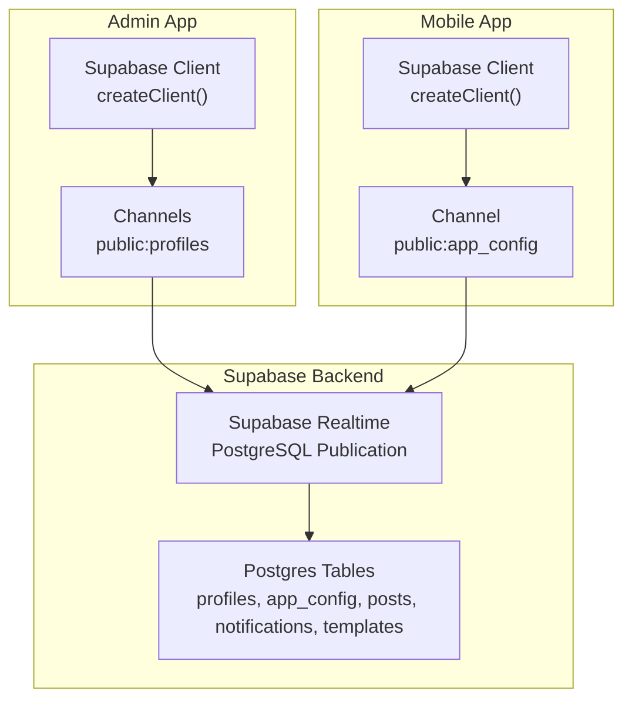
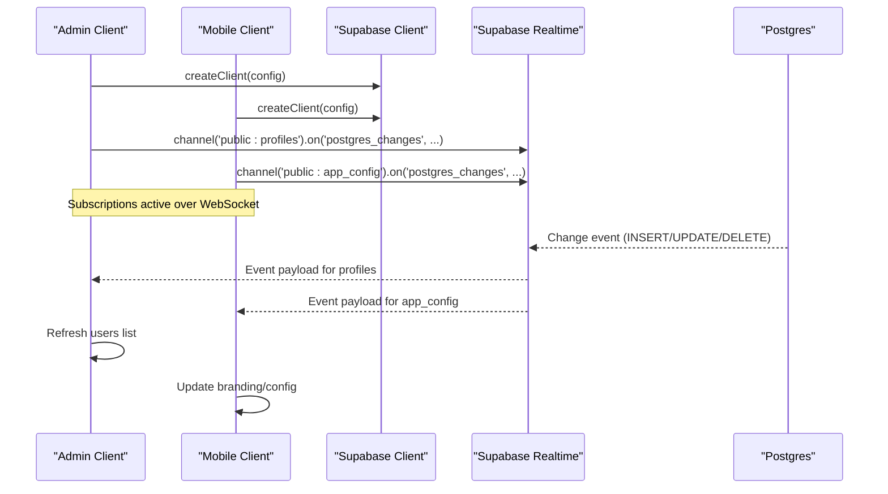
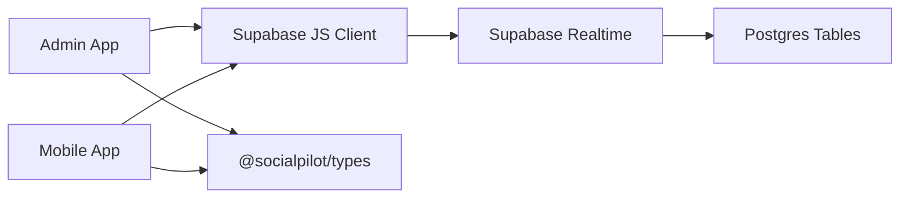
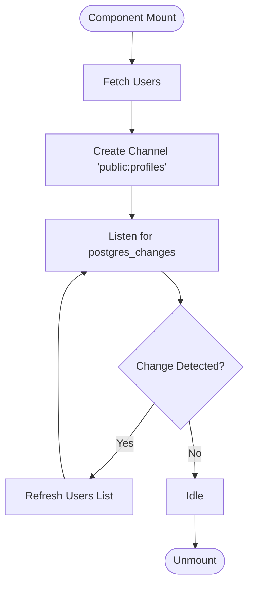
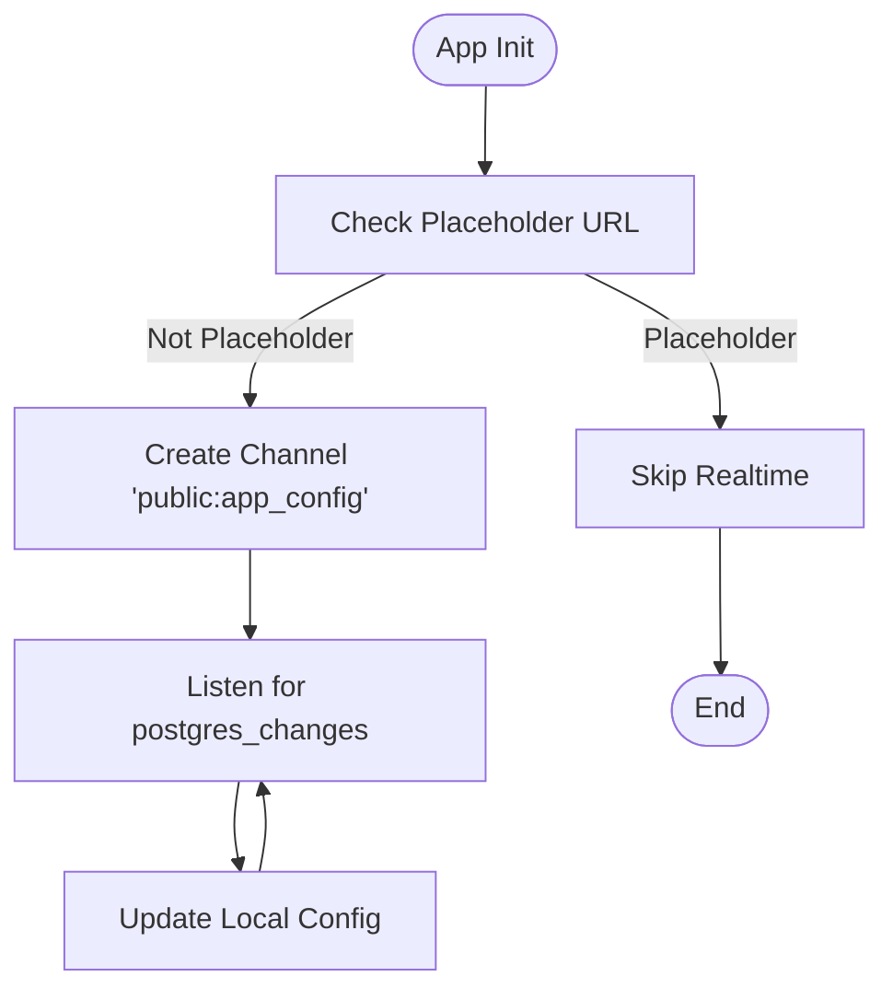

# WebSocket APIs

<cite>
**Referenced Files in This Document**
- [supabase.ts (Admin)](file://apps/admin/src/lib/supabase.ts)
- [supabase.ts (Mobile)](file://apps/mobile/src/services/supabase.ts)
- [useConfigStore.ts](file://apps/mobile/src/store/useConfigStore.ts)
- [users/page.tsx](file://apps/admin/src/app/(dashboard)/users/page.tsx)
- [notifications/page.tsx](file://apps/admin/src/app/(dashboard)/notifications/page.tsx)
- [initial_schema.sql](file://supabase/migrations/20240001000000_initial_schema.sql)
- [database.ts](file://packages/types/src/database.ts)
</cite>

## Table of Contents
1. [Introduction](#introduction)
2. [Project Structure](#project-structure)
3. [Core Components](#core-components)
4. [Architecture Overview](#architecture-overview)
5. [Detailed Component Analysis](#detailed-component-analysis)
6. [Dependency Analysis](#dependency-analysis)
7. [Performance Considerations](#performance-considerations)
8. [Troubleshooting Guide](#troubleshooting-guide)
9. [Conclusion](#conclusion)
10. [Appendices](#appendices)

## Introduction
This document describes the real-time communication layer used by SocialPilot AI Pro. The application uses Supabase Realtime over WebSockets to deliver live updates across admin and mobile clients. It covers connection establishment, authentication handshake, message formats, event types for live updates, lifecycle management (reconnection, heartbeat, error recovery), subscriptions for posts, notifications, analytics updates, and user presence patterns, plus client implementation examples, performance optimization, and debugging techniques.

## Project Structure
Realtime is implemented via Supabase JS clients configured per app:
- Admin Next.js app configures a Supabase client with session persistence and token refresh.
- Mobile Expo app configures a Supabase client with secure storage and platform-specific session handling.
- Both apps subscribe to database changes using Supabase channels on specific tables that are enabled for realtime publication.

**Diagram sources**
- [supabase.ts (Admin):1-14](file://apps/admin/src/lib/supabase.ts#L1-L14)
- [supabase.ts (Mobile):1-41](file://apps/mobile/src/services/supabase.ts#L1-L41)
- [initial_schema.sql:227-231](file://supabase/migrations/20240001000000_initial_schema.sql#L227-L231)

**Section sources**
- [supabase.ts (Admin):1-14](file://apps/admin/src/lib/supabase.ts#L1-L14)
- [supabase.ts (Mobile):1-41](file://apps/mobile/src/services/supabase.ts#L1-L41)
- [initial_schema.sql:227-231](file://supabase/migrations/20240001000000_initial_schema.sql#L227-L231)

## Core Components
- Supabase client initialization in both Admin and Mobile apps enables authenticated sessions and automatic token refresh.
- Channels subscribe to PostgreSQL publications for live updates on selected tables.
- Realtime-enabled tables include app_config, posts, notifications, and templates.

Key responsibilities:
- Establish and maintain authenticated connections via Supabase client configuration.
- Subscribe to table-level changes using channels.
- Handle channel lifecycle (subscribe/unsubscribe).
- React to changes by refreshing local state or triggering UI updates.

**Section sources**
- [supabase.ts (Admin):1-14](file://apps/admin/src/lib/supabase.ts#L1-L14)
- [supabase.ts (Mobile):1-41](file://apps/mobile/src/services/supabase.ts#L1-L41)
- [initial_schema.sql:227-231](file://supabase/migrations/20240001000000_initial_schema.sql#L227-L231)

## Architecture Overview
The realtime architecture leverages Supabase Realtime’s PostgreSQL publication mechanism. Clients create channels scoped to schema/table and listen for change events. When data changes occur in the database, Supabase broadcasts updates to all subscribed clients over WebSockets.

**Diagram sources**
- [users/page.tsx:32-46](file://apps/admin/src/app/(dashboard)/users/page.tsx#L32-L46)
- [useConfigStore.ts:39-65](file://apps/mobile/src/store/useConfigStore.ts#L39-L65)
- [initial_schema.sql:227-231](file://supabase/migrations/20240001000000_initial_schema.sql#L227-L231)

## Detailed Component Analysis

### Connection Establishment and Authentication Handshake
- Admin client initializes Supabase with environment variables and enables session persistence and auto-refresh.
- Mobile client initializes Supabase with secure storage adapter and platform-aware session handling; also enables auto-refresh and persistence.
- Authentication is handled by Supabase; once authenticated, realtime channels inherit the session context.

Implementation references:
- Admin client setup with auth options.
- Mobile client setup with secure storage and auth options.

**Section sources**
- [supabase.ts (Admin):1-14](file://apps/admin/src/lib/supabase.ts#L1-L14)
- [supabase.ts (Mobile):1-41](file://apps/mobile/src/services/supabase.ts#L1-L41)

### Realtime Subscriptions and Message Formats

#### Profiles (Users)
- Admin subscribes to changes on the profiles table to keep the users directory live.
- On any change, it refreshes the users list from the server.

Event type: postgres_changes on public.profiles.

**Section sources**
- [users/page.tsx:32-46](file://apps/admin/src/app/(dashboard)/users/page.tsx#L32-L46)

#### App Configuration (White-Label)
- Mobile subscribes to changes on app_config to receive live branding updates without reload.
- Placeholder URL detection prevents attempting realtime when not configured.

Event type: postgres_changes on public.app_config.

**Section sources**
- [useConfigStore.ts:39-65](file://apps/mobile/src/store/useConfigStore.ts#L39-L65)
- [initial_schema.sql:227-231](file://supabase/migrations/20240001000000_initial_schema.sql#L227-L231)

#### Notifications
- Admin can broadcast notifications by inserting records into the notifications table.
- Realtime publication includes notifications, enabling live updates to subscribers.

Event type: postgres_changes on public.notifications.

**Section sources**
- [notifications/page.tsx:14-60](file://apps/admin/src/app/(dashboard)/notifications/page.tsx#L14-L60)
- [initial_schema.sql:227-231](file://supabase/migrations/20240001000000_initial_schema.sql#L227-L231)

#### Posts and Templates
- Realtime publication includes posts and templates.
- While explicit subscriptions are not shown in the referenced files, these tables are enabled for realtime and can be subscribed similarly to profiles and app_config.

Event types: postgres_changes on public.posts and public.templates.

**Section sources**
- [initial_schema.sql:227-231](file://supabase/migrations/20240001000000_initial_schema.sql#L227-L231)

### Data Models
- Post, PostTemplate, AppConfig, AnalyticsMetric types define expected structures for realtime payloads.

**Section sources**
- [database.ts:1-72](file://packages/types/src/database.ts#L1-L72)

### Connection Lifecycle Management

#### Reconnection Strategy
- Supabase client configuration includes autoRefreshToken and persistSession, which manage re-authentication and reconnect behavior automatically.
- Channels rely on the underlying client’s connection state; when the client reconnects, channels re-establish subscriptions.

References:
- Admin client auth options.
- Mobile client auth options.

**Section sources**
- [supabase.ts (Admin):1-14](file://apps/admin/src/lib/supabase.ts#L1-L14)
- [supabase.ts (Mobile):1-41](file://apps/mobile/src/services/supabase.ts#L1-L41)

#### Heartbeat Mechanism
- Supabase Realtime manages keepalive and heartbeat internally; no custom heartbeat code is present in the referenced files.

[No sources needed since this section provides general guidance]

#### Error Recovery
- Channel subscription errors are caught in the mobile store; fallback returns a no-op cleanup function to avoid crashes.
- UI components use toast notifications to surface errors during operations like broadcasting notifications.

**Section sources**
- [useConfigStore.ts:39-65](file://apps/mobile/src/store/useConfigStore.ts#L39-L65)
- [notifications/page.tsx:14-60](file://apps/admin/src/app/(dashboard)/notifications/page.tsx#L14-L60)

### Real-Time Subscriptions Summary
- Profiles: Live updates in admin users directory.
- App Config: Live white-label branding updates in mobile.
- Notifications: Broadcast inserts trigger realtime updates.
- Posts/Templates: Enabled for realtime; can be subscribed similarly.

**Section sources**
- [users/page.tsx:32-46](file://apps/admin/src/app/(dashboard)/users/page.tsx#L32-L46)
- [useConfigStore.ts:39-65](file://apps/mobile/src/store/useConfigStore.ts#L39-L65)
- [notifications/page.tsx:14-60](file://apps/admin/src/app/(dashboard)/notifications/page.tsx#L14-L60)
- [initial_schema.sql:227-231](file://supabase/migrations/20240001000000_initial_schema.sql#L227-L231)

### Client Implementation Examples

#### Connection Setup
- Initialize Supabase client with environment variables and auth options.
- Ensure placeholder URLs are detected to avoid unnecessary realtime attempts.

References:
- Admin client setup.
- Mobile client setup with secure storage.

**Section sources**
- [supabase.ts (Admin):1-14](file://apps/admin/src/lib/supabase.ts#L1-L14)
- [supabase.ts (Mobile):1-41](file://apps/mobile/src/services/supabase.ts#L1-L41)

#### Event Listeners
- Create a channel scoped to schema/table and attach listeners for postgres_changes.
- On change, refresh data or update local state accordingly.

References:
- Admin users page subscribing to profiles changes.
- Mobile config store subscribing to app_config changes.

**Section sources**
- [users/page.tsx:32-46](file://apps/admin/src/app/(dashboard)/users/page.tsx#L32-L46)
- [useConfigStore.ts:39-65](file://apps/mobile/src/store/useConfigStore.ts#L39-L65)

#### Message Parsing
- Payloads conform to Supabase realtime change events; consume new/old values based on event type.
- Types for models guide parsing and usage in UI.

**Section sources**
- [database.ts:1-72](file://packages/types/src/database.ts#L1-L72)

#### Graceful Disconnection Handling
- Remove channels on component unmount or when no longer needed to free resources.
- In mobile store, catch errors and return a safe cleanup function.

**Section sources**
- [users/page.tsx:32-46](file://apps/admin/src/app/(dashboard)/users/page.tsx#L32-L46)
- [useConfigStore.ts:39-65](file://apps/mobile/src/store/useConfigStore.ts#L39-L65)

## Dependency Analysis
- Admin and Mobile apps depend on Supabase JS client for realtime capabilities.
- Database schema defines tables and enables realtime publication for key entities.
- Types package provides shared model definitions consumed by both apps.

**Diagram sources**
- [supabase.ts (Admin):1-14](file://apps/admin/src/lib/supabase.ts#L1-L14)
- [supabase.ts (Mobile):1-41](file://apps/mobile/src/services/supabase.ts#L1-L41)
- [initial_schema.sql:227-231](file://supabase/migrations/20240001000000_initial_schema.sql#L227-L231)
- [database.ts:1-72](file://packages/types/src/database.ts#L1-L72)

**Section sources**
- [supabase.ts (Admin):1-14](file://apps/admin/src/lib/supabase.ts#L1-L14)
- [supabase.ts (Mobile):1-41](file://apps/mobile/src/services/supabase.ts#L1-L41)
- [initial_schema.sql:227-231](file://supabase/migrations/20240001000000_initial_schema.sql#L227-L231)
- [database.ts:1-72](file://packages/types/src/database.ts#L1-L72)

## Performance Considerations
- Use targeted subscriptions per table to minimize payload size and processing overhead.
- Avoid redundant subscriptions; ensure channels are removed when no longer needed.
- Leverage Supabase’s built-in reconnection and token refresh to reduce manual handling.
- Batch operations where possible (e.g., notification broadcasts) to limit write load.

[No sources needed since this section provides general guidance]

## Troubleshooting Guide
- Verify Supabase URL and keys are set correctly; placeholder detection avoids realtime attempts when not configured.
- Check channel subscriptions exist and are removed properly to prevent memory leaks.
- Inspect toast messages for operation failures (e.g., broadcast dispatch errors).
- Confirm realtime publication includes required tables in the migration.

**Section sources**
- [supabase.ts (Admin):1-14](file://apps/admin/src/lib/supabase.ts#L1-L14)
- [supabase.ts (Mobile):1-41](file://apps/mobile/src/services/supabase.ts#L1-L41)
- [notifications/page.tsx:14-60](file://apps/admin/src/app/(dashboard)/notifications/page.tsx#L14-L60)
- [initial_schema.sql:227-231](file://supabase/migrations/20240001000000_initial_schema.sql#L227-L231)

## Conclusion
SocialPilot AI Pro implements real-time features through Supabase Realtime WebSockets. Clients authenticate via Supabase, subscribe to table-level changes, and react to live updates. The system supports live profiles, app configuration, notifications, and is ready for posts and templates. Built-in reconnection and token refresh simplify lifecycle management, while careful channel usage ensures efficient performance.

[No sources needed since this section summarizes without analyzing specific files]

## Appendices

### Realtime Event Flow for Profiles

**Diagram sources**
- [users/page.tsx:32-46](file://apps/admin/src/app/(dashboard)/users/page.tsx#L32-L46)

### Realtime Event Flow for App Configuration

**Diagram sources**
- [useConfigStore.ts:39-65](file://apps/mobile/src/store/useConfigStore.ts#L39-L65)