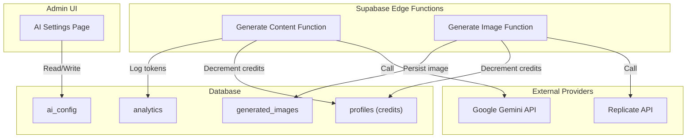
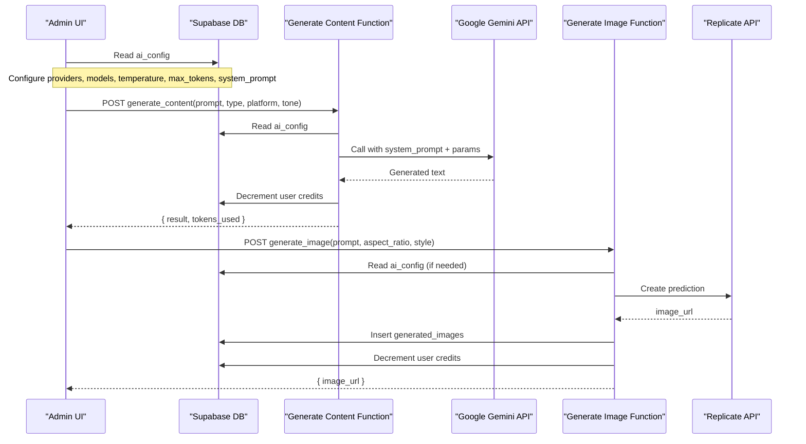
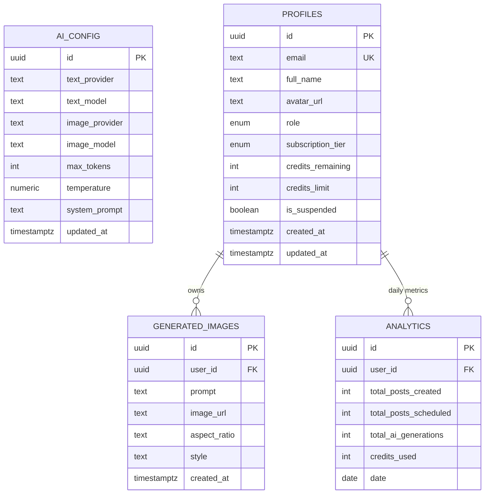
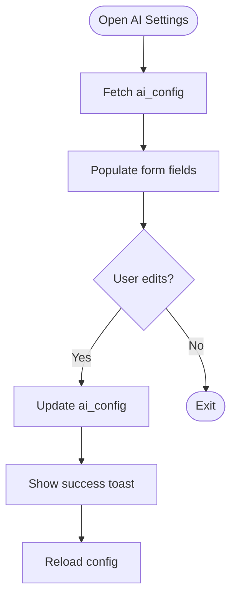
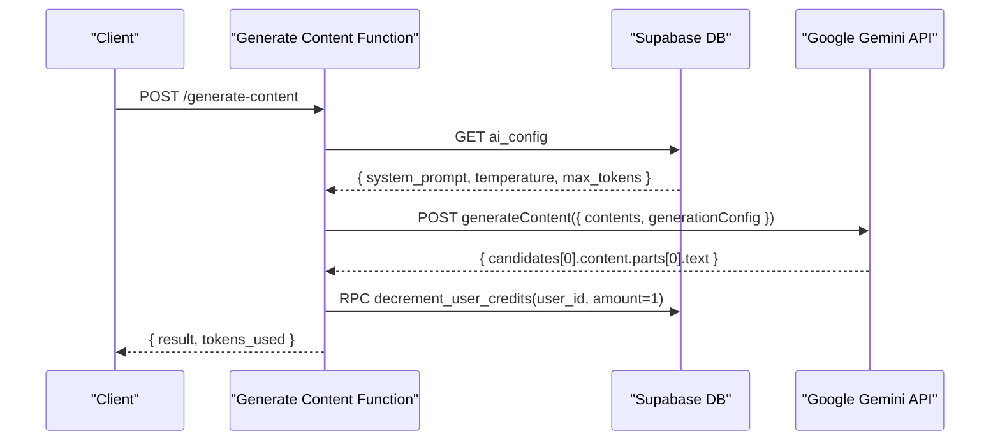
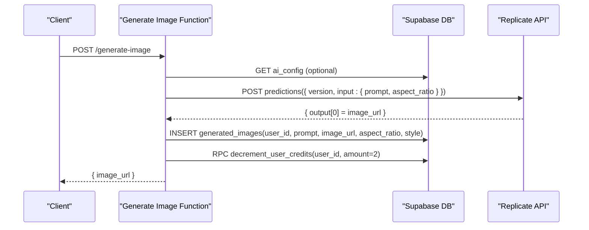
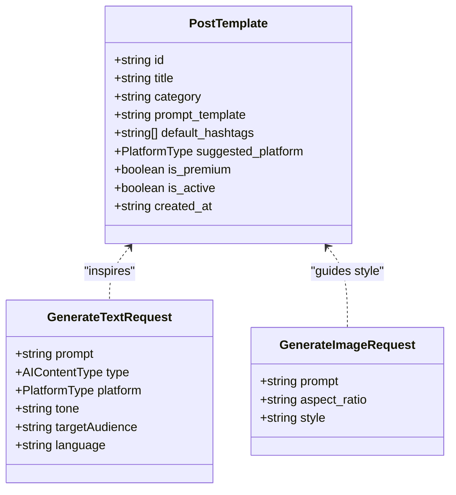
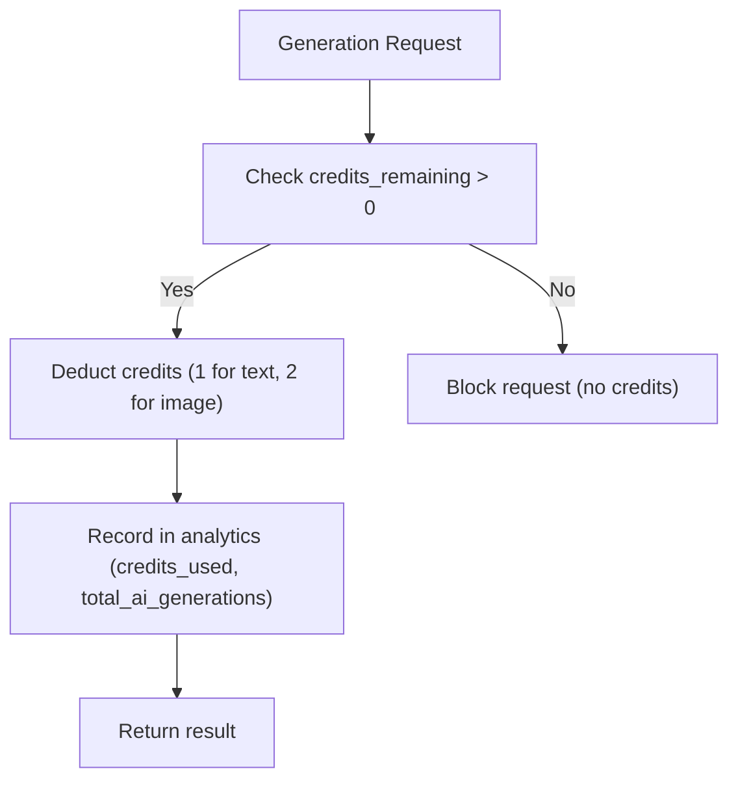
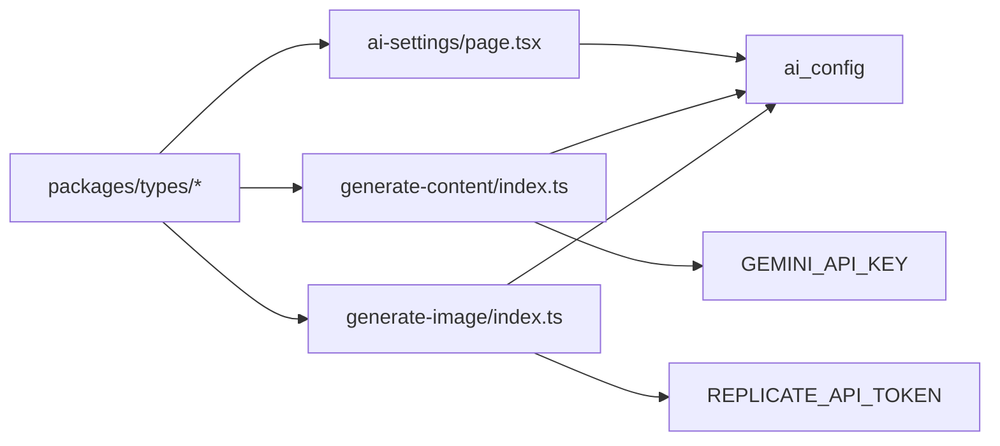

# AI Configuration

<cite>
**Referenced Files in This Document**
- [generate-content/index.ts](file://supabase/functions/generate-content/index.ts)
- [generate-image/index.ts](file://supabase/functions/generate-image/index.ts)
- [20240001000000_initial_schema.sql](file://supabase/migrations/20240001000000_initial_schema.sql)
- [ai-settings/page.tsx](file://apps/admin/src/app/(dashboard)/ai-settings/page.tsx)
- [database.ts](file://packages/types/src/database.ts)
- [api.ts](file://packages/types/src/api.ts)
- [users/page.tsx](file://apps/admin/src/app/(dashboard)/users/page.tsx)
- [analytics/page.tsx](file://apps/admin/src/app/(dashboard)/analytics/page.tsx)
- [TROUBLESHOOTING.md](file://TROUBLESHOOTING.md)
</cite>

## Table of Contents
1. Introduction
2. Project Structure
3. Core Components
4. Architecture Overview
5. Detailed Component Analysis
6. Dependency Analysis
7. Performance Considerations
8. Troubleshooting Guide
9. Conclusion

## Introduction
This document explains the AI Configuration system for SocialPilot AI Pro. It covers how to set up and manage AI providers (Google Gemini and Replicate), configure text and image generation parameters, define content templates and tone/style settings, integrate the credit system, track usage, and monitor performance. It also provides troubleshooting guidance and optimization strategies for reliable AI integrations.

## Project Structure
The AI configuration spans three layers:
- Admin UI: Centralized settings page to manage active AI models, inference parameters, and system prompts.
- Serverless Functions: Supabase Edge Functions that call external AI APIs and enforce credits and analytics.
- Database Schema: Centralized AI configuration table, user profiles with credits, generated images log, and analytics metrics.

**Diagram sources**
- [ai-settings/page.tsx:23-85](file://apps/admin/src/app/(dashboard)/ai-settings/page.tsx#L23-L85)
- [generate-content/index.ts:38-91](file://supabase/functions/generate-content/index.ts#L38-L91)
- [generate-image/index.ts:38-79](file://supabase/functions/generate-image/index.ts#L38-L79)
- [20240001000000_initial_schema.sql:31-42](file://supabase/migrations/20240001000000_initial_schema.sql#L31-L42)

**Section sources**
- [ai-settings/page.tsx:23-85](file://apps/admin/src/app/(dashboard)/ai-settings/page.tsx#L23-L85)
- [generate-content/index.ts:38-91](file://supabase/functions/generate-content/index.ts#L38-L91)
- [generate-image/index.ts:38-79](file://supabase/functions/generate-image/index.ts#L38-L79)
- [20240001000000_initial_schema.sql:31-42](file://supabase/migrations/20240001000000_initial_schema.sql#L31-L42)

## Core Components
- AI Configuration Store: Central table holding active text/image providers, model slugs, temperature, max tokens, and system prompt.
- Admin Settings UI: Read/write interface for administrators to update AI engine parameters.
- Text Generation Pipeline: Edge function that composes a prompt using system prompt, type, platform, tone, and calls Google Gemini; decrements credits and returns results.
- Image Generation Pipeline: Edge function that calls Replicate with style and aspect ratio, persists image metadata, and decrements credits.
- Credit System: User profile tracks remaining and limit; functions decrement credits per generation.
- Analytics and Templates: Tables for daily metrics and reusable prompt templates to streamline workflows.

Key configuration fields:
- text_provider: gemini or openai
- text_model: e.g., gemini-1.5-pro
- image_provider: replicate, stability, or openai
- image_model: e.g., stability-ai/sdxl
- temperature: controls creativity
- max_tokens: output length cap
- system_prompt: master instruction for copywriting tone and behavior

**Section sources**
- [20240001000000_initial_schema.sql:31-42](file://supabase/migrations/20240001000000_initial_schema.sql#L31-L42)
- [ai-settings/page.tsx:23-85](file://apps/admin/src/app/(dashboard)/ai-settings/page.tsx#L23-L85)
- [generate-content/index.ts:38-91](file://supabase/functions/generate-content/index.ts#L38-L91)
- [generate-image/index.ts:38-79](file://supabase/functions/generate-image/index.ts#L38-L79)

## Architecture Overview
The system uses a serverless architecture where client requests are routed to Supabase Edge Functions. These functions authenticate users via Supabase Auth, read centralized AI configuration from the database, call external AI APIs, persist outputs, and enforce the credit system.

**Diagram sources**
- [generate-content/index.ts:38-91](file://supabase/functions/generate-content/index.ts#L38-L91)
- [generate-image/index.ts:38-79](file://supabase/functions/generate-image/index.ts#L38-L79)
- [20240001000000_initial_schema.sql:31-42](file://supabase/migrations/20240001000000_initial_schema.sql#L31-L42)

## Detailed Component Analysis

### AI Configuration Data Model
Centralized schema defines the AI configuration and related entities:
- ai_config: Active provider/model selection, inference parameters, and system prompt
- profiles: User identity, subscription tier, credits_remaining, credits_limit, suspension status
- generated_images: Audit trail for image generations
- analytics: Daily aggregated metrics including total_ai_generations and credits_used

**Diagram sources**
- [20240001000000_initial_schema.sql:31-42](file://supabase/migrations/20240001000000_initial_schema.sql#L31-L42)
- [20240001000000_initial_schema.sql:44-58](file://supabase/migrations/20240001000000_initial_schema.sql#L44-L58)
- [20240001000000_initial_schema.sql:111-132](file://supabase/migrations/20240001000000_initial_schema.sql#L111-L132)

**Section sources**
- [20240001000000_initial_schema.sql:31-42](file://supabase/migrations/20240001000000_initial_schema.sql#L31-L42)
- [20240001000000_initial_schema.sql:44-58](file://supabase/migrations/20240001000000_initial_schema.sql#L44-L58)
- [20240001000000_initial_schema.sql:111-132](file://supabase/migrations/20240001000000_initial_schema.sql#L111-L132)

### Admin AI Settings Interface
Administrators can load and update AI configuration:
- Fetches current ai_config row and populates form fields
- Updates text_provider, text_model, image_provider, image_model, temperature, max_tokens, system_prompt
- Persists changes and refreshes state

**Diagram sources**
- [ai-settings/page.tsx:23-85](file://apps/admin/src/app/(dashboard)/ai-settings/page.tsx#L23-L85)

**Section sources**
- [ai-settings/page.tsx:23-85](file://apps/admin/src/app/(dashboard)/ai-settings/page.tsx#L23-L85)

### Text Generation Workflow (Google Gemini)
The text generation function:
- Authenticates the user
- Reads ai_config for system_prompt, temperature, max_tokens
- Calls Google Gemini with a composed prompt including type, platform, and tone
- Returns generated text and token usage
- Decrements user credits

**Diagram sources**
- [generate-content/index.ts:38-91](file://supabase/functions/generate-content/index.ts#L38-L91)

**Section sources**
- [generate-content/index.ts:38-91](file://supabase/functions/generate-content/index.ts#L38-L91)

### Image Generation Workflow (Replicate)
The image generation function:
- Authenticates the user
- Validates input prompt and optional aspect_ratio/style
- Calls Replicate to create an image prediction
- Persists generated image metadata
- Decrements user credits by two

**Diagram sources**
- [generate-image/index.ts:38-79](file://supabase/functions/generate-image/index.ts#L38-L79)

**Section sources**
- [generate-image/index.ts:38-79](file://supabase/functions/generate-image/index.ts#L38-L79)

### Content Templates and Tone/Style
- Templates: Stored in the templates table with category, prompt_template, suggested_platform, and flags for premium/active status. Admins can create, view, and delete templates.
- Tone/Style: The text generation pipeline accepts tone and platform to tailor output. The image generation pipeline supports style and aspect ratio.

**Diagram sources**
- [20240001000000_initial_schema.sql:98-109](file://supabase/migrations/20240001000000_initial_schema.sql#L98-L109)
- [api.ts:3-27](file://packages/types/src/api.ts#L3-L27)

**Section sources**
- [20240001000000_initial_schema.sql:98-109](file://supabase/migrations/20240001000000_initial_schema.sql#L98-L109)
- [api.ts:3-27](file://packages/types/src/api.ts#L3-L27)

### Credit System Integration and Usage Tracking
- Credits are stored per user in profiles.credits_remaining and capped by credits_limit.
- Text generation decrements credits by one; image generation decrements by two.
- Admin UI allows adding credits to users and shows current balances.
- Analytics table aggregates credits_used and total_ai_generations per day.

**Diagram sources**
- [generate-content/index.ts:82-91](file://supabase/functions/generate-content/index.ts#L82-L91)
- [generate-image/index.ts:64-79](file://supabase/functions/generate-image/index.ts#L64-L79)
- [users/page.tsx:63-76](file://apps/admin/src/app/(dashboard)/users/page.tsx#L63-L76)
- [20240001000000_initial_schema.sql:44-58](file://supabase/migrations/20240001000000_initial_schema.sql#L44-L58)
- [20240001000000_initial_schema.sql:122-132](file://supabase/migrations/20240001000000_initial_schema.sql#L122-L132)

**Section sources**
- [generate-content/index.ts:82-91](file://supabase/functions/generate-content/index.ts#L82-L91)
- [generate-image/index.ts:64-79](file://supabase/functions/generate-image/index.ts#L64-L79)
- [users/page.tsx:63-76](file://apps/admin/src/app/(dashboard)/users/page.tsx#L63-L76)
- [20240001000000_initial_schema.sql:44-58](file://supabase/migrations/20240001000000_initial_schema.sql#L44-L58)
- [20240001000000_initial_schema.sql:122-132](file://supabase/migrations/20240001000000_initial_schema.sql#L122-L132)

## Dependency Analysis
- Admin UI depends on the ai_config table to display and edit settings.
- Edge Functions depend on environment variables for provider credentials and Supabase services for auth and data.
- Types package centralizes shared interfaces for requests/responses and database models.

**Diagram sources**
- [ai-settings/page.tsx:23-85](file://apps/admin/src/app/(dashboard)/ai-settings/page.tsx#L23-L85)
- [generate-content/index.ts:48-73](file://supabase/functions/generate-content/index.ts#L48-L73)
- [generate-image/index.ts:38-62](file://supabase/functions/generate-image/index.ts#L38-L62)
- [database.ts:52-62](file://packages/types/src/database.ts#L52-L62)
- [api.ts:3-27](file://packages/types/src/api.ts#L3-L27)

**Section sources**
- [ai-settings/page.tsx:23-85](file://apps/admin/src/app/(dashboard)/ai-settings/page.tsx#L23-L85)
- [generate-content/index.ts:48-73](file://supabase/functions/generate-content/index.ts#L48-L73)
- [generate-image/index.ts:38-62](file://supabase/functions/generate-image/index.ts#L38-L62)
- [database.ts:52-62](file://packages/types/src/database.ts#L52-L62)
- [api.ts:3-27](file://packages/types/src/api.ts#L3-L27)

## Performance Considerations
- Temperature and Max Tokens: Tune temperature for creativity vs determinism; adjust max_tokens to balance quality and cost.
- Provider Selection: Use Gemini for text and Replicate for images as configured; ensure keys are set to avoid fallback paths.
- Rate Limiting: Implement application-level throttling around function invocations to respect provider quotas.
- Caching: Cache frequent template-based prompts and reuse results when appropriate.
- Monitoring: Track tokens consumed and credits used via analytics to identify spikes and optimize costs.

[No sources needed since this section provides general guidance]

## Troubleshooting Guide
Common issues and resolutions:
- Module resolution errors in monorepo: Ensure dependencies are installed from the root folder to resolve workspace packages correctly.
- Supabase permission denied or empty results: Verify Row Level Security policies are applied by running the initial schema migration.
- Admin access denied: Update user role to admin or super_admin in the profiles table.
- Realtime theme updates not reflecting: Confirm realtime publication is enabled for relevant tables.

Additional AI-specific checks:
- Missing provider keys: Ensure GEMINI_API_KEY and REPLICATE_API_TOKEN are set in Supabase secrets.
- Unauthorized errors: Confirm Supabase Auth headers are passed to Edge Functions.
- No credits remaining: Adjust credits via admin UI or verify deduction logic.

**Section sources**
- [TROUBLESHOOTING.md:3-23](file://TROUBLESHOOTING.md#L3-L23)
- [generate-content/index.ts:21-36](file://supabase/functions/generate-content/index.ts#L21-L36)
- [generate-image/index.ts:21-36](file://supabase/functions/generate-image/index.ts#L21-L36)
- [users/page.tsx:63-76](file://apps/admin/src/app/(dashboard)/users/page.tsx#L63-L76)

## Conclusion
The AI Configuration system centralizes provider and model management, enforces consistent inference parameters, and integrates tightly with the credit system and analytics. Administrators can control text and image generation through a dedicated UI, while serverless functions handle secure, auditable interactions with external AI services. Proper configuration, monitoring, and troubleshooting ensure reliable performance and cost control across the platform.

[No sources needed since this section summarizes without analyzing specific files]