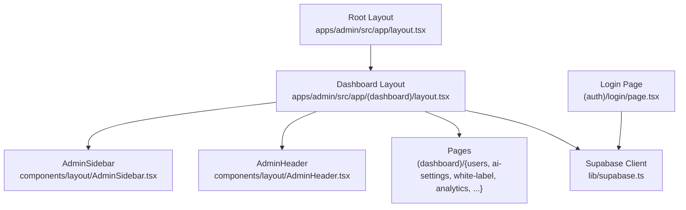
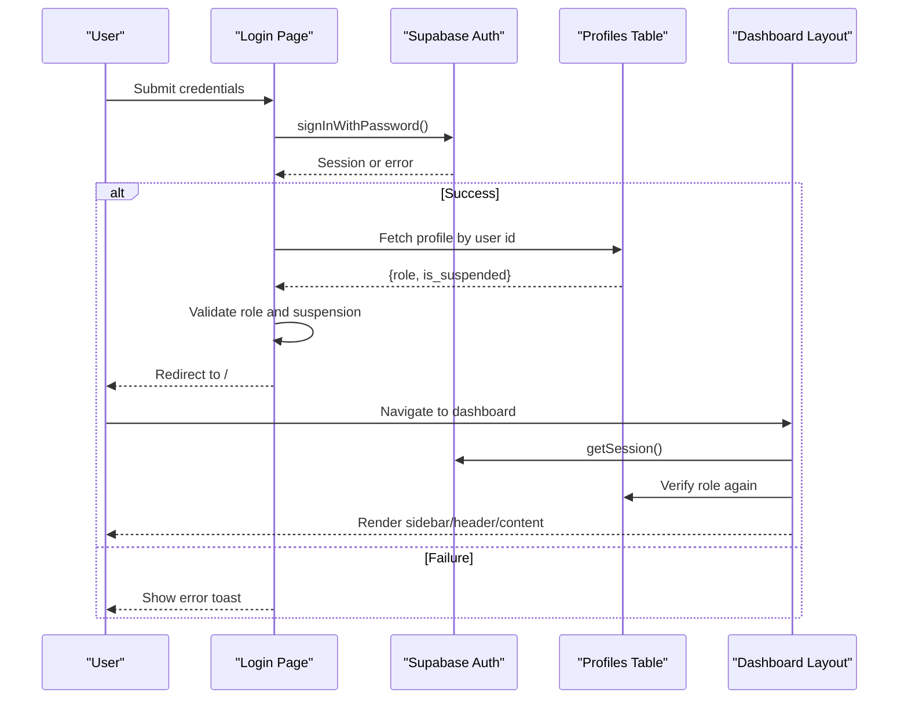
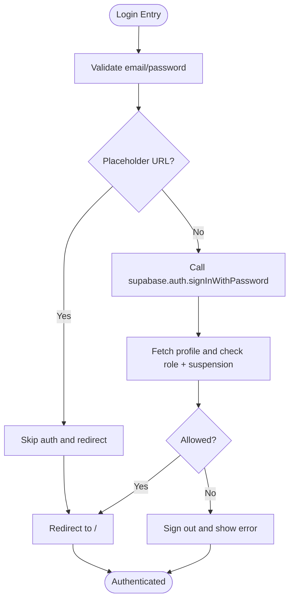
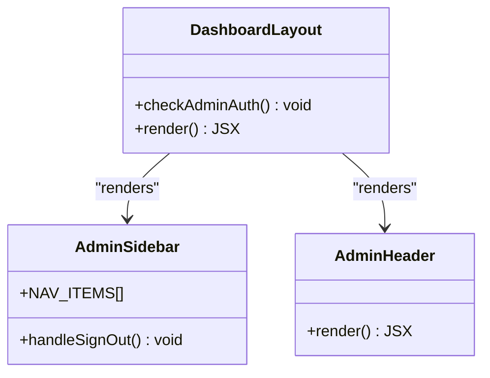
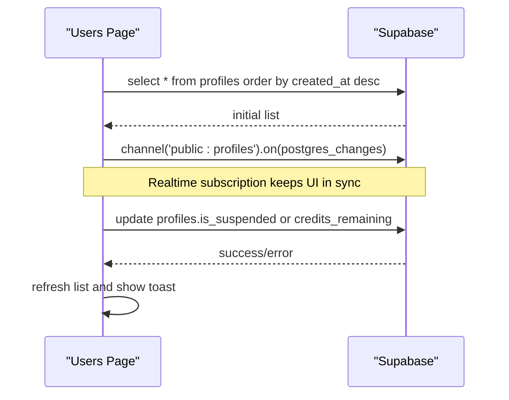
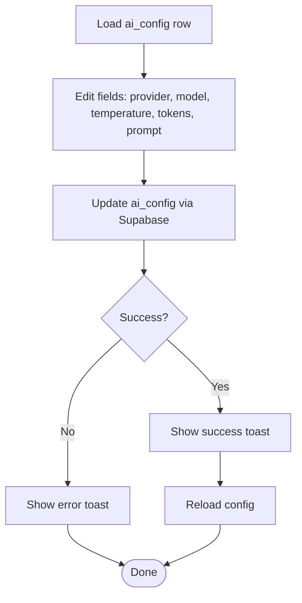
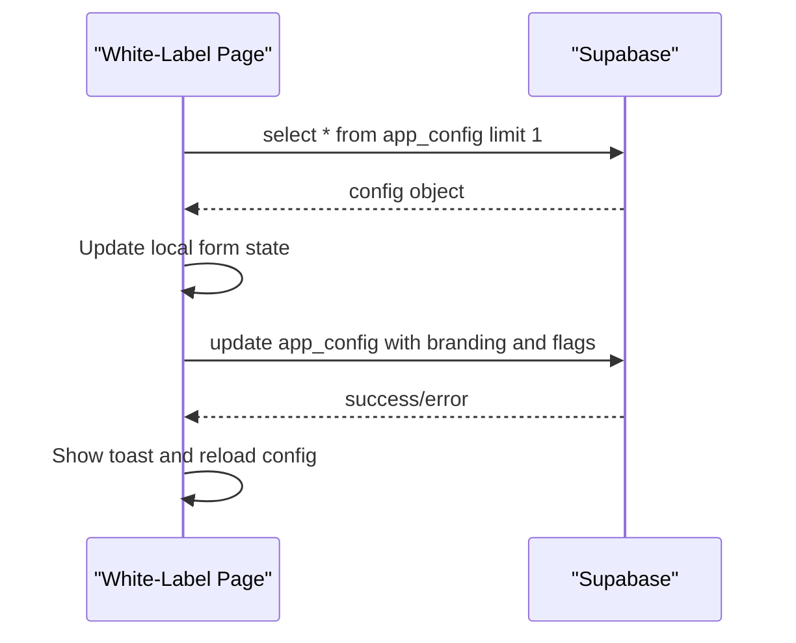
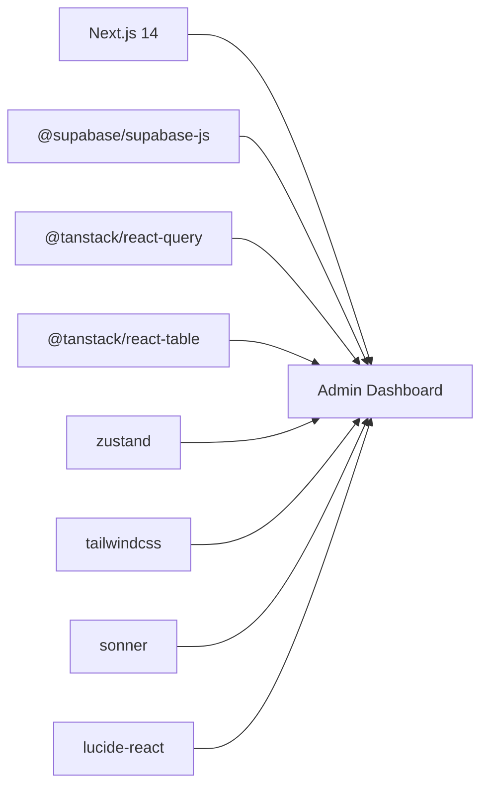

# Admin Dashboard

<cite>
**Referenced Files in This Document**
- [layout.tsx](file://apps/admin/src/app/layout.tsx)
- [dashboard layout.tsx](file://apps/admin/src/app/(dashboard)/layout.tsx)
- [login page.tsx](file://apps/admin/src/app/(auth)/login/page.tsx)
- [supabase client.ts](file://apps/admin/src/lib/supabase.ts)
- [AdminHeader.tsx](file://apps/admin/src/components/layout/AdminHeader.tsx)
- [AdminSidebar.tsx](file://apps/admin/src/components/layout/AdminSidebar.tsx)
- [dashboard overview page.tsx](file://apps/admin/src/app/(dashboard)/page.tsx)
- [users page.tsx](file://apps/admin/src/app/(dashboard)/users/page.tsx)
- [ai-settings page.tsx](file://apps/admin/src/app/(dashboard)/ai-settings/page.tsx)
- [white-label page.tsx](file://apps/admin/src/app/(dashboard)/white-label/page.tsx)
- [analytics page.tsx](file://apps/admin/src/app/(dashboard)/analytics/page.tsx)
- [package.json](file://apps/admin/package.json)
- [next.config.js](file://apps/admin/next.config.js)
</cite>

## Table of Contents
1. Introduction
2. Project Structure
3. Core Components
4. Architecture Overview
5. Detailed Component Analysis
6. Dependency Analysis
7. Performance Considerations
8. Troubleshooting Guide
9. Conclusion
10. Appendices

## Introduction
This document provides comprehensive documentation for the Admin Dashboard built with Next.js 14 using the App Router. It explains the application structure, routing system, authentication flow, dashboard layout components (header, sidebar, main content), and integration with Supabase for data operations and real-time updates. It also documents key administrative features such as user management, AI configuration, white-label settings, and analytics monitoring. Finally, it outlines component architecture patterns, state management approach, UI/UX design principles, and guidance for extending the dashboard with new features.

## Project Structure
The Admin Dashboard is a Next.js 14 application organized under apps/admin. Key directories:
- src/app: Defines routes using Next.js App Router. Grouped routes include (auth) for login and (dashboard) for protected admin pages.
- src/components: Shared UI and layout components, including AdminHeader and AdminSidebar.
- src/lib: Utilities and Supabase client configuration.
- Root config files: next.config.js, package.json, tailwind.config.ts, tsconfig.json.

Routing highlights:
- Root layout sets global metadata and theme classes.
- Protected dashboard layout enforces authentication and role checks before rendering the sidebar, header, and page content.
- Feature pages are colocated under (dashboard) for users, ai-settings, white-label, analytics, posts, templates, subscriptions, notifications, and settings.

**Diagram sources**
- [layout.tsx:1-24](file://apps/admin/src/app/layout.tsx#L1-L24)
- [dashboard layout.tsx:1-71](file://apps/admin/src/app/(dashboard)/layout.tsx#L1-L71)
- [AdminSidebar.tsx:1-94](file://apps/admin/src/components/layout/AdminSidebar.tsx#L1-L94)
- [AdminHeader.tsx:1-28](file://apps/admin/src/components/layout/AdminHeader.tsx#L1-L28)
- [login page.tsx:1-167](file://apps/admin/src/app/(auth)/login/page.tsx#L1-L167)
- [supabase client.ts:1-14](file://apps/admin/src/lib/supabase.ts#L1-L14)

**Section sources**
- [layout.tsx:1-24](file://apps/admin/src/app/layout.tsx#L1-L24)
- [dashboard layout.tsx:1-71](file://apps/admin/src/app/(dashboard)/layout.tsx#L1-L71)
- [package.json:1-41](file://apps/admin/package.json#L1-L41)
- [next.config.js:1-8](file://apps/admin/next.config.js#L1-L8)

## Core Components
- RootLayout: Sets global metadata, dark theme, and toasts container.
- DashboardLayout: Enforces authentication and role-based access; renders AdminSidebar, AdminHeader, and page content.
- AdminSidebar: Navigation menu with active state detection and sign-out action.
- AdminHeader: Displays status indicators and mode badges.
- Login Page: Handles credential submission, placeholder bypass for development, role verification, and redirection.

Key responsibilities:
- Authentication gating at the layout level ensures only authorized admins can access protected routes.
- Sidebar centralizes navigation and logout behavior.
- Header communicates runtime status and admin mode.

**Section sources**
- [layout.tsx:1-24](file://apps/admin/src/app/layout.tsx#L1-L24)
- [dashboard layout.tsx:1-71](file://apps/admin/src/app/(dashboard)/layout.tsx#L1-L71)
- [AdminSidebar.tsx:1-94](file://apps/admin/src/components/layout/AdminSidebar.tsx#L1-L94)
- [AdminHeader.tsx:1-28](file://apps/admin/src/components/layout/AdminHeader.tsx#L1-L28)
- [login page.tsx:1-167](file://apps/admin/src/app/(auth)/login/page.tsx#L1-L167)

## Architecture Overview
The Admin Dashboard follows a layered architecture:
- Presentation layer: Next.js App Router pages and layout components.
- State layer: Local React state per page/component; optional global state via Zustand (available in dependencies).
- Data layer: Supabase client for REST and Realtime subscriptions.
- Security layer: Role checks in dashboard layout and login flow.

**Diagram sources**
- [login page.tsx:15-78](file://apps/admin/src/app/(auth)/login/page.tsx#L15-L78)
- [dashboard layout.tsx:17-46](file://apps/admin/src/app/(dashboard)/layout.tsx#L17-L46)
- [supabase client.ts:1-14](file://apps/admin/src/lib/supabase.ts#L1-L14)

## Detailed Component Analysis

### Authentication Flow
- Login Page: Validates inputs, supports placeholder bypass for development, authenticates via Supabase, verifies role and suspension status, and navigates on success.
- Dashboard Layout: Guards routes by checking session and role; shows loading spinner while verifying; redirects unauthorized users back to login.

**Diagram sources**
- [login page.tsx:15-78](file://apps/admin/src/app/(auth)/login/page.tsx#L15-L78)
- [dashboard layout.tsx:17-46](file://apps/admin/src/app/(dashboard)/layout.tsx#L17-L46)

**Section sources**
- [login page.tsx:15-78](file://apps/admin/src/app/(auth)/login/page.tsx#L15-L78)
- [dashboard layout.tsx:17-46](file://apps/admin/src/app/(dashboard)/layout.tsx#L17-L46)

### Dashboard Layout and Navigation
- DashboardLayout composes AdminSidebar and AdminHeader around page content.
- AdminSidebar uses Next.js router hooks to highlight active links and provides a sign-out action that clears session and redirects to login.
- AdminHeader displays live status indicators and admin mode badge.

**Diagram sources**
- [dashboard layout.tsx:1-71](file://apps/admin/src/app/(dashboard)/layout.tsx#L1-L71)
- [AdminSidebar.tsx:1-94](file://apps/admin/src/components/layout/AdminSidebar.tsx#L1-L94)
- [AdminHeader.tsx:1-28](file://apps/admin/src/components/layout/AdminHeader.tsx#L1-L28)

**Section sources**
- [dashboard layout.tsx:1-71](file://apps/admin/src/app/(dashboard)/layout.tsx#L1-L71)
- [AdminSidebar.tsx:1-94](file://apps/admin/src/components/layout/AdminSidebar.tsx#L1-L94)
- [AdminHeader.tsx:1-28](file://apps/admin/src/components/layout/AdminHeader.tsx#L1-L28)

### User Management
- Users page fetches profiles from Supabase and subscribes to realtime changes to keep the table updated.
- Supports search filtering, toggling suspension, and adding credits.
- Uses toast notifications for feedback and handles errors gracefully.

**Diagram sources**
- [users page.tsx:14-46](file://apps/admin/src/app/(dashboard)/users/page.tsx#L14-L46)
- [users page.tsx:48-76](file://apps/admin/src/app/(dashboard)/users/page.tsx#L48-L76)

**Section sources**
- [users page.tsx:14-76](file://apps/admin/src/app/(dashboard)/users/page.tsx#L14-L76)

### AI Configuration
- AI Settings page loads current configuration from ai_config and allows editing model providers, models, temperature, max tokens, and system prompt.
- Saves updates back to Supabase and notifies users via toast.

**Diagram sources**
- [ai-settings page.tsx:23-48](file://apps/admin/src/app/(dashboard)/ai-settings/page.tsx#L23-L48)
- [ai-settings page.tsx:54-85](file://apps/admin/src/app/(dashboard)/ai-settings/page.tsx#L54-L85)

**Section sources**
- [ai-settings page.tsx:23-85](file://apps/admin/src/app/(dashboard)/ai-settings/page.tsx#L23-L85)

### White-Label Settings
- White-Label page manages app identity, colors, support email, feature flags (RevenueCat, social login), and maintenance mode.
- Persists changes to app_config and broadcasts updates to mobile clients via Supabase Realtime.

**Diagram sources**
- [white-label page.tsx:25-52](file://apps/admin/src/app/(dashboard)/white-label/page.tsx#L25-L52)
- [white-label page.tsx:58-91](file://apps/admin/src/app/(dashboard)/white-label/page.tsx#L58-L91)

**Section sources**
- [white-label page.tsx:25-91](file://apps/admin/src/app/(dashboard)/white-label/page.tsx#L25-L91)

### Analytics Monitoring
- Analytics page presents high-level metrics and platform channel breakdowns.
- Uses static placeholders for demonstration; can be extended to fetch live metrics from Supabase or server functions.

**Section sources**
- [analytics page.tsx:1-82](file://apps/admin/src/app/(dashboard)/analytics/page.tsx#L1-L82)

## Dependency Analysis
External dependencies relevant to the Admin Dashboard:
- Next.js 14 for routing and build tooling.
- Supabase JS client for auth and database operations.
- React Query and React Table available for advanced data fetching and table features.
- Zustand for potential global state management.
- Tailwind CSS for styling.
- Sonner for toast notifications.
- Lucide icons for UI elements.

**Diagram sources**
- [package.json:11-31](file://apps/admin/package.json#L11-L31)

**Section sources**
- [package.json:11-31](file://apps/admin/package.json#L11-L31)

## Performance Considerations
- Use Supabase Realtime channels judiciously; unsubscribe when components unmount to avoid memory leaks.
- Debounce search inputs in large datasets to reduce re-renders and network calls.
- Prefer server-side queries where possible and cache results with React Query for frequently accessed data.
- Keep layout-level auth checks minimal and efficient; avoid redundant profile lookups.
- Optimize images and assets for faster load times; leverage CDN if hosting externally.

[No sources needed since this section provides general guidance]

## Troubleshooting Guide
Common issues and resolutions:
- Authentication failures: Ensure Supabase environment variables are correctly set; verify user roles in profiles table; check for suspended accounts.
- Realtime not updating: Confirm channel subscription exists and removeChannel is called on cleanup; verify Postgres triggers or RLS policies allow changes.
- Placeholder bypass: In development, placeholder URLs skip auth; ensure production builds use real Supabase endpoints.
- Toast errors: Inspect Supabase responses and handle errors consistently; log messages for debugging.

**Section sources**
- [login page.tsx:22-78](file://apps/admin/src/app/(auth)/login/page.tsx#L22-L78)
- [dashboard layout.tsx:17-46](file://apps/admin/src/app/(dashboard)/layout.tsx#L17-L46)
- [users page.tsx:32-46](file://apps/admin/src/app/(dashboard)/users/page.tsx#L32-L46)

## Conclusion
The Admin Dashboard leverages Next.js 14’s App Router for structured routing, Supabase for robust authentication and real-time data synchronization, and a clean component architecture for maintainability. The dashboard layout enforces secure access, while feature pages provide essential administrative capabilities like user management, AI configuration, white-label customization, and analytics monitoring. With clear extension points and consistent patterns, adding new features is straightforward.

[No sources needed since this section summarizes without analyzing specific files]

## Appendices

### Extending the Dashboard
- Add a new route: Create a new page under (dashboard) and add a corresponding entry in AdminSidebar navigation.
- Implement data fetching: Use Supabase client for queries and Realtime subscriptions; consider React Query for caching and background updates.
- Manage state: Use local React state for simple forms; adopt Zustand for shared global state across components if needed.
- Styling: Follow Tailwind utility classes and existing design tokens; reuse glass-panel and color schemes for consistency.
- Testing: Write unit tests for utilities and integration tests for critical flows like authentication and data mutations.

[No sources needed since this section provides general guidance]