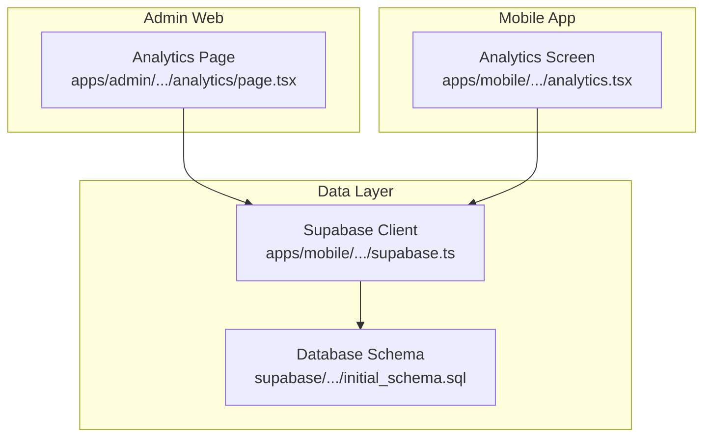
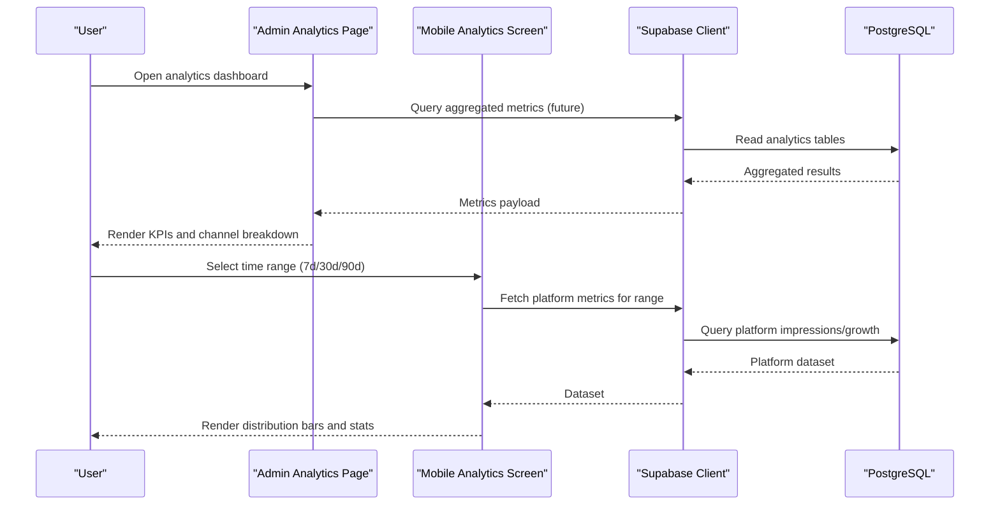
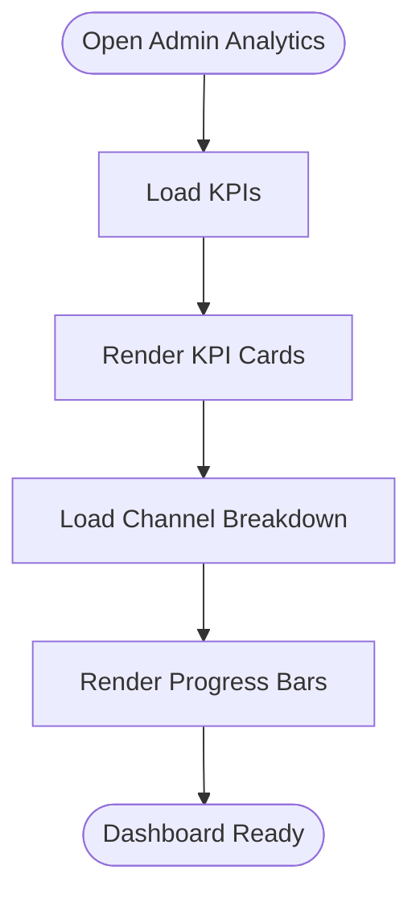
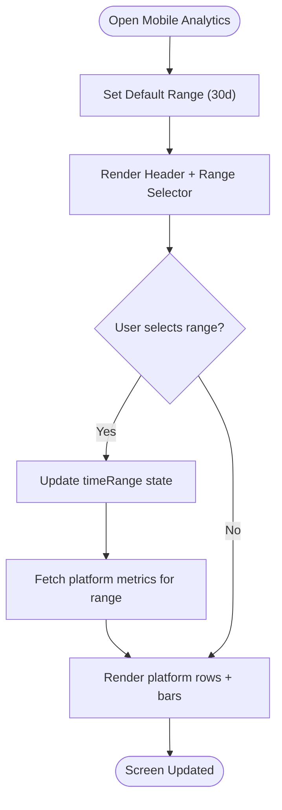
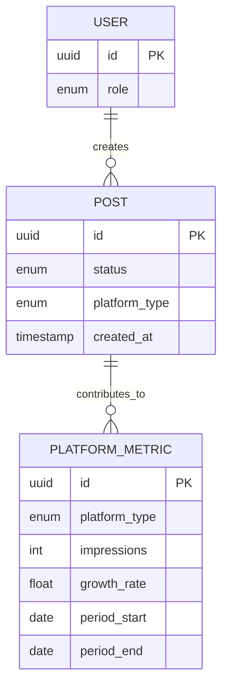
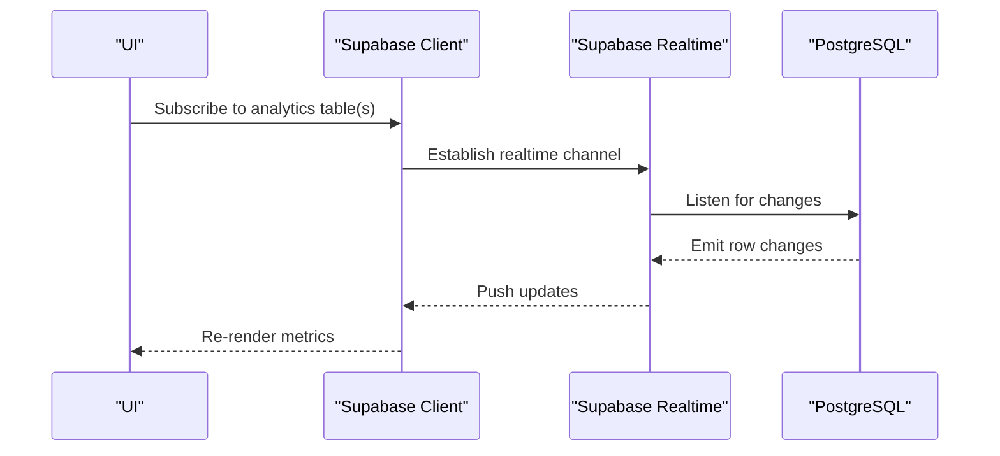
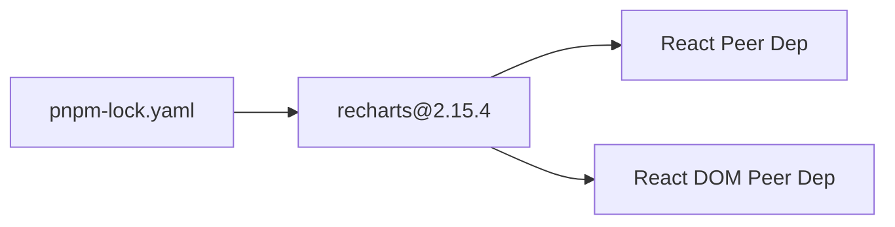

# Analytics & Monitoring

<cite>
**Referenced Files in This Document**
- [apps/admin/src/app/(dashboard)/analytics/page.tsx](file://apps/admin/src/app/(dashboard)/analytics/page.tsx)
- [apps/mobile/src/app/(tabs)/analytics.tsx](file://apps/mobile/src/app/(tabs)/analytics.tsx)
- [apps/mobile/src/services/supabase.ts](file://apps/mobile/src/services/supabase.ts)
- [supabase/migrations/20240001000000_initial_schema.sql](file://supabase/migrations/20240001000000_initial_schema.sql)
- [pnpm-lock.yaml](file://pnpm-lock.yaml)
</cite>

## Table of Contents
1. Introduction
2. Project Structure
3. Core Components
4. Architecture Overview
5. Detailed Component Analysis
6. Dependency Analysis
7. Performance Considerations
8. Troubleshooting Guide
9. Conclusion

## Introduction
This document describes the Analytics and Monitoring system across the admin web app and mobile app. It explains how analytics dashboards present key metrics, how time-range filtering works, how platform distribution is visualized, and how data flows from Supabase to the UI. It also outlines best practices for building charts with Recharts, handling large datasets, setting up alerts, and integrating with external monitoring tools.

## Project Structure
The analytics feature spans two applications:
- Admin web app (Next.js): a dashboard page that displays high-level platform metrics and channel breakdowns.
- Mobile app (React Native/Expo): a performance insights screen with time-range selection and per-platform distribution bars.

**Diagram sources**
- [apps/admin/src/app/(dashboard)/analytics/page.tsx:1-82](file://apps/admin/src/app/(dashboard)/analytics/page.tsx#L1-L82)
- [apps/mobile/src/app/(tabs)/analytics.tsx:1-219](file://apps/mobile/src/app/(tabs)/analytics.tsx#L1-L219)
- [apps/mobile/src/services/supabase.ts:1-41](file://apps/mobile/src/services/supabase.ts#L1-L41)
- [supabase/migrations/20240001000000_initial_schema.sql:23227-23241](file://supabase/migrations/20240001000000_initial_schema.sql#L23227-L23241)

**Section sources**
- [apps/admin/src/app/(dashboard)/analytics/page.tsx:1-82](file://apps/admin/src/app/(dashboard)/analytics/page.tsx#L1-L82)
- [apps/mobile/src/app/(tabs)/analytics.tsx:1-219](file://apps/mobile/src/app/(tabs)/analytics.tsx#L1-L219)
- [apps/mobile/src/services/supabase.ts:1-41](file://apps/mobile/src/services/supabase.ts#L1-L41)
- [supabase/migrations/20240001000000_initial_schema.sql:23227-23241](file://supabase/migrations/20240001000000_initial_schema.sql#L23227-L23241)

## Core Components
- Admin Analytics Dashboard: Displays top-level KPIs such as total generated posts, AI tokens consumed, scheduled queue size, and active retention. Includes a channel breakdown visualization using progress bars.
- Mobile Analytics Screen: Provides a time-range selector (7d, 30d, 90d) and a per-platform distribution view showing reach and growth indicators.

Key responsibilities:
- Present aggregated metrics and trends.
- Allow users to filter by time range.
- Visualize platform share and growth.

**Section sources**
- [apps/admin/src/app/(dashboard)/analytics/page.tsx:6-79](file://apps/admin/src/app/(dashboard)/analytics/page.tsx#L6-L79)
- [apps/mobile/src/app/(tabs)/analytics.tsx:25-93](file://apps/mobile/src/app/(tabs)/analytics.tsx#L25-L93)
- [apps/mobile/src/app/(tabs)/analytics.tsx:175-216](file://apps/mobile/src/app/(tabs)/analytics.tsx#L175-L216)

## Architecture Overview
The analytics flow connects UI components to the data layer via Supabase. While current screens render static or locally managed state, the architecture supports real-time updates through Supabase Realtime and serverless functions.

**Diagram sources**
- [apps/admin/src/app/(dashboard)/analytics/page.tsx:6-79](file://apps/admin/src/app/(dashboard)/analytics/page.tsx#L6-L79)
- [apps/mobile/src/app/(tabs)/analytics.tsx:57-93](file://apps/mobile/src/app/(tabs)/analytics.tsx#L57-L93)
- [apps/mobile/src/services/supabase.ts:28-41](file://apps/mobile/src/services/supabase.ts#L28-L41)
- [supabase/migrations/20240001000000_initial_schema.sql:23227-23241](file://supabase/migrations/20240001000000_initial_schema.sql#L23227-L23241)

## Detailed Component Analysis

### Admin Analytics Page
- Purpose: Provide a high-level overview of platform activity and content generation.
- Features:
  - KPI cards for total posts, AI token consumption, scheduled queue, and retention.
  - Channel breakdown with percentage-based progress bars.
- Data model alignment:
  - Post counts and statuses map to post-related entities.
  - Platform distribution aligns with platform types defined in schema.

**Diagram sources**
- [apps/admin/src/app/(dashboard)/analytics/page.tsx:6-79](file://apps/admin/src/app/(dashboard)/analytics/page.tsx#L6-L79)

**Section sources**
- [apps/admin/src/app/(dashboard)/analytics/page.tsx:6-79](file://apps/admin/src/app/(dashboard)/analytics/page.tsx#L6-L79)

### Mobile Analytics Screen
- Purpose: Show performance insights with time-range filtering and platform distribution.
- Features:
  - Time range selector (7d, 30d, 90d).
  - Per-platform metrics including reach and growth.
  - Distribution bars indicating share of impressions.
- State management:
  - Local state controls selected time range.
  - Future integration can fetch filtered datasets from Supabase.

**Diagram sources**
- [apps/mobile/src/app/(tabs)/analytics.tsx:52-93](file://apps/mobile/src/app/(tabs)/analytics.tsx#L52-L93)
- [apps/mobile/src/app/(tabs)/analytics.tsx:175-216](file://apps/mobile/src/app/(tabs)/analytics.tsx#L175-L216)

**Section sources**
- [apps/mobile/src/app/(tabs)/analytics.tsx:25-93](file://apps/mobile/src/app/(tabs)/analytics.tsx#L25-L93)
- [apps/mobile/src/app/(tabs)/analytics.tsx:175-216](file://apps/mobile/src/app/(tabs)/analytics.tsx#L175-L216)

### Data Model and Reporting Capabilities
- Schema foundations:
  - Enumerations include user roles, subscription tiers, post statuses, and platform types. These enable consistent reporting across channels and user segments.
- Reporting scope:
  - Aggregate metrics by platform type and post status.
  - Compute growth rates over selectable time ranges.
  - Track AI usage via token consumption counters tied to content generation events.

**Diagram sources**
- [supabase/migrations/20240001000000_initial_schema.sql:23227-23241](file://supabase/migrations/20240001000000_initial_schema.sql#L23227-L23241)

**Section sources**
- [supabase/migrations/20240001000000_initial_schema.sql:23227-23241](file://supabase/migrations/20240001000000_initial_schema.sql#L23227-L23241)

### Real-Time Updates and Monitoring
- Supabase client configuration supports session persistence and auto-refresh tokens, enabling reliable connections for real-time subscriptions.
- The admin settings UI references “Realtime Replication Status,” indicating readiness for live updates on relevant tables.

**Diagram sources**
- [apps/mobile/src/services/supabase.ts:28-41](file://apps/mobile/src/services/supabase.ts#L28-L41)

**Section sources**
- [apps/mobile/src/services/supabase.ts:28-41](file://apps/mobile/src/services/supabase.ts#L28-L41)

## Dependency Analysis
- Recharts dependency is present in the project lockfile, indicating capability to build rich charts when needed.
- Current screens use native UI elements; Recharts can be integrated into future chart components for advanced visualizations.

**Diagram sources**
- [pnpm-lock.yaml:3094-3100](file://pnpm-lock.yaml#L3094-L3100)

**Section sources**
- [pnpm-lock.yaml:3094-3100](file://pnpm-lock.yaml#L3094-L3100)

## Performance Considerations
- Use virtualization for large lists (e.g., react-window) when rendering many platform rows or historical points.
- Debounce time-range changes and aggregate queries server-side to minimize payload sizes.
- Prefer server-side aggregation and pagination to avoid loading entire datasets into memory.
- For charts with many data points, downsample series and use memoized computations to reduce re-renders.
- Cache frequently accessed aggregates in a short-lived cache layer to reduce database load.

[No sources needed since this section provides general guidance]

## Troubleshooting Guide
- Supabase connection issues:
  - Verify environment variables for URL and anon key are set correctly in the mobile client.
  - Check placeholder detection logic to ensure production values are used.
- Realtime not updating:
  - Confirm subscriptions are established after client initialization.
  - Validate RLS policies allow reads for authenticated users.
- Large dataset rendering lag:
  - Implement pagination and virtualization.
  - Reduce chart point density via downsampling.

**Section sources**
- [apps/mobile/src/services/supabase.ts:28-41](file://apps/mobile/src/services/supabase.ts#L28-L41)

## Conclusion
The Analytics and Monitoring system provides clear dashboards for both admin and mobile users, with a foundation for real-time updates via Supabase. With Recharts available in dependencies, future enhancements can introduce richer visualizations. By adopting server-side aggregation, caching, and virtualization, the system can scale to handle large datasets while maintaining responsiveness. Alerts and integrations can be layered on top using Supabase Realtime and edge functions to support proactive monitoring and reporting.