# Content Management

<cite>
**Referenced Files in This Document**
- [README.md](file://README.md)
- [ADMIN_GUIDE.md](file://ADMIN_GUIDE.md)
- [initial_schema.sql](file://supabase/migrations/20240001000000_initial_schema.sql)
- [database.ts](file://packages/types/src/database.ts)
- [api.ts](file://packages/types/src/api.ts)
- [templates page (admin)](file://apps/admin/src/app/(dashboard)/templates/page.tsx)
- [posts moderation page (admin)](file://apps/admin/src/app/(dashboard)/posts/page.tsx)
- [post detail screen (mobile)](file://apps/mobile/src/app/post/[id].tsx)
- [generate content function](file://supabase/functions/generate-content/index.ts)
- [generate image function](file://supabase/functions/generate-image/index.ts)
- [calendar screen (mobile)](file://apps/mobile/src/app/(tabs)/calendar.tsx)
- [generate screen (mobile)](file://apps/mobile/src/app/(tabs)/generate.tsx)
</cite>

## Table of Contents
1. [Introduction](#introduction)
2. [Project Structure](#project-structure)
3. [Core Components](#core-components)
4. [Architecture Overview](#architecture-overview)
5. [Detailed Component Analysis](#detailed-component-analysis)
6. [Dependency Analysis](#dependency-analysis)
7. [Performance Considerations](#performance-considerations)
8. [Troubleshooting Guide](#troubleshooting-guide)
9. [Conclusion](#conclusion)
10. [Appendices](#appendices)

## Introduction
This document explains the Content Management system for SocialPilot AI Pro, focusing on post creation, editing, scheduling, and publishing workflows; the template system for reusable content formats; folder-based organization; multi-platform posting; social platform integration points; validation and approval flows; automation via serverless functions; versioning and collaboration features; and lifecycle management from draft to published or failed states.

The system is a monorepo with:
- A Next.js admin app for managing templates and moderating posts
- A mobile app for creating/editing posts, scheduling, and publishing
- Supabase-backed data models, RLS policies, and serverless functions for AI generation and image rendering

**Section sources**
- [README.md:1-4](file://README.md#L1-L4)

## Project Structure
High-level structure relevant to content management:
- Admin app: Templates CRUD and Posts moderation UI
- Mobile app: Post editor, calendar view, and AI content studio
- Database schema: Posts, Templates, Folders, Profiles, Analytics, Notifications, Generated Images
- Serverless functions: AI text generation and image generation endpoints

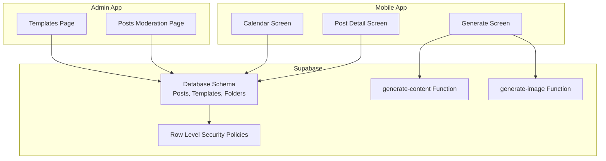

**Diagram sources**
- [initial_schema.sql:71-109](file://supabase/migrations/20240001000000_initial_schema.sql#L71-L109)
- [templates page (admin):21-72](file://apps/admin/src/app/(dashboard)/templates/page.tsx#L21-L72)
- [posts moderation page (admin):13-44](file://apps/admin/src/app/(dashboard)/posts/page.tsx#L13-L44)
- [generate screen (mobile):129-176](file://apps/mobile/src/app/(tabs)/generate.tsx#L129-L176)
- [generate content function:14-99](file://supabase/functions/generate-content/index.ts#L14-L99)
- [generate image function:14-87](file://supabase/functions/generate-image/index.ts#L14-L87)

**Section sources**
- [initial_schema.sql:71-109](file://supabase/migrations/20240001000000_initial_schema.sql#L71-L109)
- [templates page (admin):21-72](file://apps/admin/src/app/(dashboard)/templates/page.tsx#L21-L72)
- [posts moderation page (admin):13-44](file://apps/admin/src/app/(dashboard)/posts/page.tsx#L13-L44)
- [generate screen (mobile):129-176](file://apps/mobile/src/app/(tabs)/generate.tsx#L129-L176)
- [generate content function:14-99](file://supabase/functions/generate-content/index.ts#L14-L99)
- [generate image function:14-87](file://supabase/functions/generate-image/index.ts#L14-L87)

## Core Components
- Post model and status lifecycle: Draft → Scheduled → Publishing → Published or Failed
- Template system: Reusable prompt templates with categories, suggested platforms, and premium flags
- Folder organization: User-scoped folders to categorize posts
- Multi-platform posting: Arrays of supported platforms per post
- AI generation: Serverless functions for text and images with credit accounting
- Moderation: Admin view to monitor and delete posts across accounts

Key types and statuses are defined centrally:
- PlatformType and PostStatus enums
- Post and PostTemplate interfaces

**Section sources**
- [database.ts:3-34](file://packages/types/src/database.ts#L3-L34)
- [initial_schema.sql:8-12](file://supabase/migrations/20240001000000_initial_schema.sql#L8-L12)
- [initial_schema.sql:71-109](file://supabase/migrations/20240001000000_initial_schema.sql#L71-L109)

## Architecture Overview
The content lifecycle spans UI layers, serverless functions, and database storage with strict access control.

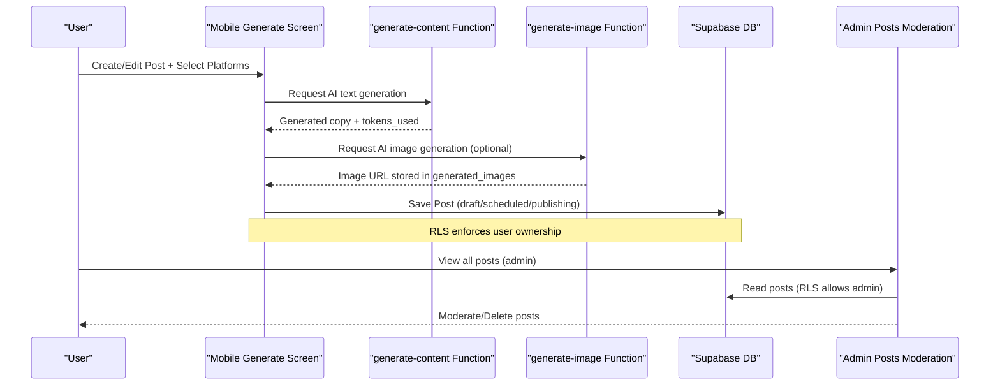

**Diagram sources**
- [generate screen (mobile):129-176](file://apps/mobile/src/app/(tabs)/generate.tsx#L129-L176)
- [generate content function:14-99](file://supabase/functions/generate-content/index.ts#L14-L99)
- [generate image function:14-87](file://supabase/functions/generate-image/index.ts#L14-L87)
- [initial_schema.sql:156-202](file://supabase/migrations/20240001000000_initial_schema.sql#L156-L202)
- [posts moderation page (admin):13-44](file://apps/admin/src/app/(dashboard)/posts/page.tsx#L13-L44)

## Detailed Component Analysis

### Post Creation, Editing, Scheduling, and Publishing
- Mobile post editor supports title, content, media attachments, platform selection, and scheduling slot changes.
- Publish actions simulate dispatch to selected platforms and update UI state.
- Calendar screen provides a timeline view of scheduled posts and quick creation entry point.

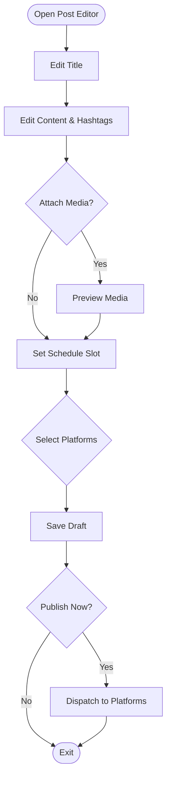

**Diagram sources**
- [post detail screen (mobile):50-89](file://apps/mobile/src/app/post/[id].tsx#L50-L89)
- [post detail screen (mobile):131-158](file://apps/mobile/src/app/post/[id].tsx#L131-L158)
- [post detail screen (mobile):160-198](file://apps/mobile/src/app/post/[id].tsx#L160-L198)
- [post detail screen (mobile):200-248](file://apps/mobile/src/app/post/[id].tsx#L200-L248)
- [post detail screen (mobile):250-276](file://apps/mobile/src/app/post/[id].tsx#L250-L276)
- [calendar screen (mobile):24-66](file://apps/mobile/src/app/(tabs)/calendar.tsx#L24-L66)
- [calendar screen (mobile):104-139](file://apps/mobile/src/app/(tabs)/calendar.tsx#L104-L139)

**Section sources**
- [post detail screen (mobile):50-89](file://apps/mobile/src/app/post/[id].tsx#L50-L89)
- [post detail screen (mobile):131-158](file://apps/mobile/src/app/post/[id].tsx#L131-L158)
- [post detail screen (mobile):160-198](file://apps/mobile/src/app/post/[id].tsx#L160-L198)
- [post detail screen (mobile):200-248](file://apps/mobile/src/app/post/[id].tsx#L200-L248)
- [post detail screen (mobile):250-276](file://apps/mobile/src/app/post/[id].tsx#L250-L276)
- [calendar screen (mobile):24-66](file://apps/mobile/src/app/(tabs)/calendar.tsx#L24-L66)
- [calendar screen (mobile):104-139](file://apps/mobile/src/app/(tabs)/calendar.tsx#L104-L139)

### Template System for Reusable Content Formats
- Admin templates page enables CRUD operations for prompt templates with category, suggested platform, and premium flag.
- Templates support variable placeholders (e.g., topic) to generate tailored content.
- Mobile generate screen includes curated templates that pre-fill prompts and target platforms.

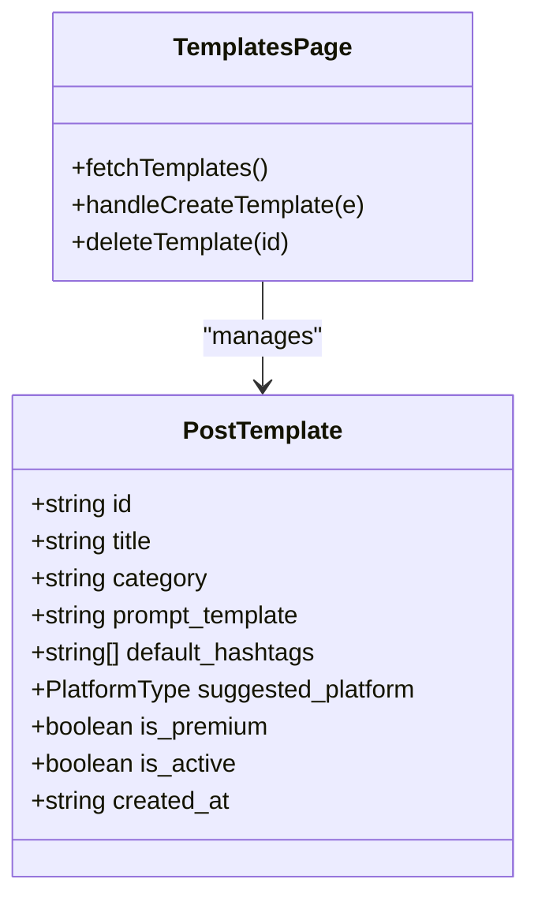

**Diagram sources**
- [database.ts:24-34](file://packages/types/src/database.ts#L24-L34)
- [templates page (admin):21-72](file://apps/admin/src/app/(dashboard)/templates/page.tsx#L21-L72)
- [templates page (admin):116-151](file://apps/admin/src/app/(dashboard)/templates/page.tsx#L116-L151)

**Section sources**
- [templates page (admin):21-72](file://apps/admin/src/app/(dashboard)/templates/page.tsx#L21-L72)
- [templates page (admin):116-151](file://apps/admin/src/app/(dashboard)/templates/page.tsx#L116-L151)
- [generate screen (mobile):70-92](file://apps/mobile/src/app/(tabs)/generate.tsx#L70-L92)
- [generate screen (mobile):171-176](file://apps/mobile/src/app/(tabs)/generate.tsx#L171-L176)

### Folder Organization for Content Categorization
- Folders table associates posts with user-defined categories via folder_id.
- RLS ensures users can only manage their own folders.

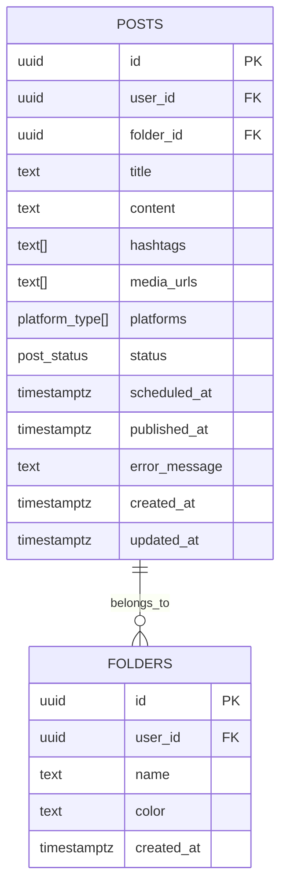

**Diagram sources**
- [initial_schema.sql:71-96](file://supabase/migrations/20240001000000_initial_schema.sql#L71-L96)

**Section sources**
- [initial_schema.sql:71-96](file://supabase/migrations/20240001000000_initial_schema.sql#L71-L96)

### Multi-Platform Posting Capabilities
- Posts store an array of platforms; UI surfaces selectable platform pills.
- Supported platforms include Instagram, Twitter/X, LinkedIn, Facebook, TikTok, Threads.

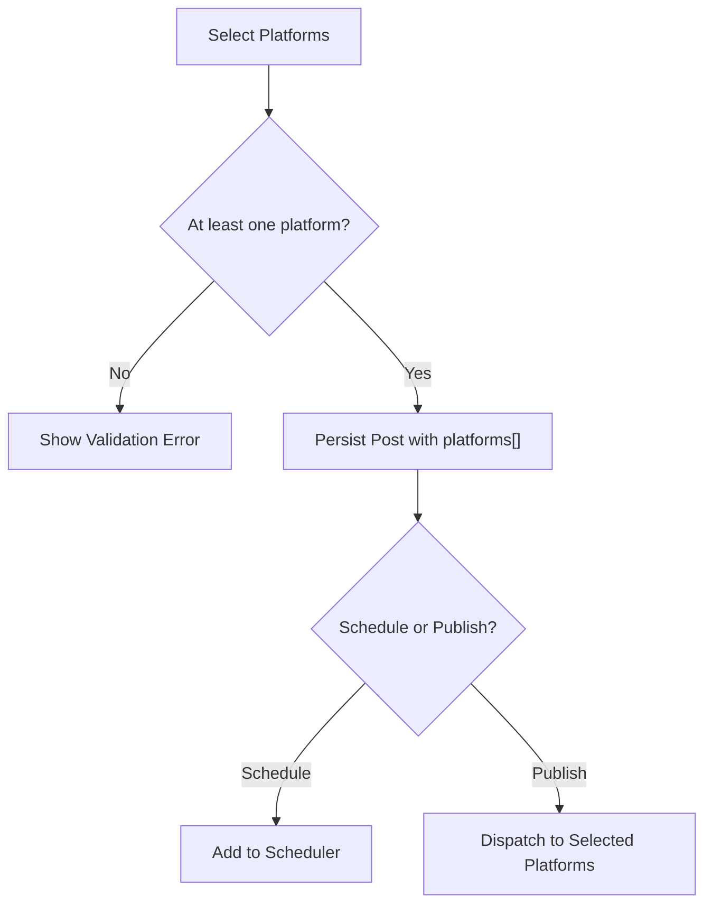

**Diagram sources**
- [post detail screen (mobile):160-198](file://apps/mobile/src/app/post/[id].tsx#L160-L198)
- [database.ts:3-4](file://packages/types/src/database.ts#L3-L4)
- [initial_schema.sql:81-96](file://supabase/migrations/20240001000000_initial_schema.sql#L81-L96)

**Section sources**
- [post detail screen (mobile):160-198](file://apps/mobile/src/app/post/[id].tsx#L160-L198)
- [database.ts:3-4](file://packages/types/src/database.ts#L3-L4)
- [initial_schema.sql:81-96](file://supabase/migrations/20240001000000_initial_schema.sql#L81-L96)

### Integration with Social Media Platforms
- The system defines platform types and stores them per post.
- Actual API integrations are not implemented in the provided files; publish actions currently simulate dispatch and provide user feedback.

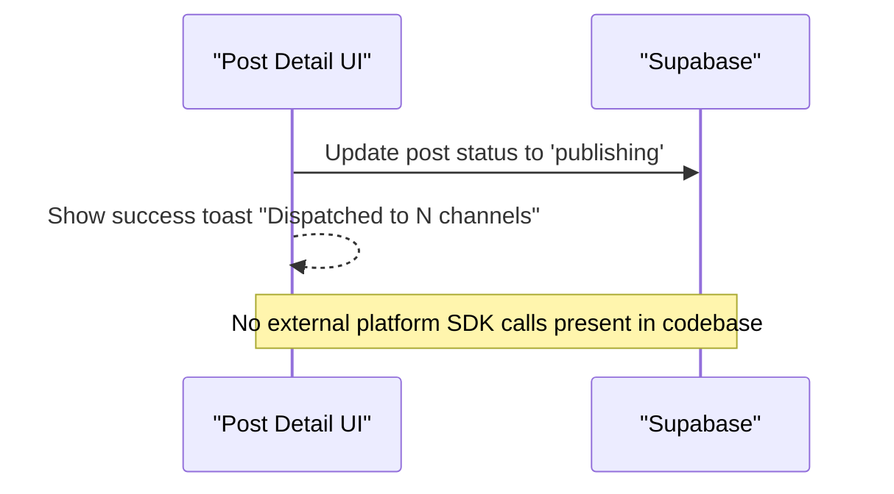

**Diagram sources**
- [post detail screen (mobile):79-89](file://apps/mobile/src/app/post/[id].tsx#L79-L89)
- [initial_schema.sql:81-96](file://supabase/migrations/20240001000000_initial_schema.sql#L81-L96)

**Section sources**
- [post detail screen (mobile):79-89](file://apps/mobile/src/app/post/[id].tsx#L79-L89)
- [initial_schema.sql:81-96](file://supabase/migrations/20240001000000_initial_schema.sql#L81-L96)

### Content Validation and Approval Workflows
- Input validation occurs at UI level (required fields, minimum platform selection).
- Admin moderation page allows viewing and deleting posts across accounts.
- Row Level Security restricts data access by user identity and role.

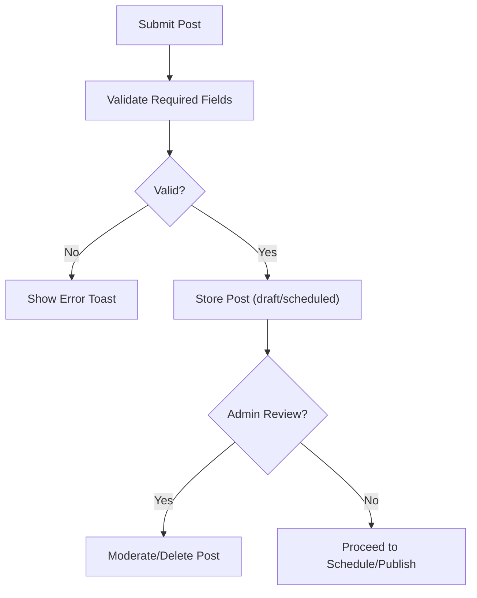

**Diagram sources**
- [post detail screen (mobile):71-77](file://apps/mobile/src/app/post/[id].tsx#L71-L77)
- [posts moderation page (admin):35-44](file://apps/admin/src/app/(dashboard)/posts/page.tsx#L35-L44)
- [initial_schema.sql:156-202](file://supabase/migrations/20240001000000_initial_schema.sql#L156-L202)

**Section sources**
- [post detail screen (mobile):71-77](file://apps/mobile/src/app/post/[id].tsx#L71-L77)
- [posts moderation page (admin):35-44](file://apps/admin/src/app/(dashboard)/posts/page.tsx#L35-L44)
- [initial_schema.sql:156-202](file://supabase/migrations/20240001000000_initial_schema.sql#L156-L202)

### Automating Content Distribution
- AI text generation via serverless function fetches active AI config and calls Gemini (or returns mock result if keys missing), then decrements credits.
- AI image generation via serverless function calls Replicate (SDXL/Flux), stores image metadata, and deducts credits.

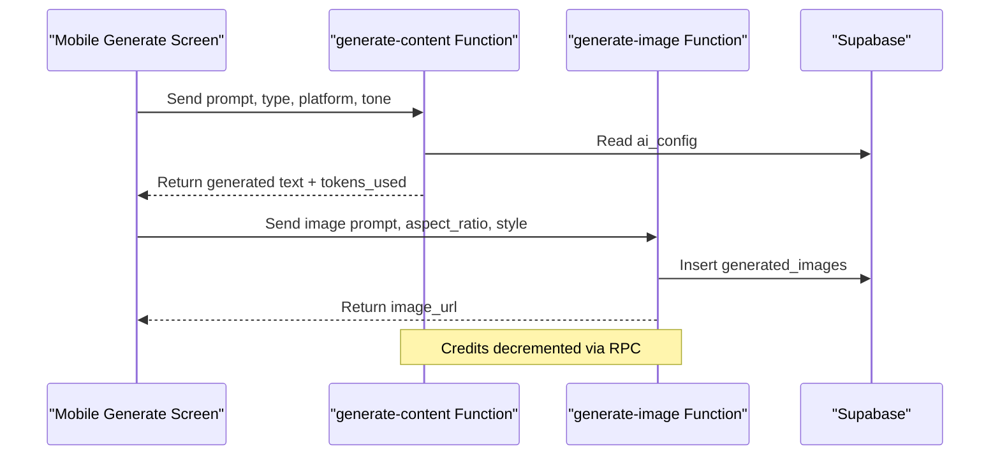

**Diagram sources**
- [generate content function:14-99](file://supabase/functions/generate-content/index.ts#L14-L99)
- [generate image function:14-87](file://supabase/functions/generate-image/index.ts#L14-L87)
- [generate screen (mobile):129-176](file://apps/mobile/src/app/(tabs)/generate.tsx#L129-L176)

**Section sources**
- [generate content function:14-99](file://supabase/functions/generate-content/index.ts#L14-L99)
- [generate image function:14-87](file://supabase/functions/generate-image/index.ts#L14-L87)
- [generate screen (mobile):129-176](file://apps/mobile/src/app/(tabs)/generate.tsx#L129-L176)

### Content Versioning, Collaboration, and Lifecycle Management
- Versioning: Not explicitly implemented; posts have created_at/updated_at timestamps but no version history table.
- Collaboration: Team screen exists in mobile app for inviting collaborators with roles (Owner, Editor, Viewer); however, backend team/collaboration tables are not present in the schema.
- Lifecycle: Post status enum covers draft, scheduled, publishing, published, failed; admin moderation supports deletion.

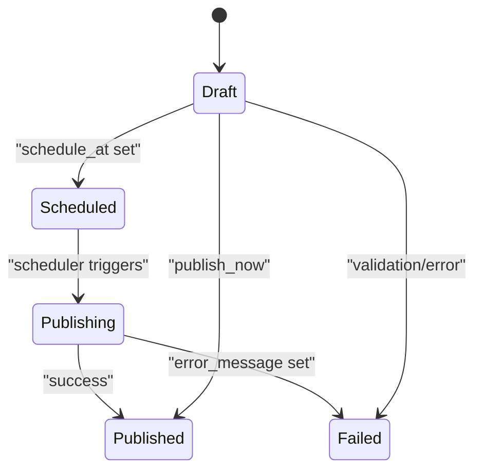

**Diagram sources**
- [initial_schema.sql:8-12](file://supabase/migrations/20240001000000_initial_schema.sql#L8-L12)
- [initial_schema.sql:81-96](file://supabase/migrations/20240001000000_initial_schema.sql#L81-L96)

**Section sources**
- [initial_schema.sql:8-12](file://supabase/migrations/20240001000000_initial_schema.sql#L8-L12)
- [initial_schema.sql:81-96](file://supabase/migrations/20240001000000_initial_schema.sql#L81-L96)

## Dependency Analysis
- Types module centralizes shared types used by both apps and serverless functions.
- Admin and mobile apps depend on Supabase client for data operations.
- Serverless functions depend on environment variables for AI providers and Supabase credentials.

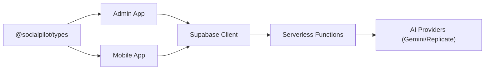

**Diagram sources**
- [api.ts:1-33](file://packages/types/src/api.ts#L1-L33)
- [database.ts:3-34](file://packages/types/src/database.ts#L3-L34)
- [generate content function:14-99](file://supabase/functions/generate-content/index.ts#L14-L99)
- [generate image function:14-87](file://supabase/functions/generate-image/index.ts#L14-L87)

**Section sources**
- [api.ts:1-33](file://packages/types/src/api.ts#L1-L33)
- [database.ts:3-34](file://packages/types/src/database.ts#L3-L34)
- [generate content function:14-99](file://supabase/functions/generate-content/index.ts#L14-L99)
- [generate image function:14-87](file://supabase/functions/generate-image/index.ts#L14-L87)

## Performance Considerations
- Use minimal network requests: batch post reads/writes where possible.
- Cache template lists locally after initial load to reduce repeated queries.
- Debounce AI generation calls to avoid redundant requests.
- Limit media uploads to necessary resolutions; leverage compression.
- Monitor credit usage and throttle generation during high load.

[No sources needed since this section provides general guidance]

## Troubleshooting Guide
- Unauthorized errors in serverless functions indicate missing or invalid Authorization headers; ensure Supabase auth context is passed.
- Missing API keys cause fallback behavior; verify environment variables for Gemini and Replicate.
- RLS policy violations occur when users attempt to access other users’ data; confirm user_id matches authenticated user or admin role.
- Validation failures in UI should surface clear error messages; check required fields before submission.

**Section sources**
- [generate content function:21-36](file://supabase/functions/generate-content/index.ts#L21-L36)
- [generate image function:21-36](file://supabase/functions/generate-image/index.ts#L21-L36)
- [initial_schema.sql:156-202](file://supabase/migrations/20240001000000_initial_schema.sql#L156-L202)

## Conclusion
The Content Management system provides a robust foundation for creating, organizing, and distributing social media content across multiple platforms. It leverages a template-driven approach, folder-based categorization, and serverless AI functions to streamline content production. While multi-platform dispatch is simulated in the current codebase, the architecture supports future integrations. Admin moderation and RLS ensure secure oversight. To enhance the system, consider implementing explicit versioning, full collaboration backends, and real platform APIs for automated distribution.

[No sources needed since this section summarizes without analyzing specific files]

## Appendices

### Example: Creating a Content Template
- Navigate to the Templates page in the admin app.
- Fill in title, category, prompt template with variables, suggested platform, and premium flag.
- Save to make it available to mobile users.

**Section sources**
- [templates page (admin):43-72](file://apps/admin/src/app/(dashboard)/templates/page.tsx#L43-L72)
- [templates page (admin):154-245](file://apps/admin/src/app/(dashboard)/templates/page.tsx#L154-L245)

### Example: Managing Content Libraries
- Use folders to group posts by campaign or topic.
- Filter posts by folder in the UI to organize content libraries.

**Section sources**
- [initial_schema.sql:71-78](file://supabase/migrations/20240001000000_initial_schema.sql#L71-L78)

### Example: Automating Content Distribution
- Use the generate screen to produce AI copy and images.
- Save posts with schedule times to queue distribution.
- Admin can moderate queued posts before they go live.

**Section sources**
- [generate screen (mobile):129-176](file://apps/mobile/src/app/(tabs)/generate.tsx#L129-L176)
- [posts moderation page (admin):13-44](file://apps/admin/src/app/(dashboard)/posts/page.tsx#L13-L44)