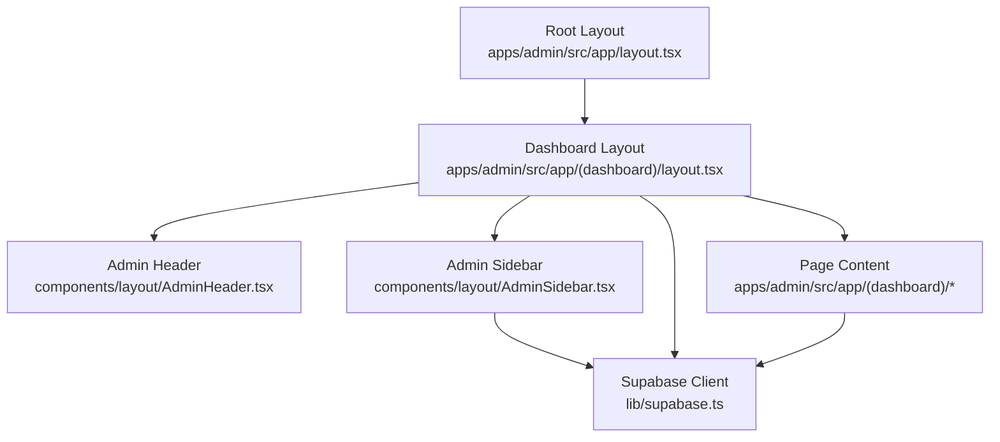
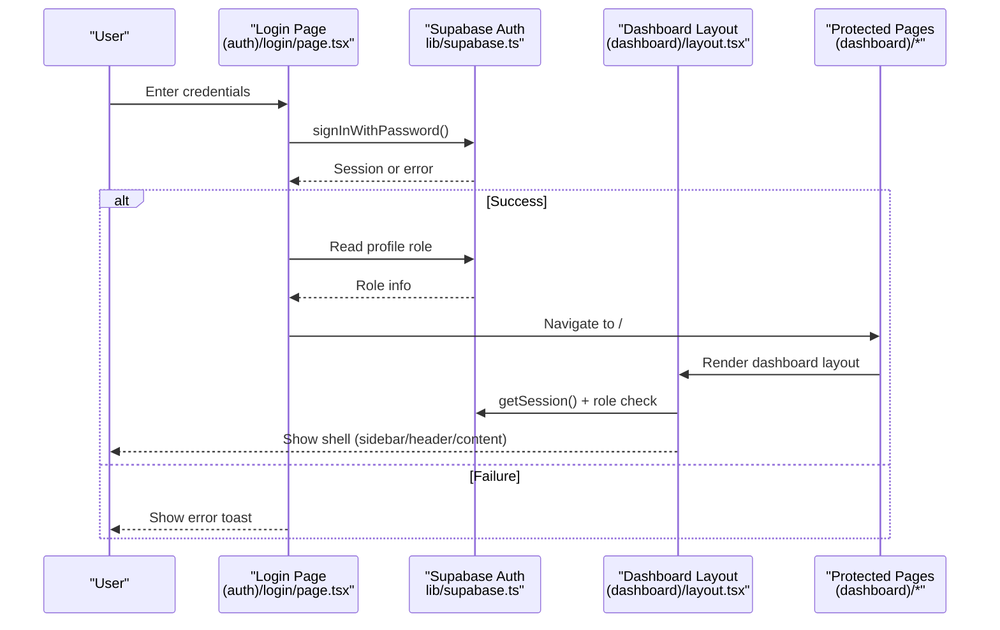
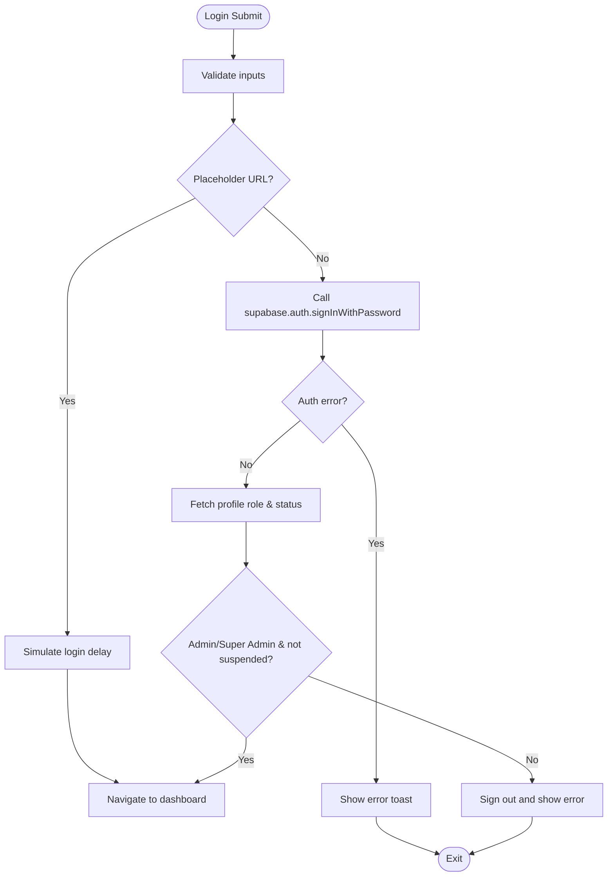
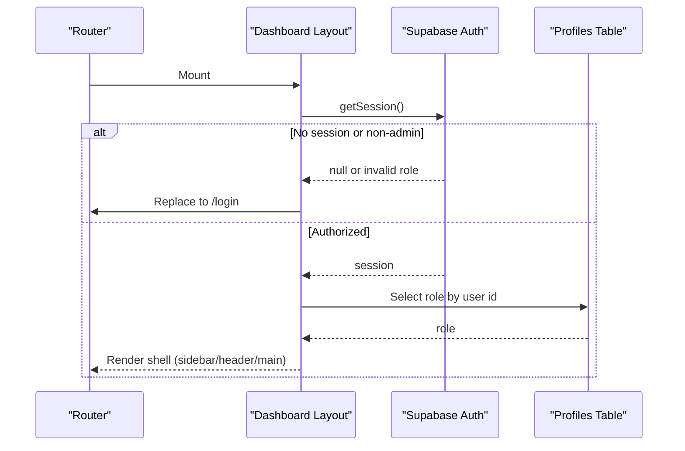
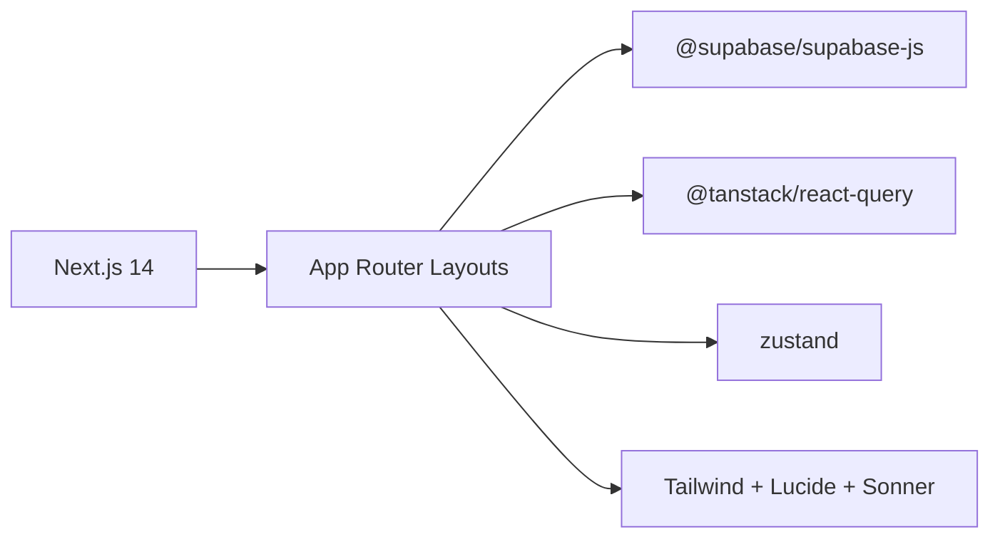

# Dashboard Architecture

<cite>
**Referenced Files in This Document**
- [layout.tsx](file://apps/admin/src/app/layout.tsx)
- [dashboard layout.tsx](file://apps/admin/src/app/(dashboard)/layout.tsx)
- [AdminHeader.tsx](file://apps/admin/src/components/layout/AdminHeader.tsx)
- [AdminSidebar.tsx](file://apps/admin/src/components/layout/AdminSidebar.tsx)
- [login page.tsx](file://apps/admin/src/app/(auth)/login/page.tsx)
- [supabase.ts](file://apps/admin/src/lib/supabase.ts)
- [package.json](file://apps/admin/package.json)
</cite>

## Table of Contents
1. Introduction
2. Project Structure
3. Core Components
4. Architecture Overview
5. Detailed Component Analysis
6. Dependency Analysis
7. Performance Considerations
8. Troubleshooting Guide
9. Conclusion

## Introduction
This document explains the Admin Dashboard architecture built with Next.js 14 App Router. It covers the root and dashboard layouts, header and sidebar components, authentication flow using Supabase Auth, state management with Zustand, data fetching patterns with React Query, integration points to backend services, real-time subscriptions, error handling strategies, architectural decisions, design patterns, and guidelines for extending functionality.

## Project Structure
The admin app follows a feature-oriented structure under apps/admin/src:
- app/: Next.js App Router pages and layouts
  - Root layout sets global styles and toasts
  - (auth)/login: protected login route
  - (dashboard)/: layout that enforces admin access and composes header/sidebar
- components/layout: shared layout pieces (header, sidebar)
- lib/supabase: Supabase client configuration
- package.json: dependencies including React Query, Zustand, Supabase JS, and UI libraries

**Diagram sources**
- [layout.tsx:10-23](file://apps/admin/src/app/layout.tsx#L10-L23)
- [dashboard layout.tsx:9-70](file://apps/admin/src/app/(dashboard)/layout.tsx#L9-L70)
- [AdminHeader.tsx:6-27](file://apps/admin/src/components/layout/AdminHeader.tsx#L6-L27)
- [AdminSidebar.tsx:34-93](file://apps/admin/src/components/layout/AdminSidebar.tsx#L34-L93)
- [supabase.ts:1-14](file://apps/admin/src/lib/supabase.ts#L1-L14)

**Section sources**
- [layout.tsx:1-24](file://apps/admin/src/app/layout.tsx#L1-L24)
- [dashboard layout.tsx:1-71](file://apps/admin/src/app/(dashboard)/layout.tsx#L1-L71)
- [AdminHeader.tsx:1-28](file://apps/admin/src/components/layout/AdminHeader.tsx#L1-L28)
- [AdminSidebar.tsx:1-94](file://apps/admin/src/components/layout/AdminSidebar.tsx#L1-L94)
- [supabase.ts:1-14](file://apps/admin/src/lib/supabase.ts#L1-L14)
- [package.json:11-31](file://apps/admin/package.json#L11-L31)

## Core Components
- Root layout: Provides global HTML/body classes, dark theme, and toast container.
- Dashboard layout: Enforces admin authentication via Supabase session and role checks; renders fixed sidebar and sticky header around page content.
- Admin header: Displays live status indicator and admin mode badge.
- Admin sidebar: Renders navigation links based on routes and provides sign-out behavior.

Key responsibilities:
- Authentication gating at the layout level ensures only authorized users access dashboard features.
- Navigation is declarative and driven by route paths.
- Toast notifications provide user feedback for actions like sign out or errors.

**Section sources**
- [layout.tsx:10-23](file://apps/admin/src/app/layout.tsx#L10-L23)
- [dashboard layout.tsx:17-69](file://apps/admin/src/app/(dashboard)/layout.tsx#L17-L69)
- [AdminHeader.tsx:6-27](file://apps/admin/src/components/layout/AdminHeader.tsx#L6-L27)
- [AdminSidebar.tsx:34-93](file://apps/admin/src/components/layout/AdminSidebar.tsx#L34-L93)

## Architecture Overview
The dashboard uses Next.js App Router groups to separate auth and dashboard routes. The dashboard layout acts as a gatekeeper, validating sessions and roles before rendering the shell. Supabase client is centralized for auth and data operations. UI feedback is handled via toast notifications. Dependencies include React Query for server state caching and refetching, Zustand for client-side state, and Supabase Realtime for live updates.

**Diagram sources**
- [login page.tsx:15-77](file://apps/admin/src/app/(auth)/login/page.tsx#L15-L77)
- [supabase.ts:1-14](file://apps/admin/src/lib/supabase.ts#L1-L14)
- [dashboard layout.tsx:17-69](file://apps/admin/src/app/(dashboard)/layout.tsx#L17-L69)

## Detailed Component Analysis

### Authentication Flow (Supabase Auth)
- Login page collects email/password, handles loading states, and calls Supabase sign-in.
- On success, it reads the user’s profile to verify admin/super_admin role and account status.
- If placeholder URL is configured, development bypass allows immediate access to the dashboard.
- Errors are surfaced via toast notifications; unauthorized users are redirected back to login.

**Diagram sources**
- [login page.tsx:15-77](file://apps/admin/src/app/(auth)/login/page.tsx#L15-L77)
- [supabase.ts:1-14](file://apps/admin/src/lib/supabase.ts#L1-L14)

**Section sources**
- [login page.tsx:15-77](file://apps/admin/src/app/(auth)/login/page.tsx#L15-L77)
- [supabase.ts:1-14](file://apps/admin/src/lib/supabase.ts#L1-L14)

### Dashboard Layout and Shell
- Validates session and admin role on mount; redirects if unauthorized.
- Renders a fixed left sidebar and sticky header, with main content area constrained for readability.
- Shows a spinner while authentication is being verified.

**Diagram sources**
- [dashboard layout.tsx:17-69](file://apps/admin/src/app/(dashboard)/layout.tsx#L17-L69)

**Section sources**
- [dashboard layout.tsx:17-69](file://apps/admin/src/app/(dashboard)/layout.tsx#L17-L69)

### Admin Header
- Displays a live indicator and an “Super Admin Mode” badge.
- Pure presentational component; no side effects.

**Section sources**
- [AdminHeader.tsx:6-27](file://apps/admin/src/components/layout/AdminHeader.tsx#L6-L27)

### Admin Sidebar
- Renders navigation items mapped to routes with active state detection.
- Provides sign-out action that clears session and navigates to login.
- Uses toast for user feedback.

**Section sources**
- [AdminSidebar.tsx:22-93](file://apps/admin/src/components/layout/AdminSidebar.tsx#L22-L93)

### Data Fetching Patterns (React Query)
- The project includes @tanstack/react-query in dependencies, indicating server-state caching and background refetching should be used across dashboard pages.
- Recommended pattern: wrap pages with QueryClientProvider (if not already provided globally), use useQuery/useMutation for data fetching, and leverage invalidateQueries after mutations to keep UI consistent.

[No sources needed since this section provides general guidance]

### State Management (Zustand)
- Zustand is included in dependencies for lightweight client-side state (e.g., UI toggles, local preferences).
- Recommended pattern: create small stores per feature, expose selectors for derived state, and avoid storing large datasets that belong in server cache.

[No sources needed since this section provides general guidance]

### Integration Points and Real-Time Subscriptions
- Supabase client is centralized; pages can subscribe to realtime channels for live updates (e.g., notifications, analytics counters).
- Use Supabase Realtime within page components or hooks to listen to table changes and update React Query caches via invalidateQueries.

[No sources needed since this section provides general guidance]

## Dependency Analysis
Key runtime dependencies relevant to the dashboard:
- Next.js 14 App Router for routing and layouts
- Supabase JS client for auth and data
- React Query for server state management
- Zustand for client state
- Lucide icons, Tailwind CSS, and Sonner for UI and notifications

**Diagram sources**
- [package.json:11-31](file://apps/admin/package.json#L11-L31)

**Section sources**
- [package.json:11-31](file://apps/admin/package.json#L11-L31)

## Performance Considerations
- Keep heavy computations out of render cycles; memoize derived values where appropriate.
- Prefer server-side data fetching with React Query for caching and background updates.
- Avoid unnecessary re-renders in layout components; pass minimal props to children.
- Use code splitting and lazy loading for charts and data tables to reduce initial bundle size.
- Debounce search/filter inputs in data tables to limit network requests.

[No sources needed since this section provides general guidance]

## Troubleshooting Guide
Common issues and resolutions:
- Unauthorized redirect loop: Ensure Supabase environment variables are set correctly; verify session retrieval and role checks in dashboard layout.
- Login failures: Check credentials and network connectivity; review toast messages for specific error details.
- Development bypass: When using placeholder Supabase URL, login will auto-succeed; disable placeholder mode in production.
- Realtime not updating: Confirm channel subscription and permissions; ensure React Query cache invalidation is triggered after mutations.

**Section sources**
- [dashboard layout.tsx:17-69](file://apps/admin/src/app/(dashboard)/layout.tsx#L17-L69)
- [login page.tsx:15-77](file://apps/admin/src/app/(auth)/login/page.tsx#L15-L77)
- [supabase.ts:1-14](file://apps/admin/src/lib/supabase.ts#L1-L14)

## Conclusion
The Admin Dashboard leverages Next.js 14 App Router for structured routing, Supabase Auth for secure access control, React Query for robust server state, and Zustand for lightweight client state. The dashboard layout centralizes authentication and role enforcement, while reusable header and sidebar components provide a consistent shell. Following the recommended patterns for data fetching, real-time updates, and error handling will help maintain scalability and reliability as the dashboard grows.