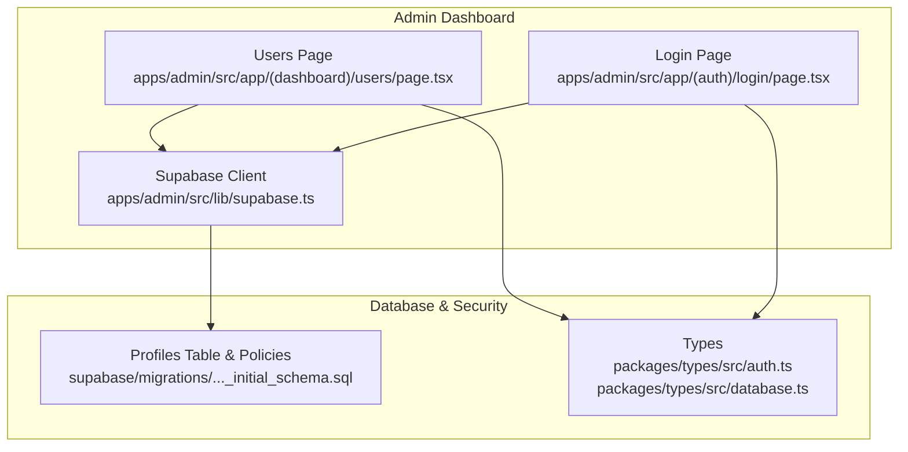
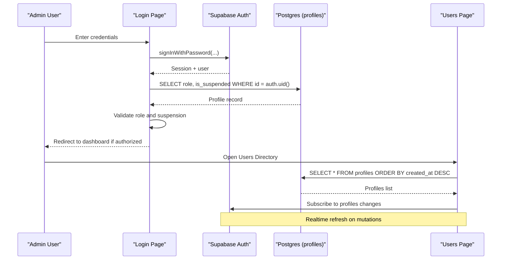
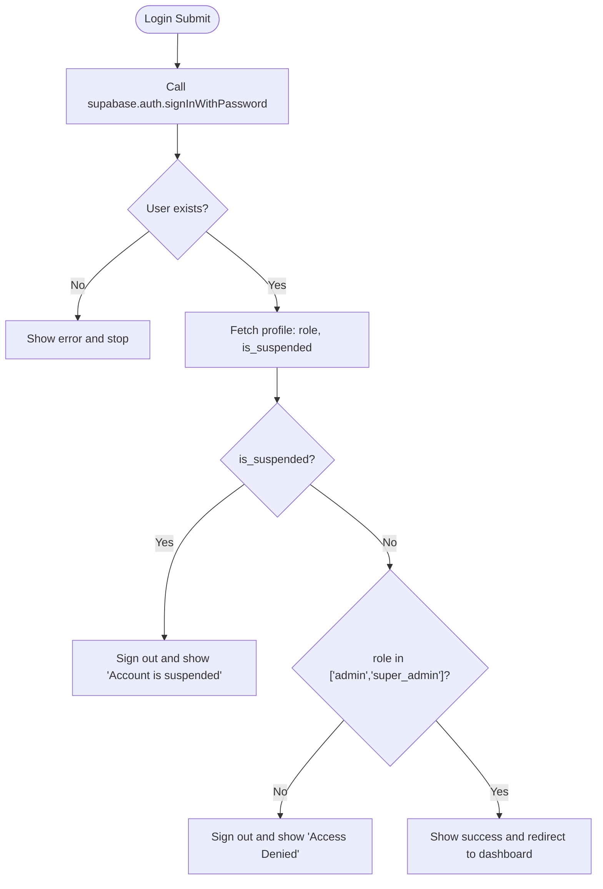
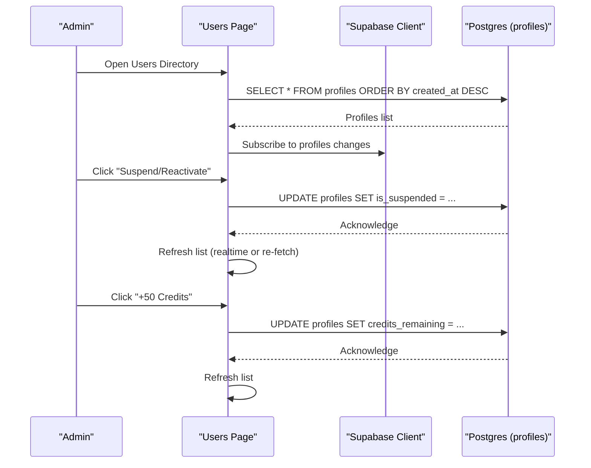
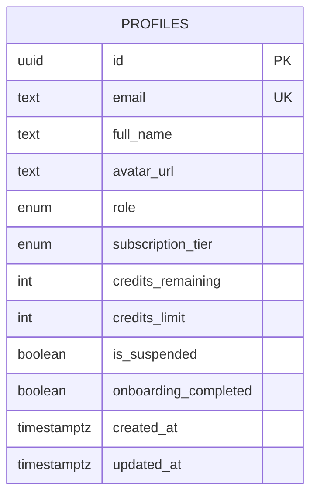
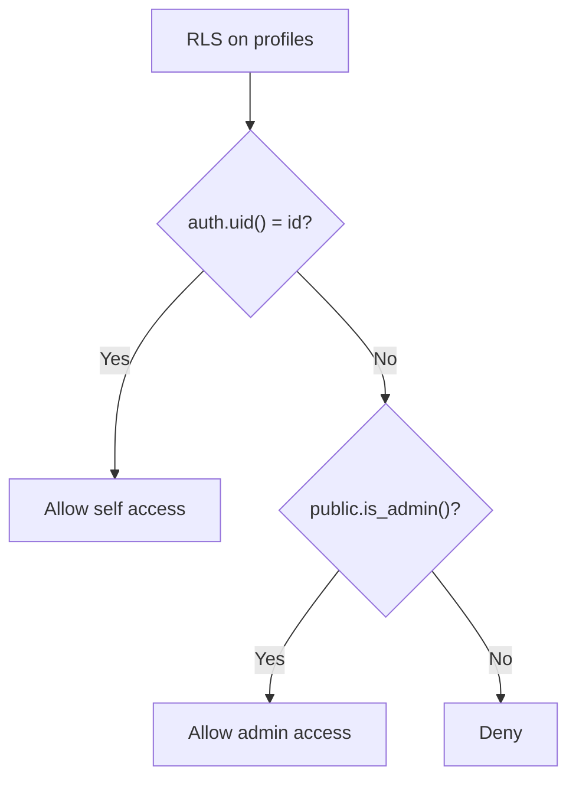
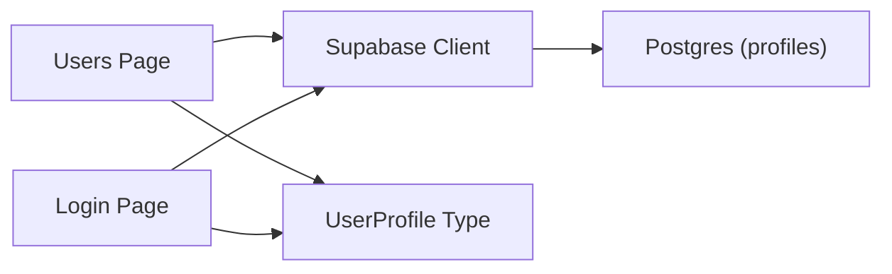

# User Management

<cite>
**Referenced Files in This Document**
- [users/page.tsx](file://apps/admin/src/app/(dashboard)/users/page.tsx)
- [login/page.tsx](file://apps/admin/src/app/(auth)/login/page.tsx)
- [supabase.ts](file://apps/admin/src/lib/supabase.ts)
- [initial_schema.sql](file://supabase/migrations/20240001000000_initial_schema.sql)
- [database.ts](file://packages/types/src/database.ts)
- [auth.ts](file://packages/types/src/auth.ts)
</cite>

## Table of Contents
1. Introduction
2. Project Structure
3. Core Components
4. Architecture Overview
5. Detailed Component Analysis
6. Dependency Analysis
7. Performance Considerations
8. Troubleshooting Guide
9. Conclusion
10. Appendices

## Introduction
This document explains the User Management system for the Admin Dashboard, focusing on user CRUD operations, role-based access control (RBAC), profile management, database schema, authentication policies, and security considerations. It also provides guidance for implementing custom roles and permissions and outlines integration with Supabase Auth and session management.

## Project Structure
The Admin Dashboard implements user management through a dedicated page that lists users, allows suspension/reactivation, and adjusts credits. Authentication is enforced via Supabase Auth with server-side Row Level Security (RLS) policies controlling data access. The shared types define the user model used across the app.

**Diagram sources**
- [users/page.tsx:14-46](file://apps/admin/src/app/(dashboard)/users/page.tsx#L14-L46)
- [login/page.tsx:22-73](file://apps/admin/src/app/(auth)/login/page.tsx#L22-L73)
- [supabase.ts:1-14](file://apps/admin/src/lib/supabase.ts#L1-L14)
- [initial_schema.sql:44-69](file://supabase/migrations/20240001000000_initial_schema.sql#L44-L69)
- [auth.ts:5-18](file://packages/types/src/auth.ts#L5-L18)
- [database.ts:1-73](file://packages/types/src/database.ts#L1-L73)

**Section sources**
- [users/page.tsx:1-213](file://apps/admin/src/app/(dashboard)/users/page.tsx#L1-L213)
- [login/page.tsx:1-167](file://apps/admin/src/app/(auth)/login/page.tsx#L1-L167)
- [supabase.ts:1-14](file://apps/admin/src/lib/supabase.ts#L1-L14)
- [initial_schema.sql:1-232](file://supabase/migrations/20240001000000_initial_schema.sql#L1-L232)
- [auth.ts:1-25](file://packages/types/src/auth.ts#L1-L25)
- [database.ts:1-73](file://packages/types/src/database.ts#L1-L73)

## Core Components
- Users Directory (Admin): Lists all profiles, supports search, toggles suspension status, and adds credits. Uses Supabase client to read/update profiles and subscribes to realtime changes.
- Admin Login: Authenticates via Supabase, validates admin privileges and account status, then redirects to dashboard.
- Database Schema & RLS: Defines the profiles table, enums, helper function for admin checks, and RLS policies that enforce who can read/write data.
- Types: Centralized TypeScript definitions for UserRole, SubscriptionTier, and UserProfile used by UI and services.

Key responsibilities:
- Data access: Supabase client queries and updates on the profiles table.
- Access control: Server-side RLS policies and login-time role checks.
- Realtime updates: Subscriptions to profile changes to keep the list current.

**Section sources**
- [users/page.tsx:14-76](file://apps/admin/src/app/(dashboard)/users/page.tsx#L14-L76)
- [login/page.tsx:22-73](file://apps/admin/src/app/(auth)/login/page.tsx#L22-L73)
- [initial_schema.sql:44-69](file://supabase/migrations/20240001000000_initial_schema.sql#L44-L69)
- [auth.ts:5-18](file://packages/types/src/auth.ts#L5-L18)

## Architecture Overview
The system integrates frontend pages with Supabase Auth and Postgres RLS to secure user data and enforce RBAC.

**Diagram sources**
- [login/page.tsx:22-73](file://apps/admin/src/app/(auth)/login/page.tsx#L22-L73)
- [users/page.tsx:14-46](file://apps/admin/src/app/(dashboard)/users/page.tsx#L14-L46)
- [initial_schema.sql:178-180](file://supabase/migrations/20240001000000_initial_schema.sql#L178-L180)

## Detailed Component Analysis

### Admin Login Flow
- Authenticates using Supabase email/password.
- On success, fetches the user’s profile to verify role and suspension status.
- Denies access if not an admin or if suspended; otherwise navigates to dashboard.

**Diagram sources**
- [login/page.tsx:22-73](file://apps/admin/src/app/(auth)/login/page.tsx#L22-L73)

**Section sources**
- [login/page.tsx:22-73](file://apps/admin/src/app/(auth)/login/page.tsx#L22-L73)

### Users Directory Operations
- Loads all profiles ordered by creation time.
- Subscribes to realtime changes to refresh the list automatically.
- Supports:
  - Toggle suspension/reactivation per user.
  - Add credits to a user.
  - Search by name or email.

**Diagram sources**
- [users/page.tsx:14-76](file://apps/admin/src/app/(dashboard)/users/page.tsx#L14-L76)
- [initial_schema.sql:178-180](file://supabase/migrations/20240001000000_initial_schema.sql#L178-L180)

**Section sources**
- [users/page.tsx:14-81](file://apps/admin/src/app/(dashboard)/users/page.tsx#L14-L81)

### Database Schema for User Profiles
- The profiles table stores identity, role, subscription tier, credits, and suspension state.
- Enums constrain role and subscription values.
- A helper function determines if the current user is an admin.
- RLS policies restrict reads/writes based on ownership and admin status.

**Diagram sources**
- [initial_schema.sql:44-58](file://supabase/migrations/20240001000000_initial_schema.sql#L44-L58)

**Section sources**
- [initial_schema.sql:44-69](file://supabase/migrations/20240001000000_initial_schema.sql#L44-L69)
- [auth.ts:5-18](file://packages/types/src/auth.ts#L5-L18)

### Authentication Policies and Permission System
- RLS policies:
  - Profiles: authenticated users can read/update their own row; admins can read/update any row.
  - Helper function is_admin enforces admin checks within policies.
- Login flow enforces admin-only access to the dashboard by checking role and suspension status after sign-in.

**Diagram sources**
- [initial_schema.sql:178-180](file://supabase/migrations/20240001000000_initial_schema.sql#L178-L180)
- [initial_schema.sql:61-69](file://supabase/migrations/20240001000000_initial_schema.sql#L61-L69)

**Section sources**
- [initial_schema.sql:61-69](file://supabase/migrations/20240001000000_initial_schema.sql#L61-L69)
- [initial_schema.sql:178-180](file://supabase/migrations/20240001000000_initial_schema.sql#L178-L180)
- [login/page.tsx:44-73](file://apps/admin/src/app/(auth)/login/page.tsx#L44-L73)

### Profile Management Features
- Admins can:
  - Suspend/reactivate accounts.
  - Adjust credit balances.
  - View roles, subscription tiers, and status.
- Realtime subscriptions ensure the UI reflects changes immediately.

**Section sources**
- [users/page.tsx:48-76](file://apps/admin/src/app/(dashboard)/users/page.tsx#L48-L76)
- [users/page.tsx:32-46](file://apps/admin/src/app/(dashboard)/users/page.tsx#L32-L46)

### Integration with Supabase Auth and Session Management
- Supabase client is configured with session persistence and automatic token refresh.
- Login uses email/password and relies on Supabase sessions for subsequent requests.
- Placeholder mode allows local testing without a live backend.

**Section sources**
- [supabase.ts:1-14](file://apps/admin/src/lib/supabase.ts#L1-L14)
- [login/page.tsx:22-31](file://apps/admin/src/app/(auth)/login/page.tsx#L22-L31)

## Dependency Analysis
- Frontend components depend on the Supabase client for data access and auth.
- The Users Page depends on the profiles table and RLS policies for authorization.
- Types from the shared package provide consistent contracts for user data.

**Diagram sources**
- [users/page.tsx:3-5](file://apps/admin/src/app/(dashboard)/users/page.tsx#L3-L5)
- [login/page.tsx:3-5](file://apps/admin/src/app/(auth)/login/page.tsx#L3-L5)
- [supabase.ts:1-14](file://apps/admin/src/lib/supabase.ts#L1-L14)
- [auth.ts:5-18](file://packages/types/src/auth.ts#L5-L18)

**Section sources**
- [users/page.tsx:3-5](file://apps/admin/src/app/(dashboard)/users/page.tsx#L3-L5)
- [login/page.tsx:3-5](file://apps/admin/src/app/(auth)/login/page.tsx#L3-L5)
- [supabase.ts:1-14](file://apps/admin/src/lib/supabase.ts#L1-L14)
- [auth.ts:5-18](file://packages/types/src/auth.ts#L5-L18)

## Performance Considerations
- Use pagination for large user lists to reduce payload size.
- Leverage realtime subscriptions to avoid polling; ensure channels are properly cleaned up.
- Index frequently queried columns (e.g., email, role) if needed at scale.
- Minimize unnecessary re-renders by memoizing computed filters.

[No sources needed since this section provides general guidance]

## Troubleshooting Guide
Common issues and resolutions:
- Failed to load users: Check network connectivity and Supabase configuration; ensure RLS policies allow the current session to read profiles.
- Failed to update user status or adjust credits: Verify admin privileges and that RLS permits updates; confirm correct user ID targeting.
- Access denied during login: Ensure the account has an admin role and is not suspended; check Supabase logs for auth errors.

Operational tips:
- Confirm Supabase URL and anon key are set correctly.
- Validate that realtime channels are subscribed and removed on unmount.
- Inspect toast messages for precise error feedback.

**Section sources**
- [users/page.tsx:22-29](file://apps/admin/src/app/(dashboard)/users/page.tsx#L22-L29)
- [users/page.tsx:55-75](file://apps/admin/src/app/(dashboard)/users/page.tsx#L55-L75)
- [login/page.tsx:38-73](file://apps/admin/src/app/(auth)/login/page.tsx#L38-L73)
- [supabase.ts:1-14](file://apps/admin/src/lib/supabase.ts#L1-L14)

## Conclusion
The Admin Dashboard’s User Management system combines a straightforward UI with robust server-side security. RBAC is enforced via RLS policies and login-time checks, while realtime updates keep the interface responsive. The schema and types provide a clear contract for user data, and Supabase Auth handles sessions securely. Extending roles and permissions can be achieved by adding new roles in the schema and updating policies and login checks accordingly.

[No sources needed since this section summarizes without analyzing specific files]

## Appendices

### Implementing Custom Roles and Permissions
Steps to add a new role:
- Extend the role enum in the database migration to include the new role.
- Update TypeScript types to reflect the new role value.
- Modify RLS policies to grant appropriate read/write access for the new role.
- Update login logic to recognize the new role where necessary.
- Test flows for both admin and non-admin scenarios.

**Section sources**
- [initial_schema.sql:9-10](file://supabase/migrations/20240001000000_initial_schema.sql#L9-L10)
- [auth.ts:1-3](file://packages/types/src/auth.ts#L1-L3)
- [initial_schema.sql:61-69](file://supabase/migrations/20240001000000_initial_schema.sql#L61-L69)
- [login/page.tsx:44-73](file://apps/admin/src/app/(auth)/login/page.tsx#L44-L73)

### Example Workflows

- Create a user (via registration):
  - New user signs up; a trigger creates a corresponding profile with default role and credits.
  - Admin can later adjust role, credits, and suspension status from the Users Directory.

- Modify a user:
  - From the Users Directory, toggle suspension or add credits; changes propagate via realtime.

- Delete a user:
  - Deletion of auth.users cascades to profiles due to foreign key constraints.
  - Ensure proper audit logging and confirmation before deletion.

- Bulk operations:
  - Implement bulk suspend/reactivate or bulk credit adjustments by selecting multiple rows and issuing batched updates.
  - Respect rate limits and log actions for auditability.

**Section sources**
- [initial_schema.sql:208-225](file://supabase/migrations/20240001000000_initial_schema.sql#L208-L225)
- [users/page.tsx:48-76](file://apps/admin/src/app/(dashboard)/users/page.tsx#L48-L76)