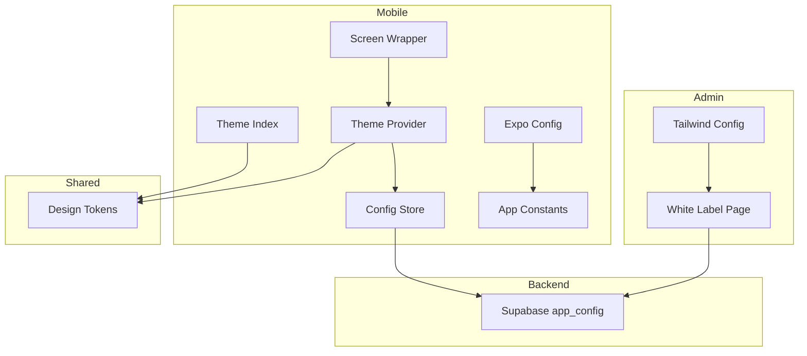
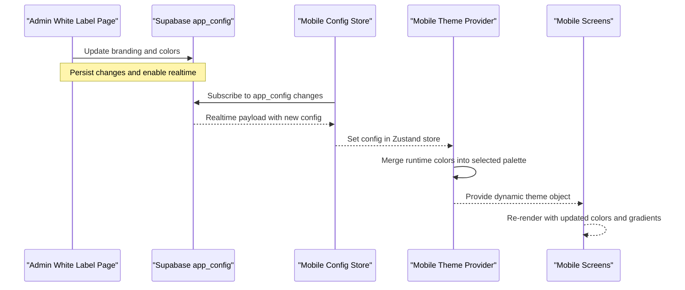
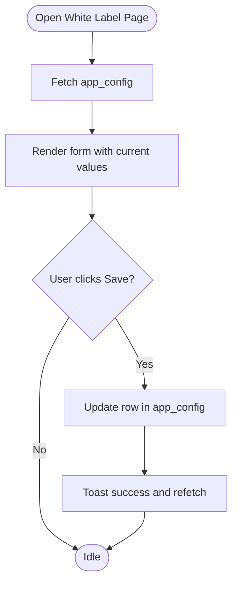
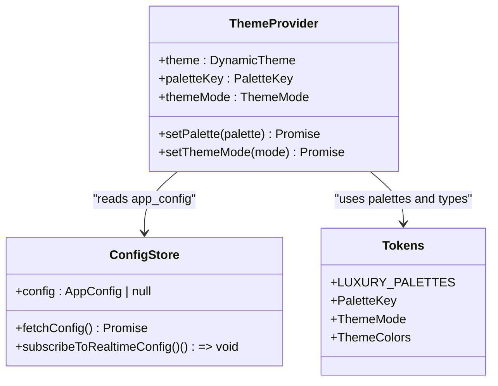
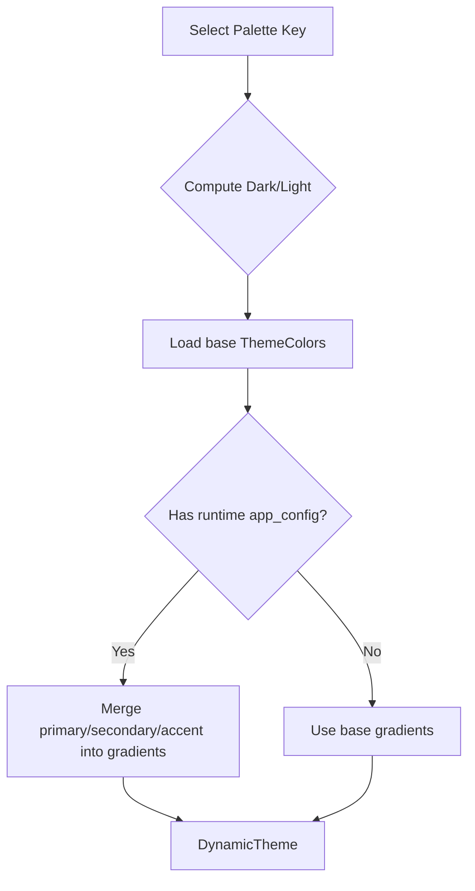
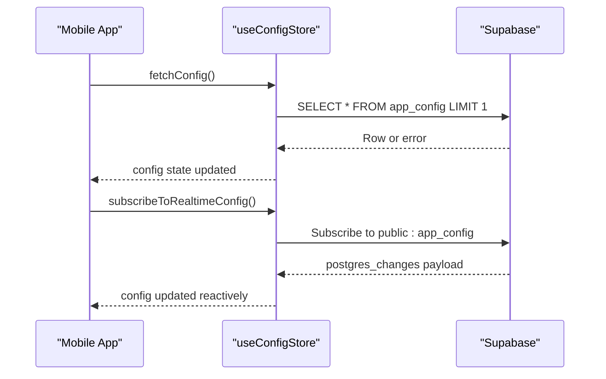
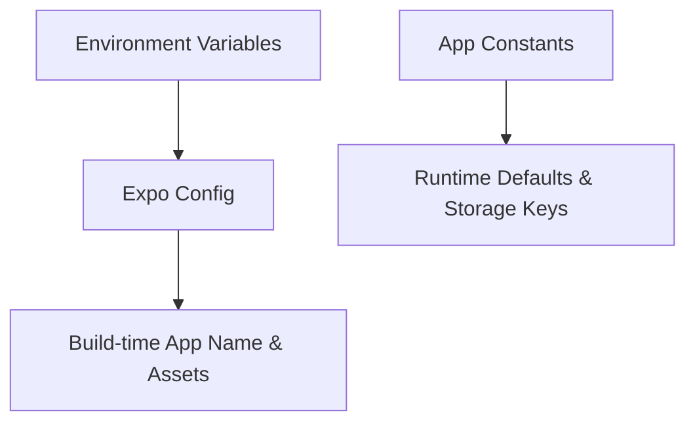
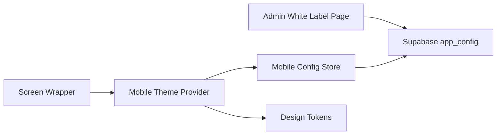

# White Label Customization

<cite>
**Referenced Files in This Document**
- [apps/admin/src/app/(dashboard)/white-label/page.tsx](file://apps/admin/src/app/(dashboard)/white-label/page.tsx)
- [apps/mobile/src/theme/ThemeProvider.tsx](file://apps/mobile/src/theme/ThemeProvider.tsx)
- [apps/mobile/src/theme/index.ts](file://apps/mobile/src/theme/index.ts)
- [packages/tokens/src/index.ts](file://packages/tokens/src/index.ts)
- [apps/mobile/src/store/useConfigStore.ts](file://apps/mobile/src/store/useConfigStore.ts)
- [supabase/migrations/20240001000000_initial_schema.sql](file://supabase/migrations/20240001000000_initial_schema.sql)
- [apps/mobile/src/constants/index.ts](file://apps/mobile/src/constants/index.ts)
- [apps/mobile/src/components/templates/ScreenWrapper.tsx](file://apps/mobile/src/components/templates/ScreenWrapper.tsx)
- [apps/admin/tailwind.config.ts](file://apps/admin/tailwind.config.ts)
- [apps/mobile/app.config.ts](file://apps/mobile/app.config.ts)
</cite>

## Table of Contents
1. Introduction
2. Project Structure
3. Core Components
4. Architecture Overview
5. Detailed Component Analysis
6. Dependency Analysis
7. Performance Considerations
8. Troubleshooting Guide
9. Conclusion
10. Appendices

## Introduction
This document explains the White Label customization system that allows you to brand and theme both the admin dashboard and mobile application at runtime. It covers:
- Theme configuration and branding options
- UI customization capabilities via design tokens and color palettes
- Typography settings and responsive behavior
- Applying custom logos, colors, and styles across the app
- Creating brand-specific themes and managing multiple client configurations
- Deploying white-labeled versions with environment-driven overrides
- Accessibility considerations for customized interfaces

The system uses a centralized configuration stored in Supabase and consumed by both web and mobile clients. The mobile app composes built-in design tokens with runtime overrides to produce a live, per-client theme.

## Project Structure
The white label system spans several layers:
- Admin UI: A dedicated page to edit branding and feature flags
- Mobile theming: A provider that merges token-based palettes with runtime config
- Shared tokens: A package defining palette keys, modes, and color shapes
- Data layer: Supabase schema and policies governing app_config
- App-level constants and wrappers: Global branding constants and screen wrappers that consume the theme

**Diagram sources**
- [apps/admin/src/app/(dashboard)/white-label/page.tsx:1-302](file://apps/admin/src/app/(dashboard)/white-label/page.tsx#L1-L302)
- [apps/mobile/src/theme/ThemeProvider.tsx:1-97](file://apps/mobile/src/theme/ThemeProvider.tsx#L1-L97)
- [apps/mobile/src/theme/index.ts:1-12](file://apps/mobile/src/theme/index.ts#L1-L12)
- [packages/tokens/src/index.ts:1-284](file://packages/tokens/src/index.ts#L1-L284)
- [apps/mobile/src/store/useConfigStore.ts:1-67](file://apps/mobile/src/store/useConfigStore.ts#L1-L67)
- [supabase/migrations/20240001000000_initial_schema.sql:14-29](file://supabase/migrations/20240001000000_initial_schema.sql#L14-L29)
- [apps/mobile/src/constants/index.ts:1-23](file://apps/mobile/src/constants/index.ts#L1-L23)
- [apps/mobile/src/components/templates/ScreenWrapper.tsx:1-126](file://apps/mobile/src/components/templates/ScreenWrapper.tsx#L1-L126)
- [apps/admin/tailwind.config.ts:1-29](file://apps/admin/tailwind.config.ts#L1-L29)
- [apps/mobile/app.config.ts:1-42](file://apps/mobile/app.config.ts#L1-L42)

**Section sources**
- [apps/admin/src/app/(dashboard)/white-label/page.tsx:1-302](file://apps/admin/src/app/(dashboard)/white-label/page.tsx#L1-L302)
- [apps/mobile/src/theme/ThemeProvider.tsx:1-97](file://apps/mobile/src/theme/ThemeProvider.tsx#L1-L97)
- [packages/tokens/src/index.ts:1-284](file://packages/tokens/src/index.ts#L1-L284)
- [apps/mobile/src/store/useConfigStore.ts:1-67](file://apps/mobile/src/store/useConfigStore.ts#L1-L67)
- [supabase/migrations/20240001000000_initial_schema.sql:14-29](file://supabase/migrations/20240001000000_initial_schema.sql#L14-L29)
- [apps/mobile/src/constants/index.ts:1-23](file://apps/mobile/src/constants/index.ts#L1-L23)
- [apps/mobile/src/components/templates/ScreenWrapper.tsx:1-126](file://apps/mobile/src/components/templates/ScreenWrapper.tsx#L1-L126)
- [apps/admin/tailwind.config.ts:1-29](file://apps/admin/tailwind.config.ts#L1-L29)
- [apps/mobile/app.config.ts:1-42](file://apps/mobile/app.config.ts#L1-L42)

## Core Components
- White Label Editor (Admin): Provides fields for product name, logo URL, support email, primary/secondary/accent colors, and feature flags such as RevenueCat, social login, and maintenance mode. Changes are persisted to Supabase and broadcast via realtime subscriptions.
- Mobile Theme Provider: Loads persisted user preferences (palette key and theme mode), computes dark/light mode, and merges runtime app_config colors into the selected palette to produce a dynamic theme object.
- Design Tokens Package: Defines palette keys, theme modes, and a comprehensive ThemeColors shape used across components. Includes multiple curated palettes for light and dark modes.
- Config Store (Mobile): Fetches and subscribes to app_config from Supabase, enabling live updates without reloads.
- Screen Wrapper: Applies theme colors to backgrounds and status bar, and renders ambient glow using theme tokens.
- App Constants: Centralized branding defaults and storage keys for local persistence.
- Expo Config: Environment-driven app name and icon/splash settings for build-time branding.
- Tailwind Config: Extends admin theme with brand color scales and dark mode class strategy.

**Section sources**
- [apps/admin/src/app/(dashboard)/white-label/page.tsx:1-302](file://apps/admin/src/app/(dashboard)/white-label/page.tsx#L1-L302)
- [apps/mobile/src/theme/ThemeProvider.tsx:1-97](file://apps/mobile/src/theme/ThemeProvider.tsx#L1-L97)
- [packages/tokens/src/index.ts:1-284](file://packages/tokens/src/index.ts#L1-L284)
- [apps/mobile/src/store/useConfigStore.ts:1-67](file://apps/mobile/src/store/useConfigStore.ts#L1-L67)
- [apps/mobile/src/components/templates/ScreenWrapper.tsx:1-126](file://apps/mobile/src/components/templates/ScreenWrapper.tsx#L1-L126)
- [apps/mobile/src/constants/index.ts:1-23](file://apps/mobile/src/constants/index.ts#L1-L23)
- [apps/mobile/app.config.ts:1-42](file://apps/mobile/app.config.ts#L1-L42)
- [apps/admin/tailwind.config.ts:1-29](file://apps/admin/tailwind.config.ts#L1-L29)

## Architecture Overview
The white label flow connects admin edits to live mobile themes through a centralized data store and reactive subscriptions.

**Diagram sources**
- [apps/admin/src/app/(dashboard)/white-label/page.tsx:25-91](file://apps/admin/src/app/(dashboard)/white-label/page.tsx#L25-L91)
- [apps/mobile/src/store/useConfigStore.ts:15-65](file://apps/mobile/src/store/useConfigStore.ts#L15-L65)
- [apps/mobile/src/theme/ThemeProvider.tsx:52-81](file://apps/mobile/src/theme/ThemeProvider.tsx#L52-L81)
- [supabase/migrations/20240001000000_initial_schema.sql:14-29](file://supabase/migrations/20240001000000_initial_schema.sql#L14-L29)

## Detailed Component Analysis

### White Label Editor (Admin)
- Purpose: Edit product identity and runtime feature flags; persist to Supabase; notify clients via realtime.
- Key fields: app_name, logo_url, primary_color, secondary_color, accent_color, support_email, enable_revenuecat, enable_social_login, maintenance_mode.
- Behavior: Loads existing config on mount; saves updates; shows toast feedback; refreshes local state.

**Diagram sources**
- [apps/admin/src/app/(dashboard)/white-label/page.tsx:25-91](file://apps/admin/src/app/(dashboard)/white-label/page.tsx#L25-L91)

**Section sources**
- [apps/admin/src/app/(dashboard)/white-label/page.tsx:1-302](file://apps/admin/src/app/(dashboard)/white-label/page.tsx#L1-L302)

### Mobile Theme Provider
- Purpose: Compute active theme by combining user-selected palette and runtime app_config overrides.
- Inputs: Palette key, theme mode (dark/light/system), and app_config from store.
- Outputs: DynamicTheme with merged colors, including overridden primary/secondary/accent and adjusted gradients.

**Diagram sources**
- [apps/mobile/src/theme/ThemeProvider.tsx:1-97](file://apps/mobile/src/theme/ThemeProvider.tsx#L1-L97)
- [apps/mobile/src/store/useConfigStore.ts:1-67](file://apps/mobile/src/store/useConfigStore.ts#L1-L67)
- [packages/tokens/src/index.ts:1-284](file://packages/tokens/src/index.ts#L1-L284)

**Section sources**
- [apps/mobile/src/theme/ThemeProvider.tsx:1-97](file://apps/mobile/src/theme/ThemeProvider.tsx#L1-L97)
- [apps/mobile/src/store/useConfigStore.ts:1-67](file://apps/mobile/src/store/useConfigStore.ts#L1-L67)
- [packages/tokens/src/index.ts:1-284](file://packages/tokens/src/index.ts#L1-L284)

### Design Token System
- Palette keys: sunset, emerald, violet, azure, stealth.
- Theme modes: dark, light, system.
- ThemeColors: Comprehensive set of background, surface, text, border, gradient, badge, and glass tokens for both light and dark variants.
- Usage: Mobile Theme Provider selects base colors from the chosen palette and overlays runtime overrides for brand colors.

**Diagram sources**
- [packages/tokens/src/index.ts:1-284](file://packages/tokens/src/index.ts#L1-L284)
- [apps/mobile/src/theme/ThemeProvider.tsx:52-81](file://apps/mobile/src/theme/ThemeProvider.tsx#L52-L81)

**Section sources**
- [packages/tokens/src/index.ts:1-284](file://packages/tokens/src/index.ts#L1-L284)
- [apps/mobile/src/theme/ThemeProvider.tsx:52-81](file://apps/mobile/src/theme/ThemeProvider.tsx#L52-L81)

### Runtime Configuration Store
- Purpose: Fetch and subscribe to app_config changes from Supabase; handle placeholder environments safely.
- Features:
  - Instant bypass when using placeholder URLs to avoid DNS timeouts
  - Realtime subscription to app_config table changes
  - Safe error handling and loading states

**Diagram sources**
- [apps/mobile/src/store/useConfigStore.ts:15-65](file://apps/mobile/src/store/useConfigStore.ts#L15-L65)

**Section sources**
- [apps/mobile/src/store/useConfigStore.ts:1-67](file://apps/mobile/src/store/useConfigStore.ts#L1-L67)

### Branding and App-Level Overrides
- Mobile app name and splash/icon can be driven by environment variables at build time.
- Global branding constants provide default strings and storage keys for local persistence.

**Diagram sources**
- [apps/mobile/app.config.ts:1-42](file://apps/mobile/app.config.ts#L1-L42)
- [apps/mobile/src/constants/index.ts:1-23](file://apps/mobile/src/constants/index.ts#L1-L23)

**Section sources**
- [apps/mobile/app.config.ts:1-42](file://apps/mobile/app.config.ts#L1-L42)
- [apps/mobile/src/constants/index.ts:1-23](file://apps/mobile/src/constants/index.ts#L1-L23)

### Admin Styling and Tailwind Integration
- Tailwind config extends theme with brand color scales and enables class-based dark mode.
- Used by admin pages to style the white label editor consistently.

**Section sources**
- [apps/admin/tailwind.config.ts:1-29](file://apps/admin/tailwind.config.ts#L1-L29)

### Responsive and Accessibility Considerations
- Responsive layout: Admin uses responsive grid classes; mobile screens use safe area insets and keyboard-aware scrolling for consistent UX across devices.
- Accessibility:
  - Status bar contrast adapts to theme mode
  - Color choices should maintain sufficient contrast ratios for text and interactive elements
  - Avoid relying solely on color to convey meaning; pair with icons or labels where appropriate

**Section sources**
- [apps/mobile/src/components/templates/ScreenWrapper.tsx:35-68](file://apps/mobile/src/components/templates/ScreenWrapper.tsx#L35-L68)
- [apps/admin/src/app/(dashboard)/white-label/page.tsx:122-161](file://apps/admin/src/app/(dashboard)/white-label/page.tsx#L122-L161)

## Dependency Analysis
- Admin White Label Page depends on Supabase for reading/writing app_config and displays a branded UI styled via Tailwind.
- Mobile Theme Provider depends on:
  - Design tokens for palette definitions and types
  - Config store for runtime app_config
  - Secure storage for user preferences
- Config store depends on Supabase for fetching and subscribing to app_config.
- Database schema defines app_config columns and RLS policies ensuring only admins can update while authenticated users can read.

**Diagram sources**
- [apps/admin/src/app/(dashboard)/white-label/page.tsx:25-91](file://apps/admin/src/app/(dashboard)/white-label/page.tsx#L25-L91)
- [apps/mobile/src/store/useConfigStore.ts:15-65](file://apps/mobile/src/store/useConfigStore.ts#L15-L65)
- [apps/mobile/src/theme/ThemeProvider.tsx:52-81](file://apps/mobile/src/theme/ThemeProvider.tsx#L52-L81)
- [packages/tokens/src/index.ts:1-284](file://packages/tokens/src/index.ts#L1-L284)
- [supabase/migrations/20240001000000_initial_schema.sql:14-29](file://supabase/migrations/20240001000000_initial_schema.sql#L14-L29)

**Section sources**
- [apps/admin/src/app/(dashboard)/white-label/page.tsx:25-91](file://apps/admin/src/app/(dashboard)/white-label/page.tsx#L25-L91)
- [apps/mobile/src/store/useConfigStore.ts:15-65](file://apps/mobile/src/store/useConfigStore.ts#L15-L65)
- [apps/mobile/src/theme/ThemeProvider.tsx:52-81](file://apps/mobile/src/theme/ThemeProvider.tsx#L52-L81)
- [packages/tokens/src/index.ts:1-284](file://packages/tokens/src/index.ts#L1-L284)
- [supabase/migrations/20240001000000_initial_schema.sql:14-29](file://supabase/migrations/20240001000000_initial_schema.sql#L14-L29)

## Performance Considerations
- Realtime updates: Mobile subscribes to app_config changes to reflect branding instantly without reloads.
- Placeholder bypass: Config store avoids network calls when using placeholder URLs to prevent long DNS timeouts.
- Gradient recomposition: Theme Provider recomputes gradients only when palette, mode, or app_config changes, minimizing unnecessary re-renders.
- Safe areas and keyboard: Mobile wrapper adjusts padding based on safe area insets and keyboard height to avoid layout thrashing.

[No sources needed since this section provides general guidance]

## Troubleshooting Guide
- Colors not updating on mobile:
  - Ensure app_config has been updated and realtime subscription is active.
  - Verify that the mobile app has fetched and subscribed to app_config changes.
- Long load times or timeouts:
  - Check if the app is using a placeholder Supabase URL; the store will bypass network calls in that case.
- Admin save errors:
  - Confirm admin role permissions for updating app_config via RLS policies.
- Inconsistent branding across screens:
  - Ensure all screens are wrapped with the theme-aware container and use theme tokens rather than hardcoded colors.

**Section sources**
- [apps/mobile/src/store/useConfigStore.ts:15-65](file://apps/mobile/src/store/useConfigStore.ts#L15-L65)
- [supabase/migrations/20240001000000_initial_schema.sql:170-172](file://supabase/migrations/20240001000000_initial_schema.sql#L170-L172)
- [apps/admin/src/app/(dashboard)/white-label/page.tsx:58-91](file://apps/admin/src/app/(dashboard)/white-label/page.tsx#L58-L91)

## Conclusion
The white label system provides a robust, runtime-driven approach to branding and theming across platforms. By centralizing configuration in Supabase and composing it with design tokens in the mobile app, teams can deliver brand-specific experiences quickly and safely. The admin interface offers an intuitive way to manage identity and feature flags, while the mobile theme engine ensures consistent, accessible, and responsive visuals.

[No sources needed since this section summarizes without analyzing specific files]

## Appendices

### How to Apply Custom Logos, Colors, and Styling
- Logo and product name:
  - Set logo_url and app_name in the admin white label page; these values are persisted to app_config and can be consumed by your UI where needed.
- Colors:
  - Choose primary, secondary, and accent colors in the admin page; they override the corresponding tokens in the mobile theme provider.
- Styling:
  - Extend Tailwind in the admin theme for consistent admin styling.
  - On mobile, rely on theme tokens and the Screen Wrapper to apply background and status bar colors automatically.

**Section sources**
- [apps/admin/src/app/(dashboard)/white-label/page.tsx:114-232](file://apps/admin/src/app/(dashboard)/white-label/page.tsx#L114-L232)
- [apps/mobile/src/theme/ThemeProvider.tsx:59-81](file://apps/mobile/src/theme/ThemeProvider.tsx#L59-L81)
- [apps/admin/tailwind.config.ts:3-24](file://apps/admin/tailwind.config.ts#L3-L24)
- [apps/mobile/src/components/templates/ScreenWrapper.tsx:62-68](file://apps/mobile/src/components/templates/ScreenWrapper.tsx#L62-L68)

### Creating Brand-Specific Themes and Managing Multiple Clients
- Create a palette:
  - Add a new entry in the design tokens package with light/dark ThemeColors sets.
- Assign per client:
  - Store a palette key per client in app_config or a separate mapping table, then resolve it in the mobile theme provider.
- Feature flags:
  - Toggle features like RevenueCat, social login, and maintenance mode per client via app_config.

**Section sources**
- [packages/tokens/src/index.ts:1-284](file://packages/tokens/src/index.ts#L1-L284)
- [apps/mobile/src/theme/ThemeProvider.tsx:59-81](file://apps/mobile/src/theme/ThemeProvider.tsx#L59-L81)
- [supabase/migrations/20240001000000_initial_schema.sql:14-29](file://supabase/migrations/20240001000000_initial_schema.sql#L14-L29)

### Deploying White-Labeled Versions
- Build-time branding:
  - Configure app name, icon, and splash via environment variables in the Expo config.
- Runtime branding:
  - Publish app_config changes from the admin panel; mobile apps will receive updates via realtime subscriptions.

**Section sources**
- [apps/mobile/app.config.ts:1-42](file://apps/mobile/app.config.ts#L1-L42)
- [apps/mobile/src/store/useConfigStore.ts:39-65](file://apps/mobile/src/store/useConfigStore.ts#L39-L65)