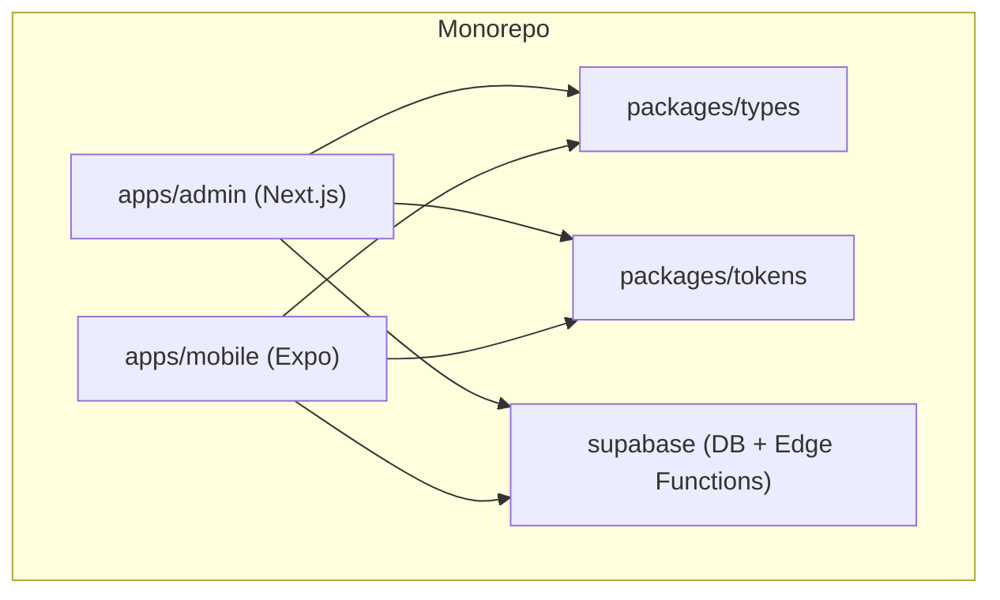
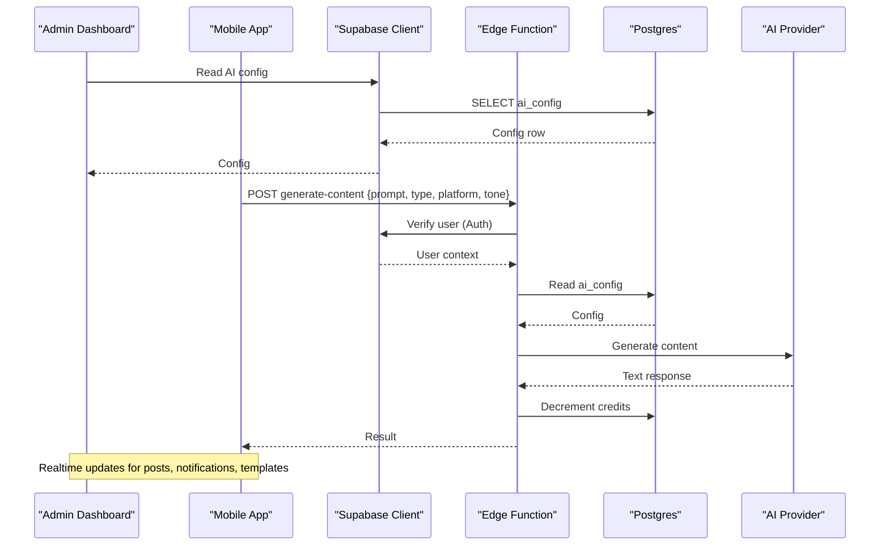
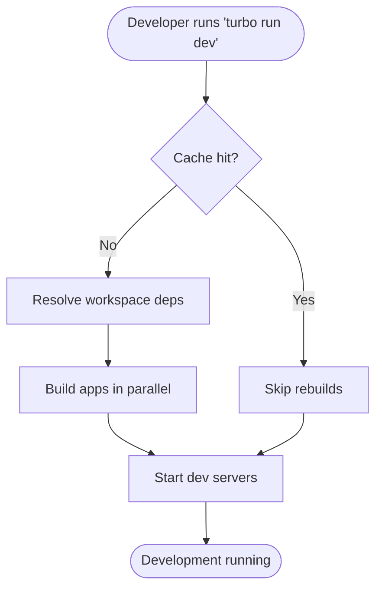
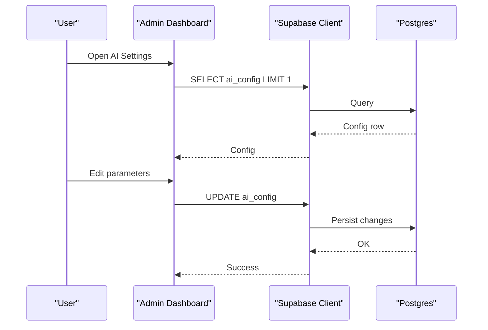
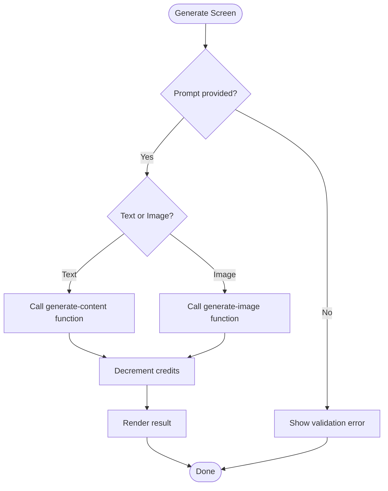
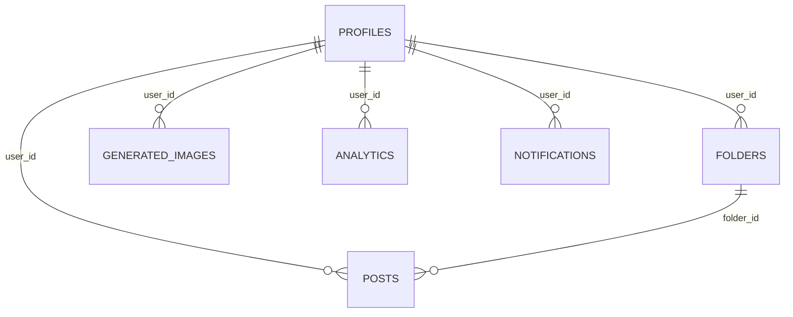
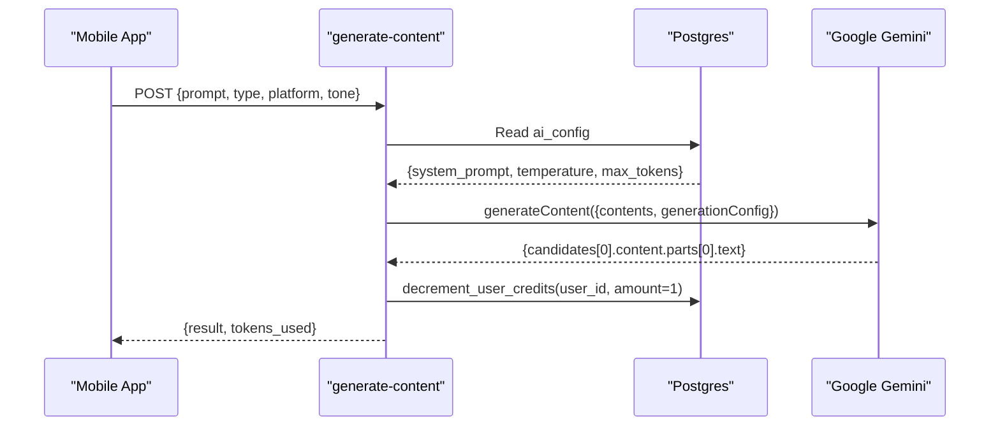
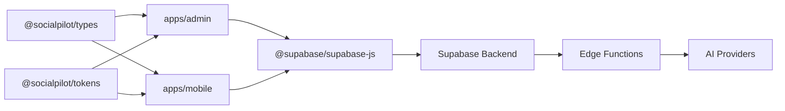

# Architecture Overview

<cite>
**Referenced Files in This Document**
- [package.json](file://package.json)
- [turbo.json](file://turbo.json)
- [pnpm-workspace.yaml](file://pnpm-workspace.yaml)
- [README.md](file://README.md)
- [apps/admin/package.json](file://apps/admin/package.json)
- [apps/mobile/package.json](file://apps/mobile/package.json)
- [apps/admin/src/lib/supabase.ts](file://apps/admin/src/lib/supabase.ts)
- [apps/mobile/src/services/supabase.ts](file://apps/mobile/src/services/supabase.ts)
- [apps/admin/src/app/(dashboard)/ai-settings/page.tsx](file://apps/admin/src/app/(dashboard)/ai-settings/page.tsx)
- [apps/mobile/src/app/(tabs)/generate.tsx](file://apps/mobile/src/app/(tabs)/generate.tsx)
- [supabase/functions/generate-content/index.ts](file://supabase/functions/generate-content/index.ts)
- [supabase/functions/generate-image/index.ts](file://supabase/functions/generate-image/index.ts)
- [supabase/migrations/20240001000000_initial_schema.sql](file://supabase/migrations/20240001000000_initial_schema.sql)
</cite>

## Table of Contents
1. Introduction
2. Project Structure
3. Core Components
4. Architecture Overview
5. Detailed Component Analysis
6. Dependency Analysis
7. Performance Considerations
8. Troubleshooting Guide
9. Conclusion

## Introduction
SocialPilot AI Pro is an AI-powered social media management suite delivered as a monorepo with Turborepo orchestration. It includes:
- A Next.js admin dashboard for configuration, analytics, and content operations.
- An Expo-based mobile app for on-the-go content generation and scheduling.
- A Supabase backend providing authentication, database, edge functions, and real-time capabilities.
The system integrates with external AI providers (Google Gemini for text, Replicate for images) via serverless functions to centralize secrets, enforce policies, and manage credits.

## Project Structure
The repository uses pnpm workspaces and Turborepo to coordinate builds and development across apps and shared packages:
- apps/admin: Next.js application for the admin dashboard.
- apps/mobile: Expo application for iOS/Android/web.
- packages/types and packages/tokens: Shared TypeScript types and design tokens consumed by both apps.
- supabase: Database schema, migrations, and edge functions for AI generation and image rendering.
- Root scripts and configs define workspace boundaries and pipeline caching.

**Diagram sources**
- [package.json:5-8](file://package.json#L5-L8)
- [pnpm-workspace.yaml:1-4](file://pnpm-workspace.yaml#L1-L4)
- [turbo.json:6-24](file://turbo.json#L6-L24)

**Section sources**
- [package.json:5-8](file://package.json#L5-L8)
- [pnpm-workspace.yaml:1-4](file://pnpm-workspace.yaml#L1-L4)
- [turbo.json:6-24](file://turbo.json#L6-L24)
- [README.md:1-4](file://README.md#L1-L4)

## Core Components
- Admin Dashboard (Next.js): Provides AI engine configuration, user management, analytics, and post administration. Uses Supabase client with session persistence and auto-refresh.
- Mobile App (Expo): Offers AI content studio for generating copy and images, platform selection, templates, and scheduling flows. Uses secure storage for sessions on native platforms.
- Supabase Backend:
  - Database: Centralized schema for profiles, posts, folders, templates, generated images, analytics, notifications, and admin logs.
  - Authentication: Row-level security policies and triggers to create profiles on signup.
  - Edge Functions: Server-side calls to AI providers with secret management, credit accounting, and result persistence.

Key integration points:
- Both apps connect to Supabase using environment-configured URLs and keys.
- AI generation flows are routed through Supabase edge functions to protect API keys and enforce business rules.
- Realtime subscriptions are enabled for key tables to support live updates.

**Section sources**
- [apps/admin/package.json:11-31](file://apps/admin/package.json#L11-L31)
- [apps/mobile/package.json:13-45](file://apps/mobile/package.json#L13-L45)
- [apps/admin/src/lib/supabase.ts:1-14](file://apps/admin/src/lib/supabase.ts#L1-L14)
- [apps/mobile/src/services/supabase.ts:1-41](file://apps/mobile/src/services/supabase.ts#L1-L41)
- [supabase/migrations/20240001000000_initial_schema.sql:15-232](file://supabase/migrations/20240001000000_initial_schema.sql#L15-L232)

## Architecture Overview
High-level data flow:
- Clients authenticate via Supabase Auth and maintain sessions securely.
- UI components request data or trigger actions (e.g., generate content).
- Requests go to Supabase Edge Functions that validate auth, read AI config from DB, call provider APIs, update credits, and persist results.
- Realtime channels broadcast changes to subscribed clients.

**Diagram sources**
- [supabase/functions/generate-content/index.ts:9-98](file://supabase/functions/generate-content/index.ts#L9-L98)
- [supabase/migrations/20240001000000_initial_schema.sql:31-42](file://supabase/migrations/20240001000000_initial_schema.sql#L31-L42)
- [supabase/migrations/20240001000000_initial_schema.sql:227-232](file://supabase/migrations/20240001000000_initial_schema.sql#L227-L232)

## Detailed Component Analysis

### Monorepo Orchestration (Turborepo + pnpm Workspaces)
- Workspace definitions scope apps and packages for dependency sharing and unified commands.
- Turbo pipeline defines build dependencies, outputs, linting, and persistent dev tasks with caching.

**Diagram sources**
- [turbo.json:6-24](file://turbo.json#L6-L24)
- [pnpm-workspace.yaml:1-4](file://pnpm-workspace.yaml#L1-L4)

**Section sources**
- [turbo.json:6-24](file://turbo.json#L6-L24)
- [pnpm-workspace.yaml:1-4](file://pnpm-workspace.yaml#L1-L4)

### Admin Dashboard (Next.js)
- Uses Supabase client with session persistence and token refresh.
- AI settings page reads and updates centralized AI configuration stored in the database.
- Integrates with shared types and tokens for consistent UX and typing.

**Diagram sources**
- [apps/admin/src/lib/supabase.ts:1-14](file://apps/admin/src/lib/supabase.ts#L1-L14)
- [apps/admin/src/app/(dashboard)/ai-settings/page.tsx:23-85](file://apps/admin/src/app/(dashboard)/ai-settings/page.tsx#L23-L85)
- [supabase/migrations/20240001000000_initial_schema.sql:31-42](file://supabase/migrations/20240001000000_initial_schema.sql#L31-L42)

**Section sources**
- [apps/admin/package.json:11-31](file://apps/admin/package.json#L11-L31)
- [apps/admin/src/lib/supabase.ts:1-14](file://apps/admin/src/lib/supabase.ts#L1-L14)
- [apps/admin/src/app/(dashboard)/ai-settings/page.tsx:23-85](file://apps/admin/src/app/(dashboard)/ai-settings/page.tsx#L23-L85)

### Mobile App (Expo)
- Secure session storage via Expo SecureStore on native; localStorage fallback on web.
- Content generation UI supports platform selection, content type, tone, and templates.
- Credits are decremented locally in the demo flow; production should use edge functions for authoritative accounting.

**Diagram sources**
- [apps/mobile/src/services/supabase.ts:1-41](file://apps/mobile/src/services/supabase.ts#L1-L41)
- [apps/mobile/src/app/(tabs)/generate.tsx:123-176](file://apps/mobile/src/app/(tabs)/generate.tsx#L123-L176)

**Section sources**
- [apps/mobile/package.json:13-45](file://apps/mobile/package.json#L13-L45)
- [apps/mobile/src/services/supabase.ts:1-41](file://apps/mobile/src/services/supabase.ts#L1-L41)
- [apps/mobile/src/app/(tabs)/generate.tsx:123-176](file://apps/mobile/src/app/(tabs)/generate.tsx#L123-L176)

### Supabase Backend Services
- Schema defines core entities: profiles, posts, folders, templates, generated_images, analytics, notifications, admin_logs, plus app_config and ai_config.
- Row-Level Security enforces per-user access and admin privileges.
- Triggers create profiles on user signup; Realtime publication enables live updates for key tables.
- Edge functions handle AI integrations with secret-safe environments and credit accounting.

**Diagram sources**
- [supabase/migrations/20240001000000_initial_schema.sql:44-153](file://supabase/migrations/20240001000000_initial_schema.sql#L44-L153)

**Section sources**
- [supabase/migrations/20240001000000_initial_schema.sql:15-232](file://supabase/migrations/20240001000000_initial_schema.sql#L15-L232)
- [supabase/functions/generate-content/index.ts:9-98](file://supabase/functions/generate-content/index.ts#L9-L98)
- [supabase/functions/generate-image/index.ts:9-87](file://supabase/functions/generate-image/index.ts#L9-L87)

### AI Provider Integration Patterns
- Text generation: Edge function reads ai_config, constructs prompt with system instructions and parameters, calls Google Gemini, returns result and usage metadata.
- Image generation: Edge function calls Replicate with model version and input parameters, persists image URL, and deducts credits.
- Fallback behavior: If provider keys are not configured, mock responses are returned to keep UI functional during setup.

**Diagram sources**
- [supabase/functions/generate-content/index.ts:29-91](file://supabase/functions/generate-content/index.ts#L29-L91)
- [supabase/migrations/20240001000000_initial_schema.sql:31-42](file://supabase/migrations/20240001000000_initial_schema.sql#L31-L42)

**Section sources**
- [supabase/functions/generate-content/index.ts:9-98](file://supabase/functions/generate-content/index.ts#L9-L98)
- [supabase/functions/generate-image/index.ts:9-87](file://supabase/functions/generate-image/index.ts#L9-L87)

## Dependency Analysis
- Apps depend on shared packages for types and tokens, ensuring consistency across platforms.
- Both apps depend on Supabase client libraries for auth, realtime, and database access.
- Edge functions depend on Supabase JS client and environment variables for provider credentials.
- Database schema drives all client interactions and RLS policies.

**Diagram sources**
- [apps/admin/package.json:11-31](file://apps/admin/package.json#L11-L31)
- [apps/mobile/package.json:13-45](file://apps/mobile/package.json#L13-L45)
- [supabase/functions/generate-content/index.ts:1-2](file://supabase/functions/generate-content/index.ts#L1-L2)

**Section sources**
- [apps/admin/package.json:11-31](file://apps/admin/package.json#L11-L31)
- [apps/mobile/package.json:13-45](file://apps/mobile/package.json#L13-L45)
- [supabase/functions/generate-content/index.ts:1-2](file://supabase/functions/generate-content/index.ts#L1-L2)

## Performance Considerations
- Use Turborepo caching to speed up iterative builds and reduce CI times.
- Prefer server-side AI calls via edge functions to avoid exposing secrets and to centralize rate limiting and retries.
- Leverage Supabase Realtime for efficient UI updates without polling.
- Implement optimistic UI updates in clients where appropriate, with rollback on errors.
- Monitor credit accounting and provider quotas to prevent abuse and ensure fair usage.

[No sources needed since this section provides general guidance]

## Troubleshooting Guide
Common issues and resolutions:
- Unauthorized errors in edge functions: Ensure Authorization header is present and valid; verify Supabase URL and anon key configuration in each app.
- Missing provider keys: Configure GEMINI_API_KEY or REPLICATE_API_TOKEN in Supabase project secrets; otherwise functions return mock responses.
- Credit deduction failures: Confirm the RPC function exists and permissions allow authenticated users to invoke it.
- Realtime not updating: Verify publications include the target tables and that RLS policies permit the current user’s access.

**Section sources**
- [supabase/functions/generate-content/index.ts:14-27](file://supabase/functions/generate-content/index.ts#L14-L27)
- [supabase/functions/generate-image/index.ts:14-27](file://supabase/functions/generate-image/index.ts#L14-L27)
- [supabase/migrations/20240001000000_initial_schema.sql:159-202](file://supabase/migrations/20240001000000_initial_schema.sql#L159-L202)
- [supabase/migrations/20240001000000_initial_schema.sql:227-232](file://supabase/migrations/20240001000000_initial_schema.sql#L227-L232)

## Conclusion
SocialPilot AI Pro adopts a modern, scalable architecture:
- Monorepo with Turborepo streamlines development and builds.
- Separate client apps serve distinct user needs while sharing types and tokens.
- Supabase provides a cohesive backend with auth, database, edge functions, and realtime.
- AI integration is centralized behind edge functions for security, policy enforcement, and cost control.
This design balances developer productivity, operational simplicity, and extensibility for future features and providers.

[No sources needed since this section summarizes without analyzing specific files]