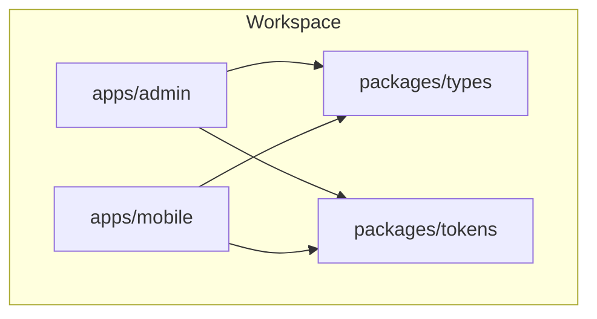
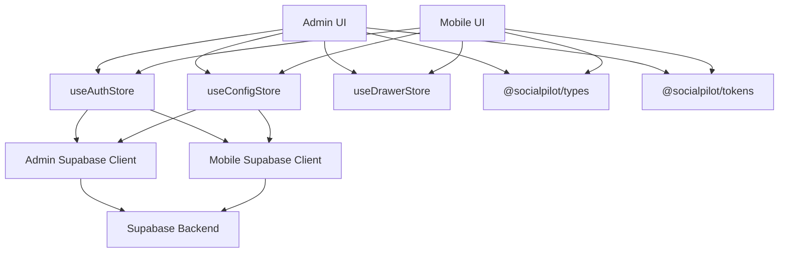
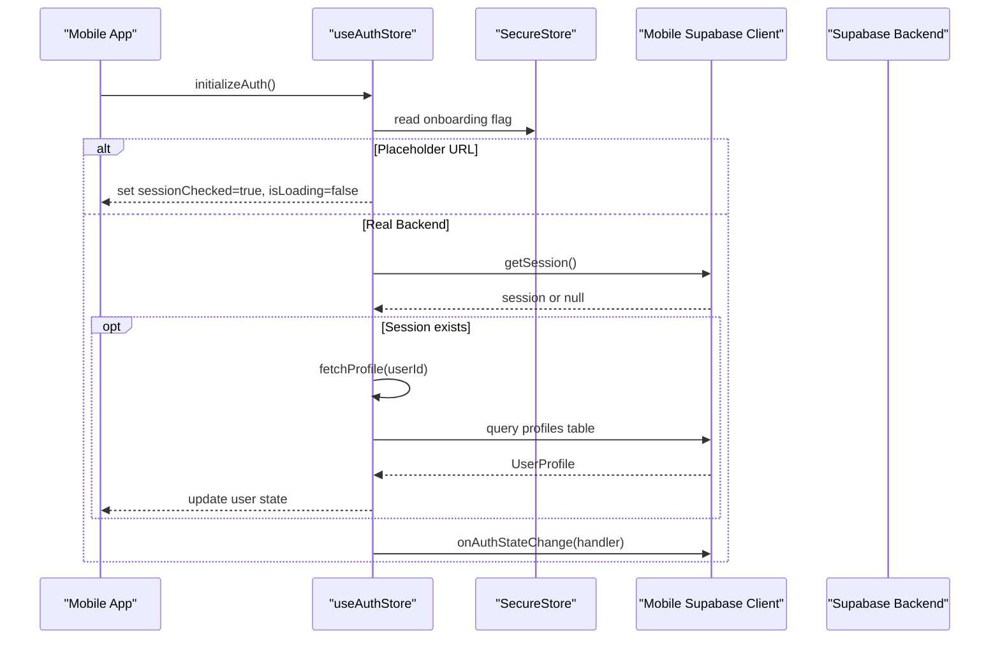
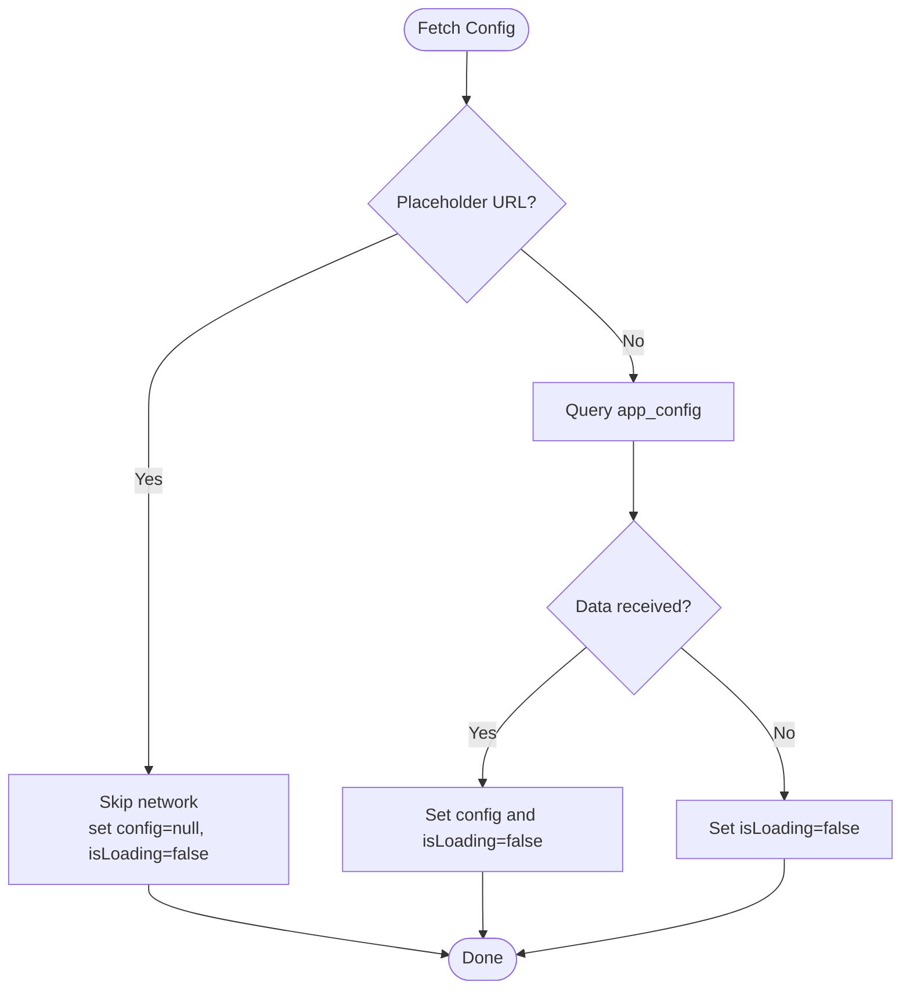
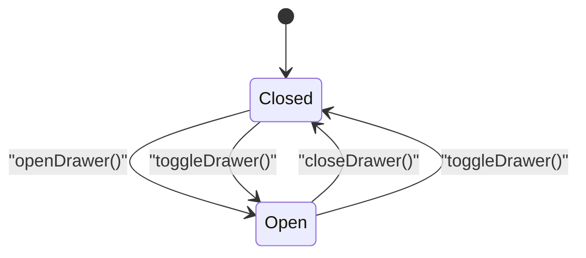
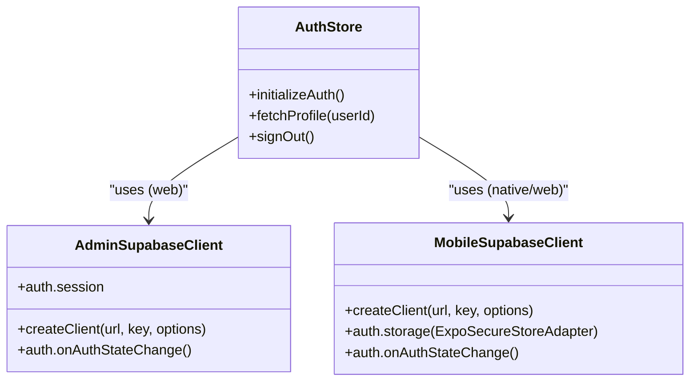
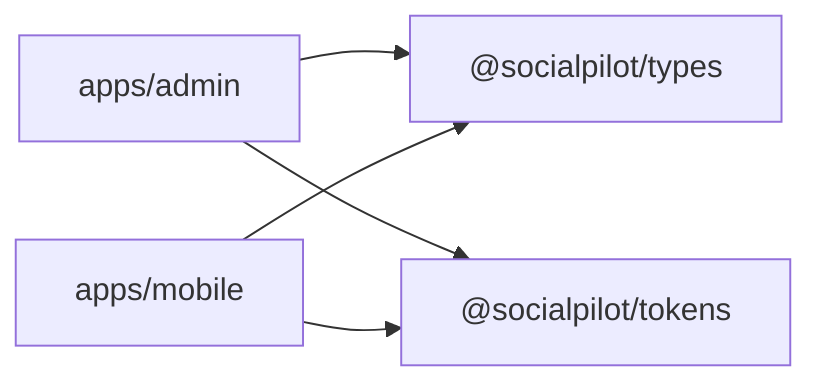

# Component Relationships & Dependencies

<cite>
**Referenced Files in This Document**
- [package.json](file://package.json)
- [pnpm-workspace.yaml](file://pnpm-workspace.yaml)
- [apps/admin/package.json](file://apps/admin/package.json)
- [apps/mobile/package.json](file://apps/mobile/package.json)
- [packages/types/src/index.ts](file://packages/types/src/index.ts)
- [packages/tokens/src/index.ts](file://packages/tokens/src/index.ts)
- [apps/admin/src/lib/supabase.ts](file://apps/admin/src/lib/supabase.ts)
- [apps/mobile/src/services/supabase.ts](file://apps/mobile/src/services/supabase.ts)
- [apps/mobile/src/store/useAuthStore.ts](file://apps/mobile/src/store/useAuthStore.ts)
- [apps/mobile/src/store/useConfigStore.ts](file://apps/mobile/src/store/useConfigStore.ts)
- [apps/mobile/src/store/useDrawerStore.ts](file://apps/mobile/src/store/useDrawerStore.ts)
</cite>

## Table of Contents
1. [Introduction](#introduction)
2. [Project Structure](#project-structure)
3. [Core Components](#core-components)
4. [Architecture Overview](#architecture-overview)
5. [Detailed Component Analysis](#detailed-component-analysis)
6. [Dependency Analysis](#dependency-analysis)
7. [Performance Considerations](#performance-considerations)
8. [Troubleshooting Guide](#troubleshooting-guide)
9. [Conclusion](#conclusion)

## Introduction
This document explains how SocialPilot AI Pro manages component relationships and dependencies across its monorepo. It focuses on:
- Shared packages (types and tokens) consumed by both Admin and Mobile apps
- UI components’ relationship with state stores (Zustand)
- Services interacting with backend APIs via Supabase
- Dependency injection patterns, service abstractions, and shared state communication
- Strategies for avoiding circular dependencies, enabling lazy loading, and optimizing performance

## Project Structure
SocialPilot AI Pro is a pnpm workspace containing two applications and two shared packages:
- Apps:
  - Admin (Next.js)
  - Mobile (Expo/React Native)
- Packages:
  - @socialpilot/types: shared TypeScript types
  - @socialpilot/tokens: shared design tokens (theme palettes, colors, gradients)

**Diagram sources**
- [pnpm-workspace.yaml:1-4](file://pnpm-workspace.yaml#L1-L4)
- [apps/admin/package.json:11-15](file://apps/admin/package.json#L11-L15)
- [apps/mobile/package.json:13-16](file://apps/mobile/package.json#L13-L16)

**Section sources**
- [pnpm-workspace.yaml:1-4](file://pnpm-workspace.yaml#L1-L4)
- [package.json:5-8](file://package.json#L5-L8)

## Core Components
- Shared Types (@socialpilot/types): Centralized type definitions exported from a single index, consumed by both apps to ensure consistent contracts.
- Shared Tokens (@socialpilot/tokens): Theme palette definitions and color maps used to style UI consistently across platforms.
- State Stores (Zustand):
  - useAuthStore: Manages authentication lifecycle, session checks, profile fetching, and sign-out.
  - useConfigStore: Loads app configuration and subscribes to realtime updates.
  - useDrawerStore: Lightweight UI state for drawer visibility.
- Services:
  - Admin Supabase client: Web-oriented client with session persistence and token refresh.
  - Mobile Supabase client: Platform-aware secure storage adapter for sessions.

**Section sources**
- [packages/types/src/index.ts:1-4](file://packages/types/src/index.ts#L1-L4)
- [packages/tokens/src/index.ts:1-284](file://packages/tokens/src/index.ts#L1-L284)
- [apps/mobile/src/store/useAuthStore.ts:1-90](file://apps/mobile/src/store/useAuthStore.ts#L1-L90)
- [apps/mobile/src/store/useConfigStore.ts:1-67](file://apps/mobile/src/store/useConfigStore.ts#L1-L67)
- [apps/mobile/src/store/useDrawerStore.ts:1-16](file://apps/mobile/src/store/useDrawerStore.ts#L1-L16)
- [apps/admin/src/lib/supabase.ts:1-14](file://apps/admin/src/lib/supabase.ts#L1-L14)
- [apps/mobile/src/services/supabase.ts:1-41](file://apps/mobile/src/services/supabase.ts#L1-L41)

## Architecture Overview
The system follows a layered architecture:
- UI layer (Admin pages/components, Mobile screens/components) consumes Zustand stores for state.
- Store layer encapsulates business logic and coordinates API calls through platform-specific Supabase clients.
- Service layer abstracts network concerns and persists sessions securely per platform.
- Shared packages provide types and tokens to enforce consistency and reduce duplication.

**Diagram sources**
- [apps/admin/package.json:11-15](file://apps/admin/package.json#L11-L15)
- [apps/mobile/package.json:13-16](file://apps/mobile/package.json#L13-L16)
- [apps/mobile/src/store/useAuthStore.ts:1-90](file://apps/mobile/src/store/useAuthStore.ts#L1-L90)
- [apps/mobile/src/store/useConfigStore.ts:1-67](file://apps/mobile/src/store/useConfigStore.ts#L1-L67)
- [apps/mobile/src/store/useDrawerStore.ts:1-16](file://apps/mobile/src/store/useDrawerStore.ts#L1-L16)
- [apps/admin/src/lib/supabase.ts:1-14](file://apps/admin/src/lib/supabase.ts#L1-L14)
- [apps/mobile/src/services/supabase.ts:1-41](file://apps/mobile/src/services/supabase.ts#L1-L41)

## Detailed Component Analysis

### Shared Types Package (@socialpilot/types)
- Purpose: Single source of truth for domain models and API contracts.
- Usage: Both Admin and Mobile import types to ensure compile-time safety and consistent data shapes.
- Benefits: Reduces drift between frontend and backend schemas; improves developer experience with autocompletion.

**Section sources**
- [packages/types/src/index.ts:1-4](file://packages/types/src/index.ts#L1-L4)
- [apps/admin/package.json:11-15](file://apps/admin/package.json#L11-L15)
- [apps/mobile/package.json:13-16](file://apps/mobile/package.json#L13-L16)

### Shared Tokens Package (@socialpilot/tokens)
- Purpose: Centralized theme palettes and color maps for consistent visual identity.
- Usage: UI components consume tokens to render themed surfaces, text, borders, and accents.
- Benefits: Enables global theme changes without scattering color literals across the codebase.

**Section sources**
- [packages/tokens/src/index.ts:1-284](file://packages/tokens/src/index.ts#L1-L284)
- [apps/admin/package.json:11-15](file://apps/admin/package.json#L11-L15)
- [apps/mobile/package.json:13-16](file://apps/mobile/package.json#L13-L16)

### Authentication Flow (Mobile)
The mobile auth store initializes sessions, fetches user profiles, listens for auth state changes, and handles sign-out. It also short-circuits when using placeholder URLs to avoid long DNS timeouts during development.

**Diagram sources**
- [apps/mobile/src/store/useAuthStore.ts:1-90](file://apps/mobile/src/store/useAuthStore.ts#L1-L90)
- [apps/mobile/src/services/supabase.ts:1-41](file://apps/mobile/src/services/supabase.ts#L1-L41)

**Section sources**
- [apps/mobile/src/store/useAuthStore.ts:1-90](file://apps/mobile/src/store/useAuthStore.ts#L1-L90)
- [apps/mobile/src/services/supabase.ts:1-41](file://apps/mobile/src/services/supabase.ts#L1-L41)

### Configuration Management (Realtime)
The config store loads application settings and subscribes to realtime updates. It avoids WebSocket connections when running against placeholder URLs.

**Diagram sources**
- [apps/mobile/src/store/useConfigStore.ts:1-67](file://apps/mobile/src/store/useConfigStore.ts#L1-L67)

**Section sources**
- [apps/mobile/src/store/useConfigStore.ts:1-67](file://apps/mobile/src/store/useConfigStore.ts#L1-L67)

### Drawer UI State
A minimal store managing drawer open/close state for UI interactions.

**Diagram sources**
- [apps/mobile/src/store/useDrawerStore.ts:1-16](file://apps/mobile/src/store/useDrawerStore.ts#L1-L16)

**Section sources**
- [apps/mobile/src/store/useDrawerStore.ts:1-16](file://apps/mobile/src/store/useDrawerStore.ts#L1-L16)

### Service Layer Abstractions (Supabase Clients)
- Admin client: Uses web-based session persistence and automatic token refresh.
- Mobile client: Uses platform-aware secure storage (SecureStore on native, localStorage on web) for session persistence.

**Diagram sources**
- [apps/admin/src/lib/supabase.ts:1-14](file://apps/admin/src/lib/supabase.ts#L1-L14)
- [apps/mobile/src/services/supabase.ts:1-41](file://apps/mobile/src/services/supabase.ts#L1-L41)
- [apps/mobile/src/store/useAuthStore.ts:1-90](file://apps/mobile/src/store/useAuthStore.ts#L1-L90)

**Section sources**
- [apps/admin/src/lib/supabase.ts:1-14](file://apps/admin/src/lib/supabase.ts#L1-L14)
- [apps/mobile/src/services/supabase.ts:1-41](file://apps/mobile/src/services/supabase.ts#L1-L41)

## Dependency Analysis
- Workspace-level dependency management via pnpm workspaces ensures that both apps resolve shared packages locally.
- Admin and Mobile depend on @socialpilot/types and @socialpilot/tokens for consistent contracts and theming.
- Stores depend on platform-specific Supabase clients but remain decoupled from UI layers.

**Diagram sources**
- [pnpm-workspace.yaml:1-4](file://pnpm-workspace.yaml#L1-L4)
- [apps/admin/package.json:11-15](file://apps/admin/package.json#L11-L15)
- [apps/mobile/package.json:13-16](file://apps/mobile/package.json#L13-L16)

**Section sources**
- [pnpm-workspace.yaml:1-4](file://pnpm-workspace.yaml#L1-L4)
- [apps/admin/package.json:11-15](file://apps/admin/package.json#L11-L15)
- [apps/mobile/package.json:13-16](file://apps/mobile/package.json#L13-L16)

## Performance Considerations
- Avoid blocking network calls during development:
  - Stores check for placeholder URLs and skip network requests to prevent long DNS timeouts.
- Efficient state updates:
  - Zustand stores minimize re-renders by updating only necessary slices of state.
- Realtime optimization:
  - Realtime subscriptions are guarded to avoid unnecessary WebSocket connections in non-production environments.
- Lazy loading strategies:
  - Use dynamic imports for heavy components or features not needed at startup.
  - Defer initialization of expensive services until they are required.
- Bundle size:
  - Keep shared packages lean; prefer type-only exports where possible.
  - Tree-shake unused UI libraries and avoid importing entire icon sets.

[No sources needed since this section provides general guidance]

## Troubleshooting Guide
- Placeholder URL behavior:
  - When using placeholder URLs, stores intentionally bypass network calls to avoid timeouts. Verify environment variables to switch to real endpoints.
- Session persistence:
  - Ensure platform-specific storage is configured correctly (SecureStore on native, localStorage on web).
- Realtime subscriptions:
  - If realtime updates do not trigger, confirm that the channel subscription is active and not aborted due to placeholder URL checks.
- Type mismatches:
  - Update shared types in @socialpilot/types to reflect backend schema changes and rebuild dependent apps.

**Section sources**
- [apps/mobile/src/store/useAuthStore.ts:24-61](file://apps/mobile/src/store/useAuthStore.ts#L24-L61)
- [apps/mobile/src/store/useConfigStore.ts:15-38](file://apps/mobile/src/store/useConfigStore.ts#L15-L38)
- [apps/mobile/src/services/supabase.ts:28-41](file://apps/mobile/src/services/supabase.ts#L28-L41)

## Conclusion
SocialPilot AI Pro’s architecture leverages a monorepo with shared packages to unify types and design tokens across Admin and Mobile. Zustand stores encapsulate state and orchestrate interactions with platform-specific Supabase clients, providing a clean separation between UI and services. The design emphasizes:
- Consistency through shared contracts and tokens
- Decoupling via service abstractions
- Robustness with placeholder URL handling and secure session storage
- Performance through guarded realtime subscriptions and efficient state updates

Adopting these patterns helps maintain scalability, reduces coupling, and simplifies cross-platform feature development.