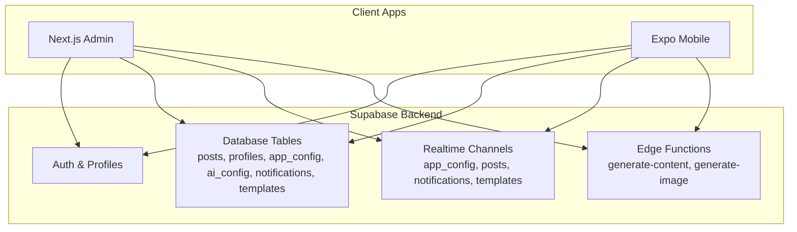
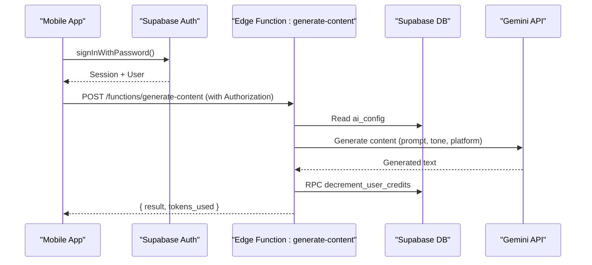
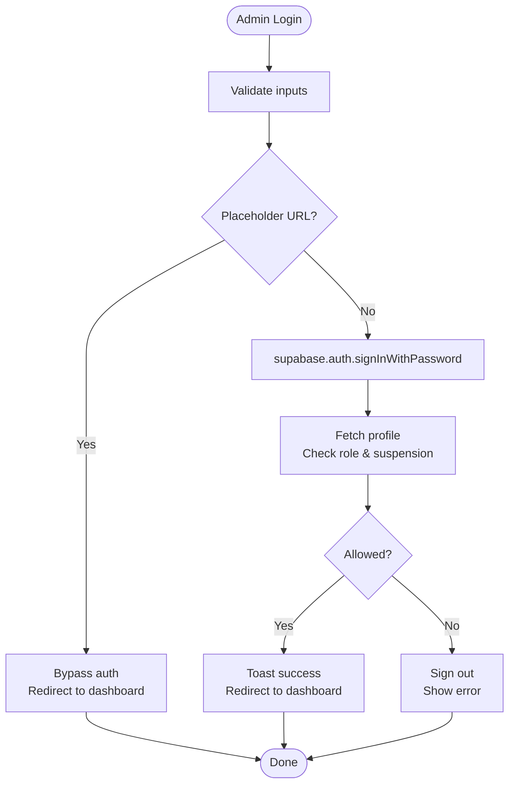
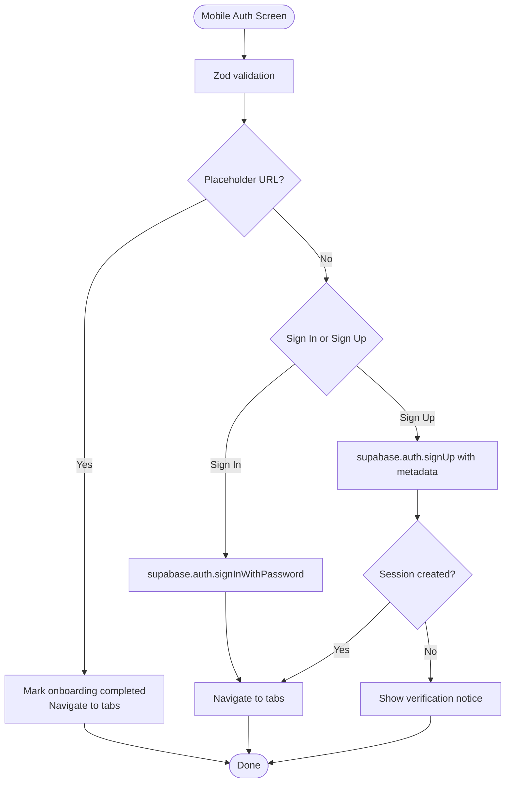
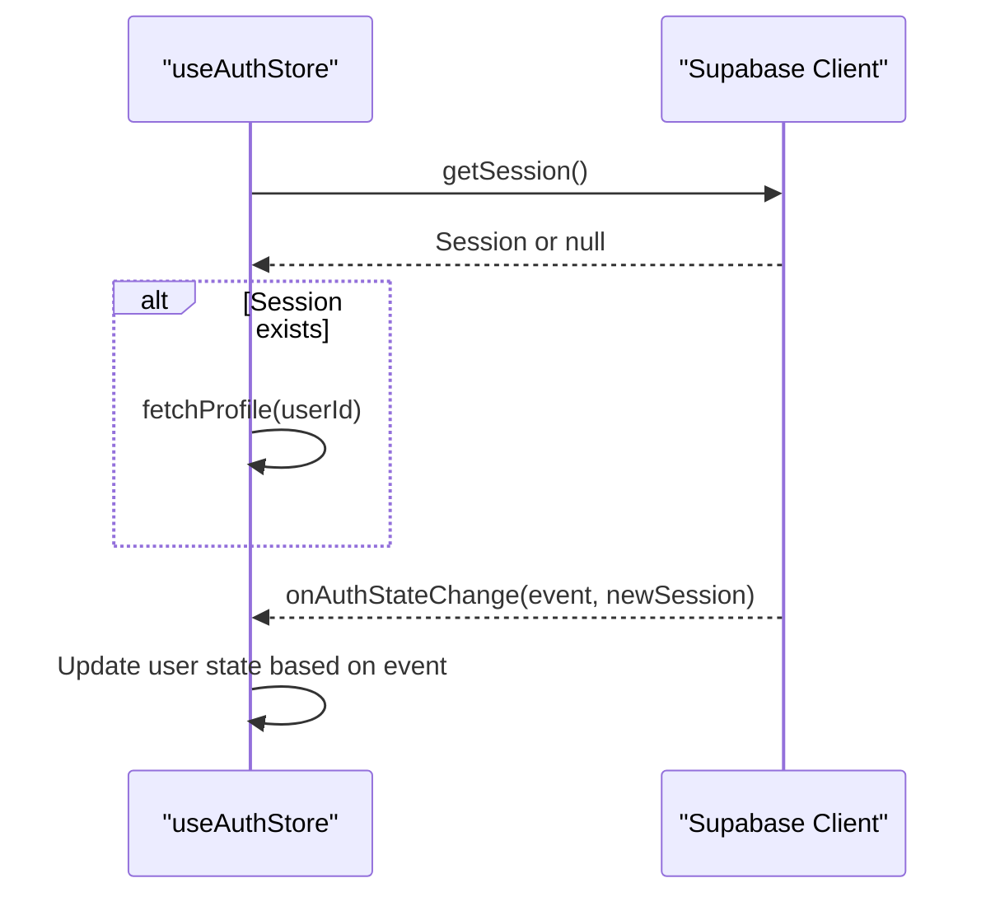
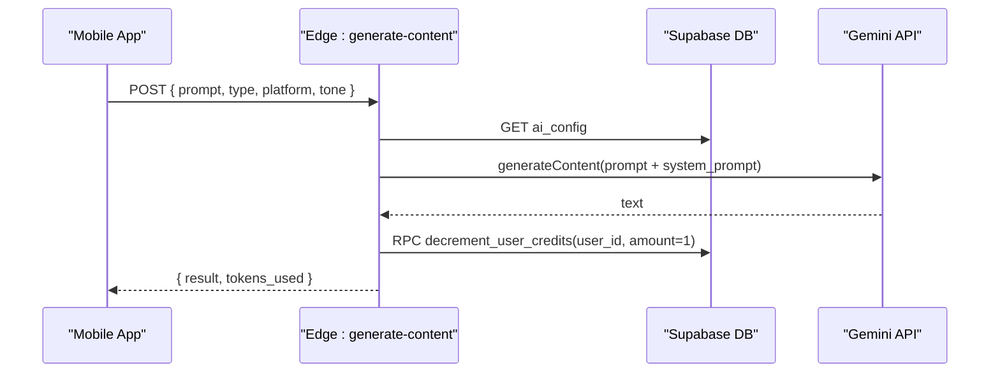
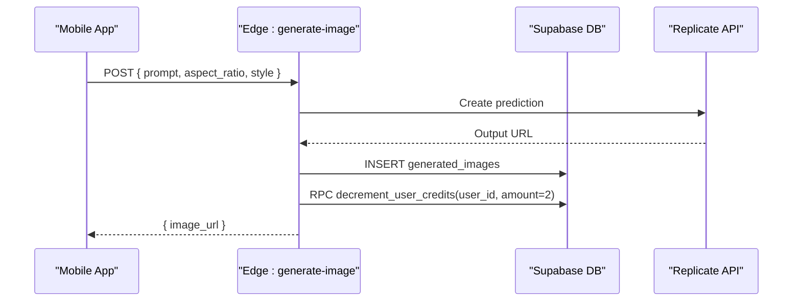
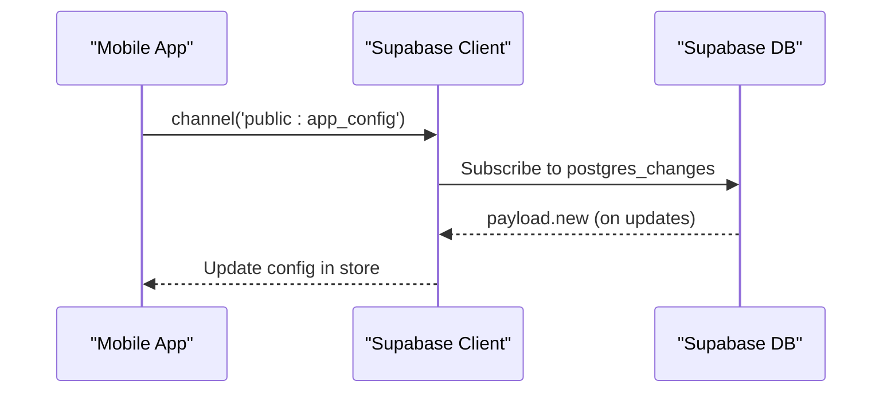
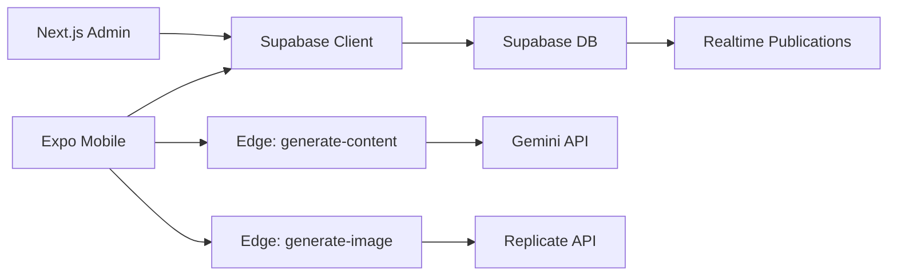

# Data Flow & Communication

<cite>
**Referenced Files in This Document**
- [supabase.ts (Admin)](file://apps/admin/src/lib/supabase.ts)
- [supabase.ts (Mobile)](file://apps/mobile/src/services/supabase.ts)
- [generate-content/index.ts](file://supabase/functions/generate-content/index.ts)
- [generate-image/index.ts](file://supabase/functions/generate-image/index.ts)
- [login/page.tsx (Admin)](file://apps/admin/src/app/(auth)/login/page.tsx)
- [login.tsx (Mobile)](file://apps/mobile/src/app/(auth)/login.tsx)
- [useAuthStore.ts](file://apps/mobile/src/store/useAuthStore.ts)
- [useConfigStore.ts](file://apps/mobile/src/store/useConfigStore.ts)
- [posts/page.tsx (Admin)](file://apps/admin/src/app/(dashboard)/posts/page.tsx)
- [generate.tsx (Mobile)](file://apps/mobile/src/app/(tabs)/generate.tsx)
- [initial_schema.sql](file://supabase/migrations/20240001000000_initial_schema.sql)
</cite>

## Table of Contents
1. Introduction
2. Project Structure
3. Core Components
4. Architecture Overview
5. Detailed Component Analysis
6. Dependency Analysis
7. Performance Considerations
8. Troubleshooting Guide
9. Conclusion

## Introduction
This document explains how data flows and communicates across the SocialPilot AI Pro ecosystem: Next.js admin dashboard, Expo mobile app, and Supabase backend services. It covers authentication, session management, REST API calls to Edge Functions for AI processing, real-time updates via Supabase Realtime, error handling patterns, retry strategies, and offline considerations. Concrete scenarios include content generation, user authentication, and real-time updates.

## Project Structure
The system is a monorepo with two client apps and a shared backend layer:
- Admin dashboard (Next.js): manages users, posts, templates, and settings; uses Supabase client for auth and data access.
- Mobile app (Expo): provides end-user features like login/signup, AI content/image generation, and profile management; uses Supabase client with secure storage for sessions.
- Supabase backend: database schema, Row Level Security policies, Realtime publications, and Edge Functions for AI processing.

**Diagram sources**
- [supabase.ts (Admin):1-14](file://apps/admin/src/lib/supabase.ts#L1-L14)
- [supabase.ts (Mobile):1-41](file://apps/mobile/src/services/supabase.ts#L1-L41)
- [generate-content/index.ts:1-99](file://supabase/functions/generate-content/index.ts#L1-L99)
- [generate-image/index.ts:1-87](file://supabase/functions/generate-image/index.ts#L1-L87)
- [initial_schema.sql:15-132](file://supabase/migrations/20240001000000_initial_schema.sql#L15-L132)
- [initial_schema.sql:227-231](file://supabase/migrations/20240001000000_initial_schema.sql#L227-L231)

**Section sources**
- [supabase.ts (Admin):1-14](file://apps/admin/src/lib/supabase.ts#L1-L14)
- [supabase.ts (Mobile):1-41](file://apps/mobile/src/services/supabase.ts#L1-L41)
- [initial_schema.sql:15-132](file://supabase/migrations/20240001000000_initial_schema.sql#L15-L132)
- [initial_schema.sql:227-231](file://supabase/migrations/20240001000000_initial_schema.sql#L227-L231)

## Core Components
- Supabase clients:
  - Admin: creates a client with session persistence and auto-refresh token enabled.
  - Mobile: creates a client with SecureStore-based persistence on native platforms and localStorage fallback on web; disables URL session detection.
- Authentication flows:
  - Admin login validates credentials, checks role and suspension status, then redirects to dashboard.
  - Mobile login/signup uses Supabase Auth, handles placeholder bypass for development, and navigates to tabs.
- State stores:
  - useAuthStore initializes auth state, fetches profile, listens to auth changes, and supports sign-out.
  - useConfigStore fetches app configuration and subscribes to realtime updates for app_config.
- Edge Functions:
  - generate-content: authenticates request, reads AI config, calls Gemini API (or returns mock), decrements credits, and returns result.
  - generate-image: authenticates request, calls Replicate (or returns default image), persists generated image, decrements credits, and returns URL.
- Realtime:
  - Database tables are included in Supabase Realtime publication for live updates.
  - Mobile subscribes to app_config changes via channels.

**Section sources**
- [supabase.ts (Admin):1-14](file://apps/admin/src/lib/supabase.ts#L1-L14)
- [supabase.ts (Mobile):1-41](file://apps/mobile/src/services/supabase.ts#L1-L41)
- [login/page.tsx (Admin):15-78](file://apps/admin/src/app/(auth)/login/page.tsx#L15-L78)
- [login.tsx (Mobile):76-142](file://apps/mobile/src/app/(auth)/login.tsx#L76-L142)
- [useAuthStore.ts:24-61](file://apps/mobile/src/store/useAuthStore.ts#L24-L61)
- [useConfigStore.ts:15-66](file://apps/mobile/src/store/useConfigStore.ts#L15-L66)
- [generate-content/index.ts:14-98](file://supabase/functions/generate-content/index.ts#L14-L98)
- [generate-image/index.ts:14-86](file://supabase/functions/generate-image/index.ts#L14-L86)
- [initial_schema.sql:227-231](file://supabase/migrations/20240001000000_initial_schema.sql#L227-L231)

## Architecture Overview
The architecture follows a client-server model with Supabase as the central backend:
- Clients authenticate via Supabase Auth and maintain sessions securely.
- Data operations use Supabase client methods against RLS-protected tables.
- AI processing is offloaded to Edge Functions that call external AI providers and update credit balances atomically.
- Realtime subscriptions enable live UI updates for configuration and other tables.

**Diagram sources**
- [login.tsx (Mobile):107-118](file://apps/mobile/src/app/(auth)/login.tsx#L107-L118)
- [generate-content/index.ts:14-98](file://supabase/functions/generate-content/index.ts#L14-L98)
- [initial_schema.sql:31-42](file://supabase/migrations/20240001000000_initial_schema.sql#L31-L42)

## Detailed Component Analysis

### Authentication Flow (Admin Dashboard)
- The admin login page collects email/password, optionally bypasses network calls in placeholder mode, signs in via Supabase, verifies role and suspension status, and navigates to the dashboard. Errors are surfaced via toast notifications.

**Diagram sources**
- [login/page.tsx (Admin):15-78](file://apps/admin/src/app/(auth)/login/page.tsx#L15-L78)

**Section sources**
- [login/page.tsx (Admin):15-78](file://apps/admin/src/app/(auth)/login/page.tsx#L15-L78)

### Authentication Flow (Mobile App)
- The mobile login screen supports sign-in and sign-up, validates input using Zod, handles placeholder bypass, and navigates to the main tabs. On sign-up, it sets user metadata including full name and role.

**Diagram sources**
- [login.tsx (Mobile):76-142](file://apps/mobile/src/app/(auth)/login.tsx#L76-L142)

**Section sources**
- [login.tsx (Mobile):76-142](file://apps/mobile/src/app/(auth)/login.tsx#L76-L142)

### Session Management
- Admin client enables session persistence and automatic token refresh.
- Mobile client uses SecureStore on native and localStorage on web for persistence, with auto-refresh token enabled and URL session detection disabled.
- useAuthStore initializes auth state, fetches profile when session exists, listens to auth state changes, and clears state on sign-out.

**Diagram sources**
- [supabase.ts (Admin):1-14](file://apps/admin/src/lib/supabase.ts#L1-L14)
- [supabase.ts (Mobile):1-41](file://apps/mobile/src/services/supabase.ts#L1-L41)
- [useAuthStore.ts:24-61](file://apps/mobile/src/store/useAuthStore.ts#L24-L61)

**Section sources**
- [supabase.ts (Admin):1-14](file://apps/admin/src/lib/supabase.ts#L1-L14)
- [supabase.ts (Mobile):1-41](file://apps/mobile/src/services/supabase.ts#L1-L41)
- [useAuthStore.ts:24-61](file://apps/mobile/src/store/useAuthStore.ts#L24-L61)

### Content Generation (Text)
- Mobile generates text by calling the generate-content Edge Function with prompt, type, platform, and tone. The function authenticates the request, reads AI configuration, calls Gemini API (or returns mock if keys missing), decrements credits via RPC, and returns the generated content.

**Diagram sources**
- [generate.tsx (Mobile):123-150](file://apps/mobile/src/app/(tabs)/generate.tsx#L123-L150)
- [generate-content/index.ts:14-98](file://supabase/functions/generate-content/index.ts#L14-L98)
- [initial_schema.sql:31-42](file://supabase/migrations/20240001000000_initial_schema.sql#L31-L42)

**Section sources**
- [generate.tsx (Mobile):123-150](file://apps/mobile/src/app/(tabs)/generate.tsx#L123-L150)
- [generate-content/index.ts:14-98](file://supabase/functions/generate-content/index.ts#L14-L98)

### Image Generation
- Mobile triggers image generation which calls the generate-image Edge Function. The function authenticates, calls Replicate (or returns a default image), persists the generated image record, decrements credits by 2, and returns the image URL.

**Diagram sources**
- [generate.tsx (Mobile):152-169](file://apps/mobile/src/app/(tabs)/generate.tsx#L152-L169)
- [generate-image/index.ts:14-86](file://supabase/functions/generate-image/index.ts#L14-L86)

**Section sources**
- [generate.tsx (Mobile):152-169](file://apps/mobile/src/app/(tabs)/generate.tsx#L152-L169)
- [generate-image/index.ts:14-86](file://supabase/functions/generate-image/index.ts#L14-L86)

### Real-Time Updates
- Supabase Realtime is enabled for key tables including app_config, posts, notifications, and templates.
- Mobile subscribes to app_config changes via a channel and updates local store when changes occur.
- Admin header indicates realtime connectivity status.

**Diagram sources**
- [useConfigStore.ts:39-66](file://apps/mobile/src/store/useConfigStore.ts#L39-L66)
- [initial_schema.sql:227-231](file://supabase/migrations/20240001000000_initial_schema.sql#L227-L231)

**Section sources**
- [useConfigStore.ts:39-66](file://apps/mobile/src/store/useConfigStore.ts#L39-L66)
- [initial_schema.sql:227-231](file://supabase/migrations/20240001000000_initial_schema.sql#L227-L231)

### Data Synchronization Strategies
- Initial load: Fetch latest data from Supabase tables (e.g., posts list).
- Realtime: Subscribe to table changes to keep UI current without polling.
- Optimistic updates: For actions like generating content, update local state immediately and reconcile with server responses.
- Placeholders: Development flows bypass network calls to avoid timeouts and provide instant feedback.

**Section sources**
- [posts/page.tsx (Admin):13-33](file://apps/admin/src/app/(dashboard)/posts/page.tsx#L13-L33)
- [useConfigStore.ts:15-66](file://apps/mobile/src/store/useConfigStore.ts#L15-L66)
- [generate.tsx (Mobile):123-169](file://apps/mobile/src/app/(tabs)/generate.tsx#L123-L169)

## Dependency Analysis
- Client dependencies:
  - Both apps depend on Supabase JS client for auth and data operations.
  - Mobile depends on expo-secure-store for secure session persistence.
- Backend dependencies:
  - Edge Functions depend on Deno runtime and Supabase client to interact with DB and RPCs.
  - External AI providers (Gemini, Replicate) are called conditionally based on environment secrets.
- Realtime dependencies:
  - Supabase Realtime publications include tables for live updates.

**Diagram sources**
- [supabase.ts (Admin):1-14](file://apps/admin/src/lib/supabase.ts#L1-L14)
- [supabase.ts (Mobile):1-41](file://apps/mobile/src/services/supabase.ts#L1-L41)
- [generate-content/index.ts:1-99](file://supabase/functions/generate-content/index.ts#L1-L99)
- [generate-image/index.ts:1-87](file://supabase/functions/generate-image/index.ts#L1-L87)
- [initial_schema.sql:227-231](file://supabase/migrations/20240001000000_initial_schema.sql#L227-L231)

**Section sources**
- [supabase.ts (Admin):1-14](file://apps/admin/src/lib/supabase.ts#L1-L14)
- [supabase.ts (Mobile):1-41](file://apps/mobile/src/services/supabase.ts#L1-L41)
- [generate-content/index.ts:1-99](file://supabase/functions/generate-content/index.ts#L1-L99)
- [generate-image/index.ts:1-87](file://supabase/functions/generate-image/index.ts#L1-L87)
- [initial_schema.sql:227-231](file://supabase/migrations/20240001000000_initial_schema.sql#L227-L231)

## Performance Considerations
- Avoid unnecessary network calls in development by using placeholder URLs to bypass DNS timeouts and enable instant feedback.
- Use Realtime subscriptions instead of polling to reduce bandwidth and improve responsiveness.
- Batch updates where possible (e.g., updating profile credits after generation).
- Cache configuration locally and refresh only on changes via Realtime.

[No sources needed since this section provides general guidance]

## Troubleshooting Guide
- Authentication errors:
  - Admin login shows toast messages for invalid credentials or insufficient permissions.
  - Mobile login/signup surfaces Supabase error messages and guides users through verification when required.
- Network issues:
  - Placeholder mode prevents long DNS timeouts during development.
  - Error boundaries in stores catch exceptions and reset loading states gracefully.
- AI processing failures:
  - Edge Functions return structured error responses; clients should display user-friendly messages.
  - Credit deduction occurs only after successful generation to prevent imbalance.
- Realtime connection:
  - Subscriptions skip WebSocket attempts on placeholder URLs to avoid connection errors.

**Section sources**
- [login/page.tsx (Admin):15-78](file://apps/admin/src/app/(auth)/login/page.tsx#L15-L78)
- [login.tsx (Mobile):76-142](file://apps/mobile/src/app/(auth)/login.tsx#L76-L142)
- [generate-content/index.ts:14-98](file://supabase/functions/generate-content/index.ts#L14-L98)
- [generate-image/index.ts:14-86](file://supabase/functions/generate-image/index.ts#L14-L86)
- [useConfigStore.ts:39-66](file://apps/mobile/src/store/useConfigStore.ts#L39-L66)

## Conclusion
SocialPilot AI Pro integrates Next.js and Expo clients with Supabase for robust authentication, secure session management, and scalable data operations. Edge Functions encapsulate AI processing logic, ensuring consistent behavior and credit accounting. Realtime subscriptions provide live updates for critical data, while placeholder modes streamline development. The design emphasizes reliability, security, and performance, with clear error handling and graceful degradation paths.

[No sources needed since this section summarizes without analyzing specific files]