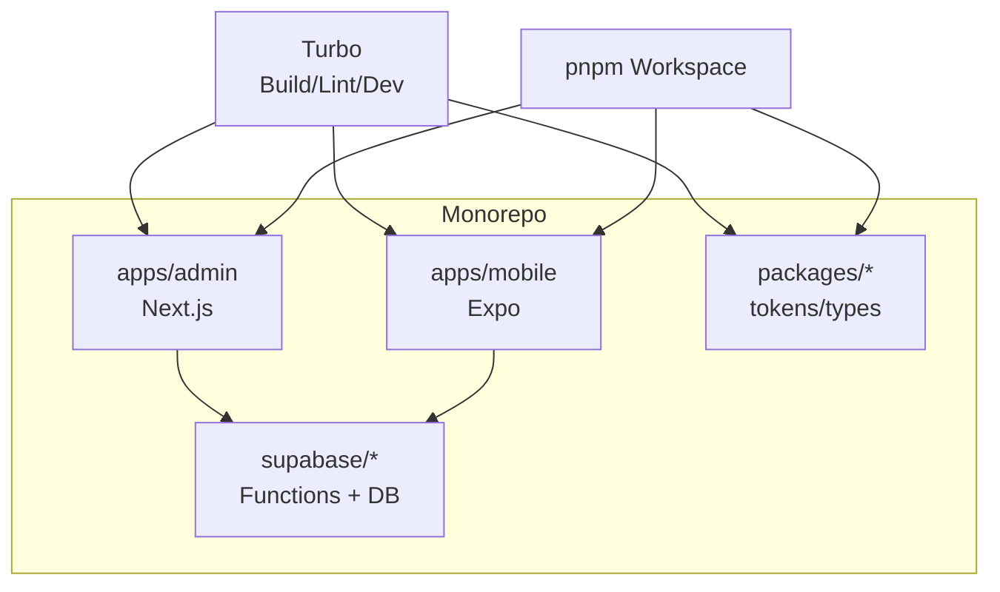
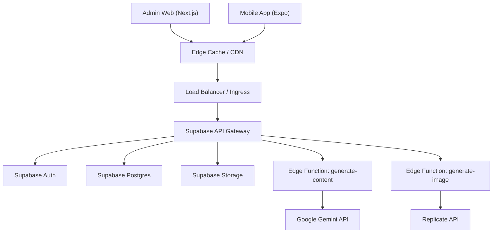
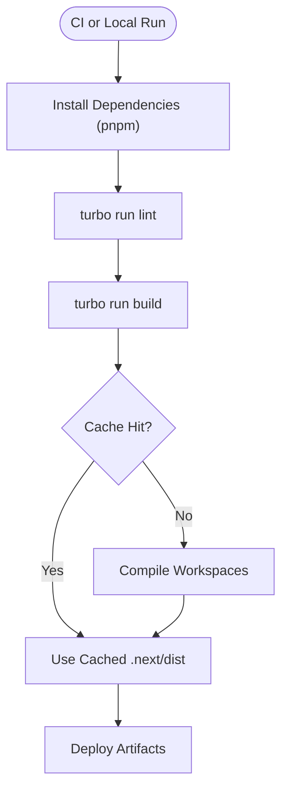
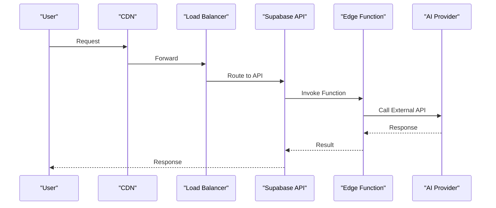
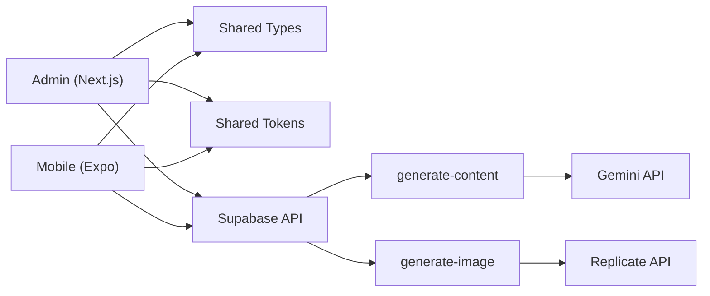

# Deployment Topology & Infrastructure

<cite>
**Referenced Files in This Document**
- [package.json](file://package.json)
- [turbo.json](file://turbo.json)
- [pnpm-workspace.yaml](file://pnpm-workspace.yaml)
- [apps/admin/package.json](file://apps/admin/package.json)
- [apps/admin/next.config.js](file://apps/admin/next.config.js)
- [apps/mobile/package.json](file://apps/mobile/package.json)
- [apps/mobile/app.config.ts](file://apps/mobile/app.config.ts)
- [supabase/functions/generate-content/index.ts](file://supabase/functions/generate-content/index.ts)
- [supabase/functions/generate-image/index.ts](file://supabase/functions/generate-image/index.ts)
- [supabase/config.toml](file://supabase/config.toml)
- [INSTALLATION.md](file://INSTALLATION.md)
</cite>

## Table of Contents
1. Introduction
2. Project Structure
3. Core Components
4. Architecture Overview
5. Detailed Component Analysis
6. Dependency Analysis
7. Performance Considerations
8. Troubleshooting Guide
9. Conclusion

## Introduction
This document describes the deployment topology and infrastructure for SocialPilot AI Pro across local development, staging, and production environments. It covers the build pipeline using Turborepo, containerization strategies, CI/CD workflows, environment configuration and secrets management, scaling considerations, network topology, load balancing, monitoring, backup and disaster recovery, security considerations, and performance optimization at scale. The guidance is grounded in the repository’s monorepo structure, Next.js admin app, Expo mobile app, and Supabase Edge Functions that integrate with external AI services.

## Project Structure
SocialPilot AI Pro is a pnpm workspace monorepo managed by Turborepo:
- apps/admin: Next.js web application (admin panel).
- apps/mobile: Expo-based mobile application.
- packages: Shared tokens and types consumed by apps.
- supabase: Database migrations, seed data, and Edge Functions for AI content and image generation.

Turborepo orchestrates builds, linting, and dev tasks across workspaces. The root package.json defines scripts to run Turbo commands and exposes an admin dev script. Turbo config declares outputs for caching and task dependencies.

**Diagram sources**
- [package.json:1-21](file://package.json#L1-L21)
- [turbo.json:1-26](file://turbo.json#L1-L26)
- [pnpm-workspace.yaml:1-4](file://pnpm-workspace.yaml#L1-L4)

**Section sources**
- [package.json:1-21](file://package.json#L1-L21)
- [turbo.json:1-26](file://turbo.json#L1-L26)
- [pnpm-workspace.yaml:1-4](file://pnpm-workspace.yaml#L1-L4)

## Core Components
- Admin Web App (Next.js): Serves the admin UI; built via Next.js and integrated with Supabase client libraries.
- Mobile App (Expo): Cross-platform mobile app consuming Supabase APIs and runtime configuration.
- Supabase Backend: Hosts database, authentication, storage, and Edge Functions for AI content/image generation.
- Build Orchestration: Turborepo coordinates multi-app builds and caches artifacts.

Key responsibilities:
- Admin app: User-facing admin dashboard, integrates with Supabase Auth and RLS policies.
- Mobile app: End-user experience, uses Expo config for app metadata and platform settings.
- Supabase functions: Serverless endpoints for AI features with secure credential handling via environment variables.

**Section sources**
- [apps/admin/package.json:1-41](file://apps/admin/package.json#L1-L41)
- [apps/mobile/package.json:1-53](file://apps/mobile/package.json#L1-L53)
- [supabase/functions/generate-content/index.ts:1-99](file://supabase/functions/generate-content/index.ts#L1-L99)
- [supabase/functions/generate-image/index.ts:1-87](file://supabase/functions/generate-image/index.ts#L1-L87)

## Architecture Overview
High-level architecture shows clients interacting with Supabase services and AI providers through Edge Functions.

**Diagram sources**
- [apps/admin/next.config.js:1-8](file://apps/admin/next.config.js#L1-L8)
- [apps/mobile/app.config.ts:1-42](file://apps/mobile/app.config.ts#L1-L42)
- [supabase/functions/generate-content/index.ts:1-99](file://supabase/functions/generate-content/index.ts#L1-L99)
- [supabase/functions/generate-image/index.ts:1-87](file://supabase/functions/generate-image/index.ts#L1-L87)

## Detailed Component Analysis

### Build Pipeline with Turborepo
- Root scripts invoke Turbo to run build, dev, lint, and clean across workspaces.
- Turbo pipeline defines outputs (.next, dist) and depends on upstream builds for cache hits.
- Dev tasks are persistent and uncached to support live reload.

**Diagram sources**
- [package.json:1-21](file://package.json#L1-L21)
- [turbo.json:1-26](file://turbo.json#L1-L26)

**Section sources**
- [package.json:1-21](file://package.json#L1-L21)
- [turbo.json:1-26](file://turbo.json#L1-L26)

### Containerization Strategy
- Admin (Next.js): Build produces static assets and server bundle under .next. Container images should include Node runtime, install dependencies, run turbo build, and serve via next start. Use multi-stage builds to minimize image size.
- Mobile (Expo): Build artifacts are native binaries (APK/IPA) or OTA updates. For web preview, containerize similar to admin. For native builds, use hosted builders (Expo Application Services) or self-hosted macOS runners.
- Supabase: Managed service; no custom containers required.

Recommended practices:
- Pin Node version matching prerequisites.
- Cache node_modules and Turbo cache volumes in CI.
- Use non-root users in containers and minimal base images.

[No sources needed since this section provides general guidance]

### CI/CD Workflows
Suggested workflow stages:
- Checkout code and setup pnpm.
- Restore dependency and Turbo caches.
- Lint and type-check across workspaces.
- Build all apps via Turbo.
- Test (if present) and artifact upload.
- Deploy admin to hosting (e.g., Vercel/Netlify/AWS Amplify).
- Publish mobile artifacts via Expo/EAS or store pipelines.
- Promote Supabase project changes via migrations and function deployments.

Environment promotion:
- Maintain separate Supabase projects per environment (dev/staging/prod).
- Use environment-specific env files and secrets per stage.
- Tag builds with semantic versions and Git SHA.

[No sources needed since this section provides general guidance]

### Environment Configuration Management
- Admin (Next.js): Uses NEXT_PUBLIC_* variables for client-side access. Configure Supabase URL and anon key per environment.
- Mobile (Expo): Uses EXPO_PUBLIC_* variables for runtime configuration. App name and identifiers can be overridden via environment variables.
- Supabase Edge Functions: Read secrets from Deno.env (e.g., SUPABASE_URL, SUPABASE_ANON_KEY, GEMINI_API_KEY, REPLICATE_API_TOKEN).

Best practices:
- Never commit secrets; use CI/CD secret stores.
- Validate required variables at startup where possible.
- Separate public vs private keys carefully; only expose necessary values to clients.

**Section sources**
- [apps/admin/package.json:1-41](file://apps/admin/package.json#L1-L41)
- [apps/mobile/app.config.ts:1-42](file://apps/mobile/app.config.ts#L1-L42)
- [supabase/functions/generate-content/index.ts:1-99](file://supabase/functions/generate-content/index.ts#L1-L99)
- [supabase/functions/generate-image/index.ts:1-87](file://supabase/functions/generate-image/index.ts#L1-L87)
- [INSTALLATION.md:33-46](file://INSTALLATION.md#L33-L46)

### Secrets Handling
- Supabase Edge Functions read secrets from environment variables provided by Supabase platform.
- External AI providers require API tokens configured as secrets in Supabase project settings.
- Avoid logging sensitive data; sanitize error responses.

Operational steps:
- Store secrets in CI/CD vaults and inject into deployment targets.
- Rotate keys regularly and audit usage.
- Restrict function permissions via Supabase RLS and auth checks.

**Section sources**
- [supabase/functions/generate-content/index.ts:1-99](file://supabase/functions/generate-content/index.ts#L1-L99)
- [supabase/functions/generate-image/index.ts:1-87](file://supabase/functions/generate-image/index.ts#L1-L87)

### Scaling Considerations
- Admin (Next.js): Scale horizontally behind a CDN and load balancer; leverage edge caching for static assets.
- Mobile: Distribute OTA updates; scale backend via Supabase managed services.
- Supabase Functions: Auto-scaled serverless; monitor concurrency limits and cold starts.
- Database: Use connection pooling and query optimization; consider read replicas if heavy analytics.

[No sources needed since this section provides general guidance]

### Network Topology and Load Balancing
- Clients connect via HTTPS through CDN to reduce latency and offload traffic.
- Ingress/load balancer routes requests to Supabase API gateway.
- Edge Functions execute close to users; external AI calls go over internet with retries and timeouts.

**Diagram sources**
- [apps/admin/next.config.js:1-8](file://apps/admin/next.config.js#L1-L8)
- [apps/mobile/app.config.ts:1-42](file://apps/mobile/app.config.ts#L1-L42)
- [supabase/functions/generate-content/index.ts:1-99](file://supabase/functions/generate-content/index.ts#L1-L99)
- [supabase/functions/generate-image/index.ts:1-87](file://supabase/functions/generate-image/index.ts#L1-L87)

### Monitoring Setup
- Application metrics: Capture request latency, error rates, and throughput for admin and mobile sessions.
- Edge Functions: Monitor invocation counts, durations, and errors via Supabase logs.
- External APIs: Track success/failure and latency for AI providers; implement circuit breakers and fallbacks.
- Observability: Centralize logs, set up alerts for anomalies, and define SLOs.

[No sources needed since this section provides general guidance]

### Backup and Disaster Recovery
- Database backups: Enable automated backups and point-in-time recovery in Supabase.
- Migrations and seed: Version-controlled SQL in supabase/migrations and seed.sql; apply consistently across environments.
- Config and secrets: Back up environment configurations and rotate secrets securely.
- DR plan: Define RTO/RPO, test failover procedures, and maintain runbooks.

**Section sources**
- [supabase/config.toml:1-2](file://supabase/config.toml#L1-L2)

### Security Considerations
- Authentication: Enforce Supabase Auth for both admin and mobile; validate user context in Edge Functions.
- Authorization: Use Row-Level Security (RLS) policies to restrict data access.
- Secrets: Keep API keys out of client bundles; use server-side functions to call external APIs.
- Input validation: Validate payloads before calling external AI services to prevent abuse.
- Transport: Enforce HTTPS everywhere; configure CORS appropriately.

**Section sources**
- [supabase/functions/generate-content/index.ts:1-99](file://supabase/functions/generate-content/index.ts#L1-L99)
- [supabase/functions/generate-image/index.ts:1-87](file://supabase/functions/generate-image/index.ts#L1-L87)

### Performance Optimization at Scale
- Caching: Leverage CDN for static assets; cache API responses where appropriate.
- Build optimization: Use Turbo caching, transpile shared packages, and tree-shake dependencies.
- Database: Optimize queries, add indexes, and use connection pooling.
- Edge Functions: Minimize payload sizes, batch operations, and handle retries gracefully.

[No sources needed since this section provides general guidance]

## Dependency Analysis
The monorepo ties together multiple components with clear boundaries:
- Apps depend on shared packages for tokens and types.
- Apps communicate with Supabase services and Edge Functions.
- Edge Functions depend on Supabase client and external AI APIs.

**Diagram sources**
- [apps/admin/package.json:1-41](file://apps/admin/package.json#L1-L41)
- [apps/mobile/package.json:1-53](file://apps/mobile/package.json#L1-L53)
- [supabase/functions/generate-content/index.ts:1-99](file://supabase/functions/generate-content/index.ts#L1-L99)
- [supabase/functions/generate-image/index.ts:1-87](file://supabase/functions/generate-image/index.ts#L1-L87)

**Section sources**
- [apps/admin/package.json:1-41](file://apps/admin/package.json#L1-L41)
- [apps/mobile/package.json:1-53](file://apps/mobile/package.json#L1-L53)
- [supabase/functions/generate-content/index.ts:1-99](file://supabase/functions/generate-content/index.ts#L1-L99)
- [supabase/functions/generate-image/index.ts:1-87](file://supabase/functions/generate-image/index.ts#L1-L87)

## Performance Considerations
- Use Turborepo caching to speed up builds and reduce CI time.
- Serve Next.js assets via CDN; enable compression and HTTP/2.
- Optimize mobile app bundle size; defer non-critical assets.
- Tune Supabase function concurrency and timeouts; implement retry logic for external calls.
- Monitor database performance; analyze slow queries and add indexes.

[No sources needed since this section provides general guidance]

## Troubleshooting Guide
Common issues and resolutions:
- Missing environment variables: Ensure NEXT_PUBLIC_SUPABASE_URL and NEXT_PUBLIC_SUPABASE_ANON_KEY are set for admin; EXPO_PUBLIC_* for mobile.
- Unauthorized errors in Edge Functions: Verify Authorization header propagation and Supabase Auth configuration.
- External API failures: Check API keys and quotas for Gemini and Replicate; implement fallbacks and graceful degradation.
- Build failures: Confirm Node version compatibility and pnpm workspace resolution; clear caches when necessary.

**Section sources**
- [INSTALLATION.md:33-46](file://INSTALLATION.md#L33-L46)
- [supabase/functions/generate-content/index.ts:1-99](file://supabase/functions/generate-content/index.ts#L1-L99)
- [supabase/functions/generate-image/index.ts:1-87](file://supabase/functions/generate-image/index.ts#L1-L87)

## Conclusion
SocialPilot AI Pro’s deployment topology centers around a monorepo with Turborepo orchestration, a Next.js admin app, an Expo mobile app, and Supabase-backed serverless functions integrating external AI services. By following the recommended CI/CD, environment and secrets management, scaling, networking, monitoring, backup, security, and performance practices outlined here, teams can reliably deploy and operate the system across local, staging, and production environments while maintaining high availability and strong security posture.