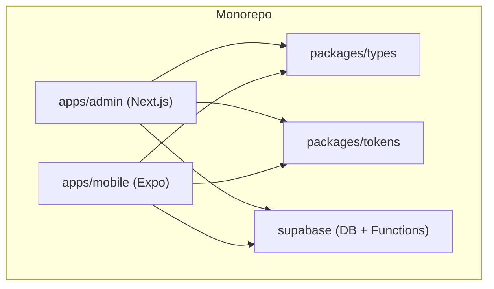
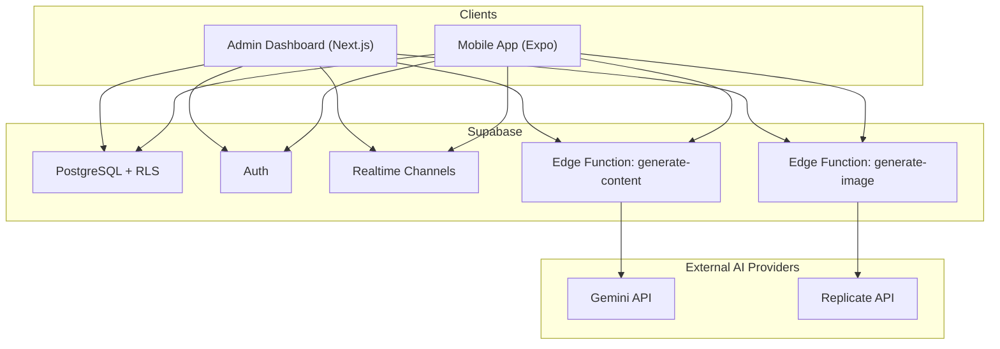
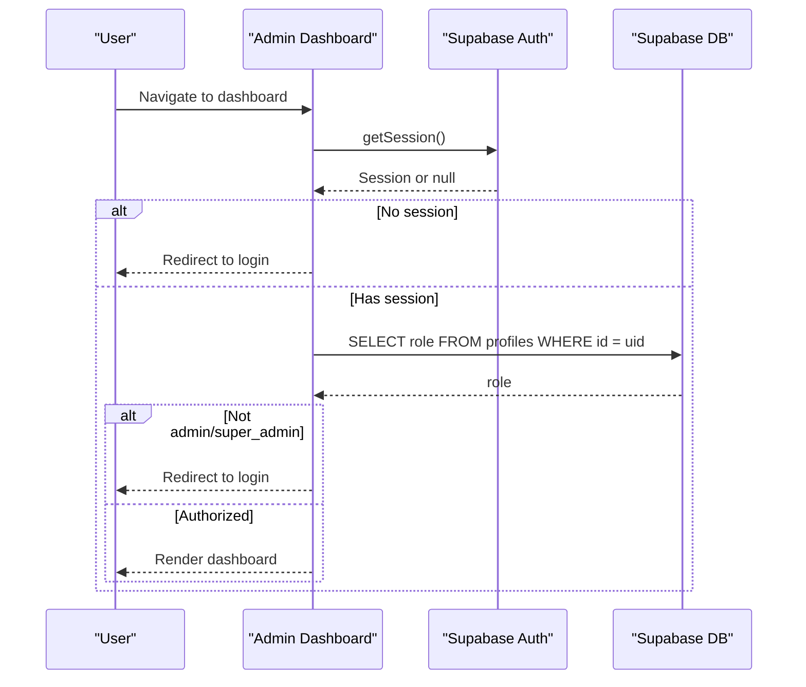
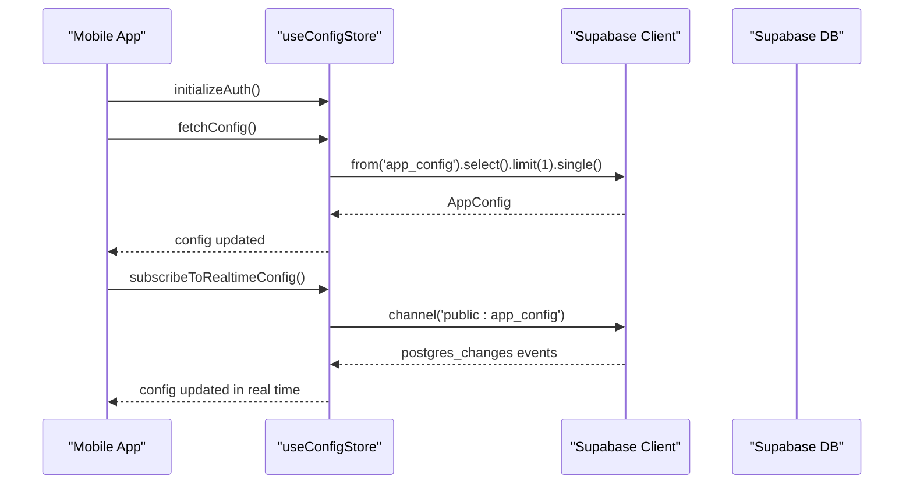
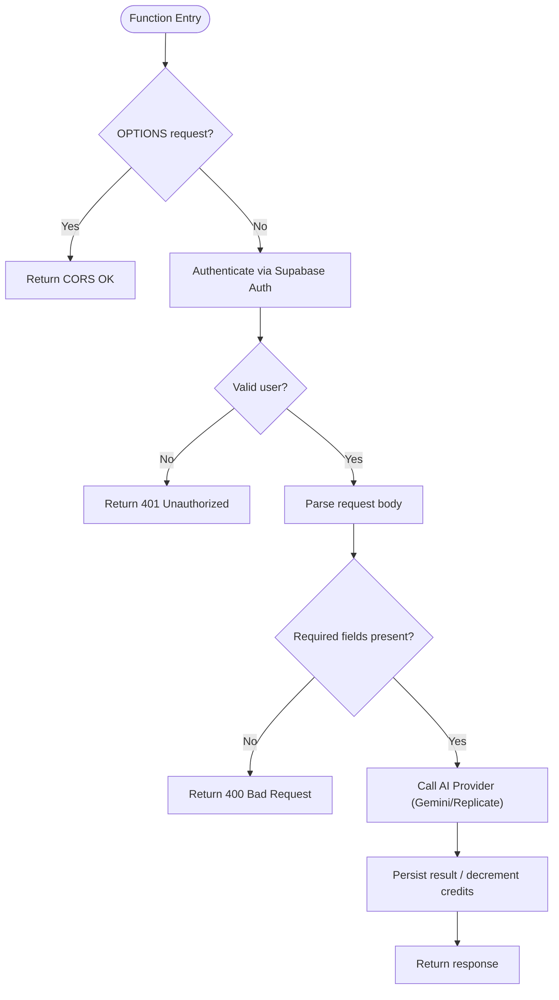
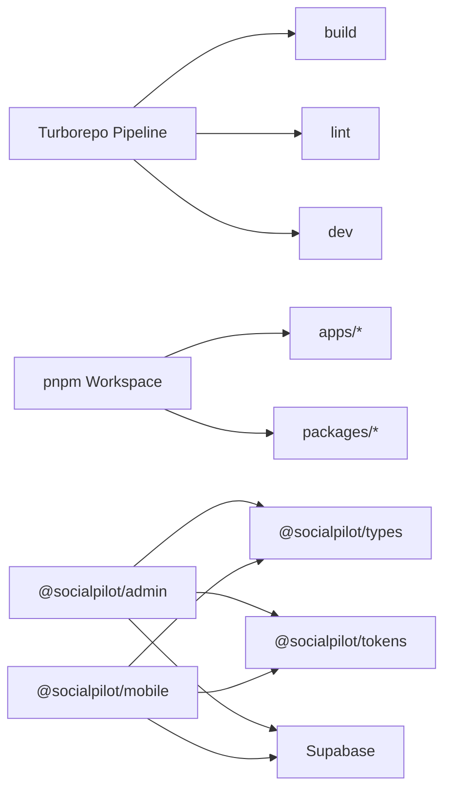

# System Architecture

<cite>
**Referenced Files in This Document**
- [package.json](file://package.json)
- [turbo.json](file://turbo.json)
- [pnpm-workspace.yaml](file://pnpm-workspace.yaml)
- [README.md](file://README.md)
- [apps/admin/package.json](file://apps/admin/package.json)
- [apps/mobile/package.json](file://apps/mobile/package.json)
- [apps/admin/src/lib/supabase.ts](file://apps/admin/src/lib/supabase.ts)
- [apps/admin/src/app/(dashboard)/layout.tsx](file://apps/admin/src/app/(dashboard)/layout.tsx)
- [apps/mobile/src/services/supabase.ts](file://apps/mobile/src/services/supabase.ts)
- [apps/mobile/src/app/_layout.tsx](file://apps/mobile/src/app/_layout.tsx)
- [apps/mobile/src/store/useConfigStore.ts](file://apps/mobile/src/store/useConfigStore.ts)
- [supabase/functions/generate-content/index.ts](file://supabase/functions/generate-content/index.ts)
- [supabase/functions/generate-image/index.ts](file://supabase/functions/generate-image/index.ts)
- [supabase/migrations/20240001000000_initial_schema.sql](file://supabase/migrations/20240001000000_initial_schema.sql)
- [packages/types/package.json](file://packages/types/package.json)
- [packages/tokens/package.json](file://packages/tokens/package.json)
</cite>

## Table of Contents
1. Introduction
2. Project Structure
3. Core Components
4. Architecture Overview
5. Detailed Component Analysis
6. Dependency Analysis
7. Performance Considerations
8. Troubleshooting Guide
9. Conclusion

## Introduction
SocialPilot AI Pro is an AI-powered social media management suite implemented as a monorepo with Turborepo orchestration. It includes:
- A Next.js admin dashboard for administration and analytics
- An Expo mobile app for on-the-go content creation and scheduling
- Supabase backend services (database, authentication, edge functions, real-time subscriptions)

The system uses a service-oriented architecture with clear separation between client applications and backend services, shared types and tokens across apps, and real-time data synchronization via Supabase Realtime.

## Project Structure
The repository is organized as a pnpm workspace with Turborepo managing build tasks across multiple packages and apps:
- apps/admin: Next.js admin dashboard
- apps/mobile: Expo-based mobile application
- packages/types: Shared TypeScript type definitions consumed by both apps
- packages/tokens: Shared design tokens consumed by both apps
- supabase: Database migrations, edge functions, and configuration

**Diagram sources**
- [package.json:1-21](file://package.json#L1-L21)
- [turbo.json:1-26](file://turbo.json#L1-L26)
- [pnpm-workspace.yaml:1-4](file://pnpm-workspace.yaml#L1-L4)
- [apps/admin/package.json:1-41](file://apps/admin/package.json#L1-L41)
- [apps/mobile/package.json:1-53](file://apps/mobile/package.json#L1-L53)
- [packages/types/package.json:1-9](file://packages/types/package.json#L1-L9)
- [packages/tokens/package.json:1-9](file://packages/tokens/package.json#L1-L9)

**Section sources**
- [package.json:1-21](file://package.json#L1-L21)
- [turbo.json:1-26](file://turbo.json#L1-L26)
- [pnpm-workspace.yaml:1-4](file://pnpm-workspace.yaml#L1-L4)
- [README.md:1-4](file://README.md#L1-L4)

## Core Components
- Admin Dashboard (Next.js): Provides role-based access control, dashboard layout, and integration with Supabase for data and auth.
- Mobile App (Expo): Cross-platform mobile experience with secure session storage, theme provider, query client, and real-time config updates.
- Supabase Backend:
  - Database schema with RLS policies and realtime-enabled tables
  - Edge functions for AI content and image generation
  - Authentication and user profile lifecycle triggers

Key technology choices:
- Next.js for server-rendered admin UI with routing and API patterns
- Expo Router for mobile navigation and cross-platform runtime
- Supabase for DB, Auth, Storage, Edge Functions, and Realtime
- TanStack Query for caching and background updates
- Zustand for lightweight client state management
- Zod for runtime validation
- Tailwind CSS for styling consistency

**Section sources**
- [apps/admin/package.json:1-41](file://apps/admin/package.json#L1-L41)
- [apps/mobile/package.json:1-53](file://apps/mobile/package.json#L1-L53)
- [apps/admin/src/lib/supabase.ts:1-14](file://apps/admin/src/lib/supabase.ts#L1-L14)
- [apps/mobile/src/services/supabase.ts:1-41](file://apps/mobile/src/services/supabase.ts#L1-L41)
- [supabase/migrations/20240001000000_initial_schema.sql:1-232](file://supabase/migrations/20240001000000_initial_schema.sql#L1-L232)

## Architecture Overview
The system follows a service-oriented architecture:
- Client apps communicate with Supabase via REST and Realtime channels
- Supabase Edge Functions encapsulate sensitive AI provider calls and enforce RLS
- Shared packages provide consistent types and tokens across clients

**Diagram sources**
- [apps/admin/src/lib/supabase.ts:1-14](file://apps/admin/src/lib/supabase.ts#L1-L14)
- [apps/mobile/src/services/supabase.ts:1-41](file://apps/mobile/src/services/supabase.ts#L1-L41)
- [supabase/functions/generate-content/index.ts:1-99](file://supabase/functions/generate-content/index.ts#L1-L99)
- [supabase/functions/generate-image/index.ts:1-87](file://supabase/functions/generate-image/index.ts#L1-L87)
- [supabase/migrations/20240001000000_initial_schema.sql:155-203](file://supabase/migrations/20240001000000_initial_schema.sql#L155-L203)

## Detailed Component Analysis

### Admin Dashboard (Next.js)
- Role-based access control: The dashboard layout checks the authenticated session and verifies admin roles before rendering protected routes.
- Supabase client: Configured with session persistence and token refresh to ensure stable connectivity.
- UI composition: Layout composes sidebar, header, and main content areas; pages are organized under route groups.

**Diagram sources**
- [apps/admin/src/app/(dashboard)/layout.tsx:17-46](file://apps/admin/src/app/(dashboard)/layout.tsx#L17-L46)
- [apps/admin/src/lib/supabase.ts:1-14](file://apps/admin/src/lib/supabase.ts#L1-L14)
- [supabase/migrations/20240001000000_initial_schema.sql:44-69](file://supabase/migrations/20240001000000_initial_schema.sql#L44-L69)

**Section sources**
- [apps/admin/src/app/(dashboard)/layout.tsx:1-71](file://apps/admin/src/app/(dashboard)/layout.tsx#L1-L71)
- [apps/admin/src/lib/supabase.ts:1-14](file://apps/admin/src/lib/supabase.ts#L1-L14)
- [apps/admin/package.json:1-41](file://apps/admin/package.json#L1-L41)

### Mobile App (Expo)
- Root layout initializes authentication, fetches app configuration, and subscribes to realtime updates for dynamic settings.
- Secure session storage: Uses platform-aware storage adapter to persist sessions securely on native platforms and localStorage on web.
- State and queries: Uses Zustand for store state and TanStack Query for caching and background refetching.

**Diagram sources**
- [apps/mobile/src/app/_layout.tsx:57-89](file://apps/mobile/src/app/_layout.tsx#L57-L89)
- [apps/mobile/src/store/useConfigStore.ts:12-66](file://apps/mobile/src/store/useConfigStore.ts#L12-L66)
- [apps/mobile/src/services/supabase.ts:1-41](file://apps/mobile/src/services/supabase.ts#L1-L41)

**Section sources**
- [apps/mobile/src/app/_layout.tsx:1-98](file://apps/mobile/src/app/_layout.tsx#L1-L98)
- [apps/mobile/src/store/useConfigStore.ts:1-66](file://apps/mobile/src/store/useConfigStore.ts#L1-L66)
- [apps/mobile/src/services/supabase.ts:1-41](file://apps/mobile/src/services/supabase.ts#L1-L41)
- [apps/mobile/package.json:1-53](file://apps/mobile/package.json#L1-L53)

### Supabase Backend Services
- Database schema: Defines core entities such as profiles, posts, templates, generated images, analytics, notifications, and admin logs. Includes enums, constraints, and indexes where applicable.
- Row-Level Security (RLS): Policies restrict access per user and role, ensuring data isolation and admin-only operations.
- Realtime: Selected tables are published for realtime subscriptions, enabling live updates in clients.
- Edge Functions:
  - generate-content: Authenticates users, reads AI configuration, calls external AI APIs, decrements credits, and returns generated text.
  - generate-image: Authenticates users, generates images via external providers, persists results, and decrements credits.

**Diagram sources**
- [supabase/functions/generate-content/index.ts:1-99](file://supabase/functions/generate-content/index.ts#L1-L99)
- [supabase/functions/generate-image/index.ts:1-87](file://supabase/functions/generate-image/index.ts#L1-L87)

**Section sources**
- [supabase/migrations/20240001000000_initial_schema.sql:1-232](file://supabase/migrations/20240001000000_initial_schema.sql#L1-L232)
- [supabase/functions/generate-content/index.ts:1-99](file://supabase/functions/generate-content/index.ts#L1-L99)
- [supabase/functions/generate-image/index.ts:1-87](file://supabase/functions/generate-image/index.ts#L1-L87)

## Dependency Analysis
Turborepo orchestrates builds and dev tasks across the monorepo, while pnpm workspaces manage shared dependencies and package linking. Both client apps depend on shared packages for types and tokens, and both connect to Supabase for data and services.

**Diagram sources**
- [turbo.json:1-26](file://turbo.json#L1-L26)
- [pnpm-workspace.yaml:1-4](file://pnpm-workspace.yaml#L1-L4)
- [apps/admin/package.json:1-41](file://apps/admin/package.json#L1-L41)
- [apps/mobile/package.json:1-53](file://apps/mobile/package.json#L1-L53)
- [packages/types/package.json:1-9](file://packages/types/package.json#L1-L9)
- [packages/tokens/package.json:1-9](file://packages/tokens/package.json#L1-L9)

**Section sources**
- [turbo.json:1-26](file://turbo.json#L1-L26)
- [pnpm-workspace.yaml:1-4](file://pnpm-workspace.yaml#L1-L4)
- [apps/admin/package.json:1-41](file://apps/admin/package.json#L1-L41)
- [apps/mobile/package.json:1-53](file://apps/mobile/package.json#L1-L53)

## Performance Considerations
- Build performance: Turborepo caches outputs and parallelizes tasks across apps and packages to speed up CI and local development.
- Data fetching: TanStack Query reduces network requests through caching and background refetch strategies.
- Realtime efficiency: Subscribe only to necessary channels and tables to minimize WebSocket overhead.
- Edge Functions: Offload AI provider calls to serverless functions to keep client payloads small and protect API keys.
- Storage: Use secure storage on mobile for sessions and avoid unnecessary re-renders by leveraging Zustand selectors.

[No sources needed since this section provides general guidance]

## Troubleshooting Guide
Common issues and resolutions:
- Placeholder environment: When using placeholder URLs for Supabase, clients bypass network calls and realtime subscriptions to avoid timeouts during local development.
- Authentication failures: Ensure proper Authorization headers are passed to Supabase Edge Functions and that sessions are persisted correctly on both web and mobile.
- Realtime not updating: Verify that tables are included in the Supabase realtime publication and that channels are subscribed to the correct schema/table.
- AI function errors: Check environment variables for provider API keys and review error responses returned by edge functions.

**Section sources**
- [apps/admin/src/lib/supabase.ts:1-14](file://apps/admin/src/lib/supabase.ts#L1-L14)
- [apps/mobile/src/services/supabase.ts:1-41](file://apps/mobile/src/services/supabase.ts#L1-L41)
- [apps/mobile/src/store/useConfigStore.ts:12-66](file://apps/mobile/src/store/useConfigStore.ts#L12-L66)
- [supabase/functions/generate-content/index.ts:1-99](file://supabase/functions/generate-content/index.ts#L1-L99)
- [supabase/functions/generate-image/index.ts:1-87](file://supabase/functions/generate-image/index.ts#L1-L87)

## Conclusion
SocialPilot AI Pro leverages a modern monorepo architecture with Turborepo and pnpm to unify development across Next.js and Expo clients. Supabase provides a robust backend with database, authentication, edge functions, and real-time capabilities. The service-oriented design ensures clear separation of concerns, while shared packages promote consistency and reduce duplication. This setup supports scalable growth, secure operations, and efficient development workflows across environments.

[No sources needed since this section summarizes without analyzing specific files]