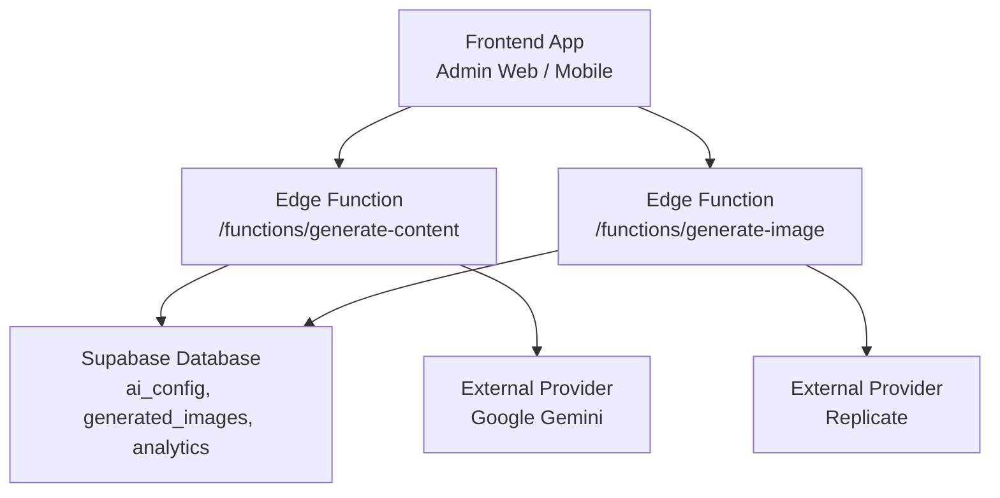
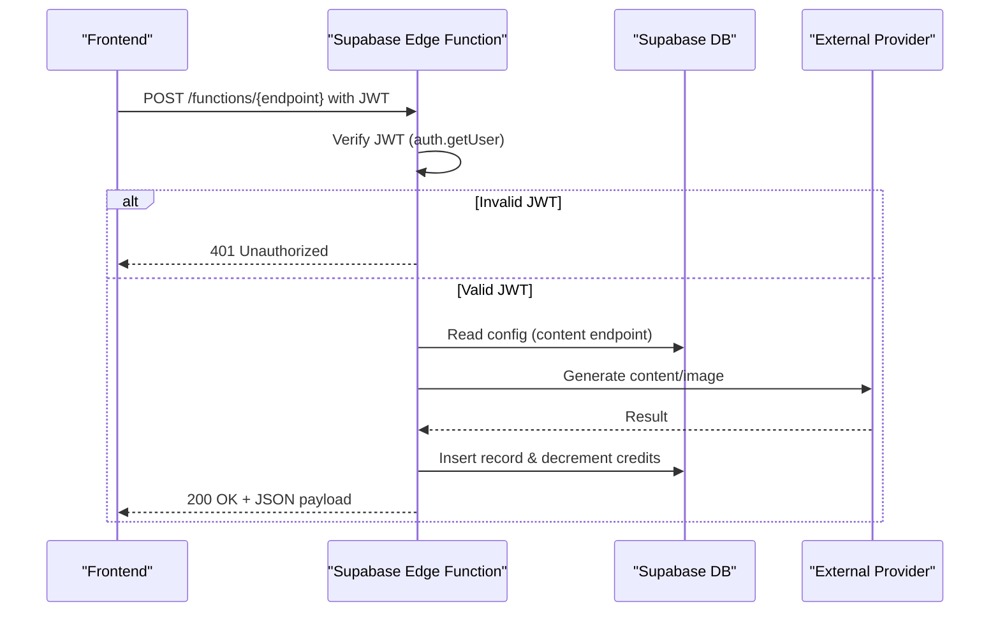
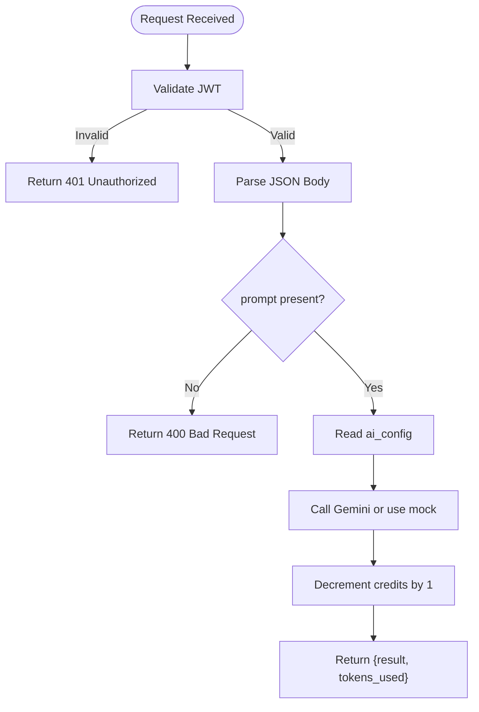
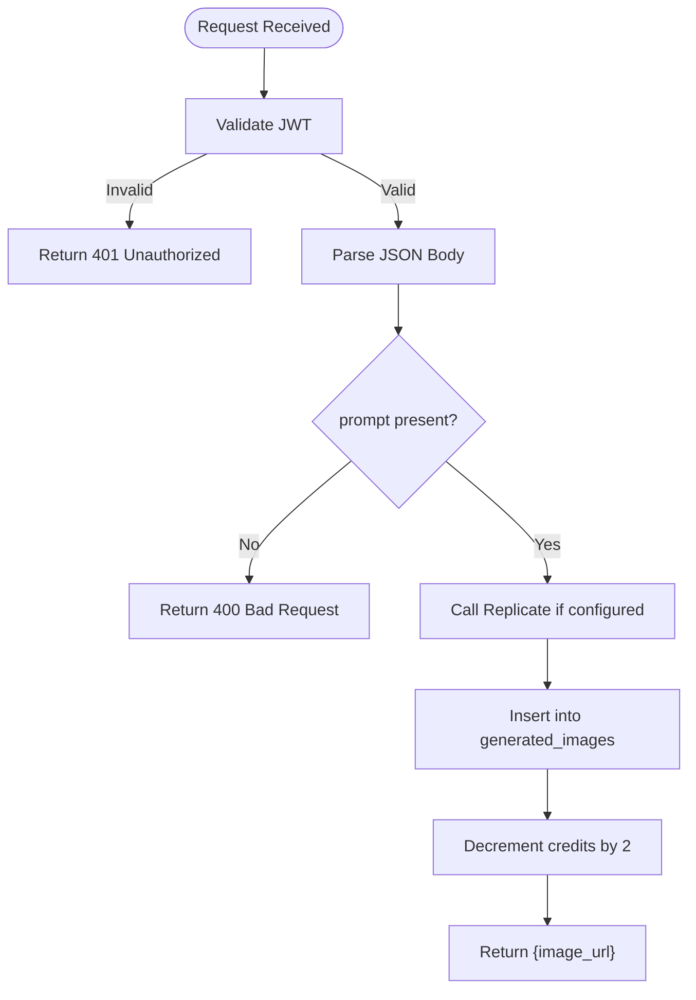
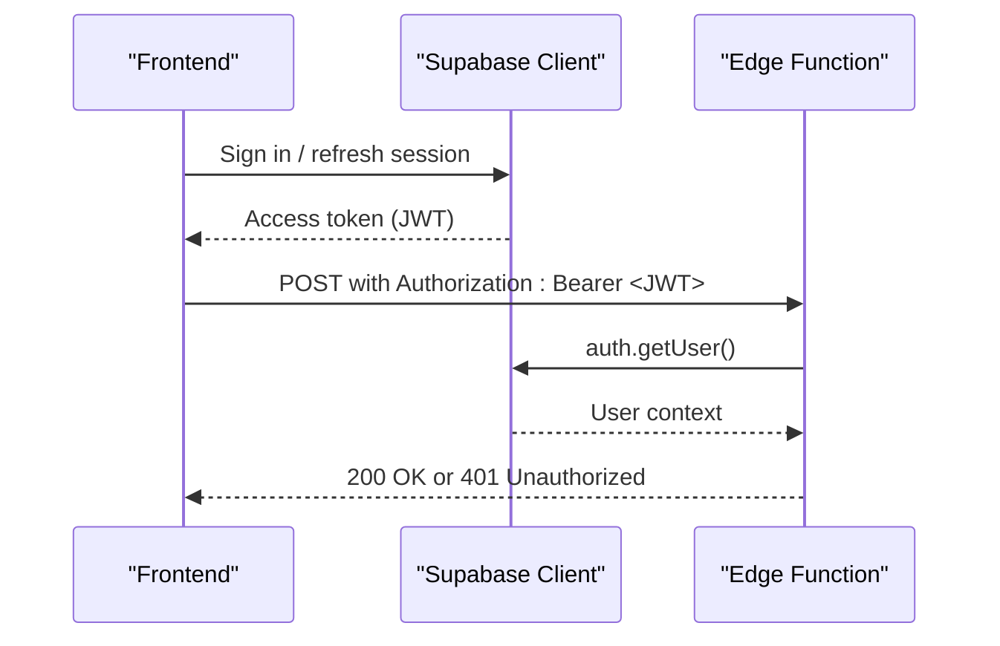
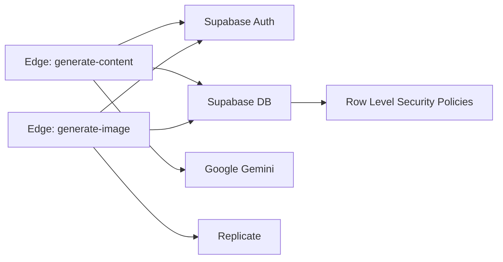

# API Endpoints

<cite>
**Referenced Files in This Document**
- [generate-content/index.ts](file://supabase/functions/generate-content/index.ts)
- [generate-image/index.ts](file://supabase/functions/generate-image/index.ts)
- [initial_schema.sql](file://supabase/migrations/20240001000000_initial_schema.sql)
- [admin supabase.ts](file://apps/admin/src/lib/supabase.ts)
- [mobile supabase.ts](file://apps/mobile/src/services/supabase.ts)
</cite>

## Table of Contents
1. [Introduction](#introduction)
2. [Project Structure](#project-structure)
3. [Core Components](#core-components)
4. [Architecture Overview](#architecture-overview)
5. [Detailed Component Analysis](#detailed-component-analysis)
6. [Dependency Analysis](#dependency-analysis)
7. [Performance Considerations](#performance-considerations)
8. [Troubleshooting Guide](#troubleshooting-guide)
9. [Conclusion](#conclusion)
10. [Appendices](#appendices)

## Introduction
This document provides comprehensive API documentation for the backend endpoints exposed via Supabase Edge Functions. It covers:
- Content generation endpoint
- Image generation endpoint
- Authentication using JWT tokens
- Request/response schemas, status codes, and error formats
- Security considerations, input validation, and rate limiting guidance
- Concrete TypeScript examples for frontend integration (admin web app and mobile app)

## Project Structure
The API surface is implemented as two Deno-based Supabase Edge Functions:
- generate-content: Produces text content based on a prompt, platform, type, and tone
- generate-image: Generates images based on a visual prompt, style, and aspect ratio

Both functions authenticate requests using Supabase Auth JWTs, enforce minimal server-side validation, interact with external AI providers, update user credits via database RPC, and persist relevant data.

**Diagram sources**
- [generate-content/index.ts:1-99](file://supabase/functions/generate-content/index.ts#L1-L99)
- [generate-image/index.ts:1-87](file://supabase/functions/generate-image/index.ts#L1-L87)
- [initial_schema.sql:31-42](file://supabase/migrations/20240001000000_initial_schema.sql#L31-L42)
- [initial_schema.sql:111-120](file://supabase/migrations/20240001000000_initial_schema.sql#L111-L120)

**Section sources**
- [generate-content/index.ts:1-99](file://supabase/functions/generate-content/index.ts#L1-L99)
- [generate-image/index.ts:1-87](file://supabase/functions/generate-image/index.ts#L1-L87)
- [initial_schema.sql:31-42](file://supabase/migrations/20240001000000_initial_schema.sql#L31-L42)
- [initial_schema.sql:111-120](file://supabase/migrations/20240001000000_initial_schema.sql#L111-L120)

## Core Components
- Authentication: Both endpoints require a valid Supabase Auth JWT in the Authorization header. Requests without a valid token receive a 401 Unauthorized response.
- Input Validation: Minimal server-side checks ensure required fields are present; missing or invalid inputs return 400 Bad Request.
- External Integrations:
  - Content generation uses Google Gemini when configured; otherwise returns a mock result.
  - Image generation calls Replicate when configured; otherwise returns a placeholder image URL.
- Data Persistence and Billing:
  - Content generation decrements user credits by 1 via an RPC call.
  - Image generation stores the image metadata and decrements user credits by 2 via an RPC call.

**Section sources**
- [generate-content/index.ts:14-36](file://supabase/functions/generate-content/index.ts#L14-L36)
- [generate-content/index.ts:48-84](file://supabase/functions/generate-content/index.ts#L48-L84)
- [generate-image/index.ts:14-36](file://supabase/functions/generate-image/index.ts#L14-L36)
- [generate-image/index.ts:38-74](file://supabase/functions/generate-image/index.ts#L38-L74)
- [initial_schema.sql:31-42](file://supabase/migrations/20240001000000_initial_schema.sql#L31-L42)
- [initial_schema.sql:111-120](file://supabase/migrations/20240001000000_initial_schema.sql#L111-L120)

## Architecture Overview
The endpoints follow a consistent flow:
1. Receive HTTP request with JWT
2. Validate authentication
3. Parse and validate JSON body
4. Fetch configuration from database (content only)
5. Call external provider (Gemini or Replicate)
6. Persist results and update credits
7. Return JSON response

**Diagram sources**
- [generate-content/index.ts:14-91](file://supabase/functions/generate-content/index.ts#L14-L91)
- [generate-image/index.ts:14-79](file://supabase/functions/generate-image/index.ts#L14-L79)

## Detailed Component Analysis

### Content Generation Endpoint
- Base path: /functions/generate-content
- Method: POST
- Headers:
  - Authorization: Bearer <JWT>
  - Content-Type: application/json
- Authentication: Required (JWT)
- Request Body Schema:
  - prompt: string (required)
  - type: string (optional; e.g., post, caption)
  - platform: string (optional; default: instagram)
  - tone: string (optional; default: Professional)
- Response Schema (200 OK):
  - result: string
  - tokens_used: number
- Error Responses:
  - 400 Bad Request: Missing or invalid prompt
  - 401 Unauthorized: Missing or invalid JWT
  - 500 Internal Server Error: Unexpected failure

**Diagram sources**
- [generate-content/index.ts:14-91](file://supabase/functions/generate-content/index.ts#L14-L91)

**Section sources**
- [generate-content/index.ts:14-91](file://supabase/functions/generate-content/index.ts#L14-L91)

### Image Generation Endpoint
- Base path: /functions/generate-image
- Method: POST
- Headers:
  - Authorization: Bearer <JWT>
  - Content-Type: application/json
- Authentication: Required (JWT)
- Request Body Schema:
  - prompt: string (required)
  - aspect_ratio: string (optional; default: 1:1)
  - style: string (optional; default: Photorealistic)
- Response Schema (200 OK):
  - image_url: string
- Error Responses:
  - 400 Bad Request: Missing or invalid prompt
  - 401 Unauthorized: Missing or invalid JWT
  - 500 Internal Server Error: Unexpected failure

**Diagram sources**
- [generate-image/index.ts:14-79](file://supabase/functions/generate-image/index.ts#L14-L79)

**Section sources**
- [generate-image/index.ts:14-79](file://supabase/functions/generate-image/index.ts#L14-L79)

### Authentication Mechanisms
- JWT-based authentication is enforced by calling Supabase Auth to retrieve the current user. If the token is missing or invalid, the function returns 401 Unauthorized.
- The client must include a valid Authorization header with a Bearer token obtained from the Supabase client session.

**Diagram sources**
- [generate-content/index.ts:14-27](file://supabase/functions/generate-content/index.ts#L14-L27)
- [generate-image/index.ts:14-27](file://supabase/functions/generate-image/index.ts#L14-L27)

**Section sources**
- [generate-content/index.ts:14-27](file://supabase/functions/generate-content/index.ts#L14-L27)
- [generate-image/index.ts:14-27](file://supabase/functions/generate-image/index.ts#L14-L27)

### Frontend Integration Examples (TypeScript)
Note: These examples illustrate how to call the endpoints using the Supabase clients configured in the admin and mobile apps. They do not contain secrets or sensitive values.

- Admin Web App (Next.js)
  - Client setup: See [admin supabase.ts:1-14](file://apps/admin/src/lib/supabase.ts#L1-L14)
  - Example usage pattern:
    - Obtain a signed-in session via the Supabase client
    - Call the edge function with Authorization header set to the access token
    - Handle 200 responses and errors per schema above

- Mobile App (React Native/Expo)
  - Client setup: See [mobile supabase.ts:1-40](file://apps/mobile/src/services/supabase.ts#L1-L40)
  - Example usage pattern:
    - Use the Supabase client to sign in and maintain session
    - Attach the access token to the Authorization header when calling edge functions
    - Process responses according to the documented schemas

[No sources needed since this section provides general guidance]

## Dependency Analysis
- Edge Functions depend on:
  - Supabase Auth for identity verification
  - Supabase Database for configuration and persistence
  - External providers (Gemini, Replicate) for AI generation
- Database dependencies:
  - ai_config table supplies system prompts and model parameters
  - generated_images table records image outputs
  - RPC decrement_user_credits updates billing/credits

**Diagram sources**
- [generate-content/index.ts:14-91](file://supabase/functions/generate-content/index.ts#L14-L91)
- [generate-image/index.ts:14-79](file://supabase/functions/generate-image/index.ts#L14-L79)
- [initial_schema.sql:159-202](file://supabase/migrations/20240001000000_initial_schema.sql#L159-L202)

**Section sources**
- [initial_schema.sql:31-42](file://supabase/migrations/20240001000000_initial_schema.sql#L31-L42)
- [initial_schema.sql:111-120](file://supabase/migrations/20240001000000_initial_schema.sql#L111-L120)
- [initial_schema.sql:159-202](file://supabase/migrations/20240001000000_initial_schema.sql#L159-L202)

## Performance Considerations
- External provider latency: Calls to Gemini and Replicate can be slow; consider timeouts and retry strategies at the client layer.
- Token usage and credits: Each content generation consumes 1 credit; each image generation consumes 2 credits. Ensure UI reflects remaining credits and handles failures gracefully.
- Caching: For repeated prompts, consider caching results client-side or via a cache layer to reduce redundant calls.
- Payload size: Keep prompts concise to minimize token usage and processing time.

[No sources needed since this section provides general guidance]

## Troubleshooting Guide
Common issues and resolutions:
- 401 Unauthorized:
  - Cause: Missing or invalid Authorization header
  - Resolution: Ensure the client has an active session and attaches the access token
- 400 Bad Request:
  - Cause: Missing prompt field
  - Resolution: Include a non-empty prompt in the request body
- 500 Internal Server Error:
  - Cause: Unexpected server-side failure or external provider error
  - Resolution: Retry with backoff; check logs for details

Error response format:
- { "error": "<message>" }

**Section sources**
- [generate-content/index.ts:21-36](file://supabase/functions/generate-content/index.ts#L21-L36)
- [generate-content/index.ts:92-97](file://supabase/functions/generate-content/index.ts#L92-L97)
- [generate-image/index.ts:21-36](file://supabase/functions/generate-image/index.ts#L21-L36)
- [generate-image/index.ts:80-85](file://supabase/functions/generate-image/index.ts#L80-L85)

## Conclusion
The Supabase Edge Functions provide secure, authenticated endpoints for generating text content and images. They enforce JWT-based authentication, perform basic input validation, integrate with external AI providers, and manage user credits through database RPCs. Clients should handle authentication, validate inputs, and implement robust error handling and retries for optimal reliability.

[No sources needed since this section summarizes without analyzing specific files]

## Appendices

### Rate Limiting Guidance
- Implement client-side throttling to avoid excessive requests
- Consider server-side rate limiting at the gateway or edge layer to protect external provider quotas
- Monitor credit consumption and alert users approaching limits

[No sources needed since this section provides general guidance]

### Security Considerations
- Always require Authorization header with a valid JWT
- Validate all inputs on the server side (already partially implemented)
- Restrict access to sensitive environment variables (API keys) to the edge functions
- Enforce Row Level Security policies for database tables

**Section sources**
- [initial_schema.sql:159-202](file://supabase/migrations/20240001000000_initial_schema.sql#L159-L202)