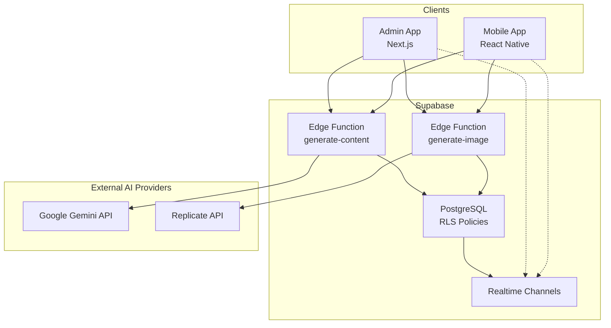
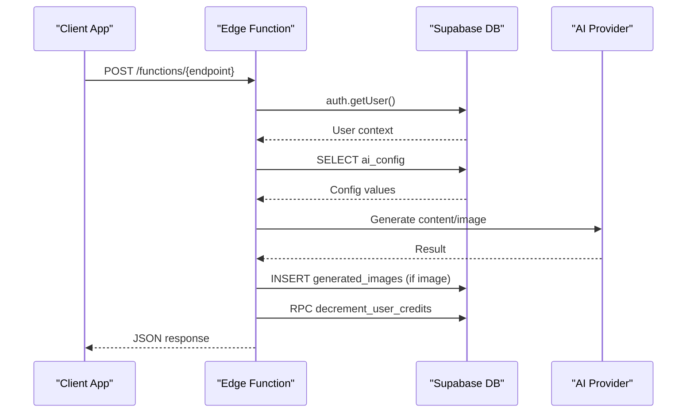
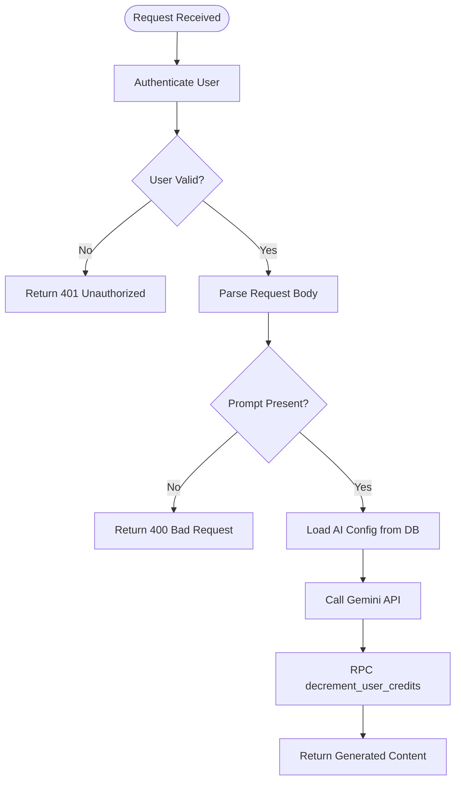
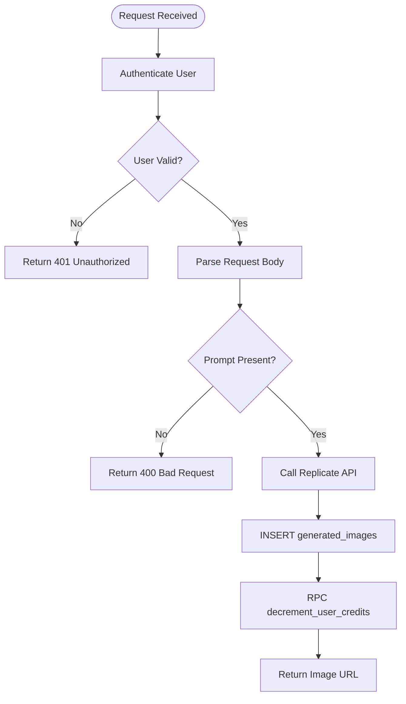
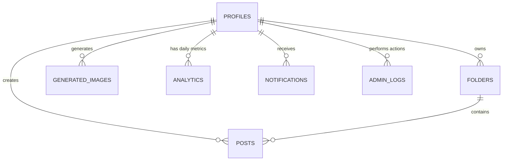
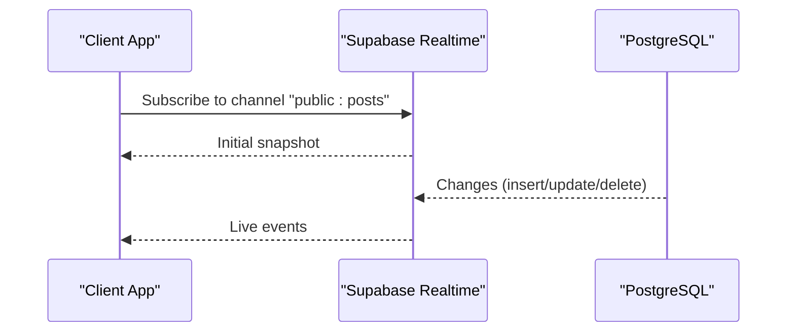
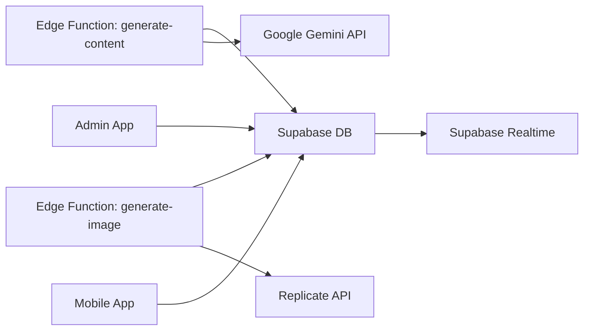

# Backend Services

<cite>
**Referenced Files in This Document**
- [generate-content/index.ts](file://supabase/functions/generate-content/index.ts)
- [generate-image/index.ts](file://supabase/functions/generate-image/index.ts)
- [initial_schema.sql](file://supabase/migrations/20240001000000_initial_schema.sql)
- [seed.sql](file://supabase/seed.sql)
- [config.toml](file://supabase/config.toml)
- [admin supabase client](file://apps/admin/src/lib/supabase.ts)
- [mobile supabase client](file://apps/mobile/src/services/supabase.ts)
- [database types](file://packages/types/src/database.ts)
</cite>

## Table of Contents
1. [Introduction](#introduction)
2. [Project Structure](#project-structure)
3. [Core Components](#core-components)
4. [Architecture Overview](#architecture-overview)
5. [Detailed Component Analysis](#detailed-component-analysis)
6. [Dependency Analysis](#dependency-analysis)
7. [Performance Considerations](#performance-considerations)
8. [Troubleshooting Guide](#troubleshooting-guide)
9. [Conclusion](#conclusion)
10. [Appendices](#appendices)

## Introduction
This document describes the backend services for SocialPilot AI Pro, built on Supabase. It focuses on:
- Edge Functions architecture for AI content generation using Google Gemini (text) and Replicate API (images).
- Database schema design, table relationships, and Row Level Security policies.
- Real-time subscription system using Supabase Realtime channels for live updates.
- API endpoints, request/response formats, error handling patterns, and security considerations.
- Guidance to add new Edge Functions, extend the database schema, and implement custom business logic.
- Performance optimization, scaling considerations, and monitoring approaches.

## Project Structure
The backend is centered around Supabase with:
- Edge Functions under supabase/functions for serverless APIs.
- Database schema and RLS policies under supabase/migrations.
- Seed data under supabase/seed.sql.
- Client SDK configuration in admin and mobile apps for authentication and realtime subscriptions.

**Diagram sources**
- [generate-content/index.ts:1-99](file://supabase/functions/generate-content/index.ts#L1-L99)
- [generate-image/index.ts:1-87](file://supabase/functions/generate-image/index.ts#L1-L87)
- [initial_schema.sql:15-231](file://supabase/migrations/20240001000000_initial_schema.sql#L15-L231)
- [admin supabase client:1-14](file://apps/admin/src/lib/supabase.ts#L1-L14)
- [mobile supabase client:1-41](file://apps/mobile/src/services/supabase.ts#L1-L41)

**Section sources**
- [generate-content/index.ts:1-99](file://supabase/functions/generate-content/index.ts#L1-L99)
- [generate-image/index.ts:1-87](file://supabase/functions/generate-image/index.ts#L1-L87)
- [initial_schema.sql:15-231](file://supabase/migrations/20240001000000_initial_schema.sql#L15-L231)
- [admin supabase client:1-14](file://apps/admin/src/lib/supabase.ts#L1-L14)
- [mobile supabase client:1-41](file://apps/mobile/src/services/supabase.ts#L1-L41)

## Core Components
- Edge Functions:
  - generate-content: Authenticates user, reads AI config from DB, calls Google Gemini for text generation, decrements credits, returns generated content.
  - generate-image: Authenticates user, validates prompt, calls Replicate for image generation, stores result, decrements credits, returns image URL.
- Database Schema:
  - Tables for app_config, ai_config, profiles, folders, posts, templates, generated_images, analytics, notifications, admin_logs.
  - Enums for roles, tiers, statuses, platforms.
  - Row Level Security policies restricting access by user and role.
- Realtime:
  - Realtime enabled for app_config, posts, notifications, templates via Supabase publication.

**Section sources**
- [generate-content/index.ts:14-99](file://supabase/functions/generate-content/index.ts#L14-L99)
- [generate-image/index.ts:14-87](file://supabase/functions/generate-image/index.ts#L14-L87)
- [initial_schema.sql:8-153](file://supabase/migrations/20240001000000_initial_schema.sql#L8-L153)
- [initial_schema.sql:156-202](file://supabase/migrations/20240001000000_initial_schema.sql#L156-L202)
- [initial_schema.sql:227-231](file://supabase/migrations/20240001000000_initial_schema.sql#L227-L231)

## Architecture Overview
The system uses Supabase Edge Functions as secure serverless endpoints that:
- Authenticate requests using Supabase JWTs.
- Read/write data through Supabase client with RLS enforced.
- Call external AI providers (Gemini, Replicate) with secrets stored in environment variables.
- Persist results and update user credits atomically.

**Diagram sources**
- [generate-content/index.ts:14-99](file://supabase/functions/generate-content/index.ts#L14-L99)
- [generate-image/index.ts:14-87](file://supabase/functions/generate-image/index.ts#L14-L87)
- [initial_schema.sql:156-202](file://supabase/migrations/20240001000000_initial_schema.sql#L156-L202)

## Detailed Component Analysis

### Edge Function: generate-content
Purpose:
- Accepts a prompt, type, platform, and tone.
- Retrieves AI configuration from the database.
- Calls Google Gemini API to generate text content.
- Decrements user credits and returns the generated content.

Request:
- Method: POST
- Headers: Authorization (Bearer token), Content-Type: application/json
- Body fields:
  - prompt: string (required)
  - type: string (e.g., caption, post_ideas)
  - platform: string (default instagram)
  - tone: string (default Professional)

Response:
- Success: { result: string, tokens_used: number }
- Error: { error: string } with appropriate HTTP status codes (400, 401, 500)

Security:
- Validates user via Supabase auth.
- Uses RLS-enforced DB queries.
- Secrets (GEMINI_API_KEY) are environment variables.

Error Handling:
- Returns 401 if unauthorized.
- Returns 400 if prompt missing.
- Returns 500 with error.message on exceptions.

**Diagram sources**
- [generate-content/index.ts:14-99](file://supabase/functions/generate-content/index.ts#L14-L99)

**Section sources**
- [generate-content/index.ts:14-99](file://supabase/functions/generate-content/index.ts#L14-L99)

### Edge Function: generate-image
Purpose:
- Accepts a visual prompt, aspect ratio, and style.
- Calls Replicate API to generate an image.
- Stores the image URL and metadata in generated_images.
- Decrements user credits and returns the image URL.

Request:
- Method: POST
- Headers: Authorization (Bearer token), Content-Type: application/json
- Body fields:
  - prompt: string (required)
  - aspect_ratio: string (default 1:1)
  - style: string (default Photorealistic)

Response:
- Success: { image_url: string }
- Error: { error: string } with appropriate HTTP status codes (400, 401, 500)

Security:
- Validates user via Supabase auth.
- Uses RLS-enforced DB writes.
- Secrets (REPLICATE_API_TOKEN) are environment variables.

Error Handling:
- Returns 401 if unauthorized.
- Returns 400 if prompt missing.
- Returns 500 with error.message on exceptions.

**Diagram sources**
- [generate-image/index.ts:14-87](file://supabase/functions/generate-image/index.ts#L14-L87)

**Section sources**
- [generate-image/index.ts:14-87](file://supabase/functions/generate-image/index.ts#L14-L87)

### Database Schema Design and Relationships
Key tables and relationships:
- profiles: User identity and subscription state; linked to auth.users via id.
- folders: Organizational units per user.
- posts: Content items per user with optional folder linkage.
- templates: Reusable prompt templates.
- generated_images: Records of AI-generated images per user.
- analytics: Daily metrics per user.
- notifications: Per-user messages.
- admin_logs: Audit trail for admin actions.
- app_config: White-label settings.
- ai_config: Centralized AI provider/model settings.

Enums:
- user_role, subscription_tier, post_status, platform_type.

Relationships:
- posts.user_id -> profiles.id
- folders.user_id -> profiles.id
- generated_images.user_id -> profiles.id
- analytics.user_id -> profiles.id
- notifications.user_id -> profiles.id
- admin_logs.admin_id -> profiles.id

Realtime publications:
- app_config, posts, notifications, templates are included in supabase_realtime publication for live updates.

**Diagram sources**
- [initial_schema.sql:44-153](file://supabase/migrations/20240001000000_initial_schema.sql#L44-L153)

**Section sources**
- [initial_schema.sql:8-153](file://supabase/migrations/20240001000000_initial_schema.sql#L8-L153)
- [initial_schema.sql:227-231](file://supabase/migrations/20240001000000_initial_schema.sql#L227-L231)

### Row Level Security Policies
- app_config: All authenticated can read; only admins can modify.
- ai_config: All authenticated can read; only admins can modify.
- profiles: Users can read/update own profile; admins have full access.
- posts: Users manage own posts; admins can moderate.
- folders: Users manage own folders.
- templates: Authenticated can read active templates; admins manage all.
- generated_images: Users manage own images.
- notifications: Users manage own notifications.
- analytics: Users read own; admins read all.
- admin_logs: Admins only.

These policies enforce fine-grained access control at the database level.

**Section sources**
- [initial_schema.sql:156-202](file://supabase/migrations/20240001000000_initial_schema.sql#L156-L202)

### Real-Time Subscription System
Realtime is enabled for specific tables via Supabase publication. Clients subscribe to channels to receive live updates for:
- app_config: White-label changes.
- posts: Post status/content updates.
- notifications: New or updated notifications.
- templates: Template availability changes.

Client setup:
- Admin app initializes Supabase client with session persistence and auto-refresh.
- Mobile app initializes Supabase client with secure storage and platform-specific session handling.

**Diagram sources**
- [initial_schema.sql:227-231](file://supabase/migrations/20240001000000_initial_schema.sql#L227-L231)
- [admin supabase client:1-14](file://apps/admin/src/lib/supabase.ts#L1-L14)
- [mobile supabase client:1-41](file://apps/mobile/src/services/supabase.ts#L1-L41)

**Section sources**
- [initial_schema.sql:227-231](file://supabase/migrations/20240001000000_initial_schema.sql#L227-L231)
- [admin supabase client:1-14](file://apps/admin/src/lib/supabase.ts#L1-L14)
- [mobile supabase client:1-41](file://apps/mobile/src/services/supabase.ts#L1-L41)

### API Endpoints Summary
- POST /functions/generate-content
  - Request: { prompt, type, platform?, tone? }
  - Response: { result, tokens_used }
  - Errors: 400 (missing prompt), 401 (unauthorized), 500 (server error)
- POST /functions/generate-image
  - Request: { prompt, aspect_ratio?, style? }
  - Response: { image_url }
  - Errors: 400 (missing prompt), 401 (unauthorized), 500 (server error)

Note: These endpoints are exposed via Supabase Edge Functions and require a valid Authorization header.

**Section sources**
- [generate-content/index.ts:29-91](file://supabase/functions/generate-content/index.ts#L29-L91)
- [generate-image/index.ts:29-79](file://supabase/functions/generate-image/index.ts#L29-L79)

### Security Considerations
- Authentication: Both Edge Functions validate user context via Supabase auth.
- Authorization: RLS policies restrict data access by user and role.
- Secrets Management: API keys stored in environment variables (GEMINI_API_KEY, REPLICATE_API_TOKEN).
- CORS: Edge Functions set broad CORS headers suitable for browser clients.
- Input Validation: Required fields validated before processing.

**Section sources**
- [generate-content/index.ts:14-36](file://supabase/functions/generate-content/index.ts#L14-L36)
- [generate-image/index.ts:14-36](file://supabase/functions/generate-image/index.ts#L14-L36)
- [initial_schema.sql:156-202](file://supabase/migrations/20240001000000_initial_schema.sql#L156-L202)

## Dependency Analysis
- Edge Functions depend on:
  - Supabase client for auth and DB operations.
  - External AI providers (Gemini, Replicate) via HTTP.
- Database depends on:
  - Supabase Realtime publication for live updates.
- Clients depend on:
  - Supabase client SDK configured per platform.

**Diagram sources**
- [generate-content/index.ts:14-99](file://supabase/functions/generate-content/index.ts#L14-L99)
- [generate-image/index.ts:14-87](file://supabase/functions/generate-image/index.ts#L14-L87)
- [initial_schema.sql:227-231](file://supabase/migrations/20240001000000_initial_schema.sql#L227-L231)

**Section sources**
- [generate-content/index.ts:14-99](file://supabase/functions/generate-content/index.ts#L14-L99)
- [generate-image/index.ts:14-87](file://supabase/functions/generate-image/index.ts#L14-L87)
- [initial_schema.sql:227-231](file://supabase/migrations/20240001000000_initial_schema.sql#L227-L231)

## Performance Considerations
- Caching AI responses: Consider caching frequent prompts to reduce API costs and latency.
- Rate limiting: Implement rate limits at the Edge Function layer to protect external APIs.
- Connection pooling: Use efficient DB queries and avoid N+1 patterns.
- Batch operations: Group inserts/updates where possible.
- Monitoring: Track latency and error rates for Edge Functions and external API calls.
- Scaling: Edge Functions scale automatically; ensure external APIs handle concurrent requests.

[No sources needed since this section provides general guidance]

## Troubleshooting Guide
Common issues and resolutions:
- Unauthorized errors: Ensure Authorization header is present and valid.
- Missing prompt: Validate required fields before calling Edge Functions.
- External API failures: Check environment variables for GEMINI_API_KEY and REPLICATE_API_TOKEN.
- Realtime not updating: Verify tables are included in supabase_realtime publication and clients subscribe correctly.

Operational checks:
- Confirm RLS policies allow intended operations.
- Validate seed data for app_config and ai_config.
- Inspect Edge Function logs for detailed error messages.

**Section sources**
- [generate-content/index.ts:21-36](file://supabase/functions/generate-content/index.ts#L21-L36)
- [generate-image/index.ts:21-36](file://supabase/functions/generate-image/index.ts#L21-L36)
- [initial_schema.sql:227-231](file://supabase/migrations/20240001000000_initial_schema.sql#L227-L231)
- [seed.sql:1-17](file://supabase/seed.sql#L1-L17)

## Conclusion
The backend leverages Supabase Edge Functions to provide secure, scalable AI-powered content generation. The database schema enforces strict access controls via RLS, while Realtime enables live updates across clients. Proper error handling, input validation, and secret management ensure robust operation. Extending the system involves adding new Edge Functions, updating the schema, and configuring Realtime channels as needed.

[No sources needed since this section summarizes without analyzing specific files]

## Appendices

### Adding a New Edge Function
Steps:
- Create a new directory under supabase/functions with an index.ts entry point.
- Implement authentication, input validation, and business logic.
- Use Supabase client to interact with the database under RLS.
- Store secrets in environment variables.
- Test locally and deploy to Supabase.

**Section sources**
- [generate-content/index.ts:1-99](file://supabase/functions/generate-content/index.ts#L1-L99)
- [generate-image/index.ts:1-87](file://supabase/functions/generate-image/index.ts#L1-L87)

### Extending the Database Schema
Steps:
- Add new tables/columns in a migration file.
- Define enums if necessary.
- Update RLS policies for new tables.
- Include tables in supabase_realtime publication if real-time updates are needed.
- Seed initial data if applicable.

**Section sources**
- [initial_schema.sql:8-153](file://supabase/migrations/20240001000000_initial_schema.sql#L8-L153)
- [initial_schema.sql:156-202](file://supabase/migrations/20240001000000_initial_schema.sql#L156-L202)
- [initial_schema.sql:227-231](file://supabase/migrations/20240001000000_initial_schema.sql#L227-L231)

### Implementing Custom Business Logic
Guidance:
- Prefer server-side logic in Edge Functions for security and consistency.
- Use database functions/RPCs for atomic operations like credit decrements.
- Enforce business rules via RLS policies and triggers.
- Log critical actions in admin_logs for auditability.

**Section sources**
- [initial_schema.sql:145-153](file://supabase/migrations/20240001000000_initial_schema.sql#L145-L153)
- [generate-content/index.ts:82-91](file://supabase/functions/generate-content/index.ts#L82-L91)
- [generate-image/index.ts:64-79](file://supabase/functions/generate-image/index.ts#L64-L79)

### Data Types Reference
Types used across the system include platform types, post statuses, AI content types, and configuration interfaces.

**Section sources**
- [database types:1-73](file://packages/types/src/database.ts#L1-L73)