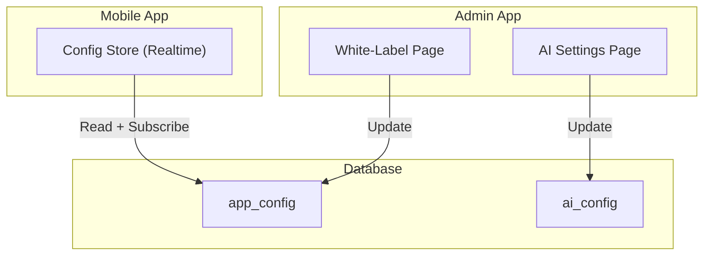
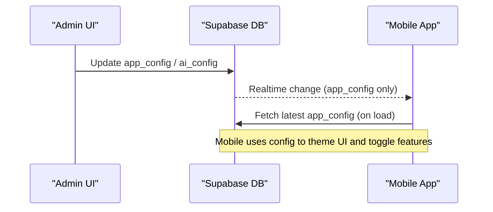
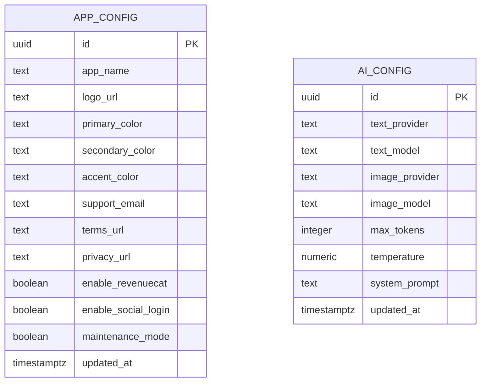
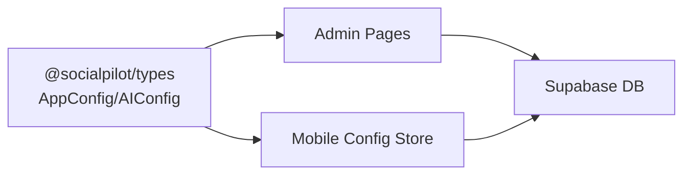

# Configuration Tables

<cite>
**Referenced Files in This Document**
- [initial_schema.sql](file://supabase/migrations/20240001000000_initial_schema.sql)
- [database.ts](file://packages/types/src/database.ts)
- [white-label page.tsx](file://apps/admin/src/app/(dashboard)/white-label/page.tsx)
- [ai-settings page.tsx](file://apps/admin/src/app/(dashboard)/ai-settings/page.tsx)
- [useConfigStore.ts](file://apps/mobile/src/store/useConfigStore.ts)
- [seed.sql](file://supabase/seed.sql)
</cite>

## Table of Contents
1. Introduction
2. Project Structure
3. Core Components
4. Architecture Overview
5. Detailed Component Analysis
6. Dependency Analysis
7. Performance Considerations
8. Troubleshooting Guide
9. Conclusion
10. Appendices

## Introduction
This document explains the configuration tables that control application behavior and customization: app_config for white-label settings and ai_config for centralized AI service configuration. It covers what each field controls, how changes affect runtime behavior, security considerations, and best practices for managing configurations across environments.

## Project Structure
The configuration is defined in the database schema and consumed by both admin UIs and mobile apps:
- Database schema defines the tables and row-level security policies.
- Admin pages provide interfaces to update app_config and ai_config.
- Mobile app reads app_config at runtime and subscribes to realtime updates.

**Diagram sources**
- [initial_schema.sql:15-42](file://supabase/migrations/20240001000000_initial_schema.sql#L15-L42)
- [white-label page.tsx:25-91](file://apps/admin/src/app/(dashboard)/white-label/page.tsx#L25-L91)
- [ai-settings page.tsx:23-85](file://apps/admin/src/app/(dashboard)/ai-settings/page.tsx#L23-L85)
- [useConfigStore.ts:15-66](file://apps/mobile/src/store/useConfigStore.ts#L15-L66)

**Section sources**
- [initial_schema.sql:15-42](file://supabase/migrations/20240001000000_initial_schema.sql#L15-L42)
- [database.ts:36-62](file://packages/types/src/database.ts#L36-L62)

## Core Components
- app_config: White-label and feature flags controlling branding, colors, URLs, support contact, and runtime toggles such as maintenance mode and login/payment integrations.
- ai_config: Centralized AI settings controlling text and image providers, model names, token limits, temperature, and system prompt used by generation flows.

Key behaviors:
- Changes to app_config are persisted and can be read by clients; realtime sync is enabled for app_config so mobile apps can reflect updates without restarts.
- Changes to ai_config take effect on subsequent AI calls that consume these settings from the backend or client stores.

Security:
- Row-level security restricts updates to admins while allowing authenticated users to read configuration values.

**Section sources**
- [initial_schema.sql:15-42](file://supabase/migrations/20240001000000_initial_schema.sql#L15-L42)
- [initial_schema.sql:170-176](file://supabase/migrations/20240001000000_initial_schema.sql#L170-L176)
- [database.ts:36-62](file://packages/types/src/database.ts#L36-L62)

## Architecture Overview
Configuration flows between admin UIs, database, and mobile runtime:

**Diagram sources**
- [initial_schema.sql:170-176](file://supabase/migrations/20240001000000_initial_schema.sql#L170-L176)
- [initial_schema.sql:228-232](file://supabase/migrations/20240001000000_initial_schema.sql#L228-L232)
- [useConfigStore.ts:15-66](file://apps/mobile/src/store/useConfigStore.ts#L15-L66)

## Detailed Component Analysis

### app_config table (White-Label Settings)
Purpose:
- Controls product identity and runtime feature flags visible across web and mobile.

Fields and effects:
- app_name: Displayed in UI headers, titles, and metadata.
- logo_url: Used for branding assets in UI.
- primary_color, secondary_color, accent_color: Drive theme colors in mobile and web UIs.
- support_email: Shown in help/about screens and footers.
- terms_url, privacy_url: Links rendered in legal sections.
- enable_revenuecat: Toggles monetization/paywall features.
- enable_social_login: Enables/disables social login flows.
- maintenance_mode: Can gate access or show maintenance messaging.
- updated_at: Audit timestamp for last change.

Admin interface:
- The White-Label page loads the single row, populates form fields, and persists updates back to app_config.

Mobile consumption:
- The mobile store fetches app_config on startup and subscribes to realtime changes to refresh UI and feature flags dynamically.

Security:
- Only admins can modify app_config; all authenticated users can read it.

Best practices:
- Keep a single canonical row per environment.
- Use consistent color tokens and validate hex formats.
- Avoid embedding secrets in URL fields; use secure references.
- Gate sensitive features via boolean flags rather than hardcoding.

**Section sources**
- [initial_schema.sql:15-29](file://supabase/migrations/20240001000000_initial_schema.sql#L15-L29)
- [initial_schema.sql:170-176](file://supabase/migrations/20240001000000_initial_schema.sql#L170-L176)
- [white-label page.tsx:25-91](file://apps/admin/src/app/(dashboard)/white-label/page.tsx#L25-L91)
- [useConfigStore.ts:15-66](file://apps/mobile/src/store/useConfigStore.ts#L15-L66)
- [database.ts:36-50](file://packages/types/src/database.ts#L36-L50)

### ai_config table (Centralized AI Settings)
Purpose:
- Centralizes provider selection, model parameters, and system prompts for AI generation.

Fields and effects:
- text_provider: Selects the LLM provider for text generation.
- text_model: Chooses the specific model version for text.
- image_provider: Selects the image generation provider.
- image_model: Chooses the specific model for images.
- max_tokens: Limits output length to control cost and latency.
- temperature: Controls randomness/creativity of outputs.
- system_prompt: Master instructions shaping tone and behavior of generated content.
- updated_at: Audit timestamp for last change.

Admin interface:
- The AI Settings page loads the single row, allows editing of providers/models and inference parameters, and persists updates.

Behavioral impact:
- Changing providers/models affects downstream generation endpoints and any client-side logic that consumes these settings.
- Temperature and max_tokens directly influence generation quality, verbosity, and cost.
- System prompt influences style, safety, and domain alignment of outputs.

Security:
- Only admins can modify ai_config; all authenticated users can read it.

Best practices:
- Validate provider/model combinations before saving.
- Cap max_tokens conservatively to control costs.
- Treat system_prompt as sensitive configuration; avoid injecting user data into it.
- Version or tag models when rotating to reduce risk.

**Section sources**
- [initial_schema.sql:32-42](file://supabase/migrations/20240001000000_initial_schema.sql#L32-L42)
- [initial_schema.sql:170-176](file://supabase/migrations/20240001000000_initial_schema.sql#L170-L176)
- [ai-settings page.tsx:23-85](file://apps/admin/src/app/(dashboard)/ai-settings/page.tsx#L23-L85)
- [database.ts:52-62](file://packages/types/src/database.ts#L52-L62)

### Data Model Diagram

**Diagram sources**
- [initial_schema.sql:15-42](file://supabase/migrations/20240001000000_initial_schema.sql#L15-L42)

## Dependency Analysis
- Admin pages depend on Supabase client to query/update configuration tables.
- Mobile app depends on Supabase realtime to react to app_config changes.
- Types package provides shared TypeScript interfaces ensuring consistency across apps.

**Diagram sources**
- [database.ts:36-62](file://packages/types/src/database.ts#L36-L62)
- [white-label page.tsx:25-91](file://apps/admin/src/app/(dashboard)/white-label/page.tsx#L25-L91)
- [ai-settings page.tsx:23-85](file://apps/admin/src/app/(dashboard)/ai-settings/page.tsx#L23-L85)
- [useConfigStore.ts:15-66](file://apps/mobile/src/store/useConfigStore.ts#L15-L66)

**Section sources**
- [database.ts:36-62](file://packages/types/src/database.ts#L36-L62)

## Performance Considerations
- app_config is small and frequently accessed; caching at the client level with periodic refresh or realtime subscription reduces network overhead.
- ai_config changes should be validated server-side to prevent expensive model invocations due to misconfiguration.
- Limit max_tokens and tune temperature to balance quality and cost.
- Avoid frequent large updates to system_prompt; batch changes where possible.

[No sources needed since this section provides general guidance]

## Troubleshooting Guide
Common issues and resolutions:
- Cannot save configuration: Ensure the current user has admin privileges; RLS policies restrict updates to admins.
- Mobile not reflecting changes: Verify realtime subscription is active and that app_config is included in the realtime publication.
- Unexpected AI behavior: Check temperature and max_tokens; ensure system_prompt does not contain unintended user data.
- Branding not applied: Confirm logo_url and color fields are set and that the mobile app re-fetches or receives realtime updates.

Operational checks:
- Confirm RLS policies allow admin writes and authenticated reads.
- Verify seed data exists for initial rows if starting fresh.

**Section sources**
- [initial_schema.sql:170-176](file://supabase/migrations/20240001000000_initial_schema.sql#L170-L176)
- [initial_schema.sql:228-232](file://supabase/migrations/20240001000000_initial_schema.sql#L228-L232)
- [seed.sql:23466-23473](file://supabase/seed.sql#L23466-L23473)

## Conclusion
The app_config and ai_config tables centralize critical runtime behavior and customization. Properly managed, they enable safe white-labeling, feature gating, and dynamic AI tuning. Enforce admin-only writes, leverage realtime updates for app_config, and follow best practices for cost, safety, and environment management.

[No sources needed since this section summarizes without analyzing specific files]

## Appendices

### Environment Management Best Practices
- Maintain separate databases per environment (dev/staging/prod) and deploy migrations accordingly.
- Seed each environment with appropriate defaults using seed scripts.
- Restrict admin access per environment and audit changes via logs.
- Use configuration validation in admin UIs to prevent invalid provider/model combinations.
- For multi-tenant scenarios, consider scoping configs by tenant if required.

[No sources needed since this section provides general guidance]