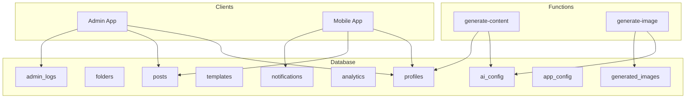
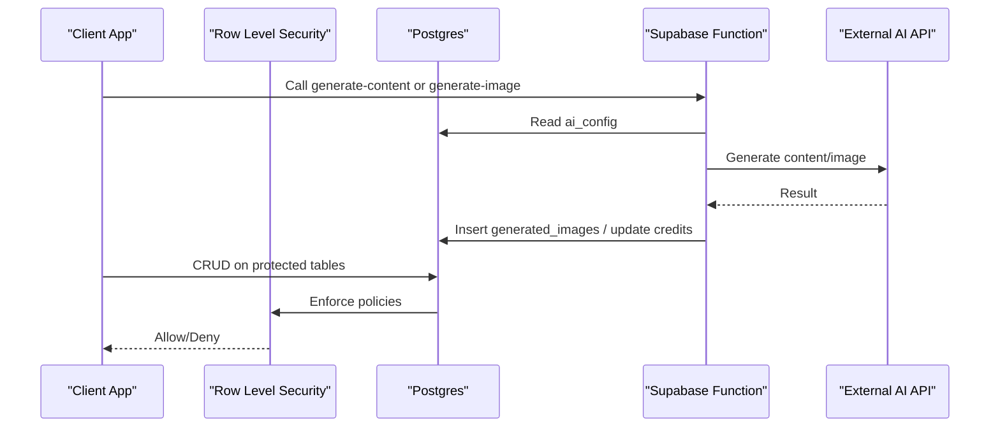
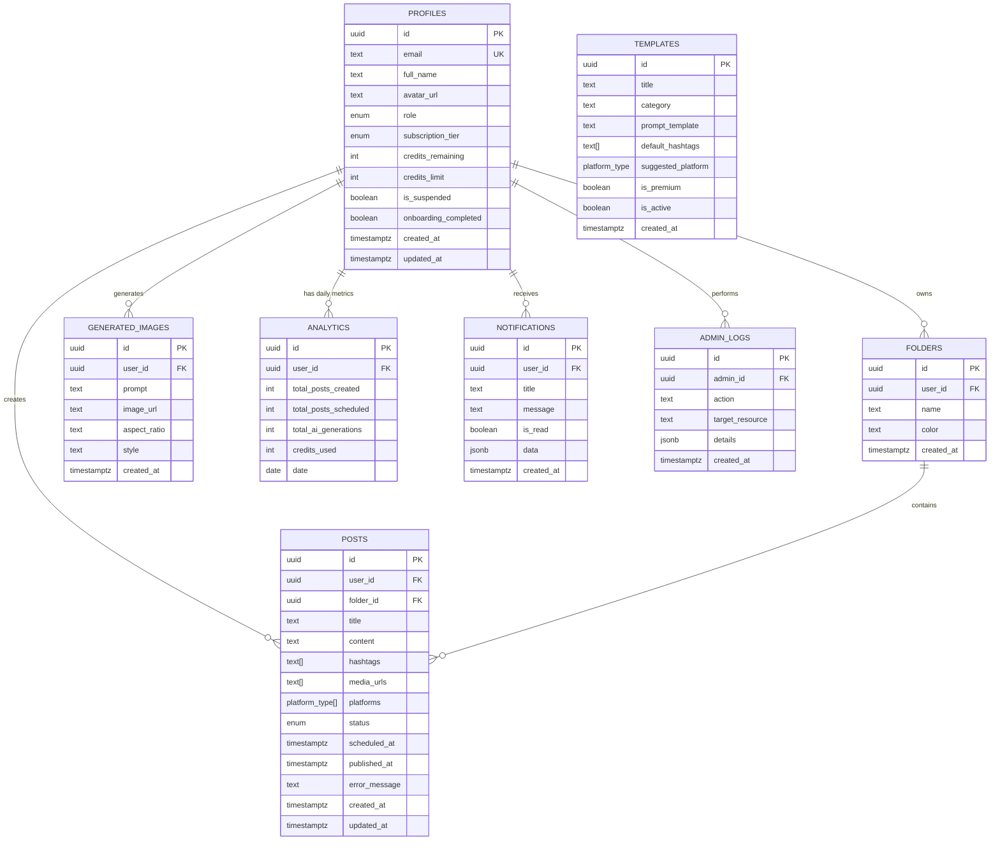
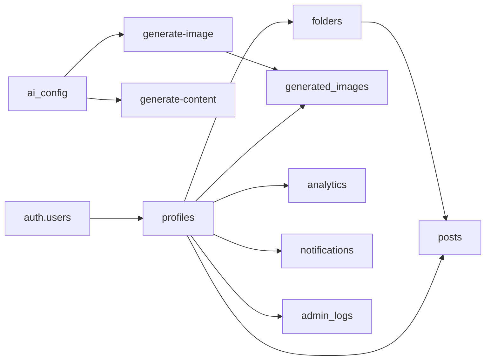

# Core Tables

<cite>
**Referenced Files in This Document**
- [20240001000000_initial_schema.sql](file://supabase/migrations/20240001000000_initial_schema.sql)
- [seed.sql](file://supabase/seed.sql)
- [generate-content/index.ts](file://supabase/functions/generate-content/index.ts)
- [generate-image/index.ts](file://supabase/functions/generate-image/index.ts)
- [supabase.ts (mobile)](file://apps/mobile/src/services/supabase.ts)
- [supabase.ts (admin)](file://apps/admin/src/lib/supabase.ts)
</cite>

## Table of Contents
1. Introduction
2. Project Structure
3. Core Components
4. Architecture Overview
5. Detailed Component Analysis
6. Dependency Analysis
7. Performance Considerations
8. Troubleshooting Guide
9. Conclusion

## Introduction
This document describes the core database tables that power SocialPilot AI Pro, focusing on profiles, posts, folders, templates, generated_images, analytics, notifications, and admin_logs. It explains each table’s fields, data types, constraints, indexes, and business rules, and shows how these tables collaborate to support user management, content creation and scheduling, AI integration, and administrative oversight.

## Project Structure
The database schema is defined in a single migration file with row-level security policies and triggers. Seed data initializes configuration and starter templates. Serverless functions integrate with external AI providers and persist results back to the database.

**Diagram sources**
- [20240001000000_initial_schema.sql:15-153](file://supabase/migrations/20240001000000_initial_schema.sql#L15-L153)
- [generate-content/index.ts:38-83](file://supabase/functions/generate-content/index.ts#L38-L83)
- [generate-image/index.ts:64-74](file://supabase/functions/generate-image/index.ts#L64-L74)
- [supabase.ts (admin):1-13](file://apps/admin/src/lib/supabase.ts#L1-L13)
- [supabase.ts (mobile):1-40](file://apps/mobile/src/services/supabase.ts#L1-L40)

**Section sources**
- [20240001000000_initial_schema.sql:1-232](file://supabase/migrations/20240001000000_initial_schema.sql#L1-L232)
- [seed.sql:1-17](file://supabase/seed.sql#L1-L17)

## Core Components
- Profiles: User accounts with roles and subscription tiers; linked to auth.users via foreign key.
- Folders: Content organization per user.
- Posts: Content items with multi-platform arrays, scheduling, and status tracking.
- Templates: Reusable prompt formats for content generation.
- Generated Images: AI-generated assets stored with prompts and metadata.
- Analytics: Daily aggregated usage metrics per user.
- Notifications: User alerts with read state and flexible payload.
- Admin Logs: Audit trail for administrative actions.

**Section sources**
- [20240001000000_initial_schema.sql:44-153](file://supabase/migrations/20240001000000_initial_schema.sql#L44-L153)

## Architecture Overview
The system uses Supabase Postgres with Row Level Security (RLS). Clients authenticate via Supabase Auth and access data through typed clients in both admin and mobile apps. Serverless functions call external AI services and write results to the database while updating user credits. Realtime subscriptions enable live updates for key tables.

**Diagram sources**
- [generate-content/index.ts:38-83](file://supabase/functions/generate-content/index.ts#L38-L83)
- [generate-image/index.ts:64-74](file://supabase/functions/generate-image/index.ts#L64-L74)
- [20240001000000_initial_schema.sql:159-202](file://supabase/migrations/20240001000000_initial_schema.sql#L159-L202)

## Detailed Component Analysis

### Enumerations and Types
- user_role: 'user', 'admin', 'super_admin'
- subscription_tier: 'free', 'starter', 'pro', 'agency'
- post_status: 'draft', 'scheduled', 'publishing', 'published', 'failed'
- platform_type: 'instagram', 'twitter', 'linkedin', 'facebook', 'tiktok', 'threads'

These enums constrain values across tables to ensure consistency.

**Section sources**
- [20240001000000_initial_schema.sql:8-13](file://supabase/migrations/20240001000000_initial_schema.sql#L8-L13)

### app_config
Purpose: Centralized white-label settings for branding and feature toggles.

Fields:
- id: UUID primary key, auto-generated
- app_name: TEXT NOT NULL
- logo_url: TEXT
- primary_color: TEXT NOT NULL
- secondary_color: TEXT NOT NULL
- accent_color: TEXT NOT NULL
- support_email: TEXT NOT NULL
- terms_url: TEXT
- privacy_url: TEXT
- enable_revenuecat: BOOLEAN NOT NULL
- enable_social_login: BOOLEAN NOT NULL
- maintenance_mode: BOOLEAN NOT NULL
- updated_at: TIMESTAMPTZ NOT NULL

Constraints:
- Primary key on id
- All non-null fields enforced by NOT NULL

Indexes:
- None explicitly defined beyond primary key

Business Rules:
- Readable by all authenticated users
- Modifiable only by admins via RLS policy

Realtime:
- Included in realtime publication

**Section sources**
- [20240001000000_initial_schema.sql:15-29](file://supabase/migrations/20240001000000_initial_schema.sql#L15-L29)
- [20240001000000_initial_schema.sql:159-172](file://supabase/migrations/20240001000000_initial_schema.sql#L159-L172)
- [20240001000000_initial_schema.sql:228-232](file://supabase/migrations/20240001000000_initial_schema.sql#L228-L232)

### ai_config
Purpose: Centralized AI provider and model configuration used by serverless functions.

Fields:
- id: UUID primary key
- text_provider: TEXT NOT NULL
- text_model: TEXT NOT NULL
- image_provider: TEXT NOT NULL
- image_model: TEXT NOT NULL
- max_tokens: INTEGER NOT NULL
- temperature: NUMERIC(3,2) NOT NULL
- system_prompt: TEXT NOT NULL
- updated_at: TIMESTAMPTZ NOT NULL

Constraints:
- Primary key on id
- All non-null fields enforced

Indexes:
- None beyond primary key

Business Rules:
- Readable by all authenticated users
- Modifiable only by admins via RLS policy

Usage:
- Consumed by generate-content function to configure prompts and generation parameters

**Section sources**
- [20240001000000_initial_schema.sql:32-42](file://supabase/migrations/20240001000000_initial_schema.sql#L32-L42)
- [20240001000000_initial_schema.sql:174-176](file://supabase/migrations/20240001000000_initial_schema.sql#L174-L176)
- [generate-content/index.ts:38-47](file://supabase/functions/generate-content/index.ts#L38-L47)

### profiles
Purpose: User account records linked to Supabase Auth.users.

Fields:
- id: UUID primary key referencing auth.users(id) ON DELETE CASCADE
- email: TEXT NOT NULL UNIQUE
- full_name: TEXT
- avatar_url: TEXT
- role: user_role NOT NULL DEFAULT 'user'
- subscription_tier: subscription_tier NOT NULL DEFAULT 'free'
- credits_remaining: INTEGER NOT NULL DEFAULT 50
- credits_limit: INTEGER NOT NULL DEFAULT 50
- is_suspended: BOOLEAN NOT NULL DEFAULT false
- onboarding_completed: BOOLEAN NOT NULL DEFAULT false
- created_at: TIMESTAMPTZ NOT NULL DEFAULT NOW()
- updated_at: TIMESTAMPTZ NOT NULL DEFAULT NOW()

Constraints:
- Primary key on id
- Unique email
- Foreign key to auth.users with cascade delete

Indexes:
- Primary key index on id
- Unique index on email

Business Rules:
- Users can read/update their own profile; admins have full access
- Automatic profile creation on user signup via trigger

Realtime:
- Not included in realtime publication by default

**Section sources**
- [20240001000000_initial_schema.sql:44-58](file://supabase/migrations/20240001000000_initial_schema.sql#L44-L58)
- [20240001000000_initial_schema.sql:61-69](file://supabase/migrations/20240001000000_initial_schema.sql#L61-L69)
- [20240001000000_initial_schema.sql:178-180](file://supabase/migrations/20240001000000_initial_schema.sql#L178-L180)
- [20240001000000_initial_schema.sql:208-225](file://supabase/migrations/20240001000000_initial_schema.sql#L208-L225)

### folders
Purpose: Per-user content organization containers.

Fields:
- id: UUID primary key
- user_id: UUID NOT NULL referencing profiles(id) ON DELETE CASCADE
- name: TEXT NOT NULL
- color: TEXT DEFAULT '#4F46E5'
- created_at: TIMESTAMPTZ NOT NULL DEFAULT NOW()

Constraints:
- Primary key on id
- Foreign key to profiles with cascade delete

Indexes:
- Primary key index on id

Business Rules:
- Users manage only their own folders via RLS

**Section sources**
- [20240001000000_initial_schema.sql:72-78](file://supabase/migrations/20240001000000_initial_schema.sql#L72-L78)
- [20240001000000_initial_schema.sql:185-186](file://supabase/migrations/20240001000000_initial_schema.sql#L185-L186)

### posts
Purpose: Core content entities supporting multi-platform publishing and scheduling.

Fields:
- id: UUID primary key
- user_id: UUID NOT NULL referencing profiles(id) ON DELETE CASCADE
- folder_id: UUID referencing folders(id) ON DELETE SET NULL
- title: TEXT NOT NULL DEFAULT ''
- content: TEXT NOT NULL
- hashtags: TEXT[] DEFAULT '{}'
- media_urls: TEXT[] DEFAULT '{}'
- platforms: platform_type[] NOT NULL DEFAULT '{instagram}'
- status: post_status NOT NULL DEFAULT 'draft'
- scheduled_at: TIMESTAMPTZ
- published_at: TIMESTAMPTZ
- error_message: TEXT
- created_at: TIMESTAMPTZ NOT NULL DEFAULT NOW()
- updated_at: TIMESTAMPTZ NOT NULL DEFAULT NOW()

Constraints:
- Primary key on id
- Foreign keys to profiles and folders
- Arrays for hashtags, media_urls, platforms

Indexes:
- Primary key index on id

Business Rules:
- Users manage only their own posts; admins can moderate via RLS
- Status transitions reflect lifecycle from draft to published or failed

Realtime:
- Included in realtime publication

**Section sources**
- [20240001000000_initial_schema.sql:81-96](file://supabase/migrations/20240001000000_initial_schema.sql#L81-L96)
- [20240001000000_initial_schema.sql:182-183](file://supabase/migrations/20240001000000_initial_schema.sql#L182-L183)
- [20240001000000_initial_schema.sql:228-232](file://supabase/migrations/20240001000000_initial_schema.sql#L228-L232)

### templates
Purpose: Reusable prompt templates for generating content.

Fields:
- id: UUID primary key
- title: TEXT NOT NULL
- category: TEXT NOT NULL
- prompt_template: TEXT NOT NULL
- default_hashtags: TEXT[] DEFAULT '{}'
- suggested_platform: platform_type NOT NULL DEFAULT 'instagram'
- is_premium: BOOLEAN NOT NULL DEFAULT false
- is_active: BOOLEAN NOT NULL DEFAULT true
- created_at: TIMESTAMPTZ NOT NULL DEFAULT NOW()

Constraints:
- Primary key on id

Indexes:
- Primary key index on id

Business Rules:
- Authenticated users can read active templates; admins manage all
- Used by content generation workflows to standardize outputs

Realtime:
- Included in realtime publication

**Section sources**
- [20240001000000_initial_schema.sql:98-109](file://supabase/migrations/20240001000000_initial_schema.sql#L98-L109)
- [20240001000000_initial_schema.sql:188-190](file://supabase/migrations/20240001000000_initial_schema.sql#L188-L190)
- [20240001000000_initial_schema.sql:228-232](file://supabase/migrations/20240001000000_initial_schema.sql#L228-L232)

### generated_images
Purpose: Stores AI-generated images along with prompts and metadata.

Fields:
- id: UUID primary key
- user_id: UUID NOT NULL referencing profiles(id) ON DELETE CASCADE
- prompt: TEXT NOT NULL
- image_url: TEXT NOT NULL
- aspect_ratio: TEXT NOT NULL DEFAULT '1:1'
- style: TEXT NOT NULL DEFAULT 'digital-art'
- created_at: TIMESTAMPTZ NOT NULL DEFAULT NOW()

Constraints:
- Primary key on id
- Foreign key to profiles with cascade delete

Indexes:
- Primary key index on id

Business Rules:
- Users manage only their own generated images via RLS
- Created by generate-image function after calling external image provider

**Section sources**
- [20240001000000_initial_schema.sql:112-120](file://supabase/migrations/20240001000000_initial_schema.sql#L112-L120)
- [20240001000000_initial_schema.sql:192-193](file://supabase/migrations/20240001000000_initial_schema.sql#L192-L193)
- [generate-image/index.ts:64-71](file://supabase/functions/generate-image/index.ts#L64-L71)

### analytics
Purpose: Daily aggregated usage metrics per user.

Fields:
- id: UUID primary key
- user_id: UUID NOT NULL referencing profiles(id) ON DELETE CASCADE
- total_posts_created: INTEGER NOT NULL DEFAULT 0
- total_posts_scheduled: INTEGER NOT NULL DEFAULT 0
- total_ai_generations: INTEGER NOT NULL DEFAULT 0
- credits_used: INTEGER NOT NULL DEFAULT 0
- date: DATE NOT NULL DEFAULT CURRENT_DATE

Constraints:
- Primary key on id
- Unique constraint on (user_id, date)

Indexes:
- Primary key index on id
- Unique index on (user_id, date)

Business Rules:
- Users manage their own analytics; admins can view all
- Aggregates daily activity for reporting and billing considerations

**Section sources**
- [20240001000000_initial_schema.sql:123-132](file://supabase/migrations/20240001000000_initial_schema.sql#L123-L132)
- [20240001000000_initial_schema.sql:198-199](file://supabase/migrations/20240001000000_initial_schema.sql#L198-L199)

### notifications
Purpose: User-facing alerts with read state and flexible payload.

Fields:
- id: UUID primary key
- user_id: UUID NOT NULL referencing profiles(id) ON DELETE CASCADE
- title: TEXT NOT NULL
- message: TEXT NOT NULL
- is_read: BOOLEAN NOT NULL DEFAULT false
- data: JSONB DEFAULT '{}'
- created_at: TIMESTAMPTZ NOT NULL DEFAULT NOW()

Constraints:
- Primary key on id
- Foreign key to profiles with cascade delete

Indexes:
- Primary key index on id

Business Rules:
- Users manage only their own notifications via RLS
- JSONB allows flexible alert payloads

Realtime:
- Included in realtime publication

**Section sources**
- [20240001000000_initial_schema.sql:135-143](file://supabase/migrations/20240001000000_initial_schema.sql#L135-L143)
- [20240001000000_initial_schema.sql:195-196](file://supabase/migrations/20240001000000_initial_schema.sql#L195-L196)
- [20240001000000_initial_schema.sql:228-232](file://supabase/migrations/20240001000000_initial_schema.sql#L228-L232)

### admin_logs
Purpose: Audit trail for administrative actions.

Fields:
- id: UUID primary key
- admin_id: UUID NOT NULL referencing profiles(id) ON DELETE CASCADE
- action: TEXT NOT NULL
- target_resource: TEXT NOT NULL
- details: JSONB DEFAULT '{}'
- created_at: TIMESTAMPTZ NOT NULL DEFAULT NOW()

Constraints:
- Primary key on id
- Foreign key to profiles with cascade delete

Indexes:
- Primary key index on id

Business Rules:
- Only admins can read/write via RLS
- JSONB captures structured details about the action

**Section sources**
- [20240001000000_initial_schema.sql:146-153](file://supabase/migrations/20240001000000_initial_schema.sql#L146-L153)
- [20240001000000_initial_schema.sql:201-202](file://supabase/migrations/20240001000000_initial_schema.sql#L201-L202)

### Relationships Overview

**Diagram sources**
- [20240001000000_initial_schema.sql:44-153](file://supabase/migrations/20240001000000_initial_schema.sql#L44-L153)

## Dependency Analysis
- profiles depends on auth.users for identity linkage.
- posts references profiles and optionally folders.
- generated_images, analytics, notifications, and admin_logs reference profiles.
- ai_config drives serverless functions for content and image generation.
- RLS policies enforce data isolation per user and admin privileges.

**Diagram sources**
- [20240001000000_initial_schema.sql:44-153](file://supabase/migrations/20240001000000_initial_schema.sql#L44-L153)
- [generate-content/index.ts:38-83](file://supabase/functions/generate-content/index.ts#L38-L83)
- [generate-image/index.ts:64-74](file://supabase/functions/generate-image/index.ts#L64-L74)

**Section sources**
- [20240001000000_initial_schema.sql:159-202](file://supabase/migrations/20240001000000_initial_schema.sql#L159-L202)

## Performance Considerations
- Use appropriate indexes where queries filter frequently (e.g., user_id, date, status).
- Keep arrays small to avoid bloating rows; consider normalization if lists grow large.
- Leverage realtime subscriptions sparingly; include only necessary tables.
- Batch updates for analytics to reduce write overhead.
- Monitor credit decrement operations to prevent contention under load.

[No sources needed since this section provides general guidance]

## Troubleshooting Guide
Common issues and resolutions:
- Unauthorized access: Ensure client is authenticated and RLS policies allow the operation.
- Missing AI configuration: Verify ai_config exists and contains required fields; check environment variables for API keys.
- Credit deduction failures: Confirm the RPC or logic for decrementing credits is available and invoked correctly.
- Realtime not updating: Check realtime publication includes the relevant tables.

**Section sources**
- [generate-content/index.ts:21-36](file://supabase/functions/generate-content/index.ts#L21-L36)
- [generate-image/index.ts:21-36](file://supabase/functions/generate-image/index.ts#L21-L36)
- [20240001000000_initial_schema.sql:228-232](file://supabase/migrations/20240001000000_initial_schema.sql#L228-L232)

## Conclusion
The core tables provide a robust foundation for SocialPilot AI Pro, enabling secure user management, organized content creation, AI-driven asset generation, and comprehensive administrative oversight. Row-level security ensures data isolation, while serverless functions integrate external AI capabilities and persist outcomes. Proper indexing and thoughtful schema design support scalability and maintainability.

[No sources needed since this section summarizes without analyzing specific files]