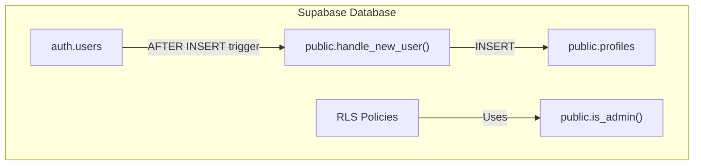
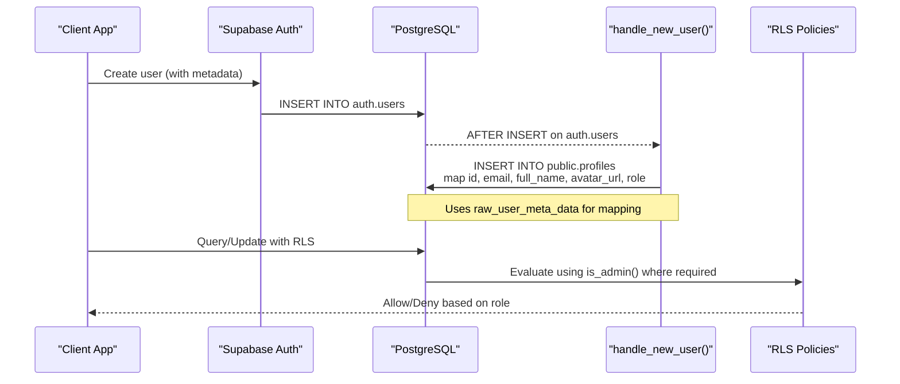
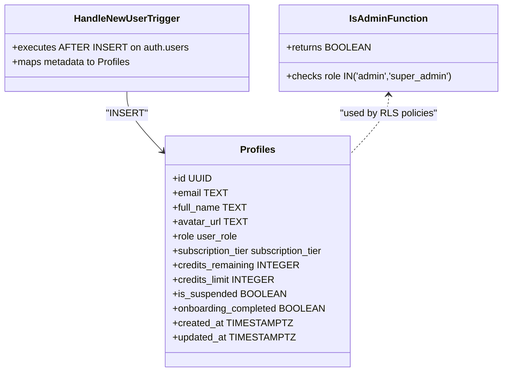
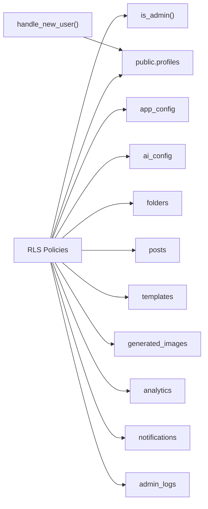

# Database Functions & Triggers

<cite>
**Referenced Files in This Document**
- [initial_schema.sql](file://supabase/migrations/20240001000000_initial_schema.sql)
- [seed.sql](file://supabase/seed.sql)
</cite>

## Table of Contents
1. [Introduction](#introduction)
2. [Project Structure](#project-structure)
3. [Core Components](#core-components)
4. [Architecture Overview](#architecture-overview)
5. [Detailed Component Analysis](#detailed-component-analysis)
6. [Dependency Analysis](#dependency-analysis)
7. [Performance Considerations](#performance-considerations)
8. [Troubleshooting Guide](#troubleshooting-guide)
9. [Conclusion](#conclusion)
10. [Appendices](#appendices)

## Introduction
This document explains the database-level business logic implemented via functions and triggers in the project’s Supabase schema. It focuses on:
- The handle_new_user() trigger function that automatically creates user profiles when new users sign up, including field mapping from auth.users metadata.
- The is_admin() function used for role-based access control checks within Row Level Security policies.
- Guidance for creating additional functions and triggers, performance considerations, debugging techniques, error handling patterns, and logging strategies for database operations.

Note: A stored procedure named decrement_user_credits does not exist in the current codebase. Credit management is currently performed by direct updates to the profiles table from application code.

## Project Structure
Database definitions are centralized under supabase/migrations. The initial schema defines tables, enums, helper functions, row-level security policies, and a signup trigger. Seed data is provided separately.

**Diagram sources**
- [initial_schema.sql:61-69](file://supabase/migrations/20240001000000_initial_schema.sql#L61-L69)
- [initial_schema.sql:170-202](file://supabase/migrations/20240001000000_initial_schema.sql#L170-L202)
- [initial_schema.sql:208-225](file://supabase/migrations/20240001000000_initial_schema.sql#L208-L225)

**Section sources**
- [initial_schema.sql:1-232](file://supabase/migrations/20240001000000_initial_schema.sql#L1-L232)
- [seed.sql:1-17](file://supabase/seed.sql#L1-L17)

## Core Components
- is_admin(): A SECURITY DEFINER function that returns true if the current authenticated user has an admin or super_admin role in public.profiles. Used extensively in RLS policies to restrict sensitive operations to admins.
- handle_new_user(): A trigger function executed after inserting into auth.users. It creates a corresponding profile in public.profiles, mapping fields from auth.users metadata.
- RLS Policies: Enforce per-user and admin-only access across tables using is_admin().

Key responsibilities:
- Role checks at the database boundary (is_admin).
- Automatic profile creation on signup (handle_new_user).
- Consistent access control via RLS policies.

**Section sources**
- [initial_schema.sql:61-69](file://supabase/migrations/20240001000000_initial_schema.sql#L61-L69)
- [initial_schema.sql:170-202](file://supabase/migrations/20240001000000_initial_schema.sql#L170-L202)
- [initial_schema.sql:208-225](file://supabase/migrations/20240001000000_initial_schema.sql#L208-L225)

## Architecture Overview
The signup flow and admin checks are enforced at the database layer:

**Diagram sources**
- [initial_schema.sql:208-225](file://supabase/migrations/20240001000000_initial_schema.sql#L208-L225)
- [initial_schema.sql:61-69](file://supabase/migrations/20240001000000_initial_schema.sql#L61-L69)
- [initial_schema.sql:170-202](file://supabase/migrations/20240001000000_initial_schema.sql#L170-L202)

## Detailed Component Analysis

### handle_new_user() Trigger Function
Purpose:
- Automatically create a public.profiles record when a new user signs up via auth.users.
- Map fields from auth.users metadata to profile fields.

Field mapping:
- id: from NEW.id
- email: from NEW.email
- full_name: from NEW.raw_user_meta_data->>'full_name'
- avatar_url: from NEW.raw_user_meta_data->>'avatar_url'
- role: from NEW.raw_user_meta_data->>'role', cast to user_role; defaults to 'user' if missing

Behavior:
- Runs as SECURITY DEFINER to ensure it can insert into public.profiles even if RLS would otherwise block the caller during signup.
- Returns NEW to continue the trigger chain.

Best practices observed:
- Use COALESCE to provide a safe default for role.
- Keep trigger logic minimal and deterministic to avoid side effects.

Error handling:
- If metadata fields are missing, they will be NULL unless constrained NOT NULL. Ensure constraints allow NULLs for optional fields or add validation upstream.

Performance:
- Single INSERT per signup; negligible overhead.
- Avoid heavy computations or external calls inside triggers.

Debugging tips:
- Inspect raw_user_meta_data values during signup to confirm correct keys.
- Verify that the trigger exists and is enabled.
- Check for constraint violations (e.g., duplicate id or email) and fix upstream metadata.

**Section sources**
- [initial_schema.sql:208-225](file://supabase/migrations/20240001000000_initial_schema.sql#L208-L225)

#### Class-like view of components involved

**Diagram sources**
- [initial_schema.sql:45-58](file://supabase/migrations/20240001000000_initial_schema.sql#L45-L58)
- [initial_schema.sql:61-69](file://supabase/migrations/20240001000000_initial_schema.sql#L61-L69)
- [initial_schema.sql:208-225](file://supabase/migrations/20240001000000_initial_schema.sql#L208-L225)

### is_admin() Function
Purpose:
- Provide a reusable check for whether the current authenticated user has administrative privileges.

Implementation details:
- Checks if the current user (auth.uid()) exists in public.profiles with role in ('admin', 'super_admin').
- Declared as SECURITY DEFINER so RLS policies can rely on it consistently.

Usage:
- Referenced in multiple RLS policies to restrict updates or administrative actions to admins.

Security considerations:
- Because it is SECURITY DEFINER, ensure it only performs read checks against trusted tables and does not expose privileged writes.

Performance:
- Simple EXISTS query; efficient with appropriate indexes on profiles(id, role).

**Section sources**
- [initial_schema.sql:61-69](file://supabase/migrations/20240001000000_initial_schema.sql#L61-L69)
- [initial_schema.sql:170-202](file://supabase/migrations/20240001000000_initial_schema.sql#L170-L202)

### Credit Management
Current state:
- There is no stored procedure named decrement_user_credits in the repository.
- Credits are tracked in profiles.credits_remaining and updated directly from application code (e.g., adding credits via update queries).

Recommendation:
- To centralize credit changes and enforce consistency, consider implementing a stored procedure or function that:
  - Validates inputs (user_id, amount, reason).
  - Applies atomic updates to credits_remaining and related analytics.
  - Logs changes to admin_logs for auditability.
  - Enforces business rules (e.g., cannot go below zero without approval).

If you choose to implement such a function later, place it in a migration file alongside other database functions and call it from your API layer.

**Section sources**
- [initial_schema.sql:45-58](file://supabase/migrations/20240001000000_initial_schema.sql#L45-L58)

## Dependency Analysis
- RLS policies depend on is_admin() to gate admin-only operations.
- The handle_new_user() trigger depends on auth.users metadata structure and inserts into public.profiles.
- Tables referenced by policies include app_config, ai_config, profiles, folders, posts, templates, generated_images, analytics, notifications, and admin_logs.

**Diagram sources**
- [initial_schema.sql:61-69](file://supabase/migrations/20240001000000_initial_schema.sql#L61-L69)
- [initial_schema.sql:170-202](file://supabase/migrations/20240001000000_initial_schema.sql#L170-L202)
- [initial_schema.sql:208-225](file://supabase/migrations/20240001000000_initial_schema.sql#L208-L225)

**Section sources**
- [initial_schema.sql:159-202](file://supabase/migrations/20240001000000_initial_schema.sql#L159-L202)

## Performance Considerations
- Keep triggers lightweight: handle_new_user() performs a single INSERT; avoid loops or external calls.
- Indexing: Ensure indexes on frequently filtered columns (e.g., profiles.role, profiles.id) to speed up is_admin() and policy evaluations.
- Batch operations: When updating credits or analytics, prefer set-based operations to reduce round trips.
- Realtime subscriptions: Only enable realtime for tables that need live updates to minimize overhead.

[No sources needed since this section provides general guidance]

## Troubleshooting Guide
Common issues and resolutions:
- Missing profile after signup:
  - Verify the trigger on_auth_user_created exists and is enabled.
  - Confirm that auth.users contains expected metadata fields (full_name, avatar_url, role).
  - Check for constraint violations (duplicate id/email) and resolve upstream data issues.

- Admin actions denied unexpectedly:
  - Ensure the user’s role in profiles is set to admin or super_admin.
  - Confirm RLS policies reference is_admin() correctly and are enabled.

- Debugging triggers and functions:
  - Temporarily log intermediate values to a temporary table or use RAISE NOTICE in development environments.
  - Test with known inputs and inspect errors returned by Supabase client.

- Error handling patterns:
  - For future stored procedures, wrap critical sections in exception blocks to capture and return meaningful errors.
  - Log failures to admin_logs for auditability.

- Logging strategies:
  - Use admin_logs to record significant admin actions (who did what, when, and why).
  - For high-volume events, consider batching logs or using a dedicated audit table with time-based partitioning.

**Section sources**
- [initial_schema.sql:208-225](file://supabase/migrations/20240001000000_initial_schema.sql#L208-L225)
- [initial_schema.sql:145-153](file://supabase/migrations/20240001000000_initial_schema.sql#L145-L153)

## Conclusion
The database layer enforces core business rules through:
- A robust signup trigger that auto-creates user profiles from auth metadata.
- A secure is_admin() helper used consistently across RLS policies to protect admin-only operations.
While credit management is currently handled in application code, centralizing such logic in database functions or procedures can improve consistency, auditability, and safety. Adopt the best practices outlined above when extending the database layer.

[No sources needed since this section summarizes without analyzing specific files]

## Appendices

### Creating Additional Functions and Triggers: Best Practices
- Place all database changes in migrations to maintain version control and reproducibility.
- Prefer functions over ad-hoc SQL in applications for complex logic to ensure consistency.
- Use SECURITY DEFINER judiciously; limit privileges and scope.
- Validate inputs and enforce constraints at the database level.
- Add comprehensive logging to admin_logs for audit trails.
- Keep triggers small and focused; offload heavy work to background jobs if necessary.

[No sources needed since this section provides general guidance]