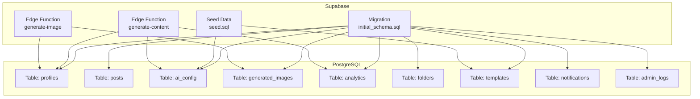
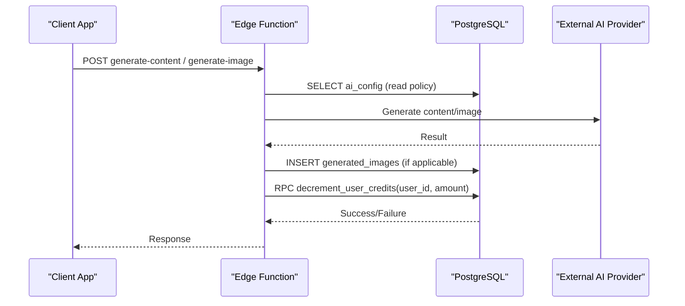
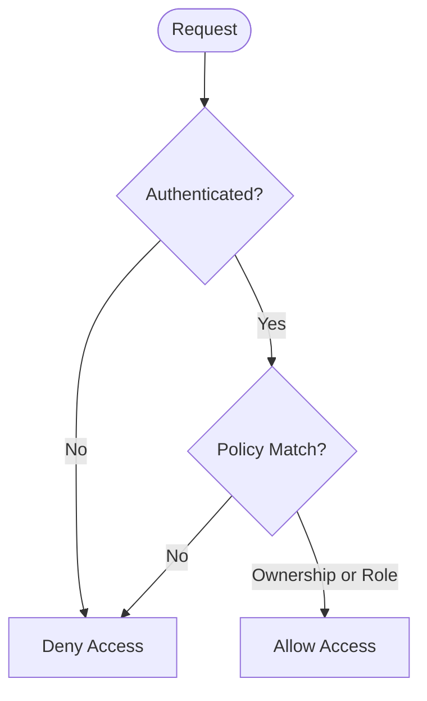
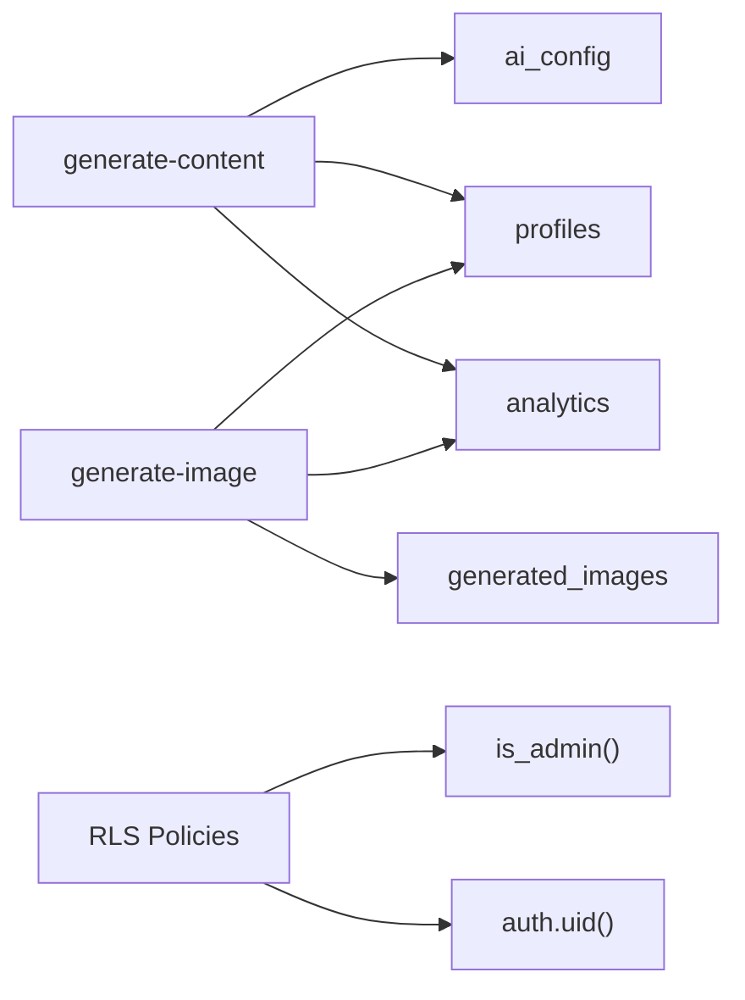

# Database Schema

<cite>
**Referenced Files in This Document**
- [20240001000000_initial_schema.sql](file://supabase/migrations/20240001000000_initial_schema.sql)
- [seed.sql](file://supabase/seed.sql)
- [generate-content/index.ts](file://supabase/functions/generate-content/index.ts)
- [generate-image/index.ts](file://supabase/functions/generate-image/index.ts)
</cite>

## Table of Contents
1. [Introduction](#introduction)
2. [Project Structure](#project-structure)
3. [Core Components](#core-components)
4. [Architecture Overview](#architecture-overview)
5. [Detailed Component Analysis](#detailed-component-analysis)
6. [Dependency Analysis](#dependency-analysis)
7. [Performance Considerations](#performance-considerations)
8. [Troubleshooting Guide](#troubleshooting-guide)
9. [Conclusion](#conclusion)
10. [Appendices](#appendices)

## Introduction
This document describes the PostgreSQL database schema managed via Supabase migrations for SocialPilot AI Pro. It covers all tables (profiles, posts, ai_config, generated_images, analytics, and related entities), their relationships, constraints, indexes, Row Level Security policies, triggers, stored procedures, and custom functions. It also provides guidance on creating new migrations, managing schema versions, performing safe updates, and optimizing performance through indexing and query strategies.

## Project Structure
The database schema is defined in a single migration file under the Supabase project, with seed data to bootstrap initial configuration and templates. Serverless Edge Functions integrate with the database to perform AI content and image generation while enforcing credit usage and analytics tracking.

**Diagram sources**
- [20240001000000_initial_schema.sql:15-153](file://supabase/migrations/20240001000000_initial_schema.sql#L15-L153)
- [seed.sql:1-17](file://supabase/seed.sql#L1-L17)
- [generate-content/index.ts:38-84](file://supabase/functions/generate-content/index.ts#L38-L84)
- [generate-image/index.ts:64-75](file://supabase/functions/generate-image/index.ts#L64-L75)

**Section sources**
- [20240001000000_initial_schema.sql:1-232](file://supabase/migrations/20240001000000_initial_schema.sql#L1-L232)
- [seed.sql:1-17](file://supabase/seed.sql#L1-L17)

## Core Components
- Enumerations: user_role, subscription_tier, post_status, platform_type define constrained values used across tables.
- Tables: app_config, ai_config, profiles, folders, posts, templates, generated_images, analytics, notifications, admin_logs.
- Relationships: Foreign keys link posts, folders, generated_images, analytics, notifications, and admin_logs to profiles; posts optionally reference folders.
- Row Level Security (RLS): Policies restrict access per user role and ownership.
- Triggers and Functions: Automatic profile creation on signup; helper function to check admin status.
- Realtime: Selected tables are included in Supabase Realtime publication.

Key responsibilities:
- Profiles: User identity and credits management.
- Posts: Content scheduling and publishing state machine.
- ai_config: Centralized AI provider/model settings.
- generated_images: Records of AI-generated images with prompts and metadata.
- analytics: Daily aggregated metrics per user.
- notifications: Per-user messaging.
- admin_logs: Audit trail for administrative actions.
- templates: Reusable prompt templates for content generation.

**Section sources**
- [20240001000000_initial_schema.sql:9-153](file://supabase/migrations/20240001000000_initial_schema.sql#L9-L153)

## Architecture Overview
The system uses RLS to enforce fine-grained access control at the database level. Edge functions authenticate users, call external AI providers, persist results, and update credits and analytics via RPC calls. A trigger ensures that when a new user signs up, a corresponding profile row is created automatically.

**Diagram sources**
- [generate-content/index.ts:38-84](file://supabase/functions/generate-content/index.ts#L38-L84)
- [generate-image/index.ts:64-75](file://supabase/functions/generate-image/index.ts#L64-L75)
- [20240001000000_initial_schema.sql:159-202](file://supabase/migrations/20240001000000_initial_schema.sql#L159-L202)

## Detailed Component Analysis

### Enumerations and Types
- user_role: user, admin, super_admin
- subscription_tier: free, starter, pro, agency
- post_status: draft, scheduled, publishing, published, failed
- platform_type: instagram, twitter, linkedin, facebook, tiktok, threads

These types constrain fields such as profiles.role, profiles.subscription_tier, posts.status, and posts.platforms/templates.suggested_platform.

**Section sources**
- [20240001000000_initial_schema.sql:9-13](file://supabase/migrations/20240001000000_initial_schema.sql#L9-L13)

### Tables and Relationships

#### app_config
- Purpose: White-label application settings.
- Primary key: id (UUID).
- Notable fields: branding colors, support email, feature toggles, timestamps.
- Access: Readable by authenticated users; modifications restricted to admins via RLS.

**Section sources**
- [20240001000000_initial_schema.sql:15-29](file://supabase/migrations/20240001000000_initial_schema.sql#L15-L29)
- [20240001000000_initial_schema.sql:171-172](file://supabase/migrations/20240001000000_initial_schema.sql#L171-L172)

#### ai_config
- Purpose: Centralized AI provider and model configuration.
- Primary key: id (UUID).
- Notable fields: text_provider, text_model, image_provider, image_model, max_tokens, temperature, system_prompt.
- Access: Readable by authenticated users; modifications restricted to admins via RLS.

**Section sources**
- [20240001000000_initial_schema.sql:32-42](file://supabase/migrations/20240001000000_initial_schema.sql#L32-L42)
- [20240001000000_initial_schema.sql:175-176](file://supabase/migrations/20240001000000_initial_schema.sql#L175-L176)

#### profiles
- Purpose: User account metadata and credits.
- Primary key: id (UUID) referencing auth.users(id) with cascade delete.
- Notable fields: email (unique), full_name, avatar_url, role, subscription_tier, credits_remaining, credits_limit, is_suspended, onboarding_completed, timestamps.
- Access: Users can read/update own profile; admins have broader access via RLS.

**Section sources**
- [20240001000000_initial_schema.sql:45-58](file://supabase/migrations/20240001000000_initial_schema.sql#L45-L58)
- [20240001000000_initial_schema.sql:179-180](file://supabase/migrations/20240001000000_initial_schema.sql#L179-L180)

#### folders
- Purpose: Organize posts into user-owned folders.
- Primary key: id (UUID).
- Foreign keys: user_id references profiles(id) with cascade delete.
- Notable fields: name, color, timestamp.
- Access: Users manage own folders via RLS.

**Section sources**
- [20240001000000_initial_schema.sql:72-78](file://supabase/migrations/20240001000000_initial_schema.sql#L72-L78)
- [20240001000000_initial_schema.sql:186](file://supabase/migrations/20240001000000_initial_schema.sql#L186)

#### posts
- Purpose: Manage social media posts with lifecycle states.
- Primary key: id (UUID).
- Foreign keys: user_id references profiles(id) with cascade delete; folder_id references folders(id) with set null on delete.
- Notable fields: title, content, hashtags (array), media_urls (array), platforms (array), status, scheduled_at, published_at, error_message, timestamps.
- Access: Users manage own posts; admins can view/moderate via RLS.

**Section sources**
- [20240001000000_initial_schema.sql:81-96](file://supabase/migrations/20240001000000_initial_schema.sql#L81-L96)
- [20240001000000_initial_schema.sql:183](file://supabase/migrations/20240001000000_initial_schema.sql#L183)

#### templates
- Purpose: Reusable prompt templates for content generation.
- Primary key: id (UUID).
- Notable fields: title, category, prompt_template, default_hashtags (array), suggested_platform, is_premium, is_active, timestamp.
- Access: Authenticated users can read active templates; admins manage all via RLS.

**Section sources**
- [20240001000000_initial_schema.sql:99-109](file://supabase/migrations/20240001000000_initial_schema.sql#L99-L109)
- [20240001000000_initial_schema.sql:189-190](file://supabase/migrations/20240001000000_initial_schema.sql#L189-L190)

#### generated_images
- Purpose: Store AI-generated images with prompts and metadata.
- Primary key: id (UUID).
- Foreign keys: user_id references profiles(id) with cascade delete.
- Notable fields: prompt, image_url, aspect_ratio, style, timestamp.
- Access: Users manage own images via RLS.

**Section sources**
- [20240001000000_initial_schema.sql:112-120](file://supabase/migrations/20240001000000_initial_schema.sql#L112-L120)
- [20240001000000_initial_schema.sql:193](file://supabase/migrations/20240001000000_initial_schema.sql#L193)

#### analytics
- Purpose: Daily aggregated metrics per user.
- Primary key: id (UUID).
- Foreign keys: user_id references profiles(id) with cascade delete.
- Notable fields: total_posts_created, total_posts_scheduled, total_ai_generations, credits_used, date (with unique constraint on user_id + date).
- Access: Users manage own analytics; admins can read all via RLS.

**Section sources**
- [20240001000000_initial_schema.sql:123-132](file://supabase/migrations/20240001000000_initial_schema.sql#L123-L132)
- [20240001000000_initial_schema.sql:199](file://supabase/migrations/20240001000000_initial_schema.sql#L199)

#### notifications
- Purpose: Per-user notifications.
- Primary key: id (UUID).
- Foreign keys: user_id references profiles(id) with cascade delete.
- Notable fields: title, message, is_read, data (JSONB), timestamp.
- Access: Users manage own notifications via RLS.

**Section sources**
- [20240001000000_initial_schema.sql:135-143](file://supabase/migrations/20240001000000_initial_schema.sql#L135-L143)
- [20240001000000_initial_schema.sql:196](file://supabase/migrations/20240001000000_initial_schema.sql#L196)

#### admin_logs
- Purpose: Audit log for administrative actions.
- Primary key: id (UUID).
- Foreign keys: admin_id references profiles(id) with cascade delete.
- Notable fields: action, target_resource, details (JSONB), timestamp.
- Access: Admins only via RLS.

**Section sources**
- [20240001000000_initial_schema.sql:146-153](file://supabase/migrations/20240001000000_initial_schema.sql#L146-L153)
- [20240001000000_initial_schema.sql:202](file://supabase/migrations/20240001000000_initial_schema.sql#L202)

### Row Level Security (RLS) Policies
- All core tables are enabled for RLS.
- Policies enforce:
  - Authenticated read access to app_config and ai_config.
  - Admin-only write access to app_config and ai_config.
  - User self-service for profiles, folders, posts, generated_images, notifications.
  - Admin-wide access for analytics and admin_logs.
  - Template visibility limited to active entries for non-admins.

**Diagram sources**
- [20240001000000_initial_schema.sql:159-202](file://supabase/migrations/20240001000000_initial_schema.sql#L159-L202)

**Section sources**
- [20240001000000_initial_schema.sql:159-202](file://supabase/migrations/20240001000000_initial_schema.sql#L159-L202)

### Triggers and Stored Procedures

#### handle_new_user Trigger
- Automatically creates a profile row when a new user is inserted into auth.users.
- Copies email, full_name, avatar_url, and sets role from raw_user_meta_data if provided.

**Section sources**
- [20240001000000_initial_schema.sql:208-225](file://supabase/migrations/20240001000000_initial_schema.sql#L208-L225)

#### is_admin Helper Function
- Returns true if the current user has admin or super_admin role in profiles.
- Used by RLS policies to grant elevated privileges.

**Section sources**
- [20240001000000_initial_schema.sql:61-69](file://supabase/migrations/20240001000000_initial_schema.sql#L61-L69)

#### decrement_user_credits RPC
- Referenced by Edge Functions to deduct credits after AI operations.
- Note: The function definition is not present in the current migration file; it must be created separately before use.

**Section sources**
- [generate-content/index.ts:83](file://supabase/functions/generate-content/index.ts#L83)
- [generate-image/index.ts:74](file://supabase/functions/generate-image/index.ts#L74)

### Seed Data
- Inserts default app_config and ai_config values if not present.
- Seeds starter templates for content generation.

**Section sources**
- [seed.sql:1-17](file://supabase/seed.sql#L1-L17)

## Dependency Analysis
- Edge functions depend on ai_config for provider/model settings and on profiles for credit accounting.
- Generated images are persisted to generated_images and tied to profiles via foreign keys.
- Analytics are updated indirectly via RPC calls triggered by AI operations.
- RLS policies rely on the is_admin function and auth.uid() to enforce access.

**Diagram sources**
- [generate-content/index.ts:38-84](file://supabase/functions/generate-content/index.ts#L38-L84)
- [generate-image/index.ts:64-75](file://supabase/functions/generate-image/index.ts#L64-L75)
- [20240001000000_initial_schema.sql:61-69](file://supabase/migrations/20240001000000_initial_schema.sql#L61-L69)
- [20240001000000_initial_schema.sql:159-202](file://supabase/migrations/20240001000000_initial_schema.sql#L159-L202)

**Section sources**
- [generate-content/index.ts:38-84](file://supabase/functions/generate-content/index.ts#L38-L84)
- [generate-image/index.ts:64-75](file://supabase/functions/generate-image/index.ts#L64-L75)
- [20240001000000_initial_schema.sql:61-69](file://supabase/migrations/20240001000000_initial_schema.sql#L61-L69)
- [20240001000000_initial_schema.sql:159-202](file://supabase/migrations/20240001000000_initial_schema.sql#L159-L202)

## Performance Considerations
- Indexing Strategy:
  - Add indexes on frequently filtered columns:
    - posts.user_id, posts.folder_id, posts.status, posts.scheduled_at, posts.published_at.
    - generated_images.user_id, generated_images.created_at.
    - analytics.user_id, analytics.date.
    - notifications.user_id, notifications.is_read, notifications.created_at.
    - folders.user_id.
    - templates.category, templates.is_active.
  - Composite indexes for common queries:
    - posts(user_id, status), posts(user_id, scheduled_at), analytics(user_id, date).
- Query Optimization:
  - Use selective WHERE clauses and avoid SELECT * where possible.
  - Leverage arrays efficiently; considerGIN indexes for array containment queries if needed.
  - Partition analytics by date ranges if growth is large.
- Realtime:
  - Only necessary tables are included in the realtime publication to reduce overhead.
- Constraints:
  - Unique constraints (e.g., analytics.user_id + date) prevent duplicates and improve integrity.

[No sources needed since this section provides general guidance]

## Troubleshooting Guide
- Missing decrement_user_credits function:
  - Symptoms: RPC errors when calling generate-content or generate-image.
  - Resolution: Create the function in a new migration to safely decrement credits and update analytics.
- RLS Policy Errors:
  - Symptoms: Permission denied when accessing tables.
  - Resolution: Verify user authentication context and ensure policies allow the intended operation based on ownership or role.
- Trigger Issues:
  - Symptoms: Profile not created on signup.
  - Resolution: Confirm the on_auth_user_created trigger exists and is attached to auth.users.

**Section sources**
- [generate-content/index.ts:83](file://supabase/functions/generate-content/index.ts#L83)
- [generate-image/index.ts:74](file://supabase/functions/generate-image/index.ts#L74)
- [20240001000000_initial_schema.sql:159-202](file://supabase/migrations/20240001000000_initial_schema.sql#L159-L202)
- [20240001000000_initial_schema.sql:208-225](file://supabase/migrations/20240001000000_initial_schema.sql#L208-L225)

## Conclusion
The schema provides a robust foundation for user management, content scheduling, AI-driven generation, and analytics. RLS ensures secure multi-tenant isolation, while triggers and functions streamline user onboarding and administrative checks. To maintain scalability and reliability, implement recommended indexes, create the missing decrement_user_credits function, and follow best practices for migrations and safe updates.

[No sources needed since this section summarizes without analyzing specific files]

## Appendices

### Creating New Migrations
- Add a new SQL file under supabase/migrations with a descriptive timestamped name.
- Ensure idempotency using IF NOT EXISTS and ON CONFLICT DO NOTHING where appropriate.
- Test locally with Supabase CLI before pushing to production.

**Section sources**
- [20240001000000_initial_schema.sql:1-232](file://supabase/migrations/20240001000000_initial_schema.sql#L1-L232)

### Managing Schema Versions
- Maintain one migration per logical change.
- Keep migrations additive; avoid destructive changes unless carefully planned.
- Use seed.sql for non-sensitive defaults and starter data.

**Section sources**
- [seed.sql:1-17](file://supabase/seed.sql#L1-L17)

### Performing Safe Database Updates
- Back up the database before applying migrations in production.
- Apply migrations during low-traffic windows.
- Validate schema changes with tests and smoke checks.
- Roll back plan: prepare reverse migrations if necessary.

[No sources needed since this section provides general guidance]

### Decrement User Credits Function (Recommended Implementation Notes)
- Create an RPC function named decrement_user_credits that:
  - Accepts user_id and amount parameters.
  - Validates permissions (user can decrement own credits; admins can decrement any).
  - Ensures credits do not go below zero.
  - Updates profiles.credits_remaining and increments analytics.credits_used for the current date.
  - Uses transactions to ensure consistency.

[No sources needed since this section provides general guidance]