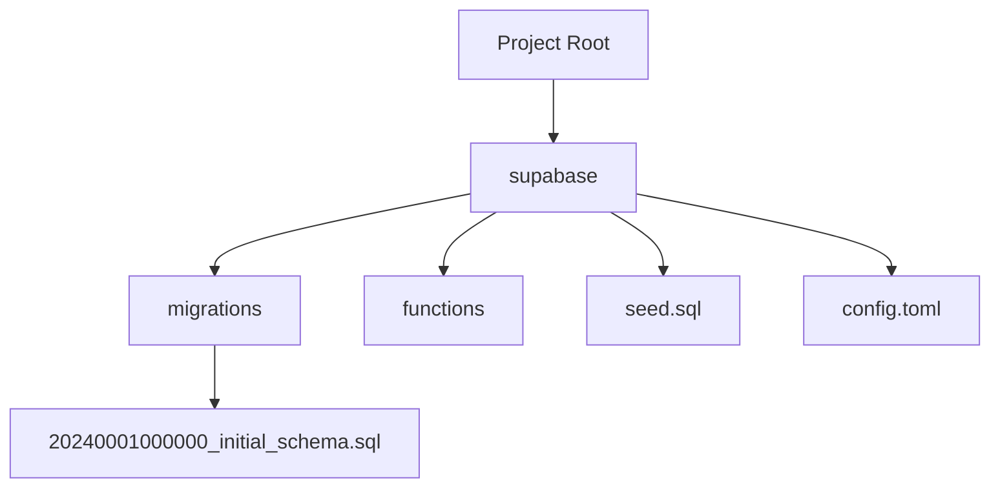
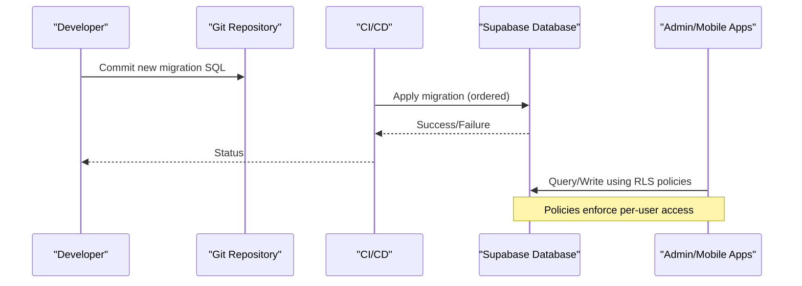
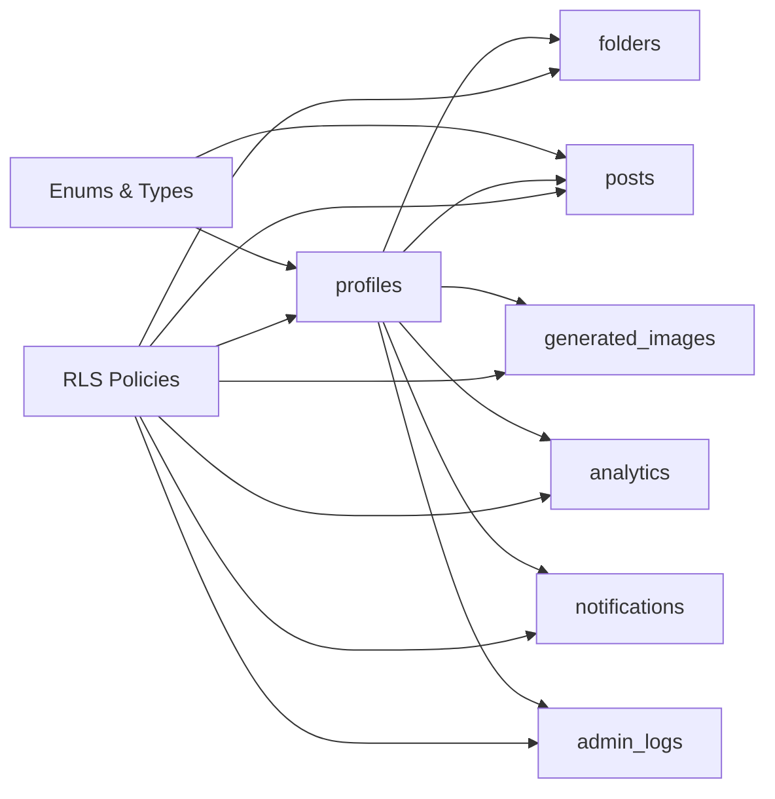

# Migrations & Schema Management

<cite>
**Referenced Files in This Document**
- [20240001000000_initial_schema.sql](file://supabase/migrations/20240001000000_initial_schema.sql)
- [seed.sql](file://supabase/seed.sql)
- [config.toml](file://supabase/config.toml)
- [INSTALLATION.md](file://INSTALLATION.md)
- [setup-all.cjs](file://scripts/setup-all.cjs)
</cite>

## Table of Contents
1. Introduction
2. Project Structure
3. Core Components
4. Architecture Overview
5. Detailed Component Analysis
6. Dependency Analysis
7. Performance Considerations
8. Troubleshooting Guide
9. Conclusion
10. Appendices

## Introduction
This document provides comprehensive guidance for managing database migrations and schema changes using Supabase migrations in this project. It covers naming conventions, versioning strategy, deployment procedures, creating new migrations (schema changes, columns, constraints, data updates), rollback strategies, testing approaches, safe production deployments, best practices (idempotency, data preservation, coordinating with app releases), and common scenarios such as adding tables, modifying relationships, and optimizing queries via indexing.

## Project Structure
The database schema and seed data are managed under the supabase directory:
- Migrations: SQL files that define or evolve the schema and security policies.
- Seed data: Initial configuration and starter records.
- Local config: Placeholder for local Supabase configuration.

**Diagram sources**
- [20240001000000_initial_schema.sql:1-232](file://supabase/migrations/20240001000000_initial_schema.sql#L1-L232)
- [seed.sql:1-17](file://supabase/seed.sql#L1-L17)
- [config.toml:1-2](file://supabase/config.toml#L1-L2)

**Section sources**
- [20240001000000_initial_schema.sql:1-232](file://supabase/migrations/20240001000000_initial_schema.sql#L1-L232)
- [seed.sql:1-17](file://supabase/seed.sql#L1-L17)
- [config.toml:1-2](file://supabase/config.toml#L1-L2)

## Core Components
- Migration file: The initial schema defines enums, core tables, row-level security policies, triggers, and realtime publications.
- Seed file: Inserts default application configuration and starter templates safely using upsert semantics.
- Installation guide: Describes how to run migration and seed scripts manually via the Supabase SQL Editor.

Key responsibilities:
- Define a stable, secure, and extensible schema.
- Enforce access control through Row Level Security.
- Provide idempotent seeding for consistent environments.

**Section sources**
- [20240001000000_initial_schema.sql:1-232](file://supabase/migrations/20240001000000_initial_schema.sql#L1-L232)
- [seed.sql:1-17](file://supabase/seed.sql#L1-L17)
- [INSTALLATION.md:22-30](file://INSTALLATION.md#L22-L30)

## Architecture Overview
The migration-driven architecture ensures that the database state evolves predictably over time. Each migration is an immutable, ordered change set applied to the target environment. Seed data complements migrations by establishing baseline configuration and reference data.

[No sources needed since this diagram shows conceptual workflow, not actual code structure]

## Detailed Component Analysis

### Migration File Naming and Versioning Strategy
- Use timestamp-based filenames to guarantee ordering and avoid conflicts.
- Example pattern: YYYYMMDDHHMMSS_description.sql
- The existing file follows this convention, ensuring deterministic application order.

Best practices:
- Keep each migration focused on a single logical change.
- Make migrations idempotent where possible (e.g., use IF NOT EXISTS, conditional inserts).
- Avoid destructive operations without safeguards; test thoroughly before applying to production.

**Section sources**
- [20240001000000_initial_schema.sql:1-232](file://supabase/migrations/20240001000000_initial_schema.sql#L1-L232)

### Creating New Migrations
Common scenarios and recommended patterns:
- Add a new table: Create a new SQL migration that defines the table, indexes, constraints, and RLS policies.
- Add a column: Use ALTER TABLE with sensible defaults and backfill if necessary.
- Modify constraints: Prefer non-destructive steps (add new column, migrate data, drop old column).
- Update existing data: Use transactions to ensure consistency; batch large updates to minimize lock times.

Idempotency tips:
- For types/enums: If extending values, consider adding new values and migrating consumers before removing old ones.
- For indexes: Use CREATE INDEX CONCURRENTLY (if supported in your environment) to reduce downtime.
- For seeds: Use ON CONFLICT DO NOTHING or similar upsert patterns to prevent duplicate runs.

**Section sources**
- [20240001000000_initial_schema.sql:1-232](file://supabase/migrations/20240001000000_initial_schema.sql#L1-L232)
- [seed.sql:1-17](file://supabase/seed.sql#L1-L17)

### Deployment Process
Current process (manual):
- Run the initial migration and seed via the Supabase SQL Editor as described in the installation guide.
- Future migrations should be applied similarly or via CI/CD pipelines that execute the same SQL files.

Recommended enhancements:
- Integrate Supabase CLI or a migration runner into CI/CD to apply migrations automatically on deploy.
- Separate migration and seed steps; run seeds only when appropriate (e.g., dev/staging or when empty).

**Section sources**
- [INSTALLATION.md:22-30](file://INSTALLATION.md#L22-L30)

### Rollback Procedures
- Maintain backward-compatible migrations whenever possible to avoid rollbacks.
- If a rollback is required:
  - Create a reverse migration that undoes changes in the exact opposite order.
  - Test the rollback against a copy of production data.
  - Coordinate with application code to ensure compatibility during the transition window.

Guidelines:
- Never delete or rename columns/tables in production without a multi-step plan.
- Preserve data integrity by validating counts and checksums post-migration.

[No sources needed since this section provides general guidance]

### Testing Strategies for Migrations
- Local validation:
  - Use a local Supabase instance or a staging database to apply migrations.
  - Verify schema objects, constraints, and RLS policies.
- Data validation:
  - Compare row counts and key metrics before and after migrations.
  - Re-run critical queries to ensure performance and correctness.
- Automated checks:
  - Include linting and basic syntax checks for SQL in CI.
  - Add integration tests that exercise RLS policies and triggers.

[No sources needed since this section provides general guidance]

### Handling Production Deployments Safely
- Pre-deploy checklist:
  - Review migration diffs and confirm idempotency.
  - Ensure dependent application code is deployed or compatible.
  - Back up the database or enable point-in-time recovery.
- During deployment:
  - Apply migrations during low-traffic windows.
  - Monitor error rates and query latency.
- Post-deployment:
  - Validate key features and admin functions.
  - Confirm RLS policies behave as expected for different roles.

[No sources needed since this section provides general guidance]

### Best Practices for Migration Development
- Idempotent operations:
  - Use conditional creation and upserts to allow re-runs without side effects.
- Data preservation:
  - Avoid dropping data; prefer soft deletes or archival strategies.
  - When changing constraints, add new columns first, migrate data, then switch references.
- Coordinating with application code:
  - Deploy schema changes before or alongside code that depends on them.
  - Use feature flags to gradually enable new behaviors.

[No sources needed since this section provides general guidance]

### Common Migration Scenarios
- Adding new tables:
  - Define primary keys, foreign keys, indexes, and RLS policies.
  - Consider default values and audit timestamps.
- Modifying relationships:
  - Use foreign keys with appropriate ON DELETE/UPDATE actions.
  - Migrate data in batches to avoid long locks.
- Optimizing query performance:
  - Add targeted indexes based on frequent queries and filters.
  - Use partial indexes for selective datasets.
  - Periodically review slow queries and adjust indexing strategy.

[No sources needed since this section provides general guidance]

## Dependency Analysis
Migrations introduce dependencies between schema objects and application behavior:
- Enums and types are referenced by multiple tables.
- Foreign keys create referential integrity constraints across tables.
- RLS policies depend on user roles and helper functions.
- Triggers rely on auth events and must remain compatible with auth changes.

**Diagram sources**
- [20240001000000_initial_schema.sql:8-168](file://supabase/migrations/20240001000000_initial_schema.sql#L8-L168)

**Section sources**
- [20240001000000_initial_schema.sql:8-168](file://supabase/migrations/20240001000000_initial_schema.sql#L8-L168)

## Performance Considerations
- Indexing:
  - Add indexes on frequently filtered or joined columns (e.g., user_id, status, date).
  - Use composite indexes for common query patterns.
- Constraints:
  - Prefer CHECK constraints to enforce data quality at the database level.
- Transactions:
  - Wrap multi-step migrations in transactions to maintain consistency.
- Realtime:
  - Limit realtime publications to necessary tables to reduce overhead.

[No sources needed since this section provides general guidance]

## Troubleshooting Guide
Common issues and resolutions:
- Duplicate key errors during seeding:
  - Ensure seed scripts use upsert semantics to avoid conflicts.
- RLS policy failures:
  - Verify that helper functions exist and return expected results.
  - Check that roles and authentication context are correct.
- Trigger errors:
  - Validate that referenced tables and columns exist and match types.
- Long-running migrations:
  - Break large changes into smaller migrations.
  - Use batching and concurrent index creation where supported.

Validation steps:
- Re-run migrations against a fresh database to confirm idempotency.
- Execute representative queries to validate performance and correctness.
- Inspect logs for permission denials or constraint violations.

**Section sources**
- [seed.sql:1-17](file://supabase/seed.sql#L1-L17)
- [20240001000000_initial_schema.sql:155-203](file://supabase/migrations/20240001000000_initial_schema.sql#L155-L203)

## Conclusion
Adopting a disciplined approach to Supabase migrations—using timestamped files, idempotent operations, careful sequencing, and robust testing—ensures reliable schema evolution. Combine migrations with thoughtful seeding, strong RLS policies, and performance-oriented indexing to deliver a secure, scalable database layer. Coordinate migration deployments with application releases to minimize risk and maintain system stability.

[No sources needed since this section summarizes without analyzing specific files]

## Appendices

### Appendix A: Manual Deployment Steps
- Follow the installation guide to run the initial migration and seed via the Supabase SQL Editor.
- For subsequent migrations, apply SQL files in order using the same method or integrate into CI/CD.

**Section sources**
- [INSTALLATION.md:22-30](file://INSTALLATION.md#L22-L30)

### Appendix B: Environment Setup Notes
- The setup script generates environment files for mobile and admin apps.
- Ensure environment variables point to the correct Supabase project and keys.

**Section sources**
- [setup-all.cjs:21-44](file://scripts/setup-all.cjs#L21-L44)