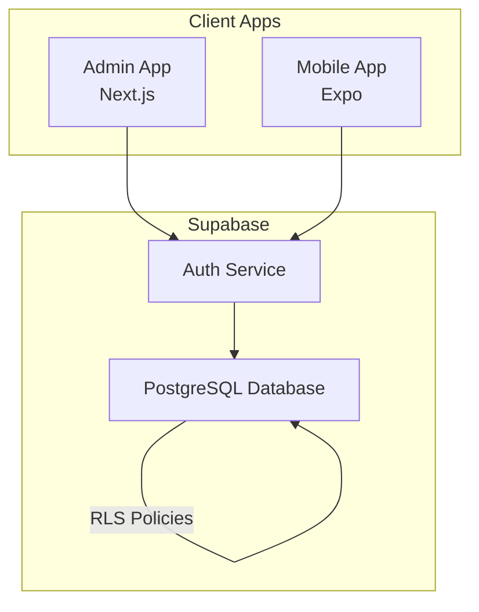
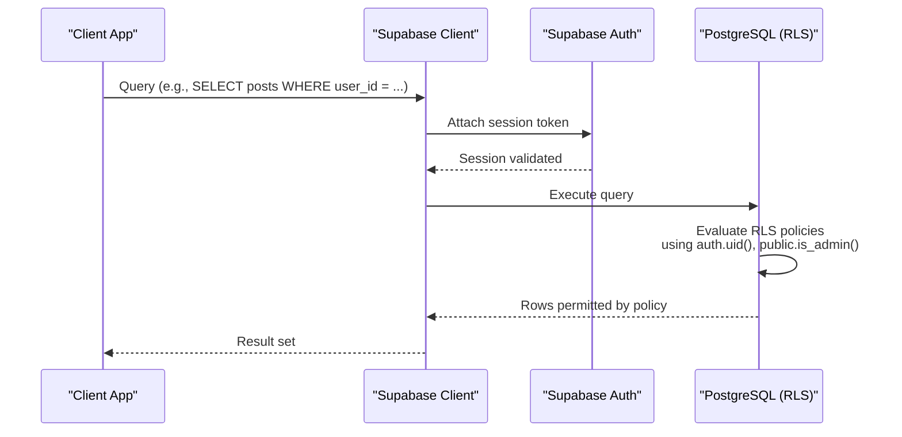
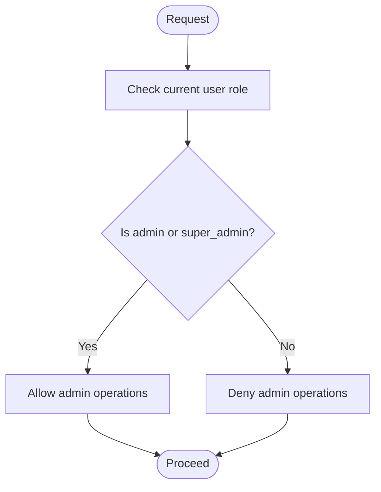
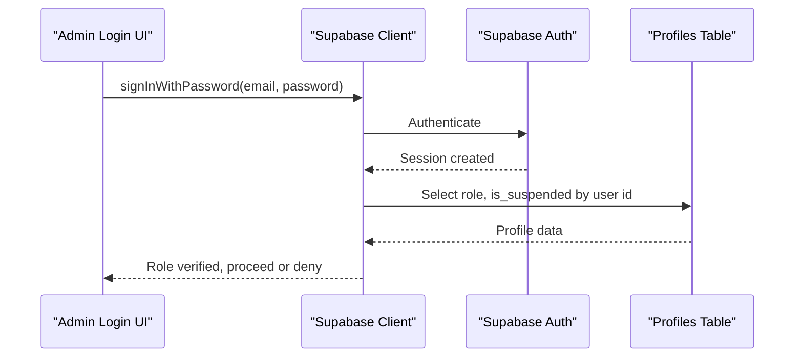
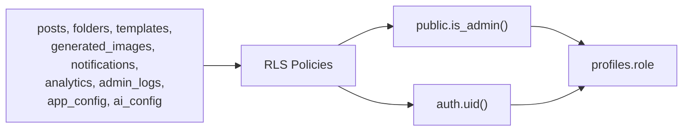

# Security Policies & Access Control

<cite>
**Referenced Files in This Document**
- [initial_schema.sql](file://supabase/migrations/20240001000000_initial_schema.sql)
- [auth.ts](file://packages/types/src/auth.ts)
- [supabase.ts (Admin)](file://apps/admin/src/lib/supabase.ts)
- [supabase.ts (Mobile)](file://apps/mobile/src/services/supabase.ts)
- [login page.tsx (Admin)](file://apps/admin/src/app/(auth)/login/page.tsx)
</cite>

## Table of Contents
1. Introduction
2. Project Structure
3. Core Components
4. Architecture Overview
5. Detailed Component Analysis
6. Dependency Analysis
7. Performance Considerations
8. Troubleshooting Guide
9. Conclusion

## Introduction
This document explains the Row Level Security (RLS) policies and role-based access control that enforce data isolation and administrative oversight across the database. It covers:
- The user_role enum values and the is_admin() helper function used to determine privileges
- RLS policies for each table, including profile ownership validation, post access controls, template visibility rules, and admin-only operations
- Authentication requirements and security boundaries enforced by Supabase client configuration
- Examples of how policies prevent unauthorized access and ensure isolation between users while allowing appropriate administrative capabilities

## Project Structure
The security model is defined in the database schema migration and enforced at query time by PostgreSQL RLS. Client applications use Supabase clients configured with authenticated sessions and environment-based endpoints.

**Diagram sources**
- [supabase.ts (Admin):1-14](file://apps/admin/src/lib/supabase.ts#L1-L14)
- [supabase.ts (Mobile):1-41](file://apps/mobile/src/services/supabase.ts#L1-L41)
- [initial_schema.sql:155-202](file://supabase/migrations/20240001000000_initial_schema.sql#L155-L202)

**Section sources**
- [supabase.ts (Admin):1-14](file://apps/admin/src/lib/supabase.ts#L1-L14)
- [supabase.ts (Mobile):1-41](file://apps/mobile/src/services/supabase.ts#L1-L41)
- [initial_schema.sql:155-202](file://supabase/migrations/20240001000000_initial_schema.sql#L155-L202)

## Core Components
- Role enumeration and types define the allowed roles and user profile shape.
- A database function determines whether the current user has administrative privileges.
- RLS policies are enabled on all tables and scoped per operation using role checks and ownership conditions.

Key elements:
- user_role enum: user, admin, super_admin
- is_admin() function: returns true when the current user’s role is admin or super_admin
- RLS policies: per-table rules controlling SELECT, INSERT, UPDATE, DELETE based on auth.uid() and public.is_admin()

**Section sources**
- [auth.ts:1-24](file://packages/types/src/auth.ts#L1-L24)
- [initial_schema.sql:8-12](file://supabase/migrations/20240001000000_initial_schema.sql#L8-L12)
- [initial_schema.sql:60-69](file://supabase/migrations/20240001000000_initial_schema.sql#L60-L69)
- [initial_schema.sql:155-202](file://supabase/migrations/20240001000000_initial_schema.sql#L155-L202)

## Architecture Overview
RLS enforces fine-grained access control directly in PostgreSQL. Clients authenticate via Supabase Auth and issue queries through the Supabase client. Each query is evaluated against RLS policies before execution.

**Diagram sources**
- [supabase.ts (Admin):1-14](file://apps/admin/src/lib/supabase.ts#L1-L14)
- [supabase.ts (Mobile):1-41](file://apps/mobile/src/services/supabase.ts#L1-L41)
- [initial_schema.sql:155-202](file://supabase/migrations/20240001000000_initial_schema.sql#L155-L202)

## Detailed Component Analysis

### Role-Based Access Control and Helper Function
- Roles: user, admin, super_admin
- is_admin(): evaluates whether the current user has admin or super_admin role by inspecting profiles
- Usage: RLS policies call public.is_admin() to grant elevated permissions for admin-only operations

**Diagram sources**
- [initial_schema.sql:8-12](file://supabase/migrations/20240001000000_initial_schema.sql#L8-L12)
- [initial_schema.sql:60-69](file://supabase/migrations/20240001000000_initial_schema.sql#L60-L69)
- [initial_schema.sql:170-202](file://supabase/migrations/20240001000000_initial_schema.sql#L170-L202)

**Section sources**
- [auth.ts:1-24](file://packages/types/src/auth.ts#L1-L24)
- [initial_schema.sql:60-69](file://supabase/migrations/20240001000000_initial_schema.sql#L60-L69)

### Profiles: Ownership Validation and Admin Oversight
- Users can read and update their own profile row
- Admins can read/update any profile
- Enforced via RLS policies that check auth.uid() equality or admin status

Security boundary:
- Prevents a user from reading or modifying another user’s profile unless they are an admin

Example scenarios:
- User reads own profile: allowed
- User tries to update another user’s profile: denied
- Admin updates any profile: allowed

**Section sources**
- [initial_schema.sql:44-58](file://supabase/migrations/20240001000000_initial_schema.sql#L44-L58)
- [initial_schema.sql:178-180](file://supabase/migrations/20240001000000_initial_schema.sql#L178-L180)

### Posts: Per-User Management and Admin Moderation
- Users can manage only their own posts
- Admins can view and moderate all posts
- RLS policy uses auth.uid() = user_id OR admin check

Security boundary:
- Ensures data isolation between users’ posts
- Allows admins to perform moderation actions across all posts

Example scenarios:
- User lists their posts: allowed
- User tries to delete another user’s post: denied
- Admin deletes any post: allowed

**Section sources**
- [initial_schema.sql:80-96](file://supabase/migrations/20240001000000_initial_schema.sql#L80-L96)
- [initial_schema.sql:182-183](file://supabase/migrations/20240001000000_initial_schema.sql#L182-L183)

### Folders: Strict Ownership
- Users can create, read, update, and delete only their own folders
- No admin bypass; folders are strictly per-user

Security boundary:
- Guarantees complete isolation of folder data per user

Example scenarios:
- User manages own folders: allowed
- User tries to access another user’s folder: denied

**Section sources**
- [initial_schema.sql:71-78](file://supabase/migrations/20240001000000_initial_schema.sql#L71-L78)
- [initial_schema.sql:185-186](file://supabase/migrations/20240001000000_initial_schema.sql#L185-L186)

### Templates: Visibility Rules and Admin Management
- Authenticated users can read active templates
- Admins can manage all templates (create, update, delete)
- Non-active templates are hidden from regular users

Security boundary:
- Controls visibility of premium or inactive templates
- Restricts template management to admins

Example scenarios:
- User reads active templates: allowed
- User reads inactive templates: denied
- Admin manages templates: allowed

**Section sources**
- [initial_schema.sql:98-109](file://supabase/migrations/20240001000000_initial_schema.sql#L98-L109)
- [initial_schema.sql:188-190](file://supabase/migrations/20240001000000_initial_schema.sql#L188-L190)

### Generated Images: Per-User Data Isolation
- Users can create, read, update, and delete only their own generated images
- No admin bypass; strict ownership enforcement

Security boundary:
- Ensures generated assets remain private to the creator

Example scenarios:
- User accesses own images: allowed
- User tries to access another user’s images: denied

**Section sources**
- [initial_schema.sql:111-120](file://supabase/migrations/20240001000000_initial_schema.sql#L111-L120)
- [initial_schema.sql:192-193](file://supabase/migrations/20240001000000_initial_schema.sql#L192-L193)

### Notifications: Per-User Management
- Users can manage only their own notifications
- No admin bypass; strict ownership enforcement

Security boundary:
- Keeps notification data isolated per user

Example scenarios:
- User marks own notification as read: allowed
- User tries to mark another user’s notification: denied

**Section sources**
- [initial_schema.sql:134-143](file://supabase/migrations/20240001000000_initial_schema.sql#L134-L143)
- [initial_schema.sql:195-196](file://supabase/migrations/20240001000000_initial_schema.sql#L195-L196)

### Analytics: Per-User Metrics and Admin Aggregation
- Users can read/write their own analytics rows
- Admins can read all analytics rows

Security boundary:
- Isolates per-user metrics while enabling admin-wide reporting

Example scenarios:
- User views own analytics: allowed
- User tries to view another user’s analytics: denied
- Admin views all analytics: allowed

**Section sources**
- [initial_schema.sql:122-132](file://supabase/migrations/20240001000000_initial_schema.sql#L122-L132)
- [initial_schema.sql:198-199](file://supabase/migrations/20240001000000_initial_schema.sql#L198-L199)

### Admin Logs: Admin-Only Access
- Only admins can read/write admin logs
- Regular users have no access

Security boundary:
- Protects audit trail integrity and confidentiality

Example scenarios:
- Admin writes log entry: allowed
- Regular user attempts to read logs: denied

**Section sources**
- [initial_schema.sql:145-153](file://supabase/migrations/20240001000000_initial_schema.sql#L145-L153)
- [initial_schema.sql:201-202](file://supabase/migrations/20240001000000_initial_schema.sql#L201-L202)

### App Config and AI Config: Read Access and Admin Write Access
- All authenticated users can read app_config and ai_config
- Only admins can modify these configurations

Security boundary:
- Centralized settings are readable globally but writable only by admins

Example scenarios:
- User reads app config: allowed
- User tries to update app config: denied
- Admin updates app config: allowed

**Section sources**
- [initial_schema.sql:14-29](file://supabase/migrations/20240001000000_initial_schema.sql#L14-L29)
- [initial_schema.sql:31-42](file://supabase/migrations/20240001000000_initial_schema.sql#L31-L42)
- [initial_schema.sql:170-176](file://supabase/migrations/20240001000000_initial_schema.sql#L170-L176)

### Authentication Requirements and Client Configuration
- Clients authenticate via Supabase Auth and attach session tokens to requests
- Admin login flow validates role and suspension status before granting access
- Placeholder URLs enable local development without real credentials

**Diagram sources**
- [login page.tsx (Admin):22-78](file://apps/admin/src/app/(auth)/login/page.tsx#L22-L78)
- [supabase.ts (Admin):1-14](file://apps/admin/src/lib/supabase.ts#L1-L14)

**Section sources**
- [supabase.ts (Admin):1-14](file://apps/admin/src/lib/supabase.ts#L1-L14)
- [supabase.ts (Mobile):1-41](file://apps/mobile/src/services/supabase.ts#L1-L41)
- [login page.tsx (Admin):22-78](file://apps/admin/src/app/(auth)/login/page.tsx#L22-L78)

## Dependency Analysis
- RLS policies depend on:
  - auth.uid() to identify the current user
  - public.is_admin() to evaluate administrative privileges
- Tables reference profiles via foreign keys, ensuring referential integrity
- Client apps rely on Supabase client configuration for authentication and session handling

**Diagram sources**
- [initial_schema.sql:60-69](file://supabase/migrations/20240001000000_initial_schema.sql#L60-L69)
- [initial_schema.sql:155-202](file://supabase/migrations/20240001000000_initial_schema.sql#L155-L202)

**Section sources**
- [initial_schema.sql:60-69](file://supabase/migrations/20240001000000_initial_schema.sql#L60-L69)
- [initial_schema.sql:155-202](file://supabase/migrations/20240001000000_initial_schema.sql#L155-L202)

## Performance Considerations
- RLS policies are evaluated per row, so ensure queries include filters that align with policy conditions (e.g., filter by user_id where applicable) to minimize scanning
- Avoid broad scans on large tables; leverage indexes on frequently filtered columns such as user_id
- Use admin-only endpoints or functions for bulk operations that require full-table access to reduce unnecessary policy evaluations

[No sources needed since this section provides general guidance]

## Troubleshooting Guide
Common issues and resolutions:
- Unauthorized access errors: Verify the user is authenticated and that the request includes a valid session token
- Admin-only operations failing: Confirm the user’s role is admin or super_admin in profiles and that is_admin() returns true
- Suspended accounts: Ensure the account is not suspended; admin flows explicitly block suspended users
- Template visibility: Inactive templates are hidden from non-admin users; activate them if needed

Diagnostic steps:
- Check client-side authentication state and session persistence
- Validate role and suspension status via a direct query to profiles
- Review RLS policies for the affected table to ensure expected conditions

**Section sources**
- [login page.tsx (Admin):44-70](file://apps/admin/src/app/(auth)/login/page.tsx#L44-L70)
- [initial_schema.sql:178-202](file://supabase/migrations/20240001000000_initial_schema.sql#L178-L202)

## Conclusion
The database enforces strong data isolation and administrative oversight through PostgreSQL Row Level Security. Roles defined by the user_role enum and the is_admin() helper function provide a clear privilege model. RLS policies secure each table according to business needs:
- Profile ownership validation prevents cross-user profile access
- Post access controls isolate user content while allowing admin moderation
- Template visibility rules restrict access to active templates for regular users
- Admin-only operations protect sensitive configuration and audit logs

Clients authenticate via Supabase and rely on RLS to enforce security boundaries at query time, ensuring robust protection against unauthorized access while maintaining necessary administrative capabilities.