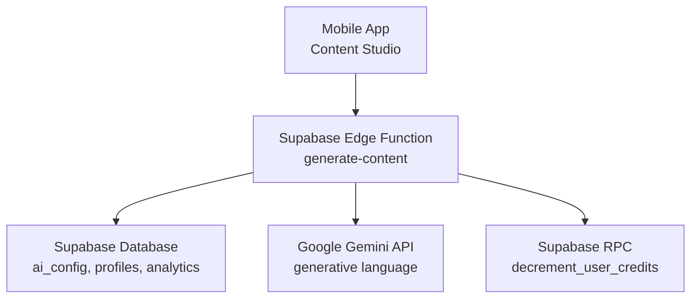
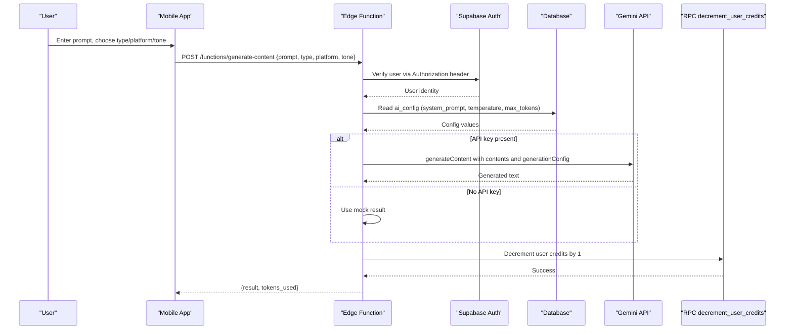
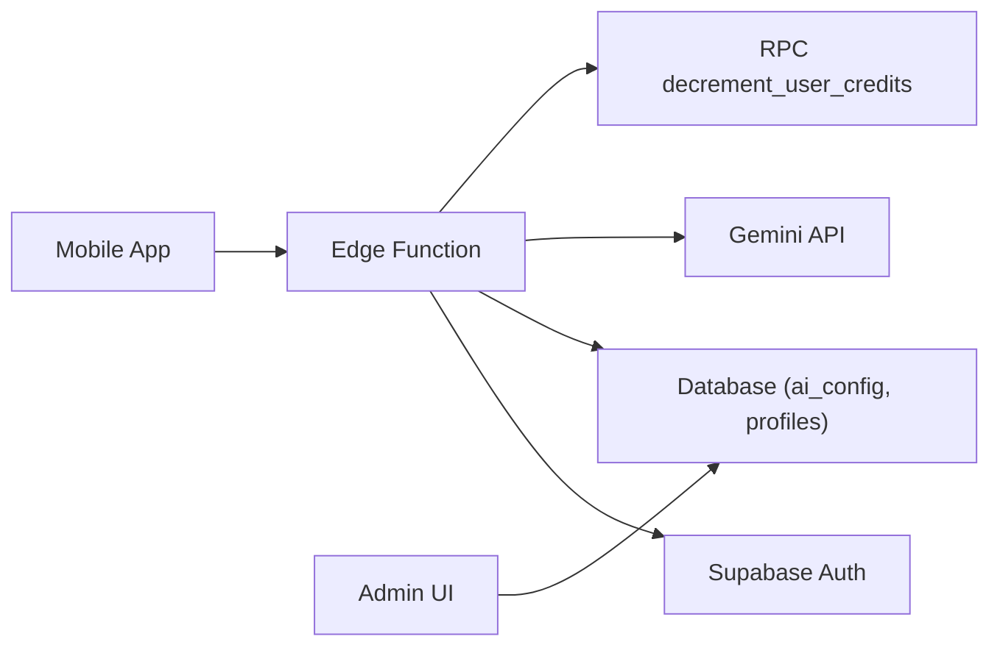
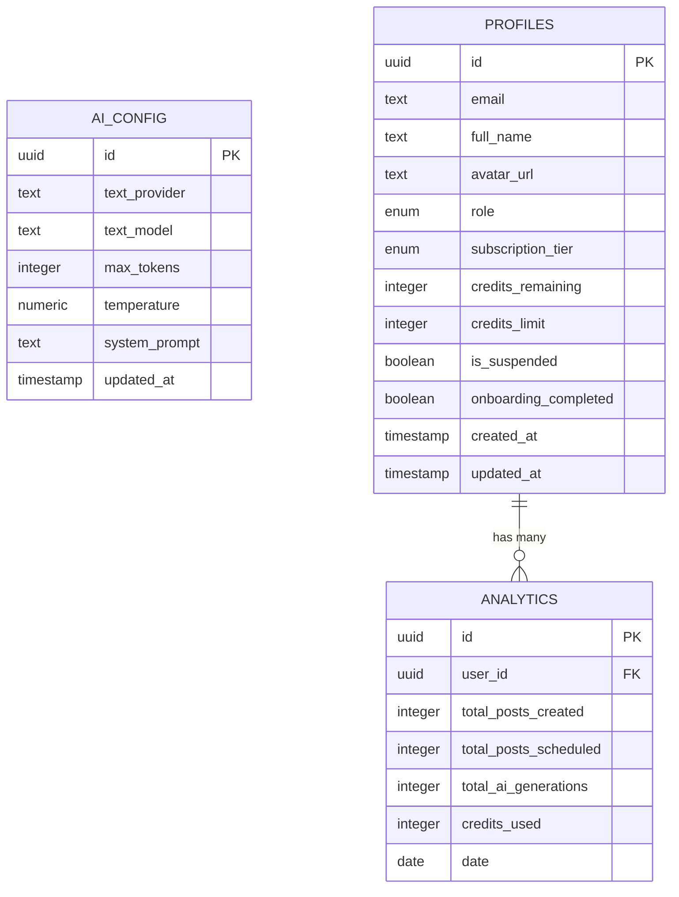

# Content Generation Function

<cite>
**Referenced Files in This Document**
- [generate-content/index.ts](file://supabase/functions/generate-content/index.ts)
- [initial_schema.sql](file://supabase/migrations/20240001000000_initial_schema.sql)
- [api.ts](file://packages/types/src/api.ts)
- [generate.tsx](file://apps/mobile/src/app/(tabs)/generate.tsx)
- [ai-settings/page.tsx](file://apps/admin/src/app/(dashboard)/ai-settings/page.tsx)
</cite>

## Table of Contents
1. [Introduction](#introduction)
2. [Project Structure](#project-structure)
3. [Core Components](#core-components)
4. [Architecture Overview](#architecture-overview)
5. [Detailed Component Analysis](#detailed-component-analysis)
6. [Dependency Analysis](#dependency-analysis)
7. [Performance Considerations](#performance-considerations)
8. [Troubleshooting Guide](#troubleshooting-guide)
9. [Conclusion](#conclusion)
10. [Appendices](#appendices)

## Introduction
This document explains the AI content generation Edge Function that integrates with Google Gemini to produce social media content. It covers authentication via Supabase Auth, request validation, system prompt configuration from the database, temperature and token limits, credit deduction through an RPC call, error handling, fallback behavior when API keys are missing, and examples for different content types and platforms. It also includes debugging techniques, logging patterns, and performance considerations for high-volume generation.

## Project Structure
The content generation feature spans several parts of the application:
- Edge Function: Handles authentication, validation, AI model calls, and billing.
- Database Schema: Defines AI configuration, user profiles (including credits), and analytics tables.
- Mobile UI: Provides the user interface to select platform, content type, tone, and submit prompts.
- Admin UI: Allows configuring AI provider/model and other settings.

**Diagram sources**
- [generate-content/index.ts:1-99](file://supabase/functions/generate-content/index.ts#L1-L99)
- [initial_schema.sql:31-58](file://supabase/migrations/20240001000000_initial_schema.sql#L31-L58)
- [initial_schema.sql:122-132](file://supabase/migrations/20240001000000_initial_schema.sql#L122-L132)

**Section sources**
- [generate-content/index.ts:1-99](file://supabase/functions/generate-content/index.ts#L1-L99)
- [initial_schema.sql:31-58](file://supabase/migrations/20240001000000_initial_schema.sql#L31-L58)
- [initial_schema.sql:122-132](file://supabase/migrations/20240001000000_initial_schema.sql#L122-L132)

## Core Components
- Authentication: The function authenticates requests using Supabase Auth by reading the Authorization header and verifying the current user.
- Request Validation: Validates required fields such as prompt; defaults are applied for optional parameters like platform and tone.
- System Prompt and Model Settings: Reads ai_config to obtain system_prompt, temperature, and max_tokens.
- AI Integration: Calls Google Gemini API if a key is configured; otherwise returns a mock response as a fallback.
- Billing: Deducts one credit per successful generation via an RPC call.
- Response: Returns generated text and token usage metadata.

**Section sources**
- [generate-content/index.ts:14-36](file://supabase/functions/generate-content/index.ts#L14-L36)
- [generate-content/index.ts:38-80](file://supabase/functions/generate-content/index.ts#L38-L80)
- [generate-content/index.ts:82-91](file://supabase/functions/generate-content/index.ts#L82-L91)

## Architecture Overview
The end-to-end flow for generating content:

**Diagram sources**
- [generate-content/index.ts:14-36](file://supabase/functions/generate-content/index.ts#L14-L36)
- [generate-content/index.ts:38-80](file://supabase/functions/generate-content/index.ts#L38-L80)
- [generate-content/index.ts:82-91](file://supabase/functions/generate-content/index.ts#L82-L91)

## Detailed Component Analysis

### Authentication Flow
- The Edge Function constructs a Supabase client using environment variables and attaches the incoming Authorization header to authenticate the request.
- It retrieves the current user; if unauthorized or missing, it returns a 401 Unauthorized response.

Operational notes:
- Ensure clients send a valid JWT in the Authorization header when calling the function.
- CORS headers are set to allow cross-origin requests from browsers or mobile clients.

**Section sources**
- [generate-content/index.ts:1-12](file://supabase/functions/generate-content/index.ts#L1-L12)
- [generate-content/index.ts:14-27](file://supabase/functions/generate-content/index.ts#L14-L27)

### Request Validation and Parameters
- Required parameter: prompt. If missing, the function returns a 400 Bad Request with an error message.
- Optional parameters:
  - platform: defaults to 'instagram'
  - tone: defaults to 'Professional'
- Type definitions define additional optional fields like targetAudience and language for richer prompts at the client layer.

Examples of supported content types and tones:
- Content types include caption, hashtags, post_ideas, thread.
- Tones include Professional, Casual, Humorous, Inspirational, Urgent.

Platform support includes Instagram, Twitter/X, LinkedIn, TikTok, Facebook.

**Section sources**
- [generate-content/index.ts:29-36](file://supabase/functions/generate-content/index.ts#L29-L36)
- [api.ts:3-16](file://packages/types/src/api.ts#L3-L16)
- [generate.tsx:44-66](file://apps/mobile/src/app/(tabs)/generate.tsx#L44-L66)

### System Prompt Configuration and Temperature/Tokens
- The function reads ai_config to obtain:
  - system_prompt: used to prepend instructions to the user prompt.
  - temperature: controls randomness; default 0.7 if not set.
  - max_output_tokens: controlled by max_tokens in ai_config; default 2048 if not set.
- These values are passed to the Gemini API’s generationConfig.

Admin configuration:
- The admin UI allows selecting the copywriting provider and model slug, enabling future extensibility beyond Gemini.

**Section sources**
- [generate-content/index.ts:38-47](file://supabase/functions/generate-content/index.ts#L38-L47)
- [generate-content/index.ts:52-73](file://supabase/functions/generate-content/index.ts#L52-L73)
- [initial_schema.sql:31-42](file://supabase/migrations/20240001000000_initial_schema.sql#L31-L42)
- [ai-settings/page.tsx:116-143](file://apps/admin/src/app/(dashboard)/ai-settings/page.tsx#L116-L143)

### Google Gemini API Integration
- When GEMINI_API_KEY is configured, the function calls the Gemini endpoint with:
  - A single user message containing the system prompt plus a tailored instruction based on type, platform, tone, and prompt.
  - generationConfig including temperature and maxOutputTokens.
- The response extracts the first candidate’s text.

Fallback mechanism:
- If no API key is set, the function returns a structured mock response that simulates a high-impact output for development and testing.

**Section sources**
- [generate-content/index.ts:48-80](file://supabase/functions/generate-content/index.ts#L48-L80)

### Credit Deduction via RPC
- After generating content (or using the fallback), the function decrements the user’s credits by 1 using an RPC call named decrement_user_credits.
- The RPC expects user_id_param and amount parameters.

Notes:
- Ensure the RPC exists in your Supabase project and is exposed to be callable from Edge Functions.
- The mobile app also demonstrates local credit management for its own flows; however, the Edge Function remains authoritative for server-side credit accounting.

**Section sources**
- [generate-content/index.ts:82-84](file://supabase/functions/generate-content/index.ts#L82-L84)
- [initial_schema.sql:44-58](file://supabase/migrations/20240001000000_initial_schema.sql#L44-L58)
- [generate.tsx:138-144](file://apps/mobile/src/app/(tabs)/generate.tsx#L138-L144)

### Error Handling Strategies
- Unauthorized access returns 401 with a JSON error.
- Missing prompt returns 400 with a descriptive error.
- Any unhandled exception returns 500 with the error message.
- The function uses try/catch to centralize error responses.

Recommendations:
- Add structured logging before returning errors to aid debugging.
- Consider distinguishing between transient network errors and invalid inputs for better client retries.

**Section sources**
- [generate-content/index.ts:21-27](file://supabase/functions/generate-content/index.ts#L21-L27)
- [generate-content/index.ts:31-36](file://supabase/functions/generate-content/index.ts#L31-L36)
- [generate-content/index.ts:92-97](file://supabase/functions/generate-content/index.ts#L92-L97)

### Response Handling
- On success, the function returns:
  - result: the generated text string
  - tokens_used: a numeric value indicating approximate token usage

Clients can display this to users and track usage in analytics.

**Section sources**
- [generate-content/index.ts:85-91](file://supabase/functions/generate-content/index.ts#L85-L91)

### Examples of Content Types and Platform Optimizations
Supported content types and tones are defined in the shared types and UI:
- Caption & Hook: concise, engaging opening lines suitable for Instagram or LinkedIn.
- Viral Hashtags: curated sets optimized for discoverability.
- Post Ideas: conceptual outlines for multi-post content.
- Multi-Post Thread: sequential messages for platforms like Twitter/X or LinkedIn.

Tone variations:
- Professional: formal and business-oriented.
- Casual: friendly and conversational.
- Humorous: witty and light-hearted.
- Inspirational: motivational and uplifting.
- Urgent: time-sensitive and action-driven.

Platform-specific guidance:
- Instagram: visual-first captions with strong hooks and hashtags.
- Twitter/X: concise threads with punchy statements.
- LinkedIn: thought leadership and professional insights.
- TikTok: short-form video scripts with retention-focused structure.
- Facebook: community-oriented posts with clear CTAs.

These options are selectable in the mobile app’s Content Studio and influence the prompt sent to the AI.

**Section sources**
- [api.ts:3-16](file://packages/types/src/api.ts#L3-L16)
- [generate.tsx:44-66](file://apps/mobile/src/app/(tabs)/generate.tsx#L44-L66)

## Dependency Analysis
Key dependencies and relationships:
- Edge Function depends on:
  - Supabase Auth for user verification
  - Database for ai_config and user profiles
  - Google Gemini API for content generation
  - RPC for credit deduction
- Mobile app consumes the Edge Function and manages local state for UX.
- Admin UI configures provider/model settings.

**Diagram sources**
- [generate-content/index.ts:14-36](file://supabase/functions/generate-content/index.ts#L14-L36)
- [generate-content/index.ts:38-80](file://supabase/functions/generate-content/index.ts#L38-L80)
- [generate-content/index.ts:82-91](file://supabase/functions/generate-content/index.ts#L82-L91)

**Section sources**
- [generate-content/index.ts:1-99](file://supabase/functions/generate-content/index.ts#L1-L99)
- [initial_schema.sql:31-58](file://supabase/migrations/20240001000000_initial_schema.sql#L31-L58)

## Performance Considerations
- Token Limits: Control output length via max_tokens to manage cost and latency.
- Temperature: Lower values yield more deterministic outputs; higher values increase creativity but may reduce consistency.
- Caching: Consider caching frequent prompts or results to reduce API calls.
- Concurrency: Rate-limit requests at the edge or application layer to avoid overloading the Gemini API.
- Fallback Behavior: Mock responses help maintain UX during outages; ensure production paths have robust error handling and retries.
- Analytics: Track total_ai_generations and credits_used for observability and capacity planning.

[No sources needed since this section provides general guidance]

## Troubleshooting Guide
Common issues and resolutions:
- Unauthorized errors:
  - Ensure the client sends a valid Authorization header with a JWT.
  - Verify Supabase Auth is properly configured and the Edge Function has access.
- Missing prompt:
  - Validate client input before sending requests; enforce non-empty prompts.
- API key not configured:
  - Set GEMINI_API_KEY in Supabase secrets to enable real generation; otherwise, the function returns a mock result.
- RPC failures:
  - Confirm the decrement_user_credits RPC exists and is callable from Edge Functions.
  - Check permissions and row-level security policies for profiles and analytics tables.
- Network errors:
  - Implement retries with exponential backoff for transient failures.
  - Log detailed error context (e.g., status codes, payloads) for diagnostics.

Logging patterns:
- Log request entry points, user identity, parameters, and outcomes.
- Log API call start/end times and response sizes to monitor latency and costs.
- Centralize logs in a monitoring service for alerting and analysis.

Debugging techniques:
- Use browser/network inspector to inspect request/response payloads.
- Test with minimal prompts to isolate issues.
- Temporarily enable verbose logging in development environments.

**Section sources**
- [generate-content/index.ts:21-27](file://supabase/functions/generate-content/index.ts#L21-L27)
- [generate-content/index.ts:31-36](file://supabase/functions/generate-content/index.ts#L31-L36)
- [generate-content/index.ts:48-80](file://supabase/functions/generate-content/index.ts#L48-L80)
- [generate-content/index.ts:92-97](file://supabase/functions/generate-content/index.ts#L92-L97)

## Conclusion
The AI content generation Edge Function provides a secure, configurable, and scalable way to generate social media content using Google Gemini. It enforces authentication, validates inputs, applies system prompts and model settings from the database, handles billing via RPC, and offers fallback behavior when API keys are missing. With proper logging, error handling, and performance tuning, it supports high-volume content generation across multiple platforms and tones.

[No sources needed since this section summarizes without analyzing specific files]

## Appendices

### Data Models Relevant to Content Generation

**Diagram sources**
- [initial_schema.sql:31-42](file://supabase/migrations/20240001000000_initial_schema.sql#L31-L42)
- [initial_schema.sql:44-58](file://supabase/migrations/20240001000000_initial_schema.sql#L44-L58)
- [initial_schema.sql:122-132](file://supabase/migrations/20240001000000_initial_schema.sql#L122-L132)