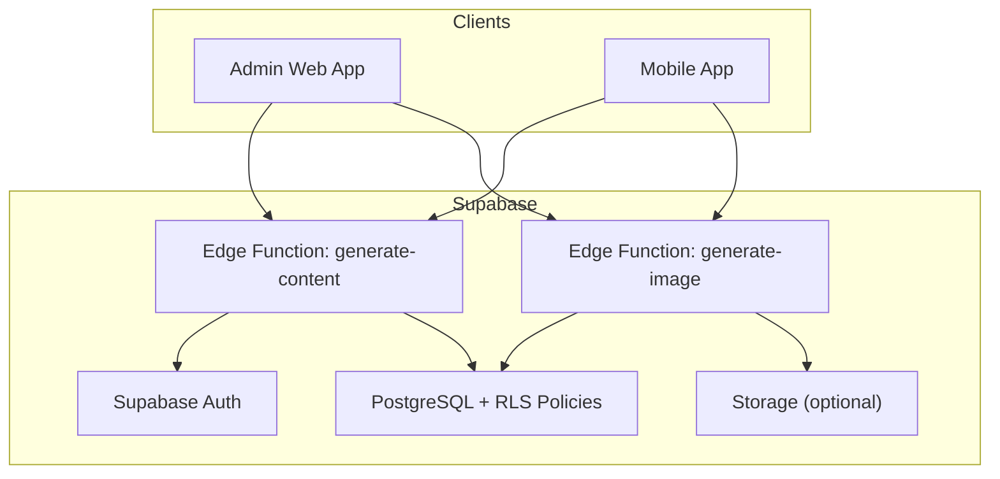
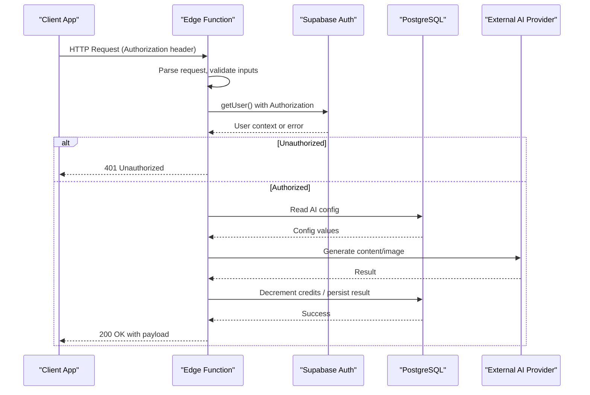
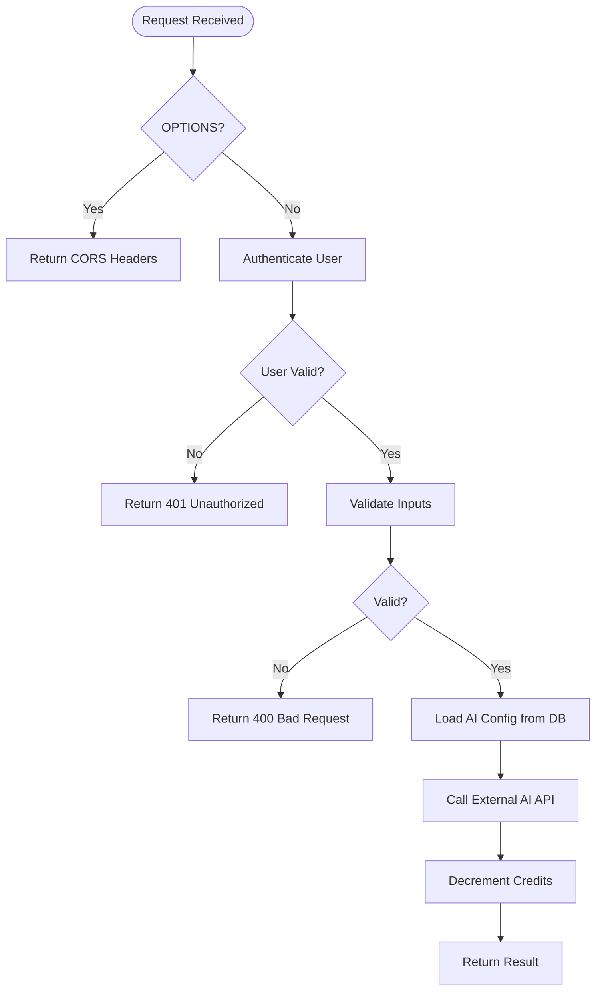
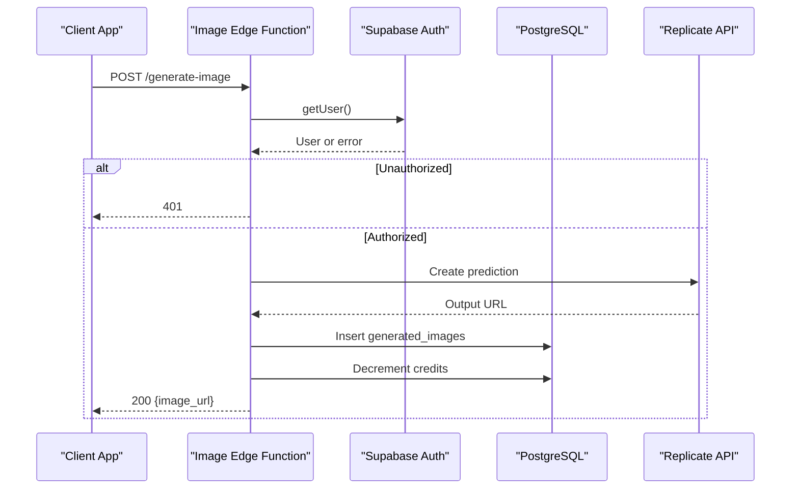
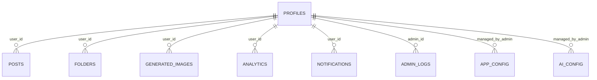
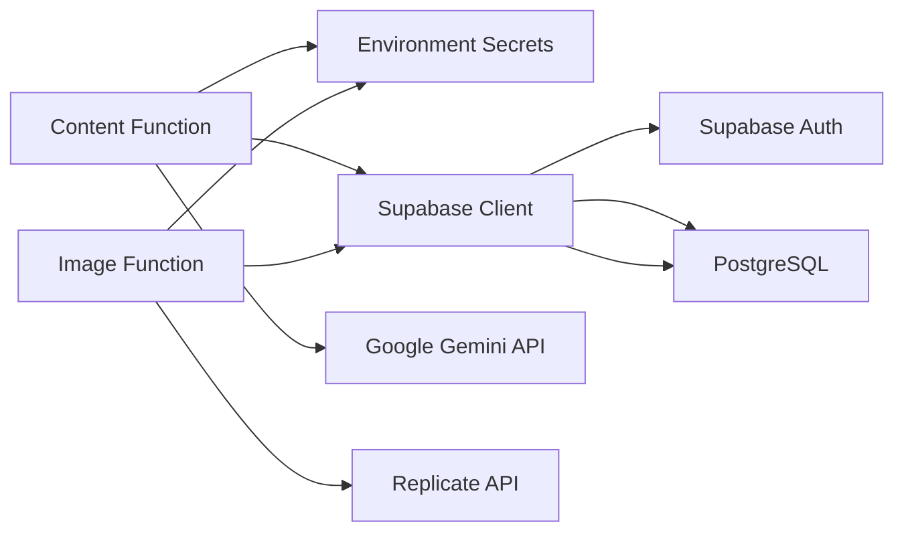

# Edge Functions Architecture

<cite>
**Referenced Files in This Document**
- [generate-content/index.ts](file://supabase/functions/generate-content/index.ts)
- [generate-image/index.ts](file://supabase/functions/generate-image/index.ts)
- [initial_schema.sql](file://supabase/migrations/20240001000000_initial_schema.sql)
- [config.toml](file://supabase/config.toml)
- [admin supabase client](file://apps/admin/src/lib/supabase.ts)
- [mobile supabase client](file://apps/mobile/src/services/supabase.ts)
</cite>

## Table of Contents
1. Introduction
2. Project Structure
3. Core Components
4. Architecture Overview
5. Detailed Component Analysis
6. Dependency Analysis
7. Performance Considerations
8. Troubleshooting Guide
9. Conclusion
10. Appendices

## Introduction
This document explains the Edge Functions ecosystem built on Supabase’s Deno-based runtime. It covers CORS configuration, security policies, shared patterns for authentication, error handling, logging, and database connections. It also details environment variable management, secrets handling, deployment procedures, interactions with Supabase services (Auth, Database, Storage), monitoring and observability strategies, performance optimization techniques, scaling considerations, guidelines for adding new functions, testing approaches, debugging distributed systems, security best practices, rate limiting strategies, and cost optimization for production.

## Project Structure
The Edge Functions live under the Supabase project directory and are implemented as Deno HTTP handlers. The application uses a monorepo structure with separate apps (admin web and mobile) that interact with Supabase via their respective clients.

**Diagram sources**
- [generate-content/index.ts:1-99](file://supabase/functions/generate-content/index.ts#L1-L99)
- [generate-image/index.ts:1-87](file://supabase/functions/generate-image/index.ts#L1-L87)
- [initial_schema.sql:155-202](file://supabase/migrations/20240001000000_initial_schema.sql#L155-L202)

**Section sources**
- [generate-content/index.ts:1-99](file://supabase/functions/generate-content/index.ts#L1-L99)
- [generate-image/index.ts:1-87](file://supabase/functions/generate-image/index.ts#L1-L87)
- [initial_schema.sql:155-202](file://supabase/migrations/20240001000000_initial_schema.sql#L155-L202)

## Core Components
- Edge Functions:
  - Content generation function orchestrates AI content creation using Supabase Auth to identify users, reads AI configuration from the database, calls an external AI provider, decrements user credits, and returns results.
  - Image generation function validates input, authenticates users, calls an image generation API, persists generated images, and deducts credits.
- Shared patterns:
  - CORS headers defined per function.
  - Authentication via Supabase Auth using the Authorization header propagated into the client.
  - Centralized error handling returning JSON responses with appropriate status codes.
  - Database interactions through Supabase JS client with Row-Level Security enforced by policies.
  - Environment-driven secrets for external APIs.

**Section sources**
- [generate-content/index.ts:4-99](file://supabase/functions/generate-content/index.ts#L4-L99)
- [generate-image/index.ts:4-87](file://supabase/functions/generate-image/index.ts#L4-L87)
- [initial_schema.sql:155-202](file://supabase/migrations/20240001000000_initial_schema.sql#L155-L202)

## Architecture Overview
The Edge Functions act as secure serverless endpoints that:
- Validate requests and handle CORS preflight.
- Authenticate users via Supabase Auth tokens.
- Read dynamic configuration from the database.
- Call external AI providers securely using environment secrets.
- Persist outcomes and update user credits atomically.
- Return structured JSON responses with consistent error shapes.

**Diagram sources**
- [generate-content/index.ts:9-99](file://supabase/functions/generate-content/index.ts#L9-L99)
- [generate-image/index.ts:9-87](file://supabase/functions/generate-image/index.ts#L9-L87)
- [initial_schema.sql:155-202](file://supabase/migrations/20240001000000_initial_schema.sql#L155-L202)

## Detailed Component Analysis

### Content Generation Edge Function
- Runtime: Deno HTTP server handler.
- CORS: Preflight OPTIONS handled; standard CORS headers set.
- Authentication: Uses Supabase client with Authorization header to fetch current user.
- Input validation: Ensures required fields like prompt exist.
- Configuration: Reads AI settings from database to determine system prompt, temperature, and token limits.
- External integration: Calls Google Gemini API when configured; otherwise returns a mock response.
- Side effects: Decrements user credits via RPC and returns usage metadata.
- Error handling: Catches errors and returns 500 with message.

**Diagram sources**
- [generate-content/index.ts:9-99](file://supabase/functions/generate-content/index.ts#L9-L99)

**Section sources**
- [generate-content/index.ts:4-99](file://supabase/functions/generate-content/index.ts#L4-L99)

### Image Generation Edge Function
- Runtime: Deno HTTP server handler.
- CORS: Same pattern as content generation.
- Authentication: Validates user via Supabase Auth.
- Input validation: Ensures visual prompt is provided.
- External integration: Calls Replicate API for image generation when token is present; otherwise uses a placeholder URL.
- Persistence: Inserts generated image record into database.
- Side effects: Deducts credits via RPC.
- Error handling: Returns 500 on exceptions.

**Diagram sources**
- [generate-image/index.ts:9-87](file://supabase/functions/generate-image/index.ts#L9-L87)

**Section sources**
- [generate-image/index.ts:4-87](file://supabase/functions/generate-image/index.ts#L4-L87)

### Database Schema and Security Policies
- Tables include app_config, ai_config, profiles, posts, folders, templates, generated_images, analytics, notifications, admin_logs.
- Row-Level Security (RLS) policies restrict access based on authenticated user identity and roles.
- Helper function determines admin privileges.
- Triggers create profiles on user signup.
- Realtime enabled for key tables.

**Diagram sources**
- [initial_schema.sql:14-153](file://supabase/migrations/20240001000000_initial_schema.sql#L14-L153)

**Section sources**
- [initial_schema.sql:14-232](file://supabase/migrations/20240001000000_initial_schema.sql#L14-L232)

## Dependency Analysis
- Edge Functions depend on:
  - Supabase JS client for Auth and Database operations.
  - Environment variables for SUPABASE_URL, SUPABASE_ANON_KEY, and provider-specific secrets.
  - External AI providers (Gemini, Replicate).
- Clients depend on:
  - Supabase JS client configured with environment variables and secure session storage (mobile).
- Database enforces security via RLS policies and helper functions.

**Diagram sources**
- [generate-content/index.ts:15-99](file://supabase/functions/generate-content/index.ts#L15-L99)
- [generate-image/index.ts:15-87](file://supabase/functions/generate-image/index.ts#L15-L87)
- [admin supabase client:1-14](file://apps/admin/src/lib/supabase.ts#L1-L14)
- [mobile supabase client:1-41](file://apps/mobile/src/services/supabase.ts#L1-L41)

**Section sources**
- [generate-content/index.ts:15-99](file://supabase/functions/generate-content/index.ts#L15-L99)
- [generate-image/index.ts:15-87](file://supabase/functions/generate-image/index.ts#L15-L87)
- [admin supabase client:1-14](file://apps/admin/src/lib/supabase.ts#L1-L14)
- [mobile supabase client:1-41](file://apps/mobile/src/services/supabase.ts#L1-L41)

## Performance Considerations
- Minimize cold starts by keeping dependencies lightweight and avoiding heavy initialization in global scope.
- Cache frequently read configuration (e.g., AI config) at the edge if appropriate, but ensure consistency with database updates.
- Use efficient queries and limit returned data; leverage indexes on frequently filtered columns (e.g., user_id).
- Batch operations where possible to reduce round trips to the database.
- Set timeouts appropriately for external API calls to avoid hanging requests.
- Monitor credit decrement latency; consider idempotency keys to prevent double-charging.

[No sources needed since this section provides general guidance]

## Troubleshooting Guide
- Authentication failures:
  - Ensure Authorization header is correctly passed to Edge Functions.
  - Verify Supabase URL and anon key are set in environment variables.
- CORS issues:
  - Confirm OPTIONS preflight returns correct headers.
  - Check browser console for blocked requests due to missing headers.
- Database errors:
  - Inspect RLS policies to ensure the authenticated user has permissions.
  - Validate table existence and column names match schema.
- External API errors:
  - Validate provider tokens and network connectivity.
  - Handle non-200 responses gracefully and return meaningful errors.
- Credit deduction anomalies:
  - Ensure RPC exists and parameters match expected types.
  - Add idempotency checks to prevent duplicate deductions.

**Section sources**
- [generate-content/index.ts:21-27](file://supabase/functions/generate-content/index.ts#L21-L27)
- [generate-image/index.ts:21-27](file://supabase/functions/generate-image/index.ts#L21-L27)
- [initial_schema.sql:155-202](file://supabase/migrations/20240001000000_initial_schema.sql#L155-L202)

## Conclusion
The Edge Functions provide a secure, scalable way to orchestrate AI-powered features while enforcing strict authentication and authorization via Supabase. By centralizing configuration in the database, managing secrets through environment variables, and leveraging RLS policies, the system maintains strong security boundaries. Observability and performance can be enhanced with structured logging, metrics, and caching strategies tailored to edge constraints.

[No sources needed since this section summarizes without analyzing specific files]

## Appendices

### Environment Variables and Secrets Management
- Required for Edge Functions:
  - SUPABASE_URL: Supabase project URL.
  - SUPABASE_ANON_KEY: Anon key for client-side operations within functions.
  - GEMINI_API_KEY: Secret for Google Gemini API.
  - REPLICATE_API_TOKEN: Secret for Replicate API.
- Client apps use environment variables to initialize Supabase clients:
  - Admin app uses NEXT_PUBLIC_SUPABASE_URL and NEXT_PUBLIC_SUPABASE_ANON_KEY.
  - Mobile app uses EXPO_PUBLIC_SUPABASE_URL and EXPO_PUBLIC_SUPABASE_ANON_KEY with secure storage.

**Section sources**
- [generate-content/index.ts:15-19](file://supabase/functions/generate-content/index.ts#L15-L19)
- [generate-image/index.ts:15-19](file://supabase/functions/generate-image/index.ts#L15-L19)
- [admin supabase client:1-14](file://apps/admin/src/lib/supabase.ts#L1-L14)
- [mobile supabase client:1-41](file://apps/mobile/src/services/supabase.ts#L1-L41)

### Deployment Procedures
- Deploy Edge Functions via Supabase CLI or dashboard.
- Ensure environment variables are set in the Supabase project settings for production.
- Apply migrations to provision schema and policies before deploying functions.
- Test locally with Supabase local development tools to validate behavior.

**Section sources**
- [config.toml:1-2](file://supabase/config.toml#L1-L2)
- [initial_schema.sql:14-232](file://supabase/migrations/20240001000000_initial_schema.sql#L14-L232)

### Monitoring and Observability Strategies
- Implement structured logging in Edge Functions to capture request IDs, user IDs, and outcomes.
- Integrate with external observability platforms (e.g., Sentry, Logtail) for error tracking and metrics.
- Track credit usage and AI provider costs via analytics tables and dashboards.
- Set up alerts for high error rates and slow external API responses.

[No sources needed since this section provides general guidance]

### Adding New Edge Functions
- Follow the established pattern:
  - Define CORS headers and handle OPTIONS preflight.
  - Authenticate using Supabase Auth with Authorization header.
  - Validate inputs and return standardized error responses.
  - Use environment variables for secrets.
  - Interact with database via Supabase client respecting RLS policies.
  - Record analytics and decrement credits where applicable.
- Add corresponding database schema changes and RLS policies if needed.

**Section sources**
- [generate-content/index.ts:4-99](file://supabase/functions/generate-content/index.ts#L4-L99)
- [generate-image/index.ts:4-87](file://supabase/functions/generate-image/index.ts#L4-L87)
- [initial_schema.sql:155-202](file://supabase/migrations/20240001000000_initial_schema.sql#L155-L202)

### Testing Approaches
- Unit tests for input validation and error paths.
- Integration tests against local Supabase instance to verify Auth, DB, and RPC calls.
- Mock external AI providers to test fallback logic and error handling.
- End-to-end tests simulating client flows with proper Authorization headers.

[No sources needed since this section provides general guidance]

### Debugging Distributed Systems
- Correlate logs across Edge Functions, database, and external APIs using request IDs.
- Inspect Supabase logs for function execution details and errors.
- Use database triggers and audit logs to trace state changes.
- Validate RLS policies during debugging sessions to ensure correct access control.

**Section sources**
- [initial_schema.sql:145-153](file://supabase/migrations/20240001000000_initial_schema.sql#L145-L153)

### Security Best Practices
- Enforce RLS policies for all sensitive tables.
- Validate and sanitize all inputs in Edge Functions.
- Store secrets in environment variables; never hardcode them.
- Limit CORS origins in production to trusted domains.
- Use least privilege for service accounts and API keys.

**Section sources**
- [initial_schema.sql:155-202](file://supabase/migrations/20240001000000_initial_schema.sql#L155-L202)
- [generate-content/index.ts:4-7](file://supabase/functions/generate-content/index.ts#L4-L7)
- [generate-image/index.ts:4-7](file://supabase/functions/generate-image/index.ts#L4-L7)

### Rate Limiting Strategies
- Implement rate limiting at the edge using Supabase’s built-in capabilities or an external gateway.
- Use IP-based or user-based throttling to prevent abuse.
- Combine with credit checks to enforce usage quotas.

[No sources needed since this section provides general guidance]

### Cost Optimization for Production
- Cache AI configuration and frequent reads to reduce database load.
- Optimize external API calls with retries and timeouts.
- Monitor and cap token usage per request to control costs.
- Use efficient prompts and models to minimize output size and processing time.

[No sources needed since this section provides general guidance]