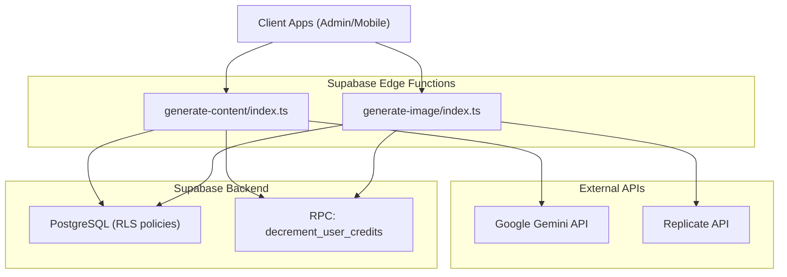
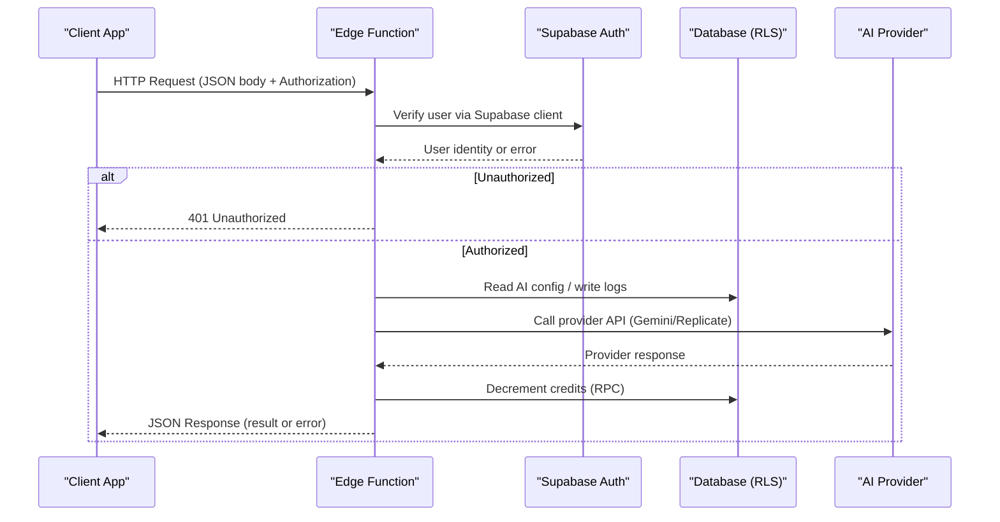
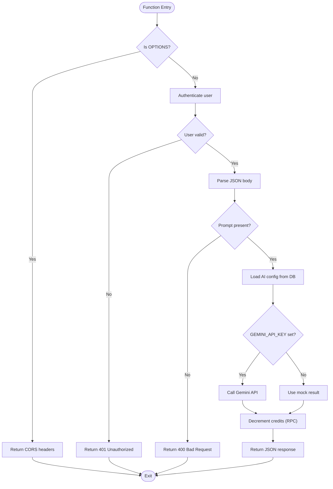
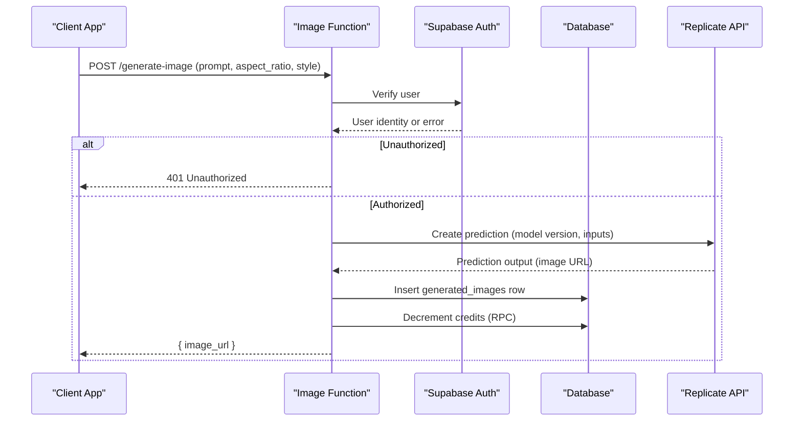
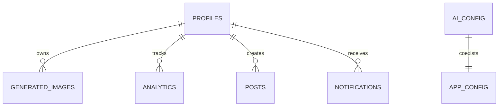
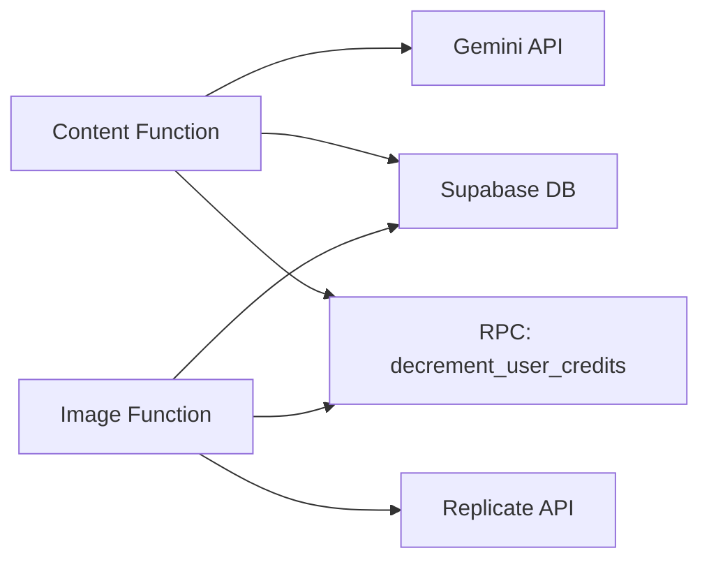

# Edge Functions

<cite>
**Referenced Files in This Document**
- [generate-content/index.ts](file://supabase/functions/generate-content/index.ts)
- [generate-image/index.ts](file://supabase/functions/generate-image/index.ts)
- [initial_schema.sql](file://supabase/migrations/20240001000000_initial_schema.sql)
- [config.toml](file://supabase/config.toml)
</cite>

## Table of Contents
1. Introduction
2. Project Structure
3. Core Components
4. Architecture Overview
5. Detailed Component Analysis
6. Dependency Analysis
7. Performance Considerations
8. Troubleshooting Guide
9. Conclusion
10. Appendices

## Introduction
This document explains the Supabase Edge Functions used for AI-powered content and image generation in the project. It covers the authentication flow, request/response handling, error management, environment configuration, CORS setup, security considerations, and operational guidance such as adding new functions, integrating different AI providers, rate limiting, monitoring, debugging, logging, and deployment.

## Project Structure
The Edge Functions are located under supabase/functions and each function is a Deno-based HTTP handler:
- generate-content: Text generation via Google Gemini API with fallback behavior and credit accounting.
- generate-image: Image generation via Replicate API with storage in the database and credit accounting.

**Diagram sources**
- [generate-content/index.ts:1-99](file://supabase/functions/generate-content/index.ts#L1-L99)
- [generate-image/index.ts:1-87](file://supabase/functions/generate-image/index.ts#L1-L87)
- [initial_schema.sql:112-132](file://supabase/migrations/20240001000000_initial_schema.sql#L112-L132)

**Section sources**
- [generate-content/index.ts:1-99](file://supabase/functions/generate-content/index.ts#L1-L99)
- [generate-image/index.ts:1-87](file://supabase/functions/generate-image/index.ts#L1-L87)
- [initial_schema.sql:112-132](file://supabase/migrations/20240001000000_initial_schema.sql#L112-L132)

## Core Components
- Content Generation Function: Authenticates users, validates input, reads AI settings from the database, calls Google Gemini API, decrements credits, and returns generated text.
- Image Generation Function: Authenticates users, validates input, calls Replicate API to generate images, stores results in the database, decrements credits, and returns the image URL.

Key behaviors:
- Both functions implement CORS preflight handling and consistent JSON responses.
- Both enforce user authentication using Supabase Auth context propagated via Authorization header.
- Both integrate with database RLS policies and use a shared RPC to decrement user credits.

**Section sources**
- [generate-content/index.ts:4-99](file://supabase/functions/generate-content/index.ts#L4-L99)
- [generate-image/index.ts:4-87](file://supabase/functions/generate-image/index.ts#L4-L87)
- [initial_schema.sql:159-202](file://supabase/migrations/20240001000000_initial_schema.sql#L159-L202)

## Architecture Overview
The Edge Functions act as secure serverless endpoints that:
- Validate requests and enforce authentication.
- Read runtime configuration from environment variables or database tables.
- Call external AI providers securely using secrets stored in Supabase Edge Secrets.
- Persist outcomes and usage metrics in the database under strict RLS policies.
- Enforce billing/credits by invoking a database RPC.

**Diagram sources**
- [generate-content/index.ts:14-99](file://supabase/functions/generate-content/index.ts#L14-L99)
- [generate-image/index.ts:14-87](file://supabase/functions/generate-image/index.ts#L14-L87)
- [initial_schema.sql:159-202](file://supabase/migrations/20240001000000_initial_schema.sql#L159-L202)

## Detailed Component Analysis

### Content Generation Function (Google Gemini)
Responsibilities:
- Handle CORS preflight requests.
- Authenticate the caller using Supabase Auth.
- Validate required fields (prompt).
- Load AI configuration from the ai_config table (system_prompt, temperature, max_tokens).
- Call Google Gemini API when GEMINI_API_KEY is configured; otherwise return a mock result.
- Decrement user credits via RPC and return the generated text.

Authentication flow:
- The function constructs a Supabase client using SUPABASE_URL and SUPABASE_ANON_KEY and forwards the Authorization header from the incoming request to authenticate the user.

Request/response handling:
- Input: JSON with prompt, type, platform, tone.
- Output: JSON with result and token usage metadata.

Error management:
- Returns 401 for unauthorized access.
- Returns 400 for missing prompt.
- Returns 500 with error message on exceptions.

**Diagram sources**
- [generate-content/index.ts:9-99](file://supabase/functions/generate-content/index.ts#L9-L99)

**Section sources**
- [generate-content/index.ts:4-99](file://supabase/functions/generate-content/index.ts#L4-L99)
- [initial_schema.sql:31-42](file://supabase/migrations/20240001000000_initial_schema.sql#L31-L42)

### Image Generation Function (Replicate)
Responsibilities:
- Handle CORS preflight requests.
- Authenticate the caller using Supabase Auth.
- Validate required fields (prompt).
- Call Replicate API when REPLICATE_API_TOKEN is configured; otherwise return a default image URL.
- Store the generated image metadata in the generated_images table.
- Decrement user credits via RPC and return the image URL.

Request/response handling:
- Input: JSON with prompt, aspect_ratio, style.
- Output: JSON with image_url.

Error management:
- Returns 401 for unauthorized access.
- Returns 400 for missing visual prompt.
- Returns 500 with error message on exceptions.

**Diagram sources**
- [generate-image/index.ts:9-87](file://supabase/functions/generate-image/index.ts#L9-L87)
- [initial_schema.sql:112-120](file://supabase/migrations/20240001000000_initial_schema.sql#L112-L120)

**Section sources**
- [generate-image/index.ts:4-87](file://supabase/functions/generate-image/index.ts#L4-L87)
- [initial_schema.sql:112-120](file://supabase/migrations/20240001000000_initial_schema.sql#L112-L120)

### Database Schema and Security Policies
- ai_config: Centralized AI settings including provider selection, model names, tokens, temperature, and system prompts.
- generated_images: Stores user-generated images with prompt, aspect ratio, and style.
- Row-Level Security (RLS): Ensures users can only access their own data; admins have broader access where defined.

**Diagram sources**
- [initial_schema.sql:15-42](file://supabase/migrations/20240001000000_initial_schema.sql#L15-L42)
- [initial_schema.sql:112-132](file://supabase/migrations/20240001000000_initial_schema.sql#L112-L132)

**Section sources**
- [initial_schema.sql:15-42](file://supabase/migrations/20240001000000_initial_schema.sql#L15-L42)
- [initial_schema.sql:112-132](file://supabase/migrations/20240001000000_initial_schema.sql#L112-L132)
- [initial_schema.sql:159-202](file://supabase/migrations/20240001000000_initial_schema.sql#L159-L202)

## Dependency Analysis
- External dependencies:
  - Google Gemini API for text generation (conditional on GEMINI_API_KEY).
  - Replicate API for image generation (conditional on REPLICATE_API_TOKEN).
- Internal dependencies:
  - Supabase client for authenticated DB access and RPC invocation.
  - Database tables: ai_config, generated_images, analytics.
  - RLS policies enforce data isolation and admin privileges.

**Diagram sources**
- [generate-content/index.ts:48-84](file://supabase/functions/generate-content/index.ts#L48-L84)
- [generate-image/index.ts:38-75](file://supabase/functions/generate-image/index.ts#L38-L75)
- [initial_schema.sql:159-202](file://supabase/migrations/20240001000000_initial_schema.sql#L159-L202)

**Section sources**
- [generate-content/index.ts:48-84](file://supabase/functions/generate-content/index.ts#L48-L84)
- [generate-image/index.ts:38-75](file://supabase/functions/generate-image/index.ts#L38-L75)
- [initial_schema.sql:159-202](file://supabase/migrations/20240001000000_initial_schema.sql#L159-L202)

## Performance Considerations
- Avoid unnecessary retries on provider errors; implement exponential backoff if needed.
- Cache frequently accessed AI configuration in-memory within the function lifecycle to reduce DB reads.
- Use minimal payloads and selective field reads to reduce network overhead.
- Monitor provider latency and adjust timeouts accordingly.
- Consider batching analytics updates if high volume.

[No sources needed since this section provides general guidance]

## Troubleshooting Guide
Common issues and resolutions:
- 401 Unauthorized: Ensure the client sends a valid Authorization header with a Supabase JWT.
- 400 Bad Request: Validate that required fields (prompt, etc.) are included in the request body.
- 500 Server Error: Check for missing environment secrets (GEMINI_API_KEY, REPLICATE_API_TOKEN), network connectivity to external APIs, or database RPC availability.
- CORS Errors: Confirm that the browser request includes allowed headers and origins; the functions handle OPTIONS preflight automatically.

Debugging techniques:
- Inspect function logs in the Supabase dashboard.
- Add structured logging around key steps (auth validation, provider calls, DB operations).
- Use feature flags to toggle between real provider calls and mock responses during development.

Logging strategies:
- Log request IDs, user IDs, timestamps, and outcome status codes.
- Redact sensitive information (tokens, keys) before logging.
- Aggregate logs for analytics and alerting.

Deployment procedures:
- Configure environment variables/secrets in Supabase Edge Secrets (e.g., GEMINI_API_KEY, REPLICATE_API_TOKEN).
- Deploy functions via Supabase CLI or dashboard.
- Verify CORS and auth flows post-deployment.

**Section sources**
- [generate-content/index.ts:21-36](file://supabase/functions/generate-content/index.ts#L21-L36)
- [generate-image/index.ts:21-36](file://supabase/functions/generate-image/index.ts#L21-L36)
- [generate-content/index.ts:92-99](file://supabase/functions/generate-content/index.ts#L92-L99)
- [generate-image/index.ts:80-87](file://supabase/functions/generate-image/index.ts#L80-L87)

## Conclusion
The Edge Functions provide secure, authenticated endpoints for AI-driven content and image generation. They integrate with Google Gemini and Replicate, enforce strict security via RLS and Supabase Auth, and maintain usage accounting through credit deductions. With proper environment configuration, CORS handling, and robust error management, these functions form a reliable foundation for scalable AI features.

[No sources needed since this section summarizes without analyzing specific files]

## Appendices

### Environment Variables and Configuration
- Required secrets:
  - GEMINI_API_KEY: Used by the content generation function to call Google Gemini.
  - REPLICATE_API_TOKEN: Used by the image generation function to call Replicate.
- Supabase connection:
  - SUPABASE_URL and SUPABASE_ANON_KEY are read at runtime to initialize the Supabase client.
- Local configuration file:
  - config.toml exists but is empty in this repository; secrets should be managed via Supabase Edge Secrets.

**Section sources**
- [generate-content/index.ts:15-19](file://supabase/functions/generate-content/index.ts#L15-L19)
- [generate-image/index.ts:15-19](file://supabase/functions/generate-image/index.ts#L15-L19)
- [config.toml:1-2](file://supabase/config.toml#L1-L2)

### Adding New Edge Functions
Steps:
- Create a new directory under supabase/functions with an index.ts entry point.
- Implement CORS preflight handling and JSON responses.
- Authenticate users using Supabase client and propagate Authorization header.
- Validate inputs and handle errors consistently.
- Integrate with external APIs using secrets from Edge Secrets.
- Persist results and update credits via RPC.
- Test locally and deploy via Supabase CLI/dashboard.

[No sources needed since this section provides general guidance]

### Handling Different AI Providers
- Content generation:
  - Primary provider: Google Gemini (when GEMINI_API_KEY is set).
  - Fallback: Mock result when key is not configured; consider implementing OpenAI fallback logic similarly.
- Image generation:
  - Primary provider: Replicate (when REPLICATE_API_TOKEN is set).
  - Fallback: Default image URL when token is not configured; consider additional providers as needed.

**Section sources**
- [generate-content/index.ts:48-80](file://supabase/functions/generate-content/index.ts#L48-L80)
- [generate-image/index.ts:38-62](file://supabase/functions/generate-image/index.ts#L38-L62)

### Implementing Rate Limiting
Recommendations:
- Use Redis-backed rate limiting per user or IP at the edge layer.
- Enforce limits based on subscription tier stored in profiles.
- Return appropriate 429 responses with retry-after headers.
- Track attempts in analytics for observability.

[No sources needed since this section provides general guidance]

### Monitoring Function Performance
- Metrics to track:
  - Request latency, error rates, provider response times.
  - Credit consumption and usage per user.
- Tools:
  - Supabase function logs and dashboards.
  - External APM tools integrated via logging pipelines.
- Alerts:
  - Set alerts for high error rates or slow provider responses.

[No sources needed since this section provides general guidance]