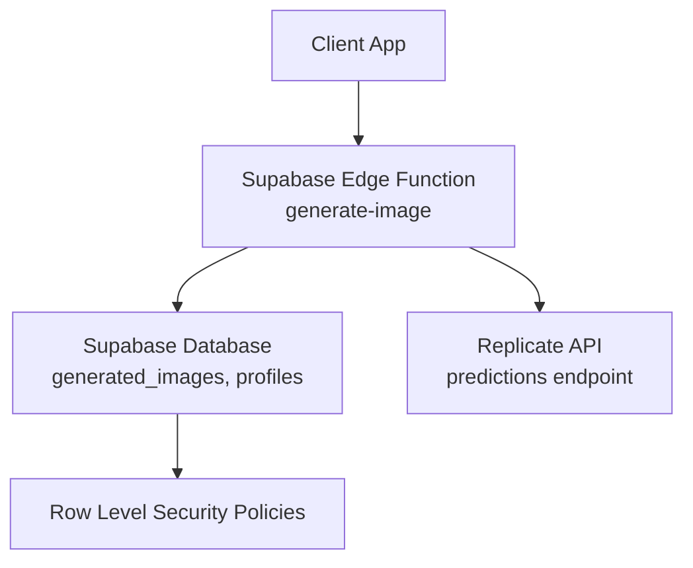
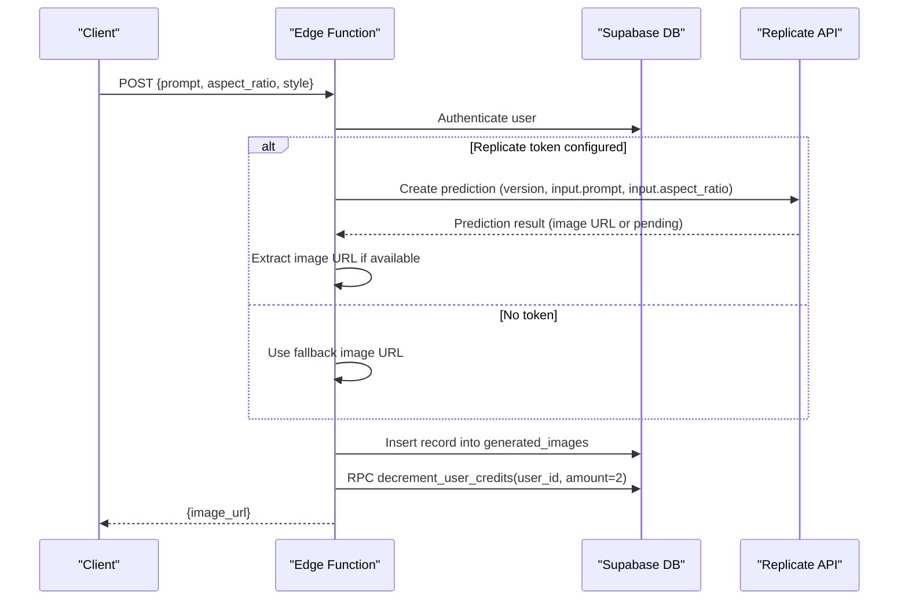
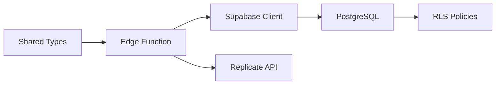

# Image Generation Function

<cite>
**Referenced Files in This Document**
- [generate-image/index.ts](file://supabase/functions/generate-image/index.ts)
- [initial_schema.sql](file://supabase/migrations/20240001000000_initial_schema.sql)
- [seed.sql](file://supabase/seed.sql)
- [api.ts](file://packages/types/src/api.ts)
- [ai-settings/page.tsx](file://apps/admin/src/app/(dashboard)/ai-settings/page.tsx)
</cite>

## Table of Contents
1. [Introduction](#introduction)
2. [Project Structure](#project-structure)
3. [Core Components](#core-components)
4. [Architecture Overview](#architecture-overview)
5. [Detailed Component Analysis](#detailed-component-analysis)
6. [Dependency Analysis](#dependency-analysis)
7. [Performance Considerations](#performance-considerations)
8. [Troubleshooting Guide](#troubleshooting-guide)
9. [Conclusion](#conclusion)
10. [Appendices](#appendices)

## Introduction
This document explains the AI image generation Edge Function that integrates with Replicate to create images from text prompts. It covers authentication, request formatting, response processing, supported styles and aspect ratios, credit system integration, error handling, storage workflows, URL management, caching strategies, debugging approaches, monitoring quality, and cost optimization techniques.

## Project Structure
The image generation feature is implemented as a Supabase Edge Function that:
- Authenticates users via Supabase Auth
- Validates inputs
- Calls Replicate’s API when configured
- Persists generated image metadata
- Deducts user credits
- Returns the resulting image URL

**Diagram sources**
- [generate-image/index.ts:14-79](file://supabase/functions/generate-image/index.ts#L14-L79)
- [initial_schema.sql:111-120](file://supabase/migrations/20240001000000_initial_schema.sql#L111-L120)
- [initial_schema.sql:159-193](file://supabase/migrations/20240001000000_initial_schema.sql#L159-L193)

**Section sources**
- [generate-image/index.ts:1-86](file://supabase/functions/generate-image/index.ts#L1-L86)
- [initial_schema.sql:111-120](file://supabase/migrations/20240001000000_initial_schema.sql#L111-L120)

## Core Components
- Authentication and authorization: The function authenticates requests using Supabase Auth and enforces Row Level Security on database tables.
- Input validation: Ensures a prompt is provided; defaults are applied for optional parameters.
- External API integration: When an environment token is present, the function calls Replicate to generate images.
- Persistence: Stores prompt, style, aspect ratio, and image URL in the generated_images table.
- Billing: Deducts two credits per successful generation via a database RPC call.

Key behaviors:
- If no Replicate token is configured, a placeholder image URL is used instead of failing.
- All responses include CORS headers for cross-origin access.

**Section sources**
- [generate-image/index.ts:14-79](file://supabase/functions/generate-image/index.ts#L14-L79)
- [initial_schema.sql:159-193](file://supabase/migrations/20240001000000_initial_schema.sql#L159-L193)

## Architecture Overview
The end-to-end flow for generating an image:

**Diagram sources**
- [generate-image/index.ts:21-79](file://supabase/functions/generate-image/index.ts#L21-L79)

## Detailed Component Analysis

### Authentication and Authorization
- The function constructs a Supabase client using environment variables and forwards the incoming Authorization header to authenticate the caller.
- If authentication fails or no user is found, it returns a 401 Unauthorized response.
- Database operations are protected by Row Level Security policies ensuring users can only access their own data.

**Section sources**
- [generate-image/index.ts:14-27](file://supabase/functions/generate-image/index.ts#L14-L27)
- [initial_schema.sql:159-193](file://supabase/migrations/20240001000000_initial_schema.sql#L159-L193)

### Request Validation and Defaults
- Required field: prompt. Missing prompt results in a 400 Bad Request.
- Optional fields:
  - aspect_ratio: defaults to '1:1'
  - style: defaults to 'Photorealistic'
- Supported aspect ratios and styles are defined in shared types for consistency across clients.

**Section sources**
- [generate-image/index.ts:29-36](file://supabase/functions/generate-image/index.ts#L29-L36)
- [api.ts:18-22](file://packages/types/src/api.ts#L18-L22)

### Replicate Integration
- When REPLICATE_API_TOKEN is set, the function calls Replicate’s predictions endpoint with:
  - A specific model version hash
  - An input object containing:
    - prompt: combines style, user prompt, and quality enhancers
    - aspect_ratio: passed through from the request
- On success, the first output URL is extracted and used as the image URL.
- If the token is not set, a placeholder image URL is used to keep the flow working without external dependencies.

**Section sources**
- [generate-image/index.ts:38-62](file://supabase/functions/generate-image/index.ts#L38-L62)

### Data Persistence
- After obtaining an image URL (either from Replicate or fallback), the function inserts a record into generated_images including:
  - user_id
  - prompt
  - image_url
  - aspect_ratio
  - style
- Row Level Security ensures only the owner can manage these records.

**Section sources**
- [generate-image/index.ts:64-71](file://supabase/functions/generate-image/index.ts#L64-L71)
- [initial_schema.sql:111-120](file://supabase/migrations/20240001000000_initial_schema.sql#L111-L120)
- [initial_schema.sql:192-193](file://supabase/migrations/20240001000000_initial_schema.sql#L192-L193)

### Credit System Integration
- Each successful generation deducts two credits from the user’s balance via a database RPC call named decrement_user_credits.
- User profile schema includes credits_remaining and credits_limit fields to track usage and quotas.

**Section sources**
- [generate-image/index.ts:73-74](file://supabase/functions/generate-image/index.ts#L73-L74)
- [initial_schema.sql:44-58](file://supabase/migrations/20240001000000_initial_schema.sql#L44-L58)

### Response Format
- On success: returns JSON with image_url.
- On error: returns JSON with error message and appropriate HTTP status codes (400, 401, 500).
- CORS headers are included to allow cross-origin requests.

**Section sources**
- [generate-image/index.ts:76-85](file://supabase/functions/generate-image/index.ts#L76-L85)

### Admin Configuration for Providers and Models
- The admin UI exposes configuration options for image provider and model slug, enabling future extensibility beyond Replicate.
- Current implementation uses Replicate with a fixed model version; additional providers can be integrated by extending the function logic.

**Section sources**
- [ai-settings/page.tsx:145-174](file://apps/admin/src/app/(dashboard)/ai-settings/page.tsx#L145-L174)

## Dependency Analysis
- External dependencies:
  - Deno standard library for serving HTTP functions
  - Supabase JS client for auth and database operations
  - Replicate REST API for image generation
- Internal dependencies:
  - Database schema for generated_images and profiles
  - Row Level Security policies for data isolation
  - Shared type definitions for consistent request/response contracts

**Diagram sources**
- [generate-image/index.ts:1-3](file://supabase/functions/generate-image/index.ts#L1-L3)
- [initial_schema.sql:159-193](file://supabase/migrations/20240001000000_initial_schema.sql#L159-L193)
- [api.ts:18-27](file://packages/types/src/api.ts#L18-L27)

**Section sources**
- [generate-image/index.ts:1-3](file://supabase/functions/generate-image/index.ts#L1-L3)
- [initial_schema.sql:159-193](file://supabase/migrations/20240001000000_initial_schema.sql#L159-L193)
- [api.ts:18-27](file://packages/types/src/api.ts#L18-L27)

## Performance Considerations
- Network latency: Replicate calls are synchronous within the function; consider implementing asynchronous polling if long-running generations are expected.
- Fallback behavior: Without a Replicate token, the function returns quickly using a placeholder URL.
- Database writes: Single insert per generation; ensure indexes exist on frequently queried columns like user_id and created_at.
- Cost efficiency:
  - Limit retries to avoid unnecessary charges.
  - Validate prompts before calling Replicate to reduce failed generations.
  - Cache repeated prompts at the application layer to avoid redundant API calls.

[No sources needed since this section provides general guidance]

## Troubleshooting Guide
Common issues and resolutions:
- Unauthorized errors: Ensure the Authorization header is correctly forwarded and the user session is valid.
- Missing prompt: Validate client-side before sending requests; the function returns 400 if prompt is absent.
- Replicate failures:
  - Check REPLICATE_API_TOKEN configuration.
  - Inspect the response payload from Replicate for error details.
  - Implement retry logic with exponential backoff for transient network errors.
- Credits deduction: Verify the decrement_user_credits RPC exists and has correct permissions.
- Storage and URLs:
  - Confirm generated_images records are inserted successfully.
  - Validate image_url accessibility and domain allowlists if used in restricted environments.

Error handling patterns:
- Input validation returns 400 with descriptive messages.
- Authentication failures return 401.
- Unexpected exceptions return 500 with error.message.

Monitoring and debugging:
- Log key steps in the function (e.g., user authenticated, Replicate called, credits deducted).
- Track metrics such as success rate, average latency, and credit usage per user.
- Use admin dashboards to review generated_images entries and correlate with user activity.

**Section sources**
- [generate-image/index.ts:21-36](file://supabase/functions/generate-image/index.ts#L21-L36)
- [generate-image/index.ts:76-85](file://supabase/functions/generate-image/index.ts#L76-L85)

## Conclusion
The image generation Edge Function provides a secure, validated, and auditable pipeline for creating AI-generated images via Replicate. It integrates tightly with Supabase for authentication, persistence, and billing, while offering a fallback path when external services are unavailable. By following the recommended practices for validation, error handling, caching, and monitoring, teams can maintain reliable performance and cost efficiency.

[No sources needed since this section summarizes without analyzing specific files]

## Appendices

### Supported Styles and Aspect Ratios
- Aspect ratios: '1:1', '16:9', '9:16', '4:5'
- Styles: 'photorealistic', 'digital-art', 'minimalist', '3d-render'

These are enforced by shared types to ensure consistency between clients and the backend.

**Section sources**
- [api.ts:18-22](file://packages/types/src/api.ts#L18-L22)

### Example Requests and Responses
- Request fields:
  - prompt (required)
  - aspect_ratio (optional, defaults to '1:1')
  - style (optional, defaults to 'Photorealistic')
- Success response:
  - image_url (string)
- Error response:
  - error (string)

Note: Actual code examples are omitted; refer to the function source for exact behavior.

**Section sources**
- [generate-image/index.ts:29-36](file://supabase/functions/generate-image/index.ts#L29-L36)
- [generate-image/index.ts:76-85](file://supabase/functions/generate-image/index.ts#L76-L85)

### Image Storage Workflows and URL Management
- Generated images are recorded in generated_images with user_id, prompt, image_url, aspect_ratio, and style.
- URLs may point to external hosting (e.g., Replicate outputs) or placeholders when tokens are missing.
- For production, consider downloading images to your own storage and replacing URLs with internal references for better control and caching.

**Section sources**
- [generate-image/index.ts:64-71](file://supabase/functions/generate-image/index.ts#L64-L71)
- [initial_schema.sql:111-120](file://supabase/migrations/20240001000000_initial_schema.sql#L111-L120)

### Caching Strategies
- Prompt-level cache: Store hashes of prompts and reuse previous image URLs to avoid duplicate generations.
- CDN caching: Serve images via a CDN to reduce bandwidth and improve load times.
- TTL-based invalidation: Invalidate cached entries when prompts change significantly or when new models are deployed.

[No sources needed since this section provides general guidance]

### Debugging Approaches for Failures
- Enable detailed logging around Replicate calls and database operations.
- Capture and store error payloads from Replicate for later analysis.
- Monitor credit deductions to detect anomalies or unexpected charges.
- Use admin tools to inspect generated_images and correlate with user sessions.

**Section sources**
- [generate-image/index.ts:76-85](file://supabase/functions/generate-image/index.ts#L76-L85)

### Monitoring Generation Quality
- Collect feedback on generated images (e.g., user ratings or rejection rates).
- Track style and aspect ratio distributions to identify underperforming configurations.
- Periodically review model versions and update to newer releases for improved quality.

[No sources needed since this section provides general guidance]

### Optimizing API Usage for Cost Efficiency
- Validate and enrich prompts client-side to reduce failed generations.
- Implement idempotency keys to prevent duplicate charges.
- Batch similar requests where possible and deduplicate identical prompts.
- Set reasonable timeouts and retry limits to avoid excessive costs.

[No sources needed since this section provides general guidance]