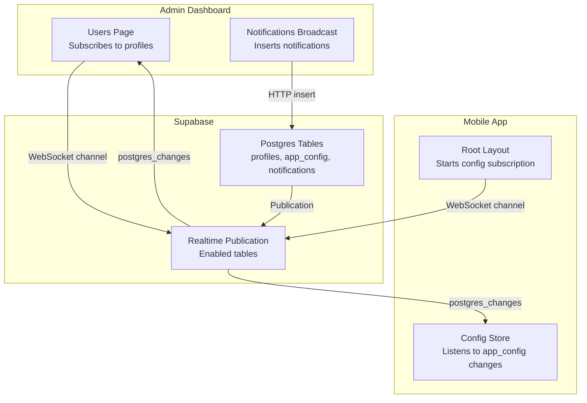
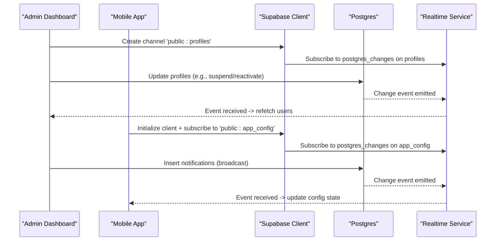
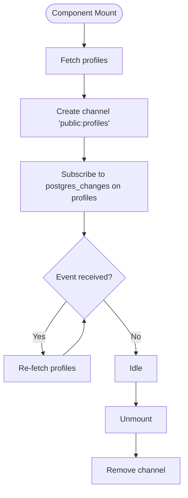
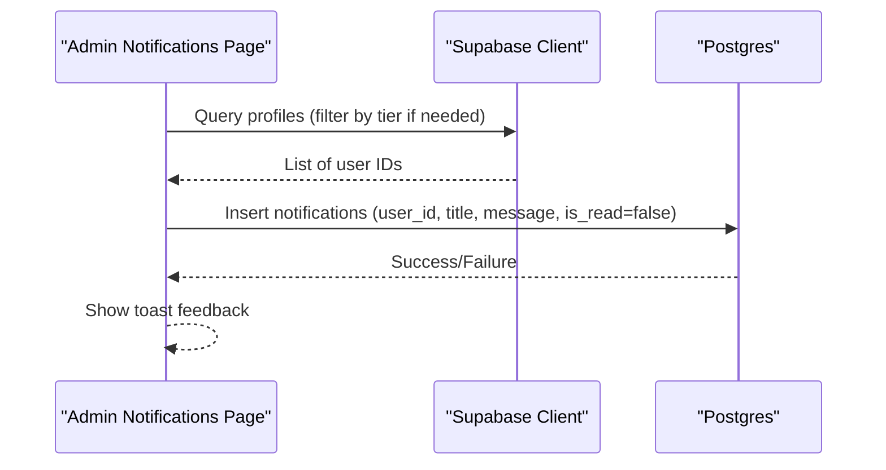
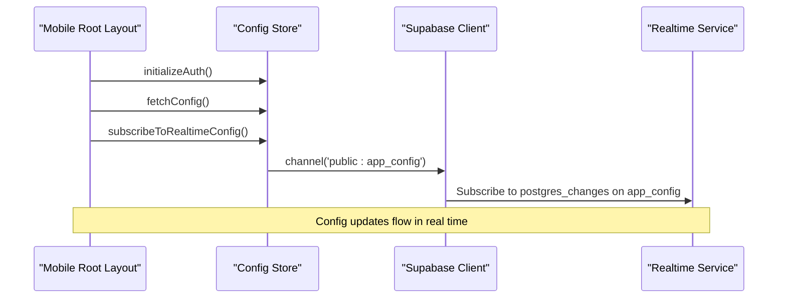
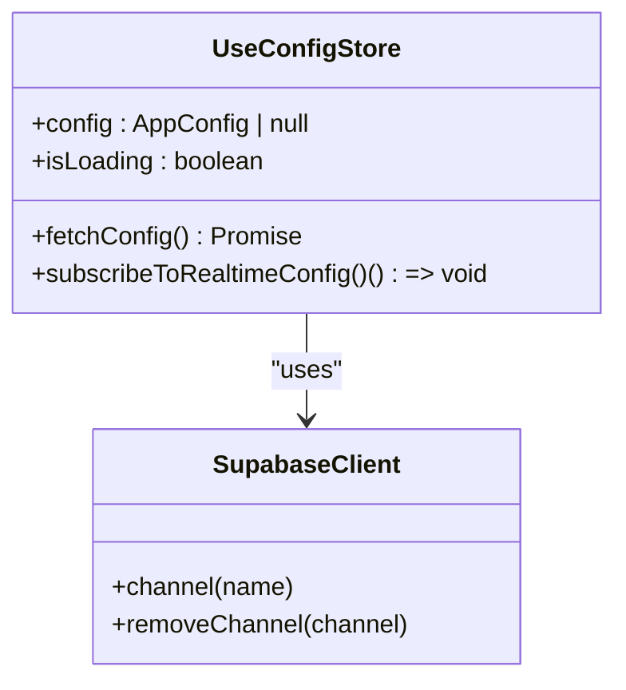
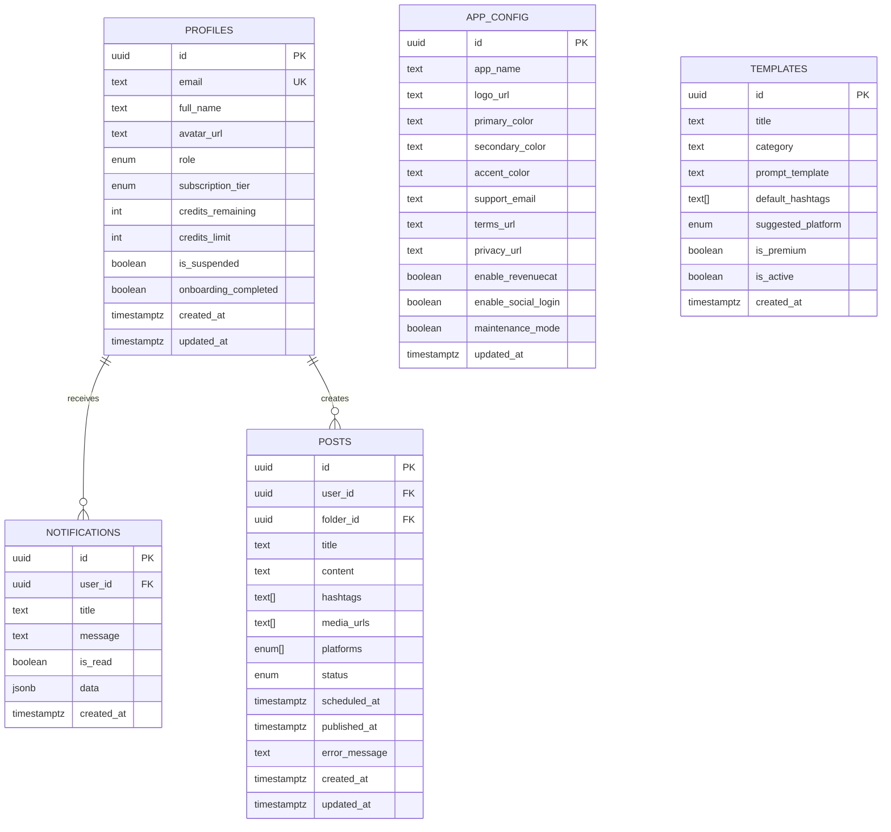
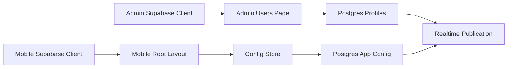

# Real-time Features

<cite>
**Referenced Files in This Document**
- [supabase.ts (admin)](file://apps/admin/src/lib/supabase.ts)
- [supabase.ts (mobile)](file://apps/mobile/src/services/supabase.ts)
- [users page.tsx](file://apps/admin/src/app/(dashboard)/users/page.tsx)
- [notifications page.tsx](file://apps/admin/src/app/(dashboard)/notifications/page.tsx)
- [useConfigStore.ts](file://apps/mobile/src/store/useConfigStore.ts)
- [_layout.tsx (mobile root)](file://apps/mobile/src/app/_layout.tsx)
- [initial schema.sql](file://supabase/migrations/20240001000000_initial_schema.sql)
</cite>

## Table of Contents
1. [Introduction](#introduction)
2. [Project Structure](#project-structure)
3. [Core Components](#core-components)
4. [Architecture Overview](#architecture-overview)
5. [Detailed Component Analysis](#detailed-component-analysis)
6. [Dependency Analysis](#dependency-analysis)
7. [Performance Considerations](#performance-considerations)
8. [Troubleshooting Guide](#troubleshooting-guide)
9. [Conclusion](#conclusion)
10. [Appendices](#appendices)

## Introduction
This document explains the real-time features implemented with Supabase WebSockets across the admin dashboard and mobile application. It covers how real-time subscriptions are established, how events are handled, and how state is synchronized between clients and the database. It also documents message formats, event types, payload structures, security considerations, and best practices for implementing custom real-time features, handling connection failures, managing subscription lifecycles, and optimizing performance.

## Project Structure
Real-time capabilities are enabled by:
- Enabling specific tables in the Supabase realtime publication so changes propagate via WebSockets.
- Admin dashboard subscribing to table changes to refresh UI instantly.
- Mobile app subscribing to configuration updates at app startup to keep runtime settings live.
- Admin broadcasting notifications by inserting rows into a dedicated table that can be consumed by clients.

**Diagram sources**
- [users page.tsx:32-46](file://apps/admin/src/app/(dashboard)/users/page.tsx#L32-L46)
- [notifications page.tsx:14-60](file://apps/admin/src/app/(dashboard)/notifications/page.tsx#L14-L60)
- [_layout.tsx (mobile root):64-72](file://apps/mobile/src/app/_layout.tsx#L64-L72)
- [useConfigStore.ts:39-66](file://apps/mobile/src/store/useConfigStore.ts#L39-L66)
- [initial schema.sql:227-231](file://supabase/migrations/20240001000000_initial_schema.sql#L227-L231)

**Section sources**
- [initial schema.sql:227-231](file://supabase/migrations/20240001000000_initial_schema.sql#L227-L231)

## Core Components
- Admin Supabase client initialization with session persistence and token refresh.
- Mobile Supabase client initialization with secure storage adapter for sessions.
- Admin users page subscribes to profile changes and re-fetches data on any change.
- Admin notifications broadcast inserts notification records targeting user segments.
- Mobile root layout initializes auth, fetches initial config, and starts a realtime subscription for app configuration.
- Mobile config store listens to app_config changes and updates global state.

**Section sources**
- [supabase.ts (admin):1-14](file://apps/admin/src/lib/supabase.ts#L1-L14)
- [supabase.ts (mobile):1-41](file://apps/mobile/src/services/supabase.ts#L1-L41)
- [users page.tsx:32-46](file://apps/admin/src/app/(dashboard)/users/page.tsx#L32-L46)
- [notifications page.tsx:14-60](file://apps/admin/src/app/(dashboard)/notifications/page.tsx#L14-L60)
- [_layout.tsx (mobile root):64-72](file://apps/mobile/src/app/_layout.tsx#L64-L72)
- [useConfigStore.ts:39-66](file://apps/mobile/src/store/useConfigStore.ts#L39-L66)

## Architecture Overview
The system uses Supabase’s realtime publication to stream Postgres changes to subscribed clients. The admin dashboard subscribes to profile changes to reflect administrative actions immediately. The mobile app subscribes to app configuration changes to update runtime settings without reloads. Notifications are dispatched by inserting rows into the notifications table; clients can consume these via realtime or polling depending on implementation.

**Diagram sources**
- [users page.tsx:32-46](file://apps/admin/src/app/(dashboard)/users/page.tsx#L32-L46)
- [useConfigStore.ts:39-66](file://apps/mobile/src/store/useConfigStore.ts#L39-L66)
- [notifications page.tsx:14-60](file://apps/admin/src/app/(dashboard)/notifications/page.tsx#L14-L60)
- [initial schema.sql:227-231](file://supabase/migrations/20240001000000_initial_schema.sql#L227-L231)

## Detailed Component Analysis

### Admin Users Page Real-time Subscription
- Establishes a realtime channel named 'public:profiles'.
- Subscribes to all postgres_changes events on the profiles table.
- On any change, triggers a data refresh to keep the admin view consistent.
- Properly unsubscribes when the component unmounts to avoid leaks.

**Diagram sources**
- [users page.tsx:32-46](file://apps/admin/src/app/(dashboard)/users/page.tsx#L32-L46)

**Section sources**
- [users page.tsx:32-46](file://apps/admin/src/app/(dashboard)/users/page.tsx#L32-L46)

### Admin Notifications Broadcast
- Collects target audience from profiles based on subscription tier.
- Inserts notification records in batch for selected users.
- Provides user feedback via toast messages for success or failure.

**Diagram sources**
- [notifications page.tsx:14-60](file://apps/admin/src/app/(dashboard)/notifications/page.tsx#L14-L60)

**Section sources**
- [notifications page.tsx:14-60](file://apps/admin/src/app/(dashboard)/notifications/page.tsx#L14-L60)

### Mobile Root Layout Initialization
- Initializes authentication.
- Fetches initial app configuration.
- Starts a realtime subscription to app_config changes.
- Ensures cleanup by returning an unsubscribe function.

**Diagram sources**
- [_layout.tsx (mobile root):64-72](file://apps/mobile/src/app/_layout.tsx#L64-L72)
- [useConfigStore.ts:39-66](file://apps/mobile/src/store/useConfigStore.ts#L39-L66)

**Section sources**
- [_layout.tsx (mobile root):64-72](file://apps/mobile/src/app/_layout.tsx#L64-L72)
- [useConfigStore.ts:39-66](file://apps/mobile/src/store/useConfigStore.ts#L39-L66)

### Mobile Config Store Real-time Handling
- Subscribes to 'public:app_config' changes.
- Updates global config state when new payload arrives.
- Returns an unsubscribe function to remove the channel safely.
- Guards against placeholder URLs to avoid unnecessary WebSocket attempts.

**Diagram sources**
- [useConfigStore.ts:1-66](file://apps/mobile/src/store/useConfigStore.ts#L1-L66)

**Section sources**
- [useConfigStore.ts:1-66](file://apps/mobile/src/store/useConfigStore.ts#L1-L66)

### Database Schema and Realtime Enablement
- Defines core tables including profiles, app_config, notifications, posts, templates.
- Enables Row Level Security policies for access control.
- Adds tables to the Supabase realtime publication to enable streaming changes.

**Diagram sources**
- [initial schema.sql:14-153](file://supabase/migrations/20240001000000_initial_schema.sql#L14-L153)

**Section sources**
- [initial schema.sql:14-153](file://supabase/migrations/20240001000000_initial_schema.sql#L14-L153)
- [initial schema.sql:227-231](file://supabase/migrations/20240001000000_initial_schema.sql#L227-L231)

## Dependency Analysis
- Admin and mobile apps depend on their respective Supabase client configurations.
- Admin users page depends on realtime channel management and data refresh logic.
- Mobile root layout depends on config store to bootstrap realtime subscriptions.
- All realtime streams depend on tables being added to the Supabase realtime publication.

**Diagram sources**
- [supabase.ts (admin):1-14](file://apps/admin/src/lib/supabase.ts#L1-L14)
- [supabase.ts (mobile):1-41](file://apps/mobile/src/services/supabase.ts#L1-L41)
- [users page.tsx:32-46](file://apps/admin/src/app/(dashboard)/users/page.tsx#L32-L46)
- [_layout.tsx (mobile root):64-72](file://apps/mobile/src/app/_layout.tsx#L64-L72)
- [useConfigStore.ts:39-66](file://apps/mobile/src/store/useConfigStore.ts#L39-L66)
- [initial schema.sql:227-231](file://supabase/migrations/20240001000000_initial_schema.sql#L227-L231)

**Section sources**
- [supabase.ts (admin):1-14](file://apps/admin/src/lib/supabase.ts#L1-L14)
- [supabase.ts (mobile):1-41](file://apps/mobile/src/services/supabase.ts#L1-L41)
- [users page.tsx:32-46](file://apps/admin/src/app/(dashboard)/users/page.tsx#L32-L46)
- [_layout.tsx (mobile root):64-72](file://apps/mobile/src/app/_layout.tsx#L64-L72)
- [useConfigStore.ts:39-66](file://apps/mobile/src/store/useConfigStore.ts#L39-L66)
- [initial schema.sql:227-231](file://supabase/migrations/20240001000000_initial_schema.sql#L227-L231)

## Performance Considerations
- Prefer targeted subscriptions to specific tables rather than wildcard channels to reduce overhead.
- Debounce or throttle UI updates triggered by frequent realtime events if necessary.
- Avoid redundant refetches; ensure handlers only trigger when relevant changes occur.
- Use placeholders guards in mobile to prevent unnecessary WebSocket connections during development.
- Keep realtime channels scoped to components’ lifecycles to prevent memory leaks.

[No sources needed since this section provides general guidance]

## Troubleshooting Guide
Common issues and resolutions:
- Placeholder URL usage: Ensure environment variables are set correctly; mobile guard prevents WebSocket attempts on dummy URLs.
- Missing realtime publication: Verify that required tables are added to the realtime publication.
- Subscription leaks: Always remove channels on component unmount.
- RLS policy errors: Confirm that policies allow intended operations for authenticated users and admins.

**Section sources**
- [supabase.ts (mobile):28-41](file://apps/mobile/src/services/supabase.ts#L28-L41)
- [initial schema.sql:227-231](file://supabase/migrations/20240001000000_initial_schema.sql#L227-L231)
- [users page.tsx:43-46](file://apps/admin/src/app/(dashboard)/users/page.tsx#L43-L46)
- [initial schema.sql:159-202](file://supabase/migrations/20240001000000_initial_schema.sql#L159-L202)

## Conclusion
The project implements robust real-time features using Supabase WebSockets. The admin dashboard leverages realtime subscriptions to maintain up-to-date views, while the mobile app subscribes to configuration changes to keep runtime settings current. Notifications are broadcast by inserting records into the notifications table, enabling scalable messaging. Security is enforced through Row Level Security policies, and realtime streams are enabled for key tables. Following the patterns documented here will help implement additional real-time features reliably and efficiently.

[No sources needed since this section summarizes without analyzing specific files]

## Appendices

### Message Formats and Event Types
- Realtime events are postgres_changes events emitted for INSERT, UPDATE, DELETE on subscribed tables.
- Payload includes metadata such as schema, table, and event type; new and old row values may be included depending on event.
- Notification payloads stored in the notifications table include fields like user_id, title, message, is_read, and optional JSONB data.

**Section sources**
- [initial schema.sql:134-143](file://supabase/migrations/20240001000000_initial_schema.sql#L134-L143)

### Implementing Custom Real-time Features
- Create a channel with a descriptive name scoped to the feature area.
- Subscribe to postgres_changes for the relevant table(s).
- Handle events to update local state or trigger refetches.
- Clean up subscriptions on unmount to prevent leaks.
- Guard against placeholder environments to avoid unnecessary connections.

**Section sources**
- [users page.tsx:32-46](file://apps/admin/src/app/(dashboard)/users/page.tsx#L32-L46)
- [useConfigStore.ts:39-66](file://apps/mobile/src/store/useConfigStore.ts#L39-L66)

### Security Considerations
- Enable Row Level Security on all tables to restrict access based on user roles and ownership.
- Use admin functions to enforce privileged operations.
- Validate client-side inputs before writing to the database.
- Limit realtime subscriptions to necessary tables to minimize exposure.

**Section sources**
- [initial schema.sql:159-202](file://supabase/migrations/20240001000000_initial_schema.sql#L159-L202)