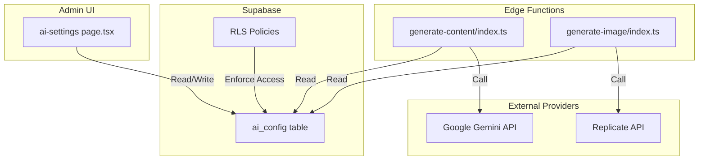
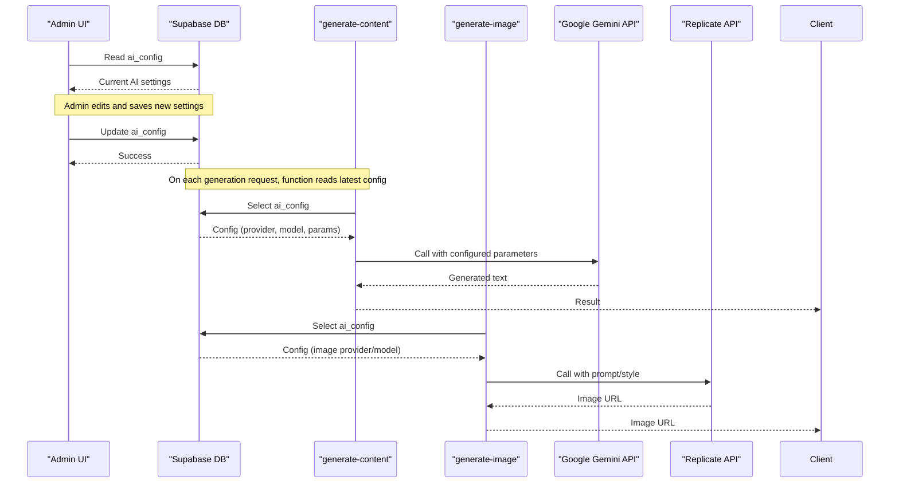
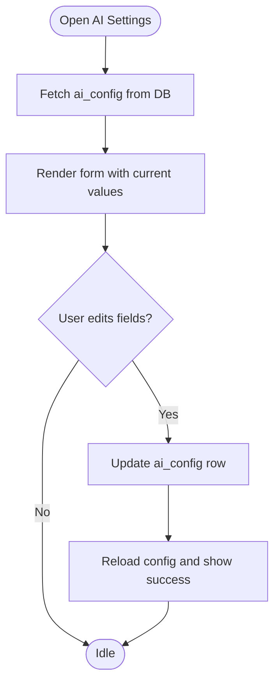
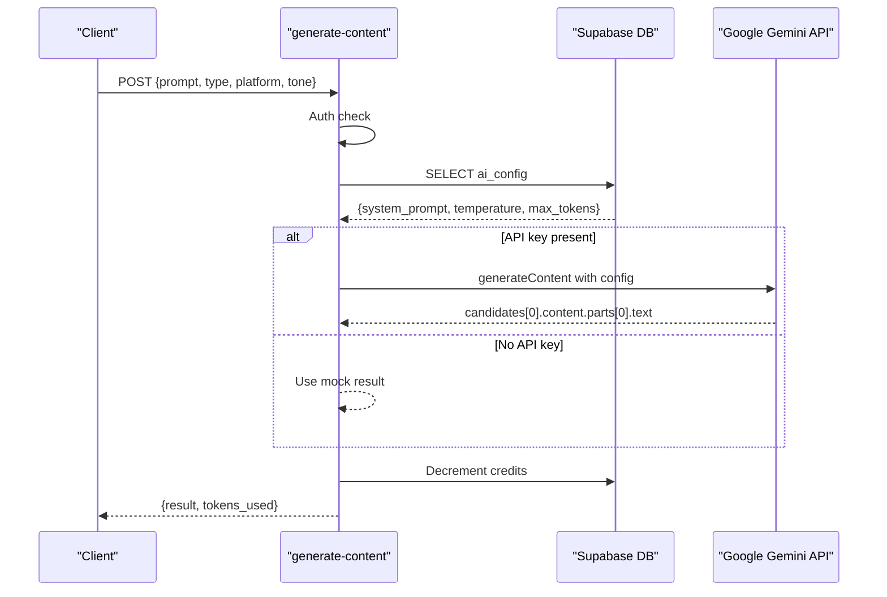
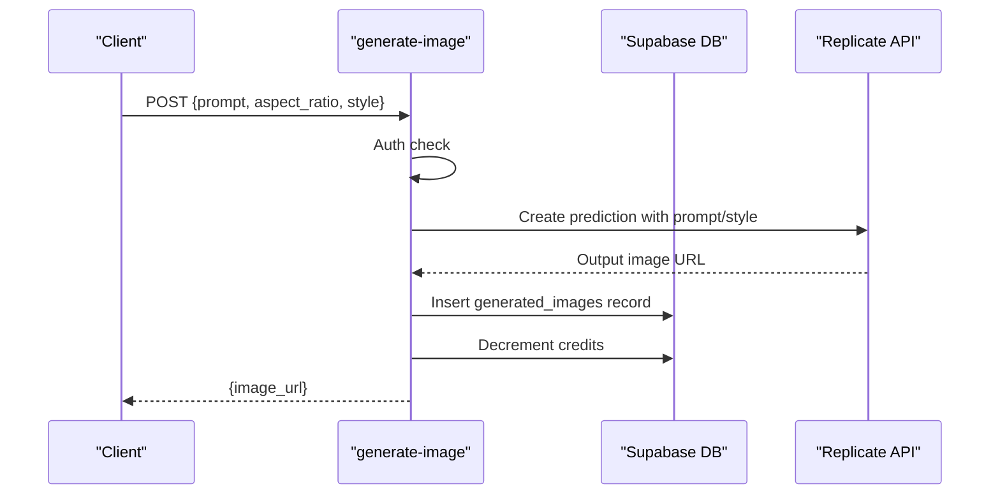
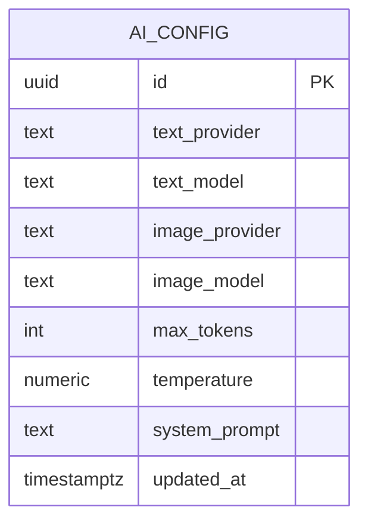
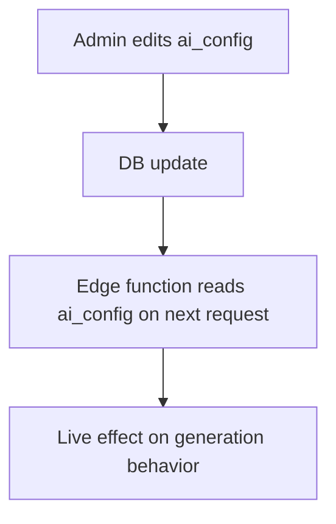
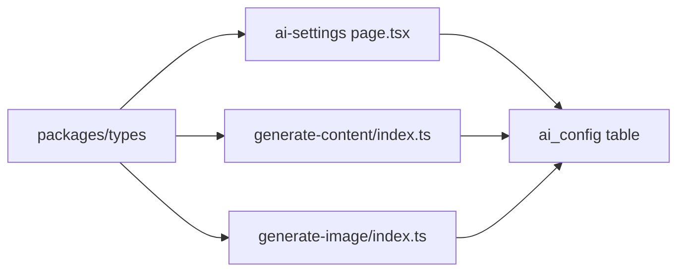
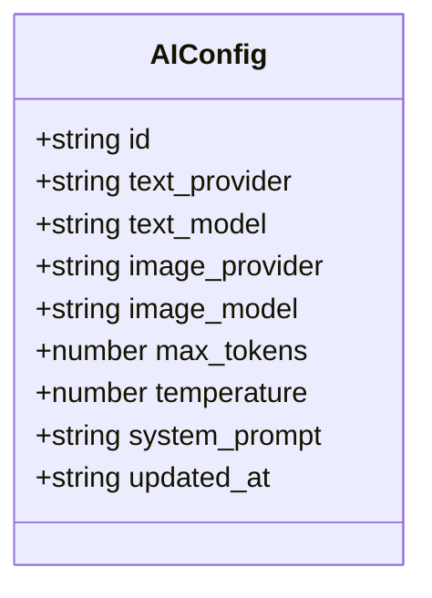

# AI Configuration Management

<cite>
**Referenced Files in This Document**
- [ai-settings page.tsx](file://apps/admin/src/app/(dashboard)/ai-settings/page.tsx)
- [generate-content index.ts](file://supabase/functions/generate-content/index.ts)
- [generate-image index.ts](file://supabase/functions/generate-image/index.ts)
- [initial schema.sql](file://supabase/migrations/20240001000000_initial_schema.sql)
- [database types.ts](file://packages/types/src/database.ts)
- [api types.ts](file://packages/types/src/api.ts)
- [useConfigStore.ts](file://apps/mobile/src/store/useConfigStore.ts)
- [TROUBLESHOOTING.md](file://TROUBLESHOOTING.md)
</cite>

## Table of Contents
1. [Introduction](#introduction)
2. [Project Structure](#project-structure)
3. [Core Components](#core-components)
4. [Architecture Overview](#architecture-overview)
5. [Detailed Component Analysis](#detailed-component-analysis)
6. [Dependency Analysis](#dependency-analysis)
7. [Performance Considerations](#performance-considerations)
8. [Security Considerations](#security-considerations)
9. [Troubleshooting Guide](#troubleshooting-guide)
10. [Conclusion](#conclusion)
11. [Appendices](#appendices)

## Introduction
This document explains the AI configuration management system that powers text and image generation across the application. It covers:
- The admin interface for configuring AI providers (Google Gemini, Replicate, Stability AI, OpenAI), model selection, and inference parameters.
- The configuration schema stored in the database and enforced by Row Level Security policies.
- Runtime configuration loading and caching mechanisms that enable dynamic updates without restarts.
- Common configuration scenarios such as switching models, tuning generation parameters, and setting up fallback behaviors.
- Security considerations for storing API keys and sensitive configuration data.
- Troubleshooting guidance and best practices for managing configurations across environments.

## Project Structure
The AI configuration spans three layers:
- Admin UI: A Next.js client page to read/write AI settings from the database.
- Serverless Functions: Supabase Edge Functions that fetch runtime configuration and call external AI APIs.
- Database Schema: Centralized configuration table with RLS policies controlling access.

**Diagram sources**
- [ai-settings page.tsx:23-85](file://apps/admin/src/app/(dashboard)/ai-settings/page.tsx#L23-L85)
- [generate-content index.ts:38-79](file://supabase/functions/generate-content/index.ts#L38-L79)
- [generate-image index.ts:38-62](file://supabase/functions/generate-image/index.ts#L38-L62)
- [initial schema.sql:31-42](file://supabase/migrations/20240001000000_initial_schema.sql#L31-L42)
- [initial schema.sql:170-176](file://supabase/migrations/20240001000000_initial_schema.sql#L170-L176)

**Section sources**
- [ai-settings page.tsx:1-256](file://apps/admin/src/app/(dashboard)/ai-settings/page.tsx#L1-L256)
- [generate-content index.ts:1-99](file://supabase/functions/generate-content/index.ts#L1-L99)
- [generate-image index.ts:1-87](file://supabase/functions/generate-image/index.ts#L1-L87)
- [initial schema.sql:1-232](file://supabase/migrations/20240001000000_initial_schema.sql#L1-L232)

## Core Components
- Admin AI Settings Page: Loads current AI configuration from the database, allows editing provider/model selections, temperature, max tokens, and system prompt, then persists changes.
- Text Generation Function: Authenticates user, reads active AI config, calls Google Gemini with configured parameters, and returns generated content.
- Image Generation Function: Authenticates user, reads active AI config, calls Replicate with provided prompt and style, stores result, and decrements credits.
- Database Schema and Types: Defines the ai_config table structure and TypeScript interfaces used across the app.

Key responsibilities:
- Centralize AI runtime settings in a single database row.
- Enforce admin-only writes via RLS policies.
- Provide server-side functions that consume the latest configuration at request time.

**Section sources**
- [ai-settings page.tsx:23-85](file://apps/admin/src/app/(dashboard)/ai-settings/page.tsx#L23-L85)
- [generate-content index.ts:38-79](file://supabase/functions/generate-content/index.ts#L38-L79)
- [generate-image index.ts:38-62](file://supabase/functions/generate-image/index.ts#L38-L62)
- [database types.ts:50-60](file://packages/types/src/database.ts#L50-L60)
- [initial schema.sql:31-42](file://supabase/migrations/20240001000000_initial_schema.sql#L31-L42)

## Architecture Overview
The runtime flow reads configuration on each request to ensure live updates without restarts.

**Diagram sources**
- [ai-settings page.tsx:23-85](file://apps/admin/src/app/(dashboard)/ai-settings/page.tsx#L23-L85)
- [generate-content index.ts:38-79](file://supabase/functions/generate-content/index.ts#L38-L79)
- [generate-image index.ts:38-62](file://supabase/functions/generate-image/index.ts#L38-L62)

## Detailed Component Analysis

### Admin AI Settings Interface
- Loads the current ai_config row and maps fields to form state.
- Allows selecting text and image providers, entering model slugs, adjusting temperature and max tokens, and editing the system prompt.
- Persists changes back to the ai_config table and refreshes the view.

**Diagram sources**
- [ai-settings page.tsx:23-85](file://apps/admin/src/app/(dashboard)/ai-settings/page.tsx#L23-L85)

**Section sources**
- [ai-settings page.tsx:23-85](file://apps/admin/src/app/(dashboard)/ai-settings/page.tsx#L23-L85)
- [ai-settings page.tsx:116-173](file://apps/admin/src/app/(dashboard)/ai-settings/page.tsx#L116-L173)
- [ai-settings page.tsx:176-216](file://apps/admin/src/app/(dashboard)/ai-settings/page.tsx#L176-L216)
- [ai-settings page.tsx:218-235](file://apps/admin/src/app/(dashboard)/ai-settings/page.tsx#L218-L235)

### Text Generation Function
- Authenticates the caller and validates input.
- Reads the active ai_config to obtain system_prompt, temperature, and max_tokens.
- Calls Google Gemini with the configured model and parameters; if no API key is set, returns a mock response.
- Decrements user credits and returns the generated text.

**Diagram sources**
- [generate-content index.ts:14-36](file://supabase/functions/generate-content/index.ts#L14-L36)
- [generate-content index.ts:38-79](file://supabase/functions/generate-content/index.ts#L38-L79)
- [generate-content index.ts:82-91](file://supabase/functions/generate-content/index.ts#L82-L91)

**Section sources**
- [generate-content index.ts:14-91](file://supabase/functions/generate-content/index.ts#L14-L91)

### Image Generation Function
- Authenticates the caller and validates input.
- Reads environment token for Replicate and calls its predictions endpoint with prompt and aspect ratio.
- Stores the generated image metadata and decrements credits.

**Diagram sources**
- [generate-image index.ts:14-36](file://supabase/functions/generate-image/index.ts#L14-L36)
- [generate-image index.ts:38-62](file://supabase/functions/generate-image/index.ts#L38-L62)
- [generate-image index.ts:64-79](file://supabase/functions/generate-image/index.ts#L64-L79)

**Section sources**
- [generate-image index.ts:14-79](file://supabase/functions/generate-image/index.ts#L14-L79)

### Configuration Schema and Validation
- The ai_config table centralizes provider/model selections and inference parameters.
- Default values are defined in the schema to ensure safe operation even before explicit configuration.
- RLS policies allow authenticated users to read configuration and restrict modifications to admins.

**Diagram sources**
- [initial schema.sql:31-42](file://supabase/migrations/20240001000000_initial_schema.sql#L31-L42)

**Section sources**
- [initial schema.sql:31-42](file://supabase/migrations/20240001000000_initial_schema.sql#L31-L42)
- [initial schema.sql:170-176](file://supabase/migrations/20240001000000_initial_schema.sql#L170-L176)
- [database types.ts:50-60](file://packages/types/src/database.ts#L50-L60)

### Runtime Loading and Caching
- Admin UI loads and updates ai_config directly from the database.
- Edge Functions read ai_config per request, ensuring immediate effect of changes without restarts.
- Mobile app demonstrates real-time subscription patterns for related configuration tables, illustrating how live updates can be propagated to clients.

**Diagram sources**
- [ai-settings page.tsx:23-85](file://apps/admin/src/app/(dashboard)/ai-settings/page.tsx#L23-L85)
- [generate-content index.ts:38-47](file://supabase/functions/generate-content/index.ts#L38-L47)
- [useConfigStore.ts:39-65](file://apps/mobile/src/store/useConfigStore.ts#L39-L65)

**Section sources**
- [ai-settings page.tsx:23-85](file://apps/admin/src/app/(dashboard)/ai-settings/page.tsx#L23-L85)
- [generate-content index.ts:38-47](file://supabase/functions/generate-content/index.ts#L38-L47)
- [useConfigStore.ts:39-65](file://apps/mobile/src/store/useConfigStore.ts#L39-L65)

## Dependency Analysis
- Admin UI depends on Supabase client to read/write ai_config.
- Edge Functions depend on Supabase client for auth and DB access, plus environment variables for provider credentials.
- Types package provides shared interfaces for configuration and API contracts.

**Diagram sources**
- [ai-settings page.tsx:23-85](file://apps/admin/src/app/(dashboard)/ai-settings/page.tsx#L23-L85)
- [generate-content index.ts:38-79](file://supabase/functions/generate-content/index.ts#L38-L79)
- [generate-image index.ts:38-62](file://supabase/functions/generate-image/index.ts#L38-L62)
- [database types.ts:50-60](file://packages/types/src/database.ts#L50-L60)
- [api types.ts:3-27](file://packages/types/src/api.ts#L3-L27)

**Section sources**
- [ai-settings page.tsx:23-85](file://apps/admin/src/app/(dashboard)/ai-settings/page.tsx#L23-L85)
- [generate-content index.ts:38-79](file://supabase/functions/generate-content/index.ts#L38-L79)
- [generate-image index.ts:38-62](file://supabase/functions/generate-image/index.ts#L38-L62)
- [database types.ts:50-60](file://packages/types/src/database.ts#L50-L60)
- [api types.ts:3-27](file://packages/types/src/api.ts#L3-L27)

## Performance Considerations
- Per-request configuration reads avoid stale caches and eliminate restart requirements.
- Keep temperature and max_tokens within reasonable bounds to control latency and cost.
- Prefer efficient prompts and concise system prompts to reduce token usage.
- For high-throughput scenarios, consider adding short-lived caching of ai_config in edge functions with cache invalidation on write events.

## Security Considerations
- Store provider credentials (e.g., Gemini API key, Replicate token) in Supabase Edge Function environment secrets, not in the database or client code.
- Restrict ai_config writes to administrators using RLS policies.
- Validate inputs in edge functions to prevent injection or misuse.
- Log administrative changes to ai_config via audit logs for accountability.
- Rotate API keys regularly and limit exposure to only necessary environments.

**Section sources**
- [initial schema.sql:170-176](file://supabase/migrations/20240001000000_initial_schema.sql#L170-L176)
- [generate-content index.ts:49-79](file://supabase/functions/generate-content/index.ts#L49-L79)
- [generate-image index.ts:38-62](file://supabase/functions/generate-image/index.ts#L38-L62)

## Troubleshooting Guide
Common issues and resolutions:
- Empty or permission-denied results when querying configuration: Ensure RLS policies are applied by running the initial schema migration.
- Admin login denied: Verify user role in profiles table is set to admin or super_admin.
- Realtime updates not reflecting: Confirm realtime publication includes the relevant configuration table.

Operational checks:
- Confirm Supabase connection health and that ai_config row exists.
- Verify environment secrets for provider credentials are set in Supabase Edge Functions.
- Validate that edge functions return expected responses and that credit decrement logic executes.

**Section sources**
- [TROUBLESHOOTING.md:9-23](file://TROUBLESHOOTING.md#L9-L23)
- [initial schema.sql:170-176](file://supabase/migrations/20240001000000_initial_schema.sql#L170-L176)

## Conclusion
The AI configuration management system centralizes provider and model settings in a secure, admin-controlled database table. The admin UI enables dynamic updates, while serverless functions consume the latest configuration on each request. This design supports flexible model switching, parameter tuning, and robust security through RLS and environment-scoped secrets. Following the troubleshooting steps and security best practices ensures reliable operation across environments.

## Appendices

### Configuration Scenarios
- Switching between different text models: Update text_provider and text_model in the admin UI; changes take effect immediately on subsequent generations.
- Adjusting generation parameters: Modify temperature and max_tokens to balance creativity and output length.
- Setting up fallback providers: Configure primary provider and model; if credentials are missing, functions may fall back to mock or alternative paths depending on implementation.

**Section sources**
- [ai-settings page.tsx:116-173](file://apps/admin/src/app/(dashboard)/ai-settings/page.tsx#L116-L173)
- [ai-settings page.tsx:176-216](file://apps/admin/src/app/(dashboard)/ai-settings/page.tsx#L176-L216)
- [generate-content index.ts:49-79](file://supabase/functions/generate-content/index.ts#L49-L79)

### Data Model Reference

**Diagram sources**
- [database types.ts:50-60](file://packages/types/src/database.ts#L50-L60)