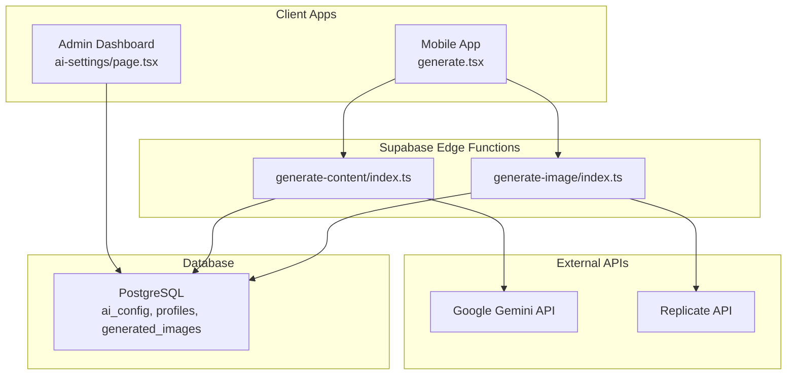
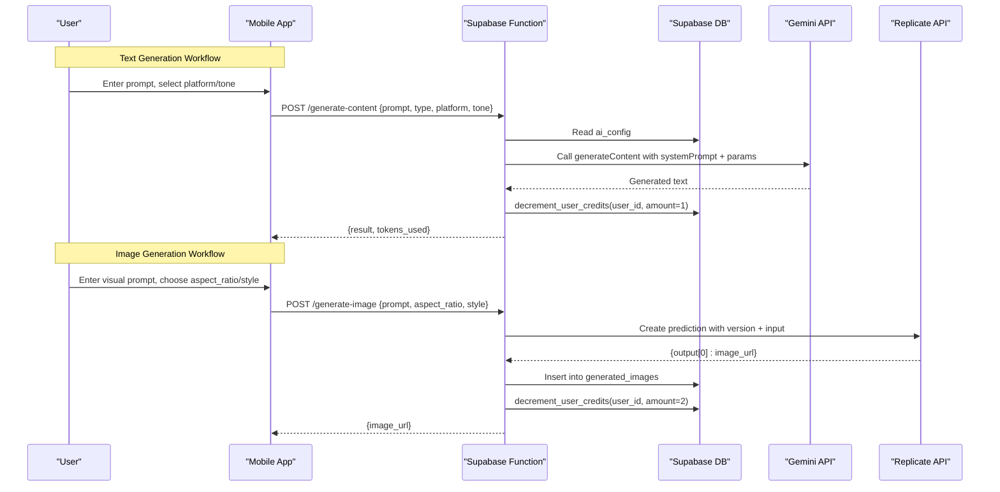
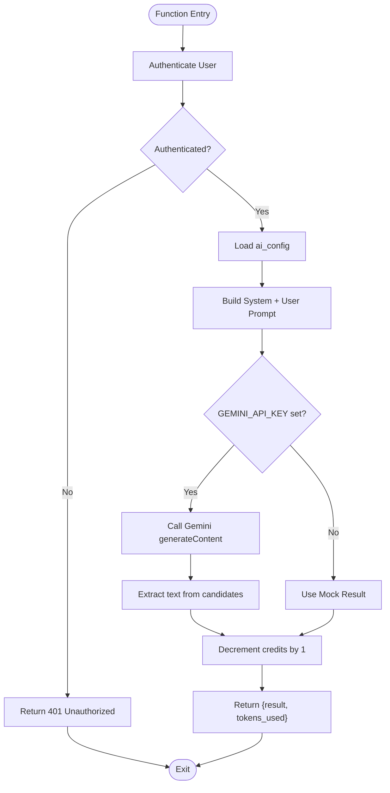
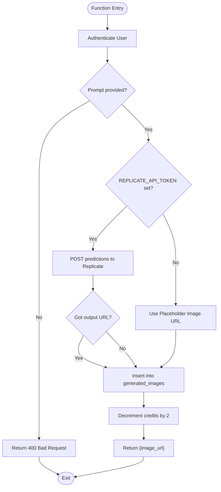
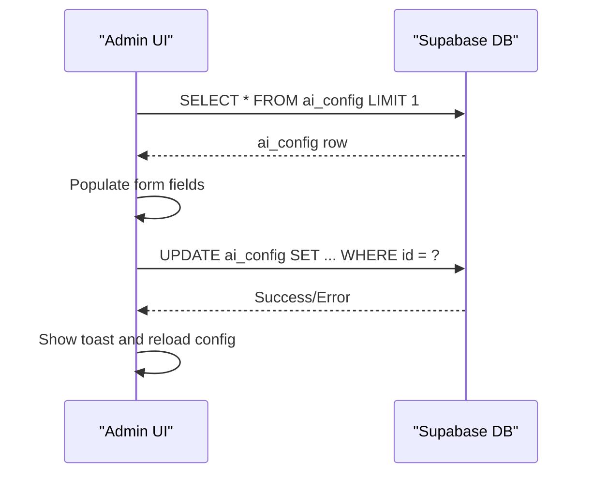
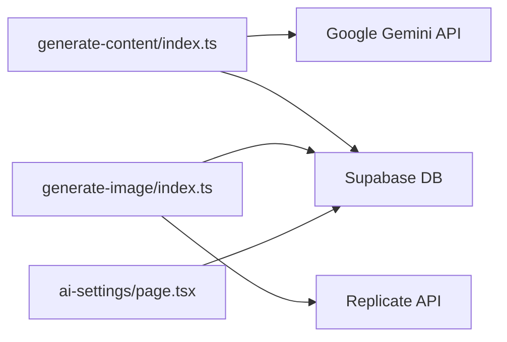

# AI Content Generation

<cite>
**Referenced Files in This Document**
- [generate-content/index.ts](file://supabase/functions/generate-content/index.ts)
- [generate-image/index.ts](file://supabase/functions/generate-image/index.ts)
- [ai-settings/page.tsx](file://apps/admin/src/app/(dashboard)/ai-settings/page.tsx)
- [initial_schema.sql](file://supabase/migrations/20240001000000_initial_schema.sql)
- [api.ts](file://packages/types/src/api.ts)
- [generate.tsx](file://apps/mobile/src/app/(tabs)/generate.tsx)
</cite>

## Table of Contents
1. [Introduction](#introduction)
2. [Project Structure](#project-structure)
3. [Core Components](#core-components)
4. [Architecture Overview](#architecture-overview)
5. [Detailed Component Analysis](#detailed-component-analysis)
6. [Dependency Analysis](#dependency-analysis)
7. [Performance Considerations](#performance-considerations)
8. [Troubleshooting Guide](#troubleshooting-guide)
9. [Conclusion](#conclusion)
10. [Appendices](#appendices)

## Introduction
This document explains the AI-powered content generation system, focusing on:
- Text generation using Google Gemini API with prompt engineering and model configuration
- Image generation via Replicate API with aspect ratios, styles, and quality settings
- Credit-based usage tracking that deducts credits per generation
- Error handling strategies and fallback mechanisms
- Admin interface for managing provider settings, models, and parameters
- Common workflows and best practices for optimal results

## Project Structure
The AI generation system is implemented as serverless functions backed by Supabase, with an admin UI to configure providers and a mobile app to trigger generations.

**Diagram sources**
- [generate-content/index.ts:1-99](file://supabase/functions/generate-content/index.ts#L1-L99)
- [generate-image/index.ts:1-87](file://supabase/functions/generate-image/index.ts#L1-L87)
- [ai-settings/page.tsx:1-256](file://apps/admin/src/app/(dashboard)/ai-settings/page.tsx#L1-L256)
- [initial_schema.sql:31-42](file://supabase/migrations/20240001000000_initial_schema.sql#L31-L42)
- [initial_schema.sql:111-120](file://supabase/migrations/20240001000000_initial_schema.sql#L111-L120)
- [initial_schema.sql:44-58](file://supabase/migrations/20240001000000_initial_schema.sql#L44-L58)

**Section sources**
- [generate-content/index.ts:1-99](file://supabase/functions/generate-content/index.ts#L1-L99)
- [generate-image/index.ts:1-87](file://supabase/functions/generate-image/index.ts#L1-L87)
- [ai-settings/page.tsx:1-256](file://apps/admin/src/app/(dashboard)/ai-settings/page.tsx#L1-L256)
- [initial_schema.sql:31-42](file://supabase/migrations/20240001000000_initial_schema.sql#L31-L42)
- [initial_schema.sql:111-120](file://supabase/migrations/20240001000000_initial_schema.sql#L111-L120)
- [initial_schema.sql:44-58](file://supabase/migrations/20240001000000_initial_schema.sql#L44-L58)

## Core Components
- Text generation function: authenticates user, reads AI config, calls Gemini, decrements credits, returns result
- Image generation function: authenticates user, validates inputs, calls Replicate (or uses fallback), stores image metadata, decrements credits
- Admin AI settings page: loads and updates AI configuration including providers, models, temperature, max tokens, and system prompt
- Database schema: defines ai_config, profiles (with credits), and generated_images tables; includes RLS policies
- Types: define request/response contracts for text and image generation

**Section sources**
- [generate-content/index.ts:14-99](file://supabase/functions/generate-content/index.ts#L14-L99)
- [generate-image/index.ts:14-87](file://supabase/functions/generate-image/index.ts#L14-L87)
- [ai-settings/page.tsx:23-85](file://apps/admin/src/app/(dashboard)/ai-settings/page.tsx#L23-L85)
- [initial_schema.sql:31-42](file://supabase/migrations/20240001000000_initial_schema.sql#L31-L42)
- [initial_schema.sql:44-58](file://supabase/migrations/20240001000000_initial_schema.sql#L44-L58)
- [initial_schema.sql:111-120](file://supabase/migrations/20240001000000_initial_schema.sql#L111-L120)
- [api.ts:3-33](file://packages/types/src/api.ts#L3-L33)

## Architecture Overview
The system centralizes AI configuration in the database and enforces credit accounting through database RPCs. Client apps call Supabase Edge Functions which authenticate users, read configuration, invoke external AI providers, persist outputs, and adjust credits.

**Diagram sources**
- [generate-content/index.ts:29-91](file://supabase/functions/generate-content/index.ts#L29-L91)
- [generate-image/index.ts:29-79](file://supabase/functions/generate-image/index.ts#L29-L79)
- [initial_schema.sql:31-42](file://supabase/migrations/20240001000000_initial_schema.sql#L31-L42)
- [initial_schema.sql:111-120](file://supabase/migrations/20240001000000_initial_schema.sql#L111-L120)

## Detailed Component Analysis

### Text Generation Workflow (Google Gemini)
- Authentication and authorization: The function extracts the user from the request context and rejects unauthenticated requests.
- Configuration loading: Reads the active ai_config row to obtain system_prompt, temperature, and max_tokens.
- Prompt engineering: Builds a user message combining system_prompt with task-specific instructions (type, platform, tone, prompt).
- Model invocation: Calls Gemini’s generateContent endpoint with generationConfig (temperature, maxOutputTokens).
- Response processing: Extracts the first candidate’s text or falls back to a mock response when API key is missing.
- Usage accounting: Decrements user credits by 1 via a database RPC and returns tokens_used.

**Diagram sources**
- [generate-content/index.ts:14-99](file://supabase/functions/generate-content/index.ts#L14-L99)

**Section sources**
- [generate-content/index.ts:14-99](file://supabase/functions/generate-content/index.ts#L14-L99)
- [api.ts:3-16](file://packages/types/src/api.ts#L3-L16)

### Image Generation Workflow (Replicate)
- Input validation: Requires a non-empty prompt; defaults for aspect_ratio and style are provided.
- Provider integration: If REPLICATE_API_TOKEN is configured, creates a prediction with a specific model version and input (prompt augmented with style and quality cues, plus aspect_ratio).
- Fallback behavior: If no token is present, uses a placeholder image URL.
- Persistence: Stores user_id, prompt, image_url, aspect_ratio, and style in generated_images.
- Usage accounting: Decrements user credits by 2 via a database RPC.

**Diagram sources**
- [generate-image/index.ts:14-87](file://supabase/functions/generate-image/index.ts#L14-L87)

**Section sources**
- [generate-image/index.ts:14-87](file://supabase/functions/generate-image/index.ts#L14-L87)
- [initial_schema.sql:111-120](file://supabase/migrations/20240001000000_initial_schema.sql#L111-L120)

### AI Configuration Management Interface
- Loads current ai_config values into form fields: text_provider, text_model, image_provider, image_model, temperature, max_tokens, system_prompt.
- Allows administrators to update these fields and persists changes to ai_config.
- Provides user feedback via toast notifications on success or failure.

**Diagram sources**
- [ai-settings/page.tsx:23-85](file://apps/admin/src/app/(dashboard)/ai-settings/page.tsx#L23-L85)

**Section sources**
- [ai-settings/page.tsx:23-85](file://apps/admin/src/app/(dashboard)/ai-settings/page.tsx#L23-L85)
- [initial_schema.sql:31-42](file://supabase/migrations/20240001000000_initial_schema.sql#L31-L42)

### Data Models and Contracts
- Text generation request/response types include prompt, type, platform, tone, targetAudience, language, and tokens_used.
- Image generation request/response types include prompt, aspect_ratio options, style options, and image_url.
- Database tables:
  - ai_config: centralizes provider/model selection and inference parameters
  - profiles: holds credits_remaining and credits_limit
  - generated_images: records prompts and resulting images with metadata

**Section sources**
- [api.ts:3-33](file://packages/types/src/api.ts#L3-L33)
- [initial_schema.sql:31-42](file://supabase/migrations/20240001000000_initial_schema.sql#L31-L42)
- [initial_schema.sql:44-58](file://supabase/migrations/20240001000000_initial_schema.sql#L44-L58)
- [initial_schema.sql:111-120](file://supabase/migrations/20240001000000_initial_schema.sql#L111-L120)

## Dependency Analysis
- External dependencies:
  - Google Gemini API for text generation
  - Replicate API for image generation
- Internal dependencies:
  - Supabase client for authentication and data access
  - Database RPC decrement_user_credits for usage accounting
  - ai_config table for runtime model and parameter selection

**Diagram sources**
- [generate-content/index.ts:48-91](file://supabase/functions/generate-content/index.ts#L48-L91)
- [generate-image/index.ts:38-79](file://supabase/functions/generate-image/index.ts#L38-L79)
- [ai-settings/page.tsx:23-85](file://apps/admin/src/app/(dashboard)/ai-settings/page.tsx#L23-L85)

**Section sources**
- [generate-content/index.ts:48-91](file://supabase/functions/generate-content/index.ts#L48-L91)
- [generate-image/index.ts:38-79](file://supabase/functions/generate-image/index.ts#L38-L79)
- [ai-settings/page.tsx:23-85](file://apps/admin/src/app/(dashboard)/ai-settings/page.tsx#L23-L85)

## Performance Considerations
- Token limits: max_output_tokens is configurable via ai_config to control response length and cost.
- Temperature: Adjust creativity vs determinism via ai_config temperature.
- Image resolution and style: The image prompt includes quality cues; consider adjusting style and aspect ratio for performance and relevance.
- Caching: Not currently implemented; consider caching frequent prompts or responses at the application layer if needed.
- Concurrency: Each function call is independent; monitor external API rate limits and implement retries/backoff where appropriate.

[No sources needed since this section provides general guidance]

## Troubleshooting Guide
Common issues and mitigations:
- Missing API keys:
  - Text: If GEMINI_API_KEY is not set, the function returns a mock result. Configure secrets in Supabase to enable real generation.
  - Image: If REPLICATE_API_TOKEN is not set, a placeholder image URL is returned. Configure secrets to enable real generation.
- Unauthorized access:
  - Both functions validate the authenticated user; ensure proper Authorization headers are passed.
- Validation errors:
  - Text requires a prompt; image requires a visual prompt. Ensure clients send required fields.
- Credits deduction:
  - Ensure the decrement_user_credits RPC exists and is callable by the function’s service role.
- Rate limiting:
  - Implement retry logic with exponential backoff in client code or edge functions to handle transient provider errors.
- Fallbacks:
  - Text generation falls back to a mock response when API key is missing.
  - Image generation falls back to a placeholder URL when provider token is missing.

**Section sources**
- [generate-content/index.ts:48-99](file://supabase/functions/generate-content/index.ts#L48-L99)
- [generate-image/index.ts:38-87](file://supabase/functions/generate-image/index.ts#L38-L87)

## Conclusion
The AI content generation system provides a robust, configurable pipeline for text and image creation. It centralizes model selection and parameters in the database, enforces credit accounting, and offers clear fallback behaviors. Administrators can tune providers and inference parameters via the admin UI, while clients benefit from consistent interfaces and reliable error handling.

[No sources needed since this section summarizes without analyzing specific files]

## Appendices

### Common Workflows and Best Practices
- Generate caption for Instagram:
  - Select platform: instagram
  - Type: caption
  - Tone: Professional or Casual
  - Provide a concise topic or notes
  - Expect 1 credit deduction
- Generate hashtags:
  - Type: hashtags
  - Provide topic and target audience
  - Expect 1 credit deduction
- Generate post ideas:
  - Type: post_ideas
  - Provide theme or niche
  - Expect 1 credit deduction
- Generate thread:
  - Type: thread
  - Provide narrative outline
  - Expect 1 credit deduction
- Generate image:
  - Provide a descriptive visual prompt
  - Choose aspect_ratio: 1:1, 9:16, 16:9, 4:5
  - Choose style: Photorealistic, 3D Render, Cyberpunk, Digital Art, Minimalist
  - Expect 2 credit deduction

Best practices:
- Be specific in prompts to improve output quality
- Use appropriate aspect ratios for the target platform
- Tune temperature and max_tokens based on desired creativity and length
- Monitor credits and plan generation batches to avoid unexpected depletion

**Section sources**
- [generate.tsx:44-69](file://apps/mobile/src/app/(tabs)/generate.tsx#L44-L69)
- [generate.tsx:123-169](file://apps/mobile/src/app/(tabs)/generate.tsx#L123-L169)
- [api.ts:3-33](file://packages/types/src/api.ts#L3-L33)