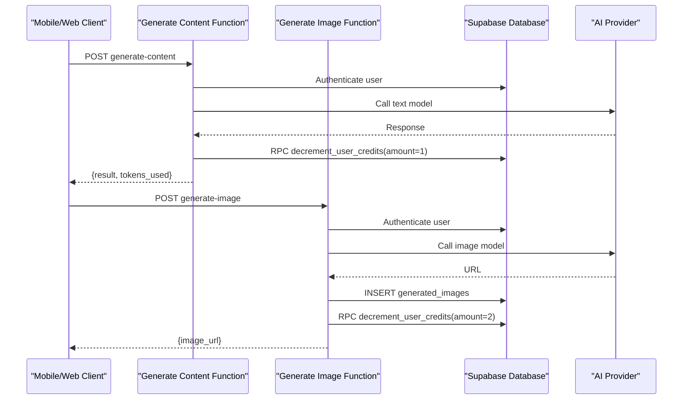
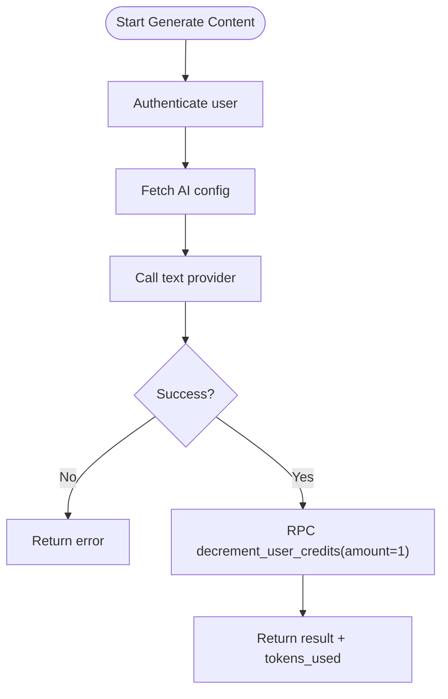
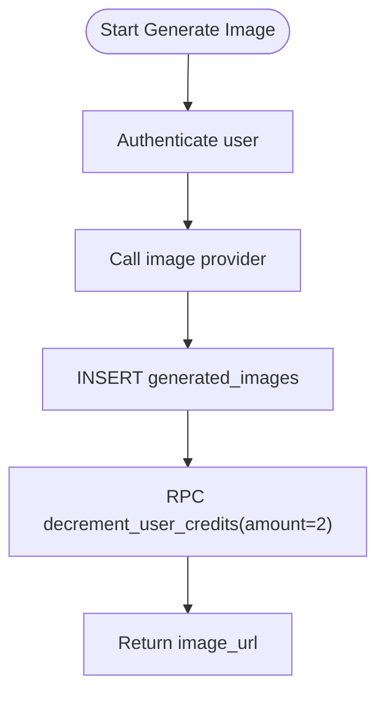
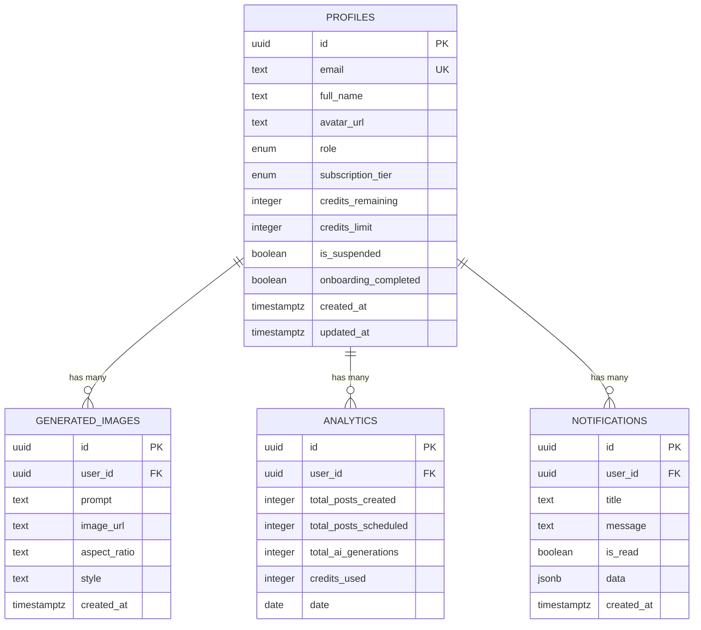
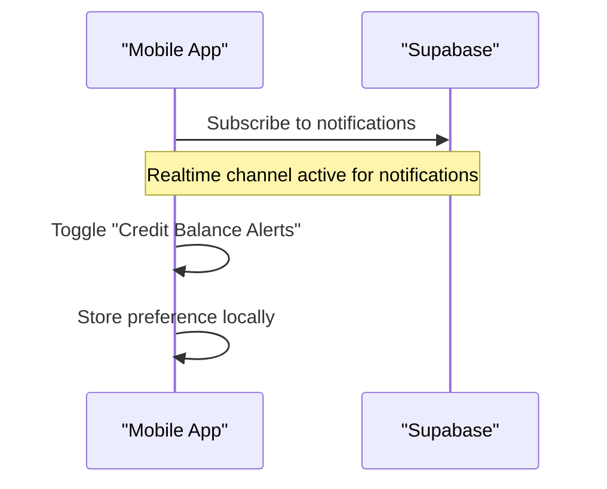
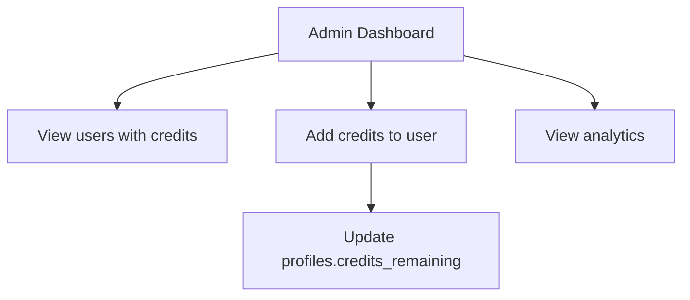
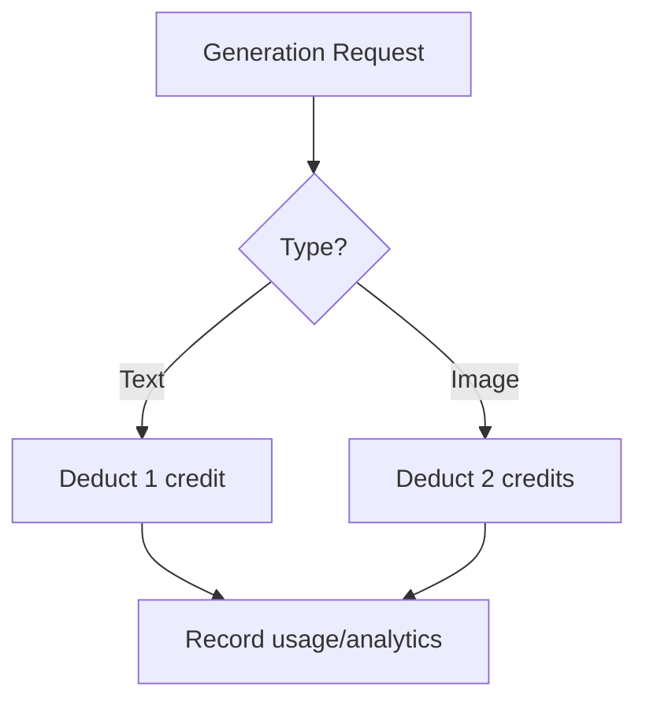
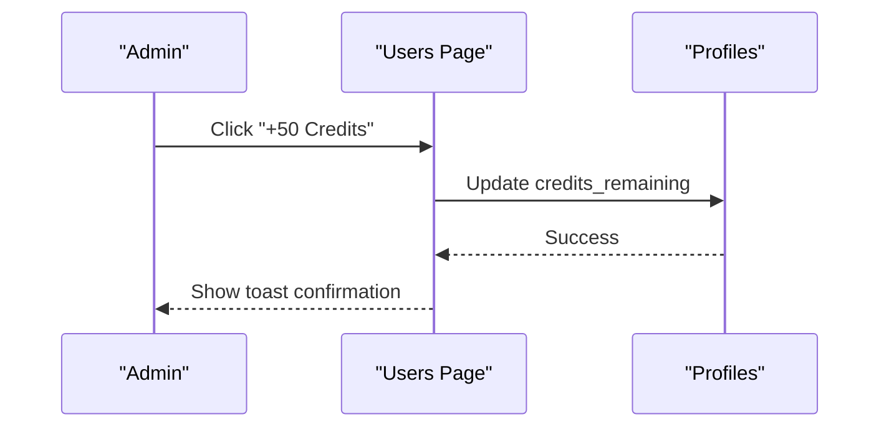
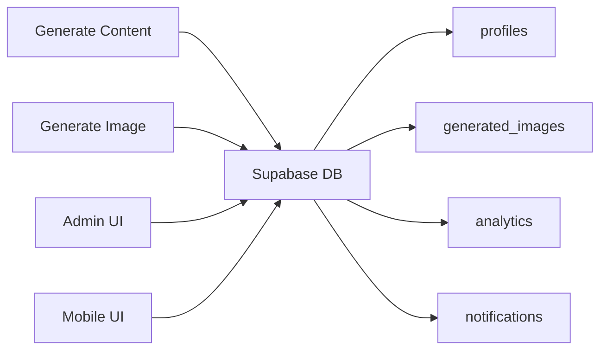

# Credit System & Usage Tracking

<cite>
**Referenced Files in This Document**
- [initial_schema.sql](file://supabase/migrations/20240001000000_initial_schema.sql)
- [generate-content/index.ts](file://supabase/functions/generate-content/index.ts)
- [generate-image/index.ts](file://supabase/functions/generate-image/index.ts)
- [users/page.tsx](file://apps/admin/src/app/(dashboard)/users/page.tsx)
- [analytics/page.tsx](file://apps/admin/src/app/(dashboard)/analytics/page.tsx)
- [notification-settings.tsx](file://apps/mobile/src/app/notification-settings.tsx)
- [api.ts](file://packages/types/src/api.ts)
</cite>

## Table of Contents
1. [Introduction](#introduction)
2. [Project Structure](#project-structure)
3. [Core Components](#core-components)
4. [Architecture Overview](#architecture-overview)
5. [Detailed Component Analysis](#detailed-component-analysis)
6. [Dependency Analysis](#dependency-analysis)
7. [Performance Considerations](#performance-considerations)
8. [Troubleshooting Guide](#troubleshooting-guide)
9. [Conclusion](#conclusion)
10. [Appendices](#appendices)

## Introduction
This document explains the credit-based usage tracking system for text and image generation. It covers how credits are deducted, cost calculation models, database schema for balances and analytics, real-time balance updates and notifications, admin workflows for top-ups and monitoring, and guidance for configuring policies, alerts, and billing integrations.

## Project Structure
The credit system spans serverless functions (Supabase Edge Functions), a relational database schema, and UI components across admin and mobile apps:
- Serverless functions handle AI generation and credit deductions via database RPCs.
- The database stores user profiles with credit fields, generated content logs, analytics counters, and notifications.
- Admin UI provides user management including credit adjustments and analytics dashboards.
- Mobile UI includes notification preferences for low-balance alerts.

```mermaid
graph TB
subgraph "Client Apps"
A["Admin Dashboard"]
B["Mobile App"]
end
subgraph "Edge Functions"
C["Generate Content"]
D["Generate Image"]
end
subgraph "Database"
E["profiles (credits_remaining, credits_limit)"]
F["generated_images"]
G["analytics (credits_used)"]
H["notifications"]
end
A --> |Adjust credits| E
B --> |Request generation| C
B --> |Request generation| D
C --> |RPC decrement_user_credits| E
D --> |RPC decrement_user_credits| E
C --> |Log metrics| G
D --> |Insert record| F
H <- --> B
```

**Diagram sources**
- [generate-content/index.ts:1-99](file://supabase/functions/generate-content/index.ts#L1-L99)
- [generate-image/index.ts:1-87](file://supabase/functions/generate-image/index.ts#L1-L87)
- [initial_schema.sql:44-153](file://supabase/migrations/20240001000000_initial_schema.sql#L44-L153)
- [users/page.tsx:63-76](file://apps/admin/src/app/(dashboard)/users/page.tsx#L63-L76)
- [notification-settings.tsx:17-31](file://apps/mobile/src/app/notification-settings.tsx#L17-L31)

**Section sources**
- [initial_schema.sql:44-153](file://supabase/migrations/20240001000000_initial_schema.sql#L44-L153)
- [generate-content/index.ts:1-99](file://supabase/functions/generate-content/index.ts#L1-L99)
- [generate-image/index.ts:1-87](file://supabase/functions/generate-image/index.ts#L1-L87)
- [users/page.tsx:63-76](file://apps/admin/src/app/(dashboard)/users/page.tsx#L63-L76)
- [notification-settings.tsx:17-31](file://apps/mobile/src/app/notification-settings.tsx#L17-L31)

## Core Components
- Text generation flow:
  - Authenticates user, calls AI provider, records result, decrements credits by 1 per request.
- Image generation flow:
  - Authenticates user, calls image provider, persists generated image metadata, decrements credits by 2 per request.
- Admin credit top-up:
  - Updates user’s credits_remaining directly from the admin dashboard.
- Analytics:
  - Tracks total AI generations and credits used per day per user.
- Notifications:
  - Stores notifications; mobile app supports toggling credit balance alerts.

Key data model elements:
- User profile fields: credits_remaining, credits_limit, subscription_tier, is_suspended.
- Generated images table to log image outputs.
- Analytics table aggregating credits_used and generation counts.
- Notifications table for user-facing messages.

**Section sources**
- [generate-content/index.ts:29-91](file://supabase/functions/generate-content/index.ts#L29-L91)
- [generate-image/index.ts:29-79](file://supabase/functions/generate-image/index.ts#L29-L79)
- [initial_schema.sql:44-153](file://supabase/migrations/20240001000000_initial_schema.sql#L44-L153)
- [users/page.tsx:63-76](file://apps/admin/src/app/(dashboard)/users/page.tsx#L63-L76)
- [analytics/page.tsx:1-82](file://apps/admin/src/app/(dashboard)/analytics/page.tsx#L1-L82)
- [notification-settings.tsx:17-31](file://apps/mobile/src/app/notification-settings.tsx#L17-L31)

## Architecture Overview
The credit system uses serverless functions as the authoritative point for deducting credits to ensure consistency and security. Each generation operation invokes a database RPC to decrement the user’s credits atomically. Results and usage are recorded in dedicated tables for auditing and reporting.



**Diagram sources**
- [generate-content/index.ts:21-91](file://supabase/functions/generate-content/index.ts#L21-L91)
- [generate-image/index.ts:21-79](file://supabase/functions/generate-image/index.ts#L21-L79)
- [initial_schema.sql:44-153](file://supabase/migrations/20240001000000_initial_schema.sql#L44-L153)

## Detailed Component Analysis

### Text Generation and Credit Deduction
- Authentication and configuration retrieval occur before calling the AI provider.
- After successful generation, the function decrements credits by 1 using an RPC call.
- The response includes tokens_used for client-side display and analytics.



**Diagram sources**
- [generate-content/index.ts:21-91](file://supabase/functions/generate-content/index.ts#L21-L91)

**Section sources**
- [generate-content/index.ts:21-91](file://supabase/functions/generate-content/index.ts#L21-L91)

### Image Generation and Credit Deduction
- Authenticates user, optionally calls image provider, persists generated image metadata, then decrements credits by 2.
- Ensures auditability by storing prompts and output URLs.



**Diagram sources**
- [generate-image/index.ts:21-79](file://supabase/functions/generate-image/index.ts#L21-L79)

**Section sources**
- [generate-image/index.ts:21-79](file://supabase/functions/generate-image/index.ts#L21-L79)

### Database Schema for Credit Tracking
- Profiles store current credits and limits, plus subscription tier and suspension status.
- Generated images table logs each image generation event.
- Analytics table aggregates daily credits_used and generation counts per user.
- Notifications table stores user notifications; realtime publication enabled for live updates.



**Diagram sources**
- [initial_schema.sql:44-153](file://supabase/migrations/20240001000000_initial_schema.sql#L44-L153)

**Section sources**
- [initial_schema.sql:44-153](file://supabase/migrations/20240001000000_initial_schema.sql#L44-L153)

### Real-Time Balance Updates and Notifications
- Realtime publications include posts, notifications, templates, and app_config. While profiles are not listed in realtime publications here, clients can poll or subscribe to related tables to reflect balance changes after operations.
- Mobile app includes a toggle for “Credit Balance Alerts,” persisting user preference locally.



**Diagram sources**
- [initial_schema.sql:227-231](file://supabase/migrations/20240001000000_initial_schema.sql#L227-L231)
- [notification-settings.tsx:17-31](file://apps/mobile/src/app/notification-settings.tsx#L17-L31)

**Section sources**
- [initial_schema.sql:227-231](file://supabase/migrations/20240001000000_initial_schema.sql#L227-L231)
- [notification-settings.tsx:17-31](file://apps/mobile/src/app/notification-settings.tsx#L17-L31)

### Admin Interface for Monitoring and Quota Management
- Users page displays credits_remaining vs credits_limit and allows admins to add credits to users.
- Analytics page shows high-level metrics such as AI tokens consumed and platform breakdown.



**Diagram sources**
- [users/page.tsx:63-76](file://apps/admin/src/app/(dashboard)/users/page.tsx#L63-L76)
- [users/page.tsx:108-180](file://apps/admin/src/app/(dashboard)/users/page.tsx#L108-L180)
- [analytics/page.tsx:1-82](file://apps/admin/src/app/(dashboard)/analytics/page.tsx#L1-L82)

**Section sources**
- [users/page.tsx:63-76](file://apps/admin/src/app/(dashboard)/users/page.tsx#L63-L76)
- [users/page.tsx:108-180](file://apps/admin/src/app/(dashboard)/users/page.tsx#L108-L180)
- [analytics/page.tsx:1-82](file://apps/admin/src/app/(dashboard)/analytics/page.tsx#L1-L82)

### Cost Calculation Algorithms and Pricing Models
- Text generation: fixed deduction of 1 credit per request.
- Image generation: fixed deduction of 2 credits per request.
- These costs are applied at the edge function level via RPC calls to ensure consistent accounting.



**Diagram sources**
- [generate-content/index.ts:82-91](file://supabase/functions/generate-content/index.ts#L82-L91)
- [generate-image/index.ts:73-79](file://supabase/functions/generate-image/index.ts#L73-L79)

**Section sources**
- [generate-content/index.ts:82-91](file://supabase/functions/generate-content/index.ts#L82-L91)
- [generate-image/index.ts:73-79](file://supabase/functions/generate-image/index.ts#L73-L79)

### Examples of Credit Management Workflows
- Top-up process:
  - Admin navigates to Users, selects a user, clicks “+50 Credits,” which updates credits_remaining.
- Usage reporting:
  - Admin views analytics to see total AI tokens consumed and platform distribution.
- Limit enforcement:
  - Ensure requests check credits_remaining before invoking generation; enforce based on subscription_tier if needed.



**Diagram sources**
- [users/page.tsx:63-76](file://apps/admin/src/app/(dashboard)/users/page.tsx#L63-L76)

**Section sources**
- [users/page.tsx:63-76](file://apps/admin/src/app/(dashboard)/users/page.tsx#L63-L76)

### API Contracts for Generation
- Text generation request/response types include tokens_used for client-side feedback.
- Image generation returns image_url and optional revised_prompt.

**Section sources**
- [api.ts:3-33](file://packages/types/src/api.ts#L3-L33)

## Dependency Analysis
- Edge functions depend on Supabase client for authentication and database access.
- Both functions rely on environment variables for provider credentials.
- Database schema defines relationships and constraints ensuring referential integrity.
- Admin UI depends on Supabase client to update user profiles and read analytics.
- Mobile UI reads local preferences for notification settings.



**Diagram sources**
- [generate-content/index.ts:1-99](file://supabase/functions/generate-content/index.ts#L1-L99)
- [generate-image/index.ts:1-87](file://supabase/functions/generate-image/index.ts#L1-L87)
- [initial_schema.sql:44-153](file://supabase/migrations/20240001000000_initial_schema.sql#L44-L153)

**Section sources**
- [generate-content/index.ts:1-99](file://supabase/functions/generate-content/index.ts#L1-L99)
- [generate-image/index.ts:1-87](file://supabase/functions/generate-image/index.ts#L1-L87)
- [initial_schema.sql:44-153](file://supabase/migrations/20240001000000_initial_schema.sql#L44-L153)

## Performance Considerations
- Use atomic RPC calls for credit deductions to avoid race conditions and ensure consistency.
- Batch analytics updates where possible to reduce write load.
- Cache AI configuration to minimize repeated reads during high traffic.
- Monitor provider latency and implement retries/backoff for external API calls.

[No sources needed since this section provides general guidance]

## Troubleshooting Guide
- Unauthorized errors:
  - Ensure Authorization header is set when calling edge functions.
- Missing provider credentials:
  - Verify environment variables for AI providers are configured.
- Insufficient credits:
  - Check credits_remaining before initiating generation; consider implementing pre-checks in client logic.
- Notification issues:
  - Confirm realtime subscriptions and that notifications are being inserted for relevant events.

**Section sources**
- [generate-content/index.ts:21-27](file://supabase/functions/generate-content/index.ts#L21-L27)
- [generate-image/index.ts:21-27](file://supabase/functions/generate-image/index.ts#L21-L27)
- [initial_schema.sql:227-231](file://supabase/migrations/20240001000000_initial_schema.sql#L227-L231)

## Conclusion
The credit system integrates edge functions, database schema, and UI components to provide a robust mechanism for tracking and enforcing usage. Fixed credit costs per operation simplify accounting while enabling scalable growth. Admin tools support operational control, and mobile preferences allow user-centric alerting. Extending the system with additional policies, thresholds, and billing integrations can be achieved by building on the existing schema and RPC patterns.

[No sources needed since this section summarizes without analyzing specific files]

## Appendices

### Configuration Guidance
- Credit policies:
  - Define per-tier limits in profiles.credits_limit and enforce checks prior to generation.
- Low balance alerts:
  - Implement client-side checks against credits_remaining and trigger notifications via the notifications table when below thresholds.
- Billing integration:
  - Extend analytics to include monetary values derived from credits_used and integrate with payment systems through server-side webhooks.

[No sources needed since this section provides general guidance]