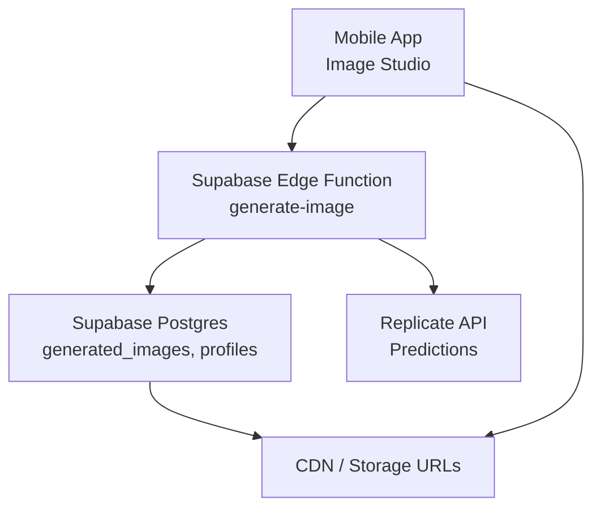
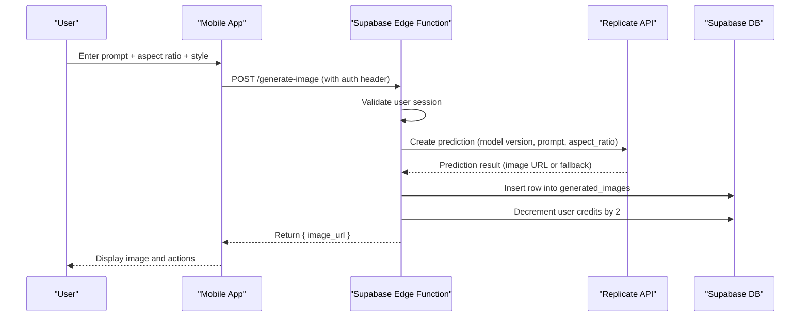
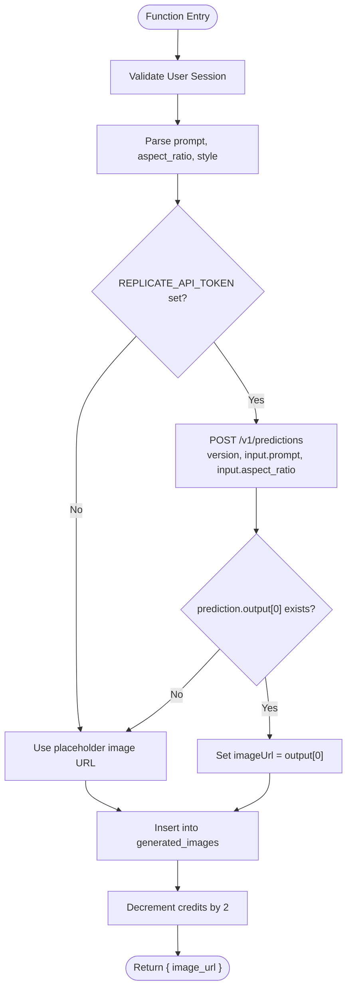
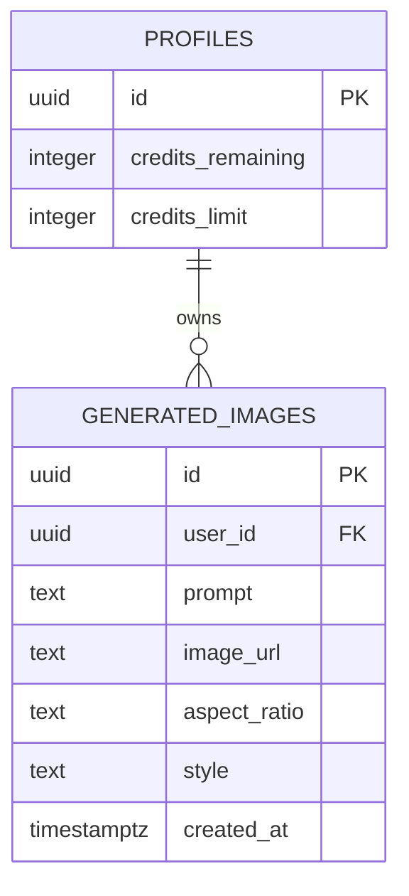
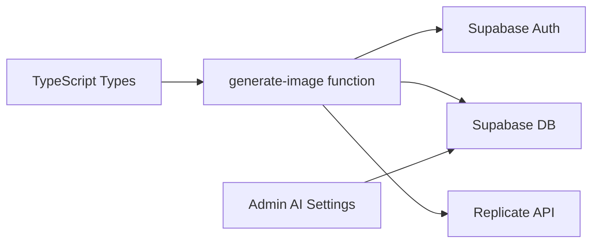

# Image Generation

<cite>
**Referenced Files in This Document**
- [generate-image/index.ts](file://supabase/functions/generate-image/index.ts)
- [generate-content/index.ts](file://supabase/functions/generate-content/index.ts)
- [20240001000000_initial_schema.sql](file://supabase/migrations/20240001000000_initial_schema.sql)
- [ai-settings/page.tsx](file://apps/admin/src/app/(dashboard)/ai-settings/page.tsx)
- [generate.tsx](file://apps/mobile/src/app/(tabs)/generate.tsx)
- [database.ts](file://packages/types/src/database.ts)
</cite>

## Table of Contents
1. Introduction
2. Project Structure
3. Core Components
4. Architecture Overview
5. Detailed Component Analysis
6. Dependency Analysis
7. Performance Considerations
8. Troubleshooting Guide
9. Conclusion
10. Appendices

## Introduction
This document explains the AI-powered image generation system, focusing on Replicate API integration, authentication, model configuration, parameter tuning, and the end-to-end workflow from prompt to final image delivery. It also covers storage and metadata handling via Supabase tables, credit usage for billing, common use cases, prompt optimization guidance, and troubleshooting steps.

## Project Structure
The image generation feature spans serverless functions, database schema, admin configuration UI, and mobile client flows:
- Serverless function handles authentication, calls Replicate, persists results, and deducts credits.
- Database schema defines tables for generated images and user profiles with credit fields.
- Admin UI allows configuring providers and models.
- Mobile app provides the user interface for prompting and rendering images.

**Diagram sources**
- [generate-image/index.ts:9-86](file://supabase/functions/generate-image/index.ts#L9-L86)
- [20240001000000_initial_schema.sql:111-120](file://supabase/migrations/20240001000000_initial_schema.sql#L111-L120)

**Section sources**
- [generate-image/index.ts:1-86](file://supabase/functions/generate-image/index.ts#L1-L86)
- [20240001000000_initial_schema.sql:111-120](file://supabase/migrations/20240001000000_initial_schema.sql#L111-L120)

## Core Components
- Authentication and authorization: The function validates the user session using Supabase Auth headers and returns 401 if unauthorized.
- Prompt processing: Accepts a visual prompt and optional aspect ratio and style; defaults are applied when not provided.
- Model invocation: When configured, calls Replicate Predictions with a specific model version and input parameters.
- Persistence: Stores the generated image URL along with prompt, aspect ratio, and style into the generated_images table.
- Credit accounting: Deducts two credits per image generation via a database RPC call.

**Section sources**
- [generate-image/index.ts:14-36](file://supabase/functions/generate-image/index.ts#L14-L36)
- [generate-image/index.ts:38-62](file://supabase/functions/generate-image/index.ts#L38-L62)
- [generate-image/index.ts:64-79](file://supabase/functions/generate-image/index.ts#L64-L79)

## Architecture Overview
The image generation flow integrates frontend inputs, serverless orchestration, external model inference, and persistent storage.

**Diagram sources**
- [generate-image/index.ts:9-86](file://supabase/functions/generate-image/index.ts#L9-L86)

## Detailed Component Analysis

### Replicate Integration and Configuration
- Authentication: The function reads an environment token to authenticate with Replicate. If present, it creates a prediction request with a fixed model version and passes the prompt and aspect ratio.
- Model configuration: The admin UI exposes provider selection and model slug fields for text and image generation. While the current function uses a hardcoded model version, the admin settings allow administrators to configure providers and slugs for future extensibility.
- Parameter tuning: Aspect ratio is passed directly to the model. Style is prepended to the prompt to influence output aesthetics.

**Diagram sources**
- [generate-image/index.ts:9-86](file://supabase/functions/generate-image/index.ts#L9-L86)

**Section sources**
- [generate-image/index.ts:38-62](file://supabase/functions/generate-image/index.ts#L38-L62)
- [ai-settings/page.tsx:145-172](file://apps/admin/src/app/(dashboard)/ai-settings/page.tsx#L145-L172)

### Image Generation Workflow
- Input validation: Ensures a non-empty prompt; otherwise returns a 400 error.
- Optional provider path: If no token is configured, a placeholder image URL is used to keep the flow functional during development or when credentials are missing.
- Output persistence: Each successful generation records the prompt, image URL, aspect ratio, and style for auditability and retrieval.
- Credit deduction: Two credits are deducted per image generation.

**Section sources**
- [generate-image/index.ts:29-36](file://supabase/functions/generate-image/index.ts#L29-L36)
- [generate-image/index.ts:64-79](file://supabase/functions/generate-image/index.ts#L64-L79)

### Data Model and Metadata
- Generated images table stores:
  - user_id referencing the authenticated user
  - prompt text
  - image_url
  - aspect_ratio
  - style
  - created_at timestamp
- Row-level security ensures users can only manage their own generated images.

**Diagram sources**
- [20240001000000_initial_schema.sql:111-120](file://supabase/migrations/20240001000000_initial_schema.sql#L111-L120)
- [20240001000000_initial_schema.sql:44-58](file://supabase/migrations/20240001000000_initial_schema.sql#L44-L58)

**Section sources**
- [20240001000000_initial_schema.sql:111-120](file://supabase/migrations/20240001000000_initial_schema.sql#L111-L120)

### Frontend Integration (Mobile)
- The mobile screen offers an image studio mode where users enter prompts and choose aspect ratios and styles.
- The UI indicates that each image render costs two credits and provides actions to save or schedule posts.
- Placeholder behavior is shown in the client code; production should call the edge function to generate real images.

**Section sources**
- [generate.tsx:61-68](file://apps/mobile/src/app/(tabs)/generate.tsx#L61-L68)
- [generate.tsx:388-429](file://apps/mobile/src/app/(tabs)/generate.tsx#L388-L429)

### Admin Configuration
- Administrators can select the image provider and model slug, adjust temperature and max tokens for text generation, and edit the master system prompt.
- These settings are stored in ai_config and can be leveraged by backend services to route requests appropriately.

**Section sources**
- [ai-settings/page.tsx:145-172](file://apps/admin/src/app/(dashboard)/ai-settings/page.tsx#L145-L172)
- [ai-settings/page.tsx:176-215](file://apps/admin/src/app/(dashboard)/ai-settings/page.tsx#L176-L215)

## Dependency Analysis
- The image generation function depends on:
  - Supabase Auth for user verification
  - Supabase Postgres for storing generated images and decrementing credits
  - Replicate API for image synthesis when credentials are available
- The admin UI depends on Supabase to read/write ai_config.
- Types define expected interfaces for requests and responses.

**Diagram sources**
- [generate-image/index.ts:14-86](file://supabase/functions/generate-image/index.ts#L14-L86)
- [ai-settings/page.tsx:23-85](file://apps/admin/src/app/(dashboard)/ai-settings/page.tsx#L23-L85)
- [database.ts:52-62](file://packages/types/src/database.ts#L52-L62)

**Section sources**
- [generate-image/index.ts:14-86](file://supabase/functions/generate-image/index.ts#L14-L86)
- [ai-settings/page.tsx:23-85](file://apps/admin/src/app/(dashboard)/ai-settings/page.tsx#L23-L85)
- [database.ts:52-62](file://packages/types/src/database.ts#L52-L62)

## Performance Considerations
- Network latency: Calls to Replicate can be slow; consider adding progress indicators and timeouts on the client side.
- Caching: For repeated prompts or templates, cache results at the application layer to reduce redundant generations.
- Concurrency: Batch operations should be rate-limited to avoid overwhelming the external model service.
- Storage: Ensure image URLs point to reliable CDNs or object storage with appropriate caching headers.

[No sources needed since this section provides general guidance]

## Troubleshooting Guide
Common issues and resolutions:
- Unauthorized errors: Ensure the client sends a valid Authorization header with the Supabase JWT. The function will return 401 if the user cannot be resolved.
- Missing prompt: A 400 error is returned if the prompt is empty; validate inputs on the client before calling the function.
- No image returned: If REPLICATE_API_TOKEN is not set, the function falls back to a placeholder URL. Configure the token to enable real generation.
- Credit deduction failures: Verify that the database RPC exists and is callable; ensure the user has sufficient credits.
- CORS errors: The function sets broad CORS headers; confirm browser or app network policies allow cross-origin requests.

**Section sources**
- [generate-image/index.ts:21-36](file://supabase/functions/generate-image/index.ts#L21-L36)
- [generate-image/index.ts:38-62](file://supabase/functions/generate-image/index.ts#L38-L62)
- [generate-image/index.ts:73-85](file://supabase/functions/generate-image/index.ts#L73-L85)

## Conclusion
The system provides a secure, auditable pipeline for generating images via Replicate, persisting metadata, and enforcing a credit-based cost model. Administrators can configure providers and models through the admin UI, while the mobile app offers a streamlined user experience. Proper authentication, input validation, and robust error handling ensure reliability across different environments.

[No sources needed since this section summarizes without analyzing specific files]

## Appendices

### API Contract Summary
- Endpoint: Supabase Edge Function generate-image
- Authentication: Bearer token via Authorization header
- Request body:
  - prompt: string (required)
  - aspect_ratio: string (optional; default "1:1")
  - style: string (optional; default "Photorealistic")
- Response:
  - image_url: string
  - error: string (on failure)

**Section sources**
- [generate-image/index.ts:29-79](file://supabase/functions/generate-image/index.ts#L29-L79)

### Credit System Integration
- Cost per image: 2 credits deducted per generation via database RPC.
- Text content generation: 1 credit deducted per generation via database RPC.
- Admin tools: Allow adding credits to user accounts for testing or promotions.

**Section sources**
- [generate-image/index.ts:73-74](file://supabase/functions/generate-image/index.ts#L73-L74)
- [generate-content/index.ts:82-83](file://supabase/functions/generate-content/index.ts#L82-L83)
- [20240001000000_initial_schema.sql:44-58](file://supabase/migrations/20240001000000_initial_schema.sql#L44-L58)

### Common Use Cases
- Social media graphics: Use square or portrait aspect ratios with photorealistic or digital art styles for Instagram feeds and stories.
- Promotional images: Use banner aspect ratios and cinematic lighting keywords in prompts for ads and banners.
- Content thumbnails: Use high-contrast styles and clear subjects optimized for small display sizes.

[No sources needed since this section provides general guidance]

### Prompt Optimization Tips
- Include subject, setting, and mood explicitly.
- Specify aspect ratio to match platform requirements.
- Add quality enhancers like resolution and lighting cues to improve output fidelity.
- Iterate with variations of style keywords to find the best aesthetic.

[No sources needed since this section provides general guidance]