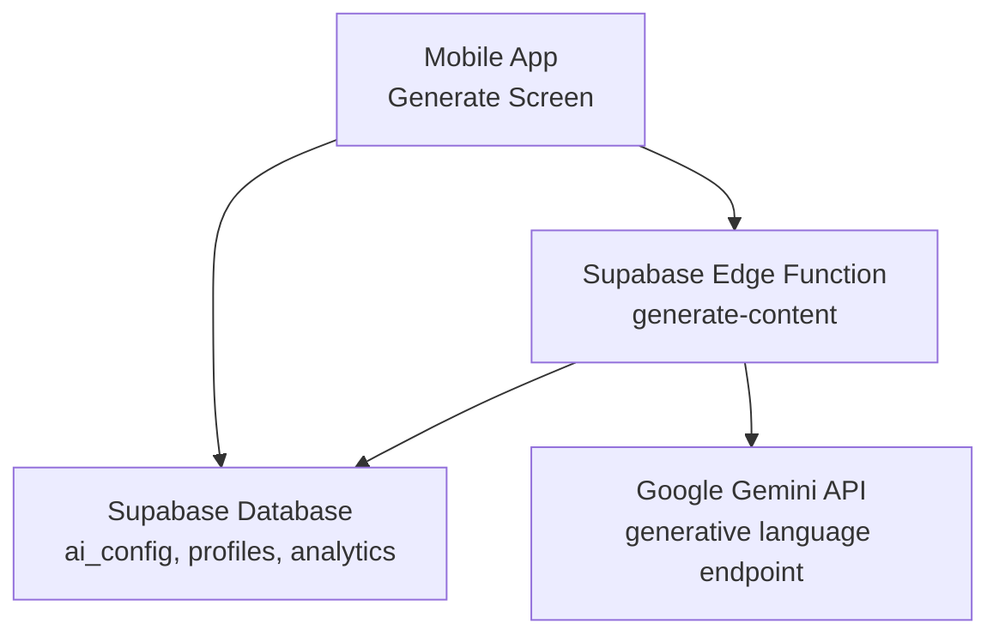
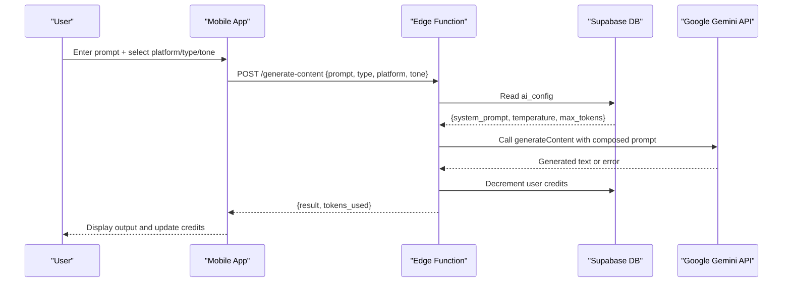
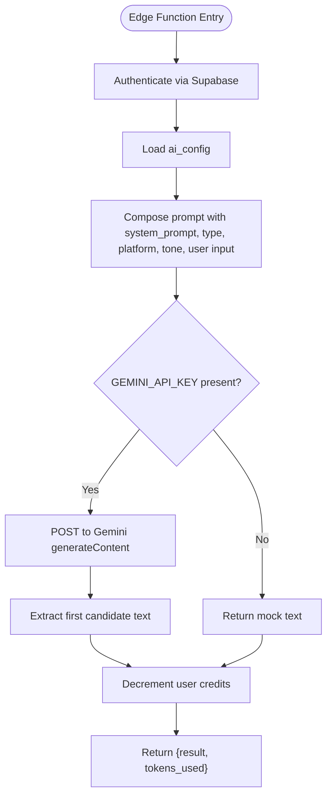
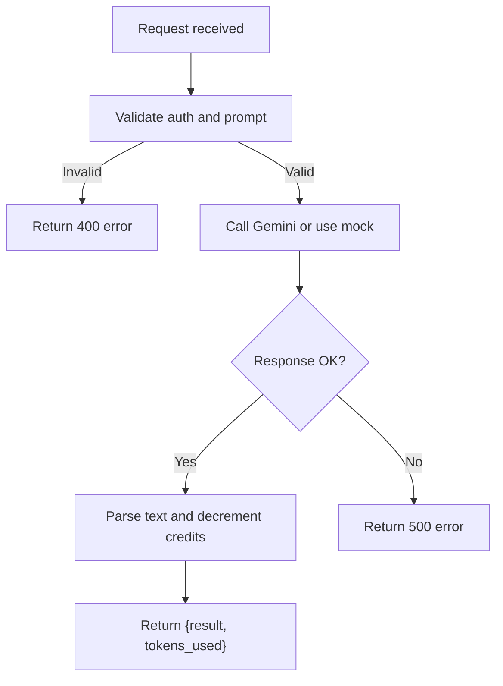
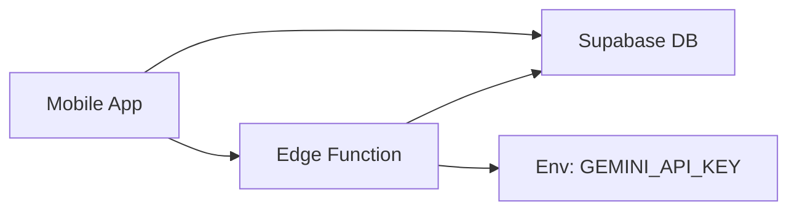

# Text Generation

<cite>
**Referenced Files in This Document**
- [index.ts](file://supabase/functions/generate-content/index.ts)
- [initial_schema.sql](file://supabase/migrations/20240001000000_initial_schema.sql)
- [page.tsx](file://apps/admin/src/app/(dashboard)/ai-settings/page.tsx)
- [generate.tsx](file://apps/mobile/src/app/(tabs)/generate.tsx)
- [api.ts](file://packages/types/src/api.ts)
- [TROUBLESHOOTING.md](file://TROUBLESHOOTING.md)
</cite>

## Table of Contents
1. Introduction
2. Project Structure
3. Core Components
4. Architecture Overview
5. Detailed Component Analysis
6. Dependency Analysis
7. Performance Considerations
8. Troubleshooting Guide
9. Conclusion

## Introduction
This document explains the AI-powered text generation system used by SocialPilot AI Pro. It covers Google Gemini API integration, authentication and configuration, prompt engineering patterns in the generate-content Edge Function, response processing pipeline, credit deduction and usage tracking, and troubleshooting guidance for common issues such as rate limits, model unavailability, and content filtering.

## Project Structure
The text generation feature spans several layers:
- Supabase Edge Function that orchestrates authentication, configuration retrieval, and calls to Google Gemini.
- Database schema defining AI configuration, user profiles with credits, and analytics tables.
- Admin UI for configuring providers, models, temperature, max tokens, and system prompts.
- Mobile app screen for composing prompts, selecting platform/format/tone, and handling outputs and credits.
- Shared types defining request/response contracts for text generation.



**Diagram sources**
- [index.ts:14-99](file://supabase/functions/generate-content/index.ts#L14-L99)
- [initial_schema.sql:31-58](file://supabase/migrations/20240001000000_initial_schema.sql#L31-L58)
- [generate.tsx:123-150](file://apps/mobile/src/app/(tabs)/generate.tsx#L123-L150)

**Section sources**
- [index.ts:1-99](file://supabase/functions/generate-content/index.ts#L1-L99)
- [initial_schema.sql:1-232](file://supabase/migrations/20240001000000_initial_schema.sql#L1-L232)
- [generate.tsx:1-771](file://apps/mobile/src/app/(tabs)/generate.tsx#L1-L771)
- [api.ts:1-33](file://packages/types/src/api.ts#L1-L33)

## Core Components
- Supabase Edge Function (generate-content): Authenticates users via Supabase Auth, loads AI settings from ai_config, composes a prompt with template variables, calls Google Gemini, decrements user credits, and returns results.
- Database Schema: Defines ai_config (provider/model/temperature/max_tokens/system_prompt), profiles (credits_remaining/credits_limit), and analytics (usage counters).
- Admin AI Settings UI: Allows admins to configure provider, model slug, temperature, max tokens, and system prompt.
- Mobile Generate Screen: Provides platform selection, content type, tone selection, templates, and local credit deduction flow.
- Types: Define request/response shapes for text generation.

Key responsibilities:
- Authentication and authorization at the Edge Function boundary.
- Centralized AI configuration stored in the database.
- Prompt composition using system prompt plus dynamic variables (type, platform, tone, prompt).
- Credit accounting and usage tracking.

**Section sources**
- [index.ts:14-99](file://supabase/functions/generate-content/index.ts#L14-L99)
- [initial_schema.sql:31-58](file://supabase/migrations/20240001000000_initial_schema.sql#L31-L58)
- [page.tsx:32-72](file://apps/admin/src/app/(dashboard)/ai-settings/page.tsx#L32-L72)
- [generate.tsx:123-150](file://apps/mobile/src/app/(tabs)/generate.tsx#L123-L150)
- [api.ts:3-16](file://packages/types/src/api.ts#L3-L16)

## Architecture Overview
End-to-end flow:
1. User opens the mobile Generate screen, selects platform, content type, and tone, then enters a prompt.
2. The app either uses a local mock or calls the Supabase Edge Function.
3. The Edge Function authenticates the user, reads ai_config, builds a prompt, and calls Google Gemini.
4. On success, it decrements user credits and returns generated text; on error, it returns an error payload.
5. The mobile app displays the result and updates credits locally if needed.



**Diagram sources**
- [index.ts:14-99](file://supabase/functions/generate-content/index.ts#L14-L99)
- [initial_schema.sql:31-58](file://supabase/migrations/20240001000000_initial_schema.sql#L31-L58)
- [generate.tsx:123-150](file://apps/mobile/src/app/(tabs)/generate.tsx#L123-L150)

## Detailed Component Analysis

### Google Gemini Integration
- Authentication: The Edge Function uses Supabase Auth to identify the caller and enforces RLS policies.
- Model selection: The function hard-calls the Gemini endpoint for gemini-1.5-pro. The admin UI allows configuring provider and model slug, but the current Edge Function implementation uses a fixed model path.
- Parameters: Temperature and maxOutputTokens are read from ai_config and passed to the Gemini call.
- Environment: Requires GEMINI_API_KEY to be set in Supabase secrets. If missing, the function returns a mock result.



**Diagram sources**
- [index.ts:14-99](file://supabase/functions/generate-content/index.ts#L14-L99)

**Section sources**
- [index.ts:14-99](file://supabase/functions/generate-content/index.ts#L14-L99)
- [page.tsx:32-72](file://apps/admin/src/app/(dashboard)/ai-settings/page.tsx#L32-L72)

### Prompt Engineering Patterns
- Template variables: The prompt is constructed using system_prompt from ai_config combined with dynamic variables: content type, target platform, tone, and user prompt.
- Tone settings: The tone parameter flows into the prompt to influence style (e.g., Professional, Casual, Humorous, Inspirational, Urgent).
- Content formatting: The system prompt defines persona and expectations; the final prompt instructs the model to produce high-converting content tailored to the platform and tone.

Examples of workflows supported by the UI and types:
- Social media posts: Select Instagram/Twitter/LinkedIn/TikTok/Facebook, choose Caption & Hook or Post Ideas, pick tone, enter topic.
- Blog content: Use Post Ideas or Thread formats with a professional or inspirational tone.
- Marketing copy: Choose appropriate content type and tone to generate persuasive messaging.

**Section sources**
- [index.ts:29-76](file://supabase/functions/generate-content/index.ts#L29-L76)
- [generate.tsx:52-69](file://apps/mobile/src/app/(tabs)/generate.tsx#L52-L69)
- [api.ts:3-16](file://packages/types/src/api.ts#L3-L16)

### Response Processing Pipeline
- Success path: Extracts the first candidate’s text from the Gemini response and returns it along with token usage metadata.
- Error path: Catches exceptions and returns a JSON error object with status 500.
- Validation: Validates required fields (prompt) and user authentication before proceeding.



**Diagram sources**
- [index.ts:14-99](file://supabase/functions/generate-content/index.ts#L14-L99)

**Section sources**
- [index.ts:14-99](file://supabase/functions/generate-content/index.ts#L14-L99)

### Credit Deduction Mechanism and Usage Tracking
- Edge Function: Calls a database RPC to decrement user credits after successful generation.
- Mobile app: Also decrements credits locally when generating text in demo mode and refreshes profile data.
- Database schema: Stores credits_remaining and credits_limit per user; analytics table tracks total_ai_generations and credits_used.

```mermaid
sequenceDiagram
participant E as "Edge Function"
participant D as "Supabase DB"
E->>D : RPC decrement_user_credits(user_id, amount=1)
D-->>E : Success
Note over E,D : Credits deducted; analytics updated via triggers/RPCs
```

**Diagram sources**
- [index.ts:82-84](file://supabase/functions/generate-content/index.ts#L82-L84)
- [initial_schema.sql:44-58](file://supabase/migrations/20240001000000_initial_schema.sql#L44-L58)
- [initial_schema.sql:122-132](file://supabase/migrations/20240001000000_initial_schema.sql#L122-L132)

**Section sources**
- [index.ts:82-84](file://supabase/functions/generate-content/index.ts#L82-L84)
- [generate.tsx:138-144](file://apps/mobile/src/app/(tabs)/generate.tsx#L138-L144)
- [initial_schema.sql:44-58](file://supabase/migrations/20240001000000_initial_schema.sql#L44-L58)
- [initial_schema.sql:122-132](file://supabase/migrations/20240001000000_initial_schema.sql#L122-L132)

### Admin Configuration
- Providers and models: Admin can select text provider (gemini/openai) and set model slug.
- Parameters: Temperature and max tokens are configurable.
- System prompt: Customizable system instruction for the AI.

**Section sources**
- [page.tsx:32-72](file://apps/admin/src/app/(dashboard)/ai-settings/page.tsx#L32-L72)

## Dependency Analysis
- Edge Function depends on:
  - Supabase client for auth and database access.
  - Environment variable GEMINI_API_KEY for calling Gemini.
  - ai_config table for runtime parameters.
- Mobile app depends on:
  - Supabase client for local credit updates and profile fetch.
  - Local state for UI controls (platform, type, tone).
- Database schema provides:
  - ai_config for global AI settings.
  - profiles for user credits and subscription tier.
  - analytics for usage metrics.



**Diagram sources**
- [index.ts:14-99](file://supabase/functions/generate-content/index.ts#L14-L99)
- [initial_schema.sql:31-58](file://supabase/migrations/20240001000000_initial_schema.sql#L31-L58)
- [generate.tsx:123-150](file://apps/mobile/src/app/(tabs)/generate.tsx#L123-L150)

**Section sources**
- [index.ts:14-99](file://supabase/functions/generate-content/index.ts#L14-L99)
- [initial_schema.sql:31-58](file://supabase/migrations/20240001000000_initial_schema.sql#L31-L58)
- [generate.tsx:123-150](file://apps/mobile/src/app/(tabs)/generate.tsx#L123-L150)

## Performance Considerations
- Token limits: maxOutputTokens from ai_config controls response length; tune based on content needs.
- Temperature: Controls creativity; lower values yield more deterministic outputs.
- Network latency: Gemini API calls introduce latency; consider caching frequent prompts or precomputing templates.
- Rate limiting: Implement retry/backoff strategies at the Edge Function level to handle transient errors.

[No sources needed since this section provides general guidance]

## Troubleshooting Guide
Common issues and resolutions:
- Missing API key: Ensure GEMINI_API_KEY is set in Supabase secrets; otherwise, the function returns a mock result.
- Unauthorized access: Verify Supabase Auth headers are correctly passed to the Edge Function.
- Empty or invalid prompt: The function validates prompt presence; ensure clients send valid payloads.
- Database permissions: Confirm Row Level Security policies are applied as defined in the migration.
- Realtime updates: Enable realtime publications for relevant tables if real-time UI updates are expected.

Operational tips:
- Monitor analytics table for total_ai_generations and credits_used to detect anomalies.
- Use admin tools to adjust credits and suspend users if necessary.

**Section sources**
- [index.ts:14-99](file://supabase/functions/generate-content/index.ts#L14-L99)
- [initial_schema.sql:156-202](file://supabase/migrations/20240001000000_initial_schema.sql#L156-L202)
- [TROUBLESHOOTING.md:1-24](file://TROUBLESHOOTING.md#L1-L24)

## Conclusion
The text generation system integrates Google Gemini through a secure Supabase Edge Function, centralizes AI configuration in the database, and enforces credit-based usage. The mobile app provides an intuitive interface for composing prompts and managing outputs. With proper configuration and monitoring, the system supports scalable social media content generation across platforms and tones.

[No sources needed since this section summarizes without analyzing specific files]