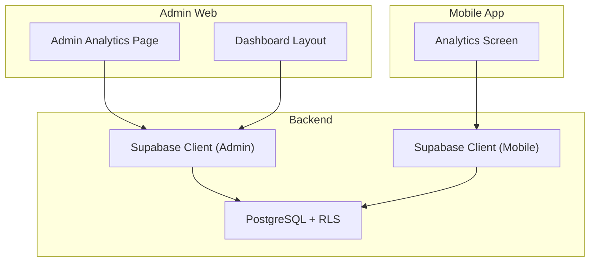
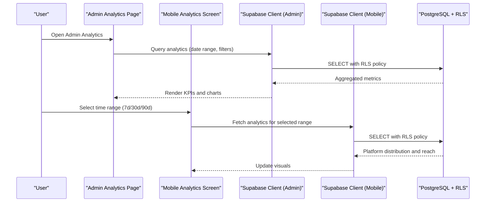
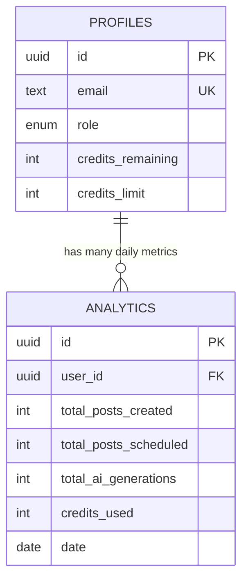
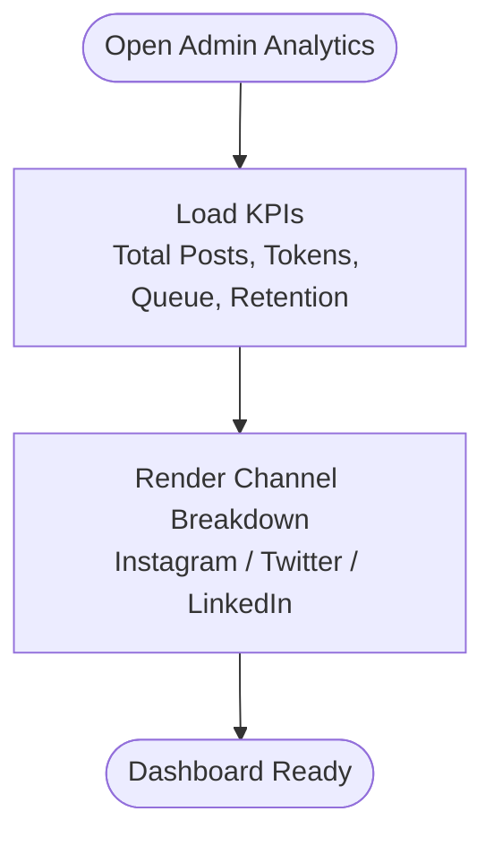
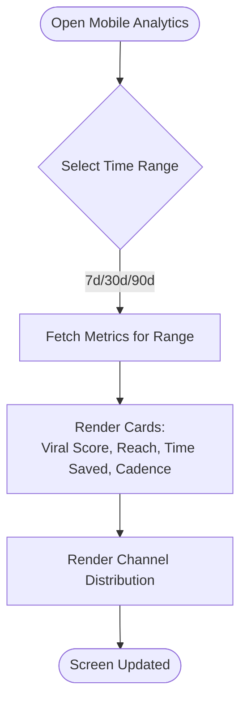
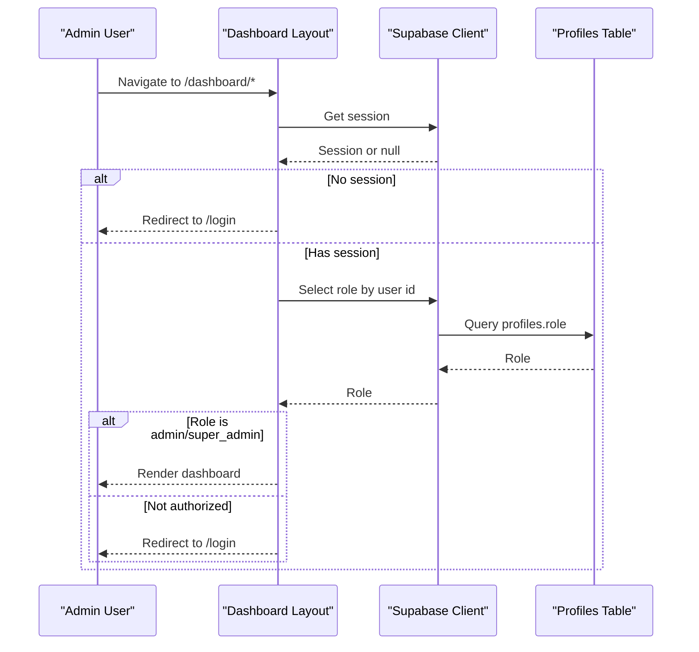
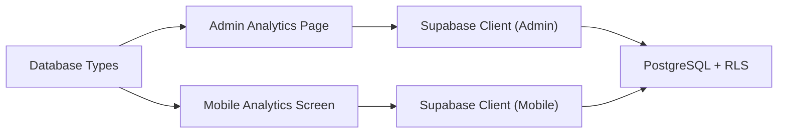

# Analytics & Reporting

<cite>
**Referenced Files in This Document**
- [initial_schema.sql](file://supabase/migrations/20240001000000_initial_schema.sql)
- [database.ts](file://packages/types/src/database.ts)
- [analytics page (admin)](file://apps/admin/src/app/(dashboard)/analytics/page.tsx)
- [analytics screen (mobile)](file://apps/mobile/src/app/(tabs)/analytics.tsx)
- [dashboard layout (admin)](file://apps/admin/src/app/(dashboard)/layout.tsx)
- [supabase client (admin)](file://apps/admin/src/lib/supabase.ts)
- [supabase client (mobile)](file://apps/mobile/src/services/supabase.ts)
</cite>

## Table of Contents
1. Introduction
2. Project Structure
3. Core Components
4. Architecture Overview
5. Detailed Component Analysis
6. Dependency Analysis
7. Performance Considerations
8. Troubleshooting Guide
9. Conclusion
10. Appendices

## Introduction
This document explains the analytics and reporting features for SocialPilot AI Pro, focusing on:
- Performance metrics collection: total posts created, scheduled posts, AI generations, and credits used
- Real-time analytics dashboards for admin and mobile users with charts and visualizations
- Date-based aggregation and unique constraints to prevent duplicate daily entries
- Export capabilities and example queries for custom reports
- Admin-level analytics for platform-wide usage and performance trends

## Project Structure
Analytics spans three layers:
- Data layer: PostgreSQL schema defines the analytics table and security policies
- Client layers: Admin web dashboard and mobile app present analytics UIs
- Integration: Supabase clients connect both apps to the database and enforce access via Row-Level Security

**Diagram sources**
- [analytics page (admin):1-82](file://apps/admin/src/app/(dashboard)/analytics/page.tsx#L1-L82)
- [analytics screen (mobile):1-219](file://apps/mobile/src/app/(tabs)/analytics.tsx#L1-L219)
- [dashboard layout (admin):1-71](file://apps/admin/src/app/(dashboard)/layout.tsx#L1-L71)
- [supabase client (admin):1-13](file://apps/admin/src/lib/supabase.ts#L1-L13)
- [supabase client (mobile):1-40](file://apps/mobile/src/services/supabase.ts#L1-L40)

**Section sources**
- [initial_schema.sql:122-132](file://supabase/migrations/20240001000000_initial_schema.sql#L122-L132)
- [analytics page (admin):1-82](file://apps/admin/src/app/(dashboard)/analytics/page.tsx#L1-L82)
- [analytics screen (mobile):1-219](file://apps/mobile/src/app/(tabs)/analytics.tsx#L1-L219)
- [dashboard layout (admin):1-71](file://apps/admin/src/app/(dashboard)/layout.tsx#L1-L71)
- [supabase client (admin):1-13](file://apps/admin/src/lib/supabase.ts#L1-L13)
- [supabase client (mobile):1-40](file://apps/mobile/src/services/supabase.ts#L1-L40)

## Core Components
- Analytics data model: a date-partitioned table storing per-user daily metrics including total posts created, scheduled posts, AI generations, and credits used
- Admin analytics dashboard: high-level KPIs and channel breakdown visualization
- Mobile analytics screen: time-range filtering and platform distribution visualization
- Access control: Row-Level Security ensures users see only their own analytics; admins can view all

Key fields in the analytics table:
- user_id: links metrics to a specific user
- total_posts_created: count of posts created by the user on that date
- total_posts_scheduled: count of posts scheduled by the user on that date
- total_ai_generations: count of AI generation events by the user on that date
- credits_used: credits consumed by the user on that date
- date: day for which metrics are aggregated
- Unique constraint: one row per user per date prevents duplicates

**Section sources**
- [initial_schema.sql:122-132](file://supabase/migrations/20240001000000_initial_schema.sql#L122-L132)
- [database.ts:64-72](file://packages/types/src/database.ts#L64-L72)

## Architecture Overview
The analytics pipeline integrates UI components with a secure data layer:

**Diagram sources**
- [analytics page (admin):1-82](file://apps/admin/src/app/(dashboard)/analytics/page.tsx#L1-L82)
- [analytics screen (mobile):1-219](file://apps/mobile/src/app/(tabs)/analytics.tsx#L1-L219)
- [supabase client (admin):1-13](file://apps/admin/src/lib/supabase.ts#L1-L13)
- [supabase client (mobile):1-40](file://apps/mobile/src/services/supabase.ts#L1-L40)
- [initial_schema.sql:156-202](file://supabase/migrations/20240001000000_initial_schema.sql#L156-L202)

## Detailed Component Analysis

### Analytics Data Model and Constraints
- The analytics table stores daily aggregates per user
- A unique constraint on (user_id, date) enforces one record per user per day, preventing duplicate entries
- Row-Level Security policies allow users to read/update their own rows and admins to read all rows

**Diagram sources**
- [initial_schema.sql:44-58](file://supabase/migrations/20240001000000_initial_schema.sql#L44-L58)
- [initial_schema.sql:122-132](file://supabase/migrations/20240001000000_initial_schema.sql#L122-L132)

**Section sources**
- [initial_schema.sql:122-132](file://supabase/migrations/20240001000000_initial_schema.sql#L122-L132)
- [initial_schema.sql:156-202](file://supabase/migrations/20240001000000_initial_schema.sql#L156-L202)

### Admin Analytics Dashboard
- Displays high-level KPIs such as total generated posts, AI tokens consumed, scheduled queue size, and active retention
- Shows channel breakdown with progress bars for Instagram, Twitter/X, and LinkedIn
- Uses Next.js client component structure and Tailwind styling

**Diagram sources**
- [analytics page (admin):1-82](file://apps/admin/src/app/(dashboard)/analytics/page.tsx#L1-L82)

**Section sources**
- [analytics page (admin):1-82](file://apps/admin/src/app/(dashboard)/analytics/page.tsx#L1-L82)

### Mobile Analytics Screen
- Provides a time-range selector (7d, 30d, 90d) to filter metrics
- Presents a “Viral Probability Score” card, audience reach, time saved by AI, posting cadence
- Shows platform distribution with share percentages and growth indicators

**Diagram sources**
- [analytics screen (mobile):1-219](file://apps/mobile/src/app/(tabs)/analytics.tsx#L1-L219)

**Section sources**
- [analytics screen (mobile):1-219](file://apps/mobile/src/app/(tabs)/analytics.tsx#L1-L219)

### Admin Access Control and Routing
- The admin dashboard layout checks authentication and role before rendering protected content
- Only users with admin or super_admin roles can access admin pages

**Diagram sources**
- [dashboard layout (admin):1-71](file://apps/admin/src/app/(dashboard)/layout.tsx#L1-L71)
- [supabase client (admin):1-13](file://apps/admin/src/lib/supabase.ts#L1-L13)

**Section sources**
- [dashboard layout (admin):1-71](file://apps/admin/src/app/(dashboard)/layout.tsx#L1-L71)

## Dependency Analysis
- Admin and mobile apps depend on Supabase clients configured via environment variables
- Both apps rely on PostgreSQL with Row-Level Security to enforce data isolation
- Types are shared via a types package to keep client code consistent with the schema

**Diagram sources**
- [analytics page (admin):1-82](file://apps/admin/src/app/(dashboard)/analytics/page.tsx#L1-L82)
- [analytics screen (mobile):1-219](file://apps/mobile/src/app/(tabs)/analytics.tsx#L1-L219)
- [supabase client (admin):1-13](file://apps/admin/src/lib/supabase.ts#L1-L13)
- [supabase client (mobile):1-40](file://apps/mobile/src/services/supabase.ts#L1-L40)
- [database.ts:64-72](file://packages/types/src/database.ts#L64-L72)

**Section sources**
- [supabase client (admin):1-13](file://apps/admin/src/lib/supabase.ts#L1-L13)
- [supabase client (mobile):1-40](file://apps/mobile/src/services/supabase.ts#L1-L40)
- [database.ts:64-72](file://packages/types/src/database.ts#L64-L72)

## Performance Considerations
- Use date-partitioned queries to limit scan scope when fetching analytics for specific ranges
- Aggregate at the database level where possible to reduce payload sizes
- Cache frequently accessed KPIs on the client side for short intervals to minimize repeated requests
- Ensure indexes on user_id and date columns to optimize lookups and aggregations

[No sources needed since this section provides general guidance]

## Troubleshooting Guide
Common issues and resolutions:
- Duplicate daily analytics entries: prevented by the unique constraint on (user_id, date); if an insert fails due to duplication, update the existing row instead
- Unauthorized access: ensure RLS policies are enabled and users have appropriate roles; admin-only views require admin or super_admin role
- Missing data: verify that analytics records are being inserted after key actions (post creation, scheduling, AI generation, credit consumption)

**Section sources**
- [initial_schema.sql:122-132](file://supabase/migrations/20240001000000_initial_schema.sql#L122-L132)
- [initial_schema.sql:156-202](file://supabase/migrations/20240001000000_initial_schema.sql#L156-L202)
- [dashboard layout (admin):1-71](file://apps/admin/src/app/(dashboard)/layout.tsx#L1-L71)

## Conclusion
The analytics and reporting system combines a robust, constrained data model with intuitive dashboards for both admin and mobile users. Date-based aggregation and strict uniqueness rules ensure data integrity, while RLS policies provide secure, role-based access. With clear export pathways and query examples, teams can build custom reports and integrate with external analytics tools effectively.

[No sources needed since this section summarizes without analyzing specific files]

## Appendices

### Example Queries for Custom Reports
- Daily totals per user over a date range:
  - Select user_id, date, total_posts_created, total_posts_scheduled, total_ai_generations, credits_used from analytics where date between start_date and end_date order by date
- Weekly summaries:
  - Group by week and sum metrics to compute weekly totals
- Platform-specific insights:
  - Join posts with analytics to correlate generation volume with scheduled/published counts

[No sources needed since this section provides conceptual examples]

### Export Capabilities
- Database exports:
  - Use PostgreSQL tools to export analytics tables to CSV/JSON for offline analysis
- API-driven exports:
  - Build server endpoints that query analytics with filters and return formatted reports
- Scheduled reports:
  - Automate periodic exports and delivery via email or storage buckets

[No sources needed since this section provides conceptual guidance]

### Integrating with External Analytics Tools
- Connect BI tools (e.g., Metabase, Grafana) to the PostgreSQL instance using read-only credentials
- Stream real-time updates via Supabase Realtime subscriptions for live dashboards
- Map analytics fields to tool-specific schemas for consistent reporting

[No sources needed since this section provides conceptual guidance]