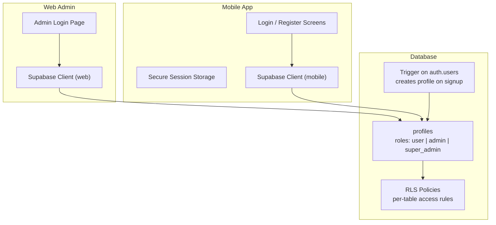
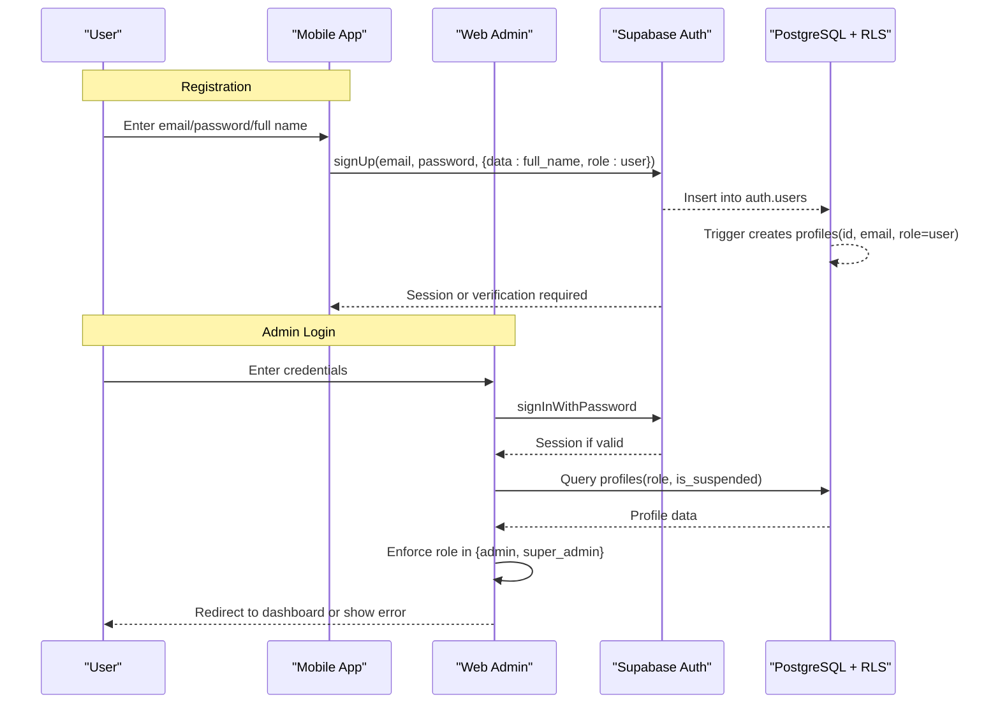
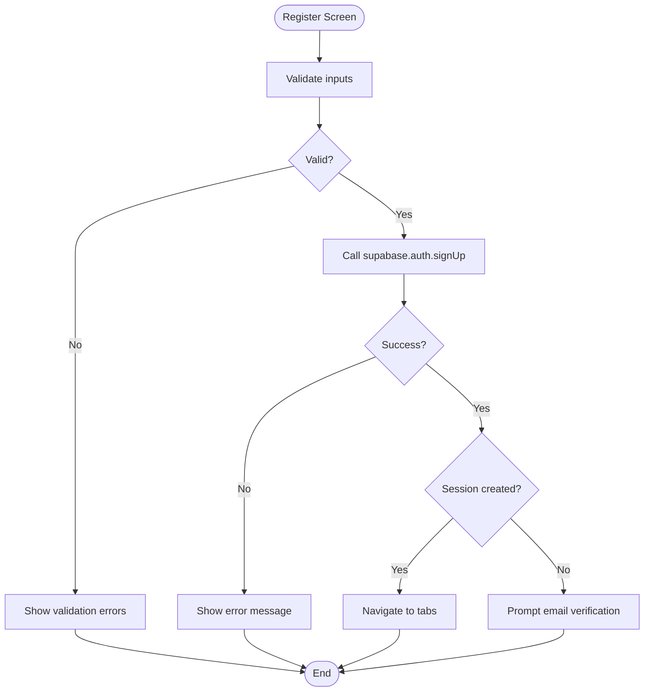
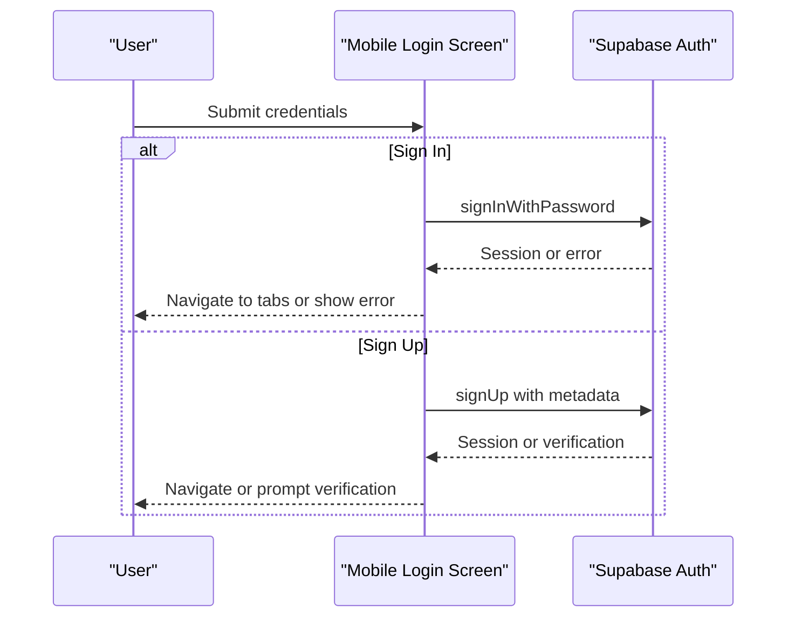
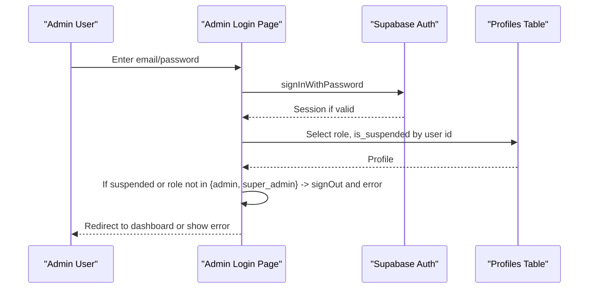
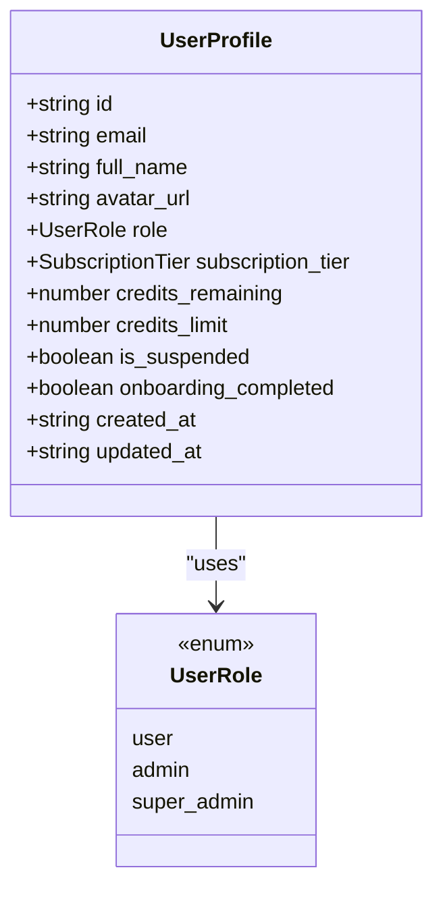
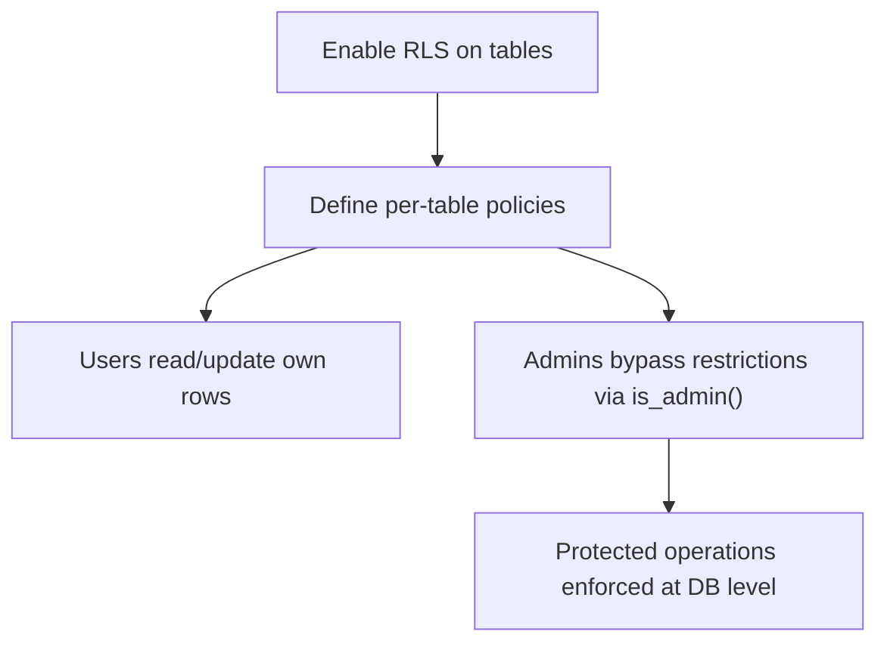
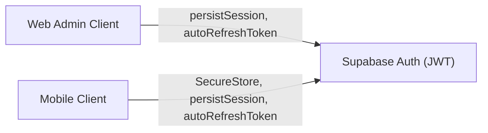
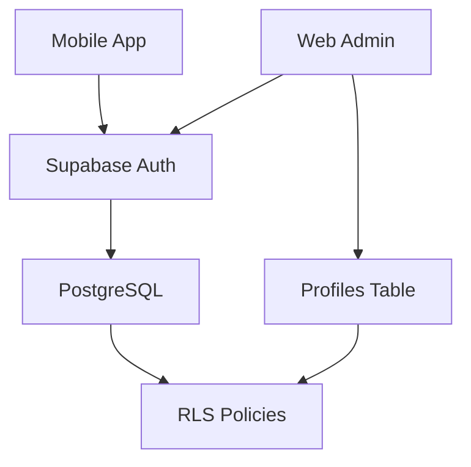

# Authentication & Authorization

<cite>
**Referenced Files in This Document**
- [initial_schema.sql](file://supabase/migrations/20240001000000_initial_schema.sql)
- [auth.ts](file://packages/types/src/auth.ts)
- [login page.tsx](file://apps/admin/src/app/(auth)/login/page.tsx)
- [supabase.ts (admin)](file://apps/admin/src/lib/supabase.ts)
- [login.tsx (mobile)](file://apps/mobile/src/app/(auth)/login.tsx)
- [register.tsx (mobile)](file://apps/mobile/src/app/(auth)/register.tsx)
- [supabase.ts (mobile)](file://apps/mobile/src/services/supabase.ts)
</cite>

## Table of Contents
1. Introduction
2. Project Structure
3. Core Components
4. Architecture Overview
5. Detailed Component Analysis
6. Dependency Analysis
7. Performance Considerations
8. Troubleshooting Guide
9. Conclusion

## Introduction
This document explains the authentication and authorization system for SocialPilot AI Pro across web and mobile clients. It covers user registration and login flows, role-based access control (user, admin, super_admin), Row-Level Security (RLS) policies at the database layer, session management with Supabase Auth, JWT token handling via Supabase’s client, and security middleware patterns used to protect routes and enforce permissions. It also documents integration points with Supabase Auth and custom profile management through a profiles table and triggers.

## Project Structure
The authentication system spans:
- Database schema and RLS policies defined in migrations
- Shared type definitions for roles and user profiles
- Web admin app login flow with role checks
- Mobile app sign-in/sign-up flows with secure session storage
- Supabase client configuration for both platforms

**Diagram sources**
- [initial_schema.sql:44-69](file://supabase/migrations/20240001000000_initial_schema.sql#L44-L69)
- [initial_schema.sql:155-202](file://supabase/migrations/20240001000000_initial_schema.sql#L155-L202)
- [initial_schema.sql:204-225](file://supabase/migrations/20240001000000_initial_schema.sql#L204-L225)
- [login page.tsx:15-78](file://apps/admin/src/app/(auth)/login/page.tsx#L15-L78)
- [login.tsx (mobile):76-142](file://apps/mobile/src/app/(auth)/login.tsx#L76-L142)
- [register.tsx (mobile):29-92](file://apps/mobile/src/app/(auth)/register.tsx#L29-L92)
- [supabase.ts (admin):1-14](file://apps/admin/src/lib/supabase.ts#L1-L14)
- [supabase.ts (mobile):1-41](file://apps/mobile/src/services/supabase.ts#L1-L41)

**Section sources**
- [initial_schema.sql:44-69](file://supabase/migrations/20240001000000_initial_schema.sql#L44-L69)
- [initial_schema.sql:155-202](file://supabase/migrations/20240001000000_initial_schema.sql#L155-L202)
- [initial_schema.sql:204-225](file://supabase/migrations/20240001000000_initial_schema.sql#L204-L225)
- [auth.ts:1-25](file://packages/types/src/auth.ts#L1-L25)
- [login page.tsx:15-78](file://apps/admin/src/app/(auth)/login/page.tsx#L15-L78)
- [login.tsx (mobile):76-142](file://apps/mobile/src/app/(auth)/login.tsx#L76-L142)
- [register.tsx (mobile):29-92](file://apps/mobile/src/app/(auth)/register.tsx#L29-L92)
- [supabase.ts (admin):1-14](file://apps/admin/src/lib/supabase.ts#L1-L14)
- [supabase.ts (mobile):1-41](file://apps/mobile/src/services/supabase.ts#L1-L41)

## Core Components
- Roles and User Profile Types: Centralized types define allowed roles and the shape of a user profile.
- Supabase Auth Integration: Both web and mobile use Supabase Auth with persistent sessions and automatic token refresh.
- Custom Profile Management: On signup, a database trigger creates a corresponding profile row with default role user.
- Role-Based Access Control: Admin login enforces that only admin or super_admin can access the admin dashboard.
- Row-Level Security (RLS): All sensitive tables are protected by RLS policies that restrict data access based on user identity and roles.

Key implementation references:
- Role and profile types: [auth.ts:1-25](file://packages/types/src/auth.ts#L1-L25)
- Admin login role enforcement: [login page.tsx:44-70](file://apps/admin/src/app/(auth)/login/page.tsx#L44-L70)
- Mobile sign-in/sign-up flows: [login.tsx (mobile):107-136](file://apps/mobile/src/app/(auth)/login.tsx#L107-L136), [register.tsx (mobile):51-60](file://apps/mobile/src/app/(auth)/register.tsx#L51-L60)
- Supabase clients: [supabase.ts (admin):1-14](file://apps/admin/src/lib/supabase.ts#L1-L14), [supabase.ts (mobile):1-41](file://apps/mobile/src/services/supabase.ts#L1-L41)
- RLS policies and helper function: [initial_schema.sql:60-69](file://supabase/migrations/20240001000000_initial_schema.sql#L60-L69), [initial_schema.sql:155-202](file://supabase/migrations/20240001000000_initial_schema.sql#L155-L202)

**Section sources**
- [auth.ts:1-25](file://packages/types/src/auth.ts#L1-L25)
- [login page.tsx:44-70](file://apps/admin/src/app/(auth)/login/page.tsx#L44-L70)
- [login.tsx (mobile):107-136](file://apps/mobile/src/app/(auth)/login.tsx#L107-L136)
- [register.tsx (mobile):51-60](file://apps/mobile/src/app/(auth)/register.tsx#L51-L60)
- [supabase.ts (admin):1-14](file://apps/admin/src/lib/supabase.ts#L1-L14)
- [supabase.ts (mobile):1-41](file://apps/mobile/src/services/supabase.ts#L1-L41)
- [initial_schema.sql:60-69](file://supabase/migrations/20240001000000_initial_schema.sql#L60-L69)
- [initial_schema.sql:155-202](file://supabase/migrations/20240001000000_initial_schema.sql#L155-L202)

## Architecture Overview
The system uses Supabase Auth for identity and session management, with application-level role checks for admin features and database-level RLS for data isolation.

**Diagram sources**
- [login.tsx (mobile):107-136](file://apps/mobile/src/app/(auth)/login.tsx#L107-L136)
- [register.tsx (mobile):51-60](file://apps/mobile/src/app/(auth)/register.tsx#L51-L60)
- [login page.tsx:33-70](file://apps/admin/src/app/(auth)/login/page.tsx#L33-L70)
- [initial_schema.sql:204-225](file://supabase/migrations/20240001000000_initial_schema.sql#L204-L225)

## Detailed Component Analysis

### User Registration Flow (Mobile)
- Validates input using a schema.
- Calls Supabase Auth signUp with metadata including full_name and role set to user.
- Handles success, verification-required, and error states.
- On successful session creation, navigates to the main tabs.

**Diagram sources**
- [register.tsx (mobile):29-92](file://apps/mobile/src/app/(auth)/register.tsx#L29-L92)

**Section sources**
- [register.tsx (mobile):29-92](file://apps/mobile/src/app/(auth)/register.tsx#L29-L92)

### User Login Flow (Mobile)
- Supports Sign In and Create Account in one screen.
- For Sign In: calls signInWithPassword and navigates on success.
- For Sign Up: same registration flow as above.

**Diagram sources**
- [login.tsx (mobile):76-142](file://apps/mobile/src/app/(auth)/login.tsx#L76-L142)

**Section sources**
- [login.tsx (mobile):76-142](file://apps/mobile/src/app/(auth)/login.tsx#L76-L142)

### Admin Login Flow (Web)
- Attempts Supabase Auth login.
- Fetches profile to check suspension status and role.
- Denies access if not admin or super_admin; signs out and shows error.

**Diagram sources**
- [login page.tsx:33-70](file://apps/admin/src/app/(auth)/login/page.tsx#L33-L70)

**Section sources**
- [login page.tsx:33-70](file://apps/admin/src/app/(auth)/login/page.tsx#L33-L70)

### Role-Based Access Control (RBAC)
- Roles: user, admin, super_admin.
- Admin routes require explicit role checks after successful authentication.
- Profiles store role and suspension flags; admin UI reads these to gate access.

**Diagram sources**
- [auth.ts:1-25](file://packages/types/src/auth.ts#L1-L25)

**Section sources**
- [auth.ts:1-25](file://packages/types/src/auth.ts#L1-L25)
- [login page.tsx:44-70](file://apps/admin/src/app/(auth)/login/page.tsx#L44-L70)

### Row-Level Security (RLS) Policies
- All core tables have RLS enabled.
- Helper function is_admin() allows admin/super_admin bypass where appropriate.
- Policies enforce per-user ownership for posts, folders, generated images, notifications, analytics; admins get broader access.

**Diagram sources**
- [initial_schema.sql:155-202](file://supabase/migrations/20240001000000_initial_schema.sql#L155-L202)
- [initial_schema.sql:60-69](file://supabase/migrations/20240001000000_initial_schema.sql#L60-L69)

**Section sources**
- [initial_schema.sql:155-202](file://supabase/migrations/20240001000000_initial_schema.sql#L155-L202)
- [initial_schema.sql:60-69](file://supabase/migrations/20240001000000_initial_schema.sql#L60-L69)

### Session Management and JWT Handling
- Web client: Supabase client configured with persistSession and autoRefreshToken.
- Mobile client: Supabase client configured with secure storage adapter, persistSession, autoRefreshToken, and disabled URL session detection.
- Sessions are managed by Supabase; tokens are handled transparently by the SDK.

**Diagram sources**
- [supabase.ts (admin):1-14](file://apps/admin/src/lib/supabase.ts#L1-L14)
- [supabase.ts (mobile):1-41](file://apps/mobile/src/services/supabase.ts#L1-L41)

**Section sources**
- [supabase.ts (admin):1-14](file://apps/admin/src/lib/supabase.ts#L1-L14)
- [supabase.ts (mobile):1-41](file://apps/mobile/src/services/supabase.ts#L1-L41)

### Protected Routes and Permission Checks
- Admin login route enforces role checks before granting access to the admin dashboard.
- Clients should guard protected routes by checking authentication state and role prior to rendering sensitive content.
- Example pattern: after successful sign-in, fetch profile and verify role; redirect to unauthorized or home if insufficient.

References:
- Admin role enforcement: [login page.tsx:44-70](file://apps/admin/src/app/(auth)/login/page.tsx#L44-L70)

**Section sources**
- [login page.tsx:44-70](file://apps/admin/src/app/(auth)/login/page.tsx#L44-L70)

### Integration with Supabase Auth and Custom Profiles
- On user creation, a database trigger automatically inserts a matching profile with default role user.
- Metadata from signUp (full_name, role) is persisted into profiles via the trigger.
- Admins can manage users and adjust roles through the admin interface; RLS ensures data isolation.

References:
- Trigger and profile creation: [initial_schema.sql:204-225](file://supabase/migrations/20240001000000_initial_schema.sql#L204-L225)
- SignUp metadata usage: [register.tsx (mobile):51-60](file://apps/mobile/src/app/(auth)/register.tsx#L51-L60)

**Section sources**
- [initial_schema.sql:204-225](file://supabase/migrations/20240001000000_initial_schema.sql#L204-L225)
- [register.tsx (mobile):51-60](file://apps/mobile/src/app/(auth)/register.tsx#L51-L60)

## Dependency Analysis
- Mobile and Web clients depend on Supabase Auth for identity and session lifecycle.
- Admin client depends on profiles table for role checks during login.
- Database policies depend on the is_admin() helper and user identity to enforce access.

**Diagram sources**
- [supabase.ts (mobile):1-41](file://apps/mobile/src/services/supabase.ts#L1-L41)
- [supabase.ts (admin):1-14](file://apps/admin/src/lib/supabase.ts#L1-L14)
- [initial_schema.sql:155-202](file://supabase/migrations/20240001000000_initial_schema.sql#L155-L202)

**Section sources**
- [supabase.ts (mobile):1-41](file://apps/mobile/src/services/supabase.ts#L1-L41)
- [supabase.ts (admin):1-14](file://apps/admin/src/lib/supabase.ts#L1-L14)
- [initial_schema.sql:155-202](file://supabase/migrations/20240001000000_initial_schema.sql#L155-L202)

## Performance Considerations
- Use Supabase’s built-in session persistence and token refresh to minimize network overhead and keep sessions alive.
- Keep client-side role checks minimal; rely on RLS for data access enforcement to avoid redundant checks.
- Avoid excessive profile queries; cache profile data locally when safe and appropriate.
- Prefer server-side edge functions for privileged operations requiring service-role access.

[No sources needed since this section provides general guidance]

## Troubleshooting Guide
Common issues and resolutions:
- Empty results or permission denied on queries: Ensure RLS policies are applied by running the migration that enables RLS and defines policies.
- Admin login says “Access Denied”: Confirm the user’s role in profiles is set to admin or super_admin.
- Realtime updates not reflecting: Ensure realtime publications include relevant tables.

References:
- RLS enablement and policies: [initial_schema.sql:155-202](file://supabase/migrations/20240001000000_initial_schema.sql#L155-L202)
- Admin role requirement: [login page.tsx:65-70](file://apps/admin/src/app/(auth)/login/page.tsx#L65-L70)

**Section sources**
- [initial_schema.sql:155-202](file://supabase/migrations/20240001000000_initial_schema.sql#L155-L202)
- [login page.tsx:65-70](file://apps/admin/src/app/(auth)/login/page.tsx#L65-L70)

## Conclusion
SocialPilot AI Pro implements a robust authentication and authorization model combining Supabase Auth, role-based checks in the admin flow, and comprehensive RLS policies for secure data access. Registration and login flows are consistent across web and mobile, with secure session management and automatic token refresh. The combination of client-side guards and database-level policies ensures strong security boundaries for users and administrators alike.

[No sources needed since this section summarizes without analyzing specific files]