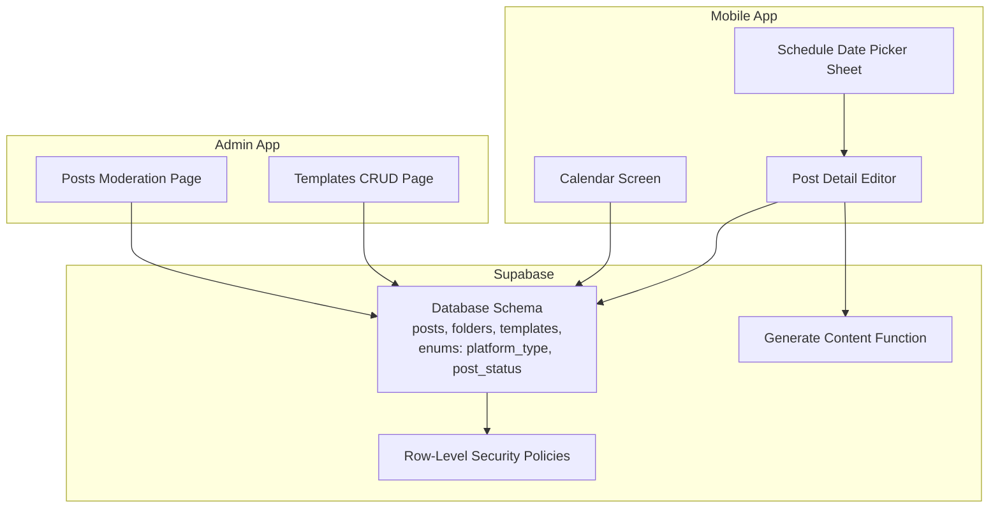
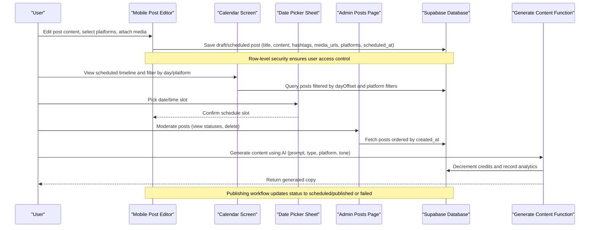
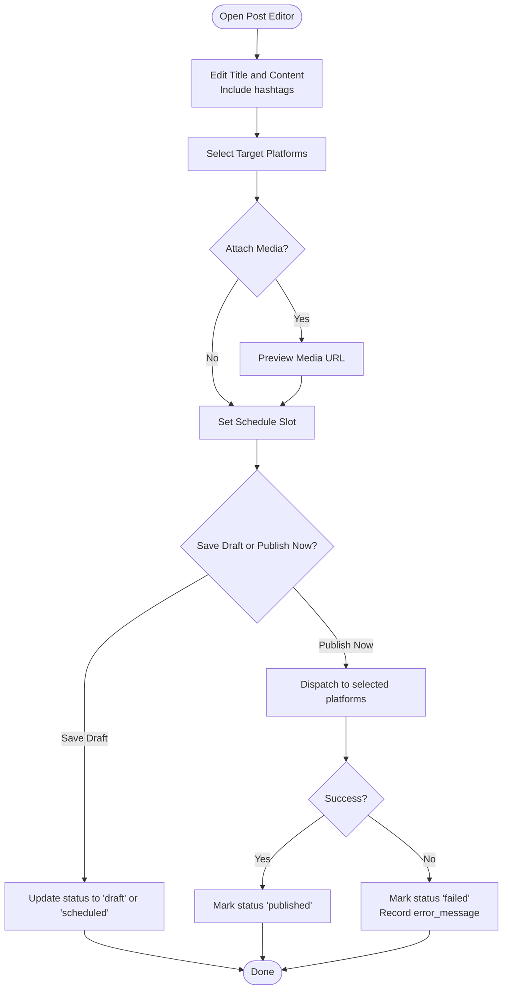
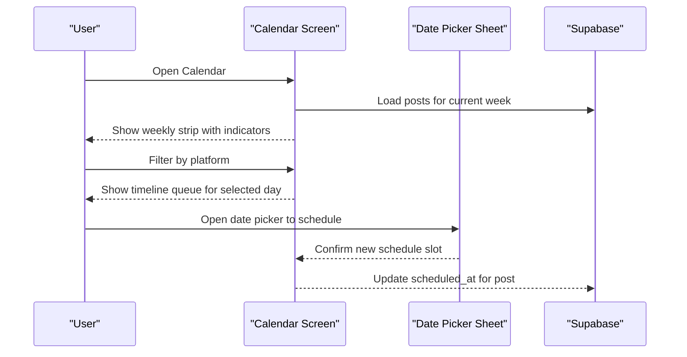
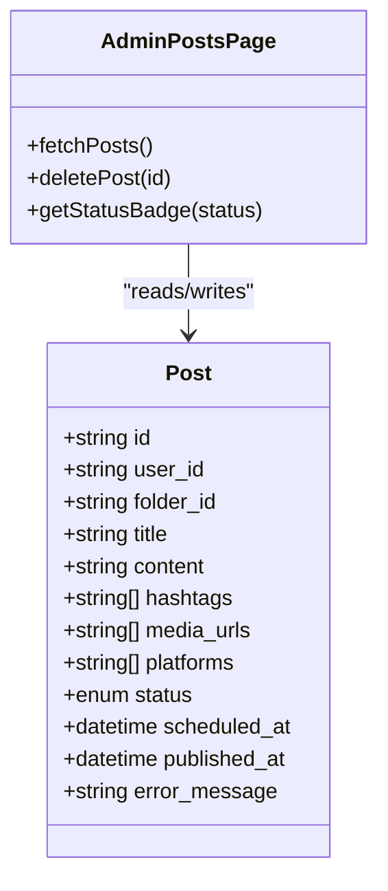
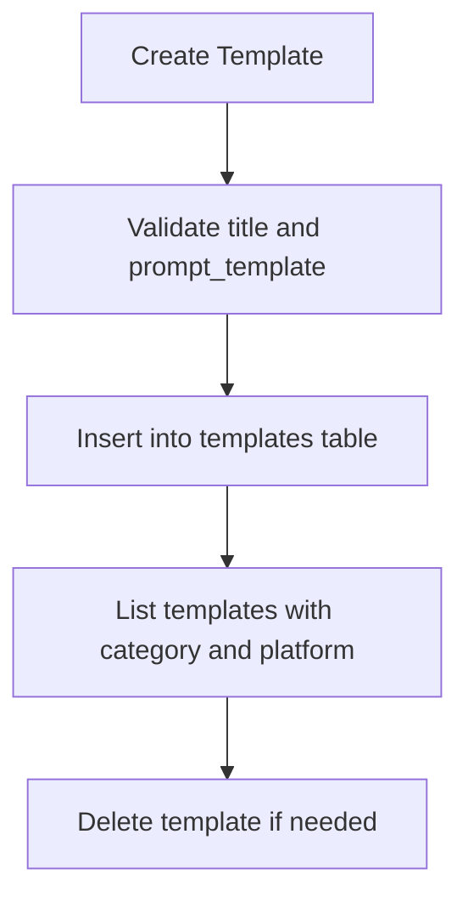
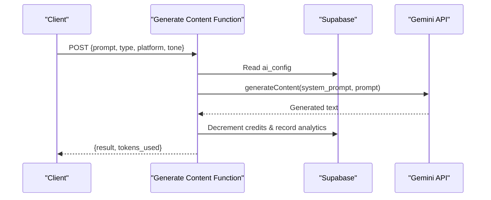
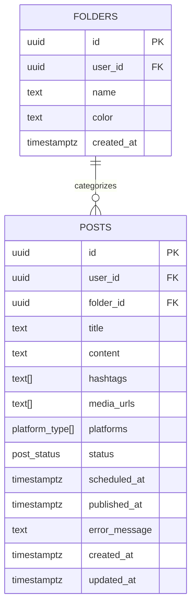
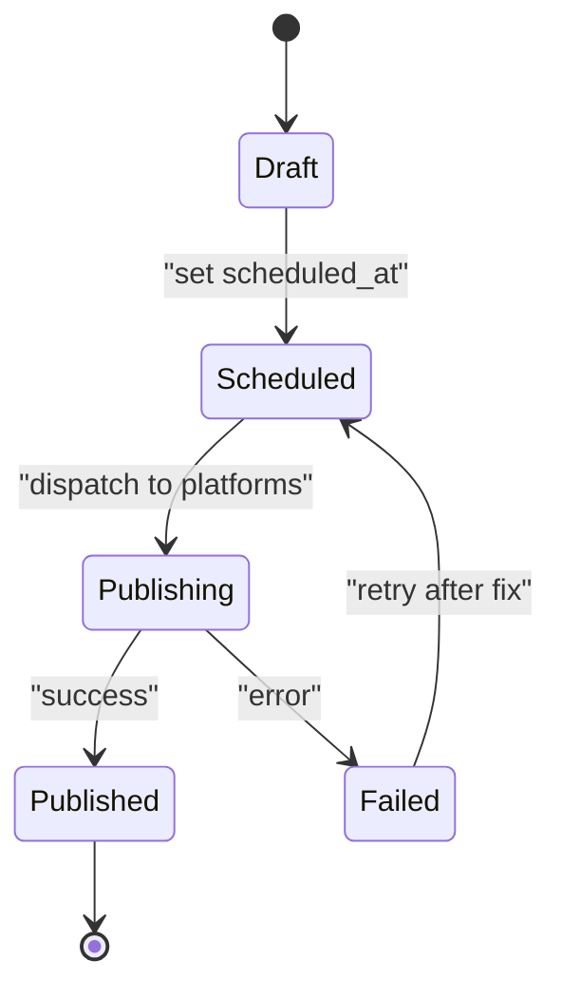
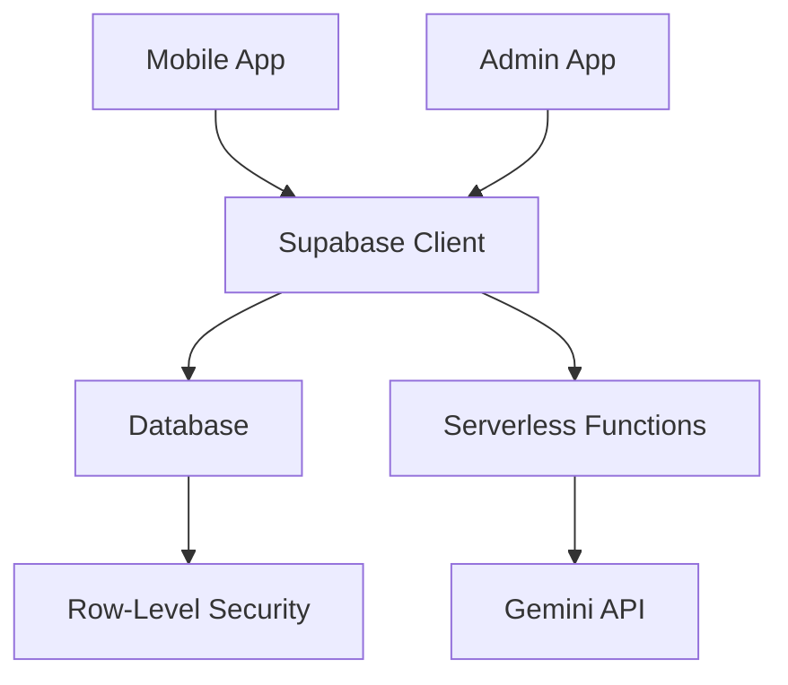

# Content Management System

<cite>
**Referenced Files in This Document**
- [README.md](file://README.md)
- [initial_schema.sql](file://supabase/migrations/20240001000000_initial_schema.sql)
- [generate-content/index.ts](file://supabase/functions/generate-content/index.ts)
- [posts/page.tsx](file://apps/admin/src/app/(dashboard)/posts/page.tsx)
- [templates/page.tsx](file://apps/admin/src/app/(dashboard)/templates/page.tsx)
- [calendar.tsx](file://apps/mobile/src/app/(tabs)/calendar.tsx)
- [post/[id].tsx](file://apps/mobile/src/app/post/[id].tsx)
- [ScheduleDatePickerSheet.tsx](file://apps/mobile/src/components/organisms/ScheduleDatePickerSheet.tsx)
</cite>

## Table of Contents
1. [Introduction](#introduction)
2. [Project Structure](#project-structure)
3. [Core Components](#core-components)
4. [Architecture Overview](#architecture-overview)
5. [Detailed Component Analysis](#detailed-component-analysis)
6. [Dependency Analysis](#dependency-analysis)
7. [Performance Considerations](#performance-considerations)
8. [Troubleshooting Guide](#troubleshooting-guide)
9. [Conclusion](#conclusion)
10. [Appendices](#appendices)

## Introduction
This document explains the content management system for multi-platform social media publishing. It covers post creation, editing, scheduling, and publishing workflows across Instagram, Twitter/X, LinkedIn, Facebook, TikTok, and Threads. It also documents the folder organization for categorizing content, the template library for reusable formats, the calendar view for scheduling, bulk operations patterns, post status lifecycle from draft to published, error handling, retry strategies, content formatting with hashtags, and media attachment handling.

The system is a monorepo with:
- Admin web app for moderation and template management
- Mobile app for creating/editing posts, scheduling via a calendar, and publishing
- Supabase backend with database schema, row-level security policies, and serverless functions for AI content generation

**Section sources**
- [README.md:1-4](file://README.md#L1-L4)

## Project Structure
High-level structure relevant to content management:
- Admin app (Next.js): Posts moderation page and Templates CRUD
- Mobile app (React Native/Expo): Calendar view, Post detail editor, Date picker sheet
- Supabase: Database schema defining posts, folders, templates, enums for platforms and statuses; RLS policies; Realtime subscriptions; Serverless function for AI content generation

**Diagram sources**
- [posts/page.tsx:13-44](file://apps/admin/src/app/(dashboard)/posts/page.tsx#L13-L44)
- [templates/page.tsx:21-83](file://apps/admin/src/app/(dashboard)/templates/page.tsx#L21-L83)
- [calendar.tsx:76-118](file://apps/mobile/src/app/(tabs)/calendar.tsx#L76-L118)
- [post/[id].tsx:43-103](file://apps/mobile/src/app/post/[id].tsx#L43-L103)
- [ScheduleDatePickerSheet.tsx:24-66](file://apps/mobile/src/components/organisms/ScheduleDatePickerSheet.tsx#L24-L66)
- [initial_schema.sql:8-13](file://supabase/migrations/20240001000000_initial_schema.sql#L8-L13)
- [initial_schema.sql:71-96](file://supabase/migrations/20240001000000_initial_schema.sql#L71-L96)
- [initial_schema.sql:98-109](file://supabase/migrations/20240001000000_initial_schema.sql#L98-L109)
- [initial_schema.sql:155-202](file://supabase/migrations/20240001000000_initial_schema.sql#L155-L202)
- [generate-content/index.ts:9-99](file://supabase/functions/generate-content/index.ts#L9-L99)

**Section sources**
- [initial_schema.sql:8-13](file://supabase/migrations/20240001000000_initial_schema.sql#L8-L13)
- [initial_schema.sql:71-96](file://supabase/migrations/20240001000000_initial_schema.sql#L71-L96)
- [initial_schema.sql:98-109](file://supabase/migrations/20240001000000_initial_schema.sql#L98-L109)
- [initial_schema.sql:155-202](file://supabase/migrations/20240001000000_initial_schema.sql#L155-L202)

## Core Components
- Post model and lifecycle:
  - Fields include title, content, hashtags array, media_urls array, platforms array, status enum (draft, scheduled, publishing, published, failed), scheduled_at, published_at, error_message
  - Status transitions are managed by UI flows and backend processes
- Folder organization:
  - Folders table associates posts to categories per user
- Template library:
  - Templates store prompt templates, default hashtags, suggested platform, premium flags, and active state
- Multi-platform support:
  - Platform enum includes instagram, twitter, linkedin, facebook, tiktok, threads
- Scheduling:
  - scheduled_at timestamp enables time-based publishing
- Error handling:
  - error_message field captures failures; status can be set to failed

**Section sources**
- [initial_schema.sql:8-13](file://supabase/migrations/20240001000000_initial_schema.sql#L8-L13)
- [initial_schema.sql:71-96](file://supabase/migrations/20240001000000_initial_schema.sql#L71-L96)
- [initial_schema.sql:98-109](file://supabase/migrations/20240001000000_initial_schema.sql#L98-L109)

## Architecture Overview
End-to-end flow for creating, scheduling, and publishing posts:

**Diagram sources**
- [post/[id].tsx:43-103](file://apps/mobile/src/app/post/[id].tsx#L43-L103)
- [calendar.tsx:76-118](file://apps/mobile/src/app/(tabs)/calendar.tsx#L76-L118)
- [ScheduleDatePickerSheet.tsx:24-66](file://apps/mobile/src/components/organisms/ScheduleDatePickerSheet.tsx#L24-L66)
- [posts/page.tsx:13-44](file://apps/admin/src/app/(dashboard)/posts/page.tsx#L13-L44)
- [initial_schema.sql:71-96](file://supabase/migrations/20240001000000_initial_schema.sql#L71-L96)
- [generate-content/index.ts:9-99](file://supabase/functions/generate-content/index.ts#L9-L99)

## Detailed Component Analysis

### Post Creation and Editing (Mobile)
- The mobile post editor allows users to:
  - Set title and content including hashtags
  - Select target platforms from supported list
  - Attach media via URL preview
  - Schedule publishing via a date/time picker
  - Save changes or publish immediately
- Platform selection supports Instagram, Twitter/X, LinkedIn, TikTok, Facebook
- Hashtags are embedded within content and can be stored separately in the database schema

**Diagram sources**
- [post/[id].tsx:43-103](file://apps/mobile/src/app/post/[id].tsx#L43-L103)
- [initial_schema.sql:8-13](file://supabase/migrations/20240001000000_initial_schema.sql#L8-L13)
- [initial_schema.sql:71-96](file://supabase/migrations/20240001000000_initial_schema.sql#L71-L96)

**Section sources**
- [post/[id].tsx:43-103](file://apps/mobile/src/app/post/[id].tsx#L43-L103)

### Calendar View and Scheduling
- The calendar screen displays a weekly strip with indicators for days containing scheduled posts
- Users can filter by platform and navigate to post details for editing or deletion
- The date picker sheet provides month navigation, day selection, and hour selection for scheduling

**Diagram sources**
- [calendar.tsx:76-118](file://apps/mobile/src/app/(tabs)/calendar.tsx#L76-L118)
- [ScheduleDatePickerSheet.tsx:24-66](file://apps/mobile/src/components/organisms/ScheduleDatePickerSheet.tsx#L24-L66)
- [initial_schema.sql:71-96](file://supabase/migrations/20240001000000_initial_schema.sql#L71-L96)

**Section sources**
- [calendar.tsx:76-118](file://apps/mobile/src/app/(tabs)/calendar.tsx#L76-L118)
- [ScheduleDatePickerSheet.tsx:24-66](file://apps/mobile/src/components/organisms/ScheduleDatePickerSheet.tsx#L24-L66)

### Admin Moderation and Post Lifecycle
- Admin page fetches all posts ordered by creation time and displays status badges
- Supports deleting posts and viewing platform tags
- Status badges reflect draft, scheduled, published, and failed states

**Diagram sources**
- [posts/page.tsx:13-44](file://apps/admin/src/app/(dashboard)/posts/page.tsx#L13-L44)
- [initial_schema.sql:71-96](file://supabase/migrations/20240001000000_initial_schema.sql#L71-L96)

**Section sources**
- [posts/page.tsx:13-44](file://apps/admin/src/app/(dashboard)/posts/page.tsx#L13-L44)

### Template Library Management
- Admin templates page allows creating, listing, and deleting templates
- Templates include category, prompt template text, default hashtags, suggested platform, premium flag, and active state
- Templates enable reusable content formats for AI generation

**Diagram sources**
- [templates/page.tsx:21-83](file://apps/admin/src/app/(dashboard)/templates/page.tsx#L21-L83)
- [initial_schema.sql:98-109](file://supabase/migrations/20240001000000_initial_schema.sql#L98-L109)

**Section sources**
- [templates/page.tsx:21-83](file://apps/admin/src/app/(dashboard)/templates/page.tsx#L21-L83)

### AI Content Generation
- Serverless function authenticates user, reads AI configuration, calls Gemini API, and returns generated content
- Decrements user credits and records analytics
- Provides fallback mock result when API key is not configured

**Diagram sources**
- [generate-content/index.ts:9-99](file://supabase/functions/generate-content/index.ts#L9-L99)
- [initial_schema.sql:31-42](file://supabase/migrations/20240001000000_initial_schema.sql#L31-L42)

**Section sources**
- [generate-content/index.ts:9-99](file://supabase/functions/generate-content/index.ts#L9-L99)

### Folder Organization for Categorization
- Folders table stores user-specific categories with name and color
- Posts can be associated with folders for grouping and filtering
- Row-level security ensures users manage only their own folders

**Diagram sources**
- [initial_schema.sql:71-96](file://supabase/migrations/20240001000000_initial_schema.sql#L71-L96)

**Section sources**
- [initial_schema.sql:71-96](file://supabase/migrations/20240001000000_initial_schema.sql#L71-L96)

### Multi-Platform Publishing Capabilities
- Supported platforms defined in enum: instagram, twitter, linkedin, facebook, tiktok, threads
- Mobile editor allows selecting multiple platforms per post
- Admin moderation shows platform tags per post

**Section sources**
- [initial_schema.sql:8-13](file://supabase/migrations/20240001000000_initial_schema.sql#L8-L13)
- [post/[id].tsx:35-41](file://apps/mobile/src/app/post/[id].tsx#L35-L41)
- [posts/page.tsx:113-120](file://apps/admin/src/app/(dashboard)/posts/page.tsx#L113-L120)

### Post Status Lifecycle and Error Handling
- Status enum includes draft, scheduled, publishing, published, failed
- Admin page renders status badges for each state
- Error messages captured in error_message field; failed status indicates unsuccessful publishing attempts

**Diagram sources**
- [initial_schema.sql:8-13](file://supabase/migrations/20240001000000_initial_schema.sql#L8-L13)
- [posts/page.tsx:46-73](file://apps/admin/src/app/(dashboard)/posts/page.tsx#L46-L73)

**Section sources**
- [initial_schema.sql:8-13](file://supabase/migrations/20240001000000_initial_schema.sql#L8-L13)
- [posts/page.tsx:46-73](file://apps/admin/src/app/(dashboard)/posts/page.tsx#L46-L73)

### Content Formatting and Hashtag Management
- Content supports free-form text with hashtags embedded
- Hashtags stored as an array in the posts table for structured management
- Templates can include default hashtags to standardize content

**Section sources**
- [initial_schema.sql:71-96](file://supabase/migrations/20240001000000_initial_schema.sql#L71-L96)
- [initial_schema.sql:98-109](file://supabase/migrations/20240001000000_initial_schema.sql#L98-L109)
- [post/[id].tsx:50-53](file://apps/mobile/src/app/post/[id].tsx#L50-L53)

### Media Attachment Handling
- Media URLs stored as an array in posts table
- Mobile editor previews attached images via URL
- Removal option available in editor

**Section sources**
- [initial_schema.sql:71-96](file://supabase/migrations/20240001000000_initial_schema.sql#L71-L96)
- [post/[id].tsx:200-220](file://apps/mobile/src/app/post/[id].tsx#L200-L220)

### Bulk Operations Patterns
- While explicit bulk actions are not implemented in the provided files, the architecture supports batch operations through:
  - Filtering posts by platform and day in the calendar
  - Admin moderation page fetching all posts for review
  - Database queries that can be extended to update multiple posts at once
- Recommended approach: implement batch endpoints to update statuses or delete multiple posts based on filters

[No sources needed since this section provides general guidance based on existing components]

## Dependency Analysis
Key dependencies between components:
- Mobile app depends on Supabase for data persistence and authentication
- Admin app depends on Supabase for moderation and template management
- Serverless function depends on environment variables for API keys and Supabase client
- Database schema defines relationships and constraints ensuring data integrity

**Diagram sources**
- [post/[id].tsx:43-103](file://apps/mobile/src/app/post/[id].tsx#L43-L103)
- [posts/page.tsx:13-44](file://apps/admin/src/app/(dashboard)/posts/page.tsx#L13-L44)
- [generate-content/index.ts:9-99](file://supabase/functions/generate-content/index.ts#L9-L99)
- [initial_schema.sql:155-202](file://supabase/migrations/20240001000000_initial_schema.sql#L155-L202)

**Section sources**
- [initial_schema.sql:155-202](file://supabase/migrations/20240001000000_initial_schema.sql#L155-L202)

## Performance Considerations
- Use efficient queries with filters (e.g., by user_id, folder_id, platforms) to reduce payload size
- Leverage Realtime subscriptions for live updates in admin and mobile views
- Cache frequently accessed templates and configurations on the client side
- Implement pagination for large post lists in admin moderation
- Optimize media loading with lazy loading and appropriate image sizes

[No sources needed since this section provides general guidance]

## Troubleshooting Guide
Common issues and resolutions:
- Unauthorized errors when calling serverless functions: ensure proper authentication headers
- Missing API keys: configure environment variables for Gemini API
- Data access denied: verify row-level security policies allow user access
- Network timeouts: implement retry logic with exponential backoff for publishing operations
- Invalid platform selection: validate against enum values before saving

**Section sources**
- [generate-content/index.ts:21-36](file://supabase/functions/generate-content/index.ts#L21-L36)
- [initial_schema.sql:155-202](file://supabase/migrations/20240001000000_initial_schema.sql#L155-L202)

## Conclusion
The content management system provides a comprehensive solution for creating, organizing, scheduling, and publishing social media content across multiple platforms. With robust database schema, secure row-level policies, and intuitive mobile and admin interfaces, it supports efficient content workflows. The template library enables reusable formats, while the calendar view facilitates scheduling. Error handling and status tracking ensure reliability, and the architecture supports future enhancements like bulk operations and advanced analytics.

[No sources needed since this section summarizes without analyzing specific files]

## Appendices

### Example Workflows

#### Creating a Post with Hashtags and Media
- Compose content with hashtags in the mobile editor
- Attach media URL for visual preview
- Select target platforms and schedule time
- Save as draft or publish immediately

**Section sources**
- [post/[id].tsx:50-53](file://apps/mobile/src/app/post/[id].tsx#L50-L53)
- [post/[id].tsx:200-220](file://apps/mobile/src/app/post/[id].tsx#L200-L220)
- [post/[id].tsx:71-89](file://apps/mobile/src/app/post/[id].tsx#L71-L89)

#### Managing Templates for Reusable Formats
- Create templates with categories and suggested platforms
- Include default hashtags and prompt templates
- Manage premium features and active states

**Section sources**
- [templates/page.tsx:43-83](file://apps/admin/src/app/(dashboard)/templates/page.tsx#L43-L83)
- [initial_schema.sql:98-109](file://supabase/migrations/20240001000000_initial_schema.sql#L98-L109)

#### Scheduling via Calendar View
- Navigate weekly calendar strip and filter by platform
- Open date picker to select precise scheduling time
- Confirm schedule and update post metadata

**Section sources**
- [calendar.tsx:86-118](file://apps/mobile/src/app/(tabs)/calendar.tsx#L86-L118)
- [ScheduleDatePickerSheet.tsx:62-66](file://apps/mobile/src/components/organisms/ScheduleDatePickerSheet.tsx#L62-L66)