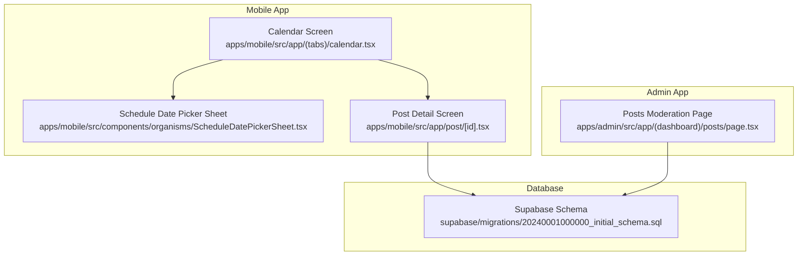
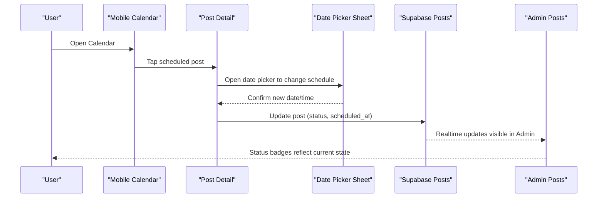
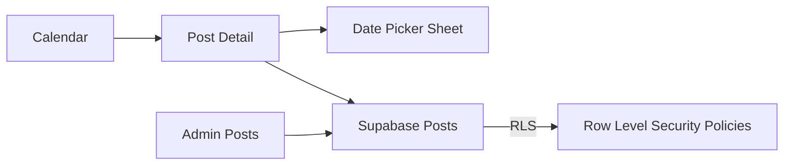
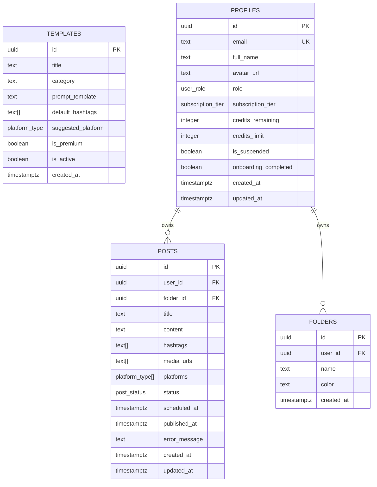

# Content Scheduling System

<cite>
**Referenced Files in This Document**
- [calendar.tsx](file://apps/mobile/src/app/(tabs)/calendar.tsx)
- [ScheduleDatePickerSheet.tsx](file://apps/mobile/src/components/organisms/ScheduleDatePickerSheet.tsx)
- [post detail screen](file://apps/mobile/src/app/post/[id].tsx)
- [posts moderation page](file://apps/admin/src/app/(dashboard)/posts/page.tsx)
- [initial schema](file://supabase/migrations/20240001000000_initial_schema.sql)
</cite>

## Table of Contents
1. [Introduction](#introduction)
2. [Project Structure](#project-structure)
3. [Core Components](#core-components)
4. [Architecture Overview](#architecture-overview)
5. [Detailed Component Analysis](#detailed-component-analysis)
6. [Dependency Analysis](#dependency-analysis)
7. [Performance Considerations](#performance-considerations)
8. [Troubleshooting Guide](#troubleshooting-guide)
9. [Conclusion](#conclusion)
10. [Appendices](#appendices)

## Introduction
This document explains the content scheduling system implemented across the mobile and admin applications, focusing on:
- Calendar view for visualizing scheduled posts
- Date picker sheet component for selecting publish times
- Post status lifecycle from draft to scheduled to published, including failure handling
- Database schema for schedule information and time fields
- Timezone considerations and conflict resolution strategies
- Examples of bulk scheduling operations and recurring post templates

The goal is to provide both a high-level understanding and code-level insights so that developers can extend or maintain the scheduling features confidently.

## Project Structure
The scheduling system spans two primary apps:
- Mobile app: Provides the user-facing calendar view and date picker sheet for scheduling posts.
- Admin app: Provides moderation and visibility into post statuses (draft, scheduled, publishing, published, failed).

**Diagram sources**
- [calendar.tsx:1-139](file://apps/mobile/src/app/(tabs)/calendar.tsx#L1-L139)
- [ScheduleDatePickerSheet.tsx:1-66](file://apps/mobile/src/components/organisms/ScheduleDatePickerSheet.tsx#L1-L66)
- [post detail screen:43-69](file://apps/mobile/src/app/post/[id].tsx#L43-L69)
- [posts moderation page:1-33](file://apps/admin/src/app/(dashboard)/posts/page.tsx#L1-L33)
- [initial schema:81-96](file://supabase/migrations/20240001000000_initial_schema.sql#L81-L96)

**Section sources**
- [calendar.tsx:1-139](file://apps/mobile/src/app/(tabs)/calendar.tsx#L1-L139)
- [ScheduleDatePickerSheet.tsx:1-66](file://apps/mobile/src/components/organisms/ScheduleDatePickerSheet.tsx#L1-L66)
- [post detail screen:43-69](file://apps/mobile/src/app/post/[id].tsx#L43-L69)
- [posts moderation page:1-33](file://apps/admin/src/app/(dashboard)/posts/page.tsx#L1-L33)
- [initial schema:81-96](file://supabase/migrations/20240001000000_initial_schema.sql#L81-L96)

## Core Components
- Calendar view: Displays a weekly strip with indicators for days containing scheduled posts, filters by platform, and shows a timeline queue of posts for the selected day.
- Date picker sheet: A modal sheet enabling users to pick a future date and an hour slot for publishing, with a preview banner and confirmation action.
- Post detail screen: Allows editing post content, platforms, and scheduling slot; integrates with the date picker sheet.
- Admin posts moderation: Lists all posts with status badges (draft, scheduled, publishing, published, failed), and supports deletion.

Key responsibilities:
- Calendar: UI orchestration, filtering, navigation to post details.
- Date picker sheet: User input capture for date/time selection and formatted output.
- Post detail: Editing and saving changes; integration with scheduling flow.
- Admin: Read-only monitoring and moderation actions.

**Section sources**
- [calendar.tsx:76-139](file://apps/mobile/src/app/(tabs)/calendar.tsx#L76-L139)
- [ScheduleDatePickerSheet.tsx:24-66](file://apps/mobile/src/components/organisms/ScheduleDatePickerSheet.tsx#L24-L66)
- [post detail screen:43-69](file://apps/mobile/src/app/post/[id].tsx#L43-L69)
- [posts moderation page:46-82](file://apps/admin/src/app/(dashboard)/posts/page.tsx#L46-L82)

## Architecture Overview
The scheduling architecture combines client-side UI components with a server-backed database schema that stores post metadata, scheduling timestamps, and status transitions. The mobile app handles user interactions and local state, while the admin app provides oversight and moderation capabilities.

**Diagram sources**
- [calendar.tsx:104-118](file://apps/mobile/src/app/(tabs)/calendar.tsx#L104-L118)
- [ScheduleDatePickerSheet.tsx:62-66](file://apps/mobile/src/components/organisms/ScheduleDatePickerSheet.tsx#L62-L66)
- [post detail screen:43-69](file://apps/mobile/src/app/post/[id].tsx#L43-L69)
- [posts moderation page:13-33](file://apps/admin/src/app/(dashboard)/posts/page.tsx#L13-L33)
- [initial schema:81-96](file://supabase/migrations/20240001000000_initial_schema.sql#L81-L96)

## Detailed Component Analysis

### Calendar View Implementation
- Weekly strip: Generates seven days starting from today, marks days with scheduled posts via indicator dots.
- Platform filter: Filters posts by channel (all, instagram, twitter, linkedin).
- Timeline queue: Renders posts for the selected day with time, title, content snippet, and platform icons; supports edit and delete actions.

Complexity:
- Filtering is O(n) over the in-memory posts array per render.
- Day generation is constant-time for a fixed 7-day window.

Optimization opportunities:
- Debounce filter updates if performance degrades with large datasets.
- Virtualize timeline list if many posts are scheduled per day.

Error handling:
- Empty state displayed when no posts exist for the selected day.

**Section sources**
- [calendar.tsx:82-118](file://apps/mobile/src/app/(tabs)/calendar.tsx#L82-L118)
- [calendar.tsx:141-232](file://apps/mobile/src/app/(tabs)/calendar.tsx#L141-L232)
- [calendar.tsx:234-341](file://apps/mobile/src/app/(tabs)/calendar.tsx#L234-L341)

### Date Picker Sheet Component
- Month navigation: Prevents selecting past months; allows moving forward.
- Days grid: Disables past days within the current month; highlights selected day.
- Hour selector: Presents predefined hour slots for publishing.
- Preview banner: Shows selected date and time before confirmation.
- Confirmation: Formats the selection and returns it to the caller.

Edge cases:
- Past month navigation disabled to avoid scheduling errors.
- Past days within current month disabled to prevent invalid schedules.

**Section sources**
- [ScheduleDatePickerSheet.tsx:31-66](file://apps/mobile/src/components/organisms/ScheduleDatePickerSheet.tsx#L31-L66)
- [ScheduleDatePickerSheet.tsx:108-174](file://apps/mobile/src/components/organisms/ScheduleDatePickerSheet.tsx#L108-L174)
- [ScheduleDatePickerSheet.tsx:176-228](file://apps/mobile/src/components/organisms/ScheduleDatePickerSheet.tsx#L176-L228)

### Post Detail Screen Integration
- State includes title, content, selected platforms, scheduled slot, media URL, save/publish flags, and date picker visibility.
- Platform toggling logic ensures at least one platform remains selected.
- Save flow simulates persistence and navigates back after success.

Integration points:
- Opens date picker sheet to adjust scheduling slot.
- Updates post data locally and persists via Supabase in production flows.

**Section sources**
- [post detail screen:43-69](file://apps/mobile/src/app/post/[id].tsx#L43-L69)

### Admin Posts Moderation
- Fetches posts from Supabase and displays them with status badges.
- Supports deletion of posts with confirmation prompts.
- Status badges visually communicate draft, scheduled, publishing, published, and failed states.

Operational notes:
- Realtime updates enable live monitoring of post statuses.
- Deletion removes posts from the system and refreshes the feed.

**Section sources**
- [posts moderation page:13-33](file://apps/admin/src/app/(dashboard)/posts/page.tsx#L13-L33)
- [posts moderation page:46-82](file://apps/admin/src/app/(dashboard)/posts/page.tsx#L46-L82)
- [posts moderation page:95-132](file://apps/admin/src/app/(dashboard)/posts/page.tsx#L95-L132)

### Post Status Lifecycle
The database defines a post_status enum with values: draft, scheduled, publishing, published, failed. Typical lifecycle:
- Draft: Initial creation state.
- Scheduled: Post has a future scheduled_at timestamp.
- Publishing: Transition during dispatch attempt.
- Published: Successfully posted to platforms.
- Failed: Error encountered during publishing; may require retry.

Status visualization:
- Admin UI renders distinct badges for each status to aid moderation.

Retry mechanisms:
- Failed posts can be retried by re-triggering publishing workflows and updating status back to publishing then published or remaining failed based on outcome.

**Section sources**
- [initial schema:8-12](file://supabase/migrations/20240001000000_initial_schema.sql#L8-L12)
- [initial schema:81-96](file://supabase/migrations/20240001000000_initial_schema.sql#L81-L96)
- [posts moderation page:46-82](file://apps/admin/src/app/(dashboard)/posts/page.tsx#L46-L82)

### Database Schema for Schedule Information
Key fields in the posts table relevant to scheduling:
- status: Enum controlling lifecycle stages.
- scheduled_at: Timestamp for planned publication.
- published_at: Timestamp when successfully published.
- error_message: Captures last known error for failed attempts.

Timezone handling:
- Fields use TIMESTAMPTZ to store timezone-aware timestamps, ensuring consistent global scheduling.

Conflict resolution:
- No explicit unique constraints on scheduled_at to allow multiple posts at the same time.
- Conflict detection should be implemented at the application layer (e.g., check existing scheduled posts per user/platform/time window) before creating or updating schedules.

**Section sources**
- [initial schema:81-96](file://supabase/migrations/20240001000000_initial_schema.sql#L81-L96)

### Timezone Handling
- Use TIMESTAMPTZ for accurate storage and retrieval across timezones.
- Convert user-selected local times to UTC before persisting scheduled_at.
- Display times in the UI using the user’s local timezone for clarity.

Best practices:
- Store only UTC in the database.
- Format for display on the client side based on device locale.
- Validate that scheduled_at is in the future to prevent immediate publishes.

[No sources needed since this section provides general guidance]

### Conflict Resolution Strategy
To avoid overlapping posts on the same platform or account:
- Before scheduling, query existing posts for the user and platform within a time window around the proposed scheduled_at.
- If conflicts exist, prompt the user to adjust the time or merge content.
- Optionally enforce minimum spacing between posts per platform.

Implementation outline:
- Query posts where platforms overlap and scheduled_at falls within a defined range.
- Present conflict warnings and offer alternatives.

[No sources needed since this section provides general guidance]

### Bulk Scheduling Operations
Examples of bulk scheduling patterns:
- Import CSV with columns: title, content, platforms[], scheduled_at (UTC), user_id.
- For each row:
  - Validate fields and convert scheduled_at to UTC.
  - Check for conflicts per platform/time window.
  - Insert rows into posts with status set to scheduled.
- Provide progress feedback and summary of successes/failures.

Considerations:
- Batch inserts to reduce round trips.
- Transactional boundaries to ensure consistency.
- Error aggregation and reporting.

[No sources needed since this section provides general guidance]

### Recurring Post Templates
Templates stored in the templates table support recurring content generation:
- Fields include title, category, prompt_template, default_hashtags, suggested_platform, premium flag, and active flag.
- Workflow:
  - Select a template to generate content variations.
  - Schedule generated posts using the date picker sheet.
  - Optionally create recurring schedules by duplicating posts with shifted scheduled_at values.

Admin interface:
- Templates page lists and manages templates, allowing creation and activation.

**Section sources**
- [initial schema:98-109](file://supabase/migrations/20240001000000_initial_schema.sql#L98-L109)

## Dependency Analysis
Components interact through well-defined interfaces:
- Calendar depends on local state and navigation to post detail.
- Post detail depends on the date picker sheet for scheduling inputs.
- Both mobile and admin depend on Supabase for data persistence and realtime updates.
- Database schema enforces types and relationships, including RLS policies for security.

**Diagram sources**
- [calendar.tsx:104-118](file://apps/mobile/src/app/(tabs)/calendar.tsx#L104-L118)
- [ScheduleDatePickerSheet.tsx:62-66](file://apps/mobile/src/components/organisms/ScheduleDatePickerSheet.tsx#L62-L66)
- [posts moderation page:13-33](file://apps/admin/src/app/(dashboard)/posts/page.tsx#L13-L33)
- [initial schema:159-202](file://supabase/migrations/20240001000000_initial_schema.sql#L159-L202)

**Section sources**
- [calendar.tsx:104-118](file://apps/mobile/src/app/(tabs)/calendar.tsx#L104-L118)
- [ScheduleDatePickerSheet.tsx:62-66](file://apps/mobile/src/components/organisms/ScheduleDatePickerSheet.tsx#L62-L66)
- [posts moderation page:13-33](file://apps/admin/src/app/(dashboard)/posts/page.tsx#L13-L33)
- [initial schema:159-202](file://supabase/migrations/20240001000000_initial_schema.sql#L159-L202)

## Performance Considerations
- Calendar rendering: Keep the 7-day strip lightweight; avoid heavy computations inside map functions.
- Filtering: Use memoization for filtered results if dataset grows significantly.
- List virtualization: Implement for timeline lists to handle many scheduled posts efficiently.
- Network calls: Cache posts data and leverage Supabase realtime to minimize polling.
- Date picker: Avoid unnecessary re-renders by stabilizing state updates and disabling irrelevant controls.

[No sources needed since this section provides general guidance]

## Troubleshooting Guide
Common issues and resolutions:
- Posts not appearing in calendar:
  - Verify scheduled_at is in the future and status is scheduled.
  - Ensure platform filters match post.platforms.
- Date picker blocking past dates:
  - Intended behavior; schedule only future times.
- Admin not seeing updated statuses:
  - Confirm realtime subscriptions are active and RLS policies allow access.
- Failed publishes:
  - Check error_message field for diagnostics.
  - Retry workflow should update status back to publishing and then to published or remain failed.

**Section sources**
- [posts moderation page:46-82](file://apps/admin/src/app/(dashboard)/posts/page.tsx#L46-L82)
- [initial schema:81-96](file://supabase/migrations/20240001000000_initial_schema.sql#L81-L96)

## Conclusion
The content scheduling system provides a robust foundation for planning and managing social media posts across platforms. The mobile calendar and date picker deliver an intuitive user experience, while the admin dashboard offers visibility and control over post lifecycles. The database schema supports timezone-aware scheduling and flexible status transitions. Extending the system with conflict detection, bulk operations, and recurring templates will further enhance productivity and reliability.

[No sources needed since this section summarizes without analyzing specific files]

## Appendices

### Data Model Diagram

**Diagram sources**
- [initial schema:44-96](file://supabase/migrations/20240001000000_initial_schema.sql#L44-L96)
- [initial schema:98-109](file://supabase/migrations/20240001000000_initial_schema.sql#L98-L109)