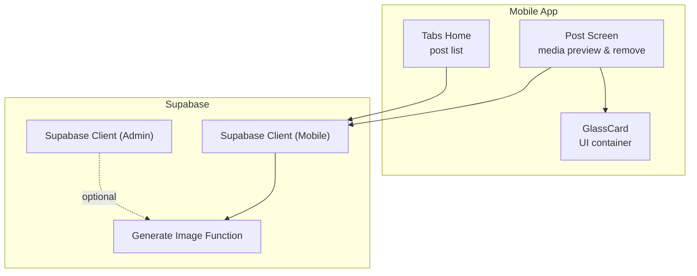
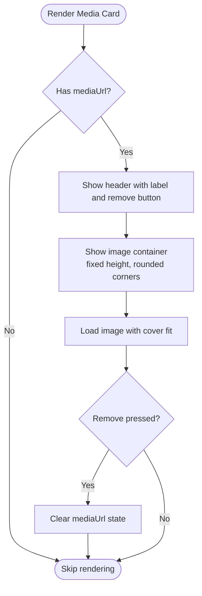
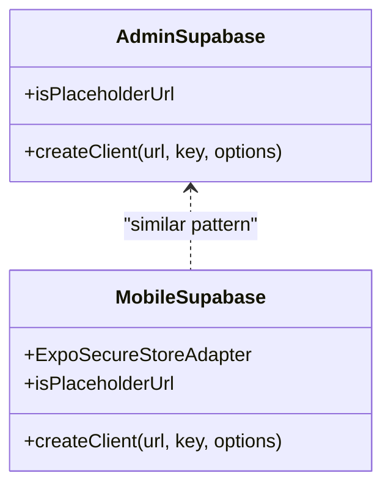
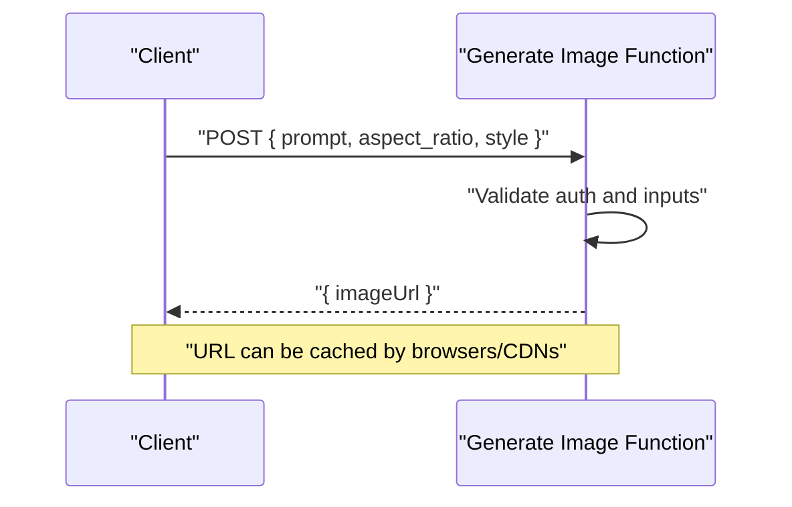
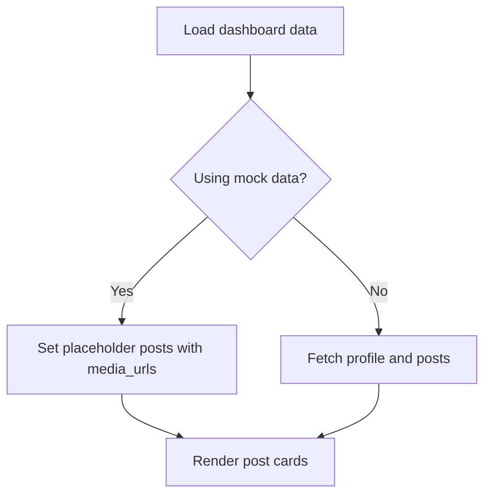
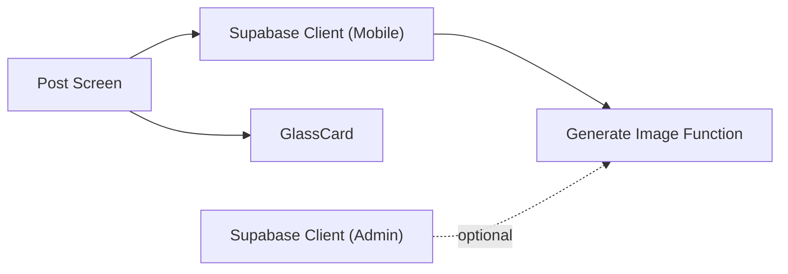

# Media Attachment Management

<cite>
**Referenced Files in This Document**
- [supabase.ts (Admin)](file://apps/admin/src/lib/supabase.ts)
- [supabase.ts (Mobile)](file://apps/mobile/src/services/supabase.ts)
- [generate-image/index.ts](file://supabase/functions/generate-image/index.ts)
- [post/[id].tsx (Mobile)](file://apps/mobile/src/app/post/[id].tsx)
- [index.tsx (Mobile Tabs)](file://apps/mobile/src/app/(tabs)/index.tsx)
- [GlassCard.tsx (Mobile)](file://apps/mobile/src/components/atoms/GlassCard.tsx)
- [PROJECT_EXPORT_MASTER.txt](file://PROJECT_EXPORT_MASTER.txt)
</cite>

## Table of Contents
1. Introduction
2. Project Structure
3. Core Components
4. Architecture Overview
5. Detailed Component Analysis
6. Dependency Analysis
7. Performance Considerations
8. Troubleshooting Guide
9. Conclusion

## Introduction
This document explains how media attachments are managed across the content system, focusing on image upload, preview, and removal within the mobile app, and how generated images integrate with Supabase storage and CDN-like delivery. It covers supported formats, size constraints, platform-specific considerations, caching strategies, and patterns for batch operations and library integration.

## Project Structure
Media-related functionality spans:
- Mobile UI components that render media previews and allow removal
- Supabase client configuration for both Admin and Mobile apps
- Serverless functions that generate images and return URLs suitable for display and caching
- Shared styles and cards used to present media consistently



**Diagram sources**
- [post/[id].tsx (Mobile):200-220](file://apps/mobile/src/app/post/[id].tsx#L200-L220)
- [index.tsx (Mobile Tabs):29-70](file://apps/mobile/src/app/(tabs)/index.tsx#L29-L70)
- [GlassCard.tsx (Mobile):36-80](file://apps/mobile/src/components/atoms/GlassCard.tsx#L36-L80)
- [supabase.ts (Mobile):1-41](file://apps/mobile/src/services/supabase.ts#L1-L41)
- [supabase.ts (Admin):1-15](file://apps/admin/src/lib/supabase.ts#L1-L15)
- [generate-image/index.ts:1-39](file://supabase/functions/generate-image/index.ts#L1-L39)

**Section sources**
- [post/[id].tsx (Mobile):200-220](file://apps/mobile/src/app/post/[id].tsx#L200-L220)
- [index.tsx (Mobile Tabs):29-70](file://apps/mobile/src/app/(tabs)/index.tsx#L29-L70)
- [GlassCard.tsx (Mobile):36-80](file://apps/mobile/src/components/atoms/GlassCard.tsx#L36-L80)
- [supabase.ts (Mobile):1-41](file://apps/mobile/src/services/supabase.ts#L1-L41)
- [supabase.ts (Admin):1-15](file://apps/admin/src/lib/supabase.ts#L1-L15)
- [generate-image/index.ts:1-39](file://supabase/functions/generate-image/index.ts#L1-L39)

## Core Components
- Media Preview Card: Displays an attached image with a remove action, using a responsive container and cover fit to preserve aspect ratio while filling the card.
- Supabase Clients: Centralized clients for Admin and Mobile apps with session persistence and secure storage on mobile platforms.
- Generate Image Function: A serverless endpoint that validates input, authenticates users, and returns a stable image URL suitable for caching and CDN delivery.

Key responsibilities:
- Present media in a consistent card with clear affordances to remove or replace
- Provide reliable client configuration for storage and auth
- Return deterministic image URLs from generation endpoints to enable caching

**Section sources**
- [post/[id].tsx (Mobile):200-220](file://apps/mobile/src/app/post/[id].tsx#L200-L220)
- [supabase.ts (Mobile):1-41](file://apps/mobile/src/services/supabase.ts#L1-L41)
- [supabase.ts (Admin):1-15](file://apps/admin/src/lib/supabase.ts#L1-L15)
- [generate-image/index.ts:1-39](file://supabase/functions/generate-image/index.ts#L1-L39)

## Architecture Overview
The media flow integrates UI, client configuration, and backend generation:

```mermaid
sequenceDiagram
participant User as "User"
participant PostScreen as "Post Screen"
participant Client as "Supabase Client (Mobile)"
participant Func as "Generate Image Function"
participant CDN as "CDN / Storage URL"
User->>PostScreen : "Open post editor"
PostScreen->>Client : "Call generate image function"
Client->>Func : "POST { prompt, aspect_ratio, style }"
Func-->>Client : "{ imageUrl }"
Client-->>PostScreen : "imageUrl"
PostScreen->>PostScreen : "Render media preview card"
PostScreen->>CDN : "Load image via imageUrl"
Note over PostScreen,CDN : "URL is cacheable; browser/edge caches optimize delivery"
```

**Diagram sources**
- [post/[id].tsx (Mobile):200-220](file://apps/mobile/src/app/post/[id].tsx#L200-L220)
- [supabase.ts (Mobile):1-41](file://apps/mobile/src/services/supabase.ts#L1-L41)
- [generate-image/index.ts:1-39](file://supabase/functions/generate-image/index.ts#L1-L39)

## Detailed Component Analysis

### Media Preview Card (Mobile)
- Renders a card with header, label group, and remove button
- Uses a fixed-height container with overflow hidden and cover-fit image to maintain aspect ratio
- Supports removing the attachment by clearing the media URL state



**Diagram sources**
- [post/[id].tsx (Mobile):200-220](file://apps/mobile/src/app/post/[id].tsx#L200-L220)
- [post/[id].tsx (Mobile):415-431](file://apps/mobile/src/app/post/[id].tsx#L415-L431)

**Section sources**
- [post/[id].tsx (Mobile):200-220](file://apps/mobile/src/app/post/[id].tsx#L200-L220)
- [post/[id].tsx (Mobile):415-431](file://apps/mobile/src/app/post/[id].tsx#L415-L431)

### Supabase Client Configuration
- Admin app initializes a client with environment-based URL and key, plus session persistence
- Mobile app uses a secure storage adapter for sessions and enables auto-refresh token handling



**Diagram sources**
- [supabase.ts (Admin):1-15](file://apps/admin/src/lib/supabase.ts#L1-L15)
- [supabase.ts (Mobile):1-41](file://apps/mobile/src/services/supabase.ts#L1-L41)

**Section sources**
- [supabase.ts (Admin):1-15](file://apps/admin/src/lib/supabase.ts#L1-L15)
- [supabase.ts (Mobile):1-41](file://apps/mobile/src/services/supabase.ts#L1-L41)

### Generate Image Function
- Validates user authentication and required inputs
- Returns a deterministic image URL suitable for caching and CDN optimization
- Accepts parameters such as prompt, aspect ratio, and style



**Diagram sources**
- [generate-image/index.ts:1-39](file://supabase/functions/generate-image/index.ts#L1-L39)

**Section sources**
- [generate-image/index.ts:1-39](file://supabase/functions/generate-image/index.ts#L1-L39)

### Post List Integration
- The tabs home screen loads posts and displays them in cards
- Posts include a media_urls field indicating associated media references



**Diagram sources**
- [index.tsx (Mobile Tabs):29-70](file://apps/mobile/src/app/(tabs)/index.tsx#L29-L70)

**Section sources**
- [index.tsx (Mobile Tabs):29-70](file://apps/mobile/src/app/(tabs)/index.tsx#L29-L70)

### Reusable Media Card Styles
- Shared styles define a consistent media card layout, including padding, gap, header row, and image container sizing
- These styles ensure consistent presentation across screens

**Section sources**
- [PROJECT_EXPORT_MASTER.txt:9199-9238](file://PROJECT_EXPORT_MASTER.txt#L9199-L9238)

## Dependency Analysis
- Mobile Post Screen depends on:
  - Supabase client for network calls and session management
  - Local state for mediaUrl and UI actions
  - GlassCard for consistent visual framing
- Supabase clients depend on environment variables and platform storage adapters
- Generate Image Function depends on Supabase auth context and external image generation services



**Diagram sources**
- [post/[id].tsx (Mobile):200-220](file://apps/mobile/src/app/post/[id].tsx#L200-L220)
- [GlassCard.tsx (Mobile):36-80](file://apps/mobile/src/components/atoms/GlassCard.tsx#L36-L80)
- [supabase.ts (Mobile):1-41](file://apps/mobile/src/services/supabase.ts#L1-L41)
- [supabase.ts (Admin):1-15](file://apps/admin/src/lib/supabase.ts#L1-L15)
- [generate-image/index.ts:1-39](file://supabase/functions/generate-image/index.ts#L1-L39)

**Section sources**
- [post/[id].tsx (Mobile):200-220](file://apps/mobile/src/app/post/[id].tsx#L200-L220)
- [GlassCard.tsx (Mobile):36-80](file://apps/mobile/src/components/atoms/GlassCard.tsx#L36-L80)
- [supabase.ts (Mobile):1-41](file://apps/mobile/src/services/supabase.ts#L1-L41)
- [supabase.ts (Admin):1-15](file://apps/admin/src/lib/supabase.ts#L1-L15)
- [generate-image/index.ts:1-39](file://supabase/functions/generate-image/index.ts#L1-L39)

## Performance Considerations
- Caching: Use deterministic image URLs returned by the generate image function to leverage browser and edge caching. Avoid query strings that change per request unless intentionally versioned.
- Image Delivery: Serve images through a CDN-backed URL to reduce latency and offload origin traffic.
- Memory and Rendering: Use fixed-height containers with cover-fit images to prevent layout shifts and reduce reflows during loading.
- Network Requests: Batch requests where possible and debounce rapid interactions to avoid redundant calls.
- Platform Storage: On mobile, use secure storage for sessions to minimize overhead and improve security without impacting performance.

[No sources needed since this section provides general guidance]

## Troubleshooting Guide
Common issues and resolutions:
- Unauthorized errors when calling the generate image function: Ensure the Supabase client is properly authenticated and passes Authorization headers.
- Placeholder URLs: If using mock mode, verify environment flags and fallback behavior to avoid unexpected network calls.
- Image not displaying: Confirm the returned URL is valid and accessible; check CORS and CDN availability.
- Session persistence on mobile: Verify the secure storage adapter is configured correctly for the target platform.

**Section sources**
- [generate-image/index.ts:1-39](file://supabase/functions/generate-image/index.ts#L1-L39)
- [supabase.ts (Admin):1-15](file://apps/admin/src/lib/supabase.ts#L1-L15)
- [supabase.ts (Mobile):1-41](file://apps/mobile/src/services/supabase.ts#L1-L41)

## Conclusion
The media attachment system combines a clean mobile UI for preview and removal with robust Supabase client configuration and a serverless image generation endpoint. Deterministic URLs enable effective caching and CDN optimization. For production readiness, implement explicit file validation and compression at upload boundaries, enforce size limits, and standardize batch operations and library integrations around these core patterns.

[No sources needed since this section summarizes without analyzing specific files]