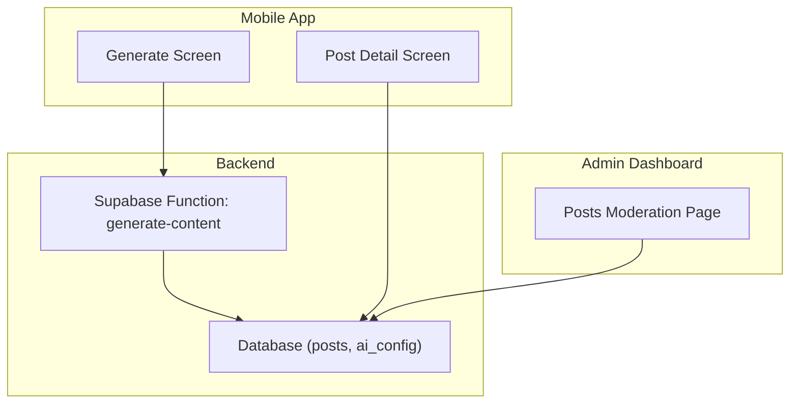
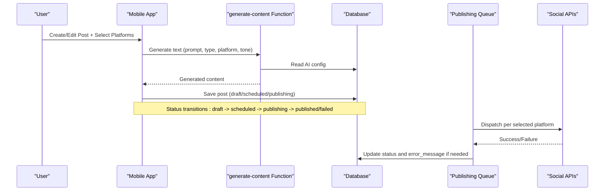
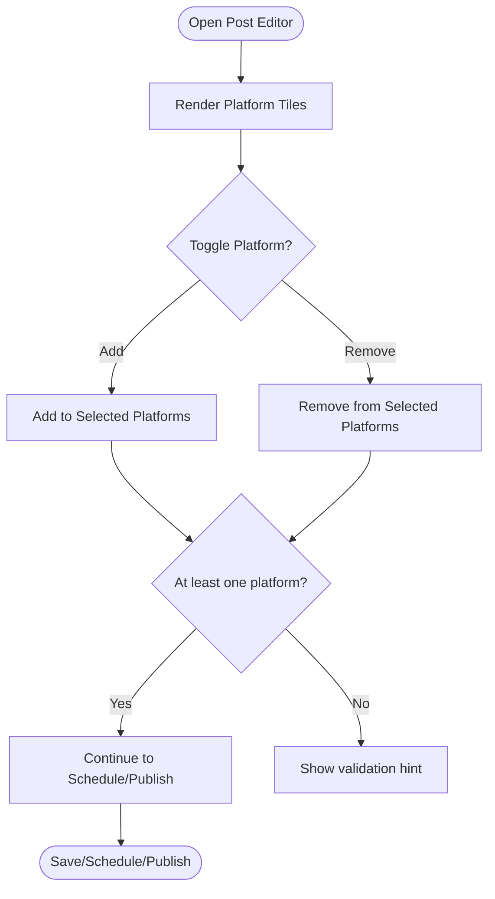
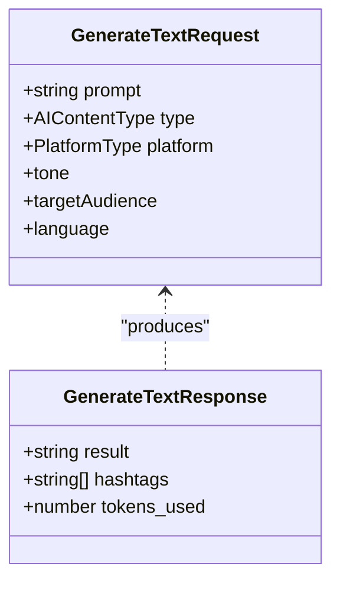
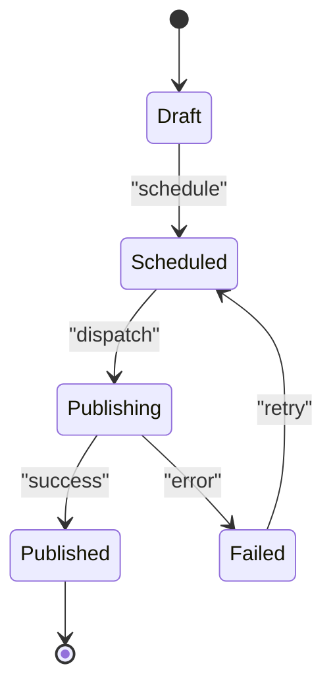
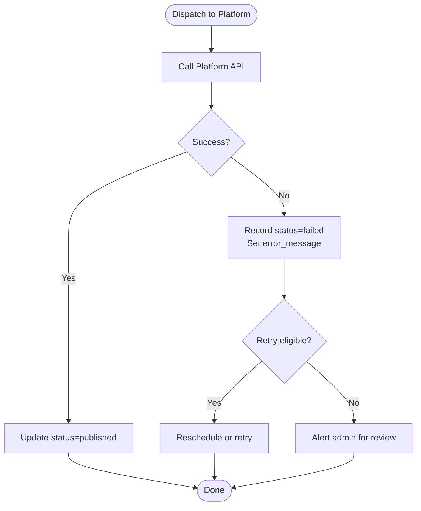
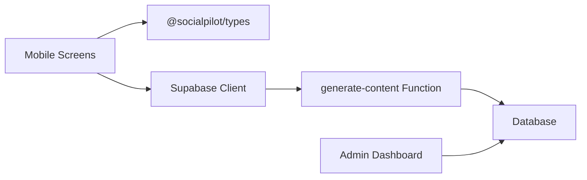

# Multi-Platform Publishing

<cite>
**Referenced Files in This Document**
- [database.ts](file://packages/types/src/database.ts)
- [api.ts](file://packages/types/src/api.ts)
- [generate.tsx](file://apps/mobile/src/app/(tabs)/generate.tsx)
- [post detail screen](file://apps/mobile/src/app/post/[id].tsx)
- [posts moderation page](file://apps/admin/src/app/(dashboard)/posts/page.tsx)
- [generate-content function](file://supabase/functions/generate-content/index.ts)
</cite>

## Table of Contents
1. [Introduction](#introduction)
2. [Project Structure](#project-structure)
3. [Core Components](#core-components)
4. [Architecture Overview](#architecture-overview)
5. [Detailed Component Analysis](#detailed-component-analysis)
6. [Dependency Analysis](#dependency-analysis)
7. [Performance Considerations](#performance-considerations)
8. [Troubleshooting Guide](#troubleshooting-guide)
9. [Conclusion](#conclusion)
10. [Appendices](#appendices)

## Introduction
This document explains the multi-platform publishing system implemented across the mobile app and admin dashboard. It covers supported platforms, platform selection interfaces, content adaptation for each platform, scheduling and queue management, error handling, and operational considerations such as rate limiting and retries. The system supports Instagram, Twitter/X, LinkedIn, Facebook, TikTok, and Threads at the type level, with UI flows to select targets, schedule posts, and publish immediately or later.

## Project Structure
The publishing system spans:
- Mobile app screens for creating, editing, and scheduling posts
- Admin dashboard for monitoring post status and moderation
- Shared types that define platforms, post lifecycle states, and API contracts
- Serverless functions for AI content generation used during creation

**Diagram sources**
- [generate.tsx:123-149](file://apps/mobile/src/app/(tabs)/generate.tsx#L123-L149)
- [post detail screen:71-89](file://apps/mobile/src/app/post/[id].tsx#L71-L89)
- [posts moderation page:13-29](file://apps/admin/src/app/(dashboard)/posts/page.tsx#L13-L29)
- [generate-content function:14-98](file://supabase/functions/generate-content/index.ts#L14-L98)

**Section sources**
- [generate.tsx:44-57](file://apps/mobile/src/app/(tabs)/generate.tsx#L44-L57)
- [post detail screen:35-41](file://apps/mobile/src/app/post/[id].tsx#L35-L41)
- [posts moderation page:46-73](file://apps/admin/src/app/(dashboard)/posts/page.tsx#L46-L73)
- [database.ts:1-20](file://packages/types/src/database.ts#L1-L20)

## Core Components
- Platform model and post lifecycle:
  - Platforms are defined as a union type including Instagram, Twitter/X, LinkedIn, Facebook, TikTok, and Threads.
  - Post statuses include draft, scheduled, publishing, published, and failed, enabling queue visibility and state transitions.
- Content generation:
  - A serverless function generates copy tailored to platform, tone, and content type, then decrements user credits and returns results.
- Mobile creation flow:
  - Users choose target platforms, generate or edit content, attach media, and either save to schedule or publish now.
- Admin monitoring:
  - Admins view all posts, their statuses, and associated platforms, and can delete entries.

**Section sources**
- [database.ts:1-20](file://packages/types/src/database.ts#L1-L20)
- [generate-content function:29-98](file://supabase/functions/generate-content/index.ts#L29-L98)
- [generate.tsx:123-149](file://apps/mobile/src/app/(tabs)/generate.tsx#L123-L149)
- [post detail screen:71-89](file://apps/mobile/src/app/post/[id].tsx#L71-L89)
- [posts moderation page:13-29](file://apps/admin/src/app/(dashboard)/posts/page.tsx#L13-L29)

## Architecture Overview
The publishing pipeline integrates UI-driven authoring, AI-assisted content generation, scheduling, and cross-platform dispatch.

**Diagram sources**
- [generate.tsx:123-149](file://apps/mobile/src/app/(tabs)/generate.tsx#L123-L149)
- [generate-content function:38-98](file://supabase/functions/generate-content/index.ts#L38-L98)
- [database.ts:5-20](file://packages/types/src/database.ts#L5-L20)
- [post detail screen:71-89](file://apps/mobile/src/app/post/[id].tsx#L71-L89)

## Detailed Component Analysis

### Platform Selection Interface
- Mobile screens expose a horizontal carousel of platform tiles for quick selection.
- The post detail screen allows toggling multiple platforms and shows a “Target Publishing Channels” section.
- Types enforce the allowed platform set, ensuring consistency across UI and backend.

**Diagram sources**
- [generate.tsx:224-269](file://apps/mobile/src/app/(tabs)/generate.tsx#L224-L269)
- [post detail screen:160-198](file://apps/mobile/src/app/post/[id].tsx#L160-L198)
- [database.ts:1](file://packages/types/src/database.ts#L1)

**Section sources**
- [generate.tsx:44-57](file://apps/mobile/src/app/(tabs)/generate.tsx#L44-L57)
- [post detail screen:35-41](file://apps/mobile/src/app/post/[id].tsx#L35-L41)
- [database.ts:1](file://packages/types/src/database.ts#L1)

### Content Adaptation per Platform
- Generation parameters include platform, content type, and tone, which guide the AI to tailor output.
- Templates and presets in the mobile app suggest platform-specific prompts (e.g., threads for Twitter, carousels for LinkedIn).
- The generated response includes hashtags relevant to the chosen platform.

**Diagram sources**
- [api.ts:3-16](file://packages/types/src/api.ts#L3-L16)

**Section sources**
- [generate.tsx:52-92](file://apps/mobile/src/app/(tabs)/generate.tsx#L52-L92)
- [generate-content function:29-80](file://supabase/functions/generate-content/index.ts#L29-L80)
- [api.ts:3-16](file://packages/types/src/api.ts#L3-L16)

### Scheduling and Publishing Queue Management
- Posts carry a status field that reflects their position in the queue: draft, scheduled, publishing, published, failed.
- The mobile editor provides “Save Draft Changes,” “Schedule Post,” and “Publish Now” actions.
- The admin dashboard displays current statuses and platform tags for each post.

**Diagram sources**
- [database.ts:1-20](file://packages/types/src/database.ts#L1-L20)
- [post detail screen:71-89](file://apps/mobile/src/app/post/[id].tsx#L71-L89)
- [posts moderation page:46-73](file://apps/admin/src/app/(dashboard)/posts/page.tsx#L46-L73)

**Section sources**
- [database.ts:1-20](file://packages/types/src/database.ts#L1-L20)
- [post detail screen:71-89](file://apps/mobile/src/app/post/[id].tsx#L71-L89)
- [posts moderation page:46-73](file://apps/admin/src/app/(dashboard)/posts/page.tsx#L46-L73)

### Error Handling for Platform-Specific Failures
- The Post model includes an error_message field to capture platform-specific failures.
- The admin interface renders a “Failed” badge when status is failed, aiding triage.
- The generate-content function returns structured errors and decrements credits only on success paths.

**Diagram sources**
- [database.ts:5-20](file://packages/types/src/database.ts#L5-L20)
- [posts moderation page:46-73](file://apps/admin/src/app/(dashboard)/posts/page.tsx#L46-L73)
- [generate-content function:92-98](file://supabase/functions/generate-content/index.ts#L92-L98)

**Section sources**
- [database.ts:5-20](file://packages/types/src/database.ts#L5-L20)
- [posts moderation page:46-73](file://apps/admin/src/app/(dashboard)/posts/page.tsx#L46-L73)
- [generate-content function:92-98](file://supabase/functions/generate-content/index.ts#L92-L98)

### Rate Limiting and Retry Strategies
- The system should implement exponential backoff and jitter when encountering platform rate limits or transient errors.
- Use the Post status and error_message fields to track throttling events and decide retry windows.
- For high-volume campaigns, stagger dispatches across platforms and time slots to avoid bursts.

[No sources needed since this section provides general guidance]

### Cross-Platform Content Optimization and Hashtag Strategy
- Use platform-aware prompts and templates to tailor hooks, structure, and CTAs.
- Include platform-relevant hashtags in generated responses; adjust density based on platform norms.
- For visual-first platforms, pair optimized captions with appropriate aspect ratios and styles.

**Section sources**
- [generate.tsx:52-92](file://apps/mobile/src/app/(tabs)/generate.tsx#L52-L92)
- [generate-content function:52-80](file://supabase/functions/generate-content/index.ts#L52-L80)
- [api.ts:3-16](file://packages/types/src/api.ts#L3-L16)

## Dependency Analysis
- Mobile screens depend on shared types for platform enums and post models.
- The generate-content function depends on database configuration and external AI provider keys.
- Admin dashboard depends on database queries to render post lists and statuses.

**Diagram sources**
- [generate.tsx:19-20](file://apps/mobile/src/app/(tabs)/generate.tsx#L19-L20)
- [post detail screen:19](file://apps/mobile/src/app/post/[id].tsx#L19)
- [generate-content function:15-19](file://supabase/functions/generate-content/index.ts#L15-L19)
- [posts moderation page:4-5](file://apps/admin/src/app/(dashboard)/posts/page.tsx#L4-L5)

**Section sources**
- [generate.tsx:19-20](file://apps/mobile/src/app/(tabs)/generate.tsx#L19-L20)
- [post detail screen:19](file://apps/mobile/src/app/post/[id].tsx#L19)
- [generate-content function:15-19](file://supabase/functions/generate-content/index.ts#L15-L19)
- [posts moderation page:4-5](file://apps/admin/src/app/(dashboard)/posts/page.tsx#L4-L5)

## Performance Considerations
- Debounce repeated generation calls and cache frequent prompts/templates to reduce API costs.
- Batch updates to post status where possible to minimize database writes.
- Use background jobs for dispatching to platforms to keep UI responsive.

[No sources needed since this section provides general guidance]

## Troubleshooting Guide
- If a post remains in failed status, inspect error_message for platform-specific diagnostics.
- Verify AI configuration and API keys in the environment to ensure successful generation.
- Confirm that scheduled times are valid and that the queue processor is running.

**Section sources**
- [database.ts:5-20](file://packages/types/src/database.ts#L5-L20)
- [generate-content function:38-98](file://supabase/functions/generate-content/index.ts#L38-L98)
- [posts moderation page:46-73](file://apps/admin/src/app/(dashboard)/posts/page.tsx#L46-L73)

## Conclusion
The multi-platform publishing system provides a robust foundation for creating, adapting, scheduling, and dispatching content across Instagram, Twitter/X, LinkedIn, Facebook, TikTok, and Threads. With clear status tracking, platform selection, and AI-assisted content generation, teams can streamline cross-platform workflows while maintaining visibility into failures and performance.

[No sources needed since this section summarizes without analyzing specific files]

## Appendices

### Supported Platforms and Type Definitions
- Platforms: instagram, twitter, linkedin, facebook, tiktok, threads
- Post statuses: draft, scheduled, publishing, published, failed

**Section sources**
- [database.ts:1-20](file://packages/types/src/database.ts#L1-L20)

### API Contracts for Content Generation
- Request fields: prompt, type, platform, tone, target audience, language
- Response fields: result, optional hashtags, tokens used

**Section sources**
- [api.ts:3-16](file://packages/types/src/api.ts#L3-L16)