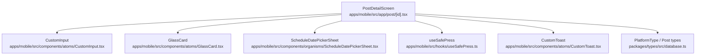
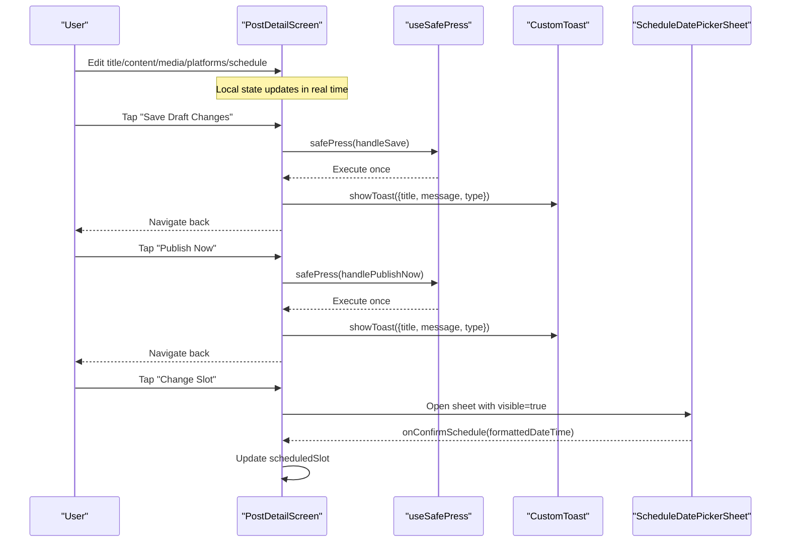
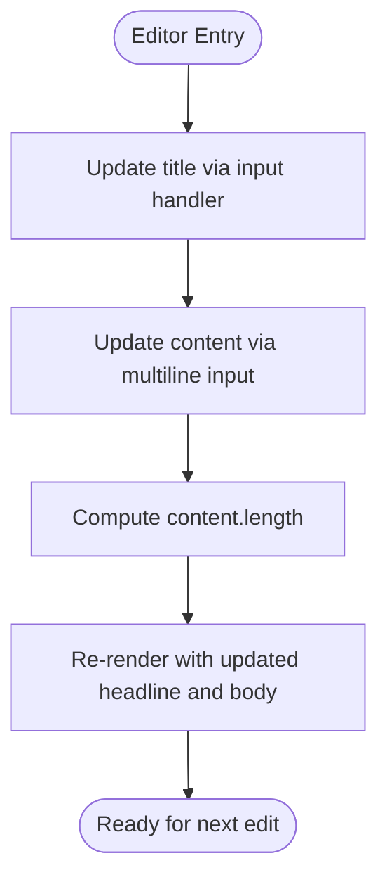
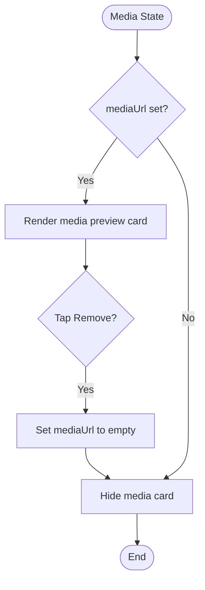
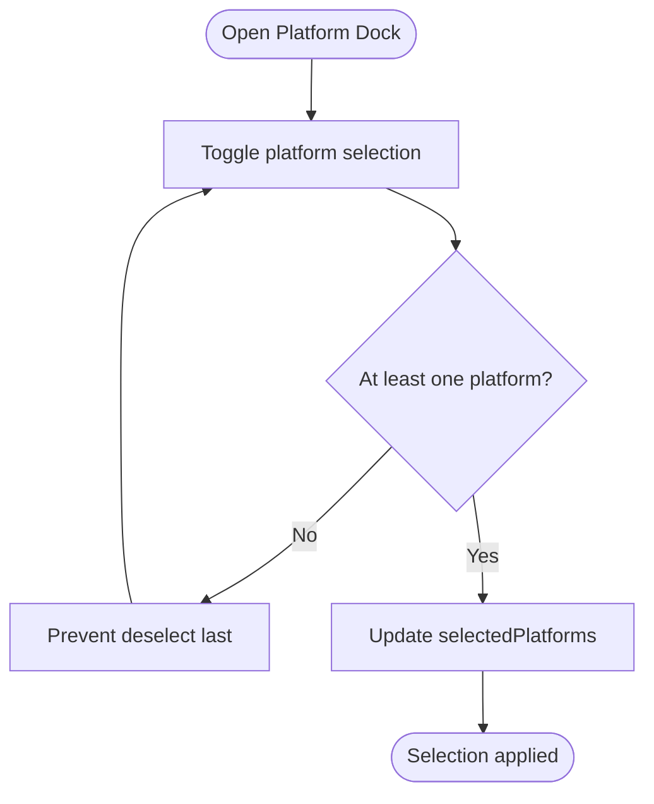
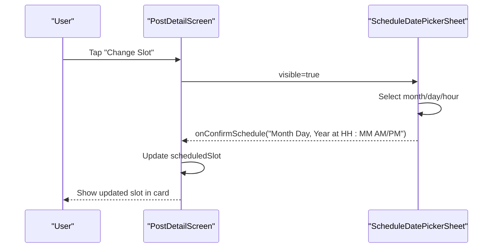
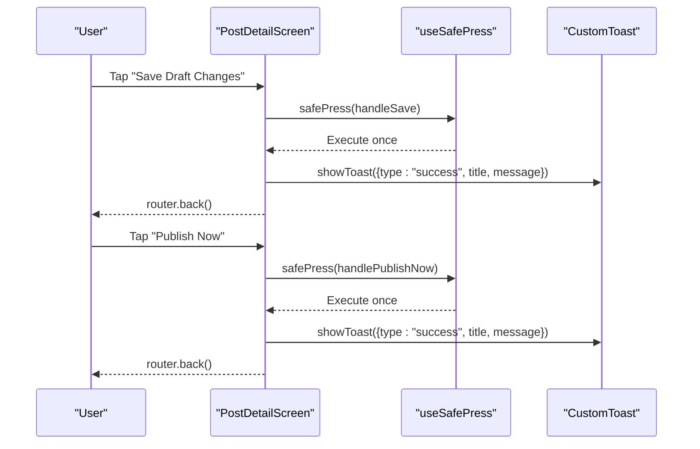
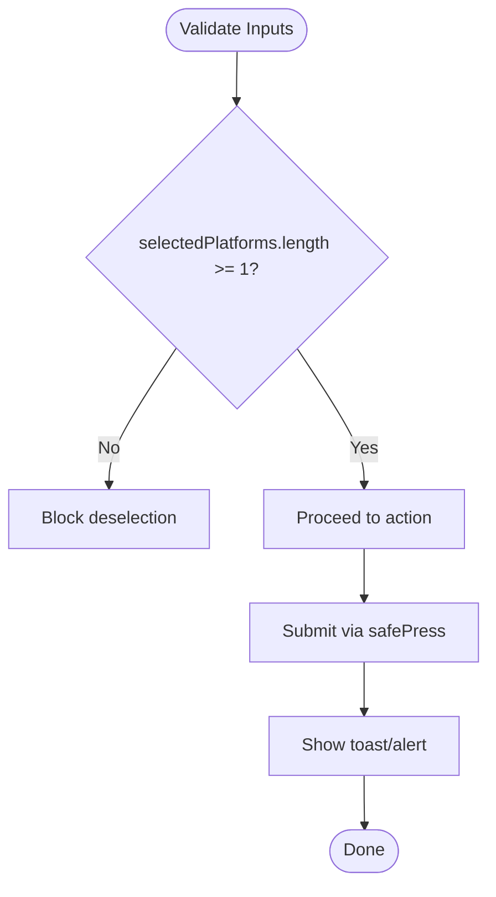
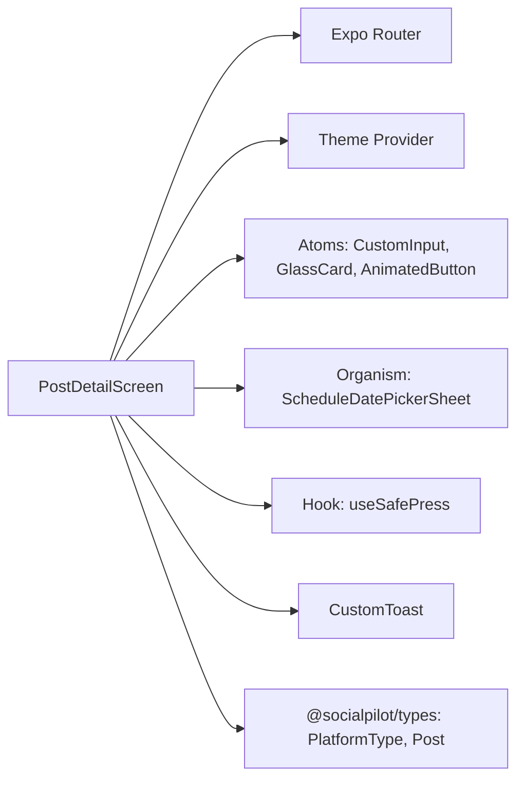

# Post Creation & Editing

<cite>
**Referenced Files in This Document**
- [PostDetailScreen](file://apps/mobile/src/app/post/[id].tsx)
- [CustomInput](file://apps/mobile/src/components/atoms/CustomInput.tsx)
- [GlassCard](file://apps/mobile/src/components/atoms/GlassCard.tsx)
- [ScheduleDatePickerSheet](file://apps/mobile/src/components/organisms/ScheduleDatePickerSheet.tsx)
- [useSafePress](file://apps/mobile/src/hooks/useSafePress.ts)
- [CustomToast](file://apps/mobile/src/components/atoms/CustomToast.tsx)
- [PlatformType and Post types](file://packages/types/src/database.ts)
</cite>

## Table of Contents
1. Introduction
2. Project Structure
3. Core Components
4. Architecture Overview
5. Detailed Component Analysis
6. Dependency Analysis
7. Performance Considerations
8. Troubleshooting Guide
9. Conclusion

## Introduction
This document explains the post creation and editing experience implemented in the mobile app’s PostDetailScreen. It covers title editing, content composition with character counting, media attachment handling, platform selection, scheduling, dual action buttons for saving drafts and publishing immediately, validation patterns, real-time preview behavior, error handling, and user feedback mechanisms. It also includes examples of content formatting, hashtag integration, and multi-platform targeting workflows.

## Project Structure
The post editing flow is centered around a single screen component that composes reusable UI primitives:
- A screen wrapper and navigation controls
- A schedule slot card with an interactive date/time picker sheet
- A horizontal platform selector for multi-channel targeting
- A media attachment preview with remove capability
- An editor canvas with headline input and a multiline copy area with live character count
- Dual action buttons (Save Draft and Publish Now)
- Toast notifications for success/info/error feedback

**Diagram sources**
- [PostDetailScreen:1-466](file://apps/mobile/src/app/post/[id].tsx#L1-L466)
- [CustomInput:1-165](file://apps/mobile/src/components/atoms/CustomInput.tsx#L1-L165)
- [GlassCard:1-80](file://apps/mobile/src/components/atoms/GlassCard.tsx#L1-L80)
- [ScheduleDatePickerSheet:1-374](file://apps/mobile/src/components/organisms/ScheduleDatePickerSheet.tsx#L1-L374)
- [useSafePress:1-34](file://apps/mobile/src/hooks/useSafePress.ts#L1-L34)
- [CustomToast:1-198](file://apps/mobile/src/components/atoms/CustomToast.tsx#L1-L198)
- [PlatformType and Post types:1-72](file://packages/types/src/database.ts#L1-L72)

**Section sources**
- [PostDetailScreen:1-466](file://apps/mobile/src/app/post/[id].tsx#L1-L466)

## Core Components
- PostDetailScreen: Orchestrates state for title, content, selected platforms, scheduled slot, media URL, and loading flags; renders sections for schedule, platforms, media, editor, and actions; handles save/publish/delete flows and shows toasts.
- CustomInput: Reusable text input with label, focus animation, optional password toggle, and error display. Used for the headline field.
- GlassCard: Animated pressable container with glassmorphism styling and elevation option. Used across cards.
- ScheduleDatePickerSheet: Modal sheet for selecting date and time slots; returns a formatted string used as the scheduled slot.
- useSafePress: Hook to prevent rapid double/triple taps and protect async operations.
- CustomToast: Global toast provider and hook for displaying success/info/error messages.
- Types: PlatformType and Post model define supported platforms and post fields including hashtags and media URLs.

**Section sources**
- [PostDetailScreen:43-103](file://apps/mobile/src/app/post/[id].tsx#L43-L103)
- [CustomInput:12-115](file://apps/mobile/src/components/atoms/CustomInput.tsx#L12-L115)
- [GlassCard:7-62](file://apps/mobile/src/components/atoms/GlassCard.tsx#L7-L62)
- [ScheduleDatePickerSheet:14-66](file://apps/mobile/src/components/organisms/ScheduleDatePickerSheet.tsx#L14-L66)
- [useSafePress:9-33](file://apps/mobile/src/hooks/useSafePress.ts#L9-L33)
- [CustomToast:16-152](file://apps/mobile/src/components/atoms/CustomToast.tsx#L16-L152)
- [PlatformType and Post types:3-22](file://packages/types/src/database.ts#L3-L22)

## Architecture Overview
The screen manages local state and composes UI components to provide a rich editing experience. Actions are protected by safe press logic and surface feedback via toasts. Scheduling integrates with a dedicated date/time picker sheet. Platform selection supports multiple channels using a shared type.

**Diagram sources**
- [PostDetailScreen:61-103](file://apps/mobile/src/app/post/[id].tsx#L61-L103)
- [PostDetailScreen:143-158](file://apps/mobile/src/app/post/[id].tsx#L143-L158)
- [PostDetailScreen:250-276](file://apps/mobile/src/app/post/[id].tsx#L250-L276)
- [useSafePress:9-33](file://apps/mobile/src/hooks/useSafePress.ts#L9-L33)
- [CustomToast:53-80](file://apps/mobile/src/components/atoms/CustomToast.tsx#L53-L80)
- [ScheduleDatePickerSheet:62-66](file://apps/mobile/src/components/organisms/ScheduleDatePickerSheet.tsx#L62-L66)

## Detailed Component Analysis

### Title Editing and Content Composition
- Title editing uses a labeled input bound to local state. The input provides focus animations and optional error messaging.
- Content composition uses a multiline text input with a live character counter displayed above it. Hashtags can be included directly in the content string.
- Real-time preview is achieved through immediate state updates on change events, reflecting edits instantly in the UI.

**Diagram sources**
- [PostDetailScreen:222-248](file://apps/mobile/src/app/post/[id].tsx#L222-L248)
- [CustomInput:20-115](file://apps/mobile/src/components/atoms/CustomInput.tsx#L20-L115)

**Section sources**
- [PostDetailScreen:50-53](file://apps/mobile/src/app/post/[id].tsx#L50-L53)
- [PostDetailScreen:222-248](file://apps/mobile/src/app/post/[id].tsx#L222-L248)
- [CustomInput:20-115](file://apps/mobile/src/components/atoms/CustomInput.tsx#L20-L115)

### Media Attachment Handling
- Media is represented by a URL stored in local state. When present, a preview card displays the image with a remove action that clears the URL.
- The media section is conditionally rendered based on whether a URL exists.

**Diagram sources**
- [PostDetailScreen:56-56](file://apps/mobile/src/app/post/[id].tsx#L56-L56)
- [PostDetailScreen:200-220](file://apps/mobile/src/app/post/[id].tsx#L200-L220)

**Section sources**
- [PostDetailScreen:200-220](file://apps/mobile/src/app/post/[id].tsx#L200-L220)

### Platform Selection and Multi-Platform Targeting
- Platforms are defined with identifiers and icons. Users can select one or more platforms from a horizontal list.
- Selection toggles add/remove platforms while enforcing a minimum of one selected platform.
- The selected array drives publish/distribution behavior downstream.

**Diagram sources**
- [PostDetailScreen:35-41](file://apps/mobile/src/app/post/[id].tsx#L35-L41)
- [PostDetailScreen:61-69](file://apps/mobile/src/app/post/[id].tsx#L61-L69)
- [PostDetailScreen:160-198](file://apps/mobile/src/app/post/[id].tsx#L160-L198)
- [PlatformType and Post types:3-3](file://packages/types/src/database.ts#L3-L3)

**Section sources**
- [PostDetailScreen:35-41](file://apps/mobile/src/app/post/[id].tsx#L35-L41)
- [PostDetailScreen:61-69](file://apps/mobile/src/app/post/[id].tsx#L61-L69)
- [PostDetailScreen:160-198](file://apps/mobile/src/app/post/[id].tsx#L160-L198)
- [PlatformType and Post types:3-3](file://packages/types/src/database.ts#L3-L3)

### Scheduling Workflow
- The schedule slot is shown in a card and can be changed via a modal sheet.
- The sheet allows picking a day within the current month and choosing from predefined hours, then confirms a formatted date-time string.
- The parent screen updates its scheduled slot state upon confirmation.

**Diagram sources**
- [PostDetailScreen:131-158](file://apps/mobile/src/app/post/[id].tsx#L131-L158)
- [ScheduleDatePickerSheet:62-66](file://apps/mobile/src/components/organisms/ScheduleDatePickerSheet.tsx#L62-L66)

**Section sources**
- [PostDetailScreen:131-158](file://apps/mobile/src/app/post/[id].tsx#L131-L158)
- [ScheduleDatePickerSheet:62-66](file://apps/mobile/src/components/organisms/ScheduleDatePickerSheet.tsx#L62-L66)

### Dual Action Buttons: Save Draft and Publish Now
- Save Draft: Simulates saving and shows a success toast, then navigates back.
- Publish Now: Simulates publishing and shows a success toast indicating how many channels were targeted, then navigates back.
- Both actions are wrapped in safe press to avoid duplicate submissions.

**Diagram sources**
- [PostDetailScreen:71-89](file://apps/mobile/src/app/post/[id].tsx#L71-L89)
- [PostDetailScreen:250-269](file://apps/mobile/src/app/post/[id].tsx#L250-L269)
- [useSafePress:9-33](file://apps/mobile/src/hooks/useSafePress.ts#L9-L33)
- [CustomToast:53-80](file://apps/mobile/src/components/atoms/CustomToast.tsx#L53-L80)

**Section sources**
- [PostDetailScreen:71-89](file://apps/mobile/src/app/post/[id].tsx#L71-L89)
- [PostDetailScreen:250-269](file://apps/mobile/src/app/post/[id].tsx#L250-L269)
- [useSafePress:9-33](file://apps/mobile/src/hooks/useSafePress.ts#L9-L33)
- [CustomToast:53-80](file://apps/mobile/src/components/atoms/CustomToast.tsx#L53-L80)

### Validation Rules and Error Handling Patterns
- Minimum platform selection: At least one platform must remain selected when toggling.
- Safe submission: useSafePress prevents rapid re-submissions during ongoing operations.
- User feedback: Success and info toasts are shown after actions; destructive delete uses a confirmation alert before proceeding.
- Input errors: CustomInput supports an error prop to display inline validation messages when needed.

**Diagram sources**
- [PostDetailScreen:61-69](file://apps/mobile/src/app/post/[id].tsx#L61-L69)
- [PostDetailScreen:91-103](file://apps/mobile/src/app/post/[id].tsx#L91-L103)
- [useSafePress:9-33](file://apps/mobile/src/hooks/useSafePress.ts#L9-L33)
- [CustomInput:12-115](file://apps/mobile/src/components/atoms/CustomInput.tsx#L12-L115)

**Section sources**
- [PostDetailScreen:61-69](file://apps/mobile/src/app/post/[id].tsx#L61-L69)
- [PostDetailScreen:91-103](file://apps/mobile/src/app/post/[id].tsx#L91-L103)
- [useSafePress:9-33](file://apps/mobile/src/hooks/useSafePress.ts#L9-L33)
- [CustomInput:12-115](file://apps/mobile/src/components/atoms/CustomInput.tsx#L12-L115)

### Real-Time Preview Capabilities
- Character count updates live as the user types in the content area.
- Title and content changes are reflected immediately due to React state updates.
- Media preview updates instantly when a URL is set or removed.

**Section sources**
- [PostDetailScreen:222-248](file://apps/mobile/src/app/post/[id].tsx#L222-L248)
- [PostDetailScreen:200-220](file://apps/mobile/src/app/post/[id].tsx#L200-L220)

### Examples: Content Formatting, Hashtag Integration, and Multi-Platform Workflows
- Content formatting: Use line breaks to structure paragraphs; include headings and key takeaways.
- Hashtag integration: Append hashtags directly in the content string; they will be part of the published copy.
- Multi-platform targeting: Select multiple platforms (e.g., Instagram and LinkedIn) to distribute the same post across channels.

[No sources needed since this section provides conceptual examples grounded in existing behaviors]

## Dependency Analysis
The PostDetailScreen depends on several internal modules and shared types:
- Navigation and routing via Expo Router
- Theme context for consistent styling
- Reusable atoms (inputs, buttons, cards)
- Organism for scheduling
- Hook for safe interactions
- Toast system for feedback
- Shared types for platform and post models

**Diagram sources**
- [PostDetailScreen:1-19](file://apps/mobile/src/app/post/[id].tsx#L1-L19)
- [CustomInput:1-10](file://apps/mobile/src/components/atoms/CustomInput.tsx#L1-L10)
- [GlassCard:1-5](file://apps/mobile/src/components/atoms/GlassCard.tsx#L1-L5)
- [ScheduleDatePickerSheet:1-5](file://apps/mobile/src/components/organisms/ScheduleDatePickerSheet.tsx#L1-L5)
- [useSafePress:1-3](file://apps/mobile/src/hooks/useSafePress.ts#L1-L3)
- [CustomToast:1-12](file://apps/mobile/src/components/atoms/CustomToast.tsx#L1-L12)
- [PlatformType and Post types:1-3](file://packages/types/src/database.ts#L1-L3)

**Section sources**
- [PostDetailScreen:1-19](file://apps/mobile/src/app/post/[id].tsx#L1-L19)

## Performance Considerations
- Local state updates ensure instant UI feedback without network calls during editing.
- Safe press reduces redundant API triggers and improves perceived performance.
- Conditional rendering of media previews avoids unnecessary layout work when no media is attached.
- Using memoized components (e.g., GlassCard) helps minimize re-renders where applicable.

[No sources needed since this section provides general guidance]

## Troubleshooting Guide
- Duplicate submissions: If actions appear to run multiple times, verify useSafePress is wrapping handlers and that loading states are correctly set.
- No platform selected: Ensure at least one platform remains selected; the toggle logic prevents deselecting the last item.
- Toast not showing: Confirm the app has a ToastProvider in place so useToast is available.
- Delete confirmation: If deletion does not proceed, check that the confirm dialog is not being dismissed accidentally.

**Section sources**
- [useSafePress:9-33](file://apps/mobile/src/hooks/useSafePress.ts#L9-L33)
- [PostDetailScreen:61-69](file://apps/mobile/src/app/post/[id].tsx#L61-L69)
- [PostDetailScreen:91-103](file://apps/mobile/src/app/post/[id].tsx#L91-L103)
- [CustomToast:146-152](file://apps/mobile/src/components/atoms/CustomToast.tsx#L146-L152)

## Conclusion
The PostDetailScreen delivers a complete post editing experience with robust state management, real-time previews, multi-platform targeting, scheduling, and clear user feedback. It leverages reusable components and hooks to maintain consistency, safety, and performance. Future enhancements can include richer content formatting, advanced validation rules, and backend integrations for persistence and publishing.