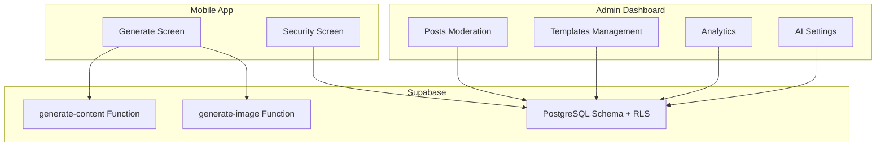
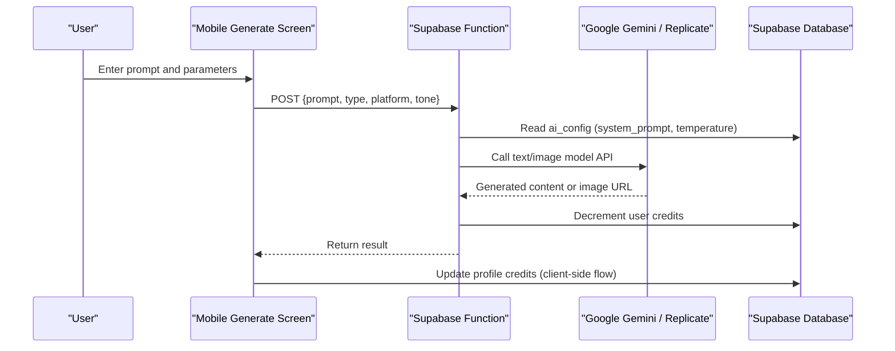
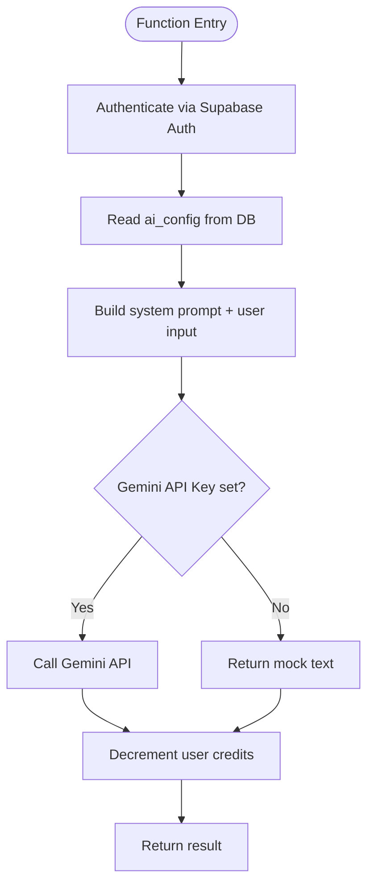
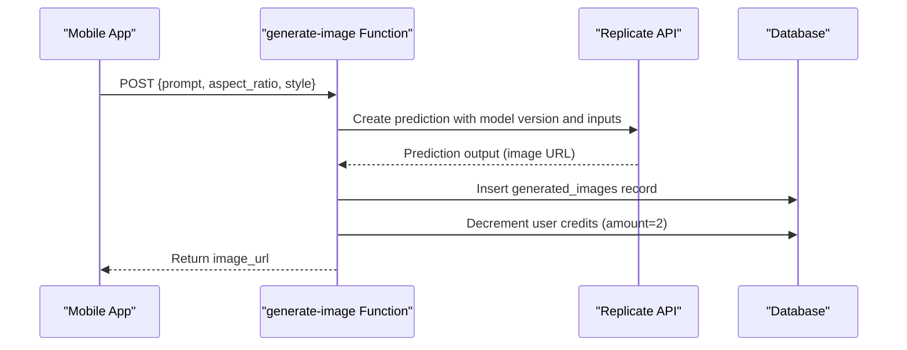
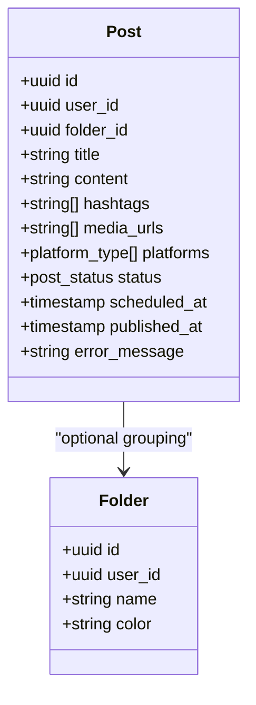
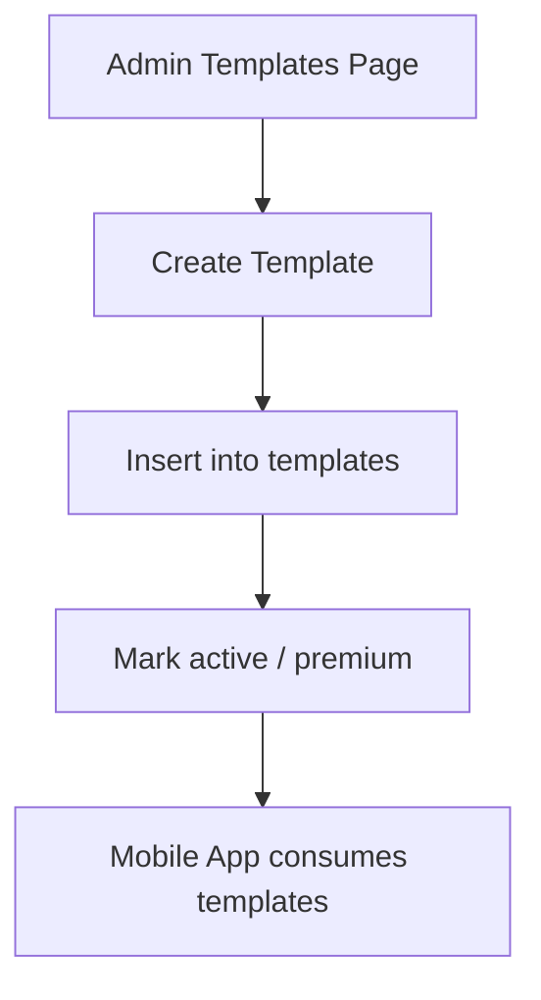
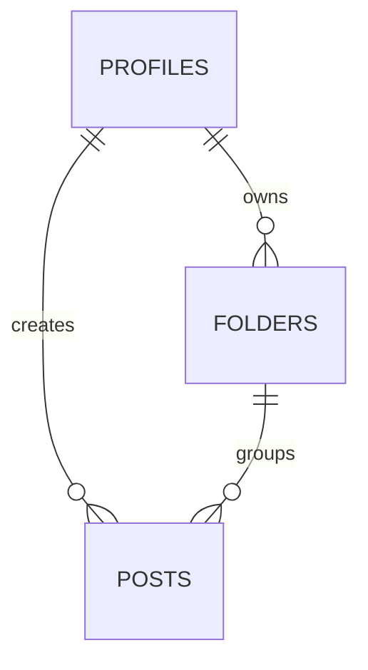
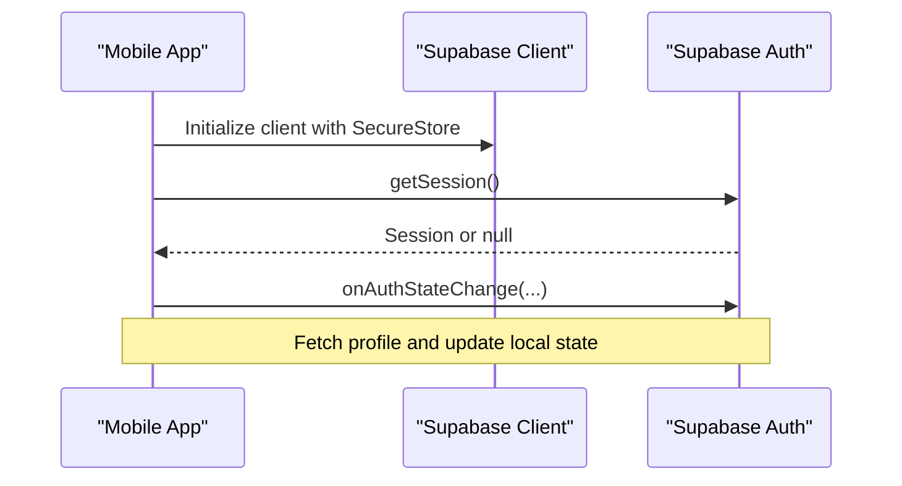
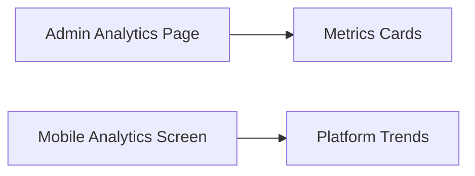
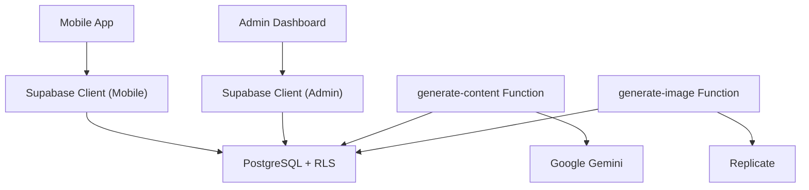

# Core Features

<cite>
**Referenced Files in This Document**
- [README.md](file://README.md)
- [generate-content/index.ts](file://supabase/functions/generate-content/index.ts)
- [generate-image/index.ts](file://supabase/functions/generate-image/index.ts)
- [initial_schema.sql](file://supabase/migrations/20240001000000_initial_schema.sql)
- [admin posts page](file://apps/admin/src/app/(dashboard)/posts/page.tsx)
- [admin templates page](file://apps/admin/src/app/(dashboard)/templates/page.tsx)
- [admin analytics page](file://apps/admin/src/app/(dashboard)/analytics/page.tsx)
- [mobile generate screen](file://apps/mobile/src/app/(tabs)/generate.tsx)
- [mobile security screen](file://apps/mobile/src/app/security.tsx)
- [admin supabase client](file://apps/admin/src/lib/supabase.ts)
- [mobile supabase client](file://apps/mobile/src/services/supabase.ts)
- [mobile auth store](file://apps/mobile/src/store/useAuthStore.ts)
</cite>

## Table of Contents
1. Introduction
2. Project Structure
3. Core Components
4. Architecture Overview
5. Detailed Component Analysis
6. Dependency Analysis
7. Performance Considerations
8. Troubleshooting Guide
9. Conclusion

## Introduction
SocialPilot AI Pro is an AI-powered social media management suite that enables users to generate text and images with AI, manage content across multiple platforms, organize assets with folders and templates, track usage via credits, and analyze performance. It provides a mobile app for creators and an admin dashboard for moderation, configuration, and analytics.

## Project Structure
The repository is organized as a monorepo:
- apps/admin: Next.js admin dashboard for moderation, templates, analytics, and AI settings.
- apps/mobile: Expo-based mobile app for content generation, scheduling, and user account features.
- packages/types: Shared TypeScript types used by both apps.
- supabase: Serverless functions for AI generation and database schema with Row-Level Security policies.



**Diagram sources**
- [mobile generate screen](file://apps/mobile/src/app/(tabs)/generate.tsx)
- [mobile security screen](file://apps/mobile/src/app/security.tsx)
- [admin posts page](file://apps/admin/src/app/(dashboard)/posts/page.tsx)
- [admin templates page](file://apps/admin/src/app/(dashboard)/templates/page.tsx)
- [admin analytics page](file://apps/admin/src/app/(dashboard)/analytics/page.tsx)
- [generate-content/index.ts](file://supabase/functions/generate-content/index.ts)
- [generate-image/index.ts](file://supabase/functions/generate-image/index.ts)
- [initial_schema.sql](file://supabase/migrations/20240001000000_initial_schema.sql)

**Section sources**
- [README.md:1-4](file://README.md#L1-L4)

## Core Components
- AI Text Generation: Supabase Edge Function calls Google Gemini (with fallback behavior) and decrements user credits.
- AI Image Generation: Supabase Edge Function calls Replicate (SDXL/Flux), stores generated image metadata, and deducts credits.
- Content Management: Posts table supports multi-platform scheduling and status tracking; Admin UI moderates posts.
- Templates: Reusable prompt templates curated by admins and consumed by the mobile app.
- Folders: User-scoped organization for content.
- Credits & Monetization: Per-user credit counters and daily analytics metrics; subscription UI exists in admin.
- Authentication & Authorization: Supabase Auth with secure session storage on mobile; Row-Level Security enforces data isolation.
- Analytics: Admin and mobile dashboards display platform metrics and usage summaries.

**Section sources**
- [generate-content/index.ts:1-99](file://supabase/functions/generate-content/index.ts#L1-L99)
- [generate-image/index.ts:1-87](file://supabase/functions/generate-image/index.ts#L1-L87)
- [initial_schema.sql:31-132](file://supabase/migrations/20240001000000_initial_schema.sql#L31-L132)
- [admin posts page](file://apps/admin/src/app/(dashboard)/posts/page.tsx#L1-L137)
- [admin templates page](file://apps/admin/src/app/(dashboard)/templates/page.tsx#L1-L249)
- [mobile generate screen](file://apps/mobile/src/app/(tabs)/generate.tsx#L1-L771)
- [mobile security screen:1-204](file://apps/mobile/src/app/security.tsx#L1-L204)

## Architecture Overview
The system uses Supabase as the backend:
- Supabase Functions handle external AI API calls (Gemini, Replicate).
- PostgreSQL stores all entities with strict Row-Level Security policies.
- Mobile and Admin clients interact with Supabase via their respective SDK clients.



**Diagram sources**
- [mobile generate screen](file://apps/mobile/src/app/(tabs)/generate.tsx#L123-L170)
- [generate-content/index.ts:14-91](file://supabase/functions/generate-content/index.ts#L14-L91)
- [generate-image/index.ts:14-79](file://supabase/functions/generate-image/index.ts#L14-L79)
- [initial_schema.sql:31-58](file://supabase/migrations/20240001000000_initial_schema.sql#L31-L58)

## Detailed Component Analysis

### AI-Powered Text Generation (Google Gemini)
- The function authenticates via Supabase Auth, reads centralized AI config, constructs a system prompt, and calls Gemini. On missing keys, it returns a mock response. It then decrements user credits and returns the generated text.



**Diagram sources**
- [generate-content/index.ts:14-91](file://supabase/functions/generate-content/index.ts#L14-L91)
- [initial_schema.sql:31-42](file://supabase/migrations/20240001000000_initial_schema.sql#L31-L42)

**Section sources**
- [generate-content/index.ts:1-99](file://supabase/functions/generate-content/index.ts#L1-L99)

### AI-Powered Image Generation (Replicate API)
- The function validates input, optionally calls Replicate with SDXL/Flux model, stores the generated image metadata, and deducts two credits per image.



**Diagram sources**
- [generate-image/index.ts:14-79](file://supabase/functions/generate-image/index.ts#L14-L79)
- [initial_schema.sql:111-120](file://supabase/migrations/20240001000000_initial_schema.sql#L111-L120)

**Section sources**
- [generate-image/index.ts:1-87](file://supabase/functions/generate-image/index.ts#L1-L87)

### Content Management System (Posts, Scheduling, Moderation)
- Posts are stored with platform arrays, status transitions, and optional scheduling timestamps. The admin dashboard lists posts, shows status badges, and allows deletion.



**Diagram sources**
- [initial_schema.sql:71-96](file://supabase/migrations/20240001000000_initial_schema.sql#L71-L96)
- [admin posts page](file://apps/admin/src/app/(dashboard)/posts/page.tsx#L1-L137)

**Section sources**
- [initial_schema.sql:71-96](file://supabase/migrations/20240001000000_initial_schema.sql#L71-L96)
- [admin posts page](file://apps/admin/src/app/(dashboard)/posts/page.tsx#L1-L137)

### Template System
- Admins create reusable prompt templates with categories, suggested platforms, and premium flags. The mobile app includes curated presets and can consume templates.



**Diagram sources**
- [admin templates page](file://apps/admin/src/app/(dashboard)/templates/page.tsx#L43-L83)
- [initial_schema.sql:98-109](file://supabase/migrations/20240001000000_initial_schema.sql#L98-L109)
- [mobile generate screen](file://apps/mobile/src/app/(tabs)/generate.tsx#L70-L92)

**Section sources**
- [admin templates page](file://apps/admin/src/app/(dashboard)/templates/page.tsx#L1-L249)
- [initial_schema.sql:98-109](file://supabase/migrations/20240001000000_initial_schema.sql#L98-L109)
- [mobile generate screen](file://apps/mobile/src/app/(tabs)/generate.tsx#L70-L92)

### Folder Organization System
- Users can create folders to categorize content. Access is restricted to the owner via RLS.



**Diagram sources**
- [initial_schema.sql:44-96](file://supabase/migrations/20240001000000_initial_schema.sql#L44-L96)

**Section sources**
- [initial_schema.sql:71-78](file://supabase/migrations/20240001000000_initial_schema.sql#L71-L78)

### Credit-Based Usage Tracking and Monetization
- Each text generation costs one credit; image generation costs two credits. The mobile app updates remaining credits after generation. Subscription tiers exist in the schema and admin UI displays revenue metrics.

```mermaid
sequenceDiagram
participant M as "Mobile App"
participant D as "Database"
M->>D : Update profiles.credits_remaining -= 1 (text)
M->>D : Update profiles.credits_remaining -= 2 (image)
Note over M,D : Credits tracked per user; analytics aggregates usage
```

**Diagram sources**
- [mobile generate screen](file://apps/mobile/src/app/(tabs)/generate.tsx#L138-L144)
- [generate-content/index.ts:82-91](file://supabase/functions/generate-content/index.ts#L82-L91)
- [generate-image/index.ts:64-79](file://supabase/functions/generate-image/index.ts#L64-L79)
- [initial_schema.sql:44-58](file://supabase/migrations/20240001000000_initial_schema.sql#L44-L58)

**Section sources**
- [mobile generate screen](file://apps/mobile/src/app/(tabs)/generate.tsx#L123-L170)
- [generate-content/index.ts:82-91](file://supabase/functions/generate-content/index.ts#L82-L91)
- [generate-image/index.ts:64-79](file://supabase/functions/generate-image/index.ts#L64-L79)
- [initial_schema.sql:44-58](file://supabase/migrations/20240001000000_initial_schema.sql#L44-L58)

### Authentication and Authorization
- Mobile app initializes sessions securely using Expo SecureStore and listens for auth state changes. Admin and mobile clients use Supabase clients configured with environment variables. Row-Level Security ensures users can only access their own data unless they are admins.



**Diagram sources**
- [mobile supabase client:1-41](file://apps/mobile/src/services/supabase.ts#L1-L41)
- [mobile auth store:24-61](file://apps/mobile/src/store/useAuthStore.ts#L24-L61)
- [admin supabase client:1-14](file://apps/admin/src/lib/supabase.ts#L1-L14)
- [initial_schema.sql:156-202](file://supabase/migrations/20240001000000_initial_schema.sql#L156-L202)

**Section sources**
- [mobile supabase client:1-41](file://apps/mobile/src/services/supabase.ts#L1-L41)
- [mobile auth store:1-90](file://apps/mobile/src/store/useAuthStore.ts#L1-L90)
- [admin supabase client:1-14](file://apps/admin/src/lib/supabase.ts#L1-L14)
- [initial_schema.sql:156-202](file://supabase/migrations/20240001000000_initial_schema.sql#L156-L202)

### Analytics and Reporting
- Admin dashboard presents high-level metrics such as total generated posts, tokens consumed, scheduled queue size, and retention. Mobile analytics screen shows platform reach and growth trends.



**Diagram sources**
- [admin analytics page](file://apps/admin/src/app/(dashboard)/analytics/page.tsx#L1-L82)
- [initial_schema.sql:122-132](file://supabase/migrations/20240001000000_initial_schema.sql#L122-L132)

**Section sources**
- [admin analytics page](file://apps/admin/src/app/(dashboard)/analytics/page.tsx#L1-L82)
- [initial_schema.sql:122-132](file://supabase/migrations/20240001000000_initial_schema.sql#L122-L132)

## Dependency Analysis
- Mobile app depends on Supabase client and auth store for session management and profile fetching.
- Admin dashboard depends on Supabase client for CRUD operations on posts, templates, and AI settings.
- Supabase Functions depend on environment secrets for Gemini and Replicate APIs and call Supabase DB for config and credit updates.
- Database schema defines relationships among profiles, folders, posts, templates, generated images, and analytics.



**Diagram sources**
- [mobile supabase client:1-41](file://apps/mobile/src/services/supabase.ts#L1-L41)
- [admin supabase client:1-14](file://apps/admin/src/lib/supabase.ts#L1-L14)
- [generate-content/index.ts:14-91](file://supabase/functions/generate-content/index.ts#L14-L91)
- [generate-image/index.ts:14-79](file://supabase/functions/generate-image/index.ts#L14-L79)
- [initial_schema.sql:156-202](file://supabase/migrations/20240001000000_initial_schema.sql#L156-L202)

**Section sources**
- [mobile supabase client:1-41](file://apps/mobile/src/services/supabase.ts#L1-L41)
- [admin supabase client:1-14](file://apps/admin/src/lib/supabase.ts#L1-L14)
- [generate-content/index.ts:14-91](file://supabase/functions/generate-content/index.ts#L14-L91)
- [generate-image/index.ts:14-79](file://supabase/functions/generate-image/index.ts#L14-L79)
- [initial_schema.sql:156-202](file://supabase/migrations/20240001000000_initial_schema.sql#L156-L202)

## Performance Considerations
- Prefer server-side AI calls through Supabase Functions to centralize API key management and reduce client payload sizes.
- Use minimal token limits and appropriate temperature values to balance quality and cost.
- Cache frequently accessed templates and AI config in client state to avoid repeated reads.
- Batch updates where possible (e.g., updating credits once per generation session).
- Monitor analytics tables for usage spikes and adjust rate limits or quotas accordingly.

[No sources needed since this section provides general guidance]

## Troubleshooting Guide
- Unauthorized errors in functions: Ensure valid Authorization header is passed when calling Supabase Functions.
- Missing API keys: If Gemini or Replicate keys are not set, functions return mock responses; configure secrets in Supabase to enable real generation.
- Credit deduction failures: Verify the decrement_user_credits RPC exists and is callable by authenticated users.
- RLS policy violations: Confirm user roles and policies allow read/write access to specific tables.
- Mobile session issues: Check SecureStore persistence and ensure auto-refresh token is enabled.

**Section sources**
- [generate-content/index.ts:21-27](file://supabase/functions/generate-content/index.ts#L21-L27)
- [generate-image/index.ts:21-27](file://supabase/functions/generate-image/index.ts#L21-L27)
- [initial_schema.sql:156-202](file://supabase/migrations/20240001000000_initial_schema.sql#L156-L202)
- [mobile supabase client:33-40](file://apps/mobile/src/services/supabase.ts#L33-L40)

## Conclusion
SocialPilot AI Pro integrates AI-driven content creation with robust content management, organization, and analytics. Its architecture leverages Supabase for secure authentication, role-based access control, and scalable serverless functions to connect with external AI providers. The system balances usability for creators with administrative oversight for moderation and configuration.

[No sources needed since this section summarizes without analyzing specific files]