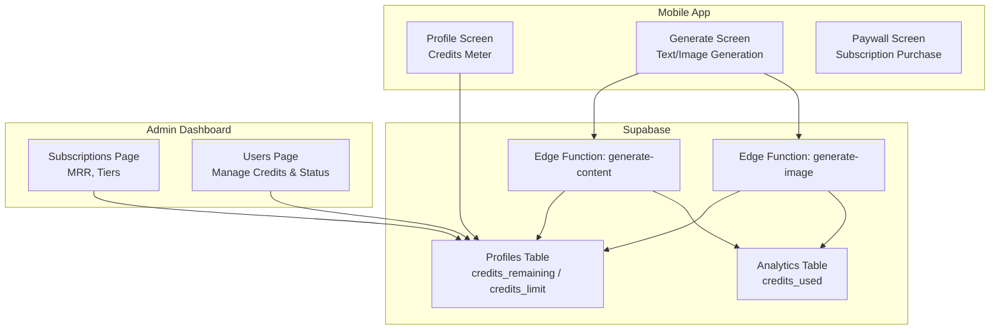
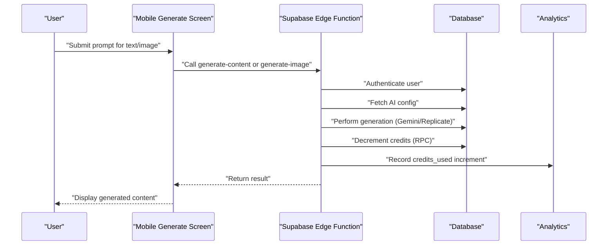
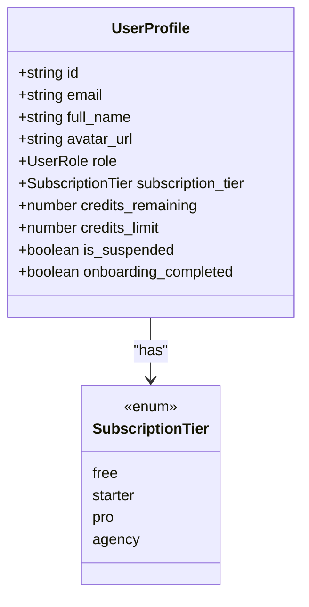
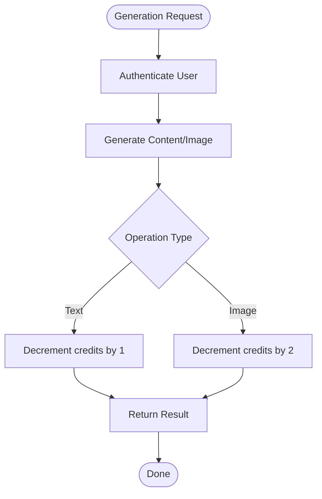
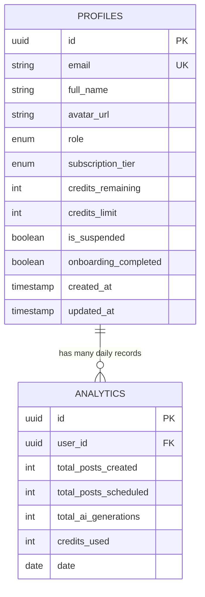
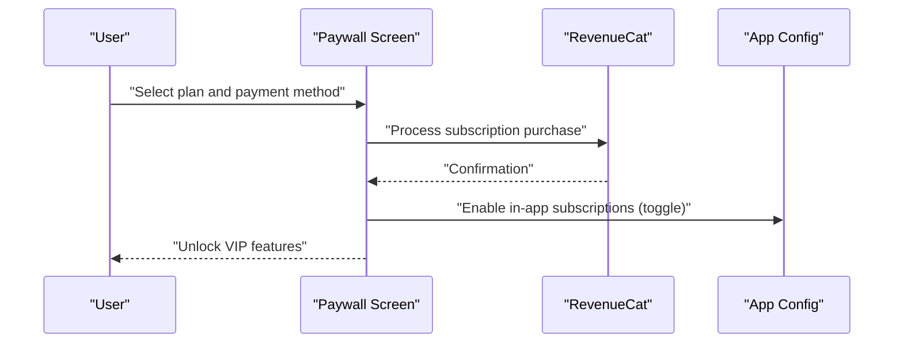
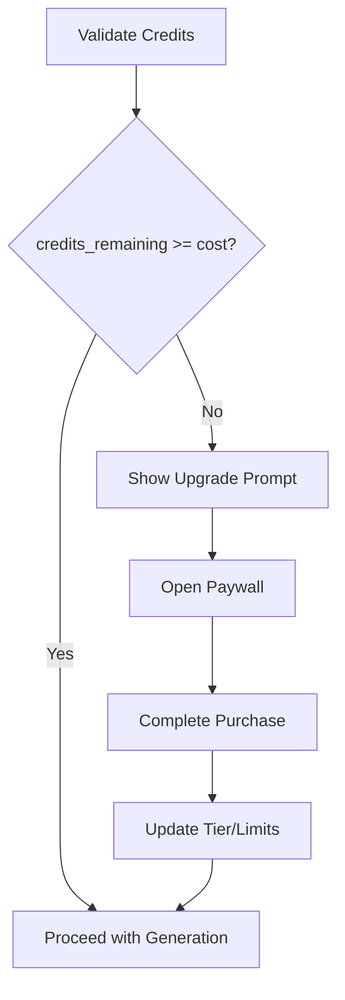
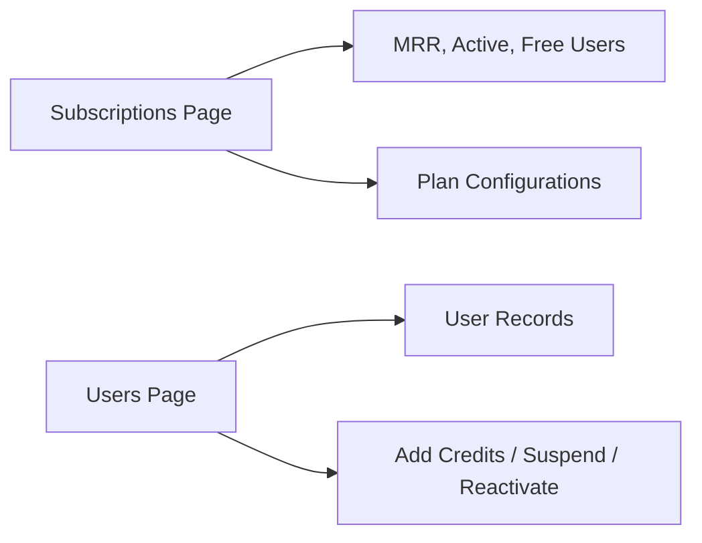
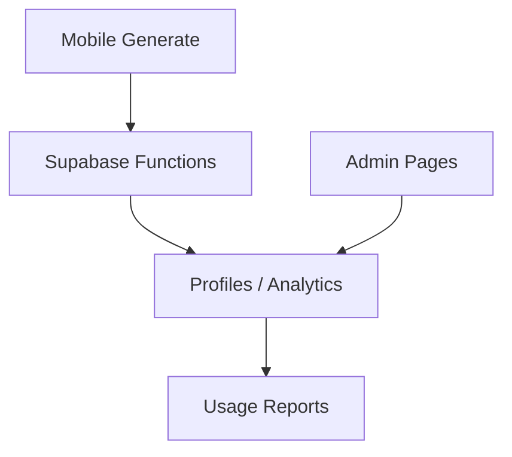

# Monetization & Credit System

<cite>
**Referenced Files in This Document**
- [initial_schema.sql](file://supabase/migrations/20240001000000_initial_schema.sql)
- [generate-content/index.ts](file://supabase/functions/generate-content/index.ts)
- [generate-image/index.ts](file://supabase/functions/generate-image/index.ts)
- [subscriptions/page.tsx](file://apps/admin/src/app/(dashboard)/subscriptions/page.tsx)
- [users/page.tsx](file://apps/admin/src/app/(dashboard)/users/page.tsx)
- [paywall.tsx](file://apps/mobile/src/app/paywall.tsx)
- [profile.tsx](file://apps/mobile/src/app/(tabs)/profile.tsx)
- [generate.tsx](file://apps/mobile/src/app/(tabs)/generate.tsx)
- [api.ts](file://packages/types/src/api.ts)
- [auth.ts](file://packages/types/src/auth.ts)
</cite>

## Table of Contents
1. [Introduction](#introduction)
2. [Project Structure](#project-structure)
3. [Core Components](#core-components)
4. [Architecture Overview](#architecture-overview)
5. [Detailed Component Analysis](#detailed-component-analysis)
6. [Dependency Analysis](#dependency-analysis)
7. [Performance Considerations](#performance-considerations)
8. [Troubleshooting Guide](#troubleshooting-guide)
9. [Conclusion](#conclusion)

## Introduction
This document explains the monetization and credit-based usage system for SocialPilot AI Pro. It covers subscription tiers, credit deduction mechanics during AI content operations, credit tracking and balance management across the application lifecycle, integration points with payment providers (RevenueCat), examples of credit validation and insufficient credit handling, upgrade prompts, and the admin interface for managing subscriptions and monitoring credit usage.

## Project Structure
The monetization and credits system spans several layers:
- Database schema defines user profiles, subscription tiers, and analytics tables that track credit usage.
- Supabase Edge Functions handle AI generation and decrement credits atomically after successful operations.
- Mobile app screens display credit meters, trigger generation, and present paywalls for upgrades.
- Admin dashboard provides subscription metrics and tools to manage users and credits.

**Diagram sources**
- [initial_schema.sql:44-58](file://supabase/migrations/20240001000000_initial_schema.sql#L44-L58)
- [initial_schema.sql:122-132](file://supabase/migrations/20240001000000_initial_schema.sql#L122-L132)
- [generate-content/index.ts:82-83](file://supabase/functions/generate-content/index.ts#L82-L83)
- [generate-image/index.ts:73-74](file://supabase/functions/generate-image/index.ts#L73-L74)
- [subscriptions/page.tsx:18-24](file://apps/admin/src/app/(dashboard)/subscriptions/page.tsx#L18-L24)
- [users/page.tsx:154-161](file://apps/admin/src/app/(dashboard)/users/page.tsx#L154-L161)

**Section sources**
- [initial_schema.sql:44-58](file://supabase/migrations/20240001000000_initial_schema.sql#L44-L58)
- [initial_schema.sql:122-132](file://supabase/migrations/20240001000000_initial_schema.sql#L122-L132)
- [subscriptions/page.tsx:18-24](file://apps/admin/src/app/(dashboard)/subscriptions/page.tsx#L18-L24)
- [users/page.tsx:154-161](file://apps/admin/src/app/(dashboard)/users/page.tsx#L154-L161)

## Core Components
- Subscription tiers and limits:
  - Tiers are defined as an enum and stored per user profile. The admin UI documents plan configurations and monthly credit allowances.
  - Default free tier includes a baseline credit limit; paid tiers increase limits accordingly.
- Credit storage and tracking:
  - User profiles store credits_remaining and credits_limit.
  - Analytics table tracks cumulative credits_used per day per user.
- Credit deduction:
  - Text generation decrements by 1 credit via a database RPC call.
  - Image generation decrements by 2 credits via the same mechanism.
- Payment and subscription management:
  - Mobile paywall supports purchasing plans and integrates with RevenueCat configuration toggles in app settings.
  - Admin dashboard displays revenue metrics and tier breakdowns.

**Section sources**
- [initial_schema.sql:9-10](file://supabase/migrations/20240001000000_initial_schema.sql#L9-L10)
- [initial_schema.sql:44-58](file://supabase/migrations/20240001000000_initial_schema.sql#L44-L58)
- [initial_schema.sql:122-132](file://supabase/migrations/20240001000000_initial_schema.sql#L122-L132)
- [generate-content/index.ts:82-83](file://supabase/functions/generate-content/index.ts#L82-L83)
- [generate-image/index.ts:73-74](file://supabase/functions/generate-image/index.ts#L73-L74)
- [subscriptions/page.tsx:65-99](file://apps/admin/src/app/(dashboard)/subscriptions/page.tsx#L65-L99)
- [paywall.tsx:221-226](file://apps/mobile/src/app/paywall.tsx#L221-L226)

## Architecture Overview
The credit system is enforced at the server layer (Supabase Edge Functions) to ensure consistent accounting and prevent client-side manipulation. Client apps request AI generation; functions authenticate users, perform generation, then deduct credits and return results. Admin dashboards read from the same data stores to monitor usage and manage accounts.

**Diagram sources**
- [generate-content/index.ts:14-27](file://supabase/functions/generate-content/index.ts#L14-L27)
- [generate-content/index.ts:38-83](file://supabase/functions/generate-content/index.ts#L38-L83)
- [generate-image/index.ts:14-27](file://supabase/functions/generate-image/index.ts#L14-L27)
- [generate-image/index.ts:38-74](file://supabase/functions/generate-image/index.ts#L38-L74)
- [initial_schema.sql:122-132](file://supabase/migrations/20240001000000_initial_schema.sql#L122-L132)

## Detailed Component Analysis

### Subscription Tiers and Feature Access
- Tiers: free, starter, pro, agency.
- Plan configurations shown in admin UI indicate monthly credits and feature access:
  - Starter: 200 monthly credits, multi-platform scheduling.
  - Pro: 1,000 monthly credits, unlimited AI image generation, premium templates.
  - Agency: 5,000 monthly credits, priority API and team collaboration.
- These tiers map to the subscription_tier field on user profiles and influence credits_limit and feature gating.

**Diagram sources**
- [auth.ts:1-18](file://packages/types/src/auth.ts#L1-L18)
- [initial_schema.sql:9-10](file://supabase/migrations/20240001000000_initial_schema.sql#L9-L10)
- [initial_schema.sql:44-58](file://supabase/migrations/20240001000000_initial_schema.sql#L44-L58)

**Section sources**
- [subscriptions/page.tsx:65-99](file://apps/admin/src/app/(dashboard)/subscriptions/page.tsx#L65-L99)
- [auth.ts:1-18](file://packages/types/src/auth.ts#L1-L18)
- [initial_schema.sql:9-10](file://supabase/migrations/20240001000000_initial_schema.sql#L9-L10)

### Credit Deduction Mechanism
- Text generation:
  - After generating content, the function calls a database RPC to decrement user credits by 1.
- Image generation:
  - After storing generated images, the function decrements user credits by 2.
- Both flows authenticate the user before performing any deductions.

**Diagram sources**
- [generate-content/index.ts:14-27](file://supabase/functions/generate-content/index.ts#L14-L27)
- [generate-content/index.ts:82-83](file://supabase/functions/generate-content/index.ts#L82-L83)
- [generate-image/index.ts:14-27](file://supabase/functions/generate-image/index.ts#L14-L27)
- [generate-image/index.ts:73-74](file://supabase/functions/generate-image/index.ts#L73-L74)

**Section sources**
- [generate-content/index.ts:82-83](file://supabase/functions/generate-content/index.ts#L82-L83)
- [generate-image/index.ts:73-74](file://supabase/functions/generate-image/index.ts#L73-L74)

### Credit Tracking and Balance Management
- Profile balances:
  - credits_remaining reflects current available credits.
  - credits_limit reflects maximum allowed credits based on subscription tier.
- Analytics:
  - Daily aggregates track total_ai_generations and credits_used per user.
- Admin controls:
  - Users page allows adding credits and suspending/reactivating accounts.
  - Subscriptions page shows MRR, active subscribers, and plan configurations.

**Diagram sources**
- [initial_schema.sql:44-58](file://supabase/migrations/20240001000000_initial_schema.sql#L44-L58)
- [initial_schema.sql:122-132](file://supabase/migrations/20240001000000_initial_schema.sql#L122-L132)

**Section sources**
- [initial_schema.sql:44-58](file://supabase/migrations/20240001000000_initial_schema.sql#L44-L58)
- [initial_schema.sql:122-132](file://supabase/migrations/20240001000000_initial_schema.sql#L122-L132)
- [users/page.tsx:63-76](file://apps/admin/src/app/(dashboard)/users/page.tsx#L63-L76)
- [subscriptions/page.tsx:27-63](file://apps/admin/src/app/(dashboard)/subscriptions/page.tsx#L27-L63)

### Integration with Payment Providers (RevenueCat)
- App configuration includes a toggle to enable RevenueCat for in-app subscriptions.
- Mobile paywall presents plan options and payment methods, simulating purchase flow and providing restore purchases and legal links.
- Admin settings allow enabling/disabling RevenueCat and social login providers.

**Diagram sources**
- [paywall.tsx:221-226](file://apps/mobile/src/app/paywall.tsx#L221-L226)
- [initial_schema.sql:14-29](file://supabase/migrations/20240001000000_initial_schema.sql#L14-L29)

**Section sources**
- [paywall.tsx:221-226](file://apps/mobile/src/app/paywall.tsx#L221-L226)
- [initial_schema.sql:14-29](file://supabase/migrations/20240001000000_initial_schema.sql#L14-L29)

### Examples: Credit Validation, Insufficient Credit Handling, Upgrade Prompts
- Credit validation:
  - Clients can check user.credits_remaining vs operation cost before invoking generation.
  - Example paths: mobile generate screen updates credits after success; profile screen displays remaining vs limit.
- Insufficient credit handling:
  - If credits_remaining is zero, clients should block generation and prompt upgrade.
  - Paywall screen offers plan selection and payment processing.
- Upgrade prompts:
  - Admin subscriptions page highlights plan configurations and encourages upgrades.
  - Mobile paywall presents benefits and pricing to drive conversions.

[No diagram sources needed since this diagram shows conceptual workflow, not actual code structure]

**Section sources**
- [generate.tsx:138-144](file://apps/mobile/src/app/(tabs)/generate.tsx#L138-L144)
- [profile.tsx:73-101](file://apps/mobile/src/app/(tabs)/profile.tsx#L73-L101)
- [paywall.tsx:91-117](file://apps/mobile/src/app/paywall.tsx#L91-L117)
- [subscriptions/page.tsx:65-99](file://apps/admin/src/app/(dashboard)/subscriptions/page.tsx#L65-L99)

### Admin Interface for Managing Subscriptions and Monitoring Usage
- Subscriptions page:
  - Displays MRR, active subscribers, free users, and plan configurations with credit allowances.
- Users page:
  - Lists users with roles, subscription tiers, credits remaining/limit, and status.
  - Provides actions to add credits and suspend/reactivate users.

**Diagram sources**
- [subscriptions/page.tsx:18-24](file://apps/admin/src/app/(dashboard)/subscriptions/page.tsx#L18-L24)
- [subscriptions/page.tsx:65-99](file://apps/admin/src/app/(dashboard)/subscriptions/page.tsx#L65-L99)
- [users/page.tsx:154-180](file://apps/admin/src/app/(dashboard)/users/page.tsx#L154-L180)

**Section sources**
- [subscriptions/page.tsx:18-24](file://apps/admin/src/app/(dashboard)/subscriptions/page.tsx#L18-L24)
- [subscriptions/page.tsx:65-99](file://apps/admin/src/app/(dashboard)/subscriptions/page.tsx#L65-L99)
- [users/page.tsx:154-180](file://apps/admin/src/app/(dashboard)/users/page.tsx#L154-L180)

## Dependency Analysis
- Client-to-server dependencies:
  - Mobile screens depend on Supabase client to fetch profiles and invoke edge functions.
  - Edge functions depend on environment variables for AI providers and Supabase credentials.
- Data dependencies:
  - Profiles table holds subscription tier and credit balances.
  - Analytics table aggregates usage metrics for reporting.
- Admin dependencies:
  - Admin pages read from profiles and analytics to display metrics and manage users.

**Diagram sources**
- [generate.tsx:138-144](file://apps/mobile/src/app/(tabs)/generate.tsx#L138-L144)
- [generate-content/index.ts:14-27](file://supabase/functions/generate-content/index.ts#L14-L27)
- [generate-image/index.ts:14-27](file://supabase/functions/generate-image/index.ts#L14-L27)
- [initial_schema.sql:44-58](file://supabase/migrations/20240001000000_initial_schema.sql#L44-L58)
- [initial_schema.sql:122-132](file://supabase/migrations/20240001000000_initial_schema.sql#L122-L132)

**Section sources**
- [generate.tsx:138-144](file://apps/mobile/src/app/(tabs)/generate.tsx#L138-L144)
- [generate-content/index.ts:14-27](file://supabase/functions/generate-content/index.ts#L14-L27)
- [generate-image/index.ts:14-27](file://supabase/functions/generate-image/index.ts#L14-L27)
- [initial_schema.sql:44-58](file://supabase/migrations/20240001000000_initial_schema.sql#L44-L58)
- [initial_schema.sql:122-132](file://supabase/migrations/20240001000000_initial_schema.sql#L122-L132)

## Performance Considerations
- Server-side credit deduction ensures consistency and avoids race conditions when multiple requests occur simultaneously.
- Using a single RPC call to decrement credits minimizes network overhead and centralizes logic.
- Analytics aggregation enables efficient reporting without scanning large datasets per query.
- Caching user profiles on the client reduces repeated reads; refresh after generation to reflect updated balances.

[No sources needed since this section provides general guidance]

## Troubleshooting Guide
- Unauthorized errors:
  - Ensure proper Authorization header is passed to Supabase functions.
  - Verify user session is active before calling generation endpoints.
- Missing API keys:
  - If Gemini or Replicate keys are not set, functions may return mock results; configure secrets appropriately.
- Credit deduction failures:
  - Confirm the RPC exists and is callable; verify user ID and amount parameters.
  - Check RLS policies to ensure authenticated users can update their own profiles if necessary.
- Admin actions:
  - Use the Users page to add credits and manage suspension status.
  - Monitor Subscriptions page for revenue metrics and plan configurations.

**Section sources**
- [generate-content/index.ts:14-27](file://supabase/functions/generate-content/index.ts#L14-L27)
- [generate-image/index.ts:14-27](file://supabase/functions/generate-image/index.ts#L14-L27)
- [users/page.tsx:63-76](file://apps/admin/src/app/(dashboard)/users/page.tsx#L63-L76)
- [subscriptions/page.tsx:27-63](file://apps/admin/src/app/(dashboard)/subscriptions/page.tsx#L27-L63)

## Conclusion
The monetization and credit system combines robust server-side enforcement with intuitive client interfaces. Subscription tiers define credit limits and feature access, while Edge Functions guarantee accurate credit deductions. Admin tools provide visibility into revenue and usage, enabling effective management and growth strategies. Integrating RevenueCat through configurable toggles streamlines subscription management and enhances user experience.