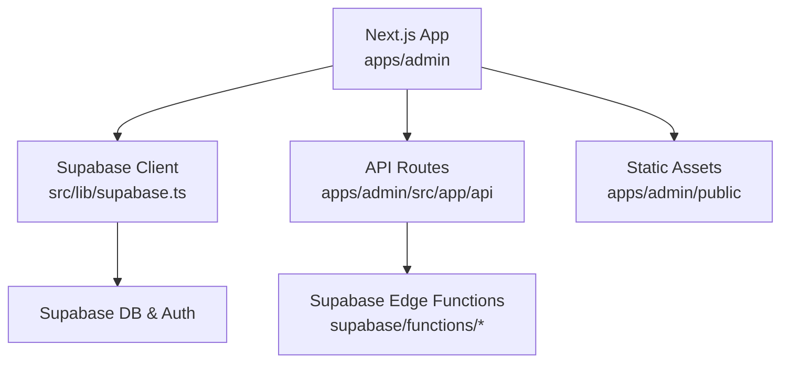
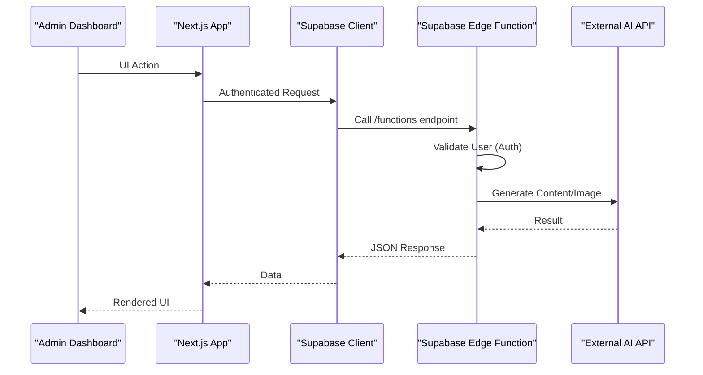
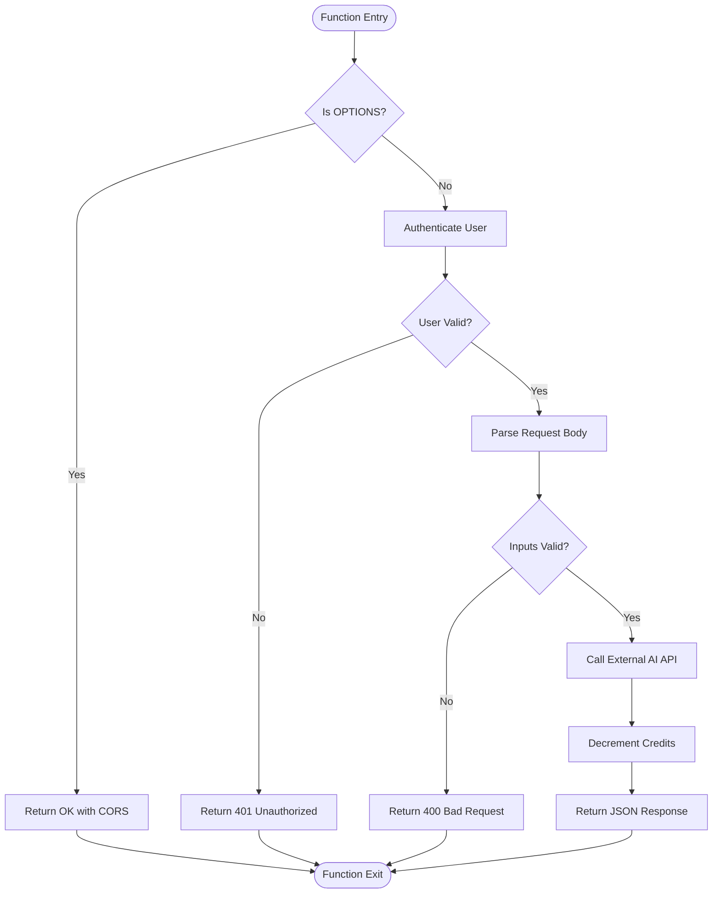
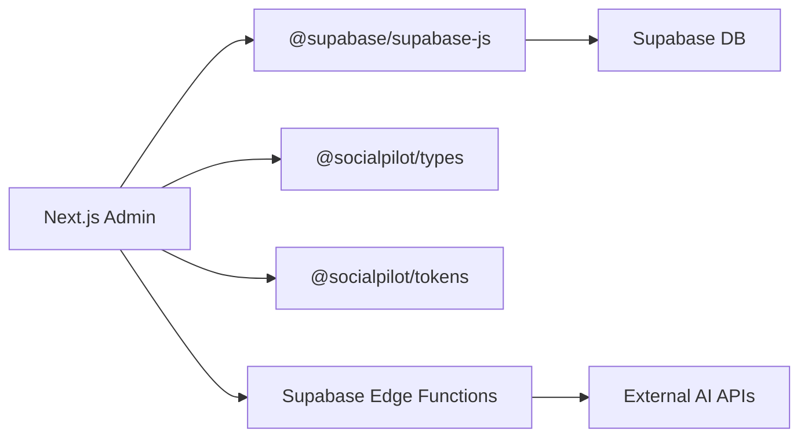

# Admin Dashboard Deployment

<cite>
**Referenced Files in This Document**
- [next.config.js](file://apps/admin/next.config.js)
- [package.json](file://apps/admin/package.json)
- [supabase.ts](file://apps/admin/src/lib/supabase.ts)
- [config.toml](file://supabase/config.toml)
- [generate-content/index.ts](file://supabase/functions/generate-content/index.ts)
- [generate-image/index.ts](file://supabase/functions/generate-image/index.ts)
</cite>

## Table of Contents
1. [Introduction](#introduction)
2. [Project Structure](#project-structure)
3. [Core Components](#core-components)
4. [Architecture Overview](#architecture-overview)
5. [Detailed Component Analysis](#detailed-component-analysis)
6. [Dependency Analysis](#dependency-analysis)
7. [Performance Considerations](#performance-considerations)
8. [Troubleshooting Guide](#troubleshooting-guide)
9. [Conclusion](#conclusion)
10. [Appendices](#appendices)

## Introduction
This document provides comprehensive deployment guidance for the Next.js admin dashboard, focusing on Vercel deployment configuration, environment variables, domain setup, build and image optimization, static assets handling, API routes, middleware, SSL/CDN considerations, performance monitoring, database connectivity via Supabase, and security headers. It is designed to be accessible to both technical and non-technical readers while remaining grounded in the repository’s actual code and configuration.

## Project Structure
The admin dashboard is a Next.js application located under apps/admin. Key deployment-related files include:
- next.config.js: Next.js runtime configuration (strict mode, package transpilation).
- package.json: Scripts for development, building, and starting the app; dependencies including Supabase client and React Query.
- src/lib/supabase.ts: Client initialization using environment variables for Supabase URL and anon key.
- supabase/functions/*: Serverless functions deployed with Supabase that handle AI content and image generation.
- supabase/config.toml: Placeholder for local Supabase configuration.

**Diagram sources**
- [next.config.js:1-8](file://apps/admin/next.config.js#L1-L8)
- [package.json:1-41](file://apps/admin/package.json#L1-L41)
- [supabase.ts:1-14](file://apps/admin/src/lib/supabase.ts#L1-L14)
- [generate-content/index.ts:1-99](file://supabase/functions/generate-content/index.ts#L1-L99)
- [generate-image/index.ts:1-87](file://supabase/functions/generate-image/index.ts#L1-L87)

**Section sources**
- [next.config.js:1-8](file://apps/admin/next.config.js#L1-L8)
- [package.json:1-41](file://apps/admin/package.json#L1-L41)
- [supabase.ts:1-14](file://apps/admin/src/lib/supabase.ts#L1-L14)
- [config.toml:1-2](file://supabase/config.toml#L1-L2)

## Core Components
- Next.js Configuration: Strict mode enabled; workspace packages are transpiled for compatibility.
- Environment-driven Supabase Client: Initializes the Supabase client using NEXT_PUBLIC_SUPABASE_URL and NEXT_PUBLIC_SUPABASE_ANON_KEY.
- Serverless Functions: Supabase Edge Functions for AI content and image generation, enforcing authentication and CORS.

Key responsibilities:
- Build-time and runtime behavior controlled by next.config.js.
- Secure client-side access to Supabase via environment variables.
- Backend logic offloaded to Supabase functions for secure secret management and edge execution.

**Section sources**
- [next.config.js:1-8](file://apps/admin/next.config.js#L1-L8)
- [supabase.ts:1-14](file://apps/admin/src/lib/supabase.ts#L1-L14)
- [generate-content/index.ts:1-99](file://supabase/functions/generate-content/index.ts#L1-L99)
- [generate-image/index.ts:1-87](file://supabase/functions/generate-image/index.ts#L1-L87)

## Architecture Overview
The admin dashboard communicates with Supabase for data and auth, and uses Supabase Edge Functions for AI workloads. The flow ensures authenticated requests and consistent CORS handling.

**Diagram sources**
- [supabase.ts:1-14](file://apps/admin/src/lib/supabase.ts#L1-L14)
- [generate-content/index.ts:1-99](file://supabase/functions/generate-content/index.ts#L1-L99)
- [generate-image/index.ts:1-87](file://supabase/functions/generate-image/index.ts#L1-L87)

## Detailed Component Analysis

### Vercel Deployment Configuration
- Framework: Next.js 14.x.
- Build command: Uses the standard Next.js build script defined in package.json.
- Output directory: .next (default for Next.js).
- Node version: Use a recent LTS compatible with Next.js 14.
- Environment variables: Configure all required variables in Vercel project settings.
- Routing: Next.js handles routing; no custom server is configured in next.config.js.

Recommended Vercel settings:
- Framework Preset: Next.js
- Build Command: npm run build (or pnpm/yarn equivalent)
- Output Directory: .next
- Install Command: npm ci (or pnpm install --frozen-lockfile)
- Environment Variables: Set all NEXT_* and public keys as described below.

**Section sources**
- [package.json:1-41](file://apps/admin/package.json#L1-L41)
- [next.config.js:1-8](file://apps/admin/next.config.js#L1-L8)

### Environment Variables Setup
Required variables for the admin dashboard:
- NEXT_PUBLIC_SUPABASE_URL: Public Supabase project URL.
- NEXT_PUBLIC_SUPABASE_ANON_KEY: Public anon key for client-side access.

Notes:
- The Supabase client reads these variables at runtime.
- For server-side secrets used by Supabase functions (e.g., GEMINI_API_KEY, REPLICATE_API_TOKEN), configure them in Supabase project settings, not in Vercel.

Where they are used:
- Client initialization reads NEXT_PUBLIC_* variables.

**Section sources**
- [supabase.ts:1-14](file://apps/admin/src/lib/supabase.ts#L1-L14)

### Domain Configuration
- Add your custom domain in Vercel project settings.
- Configure DNS records as instructed by Vercel (typically CNAME or ALIAS).
- Enable HTTPS automatically via Vercel’s managed certificates.

[No sources needed since this section provides general guidance]

### Build Optimization
- Strict Mode: Enabled for better development experience and early error detection.
- Package Transpilation: Workspace packages are transpiled to ensure compatibility across environments.
- Incremental Builds: Leverage Next.js incremental compilation for faster builds.

Recommendations:
- Keep dependencies up-to-date.
- Avoid large third-party libraries unless necessary.
- Use Next.js Image component for automatic optimization.

**Section sources**
- [next.config.js:1-8](file://apps/admin/next.config.js#L1-L8)

### Image Optimization
- Use Next.js Image component to serve optimized images in WebP/AVIF formats.
- Configure remote patterns if loading images from external domains.
- Prefer static images under public folder for caching benefits.

[No sources needed since this section provides general guidance]

### Static Asset Handling
- Place static assets (icons, fonts, etc.) under apps/admin/public.
- Reference them directly in components without path prefixes.
- Ensure proper MIME types and caching via CDN.

[No sources needed since this section provides general guidance]

### Custom Server Configurations
- No custom server is configured in next.config.js.
- Rely on Next.js built-in server for production deployments.
- If you need custom headers or redirects, use next.config.js rewrites/headers or Vercel config.

**Section sources**
- [next.config.js:1-8](file://apps/admin/next.config.js#L1-L8)

### API Route Deployment
- API routes live under apps/admin/src/app/api.
- They are served by Next.js and can call Supabase or other services.
- For sensitive operations, prefer Supabase Edge Functions to keep secrets out of the frontend bundle.

[No sources needed since this section provides general guidance]

### Middleware Setup
- No middleware file was found in the provided context.
- If you need request interception or header injection, create middleware.ts in apps/admin/src.
- Alternatively, use Vercel’s Headers feature to set global security headers.

[No sources needed since this section provides general guidance]

### SSL Certificate Management
- Vercel provisions and manages SSL certificates automatically for custom domains.
- Ensure DNS records point to Vercel and propagation completes.

[No sources needed since this section provides general guidance]

### CDN Configuration
- Vercel serves assets through its global CDN by default.
- For custom CDNs, integrate via Next.js rewrites or external hosting for static assets.

[No sources needed since this section provides general guidance]

### Performance Monitoring
- Integrate a monitoring solution (e.g., Vercel Analytics, Sentry, or OpenTelemetry) via environment variables and SDKs.
- Monitor build times, runtime metrics, and error rates.

[No sources needed since this section provides general guidance]

### Database Connection Setup and Supabase Integration
- Initialize Supabase client with NEXT_PUBLIC_SUPABASE_URL and NEXT_PUBLIC_SUPABASE_ANON_KEY.
- Authentication and session persistence are enabled in the client configuration.
- For server-side operations requiring secrets, use Supabase Edge Functions.

**Section sources**
- [supabase.ts:1-14](file://apps/admin/src/lib/supabase.ts#L1-L14)

### Security Headers Configuration
- No custom headers are set in next.config.js.
- Recommended approach:
  - Use Vercel Headers to add CSP, HSTS, X-Frame-Options, Referrer-Policy, etc.
  - Or implement middleware to inject headers per route.

[No sources needed since this section provides general guidance]

### Supabase Edge Functions
- generate-content: Authenticates user, fetches AI config, calls external AI API, decrements credits, returns generated content.
- generate-image: Authenticates user, calls image generation service, stores result, decrements credits, returns image URL.
- Both functions enforce CORS and return structured JSON responses.

**Diagram sources**
- [generate-content/index.ts:1-99](file://supabase/functions/generate-content/index.ts#L1-L99)
- [generate-image/index.ts:1-87](file://supabase/functions/generate-image/index.ts#L1-L87)

**Section sources**
- [generate-content/index.ts:1-99](file://supabase/functions/generate-content/index.ts#L1-L99)
- [generate-image/index.ts:1-87](file://supabase/functions/generate-image/index.ts#L1-L87)

## Dependency Analysis
The admin dashboard depends on:
- Next.js runtime and build tooling.
- Supabase client for data and auth.
- Workspace packages for shared types and tokens.
- Supabase Edge Functions for AI workloads.

**Diagram sources**
- [package.json:1-41](file://apps/admin/package.json#L1-L41)
- [supabase.ts:1-14](file://apps/admin/src/lib/supabase.ts#L1-L14)
- [generate-content/index.ts:1-99](file://supabase/functions/generate-content/index.ts#L1-L99)
- [generate-image/index.ts:1-87](file://supabase/functions/generate-image/index.ts#L1-L87)

**Section sources**
- [package.json:1-41](file://apps/admin/package.json#L1-L41)

## Performance Considerations
- Enable strict mode for safer development.
- Transpile workspace packages to avoid runtime issues.
- Use Next.js Image for optimized delivery.
- Offload heavy processing to Supabase Edge Functions.
- Cache static assets via CDN.
- Monitor performance with analytics and error tracking.

[No sources needed since this section provides general guidance]

## Troubleshooting Guide
Common issues and resolutions:
- Missing environment variables: Ensure NEXT_PUBLIC_SUPABASE_URL and NEXT_PUBLIC_SUPABASE_ANON_KEY are set in Vercel.
- Placeholder URLs: The client detects placeholder values; verify correct configuration.
- Authentication errors: Confirm user sessions and that Edge Functions receive Authorization headers when required.
- CORS errors: Edge functions already set CORS headers; ensure browser requests include necessary headers.
- Build failures: Verify Node version and dependency installation commands match your package manager.

**Section sources**
- [supabase.ts:1-14](file://apps/admin/src/lib/supabase.ts#L1-L14)
- [generate-content/index.ts:1-99](file://supabase/functions/generate-content/index.ts#L1-L99)
- [generate-image/index.ts:1-87](file://supabase/functions/generate-image/index.ts#L1-L87)

## Conclusion
The admin dashboard is a Next.js application integrated with Supabase for data, authentication, and serverless functions. Deploy it on Vercel with proper environment variables, enable HTTPS via Vercel’s managed certificates, and leverage Supabase Edge Functions for secure AI workloads. Follow the recommendations for build optimization, image handling, and security headers to ensure a robust and performant deployment.

[No sources needed since this section summarizes without analyzing specific files]

## Appendices

### Environment Variables Checklist
- NEXT_PUBLIC_SUPABASE_URL
- NEXT_PUBLIC_SUPABASE_ANON_KEY
- Supabase function secrets (configured in Supabase):
  - GEMINI_API_KEY
  - REPLICATE_API_TOKEN

**Section sources**
- [supabase.ts:1-14](file://apps/admin/src/lib/supabase.ts#L1-L14)
- [generate-content/index.ts:1-99](file://supabase/functions/generate-content/index.ts#L1-L99)
- [generate-image/index.ts:1-87](file://supabase/functions/generate-image/index.ts#L1-L87)