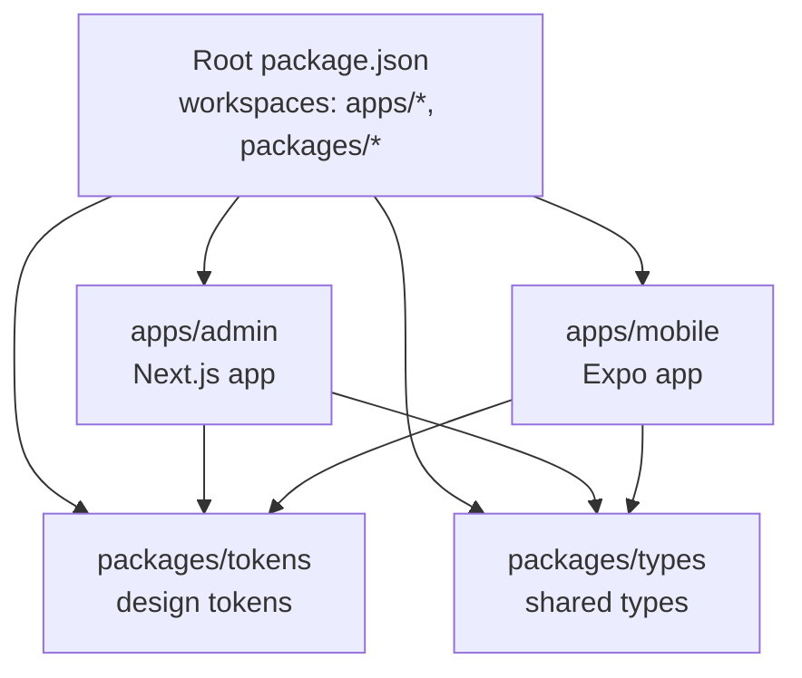
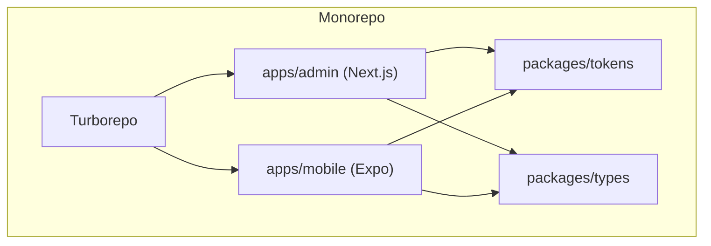
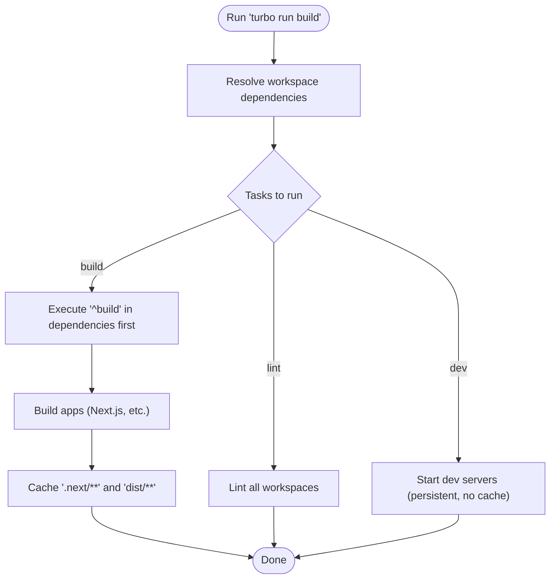
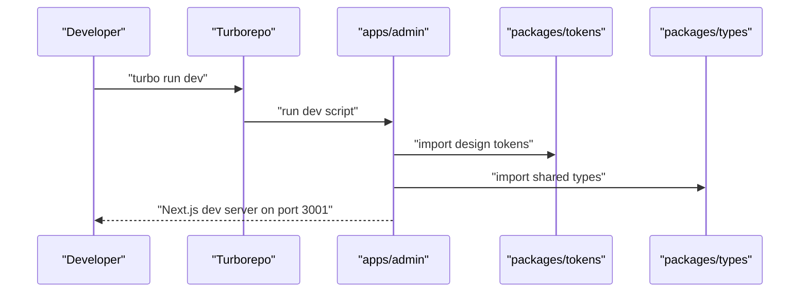
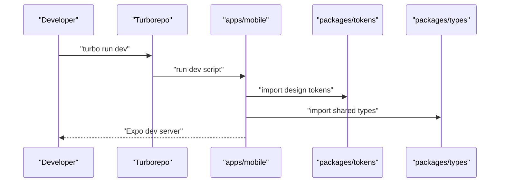
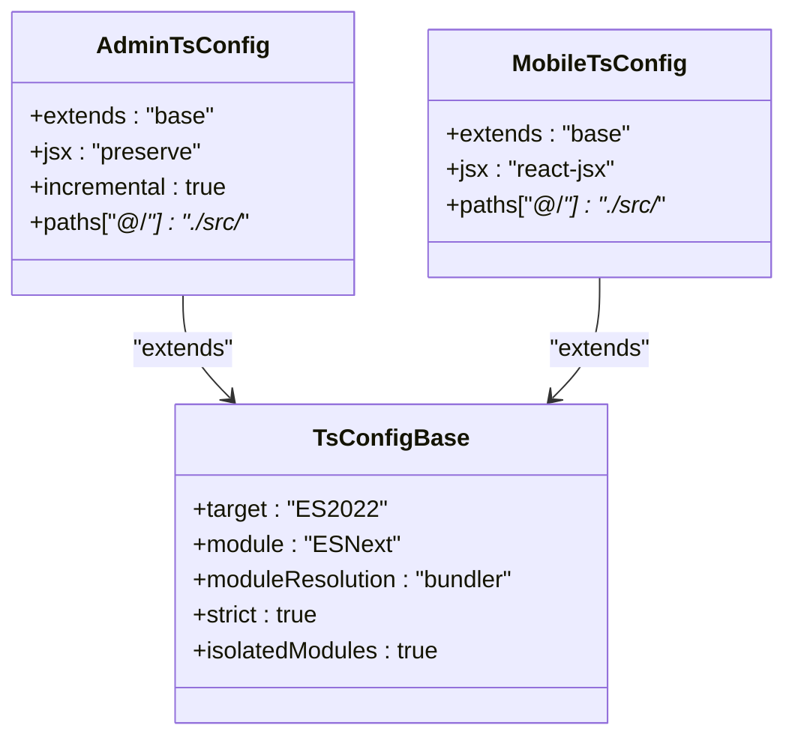
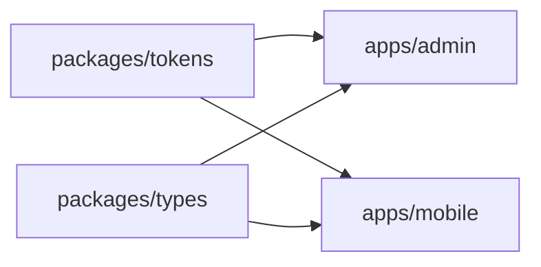

# Build Pipeline & Monorepo Setup

<cite>
**Referenced Files in This Document**
- [turbo.json](file://turbo.json)
- [package.json](file://package.json)
- [pnpm-workspace.yaml](file://pnpm-workspace.yaml)
- [tsconfig.base.json](file://tsconfig.base.json)
- [apps/admin/package.json](file://apps/admin/package.json)
- [apps/mobile/package.json](file://apps/mobile/package.json)
- [apps/admin/tsconfig.json](file://apps/admin/tsconfig.json)
- [apps/mobile/tsconfig.json](file://apps/mobile/tsconfig.json)
</cite>

## Table of Contents
1. [Introduction](#introduction)
2. [Project Structure](#project-structure)
3. [Core Components](#core-components)
4. [Architecture Overview](#architecture-overview)
5. [Detailed Component Analysis](#detailed-component-analysis)
6. [Dependency Analysis](#dependency-analysis)
7. [Performance Considerations](#performance-considerations)
8. [Troubleshooting Guide](#troubleshooting-guide)
9. [Conclusion](#conclusion)

## Introduction
This document explains the build pipeline and monorepo setup for the project, which uses Turborepo to orchestrate tasks across multiple apps and shared packages. It covers workspace configuration, task definitions, caching strategies, environment variable handling, TypeScript compilation settings, dependency resolution, common commands, custom tasks, performance optimizations, and troubleshooting strategies.

## Project Structure
The repository is a pnpm workspaces monorepo with two applications and shared packages:
- Apps:
  - Admin dashboard (Next.js) under apps/admin
  - Mobile app (Expo/React Native) under apps/mobile
- Shared packages:
  - tokens (design tokens)
  - types (shared TypeScript types)

Workspace scope is defined at the root and per-app package manifests declare dependencies on shared packages via workspace protocol.

**Diagram sources**
- [package.json:5-8](file://package.json#L5-L8)
- [pnpm-workspace.yaml:1-4](file://pnpm-workspace.yaml#L1-L4)
- [apps/admin/package.json:11-15](file://apps/admin/package.json#L11-L15)
- [apps/mobile/package.json:13-16](file://apps/mobile/package.json#L13-L16)

**Section sources**
- [package.json:5-8](file://package.json#L5-L8)
- [pnpm-workspace.yaml:1-4](file://pnpm-workspace.yaml#L1-L4)

## Core Components
- Turborepo pipeline defines global behavior for build, lint, dev, and cache outputs.
- Root scripts delegate to Turborepo for consistent execution across workspaces.
- Each app defines its own scripts for development, building, and linting.
- Shared packages are consumed via workspace protocol for fast local linking.

Key responsibilities:
- Orchestration: turbo run orchestrates parallel and dependent tasks across workspaces.
- Caching: outputs configured to cache Next.js builds and any dist artifacts.
- Environment: globalDependencies include .env.*local files so env changes invalidate caches when needed.

**Section sources**
- [turbo.json:1-26](file://turbo.json#L1-L26)
- [package.json:9-15](file://package.json#L9-L15)
- [apps/admin/package.json:5-10](file://apps/admin/package.json#L5-L10)
- [apps/mobile/package.json:5-12](file://apps/mobile/package.json#L5-L12)

## Architecture Overview
Turborepo coordinates tasks across apps and packages. The admin app depends on shared tokens and types; the mobile app also depends on shared tokens and types. Builds produce Next.js output (.next) and other artifacts (dist), which are cached by Turborepo.

**Diagram sources**
- [turbo.json:6-24](file://turbo.json#L6-L24)
- [apps/admin/package.json:11-15](file://apps/admin/package.json#L11-L15)
- [apps/mobile/package.json:13-16](file://apps/mobile/package.json#L13-L16)

## Detailed Component Analysis

### Turborepo Pipeline and Caching
- Global dependencies: .env.*local files are watched; changes trigger cache invalidation.
- Task pipeline:
  - build: depends on upstream build tasks (^build) and caches .next/** and dist/** outputs.
  - lint: depends on upstream lint tasks.
  - dev: non-cached, persistent mode for long-running processes.

**Diagram sources**
- [turbo.json:3-24](file://turbo.json#L3-L24)

**Section sources**
- [turbo.json:1-26](file://turbo.json#L1-L26)

### Workspace Configuration
- pnpm workspaces include apps/* and packages/*.
- Root package.json declares workspaces and provides convenience scripts that wrap turbo commands.
- Package manager is pinned to pnpm@9.0.0.

**Section sources**
- [pnpm-workspace.yaml:1-4](file://pnpm-workspace.yaml#L1-L4)
- [package.json:5-8](file://package.json#L5-L8)
- [package.json:9-15](file://package.json#L9-L15)
- [package.json:20-21](file://package.json#L20-L21)

### Admin Dashboard (Next.js)
- Scripts: dev, build, start, lint using Next.js CLI.
- Dependencies include shared packages via workspace:* for tokens and types.
- TypeScript config extends base config, sets moduleResolution bundler, preserves JSX for Next, enables incremental type checking, and maps @/* to src/.

**Diagram sources**
- [apps/admin/package.json:5-10](file://apps/admin/package.json#L5-L10)
- [apps/admin/package.json:11-15](file://apps/admin/package.json#L11-L15)
- [apps/admin/tsconfig.json:1-31](file://apps/admin/tsconfig.json#L1-L31)

**Section sources**
- [apps/admin/package.json:5-10](file://apps/admin/package.json#L5-L10)
- [apps/admin/package.json:11-15](file://apps/admin/package.json#L11-L15)
- [apps/admin/tsconfig.json:1-31](file://apps/admin/tsconfig.json#L1-L31)

### Mobile App (Expo/React Native)
- Scripts: dev (expo start), android, ios, web, lint (tsc --noEmit), and a fast Android helper.
- Dependencies include shared packages via workspace:* for tokens and types.
- TypeScript config extends base config, sets React JSX transform, and maps @/* to src/.

**Diagram sources**
- [apps/mobile/package.json:5-12](file://apps/mobile/package.json#L5-L12)
- [apps/mobile/package.json:13-16](file://apps/mobile/package.json#L13-L16)
- [apps/mobile/tsconfig.json:1-17](file://apps/mobile/tsconfig.json#L1-L17)

**Section sources**
- [apps/mobile/package.json:5-12](file://apps/mobile/package.json#L5-L12)
- [apps/mobile/package.json:13-16](file://apps/mobile/package.json#L13-L16)
- [apps/mobile/tsconfig.json:1-17](file://apps/mobile/tsconfig.json#L1-L17)

### Shared Packages (tokens, types)
- Consumed by both apps via workspace:* protocol for fast local linking.
- Typical role:
  - tokens: centralized design tokens (colors, spacing, typography).
  - types: shared TypeScript interfaces and types.

Note: These packages are referenced by apps but their internal structure is not analyzed here.

**Section sources**
- [apps/admin/package.json:11-15](file://apps/admin/package.json#L11-L15)
- [apps/mobile/package.json:13-16](file://apps/mobile/package.json#L13-L16)

### TypeScript Compilation Settings
- Base config enforces strict checks, ES2022 target, ESNext modules, bundler module resolution, isolatedModules, and JSON imports.
- Admin app:
  - Extends base config, sets JSX preserve for Next, enables incremental TS, and path alias @/* -> src/.
- Mobile app:
  - Extends base config, sets React JSX transform, and path alias @/* -> src/.

**Diagram sources**
- [tsconfig.base.json:1-30](file://tsconfig.base.json#L1-L30)
- [apps/admin/tsconfig.json:1-31](file://apps/admin/tsconfig.json#L1-L31)
- [apps/mobile/tsconfig.json:1-17](file://apps/mobile/tsconfig.json#L1-L17)

**Section sources**
- [tsconfig.base.json:1-30](file://tsconfig.base.json#L1-L30)
- [apps/admin/tsconfig.json:1-31](file://apps/admin/tsconfig.json#L1-L31)
- [apps/mobile/tsconfig.json:1-17](file://apps/mobile/tsconfig.json#L1-L17)

## Dependency Analysis
- Workspace protocol ensures local packages are linked without publishing.
- Both apps depend on shared tokens and types.
- Turborepo’s ^build dependency ensures shared packages build before apps if they define a build task.

**Diagram sources**
- [apps/admin/package.json:11-15](file://apps/admin/package.json#L11-L15)
- [apps/mobile/package.json:13-16](file://apps/mobile/package.json#L13-L16)

**Section sources**
- [apps/admin/package.json:11-15](file://apps/admin/package.json#L11-L15)
- [apps/mobile/package.json:13-16](file://apps/mobile/package.json#L13-L16)

## Performance Considerations
- Use Turborepo caching:
  - Build outputs are cached under .next/** and dist/**.
  - Changes to .env.*local invalidate cache due to globalDependencies.
- Run only affected tasks:
  - Use turbo run with filters to target specific apps or packages.
- Parallelization:
  - Turborepo runs independent tasks in parallel automatically.
- Avoid unnecessary rebuilds:
  - Keep shared packages small and stable.
  - Prefer incremental TS where supported.
- Development:
  - Use dev tasks with persistent mode for hot reloading.

[No sources needed since this section provides general guidance]

## Troubleshooting Guide
Common issues and strategies:
- Environment variables not picked up:
  - Ensure .env.*local files exist and match expected names; Turborepo watches them via globalDependencies.
- Stale cache after env changes:
  - Clear Turborepo cache if necessary to force re-evaluation.
- Port conflicts:
  - Admin dev server uses a specific port; ensure it is available or adjust accordingly.
- Type errors in mobile:
  - Use the provided lint script to run tsc --noEmit and catch type issues early.
- Workspace link issues:
  - Reinstall dependencies with pnpm to refresh workspace links.

**Section sources**
- [turbo.json:3-5](file://turbo.json#L3-L5)
- [apps/admin/package.json:5-10](file://apps/admin/package.json#L5-L10)
- [apps/mobile/package.json:5-12](file://apps/mobile/package.json#L5-L12)

## Conclusion
This monorepo leverages pnpm workspaces and Turborepo to provide a unified, cache-aware build pipeline across the admin dashboard and mobile app, with shared packages for design tokens and types. By configuring outputs, global dependencies, and per-app scripts, the system achieves efficient builds, consistent development workflows, and scalable architecture.

[No sources needed since this section summarizes without analyzing specific files]