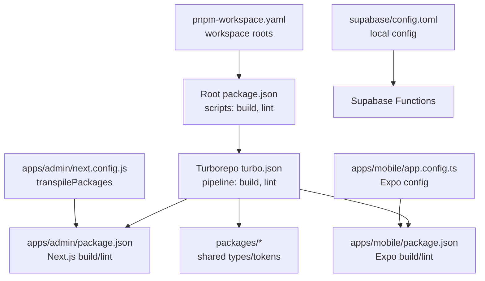
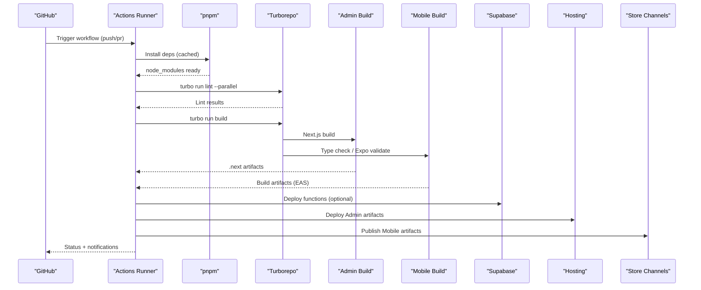
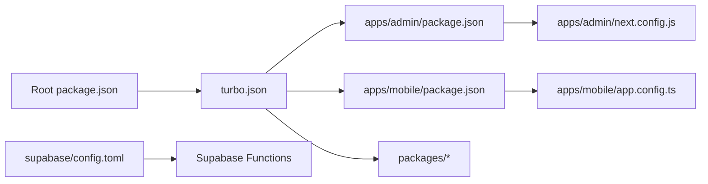

# CI/CD Pipeline Configuration

<cite>
**Referenced Files in This Document**
- [package.json](file://package.json)
- [turbo.json](file://turbo.json)
- [pnpm-workspace.yaml](file://pnpm-workspace.yaml)
- [apps/admin/package.json](file://apps/admin/package.json)
- [apps/mobile/package.json](file://apps/mobile/package.json)
- [apps/mobile/app.config.ts](file://apps/mobile/app.config.ts)
- [apps/admin/next.config.js](file://apps/admin/next.config.js)
- [supabase/config.toml](file://supabase/config.toml)
</cite>

## Table of Contents
1. [Introduction](#introduction)
2. [Project Structure](#project-structure)
3. [Core Components](#core-components)
4. [Architecture Overview](#architecture-overview)
5. [Detailed Component Analysis](#detailed-component-analysis)
6. [Dependency Analysis](#dependency-analysis)
7. [Performance Considerations](#performance-considerations)
8. [Troubleshooting Guide](#troubleshooting-guide)
9. [Conclusion](#conclusion)
10. [Appendices](#appendices)

## Introduction
This document defines a comprehensive CI/CD pipeline for the monorepo that builds and deploys the Admin web app (Next.js), the Mobile app (Expo/RN), and Supabase functions. It covers GitHub Actions workflow design, parallel job execution, artifact management, automated testing strategies, code quality checks, security scanning, deployment automation, environment promotion, rollback procedures, cache optimization, build matrix configuration, and notifications.

The pipeline is designed to be fast, reliable, and secure by leveraging pnpm workspaces, Turborepo caching, and platform-specific build steps.

## Project Structure
The repository is a pnpm workspace with two primary apps and shared packages:
- apps/admin: Next.js admin application
- apps/mobile: Expo-based mobile application
- packages/types and packages/tokens: Shared TypeScript types and design tokens consumed by apps
- supabase: Supabase functions and local configuration

**Diagram sources**
- [package.json:1-27](file://package.json#L1-L27)
- [turbo.json:1-26](file://turbo.json#L1-L26)
- [pnpm-workspace.yaml:1-3](file://pnpm-workspace.yaml#L1-L3)
- [apps/admin/package.json:1-41](file://apps/admin/package.json#L1-L41)
- [apps/mobile/package.json:1-53](file://apps/mobile/package.json#L1-L53)
- [apps/admin/next.config.js:1-8](file://apps/admin/next.config.js#L1-L8)
- [apps/mobile/app.config.ts:1-42](file://apps/mobile/app.config.ts#L1-L42)
- [supabase/config.toml:1-2](file://supabase/config.toml#L1-L2)

**Section sources**
- [package.json:1-27](file://package.json#L1-L27)
- [turbo.json:1-26](file://turbo.json#L1-L26)
- [pnpm-workspace.yaml:1-3](file://pnpm-workspace.yaml#L1-L3)

## Core Components
- Package manager and workspaces: pnpm with workspace definitions to install dependencies across apps and packages efficiently.
- Task orchestration: Turborepo pipeline defines build and lint tasks with dependency ordering and outputs for caching.
- App-level scripts:
  - Admin: Next.js build and lint commands.
  - Mobile: Expo development and lint via TypeScript; production builds are handled via EAS.
- Environment and configuration:
  - Next.js transpiles shared packages.
  - Expo app metadata defined in app configuration.
  - Supabase local configuration placeholder.

**Section sources**
- [package.json:1-27](file://package.json#L1-L27)
- [turbo.json:1-26](file://turbo.json#L1-L26)
- [apps/admin/package.json:1-41](file://apps/admin/package.json#L1-L41)
- [apps/mobile/package.json:1-53](file://apps/mobile/package.json#L1-L53)
- [apps/admin/next.config.js:1-8](file://apps/admin/next.config.js#L1-L8)
- [apps/mobile/app.config.ts:1-42](file://apps/mobile/app.config.ts#L1-L42)
- [supabase/config.toml:1-2](file://supabase/config.toml#L1-L2)

## Architecture Overview
The CI/CD architecture orchestrates multiple stages in parallel where possible:
- Install and cache dependencies using pnpm and Turborepo remote/local cache.
- Lint all apps and packages in parallel.
- Build Admin (Next.js) and prepare Mobile artifacts (type-check and Expo config validation).
- Run tests per app if present.
- Produce artifacts: Admin build output and Mobile distribution files (via EAS).
- Deploy Admin to hosting and publish Mobile artifacts to store channels.
- Promote environments and manage rollbacks.

**Diagram sources**
- [package.json:1-27](file://package.json#L1-L27)
- [turbo.json:1-26](file://turbo.json#L1-L26)
- [apps/admin/package.json:1-41](file://apps/admin/package.json#L1-L41)
- [apps/mobile/package.json:1-53](file://apps/mobile/package.json#L1-L53)
- [apps/admin/next.config.js:1-8](file://apps/admin/next.config.js#L1-L8)
- [apps/mobile/app.config.ts:1-42](file://apps/mobile/app.config.ts#L1-L42)
- [supabase/config.toml:1-2](file://supabase/config.toml#L1-L2)

## Detailed Component Analysis

### GitHub Actions Workflow Design
- Triggers: push to main branches and pull requests to trigger full pipeline; tags or branch rules can gate deployments.
- Jobs:
  - setup: configure Node.js and pnpm, restore caches.
  - lint: run Turborepo lint across apps/packages in parallel.
  - test: run unit/integration tests per app if configured.
  - build-admin: build Next.js app and upload artifacts.
  - build-mobile: type-check and produce Expo/EAS artifacts.
  - deploy: conditional on branch/tag; deploy Admin and publish Mobile artifacts.
- Parallelism: Use matrix strategy for OS or Node versions if needed; otherwise rely on Turborepo parallel execution.
- Artifacts: Upload build outputs for Admin and Mobile for review and promotion.
- Secrets: Inject environment variables for hosting, stores, and Supabase.

No specific workflow file exists in this repository; implement the above structure under a workflows directory.

**Section sources**
- [package.json:1-27](file://package.json#L1-L27)
- [turbo.json:1-26](file://turbo.json#L1-L26)

### Automated Testing Strategy
- Unit tests: Add per-app test scripts (e.g., Jest/Vitest) and invoke via Turborepo.
- Integration tests: For Admin API routes or Mobile services, use mocked services and environment variables.
- Test matrix: Run tests against supported Node versions if necessary.
- Coverage: Enforce minimum coverage thresholds in CI.

Implement test scripts in each app’s package.json and reference them from Turborepo pipeline.

**Section sources**
- [apps/admin/package.json:1-41](file://apps/admin/package.json#L1-L41)
- [apps/mobile/package.json:1-53](file://apps/mobile/package.json#L1-L53)

### Code Quality Checks
- Linting: Use Turborepo to run linters in parallel across apps and packages.
- Type checking: Ensure TypeScript compilation passes for both apps.
- Formatting: Integrate a formatter (e.g., Prettier) into the lint step.

Configure lint scripts in each app and ensure Turborepo pipeline includes lint task.

**Section sources**
- [turbo.json:1-26](file://turbo.json#L1-L26)
- [apps/admin/package.json:1-41](file://apps/admin/package.json#L1-L41)
- [apps/mobile/package.json:1-53](file://apps/mobile/package.json#L1-L53)

### Security Scanning
- Dependency scanning: Use npm/pnpm audit or a third-party scanner in CI to detect vulnerabilities.
- Secret detection: Scan for accidentally committed secrets.
- Container/image scanning: If building containers, scan images before deployment.

Add these steps to the CI workflow after dependency installation.

[No sources needed since this section provides general guidance]

### Deployment Automation
- Admin (Next.js):
  - Build outputs (.next) are produced by the build step.
  - Deploy to hosting provider using its CLI or integration.
  - Use environment variables for target environment configuration.
- Mobile (Expo):
  - Use EAS to build and distribute artifacts (APK/AAB/IPA).
  - Publish to internal or external channels based on branch/tag rules.
- Supabase:
  - Deploy functions and migrations using Supabase CLI with appropriate project references.

Reference app configurations and scripts to ensure consistent builds and deployments.

**Section sources**
- [apps/admin/package.json:1-41](file://apps/admin/package.json#L1-L41)
- [apps/mobile/package.json:1-53](file://apps/mobile/package.json#L1-L53)
- [apps/mobile/app.config.ts:1-42](file://apps/mobile/app.config.ts#L1-L42)
- [supabase/config.toml:1-2](file://supabase/config.toml#L1-L2)

### Environment Promotion and Rollback Procedures
- Promotion:
  - Branch-based promotion: merge feature branches to staging/main to promote builds.
  - Tag-based promotion: create release tags to trigger production deployments.
- Rollback:
  - Hosting: redeploy previous artifact version or revert to last known good commit.
  - Mobile: publish previous EAS build to store channel or revert tag.
  - Supabase: migrate down or apply previous migration set.

[No sources needed since this section provides general guidance]

### Cache Optimization
- pnpm cache: Store node_modules and pnpm store between runs.
- Turborepo cache: Enable remote or local caching for build and lint tasks; define outputs to maximize hit rate.
- Docker layer cache: If using containerized jobs, leverage image layer caching.

Ensure cache keys include lockfile hashes and environment identifiers.

**Section sources**
- [turbo.json:1-26](file://turbo.json#L1-L26)
- [package.json:1-27](file://package.json#L1-L27)

### Build Matrix Configuration
- Node versions: Matrix across LTS versions if compatibility requires.
- Platforms: Separate jobs for Admin and Mobile due to different toolchains.
- Environments: Conditional jobs for dev/staging/prod based on branch/tag.

Use matrix strategy to expand jobs while keeping critical paths fast.

[No sources needed since this section provides general guidance]

### Notification Setups
- Slack/Discord/Email: Notify on success/failure of key jobs (build, deploy).
- Status badges: Update repository status badges for pipeline health.
- Alerts: Configure alerts for flaky tests or slow builds.

[No sources needed since this section provides general guidance]

## Dependency Analysis
The pipeline depends on:
- pnpm workspace resolution across apps and packages.
- Turborepo task graph for parallel execution and caching.
- App-specific tools: Next.js for Admin, Expo/EAS for Mobile.
- Supabase CLI for function deployment.

**Diagram sources**
- [package.json:1-27](file://package.json#L1-L27)
- [turbo.json:1-26](file://turbo.json#L1-L26)
- [apps/admin/package.json:1-41](file://apps/admin/package.json#L1-L41)
- [apps/mobile/package.json:1-53](file://apps/mobile/package.json#L1-L53)
- [apps/admin/next.config.js:1-8](file://apps/admin/next.config.js#L1-L8)
- [apps/mobile/app.config.ts:1-42](file://apps/mobile/app.config.ts#L1-L42)
- [supabase/config.toml:1-2](file://supabase/config.toml#L1-L2)

**Section sources**
- [package.json:1-27](file://package.json#L1-L27)
- [turbo.json:1-26](file://turbo.json#L1-L26)
- [pnpm-workspace.yaml:1-3](file://pnpm-workspace.yaml#L1-L3)

## Performance Considerations
- Leverage Turborepo caching to avoid redundant builds.
- Use pnpm’s efficient dependency resolution and store caching.
- Parallelize independent tasks (lint, test, build) via Turborepo and CI matrix.
- Minimize artifact sizes by excluding unnecessary files from uploads.
- Use incremental builds where supported by tools.

[No sources needed since this section provides general guidance]

## Troubleshooting Guide
Common issues and resolutions:
- Dependency installation failures:
  - Verify pnpm version and lockfile consistency.
  - Clear caches and retry.
- Build errors:
  - Check Next.js and Expo configurations for environment variables.
  - Validate TypeScript compilation and linting outputs.
- Deployment failures:
  - Confirm secrets and environment variables are correctly set.
  - Review logs from hosting/store providers.
- Slow pipelines:
  - Inspect Turborepo cache hits and optimize outputs.
  - Split heavy jobs into smaller tasks.

[No sources needed since this section provides general guidance]

## Conclusion
This CI/CD pipeline leverages pnpm workspaces and Turborepo to deliver fast, parallelized builds and tests for the Admin and Mobile apps. It supports robust artifact management, secure deployments, environment promotions, and rollbacks. By implementing the recommended workflow structure, caching, and quality gates, the team can maintain high velocity and reliability across releases.

[No sources needed since this section summarizes without analyzing specific files]

## Appendices

### Recommended Workflow Stages Summary
- Setup: Node/pnpm, cache restore
- Lint: Parallel across apps/packages
- Test: Parallel per app
- Build: Admin Next.js, Mobile Expo/EAS
- Security: Dependency and secret scans
- Deploy: Conditional on branch/tag
- Notify: Success/failure alerts

[No sources needed since this section provides general guidance]