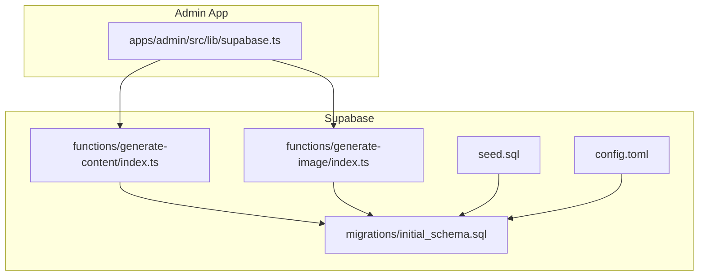
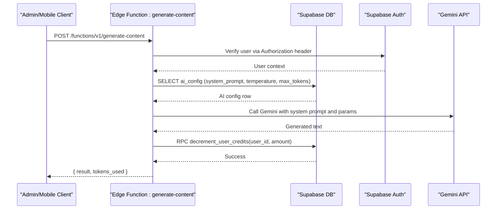
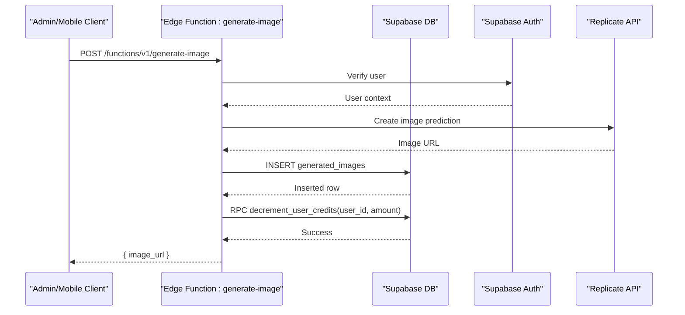
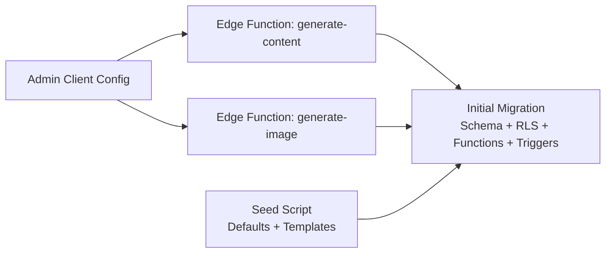
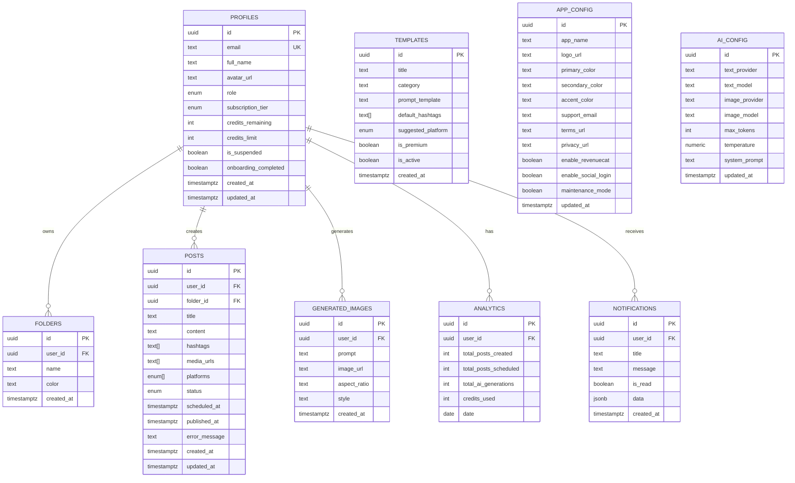

# Database Management & Migrations

<cite>
**Referenced Files in This Document**
- [config.toml](file://supabase/config.toml)
- [20240001000000_initial_schema.sql](file://supabase/migrations/20240001000000_initial_schema.sql)
- [seed.sql](file://supabase/seed.sql)
- [generate-content/index.ts](file://supabase/functions/generate-content/index.ts)
- [generate-image/index.ts](file://supabase/functions/generate-image/index.ts)
- [supabase.ts (admin client)](file://apps/admin/src/lib/supabase.ts)
- [INSTALLATION.md](file://INSTALLATION.md)
</cite>

## Table of Contents
1. [Introduction](#introduction)
2. [Project Structure](#project-structure)
3. [Core Components](#core-components)
4. [Architecture Overview](#architecture-overview)
5. [Detailed Component Analysis](#detailed-component-analysis)
6. [Dependency Analysis](#dependency-analysis)
7. [Performance Considerations](#performance-considerations)
8. [Troubleshooting Guide](#troubleshooting-guide)
9. [Conclusion](#conclusion)
10. [Appendices](#appendices)

## Introduction
This document provides comprehensive database management guidance for the Supabase backend used by SocialPilot AI Pro. It covers migration workflows, schema versioning, rollback procedures, seeding, backup and disaster recovery, Row Level Security policies, database functions and triggers, performance optimization, indexing strategies, query optimization, data export/import, monitoring health, and scaling considerations. The content is grounded in the repository’s Supabase configuration, migrations, seed data, and serverless functions.

## Project Structure
The database layer is defined under the supabase directory:
- Configuration file for local Supabase settings
- A single initial migration that defines enums, tables, Row Level Security policies, helper functions, triggers, and realtime publications
- Seed script to populate default app configuration, AI configuration, and starter templates
- Edge Functions that interact with the database to generate content and images, update analytics, and manage credits

**Diagram sources**
- [config.toml:1-2](file://supabase/config.toml#L1-L2)
- [20240001000000_initial_schema.sql:1-232](file://supabase/migrations/20240001000000_initial_schema.sql#L1-L232)
- [seed.sql:1-17](file://supabase/seed.sql#L1-L17)
- [generate-content/index.ts:1-99](file://supabase/functions/generate-content/index.ts#L1-L99)
- [generate-image/index.ts:1-87](file://supabase/functions/generate-image/index.ts#L1-L87)
- [supabase.ts (admin client):1-14](file://apps/admin/src/lib/supabase.ts#L1-L14)

**Section sources**
- [config.toml:1-2](file://supabase/config.toml#L1-L2)
- [20240001000000_initial_schema.sql:1-232](file://supabase/migrations/20240001000000_initial_schema.sql#L1-L232)
- [seed.sql:1-17](file://supabase/seed.sql#L1-L17)
- [generate-content/index.ts:1-99](file://supabase/functions/generate-content/index.ts#L1-L99)
- [generate-image/index.ts:1-87](file://supabase/functions/generate-image/index.ts#L1-L87)
- [supabase.ts (admin client):1-14](file://apps/admin/src/lib/supabase.ts#L1-L14)
- [INSTALLATION.md:22-30](file://INSTALLATION.md#L22-L30)

## Core Components
- Schema and security model:
  - Enums define roles, subscription tiers, post statuses, and platform types.
  - Tables include app_config, ai_config, profiles, folders, posts, templates, generated_images, analytics, notifications, and admin_logs.
  - Row Level Security (RLS) policies restrict access per user role and ownership.
- Helper function and trigger:
  - is_admin() checks if the current user has admin or super_admin privileges.
  - handle_new_user() creates a profile on auth.user insert and sets defaults from registration metadata.
- Realtime:
  - Publications enable real-time updates for key tables like posts, notifications, templates, and app_config.
- Seeding:
  - Default white-label branding, AI provider/model settings, and starter templates are inserted safely using conflict handling.
- Serverless functions:
  - Content generation reads AI config, calls external APIs, decrements user credits via an RPC call, and returns results.
  - Image generation stores generated images and decrements credits via RPC.

**Section sources**
- [20240001000000_initial_schema.sql:8-153](file://supabase/migrations/20240001000000_initial_schema.sql#L8-L153)
- [20240001000000_initial_schema.sql:155-203](file://supabase/migrations/20240001000000_initial_schema.sql#L155-L203)
- [20240001000000_initial_schema.sql:205-232](file://supabase/migrations/20240001000000_initial_schema.sql#L205-L232)
- [seed.sql:1-17](file://supabase/seed.sql#L1-L17)
- [generate-content/index.ts:38-84](file://supabase/functions/generate-content/index.ts#L38-L84)
- [generate-image/index.ts:64-74](file://supabase/functions/generate-image/index.ts#L64-L74)

## Architecture Overview
The database architecture centers around a secure, RLS-enforced schema with automated profile creation and real-time capabilities. Serverless functions orchestrate AI integrations while maintaining credit accounting through database RPCs.

**Diagram sources**
- [generate-content/index.ts:14-84](file://supabase/functions/generate-content/index.ts#L14-L84)
- [20240001000000_initial_schema.sql:31-42](file://supabase/migrations/20240001000000_initial_schema.sql#L31-L42)

**Diagram sources**
- [generate-image/index.ts:14-74](file://supabase/functions/generate-image/index.ts#L14-L74)
- [20240001000000_initial_schema.sql:111-120](file://supabase/migrations/20240001000000_initial_schema.sql#L111-L120)

## Detailed Component Analysis

### Migration Workflow and Schema Versioning
- Single initial migration defines the complete schema, including enums, tables, indexes (via constraints), RLS policies, helper functions, triggers, and realtime publications.
- Recommended practice: create one migration per change with a timestamped filename to maintain a clear version history and enable rollbacks by reversing changes.

Key elements in the initial migration:
- Enum definitions for roles, tiers, statuses, and platforms
- Core tables for app configuration, AI configuration, user profiles, folders, posts, templates, generated images, analytics, notifications, and admin logs
- RLS policies enforcing per-user and admin-only access patterns
- Trigger to auto-create profiles on user signup
- Realtime publications for live updates

**Section sources**
- [20240001000000_initial_schema.sql:8-153](file://supabase/migrations/20240001000000_initial_schema.sql#L8-L153)
- [20240001000000_initial_schema.sql:155-203](file://supabase/migrations/20240001000000_initial_schema.sql#L155-L203)
- [20240001000000_initial_schema.sql:205-232](file://supabase/migrations/20240001000000_initial_schema.sql#L205-L232)

### Rollback Procedures
- To rollback a migration, revert the corresponding SQL changes in a new migration or run inverse statements in the Supabase SQL Editor.
- For destructive changes (e.g., dropping columns), ensure backups exist before applying rollbacks.
- Use transactions where possible to group related changes and allow atomic rollback.

Note: The repository currently contains a single initial migration; future migrations should be additive and reversible.

**Section sources**
- [20240001000000_initial_schema.sql:1-232](file://supabase/migrations/20240001000000_initial_schema.sql#L1-L232)

### Database Seeding
- Seed script inserts default white-label branding, AI provider/model settings, and starter templates using conflict-safe inserts.
- Run after schema initialization to bootstrap application behavior without overwriting existing data.

Operational steps:
- Apply the initial migration first
- Then run the seed script to populate defaults

**Section sources**
- [seed.sql:1-17](file://supabase/seed.sql#L1-L17)
- [INSTALLATION.md:22-30](file://INSTALLATION.md#L22-L30)

### Backup Strategies and Disaster Recovery
- Use Supabase Dashboard or CLI to schedule regular backups and point-in-time recovery.
- Export critical tables (profiles, posts, analytics, notifications) periodically for compliance and auditing.
- Test restore procedures regularly to validate recovery time objectives (RTO) and recovery point objectives (RPO).
- Maintain environment-specific configurations and secrets securely outside the repository.

[No sources needed since this section provides general guidance]

### Row Level Security Policies
- RLS is enabled across all core tables.
- Policies enforce:
  - Users can read/update their own records (profiles, folders, posts, generated_images, notifications, analytics)
  - Admins have broader access for moderation and configuration
  - Templates are readable when active; only admins can modify them
  - Admin logs are restricted to admins

These policies protect multi-tenant data isolation and reduce risk of unauthorized access.

**Section sources**
- [20240001000000_initial_schema.sql:155-203](file://supabase/migrations/20240001000000_initial_schema.sql#L155-L203)

### Database Functions and Triggers
- is_admin(): Determines if the current authenticated user has admin or super_admin role. Used by RLS policies to grant elevated access.
- handle_new_user(): Automatically creates a profile entry upon user signup, copying email and optional metadata fields, and setting a default role.
- Realtime publications: Enable live updates for selected tables to support responsive UIs.

Best practices:
- Keep functions minimal and focused
- Use SECURITY DEFINER judiciously and audit permissions
- Ensure triggers do not introduce circular dependencies or excessive overhead

**Section sources**
- [20240001000000_initial_schema.sql:60-69](file://supabase/migrations/20240001000000_initial_schema.sql#L60-L69)
- [20240001000000_initial_schema.sql:205-232](file://supabase/migrations/20240001000000_initial_schema.sql#L205-L232)

### Data Export/Import Procedures
- Export:
  - Use Supabase Dashboard or CLI to dump schemas and data for specific environments.
  - Schedule periodic exports for compliance and archival.
- Import:
  - Restore dumps into target environments using Supabase tools.
  - Validate referential integrity and re-run seeds if necessary.
- Data governance:
  - Mask sensitive fields during export
  - Maintain import/export logs for audit trails

[No sources needed since this section provides general guidance]

### Monitoring Database Health
- Monitor connection counts, query latency, and error rates via Supabase dashboard metrics.
- Track slow queries and adjust indexes accordingly.
- Set up alerts for high CPU usage, disk space, and failed authentication attempts.
- Review RLS policy effectiveness and false positives/negatives.

[No sources needed since this section provides general guidance]

### Scaling Considerations
- Vertical scaling: Upgrade database tier for higher CPU/memory limits.
- Horizontal scaling: Use connection pooling and caching layers where appropriate.
- Query optimization: Add indexes, avoid N+1 queries, use pagination.
- Realtime scaling: Limit published tables and channels to essential data.

[No sources needed since this section provides general guidance]

## Dependency Analysis
The following diagram shows how components depend on each other:

**Diagram sources**
- [20240001000000_initial_schema.sql:1-232](file://supabase/migrations/20240001000000_initial_schema.sql#L1-L232)
- [seed.sql:1-17](file://supabase/seed.sql#L1-L17)
- [generate-content/index.ts:1-99](file://supabase/functions/generate-content/index.ts#L1-L99)
- [generate-image/index.ts:1-87](file://supabase/functions/generate-image/index.ts#L1-L87)
- [supabase.ts (admin client):1-14](file://apps/admin/src/lib/supabase.ts#L1-L14)

**Section sources**
- [20240001000000_initial_schema.sql:1-232](file://supabase/migrations/20240001000000_initial_schema.sql#L1-L232)
- [seed.sql:1-17](file://supabase/seed.sql#L1-L17)
- [generate-content/index.ts:1-99](file://supabase/functions/generate-content/index.ts#L1-L99)
- [generate-image/index.ts:1-87](file://supabase/functions/generate-image/index.ts#L1-L87)
- [supabase.ts (admin client):1-14](file://apps/admin/src/lib/supabase.ts#L1-L14)

## Performance Considerations
- Indexes:
  - Ensure foreign keys and frequently filtered columns are indexed (e.g., user_id on posts, notifications, generated_images, analytics).
  - Add composite indexes for common query patterns (e.g., user_id + date for analytics).
- Queries:
  - Prefer selective WHERE clauses and LIMIT/OFFSET or cursor-based pagination.
  - Avoid selecting unnecessary columns; project only what is needed.
- Realtime:
  - Publish only required tables to minimize bandwidth and processing overhead.
- Functions:
  - Cache expensive computations or external API responses when feasible.
  - Use idempotent operations for retries.

[No sources needed since this section provides general guidance]

## Troubleshooting Guide
Common issues and resolutions:
- Unauthorized errors in edge functions:
  - Ensure Authorization header is passed correctly and user session is valid.
  - Check environment variables for SUPABASE_URL and SUPABASE_ANON_KEY.
- Missing RPC function:
  - The functions reference decrement_user_credits; ensure this function exists in the database and is callable by authenticated users.
- RLS blocking access:
  - Verify policies allow the intended operations for the current user role.
  - Use is_admin() checks appropriately for admin-only actions.
- Realtime not updating:
  - Confirm tables are included in the realtime publication.
  - Check network connectivity and client subscriptions.

**Section sources**
- [generate-content/index.ts:14-27](file://supabase/functions/generate-content/index.ts#L14-L27)
- [generate-image/index.ts:14-27](file://supabase/functions/generate-image/index.ts#L14-L27)
- [20240001000000_initial_schema.sql:155-203](file://supabase/migrations/20240001000000_initial_schema.sql#L155-L203)
- [20240001000000_initial_schema.sql:227-232](file://supabase/migrations/20240001000000_initial_schema.sql#L227-L232)

## Conclusion
The Supabase backend for SocialPilot AI Pro uses a well-structured schema with strong security via RLS, automated user provisioning, and serverless functions for AI integrations. Adhering to migration best practices, implementing robust backups and monitoring, and optimizing queries and indexes will ensure reliability and scalability. Future enhancements should focus on incremental migrations, comprehensive testing, and observability.

[No sources needed since this section summarizes without analyzing specific files]

## Appendices

### Appendix A: Key Tables and Relationships

**Diagram sources**
- [20240001000000_initial_schema.sql:14-153](file://supabase/migrations/20240001000000_initial_schema.sql#L14-L153)