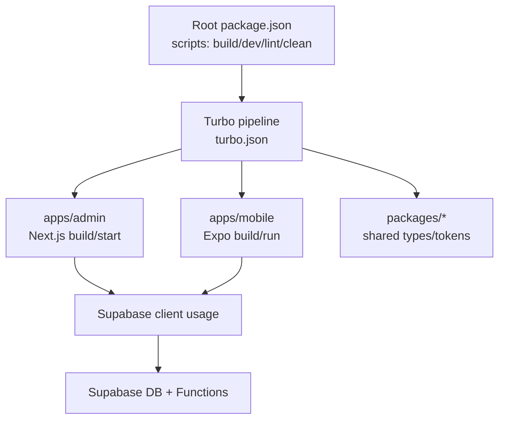
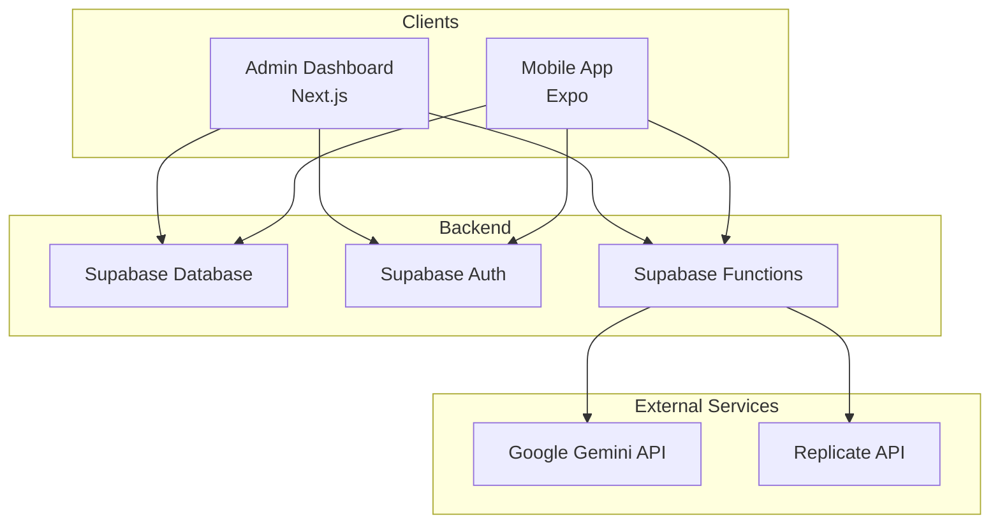
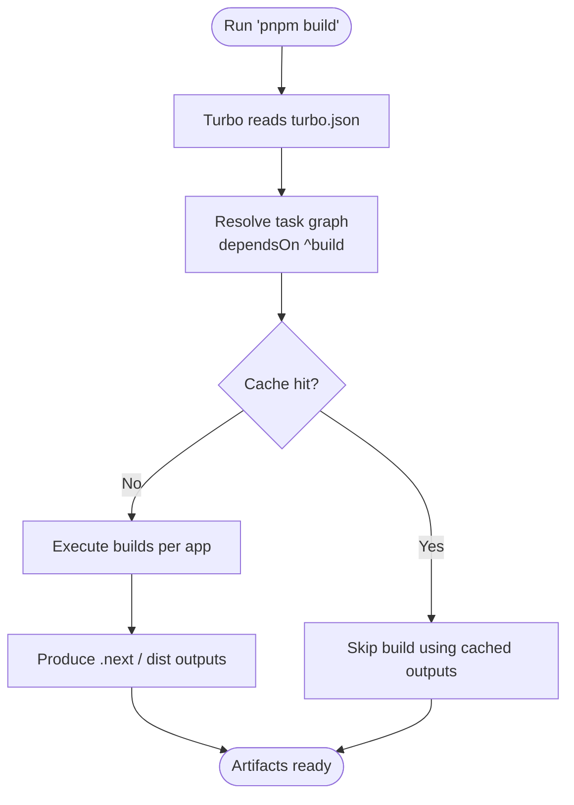
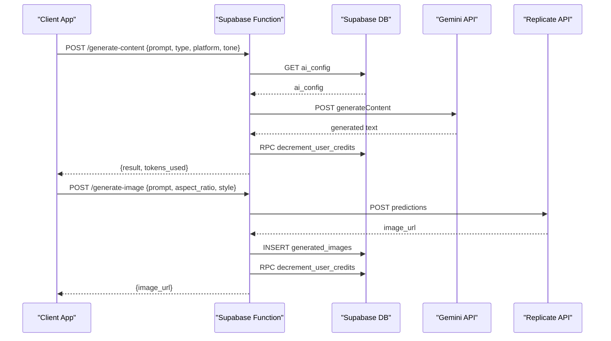
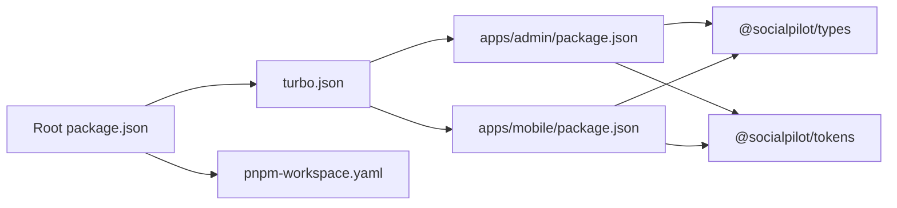

# Deployment & DevOps

<cite>
**Referenced Files in This Document**
- [turbo.json](file://turbo.json)
- [package.json](file://package.json)
- [pnpm-workspace.yaml](file://pnpm-workspace.yaml)
- [apps/admin/package.json](file://apps/admin/package.json)
- [apps/mobile/package.json](file://apps/mobile/package.json)
- [apps/mobile/eas.json](file://apps/mobile/eas.json)
- [apps/mobile/app.config.ts](file://apps/mobile/app.config.ts)
- [supabase/migrations/20240001000000_initial_schema.sql](file://supabase/migrations/20240001000000_initial_schema.sql)
- [supabase/functions/generate-content/index.ts](file://supabase/functions/generate-content/index.ts)
- [supabase/functions/generate-image/index.ts](file://supabase/functions/generate-image/index.ts)
- [INSTALLATION.md](file://INSTALLATION.md)
</cite>

## Table of Contents
1. Introduction
2. Project Structure
3. Core Components
4. Architecture Overview
5. Detailed Component Analysis
6. Dependency Analysis
7. Performance Considerations
8. Troubleshooting Guide
9. Conclusion
10. Appendices

## Introduction
This document provides comprehensive deployment and DevOps guidance for SocialPilot AI Pro, a monorepo containing:
- Admin dashboard (Next.js)
- Mobile application (Expo/EAS Build)
- Supabase backend with database migrations and serverless functions
It covers build pipelines with Turborepo, environment configuration, secrets management, CI/CD setup, database migrations, backups, disaster recovery, monitoring/logging, performance optimization, scaling, production troubleshooting, debugging, maintenance, infrastructure requirements, and third-party service configurations.

## Project Structure
SocialPilot AI Pro is organized as a pnpm workspace with Turborepo orchestrating builds across apps and packages:
- apps/admin: Next.js admin dashboard
- apps/mobile: Expo-based mobile app
- supabase: Database migrations, seed data, and serverless functions
- packages: Shared types and tokens

Turborepo defines global dependencies, pipeline tasks, caching outputs, and task ordering to ensure efficient incremental builds and consistent cross-app behavior.

**Diagram sources**
- [package.json:9-15](file://package.json#L9-L15)
- [turbo.json:1-26](file://turbo.json#L1-L26)
- [apps/admin/package.json:5-9](file://apps/admin/package.json#L5-L9)
- [apps/mobile/package.json:5-12](file://apps/mobile/package.json#L5-L12)

**Section sources**
- [package.json:1-21](file://package.json#L1-L21)
- [turbo.json:1-26](file://turbo.json#L1-L26)
- [pnpm-workspace.yaml:1-4](file://pnpm-workspace.yaml#L1-L4)

## Core Components
- Monorepo orchestration: pnpm workspaces define the scope; Turbo runs tasks across apps and packages with caching and dependency ordering.
- Admin dashboard: Next.js app with scripts for dev, build, start, and lint.
- Mobile app: Expo app with development, preview, and production build profiles via EAS.
- Backend: Supabase project with schema migrations, RLS policies, triggers, and serverless functions for AI content/image generation.

Key responsibilities:
- Turborepo ensures deterministic builds and caches artifacts like .next and dist directories.
- Next.js handles server-side rendering and API routes if needed.
- Expo manages mobile builds and distribution through EAS.
- Supabase provides auth, database, storage, and edge functions.

**Section sources**
- [turbo.json:6-24](file://turbo.json#L6-L24)
- [apps/admin/package.json:5-9](file://apps/admin/package.json#L5-L9)
- [apps/mobile/package.json:5-12](file://apps/mobile/package.json#L5-L12)
- [apps/mobile/eas.json:5-17](file://apps/mobile/eas.json#L5-L17)
- [supabase/migrations/20240001000000_initial_schema.sql:1-232](file://supabase/migrations/20240001000000_initial_schema.sql#L1-L232)

## Architecture Overview
High-level architecture shows how clients interact with Supabase services and external AI providers via serverless functions.

**Diagram sources**
- [apps/admin/package.json:11-31](file://apps/admin/package.json#L11-L31)
- [apps/mobile/package.json:13-44](file://apps/mobile/package.json#L13-L44)
- [supabase/functions/generate-content/index.ts:1-99](file://supabase/functions/generate-content/index.ts#L1-L99)
- [supabase/functions/generate-image/index.ts:1-87](file://supabase/functions/generate-image/index.ts#L1-L87)

## Detailed Component Analysis

### Turborepo Build Pipeline
- Global dependencies include local env files to invalidate cache when secrets change.
- Build depends on upstream package builds and caches Next.js output (.next) and generic dist folders.
- Lint runs with dependency ordering; dev is persistent and uncached for live feedback.

**Diagram sources**
- [turbo.json:1-26](file://turbo.json#L1-L26)
- [package.json:9-15](file://package.json#L9-L15)

**Section sources**
- [turbo.json:1-26](file://turbo.json#L1-L26)
- [package.json:9-15](file://package.json#L9-L15)

### Admin Dashboard (Next.js) Deployment
- Scripts provide dev, build, start, and lint commands.
- Environment variables are expected for Supabase URL and anon key.
- Recommended deployment targets: Vercel or any Node runtime that supports Next.js static/serverless builds.

Environment configuration:
- NEXT_PUBLIC_SUPABASE_URL
- NEXT_PUBLIC_SUPABASE_ANON_KEY

Secrets management:
- Store Supabase keys in your platform’s secret store (e.g., Vercel environment variables).
- Avoid committing secrets; use .env.local for local development only.

CI/CD considerations:
- Use pnpm with Turborepo to run build and tests.
- Cache node_modules and Turborepo cache between runs.
- Deploy after successful build.

**Section sources**
- [apps/admin/package.json:5-9](file://apps/admin/package.json#L5-L9)
- [INSTALLATION.md:42-46](file://INSTALLATION.md#L42-L46)

### Mobile Application (Expo/EAS Build) Deployment
- EAS profiles: development, preview, production.
- App metadata configured via app.config.ts including bundle identifiers and scheme.
- Secrets for Supabase should be provided at build time or via EAS secrets.

Environment configuration:
- EXPO_PUBLIC_SUPABASE_URL
- EXPO_PUBLIC_SUPABASE_ANON_KEY
- EXPO_PUBLIC_APP_NAME

EAS secrets:
- Configure Supabase credentials in EAS project settings.
- For image/content generation, configure external provider tokens in Supabase function secrets.

CI/CD considerations:
- Trigger EAS builds on tag or branch.
- Use EAS CLI to build and submit to stores.
- Keep eas.json minimal and rely on environment-driven config.

**Section sources**
- [apps/mobile/eas.json:5-17](file://apps/mobile/eas.json#L5-L17)
- [apps/mobile/app.config.ts:3-41](file://apps/mobile/app.config.ts#L3-L41)
- [apps/mobile/package.json:5-12](file://apps/mobile/package.json#L5-L12)
- [INSTALLATION.md:35-40](file://INSTALLATION.md#L35-L40)

### Supabase Database Migrations
- Initial schema includes enums, tables, RLS policies, triggers, and realtime publications.
- Apply migration via SQL Editor or CLI; then apply seed data.

Migration process:
- Run initial schema migration file.
- Run seed data to populate defaults.
- Verify RLS policies and roles.

Backup strategy:
- Use Supabase native backups and point-in-time recovery.
- Schedule regular exports of critical tables (profiles, posts, analytics).

Disaster recovery:
- Restore from latest backup.
- Re-apply migrations if schema drift occurs.
- Validate RLS policies and triggers post-restore.

**Section sources**
- [supabase/migrations/20240001000000_initial_schema.sql:1-232](file://supabase/migrations/20240001000000_initial_schema.sql#L1-L232)
- [INSTALLATION.md:22-30](file://INSTALLATION.md#L22-L30)

### Serverless Functions (AI Content/Image Generation)
- generate-content: Authenticates user, fetches AI config, calls Google Gemini, decrements credits, returns generated text.
- generate-image: Authenticates user, calls Replicate for image generation, stores result, decrements credits.

Secrets required:
- SUPABASE_URL, SUPABASE_ANON_KEY (injected by Supabase)
- GEMINI_API_KEY (for content generation)
- REPLICATE_API_TOKEN (for image generation)

Error handling:
- Unauthorized responses when user not authenticated.
- Validation errors for missing prompts.
- 500 responses for unexpected failures.

**Diagram sources**
- [supabase/functions/generate-content/index.ts:1-99](file://supabase/functions/generate-content/index.ts#L1-L99)
- [supabase/functions/generate-image/index.ts:1-87](file://supabase/functions/generate-image/index.ts#L1-L87)

**Section sources**
- [supabase/functions/generate-content/index.ts:1-99](file://supabase/functions/generate-content/index.ts#L1-L99)
- [supabase/functions/generate-image/index.ts:1-87](file://supabase/functions/generate-image/index.ts#L1-L87)

## Dependency Analysis
- Root package.json declares workspaces and scripts that delegate to Turborepo.
- pnpm-workspace.yaml scopes apps and packages.
- Each app declares its own dependencies; shared packages referenced via workspace protocol.

**Diagram sources**
- [package.json:5-15](file://package.json#L5-L15)
- [pnpm-workspace.yaml:1-4](file://pnpm-workspace.yaml#L1-L4)
- [apps/admin/package.json:11-15](file://apps/admin/package.json#L11-L15)
- [apps/mobile/package.json:13-15](file://apps/mobile/package.json#L13-L15)

**Section sources**
- [package.json:5-15](file://package.json#L5-L15)
- [pnpm-workspace.yaml:1-4](file://pnpm-workspace.yaml#L1-L4)

## Performance Considerations
- Turborepo caching: Leverage built-in caching for .next and dist outputs to speed up CI and local builds.
- Next.js optimizations: Use static generation where possible; enable incremental static regeneration for dynamic pages.
- Mobile app: Minimize bundle size; tree-shake unused libraries; use expo image optimizations.
- Database: Ensure indexes on frequently queried columns; use RLS efficiently; avoid heavy queries in loops.
- External APIs: Implement retries and timeouts for Gemini and Replicate calls; cache results when appropriate.

[No sources needed since this section provides general guidance]

## Troubleshooting Guide
Common issues and resolutions:
- Missing environment variables: Ensure Supabase URL and anon key are set for both admin and mobile apps.
- Authentication failures: Verify Authorization header propagation in Supabase functions and correct user session state.
- Build failures: Check Turborepo cache invalidation; clear node_modules and rebuild if necessary.
- EAS build errors: Validate eas.json profiles and ensure secrets are configured in EAS project settings.
- Database errors: Confirm migrations applied successfully; check RLS policies and triggers.

Debugging approaches:
- Local development: Run apps with verbose logging; inspect network requests and Supabase logs.
- CI/CD: Capture build logs and artifact outputs; fail fast on lint/type errors.
- Production: Monitor error rates and latency; correlate with deployment versions.

Maintenance procedures:
- Regularly update dependencies and security patches.
- Review and rotate secrets periodically.
- Audit database migrations and rollback plans.

**Section sources**
- [INSTALLATION.md:35-46](file://INSTALLATION.md#L35-L46)
- [supabase/functions/generate-content/index.ts:21-27](file://supabase/functions/generate-content/index.ts#L21-L27)
- [supabase/functions/generate-image/index.ts:21-27](file://supabase/functions/generate-image/index.ts#L21-L27)

## Conclusion
SocialPilot AI Pro leverages a modern monorepo architecture with Turborepo for efficient builds, Next.js for the admin dashboard, Expo/EAS for mobile deployments, and Supabase for backend services. Proper environment configuration, secrets management, CI/CD automation, database migrations, backups, and monitoring are essential for reliable production operations. Follow the guidelines above to deploy, scale, and maintain the system effectively.

[No sources needed since this section summarizes without analyzing specific files]

## Appendices

### Infrastructure Requirements
- Node.js v18+ or v20+
- pnpm package manager
- Supabase account and project
- EAS account for mobile builds and submissions
- External API keys for Gemini and Replicate (configured in Supabase function secrets)

**Section sources**
- [INSTALLATION.md:7-10](file://INSTALLATION.md#L7-L10)

### Third-Party Service Configurations
- Supabase: Project URL and anon key for client apps; function secrets for API keys.
- Google Gemini: API key for content generation.
- Replicate: API token for image generation.

**Section sources**
- [supabase/functions/generate-content/index.ts:49-79](file://supabase/functions/generate-content/index.ts#L49-L79)
- [supabase/functions/generate-image/index.ts:38-62](file://supabase/functions/generate-image/index.ts#L38-L62)
- [INSTALLATION.md:27-46](file://INSTALLATION.md#L27-L46)

### CI/CD Pipeline Setup Recommendations
- Use GitHub Actions or similar:
  - Install pnpm and dependencies
  - Run lint and type checks
  - Execute Turborepo build
  - Deploy Next.js to Vercel or equivalent
  - Trigger EAS builds for mobile
- Cache node_modules and Turborepo cache to accelerate builds.
- Protect main branch and require passing CI before merges.

[No sources needed since this section provides general guidance]

### Monitoring and Logging
- Centralize logs from Next.js and Supabase functions.
- Set up error tracking (e.g., Sentry) for frontend and mobile.
- Monitor Supabase metrics and function invocation logs.
- Alert on high error rates and degraded performance.

[No sources needed since this section provides general guidance]

### Scaling Considerations
- Horizontal scaling for Next.js via managed platforms.
- Database scaling with Supabase managed instances; consider read replicas if needed.
- Rate limiting and quotas for external AI APIs.
- Optimize mobile app bundle and network requests.

[No sources needed since this section provides general guidance]