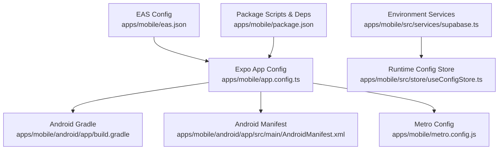
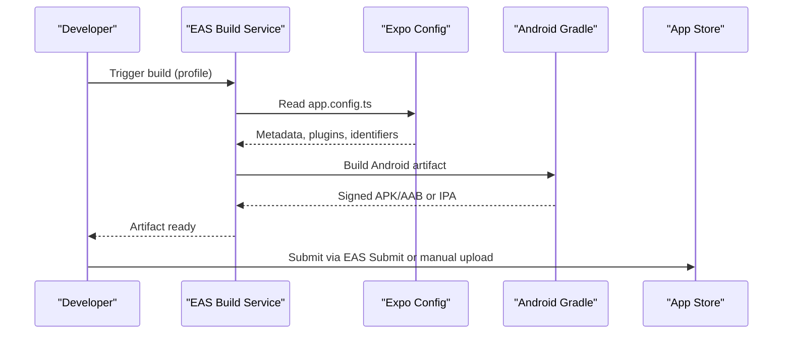
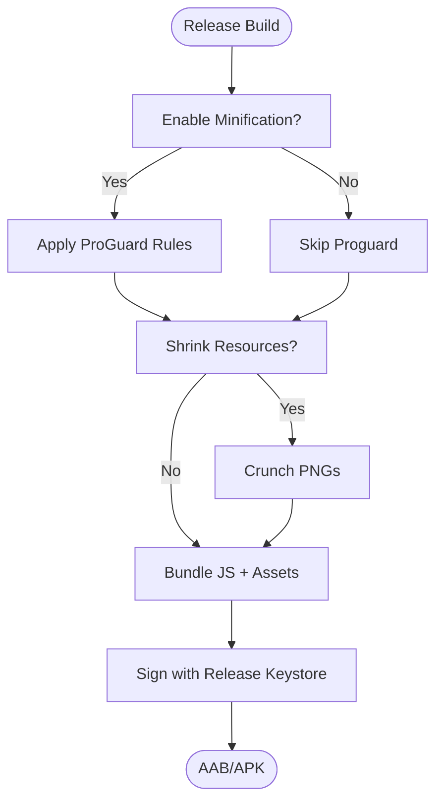
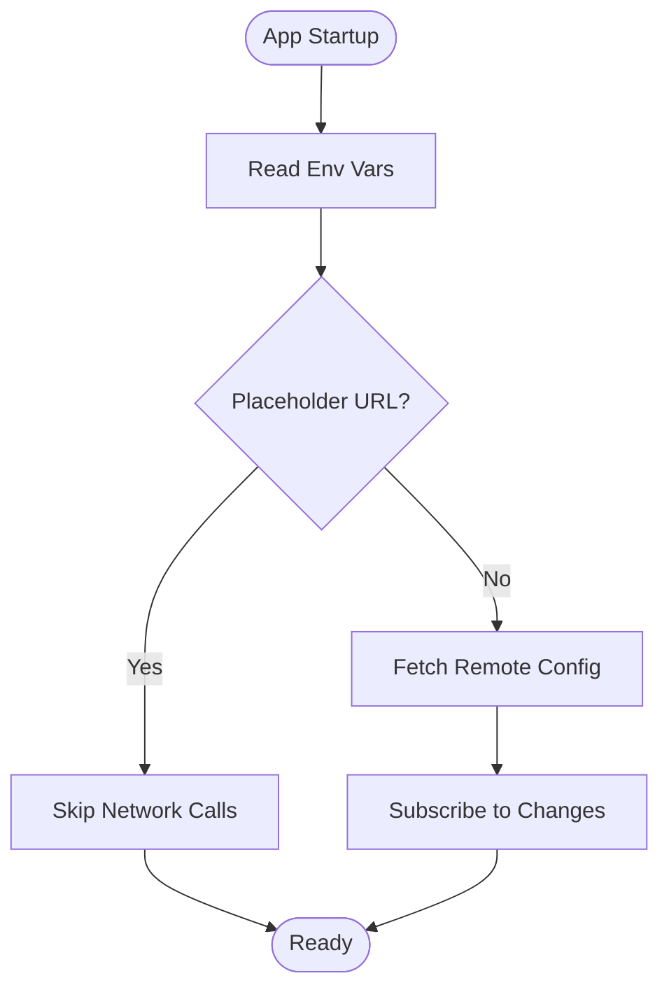
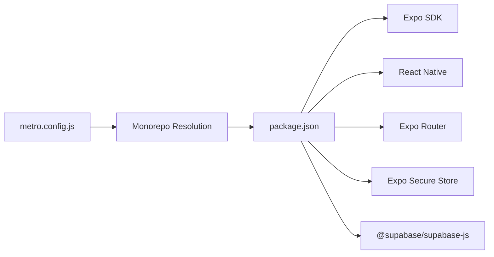

# Mobile Application Deployment

<cite>
**Referenced Files in This Document**
- [eas.json](file://apps/mobile/eas.json)
- [app.config.ts](file://apps/mobile/app.config.ts)
- [package.json](file://apps/mobile/package.json)
- [android/build.gradle](file://apps/mobile/android/build.gradle)
- [android/gradle.properties](file://apps/mobile/android/gradle.properties)
- [android/app/build.gradle](file://apps/mobile/android/app/build.gradle)
- [AndroidManifest.xml](file://apps/mobile/android/app/src/main/AndroidManifest.xml)
- [metro.config.js](file://apps/mobile/metro.config.js)
- [supabase.ts](file://apps/mobile/src/services/supabase.ts)
- [useConfigStore.ts](file://apps/mobile/src/store/useConfigStore.ts)
</cite>

## Table of Contents
1. [Introduction](#introduction)
2. [Project Structure](#project-structure)
3. [Core Components](#core-components)
4. [Architecture Overview](#architecture-overview)
5. [Detailed Component Analysis](#detailed-component-analysis)
6. [Dependency Analysis](#dependency-analysis)
7. [Performance Considerations](#performance-considerations)
8. [Troubleshooting Guide](#troubleshooting-guide)
9. [Conclusion](#conclusion)
10. [Appendices](#appendices)

## Introduction
This document provides deployment guidance for the Expo/React Native mobile application with a focus on EAS Build configuration, code signing, provisioning profiles, app store submission processes, environment-specific builds, feature flags, build optimizations, over-the-air updates, crash reporting, analytics setup, platform-specific configurations, native module dependencies, and pre-deployment testing procedures. It is intended for developers and release engineers who need to produce production-ready iOS and Android builds and submit them to the Apple App Store and Google Play Store.

## Project Structure
The mobile application resides under apps/mobile and uses Expo Router with a modern React Native stack. Key deployment-related files include:
- EAS configuration for build and submit profiles
- Expo app configuration for identifiers, icons, splash, and plugins
- Android Gradle configuration for build types, signing, and optimization
- Metro configuration for bundling within a monorepo
- Environment-driven service configuration for Supabase client usage

**Diagram sources**
- [eas.json:1-18](file://apps/mobile/eas.json#L1-L18)
- [app.config.ts:1-42](file://apps/mobile/app.config.ts#L1-L42)
- [android/app/build.gradle:84-123](file://apps/mobile/android/app/build.gradle#L84-L123)
- [AndroidManifest.xml:1-32](file://apps/mobile/android/app/src/main/AndroidManifest.xml#L1-L32)
- [metro.config.js:1-22](file://apps/mobile/metro.config.js#L1-L22)
- [supabase.ts:1-41](file://apps/mobile/src/services/supabase.ts#L1-L41)
- [useConfigStore.ts:1-67](file://apps/mobile/src/store/useConfigStore.ts#L1-L67)
- [package.json:1-53](file://apps/mobile/package.json#L1-L53)

**Section sources**
- [eas.json:1-18](file://apps/mobile/eas.json#L1-L18)
- [app.config.ts:1-42](file://apps/mobile/app.config.ts#L1-L42)
- [package.json:1-53](file://apps/mobile/package.json#L1-L53)
- [android/app/build.gradle:84-123](file://apps/mobile/android/app/build.gradle#L84-L123)
- [AndroidManifest.xml:1-32](file://apps/mobile/android/app/src/main/AndroidManifest.xml#L1-L32)
- [metro.config.js:1-22](file://apps/mobile/metro.config.js#L1-L22)
- [supabase.ts:1-41](file://apps/mobile/src/services/supabase.ts#L1-L41)
- [useConfigStore.ts:1-67](file://apps/mobile/src/store/useConfigStore.ts#L1-L67)

## Core Components
- EAS Build Profiles: development, preview, and production are defined for internal distribution and local development clients.
- Expo App Configuration: defines app identity (bundle identifier/package), scheme, splash, plugins, and new architecture enablement.
- Android Build System: Gradle configuration includes build types, signing configs, minification/shrinking toggles, and packaging options.
- Runtime Environment: Supabase client initialization reads environment variables and adapts storage per platform; config store fetches runtime settings and subscribes to changes.

Key responsibilities:
- EAS orchestrates cloud builds and submissions.
- Expo config centralizes metadata and plugin registration.
- Android Gradle controls native build behavior and optimization.
- Runtime services ensure correct environment wiring and dynamic configuration.

**Section sources**
- [eas.json:1-18](file://apps/mobile/eas.json#L1-L18)
- [app.config.ts:1-42](file://apps/mobile/app.config.ts#L1-L42)
- [android/app/build.gradle:84-123](file://apps/mobile/android/app/build.gradle#L84-L123)
- [supabase.ts:1-41](file://apps/mobile/src/services/supabase.ts#L1-L41)
- [useConfigStore.ts:1-67](file://apps/mobile/src/store/useConfigStore.ts#L1-L67)

## Architecture Overview
The deployment pipeline integrates EAS, Expo config, and native build tooling to produce signed artifacts for each platform. The runtime layer loads environment-specific values and optionally fetches remote configuration at startup.

**Diagram sources**
- [eas.json:1-18](file://apps/mobile/eas.json#L1-L18)
- [app.config.ts:1-42](file://apps/mobile/app.config.ts#L1-L42)
- [android/app/build.gradle:84-123](file://apps/mobile/android/app/build.gradle#L84-L123)

## Detailed Component Analysis

### EAS Build and Submission
- Build profiles:
  - development: development client enabled, internal distribution
  - preview: internal distribution
  - production: standard production build
- Submit profile: production submission configuration exists for automated store submission.

Operational notes:
- Use EAS CLI version constraints to ensure compatibility.
- For production builds, configure code signing and provisioning through EAS credentials or local machine keys depending on your workflow.

**Section sources**
- [eas.json:1-18](file://apps/mobile/eas.json#L1-L18)

### Expo App Configuration
- Identifiers: bundle identifier for iOS and package name for Android are set consistently.
- Scheme: deep linking scheme configured for URL handling.
- Plugins: router, secure store, and font plugin registered.
- New architecture: enabled for improved performance.
- Splash screen and icon assets referenced for consistent branding.

**Section sources**
- [app.config.ts:1-42](file://apps/mobile/app.config.ts#L1-L42)

### Android Build Configuration and Signing
- Build types:
  - debug: uses default debug keystore
  - release: supports resource shrinking, minification, PNG crunching, and ProGuard rules
- Signing:
  - Debug signing configured by default
  - Release signing should be updated to use a secure keystore for production
- Packaging:
  - JNI libraries packaging option controlled by a property
  - Hermes enabled for JS engine optimization
- Architectures: multiple ABIs included for broader device support

**Diagram sources**
- [android/app/build.gradle:108-123](file://apps/mobile/android/app/build.gradle#L108-L123)
- [android/gradle.properties:33-42](file://apps/mobile/android/gradle.properties#L33-L42)

**Section sources**
- [android/app/build.gradle:84-123](file://apps/mobile/android/app/build.gradle#L84-L123)
- [android/gradle.properties:1-63](file://apps/mobile/android/gradle.properties#L1-L63)
- [android/build.gradle:1-25](file://apps/mobile/android/build.gradle#L1-L25)

### Android Manifest and Permissions
- Permissions: internet, external storage read/write (with maxSdkVersion constraints), system alert window, vibrate
- Deep linking: custom scheme intent filter configured
- Updates: Expo Updates meta tags present; currently disabled for OTA updates in this manifest

**Section sources**
- [AndroidManifest.xml:1-32](file://apps/mobile/android/app/src/main/AndroidManifest.xml#L1-L32)

### Metro Bundler Configuration
- Monorepo-aware: watches workspace root and resolves node_modules from both app and monorepo roots
- Disables hierarchical lookup to resolve nested packages correctly

**Section sources**
- [metro.config.js:1-22](file://apps/mobile/metro.config.js#L1-L22)

### Environment-Specific Builds and Feature Flags
- Supabase client initializes using environment variables for URL and anon key
- Placeholder detection prevents network calls during local development
- Config store fetches runtime configuration and subscribes to real-time updates when not using placeholder URLs

**Diagram sources**
- [supabase.ts:1-41](file://apps/mobile/src/services/supabase.ts#L1-L41)
- [useConfigStore.ts:1-67](file://apps/mobile/src/store/useConfigStore.ts#L1-L67)

**Section sources**
- [supabase.ts:1-41](file://apps/mobile/src/services/supabase.ts#L1-L41)
- [useConfigStore.ts:1-67](file://apps/mobile/src/store/useConfigStore.ts#L1-L67)

### Over-the-Air Updates
- Expo Updates metadata is present in the Android manifest
- In this configuration, OTA updates are disabled by default; enabling requires updating manifest values and configuring EAS Update channels and update URLs

**Section sources**
- [AndroidManifest.xml:14-18](file://apps/mobile/android/app/src/main/AndroidManifest.xml#L14-L18)

### Crash Reporting and Analytics Setup
- No crash reporting or analytics SDKs are explicitly configured in the analyzed files
- Recommended next steps:
  - Integrate a crash reporting solution compatible with Expo/React Native
  - Add analytics SDKs and initialize them conditionally based on environment
  - Ensure privacy and data collection policies comply with store guidelines

[No sources needed since this section provides general guidance]

### Platform-Specific Configurations and Native Module Dependencies
- iOS:
  - Bundle identifier is set; iOS project generation and signing typically handled by EAS or Xcode
  - Ensure required capabilities and entitlements are configured in the Apple Developer portal
- Android:
  - Package name matches iOS bundle identifier pattern for consistency
  - Hermes enabled; multiple ABIs included
  - External repositories configured for third-party modules

**Section sources**
- [app.config.ts:17-27](file://apps/mobile/app.config.ts#L17-L27)
- [android/gradle.properties:28-42](file://apps/mobile/android/gradle.properties#L28-L42)
- [android/build.gradle:1-25](file://apps/mobile/android/build.gradle#L1-L25)

### Testing Procedures Before Deployment
- Local development:
  - Use development profile to run locally with development client
- Preview builds:
  - Generate preview builds for internal testers
- Production:
  - Validate release build with minification and resource shrinking enabled
  - Verify signing configuration and permissions
  - Test deep linking and runtime configuration loading

**Section sources**
- [eas.json:5-13](file://apps/mobile/eas.json#L5-L13)
- [android/app/build.gradle:108-123](file://apps/mobile/android/app/build.gradle#L108-L123)
- [AndroidManifest.xml:14-30](file://apps/mobile/android/app/src/main/AndroidManifest.xml#L14-L30)

## Dependency Analysis
The mobile app depends on Expo ecosystem packages and React Native core libraries. Metro is configured to work within a monorepo context, ensuring correct resolution of shared packages.

**Diagram sources**
- [package.json:13-45](file://apps/mobile/package.json#L13-L45)
- [metro.config.js:1-22](file://apps/mobile/metro.config.js#L1-L22)

**Section sources**
- [package.json:1-53](file://apps/mobile/package.json#L1-L53)
- [metro.config.js:1-22](file://apps/mobile/metro.config.js#L1-L22)

## Performance Considerations
- Enable Hermes for faster JS execution and smaller bundles on Android
- Use minification and resource shrinking in release builds to reduce APK size
- Include only necessary ABIs for production to minimize install size
- Avoid heavy animations or unnecessary assets in critical paths
- Leverage EAS Build caching to speed up CI pipelines

[No sources needed since this section provides general guidance]

## Troubleshooting Guide
Common issues and resolutions:
- Build failures due to missing credentials:
  - Ensure EAS credentials are configured for code signing and provisioning
- OTA updates not applying:
  - Confirm manifest settings and EAS Update channel configuration
- Runtime errors with placeholder URLs:
  - Verify environment variables are set correctly for non-placeholder environments
- Long build times:
  - Optimize Gradle properties and enable parallel builds
- Deep linking not working:
  - Validate scheme in app config and manifest intent filters

**Section sources**
- [eas.json:1-18](file://apps/mobile/eas.json#L1-L18)
- [AndroidManifest.xml:14-30](file://apps/mobile/android/app/src/main/AndroidManifest.xml#L14-L30)
- [supabase.ts:28-41](file://apps/mobile/src/services/supabase.ts#L28-L41)
- [android/gradle.properties:15-18](file://apps/mobile/android/gradle.properties#L15-L18)

## Conclusion
This deployment guide outlines how to configure EAS builds, manage code signing and provisioning, prepare Android builds for production, and handle environment-specific runtime behavior. While OTA updates are currently disabled in the manifest, they can be enabled with additional configuration. Integrating crash reporting and analytics will further improve observability. Follow the outlined testing procedures to validate builds before submission to app stores.

[No sources needed since this section summarizes without analyzing specific files]

## Appendices

### EAS Build Commands Reference
- Development client: use development profile
- Preview builds: use preview profile for internal testing
- Production builds: use production profile and configure signing

**Section sources**
- [eas.json:5-13](file://apps/mobile/eas.json#L5-L13)

### Android Signing Checklist
- Replace debug keystore with a secure release keystore
- Configure signing in Gradle for release builds
- Verify ProGuard rules do not strip required classes
- Test installation and functionality on target devices

**Section sources**
- [android/app/build.gradle:100-123](file://apps/mobile/android/app/build.gradle#L100-L123)